# Digital Circuit

Thursday noon 12:30~13:00 for asking

邮箱 yahui_zhao@tongji.edu.cn

数字电路中，晶体管一般工作在截止区和饱和区，起到开关的作用。

一些数字信号：

- 尖顶波
- 方波

---

数字信号的表示方法

- 电平型信号：低电平表示 0，高电平表示 1. 用时间节拍作为一个单位。
- 脉冲型信号：有脉冲为 1，无脉冲为 0.
- ~~电流信号：少~~

5G 指的就是时间节拍的频率。频率越高，信息量越大。

---

A/D transformation.

sample -> quantize

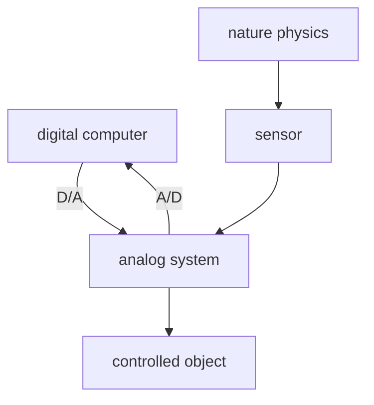
digital computer: store, analyze, control.

---

Digital electronic tech:

- encoding
- calculate
- memorize
- count
- store
- measure
- transform

---

Properties

- binary
- easy to integrate
- resistance to noise
- easy to restore and keep secret
- general

---

Content

- 布尔代数
- 逻辑门电路
- 组合逻辑电路
- 触发器
- 时序逻辑电路

---

## 1. 基本数字逻辑

---

### 进制

- Decimal
- Binary
- Octal
- Hexadecimal: (0-9A-F)

---

| Dec | Bin  | Oct | Hex | Dec | Bin  | Oct | Hex |
|:---:|:----:|:---:|:---:|:---:|:----:|:---:|:---:|
|  0  | 0000 | 00  |  0  |  8  | 1000 | 10  |  8  |
|  1  | 0001 | 01  |  1  |  9  | 1001 | 11  |  9  |
|  2  | 0010 | 02  |  2  | 10  | 1010 | 12  |  A  |
|  3  | 0011 | 03  |  3  | 11  | 1011 | 13  |  B  |
|  4  | 0100 | 04  |  4  | 12  | 1100 | 14  |  C  |
|  5  | 0101 | 05  |  5  | 13  | 1101 | 15  |  D  |
|  6  | 0110 | 06  |  6  | 14  | 1110 | 16  |  E  |
|  7  | 0111 | 07  |  7  | 15  | 1111 | 17  |  F  |

---

乘法取整

$$
\begin{align*}
&(0.39)_{10} = (?)_{2}\\
&0.39 \times 2 = 0.78 \rightarrow 0\\
&0.78 \times 2 = 1.56 \rightarrow 1\\
&0.56 \times 2 = 1.12 \rightarrow 1\\
&0.12 \times 2 = 0.24 \rightarrow 0\\
&\cdots \\
&(0.39)_{10} = (0.0110\cdots)_{2}\\
\end{align*}
$$
问题：二进制小数如何保留到若干位？0 舍 1 入还是直接截断？

---

Number System Convert

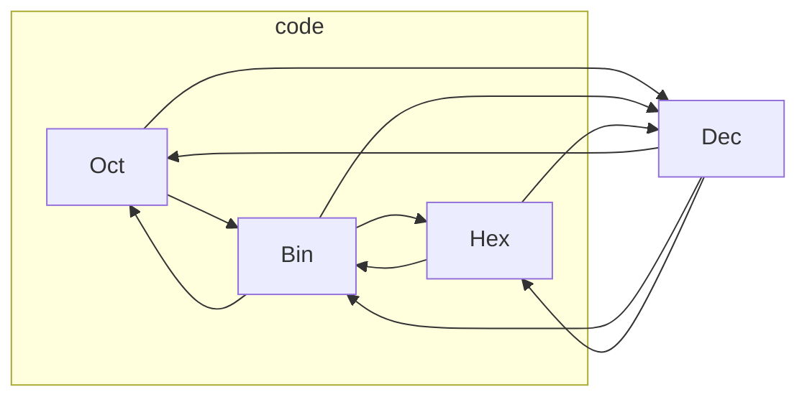

---

二进制算术运算

- 将减法转化为加法
- 乘法：被乘数左移，被乘数与部分积相加
- 除法：被除数右移，余数减去被除数
- 将四则运算转化为移位运算和加法运算

---

### 二进制正负数

二进制数存在符号 bit

- 正数为 0
- 负数为 1

---

二进制正负数的三种表示方法

1. 原码：符号位+绝对值二进制数
2. 反码：$N> 0, -N: 2^{n}-1-N$
3. 补码：$N> 0, -N: 2^{n}-N$

---

正数的三种表示相同：

+25: 00011001

原码：

-25: 10011001

反码：

-25: 11100110（对+25按位取反）

补码：

-25: 11100111（反码加一）

---

当带符号的是真小数时，符号位为整数位，只对小数点以后的数值部分取反加一。

从补码到原码的过程和从原码到补码的过程相同：**自反性**

---

补码将减法变成加法。

两个数的补码和等于两个数和的补码。如果符号位相加进位，则舍弃进位位，（实际做的是异或运算）。

21 - 26 = ？

0001 0101 + 1110 0110(*0001 1010*) = 1111 1011(*0000 0101*)

---

### 常用编码

---

常用的码：

- 中文汉字
- 英文字母
- 证件编码
- 通讯编码

---

BCD：二—十进制码

用 4 bit 表示十进制的 0~9.有些码是禁用码。共有 $\binom{16}{10}$ 种编码方式。

- 恒权码：8421，2421，5421
- 变权码：余 3 码

n 位十进制数使用 n bytes 表示。

$$
(0101 0000)_{8421BCD} = (50)_{10}
$$
---

| encoding type | 8421BCD | 2421BCD | 5211BCD | 余 3 码 | 循环余 3 码 |
| :-----------: | :-----: | :-----: | :-----: | :-----: | :---------: |
| 0             | 0000    | 0000    | 0000    | 0011    | 0010        |
| 1             | 0001    | 0001    | 0001    | 0100    | 0110        |
| 2             | 0010    | 0010    | 0100    | 0101    | 0111        |
| 3             | 0011    | 0011    | 0101    | 0110    | 0101        |
| 4             | 0100    | 0100    | 0111    | 0111    | 0100        |
| 5             | 0101    | 1011    | 1000    | 1000    | 1100        |
| 6             | 0110    | 1100    | 1001    | 1001    | 1101        |
| 7             | 0111    | 1101    | 1100    | 1010    | 1111        |
| 8             | 1000    | 1110    | 1101    | 1011    | 1110        |
| 9             | 1001    | 1111    | 1111    | 1100    | 1010        | 

**反射特性**：2421 码和余 3 码关于 4.5 对称，在计算加法时进位方便。

循环余三码和格雷码有相似点：表示的意义加一时码只变一位。

5211 码和计数器的分频率作用有关。

---

可靠性编码：发现错误并纠错。

- 格雷码：相邻代码间只有一位不同，避免了电路速度区别带来的误码。
- 奇偶校验码

---

格雷码：无权循环码

相邻项或对称项只有1位不同。

电子系统中，常要求代码按一定顺序变化。例如, 按自然数递减计数，若采用8421码，则数1000变到0111时4位均要变化。

在实际电路中, 4位的变化不可能绝对同步发生，而可能在计数中出现短暂的其他代码（1001、1100等）， 即过渡“干扰项”。在特定情况下，这可能导致电路状态错误或输入错误。

而使用格雷码可 以避免这种错误，这也是格雷码的最大优点。

---

Binary Code to Gray Code

通过高位到低位的异或实现

例如：5（101）

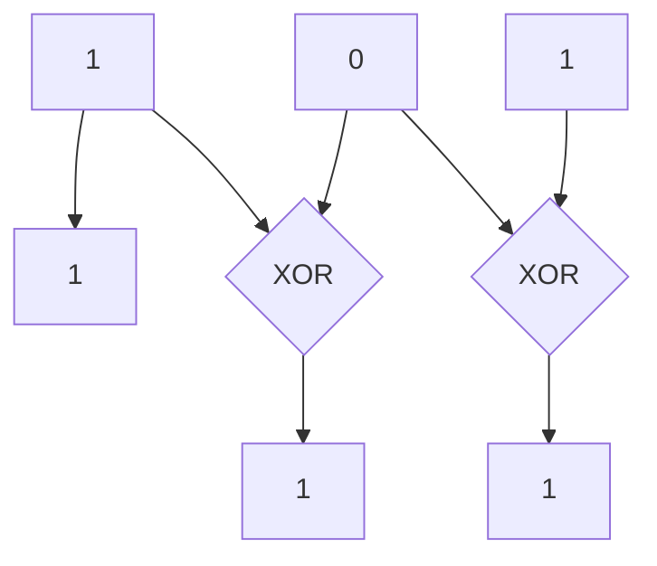

---

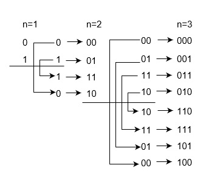

---

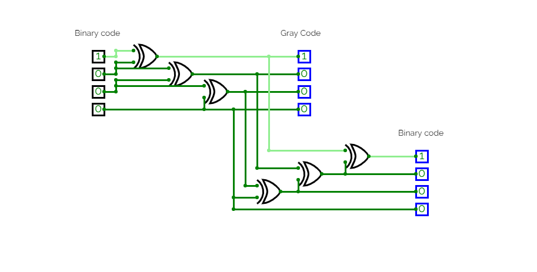

---

误差校验码

- 奇校验码：1+所有位数之和取最后一位
- 偶校验码：0+所有位数之和取最后一位

- 可以检测单向单错
- 信息码和校验码分离，**可分离码**。
- 简化了**译码过程**

---

字符、数字代码

ASCII：7 位信息位 + 1 位奇偶校验码


---

## 2. 布尔代数

---

### 基本二元逻辑

---

- NOR: $Y = \overline{A+B}$
- AND-OR-INVERT: $Y = \overline{AB+CD}$

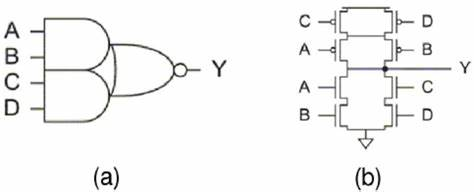

---

- Exclusive-OR（异或门）$Y = A \oplus B =  A \overline{B} + \overline{A} B$
- Exclusive-NOR（同或门）$Y = A \odot B = \overline{A \overline{B} + \overline{A} B} = AB + \overline{A} \cdot \overline{B}$

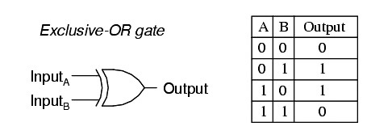

---

Exclusive-OR application: encoding

将明文和密钥做逐位异或运算得到密文，再将密文和密钥做逐位异或运算得到明文。

---

### 逻辑代数基本定理

---

1. 0-1 律

- 0 + A == A
- 1 + A == 1
- 1  A == 1
- 0  A == 0

---

2. 重迭律

- A + A == A
- A  A == A

---

3. 互补律

- A + A' == 1
- A  A' == 0

4. 还原律

(A')' == A

---

1. 交换律
2. 结合律
3. 分配律
    1. A  (B + C) == (A  B) + (A  C)
    2. A + (B  C) == (A + B)  (A + C)

---

1. 吸收律：存在冗余项。

AB + AB' == A

A + (AB) == A

A + (A'B) == A + B

==(AB)+(A'C)+(BC) == (AB)+(A'C)==

2. 反演律

(AB)' == A'+B'

(A+B)' == A'B'

---

1. 带入规则
2. 反演规则：变量取反，交换与和或，0 和 1，得到结果为原来的结果取非，**不能改变运算顺序**

Y = (AB)+C
Y' == (A'+B')C'

Y = A  (B + C)' + (C  D)
Y' == (A' + (B'  C')')  (C' + D')

3. 对偶规则：变量不取反，交换与和或，0 和 1，等式仍然成立。**只适用于恒等式**。

A + (AB) == A
A  (A+B) == A

AB + A'C + BC == AB + A'C
(A+B)  (A'+C)  (B+C) == (A+B)  (A'+C)

---

### 逻辑函数的表示

1. 真值表
2. 函数式
3. 逻辑图

---

如何从真值表得到函数式？

1. 找出函数值为 1 的项；
2. 将这些项中，输入变量为 1 的记录原变量，输入变量为 0 的记录反变量，取与运算；
3. 将上一步得到的各项取或运算。

得到的结果是与或式，或许可以化简。

---

AB+A'B' == ((AB + A'  B')')' == ( (AB)'  (A'  B')')'

把三种逻辑（与、或、非）转化成了两种逻辑（与非、非）。比原来更优。

---

用电路实现 $y = 2x+3$

| X1  | X2  | X3  | Y1  | Y2  | Y3  | Y4  | Y5  |
| --- | --- | --- | --- | --- | --- | --- | --- |
| 0   | 0   | 0   | 0   | 0   | 0   | 1   | 1   |
| 0   | 0   | 1   | 0   | 0   | 1   | 0   | 1   |
| 0   | 1   | 0   | 0   | 0   | 1   | 1   | 1   | 

......

---

标准与或式：最小项的或

最小项：与、非式且包含所有自变量。

| 最小项   | 对应的十进制数 | 编号 |
| -------- | -------------- | ---- |
| A'B'C' | 0              | M0   |
| A'B'C  | 1              | M1   |
| A'B C' | 2              | M2   |
| A'B C  | 3              | M3   |
| A B'C' | 4              | M4   |
| A B'C  | 5              | M5   |
| A B C' | 6              | M6   |
| A B C  | 7              | M7   |


---

1. 必然有且仅有一个最小项为 1.
2. 任意两个不同的最小项的与，结果为 0.
3. 具有相邻性（只有一个变量不同）的两个最小项的或，结果可以合并，并消去这个不同的变量。

ABC' + ABC = AB

---

最大项：或、非式且包含所有自变量。

| 最大项   | 对应的十进制数 | 编号 |
| -------- | -------------- | ---- |
| A +B +C  | 0              | M0   |
| A +B +C' | 1              | M1   |
| A +B'+C  | 2              | M2   |
| A +B'+C' | 3              | M3   |
| A'+B +C  | 4              | M4   |
| A'+B +C' | 5              | M5   |
| A'+B'+C  | 6              | M6   |
| A'+B'+C' | 7              | M7   |

---

$$
m_{i}' = M_{i}
$$

- 在输入变量取任意时，有且仅有一个取零，任意两个最大项的和为 1
- 全体最大项的积为 0
- 任意两个最大项的积等于两者中相同形式的和（消去）

---

标准形式

1. 最小项之和：标准与或式
2. 最大项之积：标准或与式

$$
\begin{align*}
    & F = \sum_{i} m_{i} \\
    & F' = \sum_{j} m_{j} & (j \neq i) \\
    & F = (F')' = \left(\sum_{j} m_{j}\right)' = \prod_{j} M_{j} & (j \neq i) \\
\end{align*}
$$

---

$$
\begin{align*}
    Y &= ABC' + BC \\
        &= ABC' + ABC + A'BC \\
        &= \sum_{m} (3,6,7) \\
        &= \prod_{M} (0,1,2,4,5)
\end{align*}
$$

---

**逻辑函数的代数化简法**

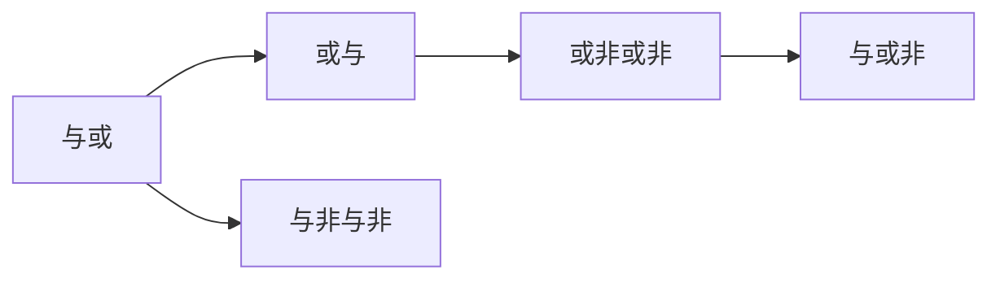

---

1. 最简与或式：乘积项的个数少，每个乘积项中相乘的变量个数也最少。
2. 最简与非与非式：最简与或式两次取反，应用摩根律。
3. 最简或与式
$$
\begin{align*}
    Y &= AB + A'C \\
    Y'&= (AB+A'C)' \\
        &= (A'+B')(A+C') \\
        &= AB' + A'C' + B'C' \\
        &= AB' + A'C' \\
    Y &= (AB' + A'C')' \\
        &= (A'+B)(A+C)
\end{align*}
$$
从第二步到结果或者可以直接应用反演定律：

- 原变量变成反变量，反变量变成原变量
- 与变或，或变与

4. 最简或非或非式：最简或与式两次取反，应用摩根律。
5. 最简与或非式：在最简或非或非式的基础上，应用摩根律去掉大反号下的小反号。
$$
\begin{align*}
    Y &= (A'+B)(A+C) \\
        &= (AB'+A'C')'
\end{align*}
$$

---

如何得到最简与或式？（得到以后可以任意转化成其他的最简式）

代数化简法：

- 并项法 $AB + AB' = A$
- 吸收法 $A+AB=A, AB+A'C+BC=AB+A'C$
$$
\begin{align*}
    Y &= ABC + A'D + C'D + BD \\
        &= ABC + (A'+C')D + BD \\
        &= ABC + (AC)'D + BD \\
        &= ABC + (AC)'D \\
        &= ABC + A'C + C'D
\end{align*}
$$
- 消去法 $A+A'B = A+B$
$$
\begin{align*}
    Y &= A'B + AB' + ABCD + A'B'CD \\
        &= A'B + AB' + (AB+A'B')CD \\
        &= A'B + AB' + (A'B+AB')'CD \\
        &= A'B + AB' + CD
\end{align*}
$$
- 配项法 $A+A'=1, AA'=0$
$$
\begin{align*}
    Y &= ABC' + (ABC)'(AB)' \\
        &= ABC' + AB (AB)' + (ABC)'(AB)' \\
        &= AB(ABC)' + (AB)'(ABC)' \\
        &= (ABC)'
\end{align*}
$$

---

$$
\begin{align*}
    Y &= AC + A'D + B'D + BC' \\
        &= AC + (A'+B')D + BC' \\
        &= AC + BC' + (AB)'D \\
        &= AC + BC' + AB + (AB)'D \\
        &= AC + BC' + AB + D \\
        &= AC + BC' + D
\end{align*}
$$

---

$$
\begin{align*}
    Y &= A'B + AB' + B'C + BC' \\
        &= A'B + (AB' + BC') + B'C \\
        &= A'B + (AB' + BC' + AC') + B'C \\
        &= A'B + BC' + AC' + AB' + AC' + B'C \\
        &= A'B + AC' + AC' + B'C \\
        &= A'B + A'C + B'C
\end{align*}
$$

---

通用的求解方法：卡诺图

横纵坐标为格雷码，循环相邻，用最大的方框（必须为 2 的整数次幂）框取所有的 1 位置，得到最简与或式。

局限性：只有在逻辑变量个数小于等于 4 的时候使用比较方便。

---

## 3. 门电路

---

高低电平的一般获得方法

- 单开关电路（上拉电阻）
- 互补开关电路

---

半导体的开关特性

- 二极管
- 三极管
- MOS 管

---

在数字电路中，一般对二极管做如下处理

- 忽略动态内阻
- 考虑阈值电压

在二极管上接入方波电压，在下降沿部分会存在恢复时间。

---

三极管的处理

- 截至状态：断路
- 饱和状态：be 间接入二极管，ce 间接入开关

三极管的动态开关特性

存在微小的滞后时延。

---

MOS 管

$$
\begin{align*}
    & R_{on} < 10^{3} \Omega \\
    & R_{off} > 10^{9} \Omega
\end{align*}
$$

其基本开关电路和三极管相同。

---

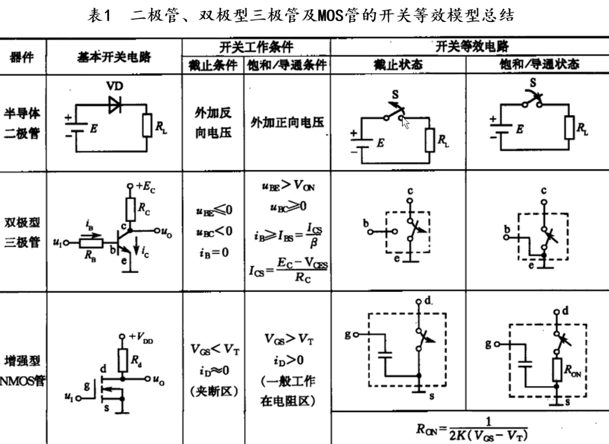

---

二极管与门

| A   | B   | Y    |
| --- | --- | ---- |
| 0   | 0   | 0.7V |
| 0   | 3V  | 0.7V |
| 3V  | 0   | 0.7V |
| 3V  | 3V  | 3.7V |

分立元件的缺陷：

1. 输入和输出之间存在电压降
2. 功耗体积大，可靠性差
3. 二极管必须一样，否则有误差
4. 输出端的电阻影响输出电平

---

集成门电路

- TTL(transistor-transistor logic) 三极管+电阻
- CMOS(complementary MOS) 主流
- ECL(emiter coupled logic) 速度高，功耗大

---

CMOS 门电路

Complementary Symmetric Metal OxideSemiconductor

巧妙地应用了 P 沟道和 N 沟道 MOS 管的**互补性**。

---

CMOS 反相器：非门

- 是所有 CMOS 电路的最基本结构
- 还有 TG （传输门）
- 作为**缓冲器**

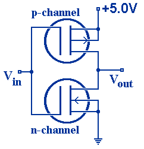

优点：

1. $T_{N}, T_{P}$ 总有一个截止，因此功耗低
2. 阈值电压 $U_{th} = \frac{1}{2} V_{DD}$，噪声容限接近 50%
3. 带容性负载时充放电速度快

---

CMOS NOT-AND

P 型串联，N 型并联

CMOS NOT-OR

P 型并联，N 型串联

缺陷：当输入端较多时，并联的电阻较多，输出电压会不标准。

---

带缓冲级的与非门

或非门输入端和输出端加 CMOS 反相器

```
((A'+B')')' = (AB)'
```

反相器可以将不标准的电压值转化成标准的电压值。（输入输出曲线很像 pH）

---

CMOS 传输门

P 型和 N 型并联

模拟开关 = 传输门 + 反相器

- 唯一能够传输模拟信号的元件

异或门 = 传输门 * 2 + 反相器 * 2

- 输入 A 接传输门控制端
- 输入 B 接传输门传输端

---

漏极开路输出门电路（OD）

一种与非门，与门 + N 型 MOS，输出必须接上拉电阻。

两个 OD 门的输出端可以**直接**相连，直接进行**线与**功能。

可以实现输出电平的变换，从原来的电压（例如 5V），变成上拉电阻电源的电压（例如 18V）。

可以接成总线结构：分时传送信号

---

CMOS 三态输出门电路

三态

1. 高电平
2. 低电平
3. 高阻态：输出端和电源、和地都接了无穷大电阻（反相器的两个管都处于截止状态）

如果使能端有小圆圈

- EN=1，输出高阻态
- EN=0，输出 A'

---

三态门的应用

- 用三态门接成总线结构
- 用三态门实现数据双向传输

---

总线结构

- 任何时候都只能有一个三态门处于工作状态，其他处于高阻态
- 从高阻态到工作状态用时比从工作状态到高阻态用时更长

只有三态门和 OD 门能够直接并联，因此才能接成总线结构。

---

- 噪声容限
- 扇出系数：输出端最多的带同类门的个数

---

## 4. 组合逻辑电路

---

### 编码器

把输入的每一个高低电平信号转化成一个对应的二进制编码

举例：键盘

---

普通编码器

同一时刻==只允许==输入一个信号。

---

8 线- 3 线编码器：节约数据线的数量。

| I0  | I1  | I2  | I3  | I4  | I5  | I6  | I7  | Y1  | Y2  | Y3  |
| --- | --- | --- | --- | --- | --- | --- | --- | --- | --- | --- |
| 1   | 0   | 0   | 0   | 0   | 0   | 0   | 0   | 0   | 0   | 0   |
| 0   | 1   | 0   | 0   | 0   | 0   | 0   | 0   | 0   | 0   | 1   |
| 0   | 0   | 1   | 0   | 0   | 0   | 0   | 0   | 0   | 1   | 0   |
| 0   | 0   | 0   | 1   | 0   | 0   | 0   | 0   | 0   | 1   | 1   |
| 0   | 0   | 0   | 0   | 1   | 0   | 0   | 0   | 1   | 0   | 0   |
| 0   | 0   | 0   | 0   | 0   | 1   | 0   | 0   | 1   | 0   | 1   |
| 0   | 0   | 0   | 0   | 0   | 0   | 1   | 0   | 1   | 1   | 0   |
| 0   | 0   | 0   | 0   | 0   | 0   | 0   | 1   | 1   | 1   | 1   | 

---

$$
\left\{\begin{aligned}
Y_{2}=& I_{0}^{\prime} I_{1}^{\prime} I_{2}^{\prime} I_{3}^{\prime} I_{4} I_{5}^{\prime} I_{6}^{\prime} I_{7}^{\prime}+I_{0}^{\prime} I_{1}^{\prime} I_{2}^{\prime} I_{3}^{\prime} I_{4}^{\prime} I_{5} I_{6}^{\prime} I_{7}^{\prime} \\
&+I_{0}^{\prime} I_{1}^{\prime} I_{2}^{\prime} I_{3}^{\prime} I_{4}^{\prime} I_{5}^{\prime} I_{6} I_{7}^{\prime}+I_{0}^{\prime} I_{1}^{\prime} I_{2}^{\prime} I_{3}^{\prime} I_{4}^{\prime} I_{5}^{\prime} I_{6}^{\prime} I_{7} \\
Y_{1}=& I_{0}^{\prime} I_{1}^{\prime} I_{2} I_{3}^{\prime} I_{4}^{\prime} I_{5}^{\prime} I_{6}^{\prime} I_{7}^{\prime}+I_{0}^{\prime} I_{1}^{\prime} I_{2}^{\prime} I_{3} I_{4}^{\prime} I_{5}^{\prime} I_{6}^{\prime} I_{7}^{\prime} \\
&+I_{0}^{\prime} I_{1}^{\prime} I_{2}^{\prime} I_{3}^{\prime} I_{4}^{\prime} I_{5}^{\prime} I_{6} I_{7}^{\prime}+I_{0}^{\prime} I_{1}^{\prime} I_{2}^{\prime} I_{3}^{\prime} I_{4}^{\prime} I_{5}^{\prime} I_{6}^{\prime} I_{7} \\
Y_{0}=& I_{0}^{\prime} I_{1} I_{2}^{\prime} I_{3}^{\prime} I_{4}^{\prime} I_{5}^{\prime} I_{6}^{\prime} I_{7}^{\prime}+I_{0}^{\prime} I_{1}^{\prime} I_{2}^{\prime} I_{3} I_{4}^{\prime} I_{5}^{\prime} I_{6}^{\prime} I_{7}^{\prime} \\
&+I_{0}^{\prime} I_{1}^{\prime} I_{2}^{\prime} I_{3}^{\prime} I_{4}^{\prime} I_{5} I_{6}^{\prime} I_{7}^{\prime}+I_{0}^{\prime} I_{1}^{\prime} I_{2}^{\prime} I_{3}^{\prime} I_{4}^{\prime} I_{5}^{\prime} I_{6}^{\prime} I_{7}
\end{aligned}\right.
$$

利用约束项化简

$$
\left\{\begin{array}{l}
Y_{2}=I_{4}+I_{5}+I_{6}+I_{7} \\
Y_{1}=I_{2}+I_{3}+I_{6}+I_{7} \\
Y_{0}=I_{1}+I_{3}+I_{5}+I_{7}
\end{array}\right.
$$

使用与非门实现

$$
\left\{\begin{array}{l}
Y_{2}=\overline{\overline{I_{4}} \cdot \overline{I_{5}} \cdot \overline{I_{6}} \cdot \overline{I_{7}}} \\
Y_{1}=\overline{\overline{I_{2}} \cdot \overline{I_{3}} \cdot \overline{I_{6}} \cdot \overline{I_{7}}} \\
Y_{0}=\overline{\overline{I_{1}} \cdot \overline{I_{3}} \cdot \overline{I_{5}} \cdot \overline{I_{7}}}
\end{array}\right.
$$

---

如何用与非门实现 8421-BCD 编码器？

---

优先编码器

允许同时输入多个信号，内部进行优先级处理，对优先级最高的进行编码。

---

8 线-3 线优先编码器 SN74LS148N

| ST' | IN'0 | IN'1 | IN'2 | IN'3 | IN'4 | IN'5 | IN'6 | IN'7 | Y'2 | Y'1 | Y'0 | Y'EX | Y'S |
| --- | ---- | ---- | ---- | ---- | ---- | ---- | ---- | ---- | --- | --- | --- | ---- | --- |
| 1   | X    | X    | X    | X    | X    | X    | X    | X    | 1   | 1   | 1   | 1    | 1   |
| 0   | 1    | 1    | 1    | 1    | 1    | 1    | 1    | 1    | 1   | 1   | 1   | 1    | 0   |
| 0   | X    | X    | X    | X    | X    | X    | X    | 0    | 0   | 0   | 0   | 0    | 1   |
| 0   | X    | X    | X    | X    | X    | X    | 0    | 1    | 0   | 0   | 1   | 0    | 1   |
| 0   | X    | X    | X    | X    | X    | 0    | 1    | 1    | 0   | 1   | 0   | 0    | 1   |
| 0   | X    | X    | X    | X    | 0    | 1    | 1    | 1    | 0   | 1   | 1   | 0    | 1   |
| 0   | X    | X    | X    | 0    | 1    | 1    | 1    | 1    | 1   | 0   | 0   | 0    | 1   |
| 0   | X    | X    | 0    | 1    | 1    | 1    | 1    | 1    | 1   | 0   | 1   | 0    | 1   |
| 0   | X    | 0    | 1    | 1    | 1    | 1    | 1    | 1    | 1   | 1   | 0   | 0    | 1   |
| 0   | 0    | 1    | 1    | 1    | 1    | 1    | 1    | 1    | 1   | 1   | 1   | 0    | 1   |

- $\overline{ST}$ 使能端，低电平有效
- $Y'_{EX}$ 扩展端，低电平有效（表明输出是否有意义）
- $Y_{s}$，高电平有效（表明是否有输入）

---

集成编码器 74LS147 BCD 编码器

$$
\left\{\begin{array}{l}
Y_{{ }_{3}}^{\prime}=\left(I_{8}+I_{9}\right)^{\prime} \\
Y_{2}^{\prime}=\left(I_{7} I_{8}^{\prime} I_{9}^{\prime}+I_{6} I_{8}^{\prime} I_{9}^{\prime}+I_{5} I_{8}^{\prime} I_{9}^{\prime}+I_{4} I_{8}^{\prime} I_{9}^{\prime}\right)^{\prime} \\
Y_{1}^{\prime}=\left(I_{7} I_{8}^{\prime} I_{9}^{\prime}+I_{6} I_{8}^{\prime} I_{9}^{\prime}+I_{3} I_{4}^{\prime} I_{5}^{\prime} I_{8}^{\prime} I_{9}^{\prime}+I_{2} I_{4}^{\prime} I_{5}^{\prime} I_{8}^{\prime} I_{9}^{\prime}\right)^{\prime} \\
Y_{0}^{\prime}=\left(I_{9}+I_{7} I_{8}^{\prime} I_{9}^{\prime}+I_{5} I_{6}^{\prime} I_{8}^{\prime} I_{9}^{\prime}+I_{3} I_{4}^{\prime} I_{6}^{\prime} I_{8}^{\prime} I_{9}^{\prime}+I_{1} I_{2}^{\prime} I_{4}^{\prime} I_{6}^{\prime} I_{8}^{\prime} I_{9}^{\prime}\right)^{\prime}
\end{array}\right.
$$


---

将两个 8 线- 3 线编码器结合成 16 线- 4 线编码器

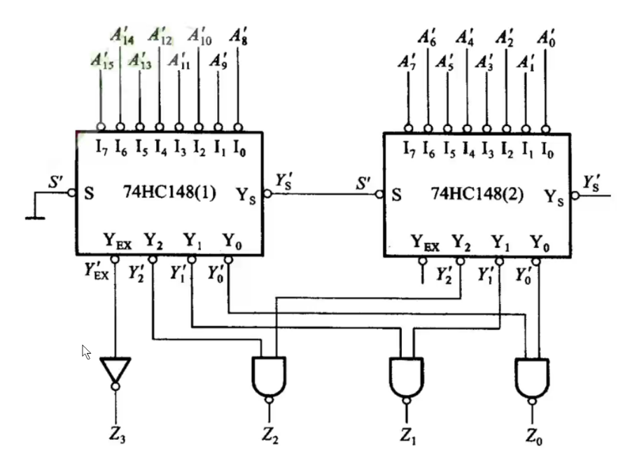

---

### 译码器

编码的逆运算

- 二进制译码器
- 二—十进制译码器
- 显示译码器

---

二进制译码器

3 线—8 线译码器

| A2  | A1  | A0  | Y7  | Y6  | Y5  | Y4  | Y3  | Y2  | Y1  | Y0  |
| --- | --- | --- | --- | --- | --- | --- | --- | --- | --- | --- |
| 0   | 0   | 0   | 0   | 0   | 0   | 0   | 0   | 0   | 0   | 1   |
| 0   | 0   | 1   | 0   | 0   | 0   | 0   | 0   | 0   | 1   | 0   |
| 0   | 1   | 0   | 0   | 0   | 0   | 0   | 0   | 1   | 0   | 0   |
| 0   | 1   | 1   | 0   | 0   | 0   | 0   | 1   | 0   | 0   | 0   |
......

---

74LS138 

使能端

- S1：高电平有效
- S2、S3：低电平有效

同时有效才可以译码。

输入高电平有效，输出低电平有效。

---

逻辑表达式

$$
\left\{\begin{array}{l}
\overline{Y_{0}}=\overline{\overline{A_{2}} \overline{A_{1}} \overline{A_{0}}}=\overline{m}_{0} \\
\overline{Y_{1}}=\overline{\overline{A_{2}} \overline{A_{1}} A_{0}}=\overline{m}_{1} \\
\overline{Y_{2}}=\overline{\overline{A_{2}} A_{1} \overline{A_{0}}}=\overline{m}_{2} \\
\overline{Y_{3}}=\overline{\overline{A_{2}} A_{1} A_{0}}=\overline{m}_{3} \\
\overline{Y_{4}}=\overline{A_{2} \overline{A_{1}} \overline{A_{0}}}=\overline{m}_{4} \\
\overline{Y_{5}}=\overline{A_{2} \overline{A_{1}} A_{0}}=\overline{m}_{5} \\
\overline{Y_{6}}=\overline{A_{2} A_{1} \overline{A_{0}}}=\overline{m}_{6} \\
\overline{Y_{7}}=\overline{A_{2} A_{1} A_{0}}=\overline{m}_{7}
\end{array}\right.
$$

---

扩展使用：4 线—16 线译码器

- 当 D3 为 0 时，高位片封锁，低位片工作，剩余三位输送给低位片
- 当 D3 为 1 时，低位片封锁，高位片工作，剩余三位输送给高位片

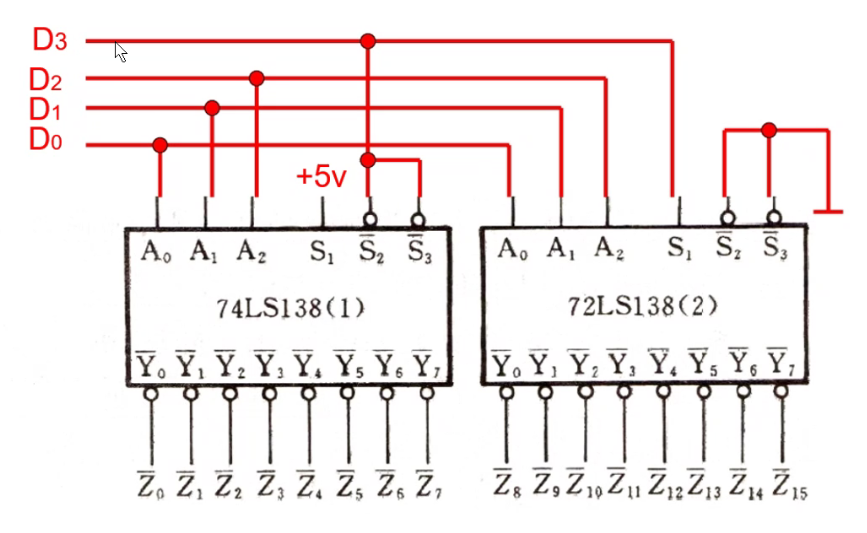

---

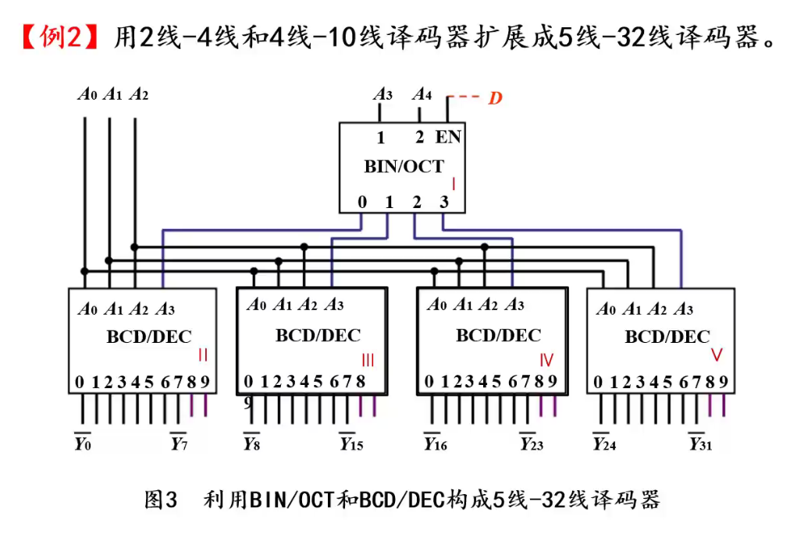

---

二—十进制译码器

8421 BCD  码到十进制数

CT74LS42

$$
\begin{align*}
    & \overline{Y_{0}} = \overline{m}_{0} \\
    & \overline{Y_{1}} = \overline{m}_{1} \\
    & \overline{Y_{2}} = \overline{m}_{2} \\
    & \overline{Y_{3}} = \overline{m}_{3} \\
    & \overline{Y_{4}} = \overline{m}_{4} \\
    & \overline{Y_{5}} = \overline{m}_{5} \\
    & \overline{Y_{6}} = \overline{m}_{6} \\
    & \overline{Y_{7}} = \overline{m}_{7} \\
    & \overline{Y_{8}} = \overline{m}_{8} \\
    & \overline{Y_{9}} = \overline{m}_{9} \\
\end{align*}
$$

5421，2421，余 3 码？

---

译码器的应用

- 实现存储系统的地址译码
- 实现逻辑函数
- 带使能端的译码器可以用作数据分配器

---

地址译码

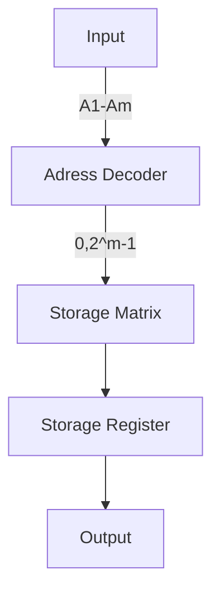

---

实现逻辑函数（CT74LS138）

举例：Y = A'B'C + ABC' + C

采用 3 线— 8 线译码器

```
A2 = A, A1 = B, A0 = C

Y = m1 + m3 + m5 + m6 + m7 
  = (m1' m3' m5' m6' m7')'
```

对译码器的对应输出端进行与非操作。

当然也可以实现多输出函数。

用两片芯片实现 4 位逻辑函数？

---

### 数据分配器

根据地址码将地址开关拨到不同的位置，将数据传递给不同的位置。

---

- 将地址码输入改为从芯片的输入端输入
- 将数据的输入改为从芯片的控制端输入

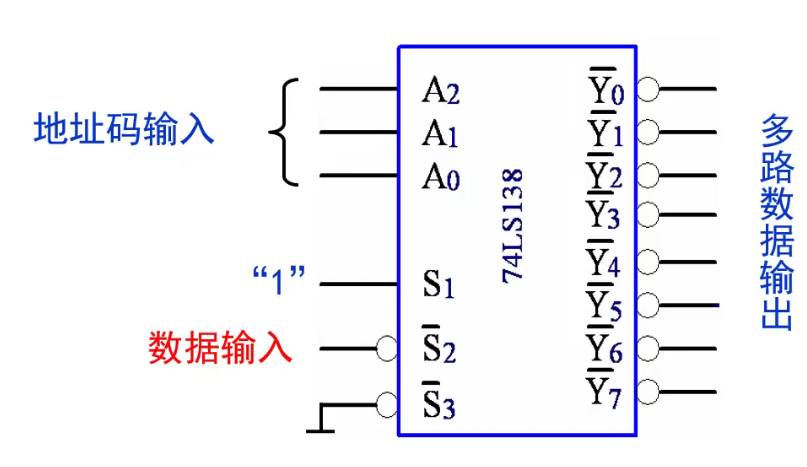

---

### 显示译码器

输入二进制数，用八段数码管输出光信号。

---

七段字型集成译码器 74xx48

- 输入：$A_{0} \cdots A_{3}$
- 输出：$Y_{a} \cdots Y_{g}$
- 功能引脚：
    - BI'/RBO' 消隐输入
        - BI' = 0 七段全灭
        - BI' = 1 正常译码
        - RBO' = 0 表示数码管输出是 0 **而且**被 RBI' = 0 灭掉了（在设计十进制数表示的组合数码管时起作用）
    - LT': light test 灯测试输入端
        - LT' = 0 七段全亮
        - LT' = 1 正常译码
    - RBI' 灭零输入端
        - RBI' = 0 灭掉显示为 0 的数码管
        - RBI' = 1 即使显示为 0 也输出

---

### 数据选择器

从多路输入中选择某一个作为输出。

以 4 选 1 数据选择器为例：
$$
\begin{align*}
Y &= D_{0} \overline{A}_{1} \overline{A}_{0} + D_{1} \overline{A}_{1} A_{0} + D_{2} A_{1} \overline{A}_{0} + D_{3} A_{2} A_{1}
\end{align*}
$$
加入控制端 $\overline{ST}$，当 $\overline{ST} = 1$ 时，输出都是 0；当 $\overline{ST} = 0$ 时，正常工作。
$$
\begin{align*}
Y &= ST \cdot (D_{0} \overline{A}_{1} \overline{A}_{0} + D_{1} \overline{A}_{1} A_{0} + D_{2} A_{1} \overline{A}_{0} + D_{3} A_{2} A_{1})
\end{align*}
$$

---

8 选 1 数据选择器 74XX151

可以选择原码输出 $Y$ 或反码输出 $\overline{Y}$.

数据选择器的扩展：将高位地址线接到低位选择器的使能端 $\overline{ST}$，取非后接到高位选择器的使能端 $\overline{ST}$.

更多片选择器的合并，可以通过再加数据选择器来实现。例如用 4 片 16 选 1 数据选择器合成 64 选 1 数据选择器，需要再加一块 4 选 1 数据选择器。

---

用数据选择器构成组合逻辑电路

比较简单的情况，数据地址位数等于组合逻辑自变量数。

比较复杂的情况，数据地址位数等于组合逻辑函数自变量数 - 1.

此时只需要把一个自变量（的非）接在对应数据入口就可以了。

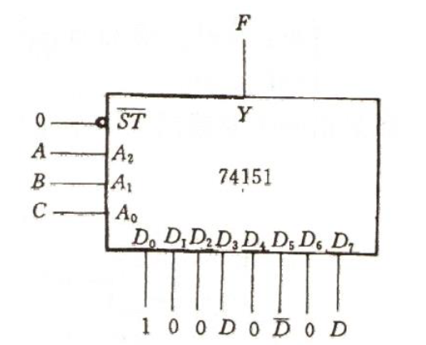

---

### 数值比较器

一位数值比较器

- $A > B \Rightarrow A = 1, B = 0, Y = A \overline{B}$
- $B > A \Rightarrow B = 1, A = 0, Y = B \overline{A}$
- $A = B \Rightarrow Y = AB + \overline{A} \overline{B}$

---

多位数值比较器 74XX85

输入端除了有限的几位输入以外，还有三个扩展端口

- $A > B$
- $A < B$
- $A = B$

这三个端口是用来接受来自低位的比较结果的，可以用扩展端口来实现多比较器级联形成更高位的比较器。

---

扩展应用：

1. 级联扩展：结构简单，但是运算速度低（高位芯片总要等待低位芯片的结果）
2. 并联扩展：每若干位进行比较，抛弃相等的输出端；将大于、小于的输出端传入下一个比较器比较得到最终结果。==运算速度快于串联扩展==

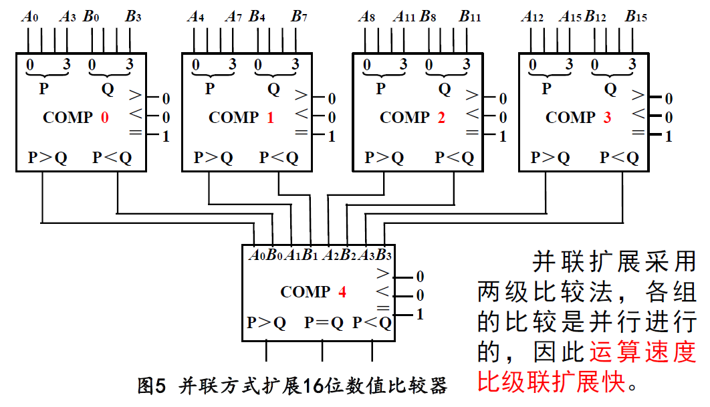

---

### 加法器

- 一位加法器
    - 全加器
    - 半加器
- 多位加法器
    - 串联进位加法器
    - 超前进位加法器

---

一位半加器

| A   | B   | S   | CO  |
| --- | --- | --- | --- |
| 0   | 0   | 0   | 0   |
| 0   | 1   | 1   | 0   |
| 1   | 0   | 1   | 0   |
| 1   | 1   | 0   | 1   | 

$$
\begin{align*}
    CO &= A \cdot B \\
    S &= A \overline{B} + \overline{A}B
\end{align*}
$$
---

全加器

| CI  | A   | B   | S   | CO  |
| --- | --- | --- | --- | --- |
| 0   | 0   | 0   | 0   | 0   |
| 0   | 0   | 1   | 1   | 0   |
| 0   | 1   | 0   | 1   | 0   |
| 0   | 1   | 1   | 0   | 1   |
| 1   | 0   | 0   | 1   | 0   |
| 1   | 0   | 1   | 0   | 1   |
| 1   | 1   | 0   | 0   | 1   |
| 1   | 1   | 1   | 1   | 1   |

$$
\begin{align*}
    S &= \sum m(1, 2, 4, 7) \\
    CO &= \sum m(3, 5, 6, 7) = AB + CIA + CIB
\end{align*}
$$

---

串行进位加法器

将全加器的结果级联到下一个全加器。

电路简单，速度慢（和多位比较器的级联解法类似）。


---

超前进位加法器

超前计算进位位 $CI/CO$ 
$$
\begin{align*}
    CO_{i} &= A_{i}B_{i} + CI_{i}(A_{i} + B_{i}) \\
    G_{i} &= A_{i}B_{i} \\
    P_{i} &= A_{i} + B_{i} \\
    CI_{i} &= CO_{i-1} \\
    \Rightarrow CO_{i} &= G_{i} + P_{i} CO_{i-1} \\
    \Rightarrow CO_{n} &= G_{n} + P_{n} G_{n-1} + \cdots + P_{n}P_{n-1} \cdots P_{1} G_{0}
\end{align*}
$$
用电路的复杂度牺牲换取速度变快。

---

加法器的应用

- 多个加法器==只能级联==组成更高位数的加法器
- 8421 码转余 3 码
$$
Y_{3}Y_{2}Y_{1}Y_{0} = DCBA + 0011
DCBA = Y_{3}Y_{2}Y_{1}Y_{0} + 1101
$$

---
