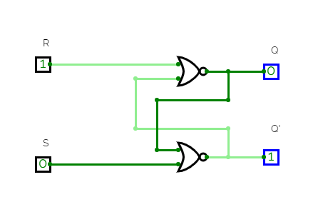
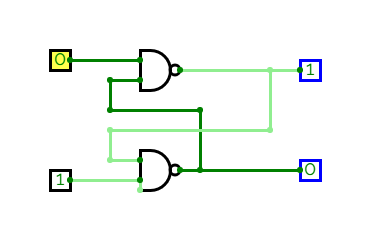
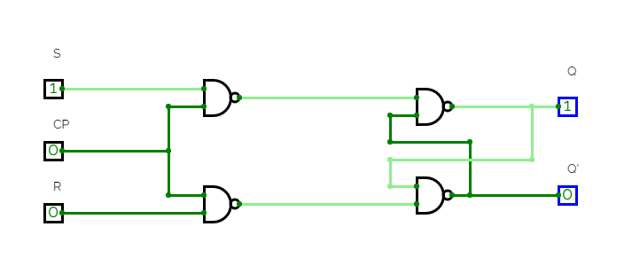
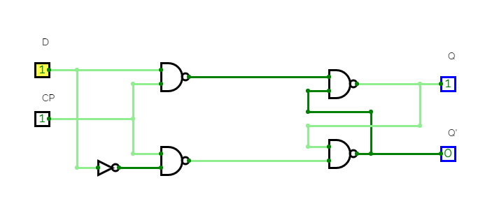
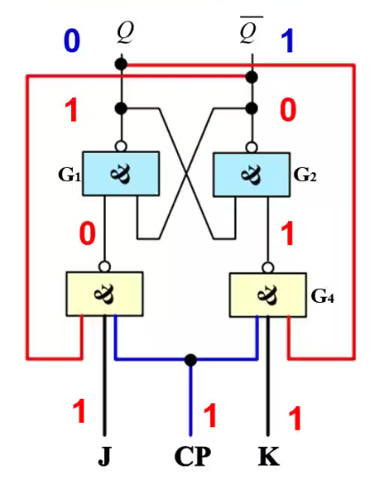
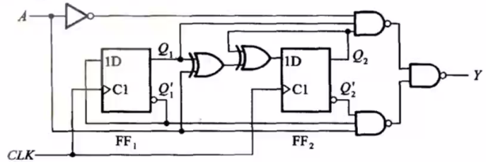
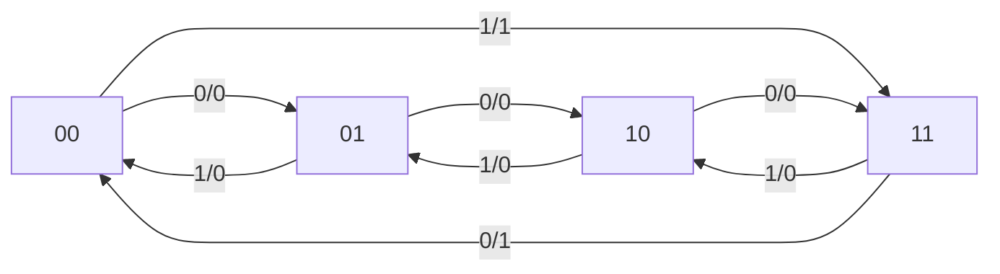
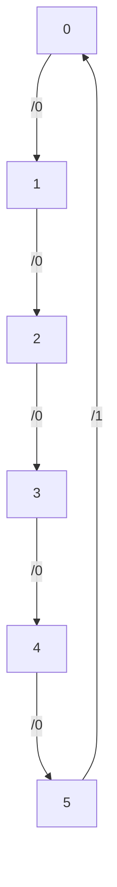

# Digital Circuit

---

## 5. 时序逻辑电路

---

- 组合逻辑电路：没有存储功能
- 时序逻辑电路：存在闭环反馈信号，有存储功能。

时序逻辑电路的输出不仅和当前的输入有关，还和**之前的状态有关**。

---

### 基本触发器

---

SR 锁存器（基本 RS 触发器）

以或非门构成为例：



- 1 状态：Q = 1，Q' = 0
- 0 状态：Q = 0，Q' = 1

---

| S   | R   | Qn  | Qn+1 | state               |
| --- | --- | --- | ---- | ------------------- |
| 0   | 0   | 0   | 0    | keep on             |
| 0   | 0   | 1   | 1    | keep on             |
| 1   | 0   | 0   | 1    | set as 1            |
| 1   | 0   | 1   | 1    | set as 1            |
| 0   | 1   | 0   | 0    | reset as 0          |
| 0   | 1   | 1   | 0    | reset as 0          |
| 1   | 1   | 0   | -    | Q = Q' = 0: invalid |
| 1   | 1   | 1   | -    | Q = Q' = 0: invalid |

---

组合逻辑
$$
\left\{\begin{aligned}
    & Q^{n+1} = S + \overline{R} Q^{n}\\
    & S R = 0
\end{aligned}\right.
$$

---

如果是由与非门构成，只是输入端的有效电平由**高电平变成低电平**，输出端的不定态由 0 变成 1，其他的逻辑不变。



- 如果是或非门，$S$ 对应 $\overline{Q}$，不定态是双零；
- 如果是与非门，$\overline{S}$ 对应 $Q$，不定态是双一。

---

### 同步触发器

---

Clock Pulse

使得所有触发器在同步信号（时钟脉冲）到达时，才按照输入信号改变状态。

---

同步电平触发器（钟控触发器）



当时钟信号为低电平时，输出状态必然被保存。时钟信号为高电平时，遵从或非门基本 RS 触发器的规律：
$$
\left\{\begin{aligned}
    & Q^{n+1} = S + \overline{R} Q^{n}\\
    & S R = 0
\end{aligned}\right.
$$
不定态为 1.（和与非门基本 RS 触发器一致）

有时存在**异步置零（一）端**，接在基本 RS 触发器的与非门上，不需要等待时钟信号，用于设置系统的初始状态。

---

同步 RS-FF 的缺点：

- 空翻：如果时钟信号的脉宽较大，那么有可能在时钟信号高电平期间，输入多次改变会引起输出多次改变，降低了电路的**抗干扰**能力。
- 可能出现不定态。

---

改进：R 由输入端 S 经过非门后接入

得到同步 D-FF



当 CP = 0 期间，保持。当 CP = 1 期间，
$$
Q^{n+1} = D
$$

D 触发器在时钟信号为高电平时，无法保存上一阶段的信号。而且还会空翻。

---

同步 JK-FF

- 保留了同步 RS-FF 的双输入
- 避免了不定态的出现



---

引入反馈，将原来的不定态转化成了**状态翻转功能**

当 J = K = 1 时，
$$
Q^{n+1} = \overline{Q^{n}}
$$

其他情况和同步 RS-FF 相同。

总的逻辑函数有点像异或逻辑
$$
Q^{n+1} = J \overline{Q^{n}} + \overline{K} Q^{n}
$$

---

T-FF

将 J，K 连接在一起，只保留了翻转的功能。

```python
Q[n+1] = T ^ Q[n]
```

将 T 端接高电平，得到 T'-FF

---

如何解决所有同步触发器的空翻现象？

主从或边沿触发器。

---

### 主从触发器

---

SR 主从触发器

第一个触发器级联一个第二个触发器，两个触发器的时钟信号反相。

在时钟信号为高电平时，主触发器工作，从触发器的输入端变化，但是从触发器锁定，输出不变；当时钟信号下降沿到来时，主触发器锁定，从触发器工作，输出改变。

- 克服了空翻现象
- 仍需满足 $S \cdot R = 0$

特性方程和之前的一致：
$$
\left\{\begin{aligned}
    & Q^{n+1} = S + \overline{R} Q^{n}\\
    & S R = 0
\end{aligned}\right.
$$
要画输出电平，只要关注时钟信号下降沿的 S，R 电平就可以了。

---

JK 主从触发器

增加了反馈


- Q = 0 时，输入端 K 无效
- Q' = 0 时，输入端 J 无效

即使 J=K=1，也总有一个输入无效，状态翻转。

特性方程
$$
Q_{n+1} = J \overline{Q_{n}} + \overline{K} Q_{n}
$$

当简化图中连有多个 J 或 K 时，是与（AND）关系。

---

主从 JK-FF 克服了空翻现象，存在一次变化现象：

在时钟信号高电平期间，即使 JK 输入信号有多次改变，但是由于**反馈信号**的存在，主触发器的状态只会改变一次。

和 SR 主从触发器**不一致**，**不是**只需要观察时钟信号下降沿的输入就可以了，在时钟信号高电平期间要观察输入端是否存在干扰，干扰会改变输出。

---


---

主从触发器还是不能完全克服空翻现象或者一次变化现象等==在时钟信号高电平时输入变化会影响结果的现象==。

- RS-FF: 如果输入保持信号（S = R = 0），不一定能够保持；
- JK-FF: 一次变化现象。

---

### 边沿触发器

---

设想：构造一种触发器，输出仅仅取决于在时钟信号上升沿或下降沿的输入。

边沿触发器

- TTL 维持阻塞 D 触发器
- TTL 边沿 JK 触发器
- CMOS 边沿 D 触发器和 JK 触发器

---


CMOS 边沿 D 触发器：CD4013 异步置位、复位 D 边沿触发器

| CP     | D   | R   | S   | Qn+1 |
| ------ | --- | --- | --- | ---- |
| 上升沿 | 1   | 0   | 0   | 1    |
| 上升沿 | 0   | 0   | 0   | 0    |
| else   | -   | 0   | 0   | Qn   |
| -      | -   | 0   | 1   | 1    |
| -      | -   | 1   | 0   | 0    |
| -      | -   | 1   | 1   | -    |

---

将反相输出端 $\overline{Q}$ 接到输入 D，可以形成上升沿翻转，形成周期为时钟信号两倍的方波信号：**二分频电路**。

---

维持阻塞结构正边沿 D 触发器

- $S_{D}', R_{D}'$ 低电平有效（起到置位、复位功能）

边沿 JK 触发器

---

- 是否受时钟控制
    - 异步触发器
    - 钟控触发器
        - 同步触发器
        - 主从触发器
        - 边沿触发器
- 不同的触发方式
    - 电平触发：存在空翻现象，只能用于数据锁存
    - 主从触发：克服了空翻现象，但是对输入信号有限制，时钟信号有效电平期间不希望输入变化（主从 JK 触发器的一次改变现象）
    - 边沿触发：只在时钟信号上升沿（下降沿）发生状态翻转，范围广，可靠性高，抗干扰

---

D-FF & JK-FF

- D ---> JK

$$
\begin{align*}
    & Q_{n+1} = D \\
    & Q_{n+1} = J \overline{Q}_{n} + \overline{K} Q_{n} \\
    \Rightarrow D & = J \overline{Q}_{n} + \overline{K} Q_{n} \\
    &= J \overline{Q}_{n} + \overline{K + \overline{Q}_{n}} \\
    &= \overline{(\overline{J \overline{Q}_{n}}) ( K + \overline{Q}_{n} )}
\end{align*}
$$

在输入端前置组合逻辑电路（二个与非门和一个或门）即可。

- JK ---> D

$$
\begin{align*}
    & J = D, K = \overline{D}
\end{align*}
$$

---

单脉冲生成器


本质上就是利用输出信号作为触发源生成的信号对输出进行自锁。

---

## 6.时序逻辑电路分析

---

串行加法器：使用一个全加器电路和一个 D-FF 实现多位加法。


每过一个时钟周期从输入端从低到高输入两个加数的位。

时序逻辑电路就是一个组合逻辑电路和基本触发器（起存储功能）的组合。

---
时序逻辑电路分类：

- 根据触发源是否一致
    - 同步
    - 异步
- 根据输出是否和输入有关
    - Mealy
    - Moore

---


- 输出方程 $\boldsymbol{Y} = f(\boldsymbol{X}, \boldsymbol{Q}_{n})$
- 驱动方程 $\boldsymbol{Z} = g(\boldsymbol{X}, \boldsymbol{Q}_{n})$
- 状态方程 $\boldsymbol{Q}_{n+1} = h(\boldsymbol{Z}, \boldsymbol{Q}_{n})$

---

### 同步时序逻辑电路

---

米里型时序电路



A 上升沿

$$
\begin{align*}
    & Q_{1}^{n+1} = \overline{Q_{1}^{n}} \\
    & Q_{2}^{n+1} = A \oplus Q_{1}^{n} \oplus Q_{2}^{n} \\
    & Y = A \overline{Q_{1}} \cdot \overline{Q_{2}} + \overline{A} Q_{1} Q_{2}
\end{align*}
$$

要注意 $Y$ 是组合逻辑，和时钟信号无关。

---

状态转换图



---

状态转换表

| A   | Q1n | Q2n | Q1n+1 | Q2n+1 | Y   |
| --- | --- | --- | ----- | ----- | --- |
| 0   | 0   | 0   | 0     | 1     | 0   |
| 0   | 0   | 1   | 1     | 0     | 0   |
| 0   | 1   | 0   | 1     | 1     | 0   |
| 0   | 1   | 1   | 0     | 0     | 1   |
| 1   | 0   | 0   | 1     | 1     | 1   |
| 1   | 0   | 1   | 0     | 0     | 0   |
| 1   | 1   | 0   | 0     | 1     | 0   |
| 1   | 1   | 1   | 1     | 0     | 0   | 

---

分析电路实例：


组合逻辑：$Y = Q_{0}^{n} Q_{2}^{n}$

驱动：
$$
\begin{align*}
    & J_{0} = K_{0} = 1 \\
    & J_{1} = K_{1} = Q_{0}^{n} \overline{Q_{2}^{n}} \\
    & J_{2} = Q_{0}^{n}Q_{1}^{n},  K_{2} = Q_{0}^{n}
\end{align*}
$$

时序逻辑：
$$
\begin{align*}
    & Q_{0}^{n+1} = \overline{Q_{0}^{n}} \\
    & Q_{1}^{n+1} = Q_{0}^{n} \cdot \overline{Q_{2}^{n}} \oplus \overline{Q_{1}^{n}} \\
    & Q_{2}^{n+1} = Q_{0}^{n} Q_{1}^{n} \overline{Q_{2}^{n}} + \overline{Q_{0}^{n}} Q_{2}^{n}
\end{align*}
$$

---

状态转换表
| Q2n | Q1n | Q0n | Q2n+1 | Q1n+1 | Q0n+1 | Y   |
| --- | --- | --- | ----- | ----- | ----- | --- |
| 0   | 0   | 0   | 0     | 0     | 1     | 0   |
| 0   | 0   | 1   | 0     | 1     | 0     | 0   |
| 0   | 1   | 0   | 0     | 1     | 1     | 0   |
| 0   | 1   | 1   | 1     | 0     | 0     | 0   |
| 1   | 0   | 0   | 1     | 0     | 1     | 0   |
| 1   | 0   | 1   | 0     | 0     | 0     | 1   |

功能：6 进制计数器

---

状态转换图



---

### 异步时序逻辑电路

---

时钟信号不同步，因此较之于同步时序逻辑，多了**时钟方程**。

---

### 寄存器

---

输入、输出都是并行的寄存器称为**数码寄存器**和**静态寄存器**。

存在串行方式的寄存器（其他类型）称为**移位寄存器**。移位寄存器除了具有存储代码的功能，还可以对数据进行**移位**。

组成：触发器和相应的控制电路（数据接收、清除命令）。

- 并行：在时钟脉冲的作用下，同时输入或输出
- 串行：……逐位

---

双拍数码寄存器


1. step 1: 复位信号低电平脉冲（清零信号）
2. step 2: 控制信号高电平脉冲
3. step 3: 读取数据（此时复位信号高电平无效）

---

单拍数码寄存器


时钟信号上升沿接受数据

由 D 触发器构成，加入了 $\overline{CR}$ 异步清零端。

MSI 寄存器实例：74LS175

---

单向移位寄存器


- step 1: $\overline{R}$ 清零
- step 2: 按照从高位到低位的顺序串行输入数据（0xB: 1-0-1-1）
- step 3: 数据逐步右移，四个上升沿结束以后得到完整数据。

---

| DI  | CP  | Q0  | Q1  | Q2  | Q3  |
| --- | --- | --- | --- | --- | --- |
| 0   |     | 0   | 0   | 0   | 0   |
| 1   | 1   | 1   | 0   | 0   | 0   |
| 2   | 0   | 0   | 1   | 0   | 0   |
| 3   | 1   | 1   | 0   | 1   | 0   |
| 4   | 1   | 1   | 1   | 0   | 1   |
| 5   | 0   | 0   | 1   | 1   | 0   |
| 6   | 0   | 0   | 0   | 1   | 1   |
| 7   | 0   | 0   | 0   | 0   | 1   |
| 8   | 0   | 0   | 0   | 0   | 0   |

后四个脉冲用来从 $Q_{3}$ 端取数据。

改变各寄存器的位数，得到左移寄存器。

---

双向移位寄存器

在单向的基础上增加门电路的控制。

举例：74194


---

多功能集成寄存器：74194


- CP: 移位脉冲输入端
- DSR: 右移串行代码输入
- Di: 并行代码输入
- DSL: 左移串行代码输入
- $\overline{CR}$: 异步置零端，低电平有效

根据组合逻辑电路分析工作模式

- M = 0 保持
- M = 1 右移
- M = 2 左移
- M = 3 并行

---

功能表

| CP         | CR' | S1  | S0  | SR  | SL  | D0  | D1  | D2  | D3  | Q0n+1 | Q1n+1 | Q2n+1 | Q3n+1 | 功能 |
| ---------- | --- | --- | --- | --- | --- | --- | --- | --- | --- | ----- | ----- | ----- | ----- | ---- |
| x          | 0   | x   | x   | x   | x   | x   | x   | x   | x   | 0     | 0     | 0     | 0     | 清零 |
| else       | 1   | x   | x   | x   | x   | x   | x   | x   | x   | Q0n   | Q1n   | Q2n   | Q3n   | 保持 |
| $\uparrow$ | 1   | 0   | 0   | x   | x   | x   | x   | x   | x   | Q0n   | Q1n   | Q2n   | Q3n   | 保持 |
| $\uparrow$ | 1   | 1   | 1   | x   | x   | A   | B   | C   | D   | A     | B     | C     | D     | 送数 |
| $\uparrow$ | 1   | 0   | 1   | DSR | x   | x   | x   | x   | x   | DSR   | Q0n   | Q1n   | Q2n   | 右移 |
| $\uparrow$ | 1   | 1   | 0   | x   | DSL | x   | x   | x   | x   | Q1n   | Q2n   | Q3n   | DSL   | 左移 |

---

扩展为 8 bit 寄存器

- 将两边芯片的 $M_{0}, M_{1}, CP, CR$ 端并联
- 低位片 DL 接高位片 Q0
- 高位片 DR 接低位片 Q3


---

### 计数器

按工作模式分类：

- 异步计数器
- 同步计数器

按功能分类：

- 加法
- 减法
- 可逆

各种进制……

主要功能：记录输入脉冲的个数，要求==完整==。

计数器的模：进制

---

#### 异步二进制计数器

---


- 加法计数器：上一信号的下降沿触发
- 减法计数器：上一信号的上升沿触发

模 M 计数器也是一个 M 分频器。

对于异步二进制计数器来说，位数越多，时间延迟积累就越明显 $N t_{pd}$.

---

异步十进制计数器

取四位二进制计数器的前 10 个状态


其余的 6 个状态也可以进入同一个工作循环中，可以==自启动==。

---

集成二——五——十进制计数器 CT74LS290

模 2 计数器 + 模 5 计数器分别用不同的时钟信号触发（下降沿触发）

还有异步置零端和异步置九端


十进制计数的时候：

- Q0 = CP1
- S0A * S0B = 0
- R9A * R9B = 0

---

用 CT74LS290 构成 6 进制计数器：异步置零法

- CP1 -> Q0
- R0A -> Q1
- R0B -> Q2

---

用 CT74LS290 构成 1000 进制计数器：

没有进位端该怎么办呢？可以将 Q3 的下降沿作为进位信号。

- CP1 -> Q0
- 高位 CP0 -> 低位 Q3

---

用 CT74LS290 构成 46 进制计数器：

先构成 100 进制计数器，再异步置零

---

#### 同步二进制计数器

将触发器接成 T 触发器，高位驱动为所有低位输出的与（进位信号）

$$
\begin{align*}
    & T_{0} = 1 \\
    & T_{1} = Q_{0}^{n} \\
    & T_{2} = Q_{0}^{n}Q_{1}^{n} \\
    & T_{3} = Q_{0}^{n}Q_{1}^{n}Q_{2}^{n} \\
    & C = Q_{0}^{n}Q_{1}^{n}Q_{2}^{n}Q_{3}^{n}
\end{align*}
$$

---

同步二进制加法计数器：74161

| CP         | CR' | LD' | EP $\cdot$ ET | 功能     | P3P2P1P0 | Q3Q2Q1Q0                  |
| ---------- | --- | --- | ------------- | -------- | -------- | ------------------------- |
| x          | 0   | x   | x             | 复位置零 | x        | 0000                      |
| $\uparrow$ | 1   | 0   | x             | 预置输入 | d3d2d1d0 | d3d2d1d0                  |
| x          | 1   | 1   | 0             | 保存数据 | x        | 上一个状态数据            |
| $\uparrow$ | 1   | 1   | 1             | 计数     | x        | 计数 |

还有进位信号 C 下降沿表示进位。

注意：load 加载预置数是同步的，需要等待时钟脉冲上升沿。

==异步清零、同步置数==

- EP = 0, keep, CO 可能为 1 或 0;
- ET = 0, keep, CO = 0.

---

74161 ==> M = 10

- 同步置零法：$\overline{LD} = Q_{3} \cdot Q_{0}, D = 0000$
- 同步置六法：$\overline{LD} = \overline{CO}, D = 0110$
- 异步清零法：$\overline{CR} = \overline{Q_{3} \cdot Q_{1}}$

同步置零是在 $Q = 1001$ 的时候==准备置==，异步清零是在 $Q = 1010$ 的时候==马上清==。异步清零在清零的过程中会产生“尖锐的峰”，竞争冒险现象。

---

74161 ==> M = 256 并行进位

- 同步
- 高位片 $ET = EP = CO$ 低位片

也可以使用串行进位：直接将低位片的进位输出取反接入高位片的触发源。

---

同步二进制减法计数器

$$
\begin{align*}
    & T_{0} = 1 \\
    & T_{1} = \overline{Q}_{0}^{n} \\
    & T_{2} = \overline{Q}_{0}^{n}\overline{Q}_{1}^{n} \\
    & T_{3} = \overline{Q}_{0}^{n}\overline{Q}_{1}^{n}\overline{Q}_{2}^{n} \\
    & C = \overline{Q}_{0}^{n}\overline{Q}_{1}^{n}\overline{Q}_{2}^{n}\overline{Q}_{3}^{n}
\end{align*}
$$

---

- 同步可逆十进制计数器：74191
- 同步可逆二进制计数器：74160

---

TTL 74LS 系列计数器

| SYN/ASYN' | index | cnt_mode              | reset SYN/ASYN' | set SYN/ASYN' |
| --------- | ----- | --------------------- | --------------- | ------------- |
| 1         | 161   | hex add               | 0               | 1             |
| 1         | 160   | dec add               | 0               | 1             |
| 1         | 163   | hex add               | 1               | 1             |
| 1         | 191   | hex inv               | none            | 0             |
| 1         | 190   | dec inv               | none            | 0             |
| 1         | 192   | dec inv(double clock) | 0               | 0             |
| 0         | 290   | 2-5-dec add           | 0               | 0(set as 9)   |
| 0         | 293   | hex add(double clock) | 0               | none          | 

---

### 顺序脉冲发生器

把输入的脉冲信号变成一组在时间上顺序出现的脉冲。

应用：

- 流水灯
- 总线的分时复用中加到三态门上的信号

---

使用移位寄存器实现顺序脉冲发生：顺序脉冲数较少


---

使用 74LS194 实现环形计数器

- S1 = 1, S0 = 0
- DSL = Q0
- D0123 = 0001

---

当顺序脉冲较多的时候，可以使用计数器 + 译码器来实现顺序脉冲。

- 异步计数器 + 译码器：容易产生竞争冒险现象
- 异步计数器 + 时钟低电平控制使能：避免竞争冒险现象


---

### 序列信号发生器

产生周期性的一串数字信号。

计数器 + 数据选择器


---

根据移位寄存器和组合逻辑电路设计序列信号发生器


根据已经读入的三个信号和将要读入的信号分析反馈逻辑电路的真值表。

---

### 同步时序逻辑电路的设计

---

步骤

1. 逻辑抽象：找出给定的逻辑问题中存在的==状态==，使用几位二进制数表示之；
2. 根据不同的输入输出，画出状态转换图，可能会存在==状态的归并简化==；
3. 找出输出方程（某一时刻的组合逻辑）和状态方程（相邻时段之间的逻辑联系）；
4. 根据给定的触发器种类确定策动方程（有几个二进制数位就有几个触发器）；
5. 画出电路图；
6. 验证自启动。

---

- 施密特触发器：矩形波整型
- 单稳态触发器：使得脉冲的宽度符合要求

555 定时器通过外加别的电阻电容元件就可以构成多种应用电路包括上面两种。

---

555 定时器，或 555 时基电路

命名方式

| 最后几位 | 555    | 7555 | 556 | 7556 |
| -------- | ------ | ---- | --- | ---- |
| 构成     | 双极性 | CMOS |     |      |


通过两个电压比较器和一个 RS 锁存器构成时序逻辑

| $\overline{R}$ | $TH$                  | $\overline{TR}$       | $u_{O}$ | V state |
| -------------- | --------------------- | --------------------- | ------- | ------- |
| 0              | x                     | x                     | 0       | 导通    |
| 1              | $>\frac{2}{3} V_{CC}$ | $>\frac{1}{3} V_{CC}$ | 0       | 导通    |
| 1              | $<\frac{2}{3}V_{CC}$  | $>\frac{1}{3}V_{CC}$  | keep    | keep    |
| 1              | $<\frac{2}{3}V_{CC}$  | $<\frac{1}{3}V_{CC}$  | 1       | 截止    | 

CO 可以改变两个比较电压，一般不用的时候连接一个 $0.01 \mu \text{F}$ 的电容。

---

用 555 时基电路构成施密特触发器

施密特触发器的转移特性和滞回比较器相似。

回差电压：$\Delta V_{T} = V_{T+} - V_{T-}$


- 当 $u_{I} < \frac{1}{3} V_{CC}$，$u_{O} = 1$
- 当 $\frac{1}{3} V_{CC} < u_{I} < \frac{2}{3} V_{CC}$，$u_{O}$ 保持不变
- 当 $u_{I} > \frac{2}{3} V_{CC}$，$u_{O} = 0$

作用

- 信号整型
- 采样鉴别

---

用 555 定时器构成单稳态触发器

- 稳态
- 暂稳态

在外界触发脉冲的作用下，稳态转化成暂稳态，==维持一段时间（和输入无关）==以后自动回到稳态。

连接一个阻容定时电路。


---

输入默认接入高电平。

触发脉冲的宽度不可以宽于输出脉冲。

---

多谐振荡器

---

ADC & DAC

主要指标：

- 转换速度
- 转换精度

---

DAC: digital ---> analog

- 权电阻网络
- 倒 T 型电阻网络
- 权电流网络

- 串行输入
- 并行输入

---

权电阻网络

电源连接数字开关（例如传输门），连接不同大小的电阻，连接上面的数字开关接地，在连接反相比例放大器。

优点：结构简单，电阻元件数量少

缺点：阻值差距大，生产工艺困难

---

倒 T 型电阻网络

阻值只有 $R, 2R$ 两种。但是电阻数量翻倍。

倒 T 型的电阻连接方式是不会随着数字开关而改变，==数字开关只是改变了哪些电流要接入反相端，哪些要直接接地==。

缺点：数字开关实际上存在电阻，会影响精度。

---

权电流型电阻网络

用恒流源代替倒 T 型电阻网络的各支路电阻。


$$
\begin{align*}
    u_{O} & = i_{Z} R_{F} \\
    &= \frac{IR_{F}}{2^{4}} \sum_{k=0}^{3} d_{k} \cdot 2^{k}
\end{align*}
$$

可以使用半导体器件实现恒流源。

---

ADC: analog ---> digital

$$
D = \left[ \frac{u_{I}}{\Delta} \right]
$$

最小分辨电压：$\Delta$


---

采样：将时间上连续变化的模拟量转换成一系列等间隔的脉冲。

采样定理：采样脉冲的频率要大于原始信号频谱中最大频率的两倍。

$$
f_{s} \geq f_{max}
$$

---

量化：将采样以后的样值电平归化到相近的离散电平上。

- 只舍不入法 量化误差 $\varepsilon = \Delta$
- 有舍有入法 量化误差 $\varepsilon \approx \frac{\Delta}{2}$

---

并联比较法 电压比较器 + D-FF + 组合逻辑

转换速度快，但是需要的门电路、触发器和电压比较器多，电路复杂。

---

## 期末复习

1. 简述空翻现象
2. 说出三种可靠性编码的名称
    1. 格雷码
    2. 奇偶校验码
3. 什么是译码器？常见译码器有哪些？
4. 什么是编码器？分为那两种？各自的特点？
5. 什么是数据分配器？简述其工作原理。
6. 什么是数据选择器？简述其工作原理。
7. 什么是数值比较器？多位数值比较器的原理是怎样的？
8. 竞争和冒险的产生原因是什么？消除方法有哪些？
9. 什么是触发器？常见的触发器有哪些？
10. 什么是同步触发器？有什么特点？
11. 什么是边沿触发器？有什么特点？
12. 什么是时序逻辑电路？有什么特点？同步和异步？米利型和摩尔型？
13. 请问时序逻辑电路的分析过程是怎样的？
14. 时序逻辑电路的设计过程一般是什么样的？
15. 什么是寄存器？什么是移位寄存器？
16. 什么是计数器？
17. 什么是模拟信号和数字信号？什么是模拟电路和数字电路？
18. 数字逻辑设计中常用的数制有哪些？
19. 常用的编码有哪些？简要描述一下。
20. 有符号数的表现形式有哪三种？如何表示正负？
21. 逻辑函数的表示形式有哪几种？简要描述。
    1. 真值表
    2. 逻辑表达式
    3. 逻辑图
22. 请问化简逻辑函数的方法有哪两种？特点？
    1. 卡诺图
    2. 各种规律
23. 请谈谈你对TTL和CMOS电路的了解。
24. 什么是线与？普通的TTL门可以直接线与嘛？
    - OD/OC 门的输出端可以直接连接在一起接上拉电阻，形成逻辑与的功能，类似由二极管组成的与门电路。
    - 普通的 TTL 门不可以直接线与，否则逻辑混乱。
25. 什么是三态门？工作原理是怎样的？
    - 使能端为无效电平呈现高阻态。
    - 原理：逻辑电路和类似 CMOS 反相器的结构组成。
26. 请问组合逻辑电路在逻辑和结构上有什么特点？
27. 请问组合逻辑电路的分析步骤一般是怎样的？
28. 请问组合逻辑的设计步骤一般是怎样的？
29. 请问什么是半加器？什么是全加器？有什么区别？
30. 什么是加法器？分为哪两种？特点？
    1. 串联进位加法器
    2. 超前进位加法器
31. 什么是555定时器？用555定时器可以构成哪些器件？
    1. 单稳态触发电路
    2. 多谐振荡器
    3. 可调占空比的脉冲波输出电路
32. 什么是施密特触发器？有哪些应用？
    1. 连接 TH,TR 的 555 定时器
    2. 形成滞回比较器
33. 请问什么是单稳态触发器？有哪些应用？
34. 如何用 D 触发器实现 2 分频电路？
35. 什么是同步逻辑和异步逻辑？
36. 什么是三态与非门？
37. 什么是集电极开路与非门（OC 门）？
38. MOS电路的特点？
39. 什么是组合逻辑，时序逻辑以及同步时序逻辑？
40. 同步电路和异步电路的区别是什么？
41. 数模转换器和模数转换器区别
42. A/D工作原理
43. 组合电路与时序电路的区别？
44. 什么是TTL？
45. IC设计中同步复位和异步复位的区别？
46. 晶体管的开关特性工作在什么区？
47. 描述触发器的方法？
48. TTL和CMOS的区别
49. 输入端噪声容限
50. 动态功耗
51. CMOS特点
52. TTL特点
53. 串行进位与超前进位的区别
54. 电平触发及其特点
55. 脉冲触发及其特点
56. 边沿触发及其特点
57. 主从JK一次变化问题
58. 主从RS
59. 同步时序逻辑电路分析方法
60. 时序电路逻辑功能的描述
61. 计数器的同步、异步置零法
62. 同步时序逻辑电路的设计方法
63. 逻辑函数的描述方法
64. CMOS器件为什么要在输入端输出端加钳位电路？
65. 何为扇出
