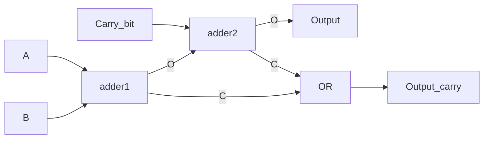
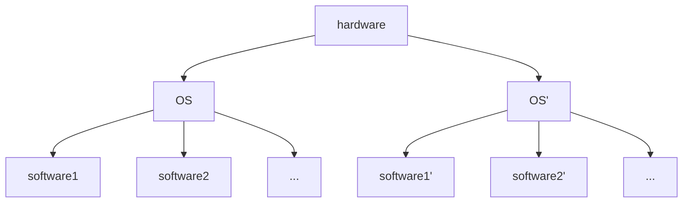
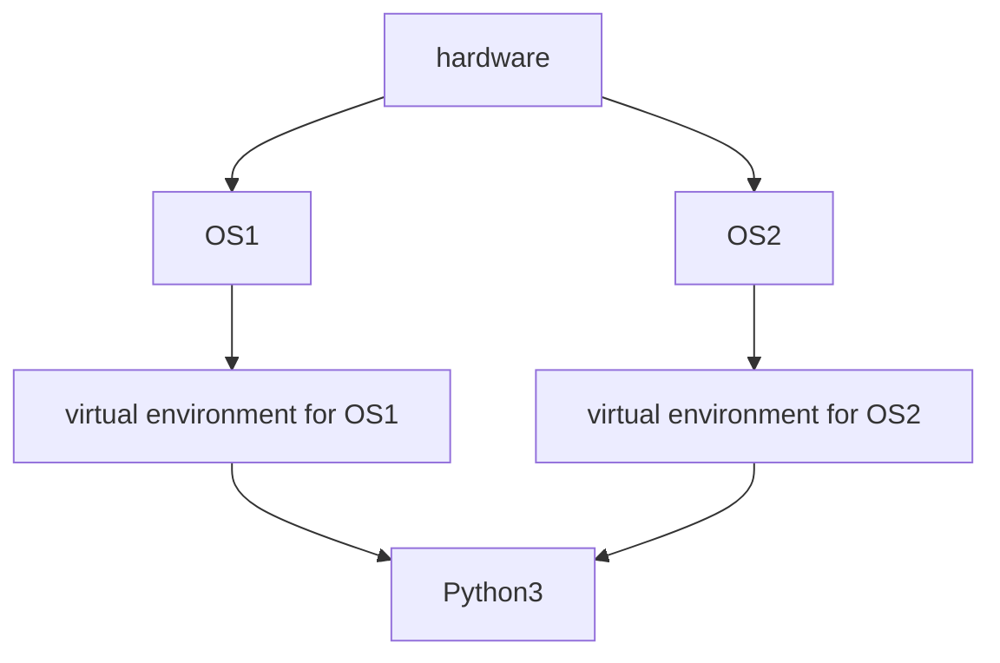
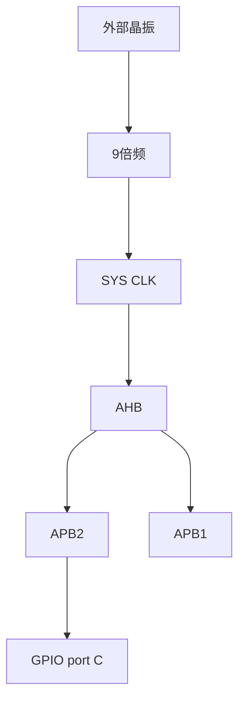
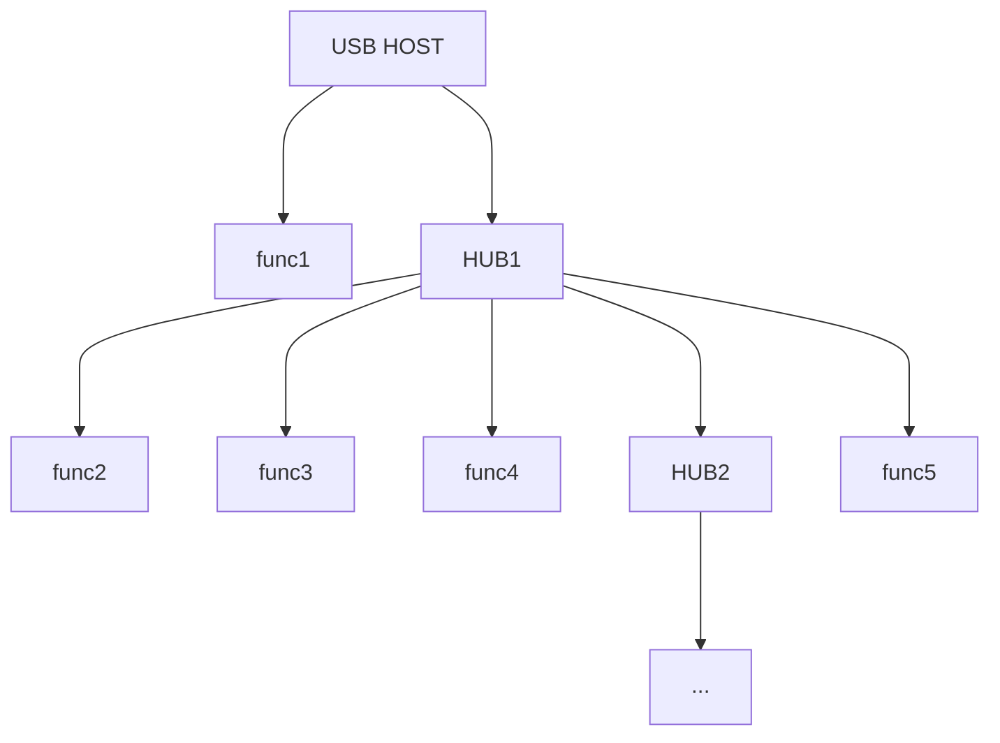

# Embedded System

---

- 10% 平时成绩
- 40% 期末考试
- 10% 小作业
- 40% 大作业

---

学习目标：

- 可以重建工作的系统
- 掌握 CPU 的工作过程，搭建解决实际问题的系统
- 掌握计算机的工作过程

---

## 数字电路基础

---

 在模拟电子电路中，三极管工作在放大区。

 在数字电路中，三极管工作在截止区或饱和区。因为：
 
- 放大区工作的功耗较大
- 截止区和饱和区构成三极管的两种状态

> 能承载的信息量和信噪比有关。——香农

---

一段波形是数字信号还是模拟信号，不取决于它的波形，而取决于人如何理解它。

数字信号牺牲信息量来获取较高的抗干扰能力。还能延时，压缩等等。

---

计算机是一套独特的规律科学？开始人类根据自己的社会经验抽象出的规则定义的机器？

后者。揣摩当初计算机设计者的思想。

写程序本质上就是翻译。


---

一些硬件储存信息的方法

- 磁盘：用 N/S 磁性来表征二进制
- 光盘：光盘的反射方向，收到光代表 1，未收到代表 0.

---

## 门电路

---

NOT


一个不驮载直流信号的基本放大电路就是非门。

- 当输入高电平，三极管导通处于饱和区，输出低电平。
- 当输入低电平，三极管截止，输出高电平。

---


---

AND


电路图：两个三极管串联。

---

OR

电路图：两个三极管并联

---

通过改接输出的位置，可以制造出与非门，或非门。

---

XOR


---


---

逻辑运算是**状态**的运算，不是电压值的运算。

因此逻辑运算不是只能通过电路实现，其他物理量也可以。

---

数字信号

- 易于储存，压缩
- 损坏以后可以修复（中继器）
- 可以推算传播损失函数，进行整形，恢复为方波

---

加法器

![[images/image20220302102403.png]]

---

True Value Tablet

| A   | B   | $\Sigma$ | $C_{out}$ |
| --- | --- | -------- | --------- |
| 0   | 0   | 0        | 0         |
| 0   | 1   | 1        | 0         |
| 1   | 0   | 1        | 0         |
| 1   | 1   | 0        | 1         |

---

全加器



---

所有的运算都是由元运算（加减乘除与或非）张成的空间。

$$
\sin x = \frac{x}{1!} - \frac{x^{3}}{3!} + \frac{x^{5}}{5!} - \cdots
$$

---

时钟信号：方波，和输入输出信号做与运算。

当时钟信号值为 0，输入输出都为 0.

---

## 赋值的物理实现

---

```cpp
char a = 1;
```

a 的存储单元的前七个改成 0，后一个改成 1.

---

```cpp
#include <iostream>
using namespace std;
int main()
{
    char a[] = {1,2,3,4};
    short *I = (int *)a;
    cout << hex << *I << endl; // 0x201
    return 0;
}
```

低地址低字节

```cpp
int a = 80;
```

内存中：``50 00 00 00``

---

``signed`` and ``unsigned``

两种数的比较电路不同。JLE,JBE

```cpp
#include <iostream>
using namespace std;
int main()
{
    int a = 0;
    if (a>10)
        a = 20;

    unsigned int a = 0;
    if (a>10)
        a = 20;
    return 0;
}
```

这两种比较的 Assembly Language 不同。

---

CPU：好几套组合逻辑

如何让 CPU 知道正在调用的逻辑单元？

采用地址，但是考虑到可读性，汇编语言将地址转译成英文字母。

---

浮点数虽然表示的范围大，但它的相对误差是一定的。

也就是说，浮点数在表示较大的整数时，精度远远不如整型。

例如：

1000 0000 和 1000 1000 如果是浮点数中相邻的两个数，1000 0001 就无法用这种浮点数表示。

```cpp
float a = 1e10;
a + 1 == a; // return 1
```

---

## C 语言回顾

---

1. 指针和数组
2. 结构体
3. 函数指针和结构体
4. 函数参数传递
5. 宏和预编译

---

数组天然配合循环。

硬件开发时轻易不要用 ``while`` 循环。否则极易进入死循环。

高维数组的转译：``arr[m][n]`` => ``arr[m*n]``

``arr[i][j]`` => ``arr[i*n+j]``

高维数组是计算机程序设计语言的福利：增强代码可读性。其物理存储还是一维形式连续的。

二维数组的折算使得其代码执行效率不如一维数组。

---

```cpp
#include <iostream>
using namespace std;
int main()
{
    int arr[m][n] = {{0}}; // ?
    int *p;
    for (int i=0; i<m; i++)
    {
        p = arr[i];
        for (int j=0; j<n; j++)
            func(p[j]); // 这种代码的执行效率高，不用每次计算乘法
    }
    return 0;
}
```

计算机的维度是组织数据的方式，不是真实的空间维度。

---

``int *p`` & ``int* p&

``p`` 和 ``*p`` 都是变量。

```cpp
    int a = 0;
    int* p1 = &a;
    char b = 'b';
    char* p2 = &b;
    p1++; // +4
    p2++; // +1
```

指针类型的计算根据指针所指的数据类型而确定。

直接给指针赋值非常危险。

```cpp
    int a = 0;
    int* p = &a;
    *(++p) = 1; // 病毒行为
```

---

```cpp
    char bytebuffer[] = { 0x23, 0x34, 0x6d, 0xca };
    int* p = (int *)bytebuffer;
```

---

```cpp
struct XX
{
    ...;
};

int main()
{
    int bytebuffer[] = { 1,2,3,4,5,6,7,8 };
    XX* p = (XX*)bytebuffer;
    XX p = *(XX*)bytebuffer;
    return 0;
}
```

对于普遍情形而言，传输地址比传输数据更加轻量化。

---

结构成员对齐

结构体中每个成员分配的最小空间，32 位空间为 4 bytes，64 位空间为 8 bytes。

访问结构体成员，被编译器翻译为地址的**偏移量**。这一行为和访问数组元素的行为本质是一样的。

---

内存泄漏

```cpp
    char * p = new char[8];
    char a = 'a';
    p = &a; // 动态申请的 char[8] 不能再被访问，引起 8 bytes 的内存泄漏
```

有些软件运行时间过长需要重启，就是因为内存泄漏。

```cpp
    delete[] p; // 释放空间，不是删除变量
    p = &a; // 合理合法
```

但是可以这样

```cpp
    char * p = new char[8];
    char * q = p;
    p = &a;
    delete[] q;
```

```cpp
    char * p = new char[8];
    char * q = p;
    delete[] q;
    delete[] p; // 但是这样又会报错，不能再次释放
```

---

变量的生命期

从定义开始，到同级的 ``}`` 结束（全局变量到文件末尾结束）。

每一对 ``{}`` 中是一个栈。

---

函数参数传递

讲变量转入函数，将实参的数据**拷贝**一份放入函数的栈顶。

函数中的形参从栈顶取得相应的数据，形参本身不开辟新的空间。

因此函数如果修改形参的话，改变的是**拷贝的数据**，不改变外部的数据。

当然如果传输的类型是指针，情况就不同了。但是本质都是传递数据，只是数据是地址罢了。

一般来说推荐传入指针，可以添加 ``const`` 关键字防止误修改。

```cpp
int func(const int * a, int * b);
```

---

函数结果返回

```cpp
XX* func()
{
    XX xx = ...;
    return &xx;
}
```

如何理解这个==非常隐蔽的错误==？

> 基本常识：同一个文件中的所有函数都公用同一个栈。

在执行完函数 ``func()`` 后，虽然返回值指针所指的地址还是目标值，但是随着==后续函数的执行，栈区的值被覆盖==，将出现非常隐蔽的错误。

---

``new`` 和 ``delete``  处理的是堆区的数据，因此如果在函数中执行这两个语句，可以。

```cpp
XX* func()
{
    XX* ab = new XX();
    return ab;
}
```

这样返回指针值，不会被后续函数执行的结果所覆盖。

---

函数指针

```cpp
#include <iostream>

struct YY {
    int (*funP)(int a, int b);
};

int Minus(int a, int b)
{
    return a - b;
}
int Multiple(int a, int b)
{
    return a * b;
}

int main()
{
    YY yy;
    yy.funP = Minus; // or &Minus
    std::cout << yy.funP(1, 2) << std::endl;
    yy.funP = Multiple; // or Multiple
    std::cout << yy.funP(1, 2) << std::endl;
    return 0;
}
```

---

位段

```cpp
struct ABC{
    char a : 1; // a: 1bit 0/1
    char g : 7; // g: 7bits
}
```

---

联合

```cpp
#include <iostream>
using namespace std;
typedef union
{
    char a;
    char b;
}utype;

int main()
{
    utype c;
    c.a = 'A';
    cout << c.b << endl;
    return 0;
}
```

---

```cpp
#include <iostream>
using namespace std;
struct bits
{
    unsigned char bit0 : 1;
    unsigned char bit1 : 1;
    unsigned char bit2 : 1;
    unsigned char bit3 : 1;
    unsigned char bit4 : 1;
    unsigned char bit5 : 1;
    unsigned char bit6 : 1;
    unsigned char bit7 : 1;
};

typedef union
{
    char a;
    bits b;
}utype;

int main()
{
    utype c;
    c.a = 1;
    c.b.bit0; // \x01
    return 0;
}
```

先定义的 ``bit0``，位数较低。

---

## 计算机的工作原理

1. 指令系统的构建
2. 内存读写

---

指令系统设计

1. 假设 1Mb 内存：20 bit 地址编码
2. 8 个寄存器：3 bit 地址编码
3. 支持 4 条指令：2 bit 地址编码

读写加减乘除

```
// int a = 5;
write 0xccdde 05
// memory address 0xccdde

// a *= 5;
mul 0xccdde 05
```

---

设计方案二：引入寄存器

```
// a = 10;
write register011 0a // 1+3+8=12 bit
write 0xccdde register001 // 1+20+3=24 bit

// a++;
add register011 // 2+3=5 bit

// a *= 5;
mul register001 5 // 2+3+8=13 bit
write 0xccdde register001 // 1+20+3=24 bit
```

引入寄存器以后，增加了代码执行的效率。在对数据进行运算的时候，将数据暂存到 CPU 内部的寄存器中，减少了**编码的复杂度**和**速度**。（因为 CPU 中的频率高于外部）

==Mov==

---

![[images/image20220330105110.png]]

- ALU：计算单元（加减乘除与或非）
- 通用寄存器：临时存储中间数据，经常和内存进行互相读写
- 指令队列缓冲器：缓冲外部输入的指令数据
- 执行部分控制电路：读取指令队列缓冲器的指令并转译
- 总线：并行传送数据，一根总线传送 1 bit 数据
- IP：始终指向下一条指令的地址

---

CPU 和内存的数据读写角色可以交换。

CPU 和内存之间有两种角色的总线：

- 地址总线（传递指令的地址）
- 数据总线（传递数据）

这两种总线实际上可以用一条实现。

---

在电脑刚刚开机的时候，IP 指向 0 地址，执行第一条指令

以后每次将 IP 中送入地址加法器后==立刻==将 IP 移动到下一指令

---

编程中四种存储空间

1. 指令存储（只读一般）
2. 全局变量
3. 栈区：存储函数中变量
4. 堆区：存储 ``new, new[]`` 开辟的变量

---

![[images/image20220406100930.png]]

- AD15 - AD0: Address & Data
- RD: CPU 等待内存写入数据
- DT/R': Data Transmit or Receive
- READY: 反馈信号，内存（外设）给 CPU 的信号
- ALE: 输入地址有效
- DEN: 输入数据有效

后面两种是为了应对地址总线和数据总线复用而设计的区分信号。

---

CPU 读取数据的过程（MOV 指令）

1. DT/R' = 0，表示开始进行数据交换。
2. ALE = 1，表示地址总线有效，CPU 向总线发送地址数据。
3. 发送完毕以后，RD = 0，表示 CPU 准备好读数据，等待速度较慢的外设。
4. 外设发送反馈信号 READY = 1，CPU 发送 DEN = 0 信号，读入内存发送到总线的数据。

在 CPU 内部的读写过程，也有相似的时序。

---

内存和外存

- 内存
    - RAM: random access memory 挥发性，随机存取
    - NOR Flash 非挥发性，随机存取，写之前必须全部恢复为 1 状态
- 外存
    - NAND Flash 块读写
    - ROM 块读写
    - U 盘
    - SSD

---

扩展存储芯片

---

## 芯片和系统

---

设备实际上是由多个芯片构成。

在 CPU 实际向设备发送的地址中，一部分是给芯片编码使用（片选），另一部分才是芯片中的地址（片内地址）。

片选地址根据数字逻辑运算，可以决定是否使能相应的芯片。

设备都是并联在总线上的，但是 CPU 发送的地址数据不同，片选译码器得到的结果不同，有且仅有一个设备被激活。

具体的编码可以在 Windows OS Device Manager IO Range 中查看。

---

对于外设来说，存在低速外设和高速外设的差别，例如内存和 USB。

为了效率，不能将这两种外设共享总线，而应该使用一个芯片处理低速外设的数据，再接入高速总线，这就是**南桥**。

不同的外设形成不同的层次，构成计算机组成的**树状体系**。

---

## 单片机概论

---

单片机的最小系统

给定单片机，需要的工作条件

- 电源
- 时钟系统
- RESET 系统

---

| 指令系统   | 制造商                       |
| ---------- | ---------------------------- |
| x86(AMD64) | Intel, AMD                   |
| ARM        | ...（买 ARM 核，自造单片机） |
| RISC-V     | OpenSource                             |

这些指令系统的 CPU 完全不可通用，因为指令的二进制编码不同。

底层的不通用也导致了软件的不通用。

---

操作系统不兼容：不同操作系统之间的软件也是不可移植的，即使 CPU 相同。



不同的软件根据操作系统开发。

---

但是通过虚拟解释器，可以让不同的编程语言（java, Python）在不同的 OS 上运行。



---

## GPIO-LED

---

CPU 对引脚实行分组管理

- PA 0-15
- PB 0-15
- PC 0-15
- ...

GPIO 控制器是 CPU 的外设，CPU 通过给某个地址写 0，使得对应引脚输出低电平。

GPIO 连接 APB2 再连接 AHB 总线到 CPU。

---

如何在 APB2 工作的时候让 APB1 不工作（为了节能）？

方法：时钟树

停止 APB1 的时钟信号，只开启 APB2 的时钟信号。

时钟使能是独立的控制方式，和设备地址（之前讲过的）没有关系。

通过时钟控制寄存器来控制芯片内部各个时钟单元的状态。

---



---

PLL 锁相环

鉴相器和分频器等期器件构成的反馈电路，可以实现对于信号的倍频。

---

时钟树的初始化

系统时钟

```c
void Stm32_Clock_Init(u8 PLL)
{
    unsigned char temp=0;
    MYRCC_DeInit();		  // 复位并配置向量表
    RCC->CR|=0x00010000;  // 外部高速时钟使能 HSEON
    while(!(RCC->CR>>17));// 等待外部时钟就绪
    RCC->CFGR=0X00000400; // APB1=DIV2; APB2=DIV1; AHB=DIV1;
    PLL-=2;               // 抵消两个单位
    RCC->CFGR|=PLL<<18;   // 设置 PLL 值 2~16
    RCC->CFGR|=1<<16;	  // PLLSRC ON
    FLASH->ACR|=0x32;	  // FLASH 2 个延时周期

    RCC->CR|=0x01000000;  // PLLON
    while(!(RCC->CR>>25));// 等待 PLL 稳定
    RCC->CFGR|=0x00000002;// PLL 作为系统时钟
    while(temp!=0x02)     // 等待 PLL 作为系统时钟设置成功
    {
        temp=RCC->CFGR>>2;
        temp&=0x03;
    }
}
```

---

APB2 时钟

```c
void LED_Init(void)
{
	 RCC->APB2ENR|=1<<4;    // 使能 port C(GPIOC) 时钟
	 GPIOC->CRL&=0X00000000;  // 置零
	 GPIOC->CRL|=0X33333333; // 设定为推挽输出
     GPIOC->ODR|= 0x000000FF; // 初始设定为高电平，LED 灯都不亮
}
```

---

GPIO

- 配置寄存器
- 数据寄存器
    - GPIOx_IDR
    - GPIOx_ODR
- 置位、复位寄存器

要让 PC0 输出低电平，就是让 GPIOC_ODR0 寄存器存 0.

那么如何得到这个地址呢？

- GPIOC? C 对应的地址是什么？
- ODR? 输出寄存器对应的地址偏移是什么？
- 0? PC0 对应的地址在第几位？

---

查阅存储器映像的外设地址表可以得到 GPIOC 的基地址。

0x4001 1000 - 0x4001 13ff

ODR 查阅 GPIO 可知，相对于基地址的地址偏移位 0Ch

ODR0 为第 0bit, 如图所示


因此地址为 0x4001 100C 的第 1bit.

---

```c
#define PERIPH_BASE     ((uint32_t)0x40000000) /*!< Peripheral base address in the alias region */ 
#define APB2PERIPH_BASE (PERIPH_BASE + 0x10000)
#define GPIOC_BASE      (APB2PERIPH_BASE + 0x1000)
#define GPIOC_ODR_Addr  (GPIOC_BASE+12) //0x4001100C 
#define PCout(n)        BIT_ADDR(GPIOC_ODR_Addr,n) // BIT_ADDR 用到了位段的概念
#define LED0            PCout(0) // PC0
LED0 = 0; // led0 lighted
```

Peripheral adj. 外围的

或者可以通过更加直接的方式

```c
*GPIOC_ODR_ADDR &= ~1; // 0xFFFE
```

直接将 0bit 设置为 0.

---

如何让对这个地址的访问的过程更友好？

==结构体==：定义一个 GPIO 的结构体，其中==按顺序==定义各成员（配置、输入、输出……），各成员更好对应各地址。

```c
typedef struct
{
    __IO uint32_t CRL;
    __IO uint32_t CRH;
    __IO uint32_t IDR;
    __IO uint32_t ODR;
    __IO uint32_t BSRR;
    __IO uint32_t BRR;
    __IO uint32_t LCKR;
} GPIO_TypeDef;
int main()
{
    GPIO_TypeDef *myGPIOC = (GPIO_TypeDef *)(0x40011000);
    myGPIOC->ODR &= 0xFFFE;
    return 0;
}
```

---

在使用结构体的过程中，一定要==保证地址和顺序的对应==。例如，如果 CRL 实际只占用了 2 bytes，那么对应的成员定义改成：

```c
    __IO uint16_t CRL;
```

后面一定要加上

```c
    __IO uint16_t reserved0;
```

来保证后续地址的正确。

---

不能这样写！

```c
int main()
{
    GPIO_TypeDef myGPIOC = *(GPIO_TypeDef *)(0x40011000);
    myGPIOC.ODR &= 0xFFFE;
    return 0;
}
```

这样是在内存栈区又开辟了一块临时空间用于存储自动变量 ``myGPIOC``，并不能更改寄存器中的值，只是==读了一下==。

---

位带

本质：用一个 32 bit 的 ``unsigned long`` 型变量来表示 ODR 中 1 bit 的数据。

``volatile`` 可以保证对特殊地址的稳定访问，即使程序中间不小心（或者刻意地）==隐式地==改变了变量在内存中的值，也会访问到==改变以后==的结果。

```c
#define BITBAND(addr, bitnum) ((addr & 0xF0000000) + 0x2000000 + ((addr & 0xFFFFF) << 5) + (bitnum << 2))
#define MEM_ADDR(addr)  *((volatile unsigned long  *)(addr))
#define BIT_ADDR(addr, bitnum)   MEM_ADDR(BITBAND(addr, bitnum))
#define PCout(n)   BIT_ADDR(GPIOC_ODR_Addr,n)
#define LED0 PCout(0)	// PC0
LED = 0;
```

第一行的带参宏 ``BITBAND`` 相当于一个线性映射，将原来的地址改成了位带中的地址，间隔扩大了 32 倍：首先将 bit 改成了 Byte，扩大 8 倍，对应的 ``bitnum`` 左移 2 位，扩大了 4 倍。

在硬件中实现了==通过更改位带的值改变寄存器中值==的方法。

---

为什么程序一开始就要从 ``main`` 函数开始？

打开汇编代码：

```armasm
; Reset handler
Reset_Handler   PROC
                EXPORT  Reset_Handler             [WEAK]
                IMPORT  __main
                LDR     R0, =__main
                BX      R0
                ENDP
```

将 ``__main`` 读入变量然后执行。

``Reset_Handler`` 是一个中断向量，按下板子上的 Reset 按钮以后中断系统从此执行

---

## D/A 转换

---

数字信号转模拟信号

原理：使用反相加法器


数字信号控制开关

---

模拟信号转数字信号


逐次比较，使用移位寄存器来凑。反馈控制

转换结束信号发出前，所有寄存器中的值都是中间值，无效。

指标：转换时间

---

USB: 热插拔串行总线，差分信号传输数据。

- 两种供电模式：“总线供电”或“自供电”
    - 开发板从 USB 获得电源：总线供电
    - 早期硬盘两个 USB，一个电源，一个数据：自供电

USB HOST

一个 USB 接口连接的设备是有限的。

USB 的级联是通过 USB HUB 实现的，USB HUB 的级联阶数有限。最多支持 7 层，即最多 5 个级联的 USB HUB.

---



---

USB 采用轮询的广播机制传输数据，所有的传输==都由主机发起==。

本质上是一种处理冲突的方式。同类的做法还有总线分时复用等。

4 种传输类型

1. 中断传输：并不是真正的设备发送给主机的中断，==都由主机发起==：键盘鼠标等。主机通过间隔时间很小地轮询设备来采集信息。
2. 控制传输
3. 批量传输：大数据量的传输，U 盘，一次 64 bytes
4. 同步传输

---

USB 1.0

四个接口

- VCC 长
- D+ 短
- D- 短
- GND 长

接入时，先通电再传输数据；拔出时，先停止通讯再断电。

---

USB 3.0

保留 4 跟线的同时，加了 5 根线。形成了 3 对通讯线，并行关系。增加了带宽。

Type c

正反盲插：两边接口镜像。

---

端点 Endpoint

每个 USB 有 15 个 Endpoint。通讯的方式是通过主机的端点和 USB 的端点连接形成管道（Pipe）实现的。

0 号端点：USB 有一个默认的控制管道，0 号管道必定相连。

当一个设备插入主机的时候，主机对于设备的信息是未知的（地址、端点数等等）

主机如何获得设备的地址？主机如何知道设备的类型？

因此设备必须将自己的 ID 信息传递给主机。之后主机给设备分配地址。此后通过这个地址进行通讯。

---

枚举过程

- 每一次主机都只会读取一个数据包的设备描述符。
- 主机检测到设备插入以后会统一对设备进行复位。
- 主机向设备的 0 通道发送一个设置地址的请求。
- 主机通过新地址获取设备详细信息：VID、PID
- 根据驱动程序获得进一步的信息。

---

集线器如何获得设备插入的信息？

HUB 监测各个端口线上的 D+、D- 电压。

在设备端，D+ 有一个上拉电阻，设备的供电要先于数据传输，因此在这一段时间间隔内，D+ 为高电压，主机检测到设备插入。

HUB 内置芯片，功能包括识别设备的插入，和报告设备的插入。因此和电源插座有本质的不同。

---

- USB 承载了 J-TAG 协议
- I2C 承载了 eeprom 协议
- ... 承载了 TCP/IP 协议

