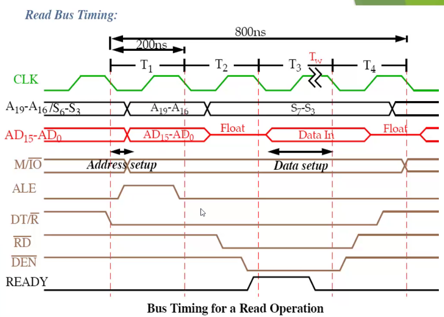

# 算法

需要通过对**所有分支的覆盖和分类**来保证软件的健壮性。

大作业：两人一组用两台计算机并行地处理一个问题。

- 多线程程序
- 网络通讯

知识准备：

- 计算机原理
- 编译原理
- 操作系统调度
    - 调度算法：选择相应的任务进入执行队列。

Textbook

- 系统编程：分布式应用的设计与开发
- 深入理解计算机系统
- 并行程序设计导论

## 基础篇

### 变量和结构体

```c
float fa = 0.3; // fa == 0.3f 隐式类型转换
fa == 0.3; // false
float fb = 0.3f;
fb == 0.3f; // true
fb == 0.3; // false
```

在现在的人工智能领域浮点数会使用半精度浮点数（16 bit），减少内存占用。

整数和浮点数的加法不同，因此对应不同的逻辑电路。

总线通讯的两个问题：

1. 地址
2. 冲突

如果计算机支持 FPU(floating point unit)，那么对于整数和浮点数的计算，不光指令集不一样，使用的寄存器也不一样。

在编译的过程中，编译器将所有的变量转换成了地址，后面通过指针访问变量的值。

总线时序



``mov`` 指令引起总线时序。

指针解引用的过程中对地址的访问

```c
int a = 0;
int * p; // 告诉编译器要预留内存空间
p = &a;
(*p)++;
```

``(*p)++`` 是一个复杂的操作。

```assembly
mov eax, dword ptr [a]
mov ecx, dword ptr [eax]
add ecx, 1
mov edx, dword ptr [p]
mov dword ptr [edx], ecx
```

可以看出，在加一之前访问了两次地址，调用了两次 ``mov`` 指令。使用指针变量访问数据实际上变慢了。

动态内存申请的指针

```c++
char a = '0';
int len = 3;
char *p1 = &a; // correct
char *p2 = new char[len];
p2 = &a; // wrong!!!
```

因为动态内存申请的空间的唯一标识符是指针 ``p2``，所以虽然在实际上 ``p2`` 可以随意赋值，但是赋值后会导致内存丢失，**极其隐蔽的错误**！

相似的错误：

```c++
int len = 3;
char *p2;
while (1)
{
    p2 = new char[len];
}
```

申请的一段空间如果让两个指针指向这里，也只能释放一次。

```c++
int len = 3;
char *p2 = new char[len];
char *p3 = p2;
free(p3);
free(p2); // wrong!!!
```

``void*`` ptr

``void*`` 不用来解引用赋值，只用来寄放地址而已。

结构体

```cpp
struct XX
{
    int a;
    int b;
    char * c;
}

int main(void)
{
    XX A, B;
    int * p = new int;
    A = { 1, 2, p };
    B = A;
    delete A.c;
    delete B.c; // wrong
}
```

### 堆栈

一个现象：在程序中依次定义多个变量，反汇编以后变量的地址是依次减少的。

局部变量都存储在栈中。在 VS Compiler 中栈的指针随着 ``push`` 递减。栈的大小在 KBytes 级别。

```cpp
int main()
{
    int a[10000000]; // wrong!
    int *pa = new int [10000000]; // ok
}
```

> 全局变量都存储在全局堆中。

局部变量释放于本嵌套括号的右括号处。

``new``, ``malloc`` 申请的动态空间在堆中存储。堆的大小在 GBytes 级别。

> [!question]
> 程序的编译结果为 ``.exe`` 文件，每一次编译相同的程序，生成的可执行文件都是一样的。但是为什么运行同样的程序，给变量分配的地址不同呢？

因为从可执行文件到 CPU 指令之间存在操作系统的加载过程：操作系统需要判断程序需要的空间大小，在当前的内存状态中寻找足够的空间以供使用。

### 参数传递、函数返回

函数调用的过程中，会将参数列表从右到左依次压栈。后续函数代码执行的时候，直接访问栈中的数据作为形参。从右到左压栈是为了在函数执行的时候可以从栈顶到栈底依次访问得到从左到右的实参。

参数传递是深拷贝，因此对于较大的结构体，应当传入指针。为了保证安全性，需要在参数列表中使用 ``const TYPE * ptr_type`` 形式的语句。

函数在执行的时候，后续定义的新的自动变量压栈，盖到原来的参数上面。

函数执行完毕，返回值也用完以后，函数的栈的栈顶指针回到栈底。

函数**一定不能**返回指向自动变量的指针，可以在函数中动态内存申请，返回指向堆区的指针。

空指针作为函数参数。

### 多文件

宏：预处理（替换），由于是替换，因此容易出现错误。

```cpp
#define ADD(x, y) x + y

int main()
{
    std::cout << ADD(1, 2) * 3 << endl; // 1 + 2 * 3 = 7 not (1 + 2) * 3 = 9
    return 0;
}
```

正确的写法：

```cpp
#define ADD(x, y) ((x) + (y))
```

``#include`` 就是一个替换的宏操作，不管头文件里面有什么内容，甚至头文件不是 ``*.h`` 也可以。

编译：只看本文件

链接

- 静态：文件由于包含静态链接库里的代码，大小会变大，但是运行不依赖环境。
- 动态：运行依赖环境，但是文件较小。目前的操作系统都提供动态链接库，因此大部分可执行文件脱离操作系统无法执行。

程序加载器在加载可执行文件的时候，首先要查看可执行文件的依赖（动态链接库有那些，调用了那些函数）。

## 提高篇

### OOP

OOP 内部提供一种机制，将变量从生到死的每一个过程都可以让程序员参与处理。

构造和析构

> [!question]
> C 内置普通变量的定义和 C++ 自定义类型变量的定义有什么区别？

- OOP 在定义变量的时候向用户提供了参与定义的方式：构造函数。
- OOP 甚至在销毁变量的时候向用户提供了参与定义的方式：析构函数。

> 使用 OOP 的方法构造程序，工作量会变大，但是提供给用户的界面比较简单。

如果不写构造函数，系统会有默认构造函数。

```cpp
class Student;
Student *pstu = new Student();
```

析构函数可以在变量死亡的时候释放掉不用的堆空间。

封装 Capsulation

- 通过对变量的封装，使程序更加稳健，不容易输入非法数据。
- 这样代码调用变得复杂，简化方法：

```cpp
__declspec(property(get = getAge, put = setAge)) int Age;
int getAge();
bool setAge(int a);
```

这样就把变量 ``age`` 变成属性 ``Age``，使用后者的时候会触发事件，调用函数。

```cpp
if (true == (pstu->Age = 20)) // call function: setAge()
{
    cout << pstu->Age << endl; // call function: getAge()
}
else 
{
    cout << "error" << endl;
}
```

给属性赋值的时候，返回值是**属性赋值函数的返回值**，而不是按照 C 的规则。

**拷贝**

- 浅拷贝
- 深拷贝

```cpp
class ABC {
public:
    int * p[10];
    int p_len[10];
    ABC();
    ~ABC();
}

ABC::ABC()
{
    cout << "ABC created." << endl;
    this->p[0] = new int[100];
}

ABC::~ABC()
{
    cout << "ABC destroyed." << endl;
    delete this->p[0];
}
```

浅拷贝：只复制指针的值

```cpp
ABC abc1, abc2;
abc2 = abc1;
```

这里的等号是默认的，未经重载。

一般来说，不手动写代码，编译器不能帮助我们实现深拷贝。可以**重载等号**。

```cpp
ABC& operator=(const ABC& d)
{
    this->p_len = d.p_len;
    for (int i = 0; i < this->p_len; i++)
    {
        *(this->p[i]) = *(d.p[i]);
    }
    return *this;
}
ABC abc2, abc1;
abc2 = abc1;
```

在构造的时候进行了强制类型转换。

```cpp
ABC::ABC(int i)
{
    ; // ...
}
```

```cpp
ABC abc = 1;
```

先将 1 隐式转换成临时的 ``ABC`` 对象，在进行对象之间的拷贝，之后再析构临时对象。

**值得注意的是，即使进行了对于等号的运算符重载，在定义的同一语句使用等号初始化，也不会调用重载后的等号函数。**

如果重载了对象的加法，需要注意加法的顺序问题：

```cpp
ABC abc1;
ABC abc2 = abc1 + 5.0; // correct
ABC abc2 = 5.0 + abc1; // wrong
```

因为没有定义对于 ``double`` 类型的运算符重载，而**对于基本数据类型的运算符重载是不支持的**，否则所有的基本运算都会紊乱。

### Template

模板是泛型的最简单案例。

```cpp
template <typename T>
void swap(T* a, T* b)
{
    T temp = *a;
    *a = *b;
    *b = temp;
}
```

注意到类 ``T`` 必须重载等号。

它并不产生代码，编译器在编译代码的时候会根据传入实参的类型**实例化**函数代码。

模板头和和函数定义（声明）是不可分割的，可以换行但是中间**不能有分号**。

模板头放在类前。则所有类的成员函数之前也要加入模板头。

```cpp
template <typename T1, typename T2>
class Point{
private:
    T1 m_x;
    T2 m_y;
public:
    T1 get_x();
};
template <typename T1, typename T2>
T1 Point<T1, T2>::get_x()
{
    return this->m_x;
}
```

另外也要注意 ``Point<T1, T2>`` 的写法。因为 ``Point`` 这个类具体如何实例化需要指定 ``T1, T2``。

```cpp
Point<int, int> p1(10, 20);
Point<int, float> p1(10, 15.5);
Point<float, char*> p1(10.5, "东经120度");
```

```cpp
T add(const T &a, const T &b)
{
    return a + b;
}
```

加入引用可以减小程序调用开销，但是为了保证变量不被修改，需要加入常量关键字。

如果不使用引用，会发生类的拷贝。

可变长数组 ``push_back``

每次 ``push_back`` 都需要重新申请空间，然后将数据拷贝过去，太耗费时间。

- 申请空间超量申请，比用户指定的要多
- 链表

### STL

标准模板库

```cpp
vector<int> values {1, 2, 3, 4, 5};
values.reserve(1024);
values.resize(1024);
values.push_back(6);
auto first = values.begin();
auto end = values.end();
while (first != end)
{
    std::cout << *first << ' ';
    ++first;
}
```

- ``reserve`` 的作用是提高后续 ``push_back`` 的速度，但是不是真正的预留空间。
- ``resize`` 的作用才是申请空间。

``auto`` 是编译器自动推理生成的数据类型。

或者可以：（麻烦）

```cpp
vector<int>::iterator first;
```

STL 容器

- ``vector`` 变长数组
- ``deque`` 双向数组（头尾插入元素都比较快）
- ``list`` 双向链表
- ``pair``
- ``map``
- ``set``
- adapter 基于之前的容器，但是有特定的明确用途
    - ``stack`` LIFO
    - ``queue`` FIFO

和它们的变形。

获取容器的迭代器

- ``begin()``
- ``end()``

算法

- ``sort``
- ``find``
- ...

vector

> [!question]
> 使用 ``at`` 访问数据可以防止数组越界吗？

可以，但是使用中括号也可以。只是在报错形式上不同，``at`` 的报错可以拦截。

> [!why?]
> ``front``, ``back`` 函数可以被赋值（返回值引用？）

```cpp
vector<int> v{1, 2, 3};
v.front() = 0;
v.back() = 4;
```

``data`` 返回数据堆区指针。满足 C 程序员的恶趣味。

``for`` 循环的恶趣味

```cpp
for (auto i: values);
```

这里的 ``i`` 是**值**，不是指针。

``emplace_back`` 比 ``push_back`` 函数更高效，直接在数据末尾增加了新对象，相比 ``push_back`` 先构造，后拷贝到对应位置更高效。

deque

还有 ``push_front``

map

键值对和 python 相反。

### 存储管理

保护模式：程序给出的地址不是存储器的物理地址，进程隔离

> [!question] 保护模式带来什么问题？
> - 进程之间丧失了绝对的地址，如何进行进程之间的通讯？
> - 每个进程在 32 位系统中都有很大的理想内存可以访问，这些总数加起来一定比实际物理内存大多了，如何解决冲突问题？

切换程序的时候，将不需要的任务踢到硬盘上，将需要的任务加载到腾出来的内存中。

由于引用了 cache，因此下面两段代码中，下面的代码效率更高。

```cpp
for (int i = 0; i < MAX; i++)
{
    for (int j = 0; j < MAX; j++)
        buffer1[i][j] = i;
        buffer2[i][j] = i;
}
```

```cpp
for (int i = 0; i < MAX; i++)
{
    for (int j = 0; j < MAX; j++)
        buffer1[i][j] = i;
}
for (int i = 0; i < MAX; i++)
{
    for (int j = 0; j < MAX; j++)
        buffer2[i][j] = i;
}
```

## 并行化

- 单指令多数据 + 多线程
- 多线程到 OpenMP
- Socket -> RPC（远程过程调用）
- 多级 -> MapReduce
- RTOS

### 线程

面向事件驱动：现在的 GUI 程序，打开窗口以后会循环，等待操作系统的 message，进行响应。点击一个按钮，就会触发按扭下 click 的代码。

```cpp
while (1)
{
    switch (msg)
    {
    case click:
        ...;
    }
}
```

> [!question]
> 为什么在操作系统中，一个进程进入死循环，其他进程还能正常运行？

Windows 分配计算资源的最小单位是 thread. 一个 process 默认是一个 thread，如果没有多线程编程，会被操作系统当作一个线程分配时间。

消息的数据结构是队列，是异步的。

指定一个线程做什么事：

- ID
- 消息
- 函数：执行的指令集合

伪造消息

创造线程

```cpp
handle1 = CreateThread(0, 0, ThreadProc, (LPVOID)&test, 0, NULL);
```

- handle1: 线程句柄，表示线程的唯一标志，不要定义成局部变量
- ThreadProc: 回调函数
- test: 回调函数的参数
- 第三个 0: 立即开辟新线程

并发编程的瓶颈：不能同时访问一个变量。

- 线程互斥锁
- 不同变量

使用**线程互斥锁**：

主线程：

```cpp
WaitForMultipleObjects(MAX_THREADS, hThreads, TRUE, INFINITE); //先去掉试试.另外，万一线程是个while，怎么同步？
ReleaseMutex(hMutex);
```

其他线程：

```
WaitForSingleObject(hMutex,INFINITE); // 无限等待
cout << "thread id: " << *(int*)lpParameter << " count: " << ++::count << endl; // 执行任务
ReleaseMutex(hMutex);
```

> [!question]
> 由于用了互斥，导致实际上还是串行执行，丧失了并发执行的优势。

### 计算机网络

ip 来源：

- 静态（不是合法的公认身份）
- 动态

DHCP 软件可以帮助分配动态 ip.

网卡出厂只有 MAC address，设备连接了 WiFi 结点以后才会分配 ip address. 

如果两台主机直接相连，不会直接分配 ip address.

两台主机可以连接的条件（满足一个即可）：

1. 在同一网络 $\iff$ ``ip1 & Subnet Mask == ip2 & Subnet Mask``
2. 设定网关（Gateway）和路由器，网关和设备的 ip 一定处于同一网络

如果两个设备在同一网络，实际上只有 MAC address 也可以直接通讯（链路层），如果只有 ip address，可以通过地址解析协议（arp），进行翻译，得到 MAC address.

DNS 服务器的作用：将域名 url 翻译成 ip address.

IP:port 将信息送给指定的进程。

套接字 Socket

ip1:port <---> ip2:port

- TCP 面向连接的服务
- UDP 单向地扔数据
