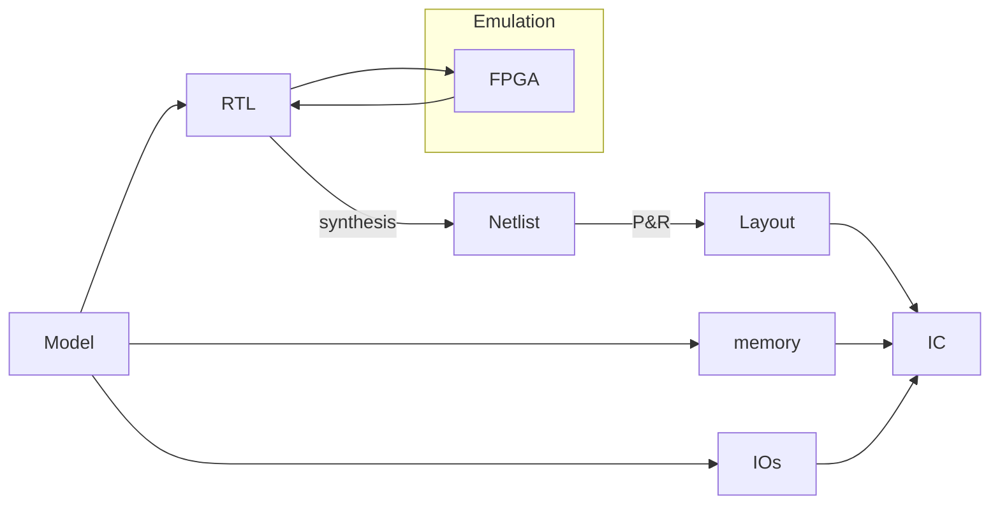
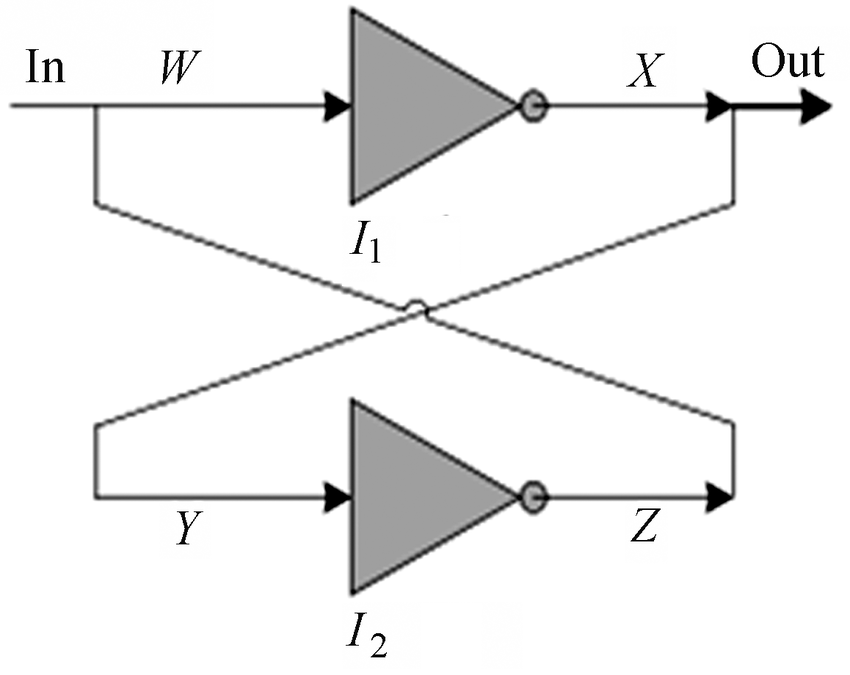
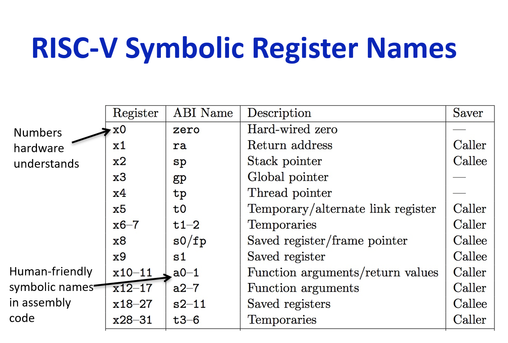
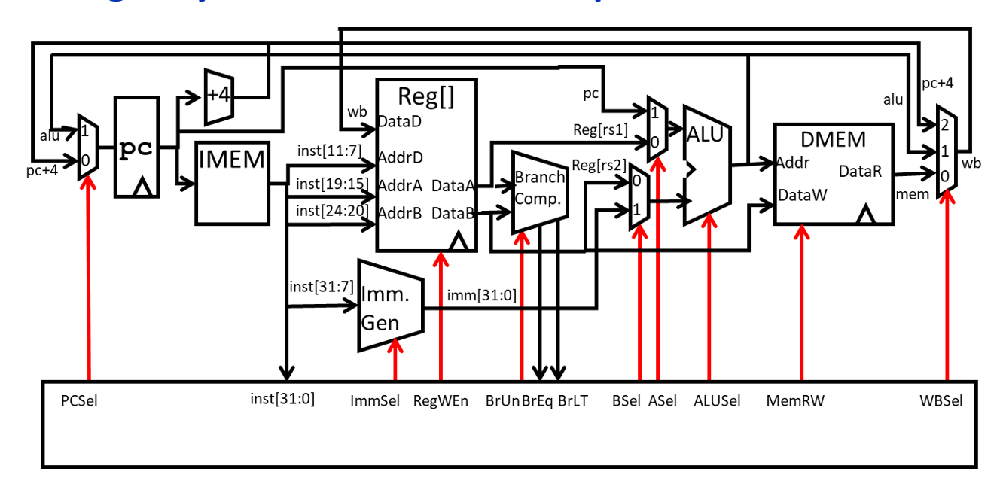
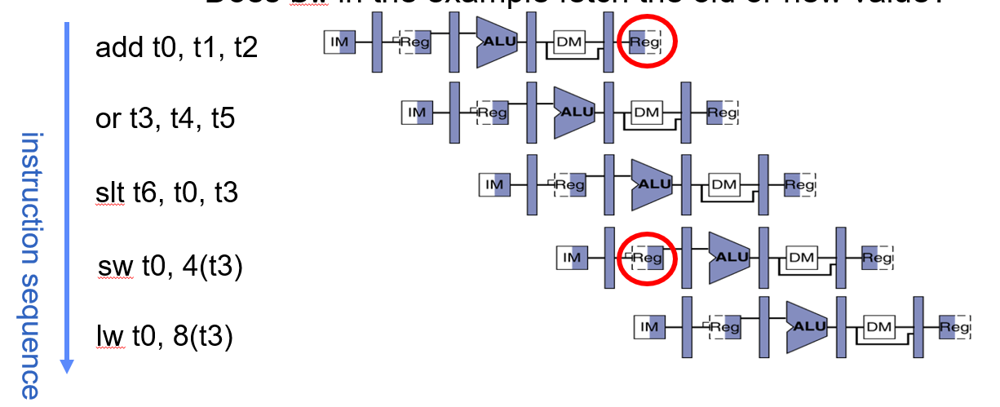
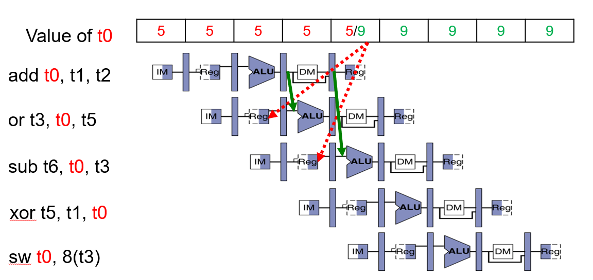
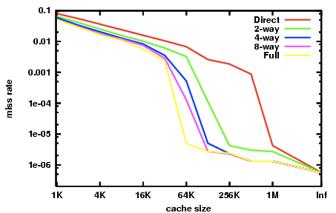

# 智能芯片与系统实践

助教：王若瑶 distancepublic@163.com

- RISC-V
- Verilog
- FPGA
- memory hierarchy
- parallelism
- hardware-software interface(compile)
- embedded processor, DSP, GPU, NPU(neural), warehouse-scale computer, cloud computing
- design a complete processor with all functions (independently)

- 考勤 10%
- 作业 25%
- 讨论课 25%
- 项目 40%

***Computer Organization and Design*** *Hennessey & Patterson*, *5th edition*

- UCB CS61C/CS152
- MIT 6.004
- CMU 18-447

- jfwu@tongji.edu.cn
- yzchen@tongji.edu.cn

---

<!--

## Chapter1: Computer Abstractions and Technology

How hardware and software components affect performance?

| Components                        | Affect                                                                            |
| --------------------------------- | --------------------------------------------------------------------------------- |
| Algorithm                         | both the number of src-level statements and the number of I/O operations executed |
| language, compiler & architecture | the number of computer instructions for each src-level statement                  |
| processor and memory sys          | how fast the computer instructions are executed                                   |
| I/O sys                           | how fast the I/O operations are executed                                          |
-->

## Lecture1

Introduction

如何设计芯片？



RTL: register transfer level

Memory Arrays

- DRAM: dynamic random access memory **main**, use capacitor to store data
- SRAM: static random access memory, use cross-coupled inverter
- ROM: read only memory **nonvolatile**

cross-coupled inverter



2 维矩阵，每个单元 1 bit。N 位地址长度，M 位数据长度。$M \times 2^{N}$

e.g. 1024 word $\times$ 32 bit array

N 位地址通过译码器到达矩阵阵列，使能相应的单元读出数据，由于译码器输出只有一路电平有效，因此不会出现冲突。

## Lecture2

Memory and Logic Arrays

## Lecture3

RISC-V ISA and C lang

- shift
- jump
- link
- compute(+-\*/, logic)
- compare
- load
- store

**Register**: Assembly variables

寄存器越多，寄存器的寻址难度就越高，硬件开销就越大。

在 RISC-V 中总共 32 个寄存器。x0 - x31

每个寄存器大小为 32 bits.

x0 寄存器的值始终为 0，不可赋值。

32 个寄存器的作用



Assembly lang e.g.

```assembly
add x1, x2, x3 # x1 = x2 + x3
```

where ``x1``, ``x2``, ``x3`` are all registers, ``#`` is comment mark.

```c
a = b + c + d - e;
```

```assembly
add x10, x1, x2
add x10, x10, x3
sub x10, x10, x4
```

add constant: ``addi``

```assembly
addi x2, x1, 1
```

赋值中 x0 的作用

```assembly
add x2, x1, x0
```

立即数指令的特点

- 指令名称有 i
- 指令数据有常数

如何 load 32bit 立即数？

```assembly
LUI x10, 0x87654 # x10 = 87654000
ADDI x10, x10, 0x321 # x10 = 0x87654321
```

LUI 是 U 型指令，可以 load 高位立即数。

但是，对于 0xDEADBEEF，由于 ADDI 的立即数 0xEEF 在符号位上是 1，ADDI 算法会自动按照算数加法，把立即数看作负数处理。

```assembly
LUI x10, 0xDEADB # x10 = 0xDEADB000
ADDI x10, x10, 0xEEF # x10 = 0xDEAD"A"EEF
```

所以怎么做呢？编译器进行补偿。

```assembly
LUI x10, 0xDEADC # x10 = 0xDEADC000
ADDI x10, x10, 0xEEF # x10 = 0xDEAD"B"EEF
```

## Lecture4

一个周期内 CPU 的 5 步：

1. instructions fetch
2. Decode & Register read
3. execute
4. Memory interaction
5. Register write back



- Input(11)
    - inst\[31:0\]: 需要解析的指令，对于学过的指令，只需要传入 30, 14:12, 6:2 共 9 bits
    - BrEq: branch compare 得到的结果是否是等于
    - BrLT: branch compare 得到的结果是否是小于
- Output(15)
    - PCSel
        - 0: 正常顺序执行
        - 1: 跳转，遇到 B 型指令或者 J 类指令
    - ImmSel\[2:0\]: 选择立即数的位数
    - RegWEn: 寄存器是否可以被写回
    - BrUn: 分支比较器是无符号比较还是有符号
    - BSel: 输入是 rs2 还是 Imm
    - ASel: 输入是 rs1 还是 PC
    - ALUSel\[3:0\]: 选择计算方式
    - MemRW: 内存读写
    - WBSel\[1:0\]: 写回寄存器的数据选择

可以用一个 11 bits 输入，15 bits 输出的组合逻辑电路实现 Controller。

## Lecture5

Processor Performance

- Time
- Energy

$$
\frac{Time}{Program} = \frac{Instructions}{Program} \cdot \frac{Cycles}{Instructions} \cdot \frac{Time}{Cycles}
$$

**Instructions per Program**

- Task
- Algorithm $O(N^{2})$ vs $O(N)$
- Programming Lang
- Compiler
- ISA Instruction Set Architecture

**Cycles per Instruction** 可以使用流水线技术将这个值降低到 1 以下

- ISA
- microarchitecture (For RSIC-V, CPI = 1)
- Complex Instructions
- Superscala processor

**Time per Cycle** 硬件工程师的活

$$
\begin{aligned}
    & \frac{Energy}{Program} = \frac{Instructions}{Program} \cdot \frac{Energy}{Instruction} \\
    & \frac{Energy}{Instruction} \propto C V^{2}
\end{aligned}
$$

$C$ 是反相器寄生电容的值，反相器反相，寄生电容会充放电。

Pipelining

可以使用流水线技术，将执行指令的 5 步分开，上一个指令用完这一步以后下一个指令紧接着走这一步。

- Structural Hazard
- Data Hazard
- Control Hazard

**Structural Hazard**

- Memory Access: 对数据内存操作的同时对指令内存操作。（现代内存一般不会出现这种情况，要分隔指令和数据）
- 在同一阶段（步），一个指令在写回寄存器，一个指令在读寄存器。



所以在这一步中，先对寄存器写，再对寄存器读。

> 注意在图中，第二条指令和第三条的 t0, t3 使用的是没有被改变的寄存器的值。这可能是编译器故意的。

但是如果不是故意的，这样就是有问题的。如何解决呢？

**Data Hazard**

Sol1: Stalling

在第二条指令和第三条指令中间加两条空指令（啥也不做）

Sol2: Forwarding

ALU 单元一旦算出来就直接给下一步的 ALU 输入。



两条回路：

1. 从 DM 读出的数据寄存器中引回 ALU A 端；
2. 从 ALU 的结果端数据寄存器引回到 ALU A 端。

但是，仍然存在冲突：

Load Data Hazard

```asm
lw x2, 20(x1);
and x4, x2, x5;
```

第二部的 x2 的值需要通过访存获取，但是这一时刻，上一步指令才开始访存，尚未获得 x2 的值。

对于这两种冲突就只能采用添加 Bubble 指令的方式解决了。

或者，也可以采用比较粗暴的方式，降低流水线的级数，比如将原来的 ALU 计算和访问数据存储 DM 算作一级，这样就可以解决 Load Data Hazard 了。

如果可能的活，也可以通过改变指令执行的顺序来尽可能规避这种情况：

```c
d = a + b;
e = a + c;
```

original order: (13 cycles)

```asm
lw t1, 0(t0)
lw t2, 4(t0)
add t3, t1, t2 # STALL!
sw t3, 12(t0)
lw t4, 8(t0)
add t5, t1, t4 # STALL!
sw t5, 16(t0)
```

adjusted order: (11 cycles)

```asm
lw t1, 0(t0)
lw t2, 4(t0)
lw t4, 8(t0)
add t3, t1, t2 # Not STALL!
sw t3, 12(t0)
add t5, t1, t4 # Not STALL!
sw t5, 16(t0)
```

**Control Hazard**

- Branch
- Jump

分支预测：

- 动态
- 静态：预测为 Lable/PC+4

**Super Scala Processor**

- 矢量处理器，对数组进行同时处理。例如 GPU，速度提升主要体现在乘法和加法。
- 标量处理器，对单一数据串行处理。
- 超标量处理器，多个标量处理器实现同时处理多个指令。

## Lecture6

Memory hierarchy and caches

为了调和存储空间和访问时间的矛盾，构造了内存体系。从处理器到硬盘，存储空间递增，访问速度递减。

- Temporal Locality 如果某个内存被访问，那么后续访问的可能性增加。
- Spatial Locality 如果某个内存被访问，那么附近内存被访问的可能性增加。

**mem access without cache**

```asm
lw t0, 0(t1)
```

- processor ---> memory: address(t1)
- memory read at address(t1)
- memory ---> processor: data

**mem access with cache**

- processor ---> cache: address
- cache check if it has copy of data at that address
    - HIT(has): reads data and send to processor
    - MISS(does not have): send address to mem ...

How to tell HIT and MISS?

把地址放在数据的旁边（tag），这样一下就找到了。

如果发生了 cache miss，那么就需要从内存中找，找到以后要赶走原来在 cache 中的一个数据。

关于地址：由于内存中的数据都是对齐的，每隔 32 bits 存放数据，所以地址都以 \*\*00 结尾，这两位没有存储的必要，也不需要在比较器中比较。

目前来说我们利用了???



Sources of Misses

- cold start, invalid initial data in cache
- capacity, would not occur in infinite cache
- conflict, would not occur in fully associative cache

是不是要设计 cache 是根据处理器要运行什么类型的代码决定的。一些嵌入式设备（例如 Cortex-M0）没有 cache.

性能指标

$$
\text{AMAT} = \text{Time for a hit} + \text{Miss rate} \times \text{Miss Penalty}
$$

- reduce the Time for a hit: smaller cache
- reduce the Miss rate: bigger cache
- reduce the Miss Penalty: multiple cache levels

Performance of Multi Level Cache

$$
\begin{aligned}
\text{AMAT} &= T_{hit,1} + \eta_{miss,1} \left[ T_{hit,2} + \eta_{miss,2} \left( \cdots \right) \right]
\end{aligned}
$$

- L1 focus on **fast hit**.
    - L1 Data Cache
    - L1 Intruction Cache
- L2, L3 focus on **low miss rate**.

## Lecture7

Virtual Memory

操作系统为每一个进程分配一个虚拟内存，这样不同进程之间就不会有冲突了。

Memory manager

- Maps virtual to physical addresses.
- Protection
    - Isolate memory between processes
    - Each process gets dedicate（专用的） "private" memory
    - Prevent user programs from messing with OS' memory
- Swap memory(DRAM) to disk
    - 通过在磁盘上存储一些内容来给人更大的内存的错觉（类似缓存的特征）

Paged memory

- Physical memory is broken into pages
- Typical page size: 4KB+

Each process has a dedicated page table. Physical memory non-consecutive.

当然这些 pages 对于一个进程来说在物理空间上并不是连续的。

对于用户来说，访问的地址是虚拟地址。虚拟地址分成两个部分，第一个部分是 page 的序号，第二个部分是在 page 中的地址。

| Virtual address (e.g. 32 bits) |                               |
| ------------------------------ | ----------------------------- |
| page number (20 bits)          | offset (12 bits for 4KB page) | 

对于每一个进程，都有一个 page table，page table 的一行中存储了虚拟地址的 page number 和该 page 对应的物理地址前几位（除掉 page 的大小），也就是 page address.

| page table  |              |
| ----------- | ------------ |
| page number | page address | 

- OS keeps track of which process is active, and choses correct page table for the process.
- Memory manager extracts page number from virtual address.
- Page tables handled by OS

当然内存在进程之间的共享也是可以实现的，操作系统允许多个进程访问同一块物理内存，例如这个内存储存的是时间等信息。

Write Protection：实现对于特定的虚拟内存数据的保护。

|                      | page table  |              |
| -------------------- | ----------- | ------------ |
| write protected(0/1) | page number | page address |

有时候 cache 也可以存储最活跃的进程的 page table 信息，以供操作系统频繁调用物理内存读写。

Paged Memory

每一个 page 有两个 bit 表示该 page 的信息：

- valid bit 这个 page 是否对于该进程有效（活跃）
- DRAM/disk 这个 page 是在 DRAM 还是在 disk 上（Swap Memory(DRAM) to disk）

使用某一个 page 时，首先检查 valid bit:

- unvalid: allocate new page in DRAM
    - if all not available, 抢占别人的 page
- valid
    - if in DRAM: write/read
    - if in disk: allocate new page in DRAM
        - if all not available, 抢占别人的 page:
            - store evicted page to disk
            - read page from disk to dram
            - read/write

## Lecture8

I/O interface, Bus, Network, OS

several kinds of terminology

- Interrupt 异步的、当前程序之外的中断（键盘、硬盘出入），方便时响应
- Exception 程序执行异常（除以零、总线错误、指令误码），需要紧急响应

Trap: 将 Interrupt 和 Exception 提供给 CPU 跳转到相应的中断向量表。
