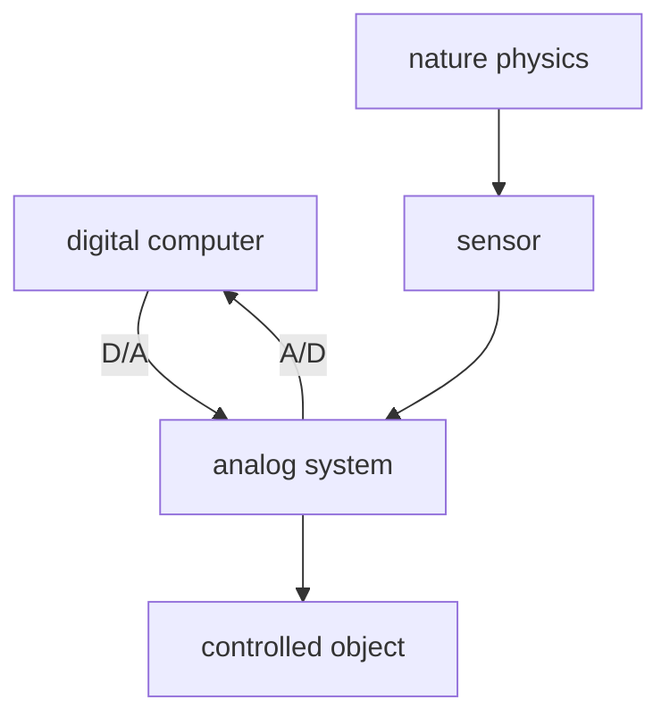
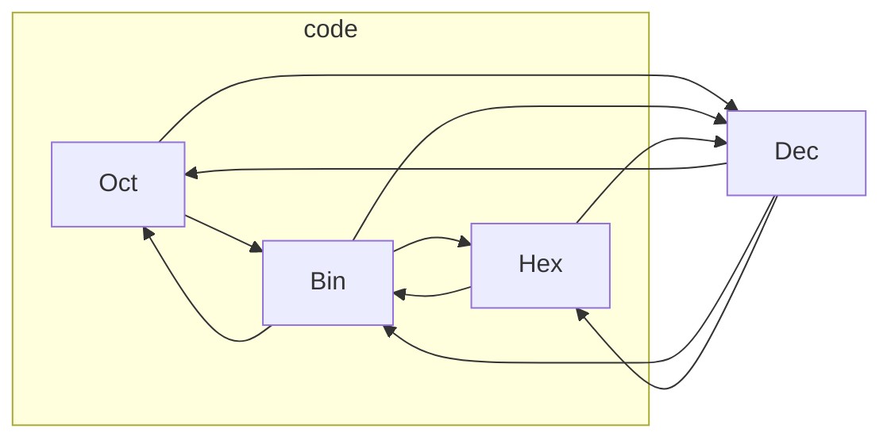
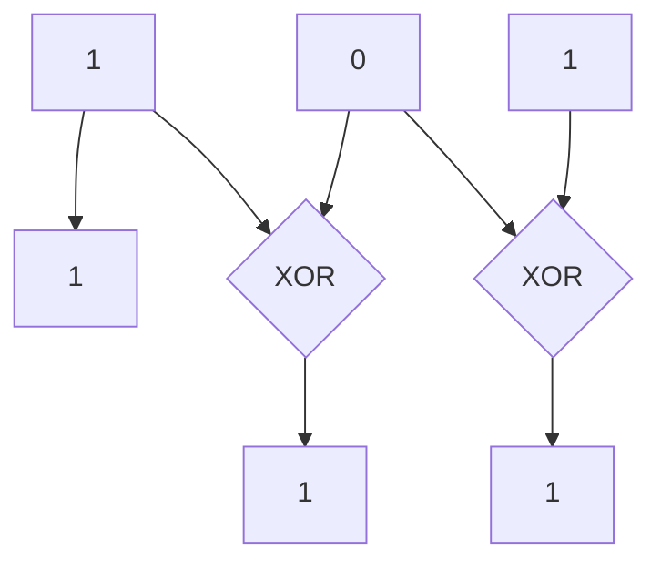

# Digital Circuit

Thursday noon 12:30~13:00 for asking

邮箱 yahui_zhao@tongji.edu.cn

数字电路中，晶体管一般工作在截止区和饱和区，起到开关的作用。

一些数字信号：

- 尖顶波
- 方波

---

数字信号的表示方法

- 电平型信号：低电平表示 0，高电平表示 1. 用时间节拍作为一个单位。
- 脉冲型信号：有脉冲为 1，无脉冲为 0.
- ~~电流信号：少~~

5G 指的就是时间节拍的频率。频率越高，信息量越大。

---

A/D transformation.

sample -> quantize


digital computer: store, analyze, control.

---

Digital electronic tech:

- encoding
- calculate
- memorize
- count
- store
- measure
- transform

---

Properties

- binary
- easy to integrate
- resistance to noise
- easy to restore and keep secret
- general

---

Content

- 布尔代数
- 逻辑门电路
- 组合逻辑电路
- 触发器
- 时序逻辑电路

---

## 1.Basic Digital Logic

---

Number System

- Decimal
- Binary
- Octal
- Hexadecimal: (0-9A-F)

---

| Dec | Bin  | Oct | Hex | Dec | Bin  | Oct | Hex |
|:---:|:----:|:---:|:---:|:---:|:----:|:---:|:---:|
|  0  | 0000 | 00  |  0  |  8  | 1000 | 10  |  8  |
|  1  | 0001 | 01  |  1  |  9  | 1001 | 11  |  9  |
|  2  | 0010 | 02  |  2  | 10  | 1010 | 12  |  A  |
|  3  | 0011 | 03  |  3  | 11  | 1011 | 13  |  B  |
|  4  | 0100 | 04  |  4  | 12  | 1100 | 14  |  C  |
|  5  | 0101 | 05  |  5  | 13  | 1101 | 15  |  D  |
|  6  | 0110 | 06  |  6  | 14  | 1110 | 16  |  E  |
|  7  | 0111 | 07  |  7  | 15  | 1111 | 17  |  F  |

---

乘法取整

$$
\begin{align*}
&(0.39)_{10} = (?)_{2}\\
&0.39 \times 2 = 0.78 \rightarrow 0\\
&0.78 \times 2 = 1.56 \rightarrow 1\\
&0.56 \times 2 = 1.12 \rightarrow 1\\
&0.12 \times 2 = 0.24 \rightarrow 0\\
&\cdots \\
&(0.39)_{10} = (0.0110\cdots)_{2}\\
\end{align*}
$$

---

Number System Convert



---

二进制算术运算

- 将减法转化为加法
- 乘法：被乘数左移，被乘数与部分积相加
- 除法：被除数右移，余数减去被除数
- 将四则运算转化为移位运算和加法运算

---

二进制正负数的表示法

二进制数存在符号 bit

- 正数为 0
- 负数为 1

---

二进制正负数的三种表示方法

1. 原码：符号位+绝对值二进制数
2. 反码：$N> 0, -N: 2^{n}-1-N$
3. 补码：$N> 0, -N: 2^{n}-N$

---

正数的三种表示相同：

+25: 00011001

原码：

-25: 10011001

反码：

-25: 11100110（对+25按位取反）

补码：

-25: 11100111（反码加一）

---

当带符号的是真小数时，符号位为整数位，只对小数点以后的数值部分取反加一。

从补码到原码的过程和从原码到补码的过程相同：**自反性**

---

作业：（1.4-1.6，1.9-1.13）（4）（6）

---

补码将减法变成加法。

两个数的补码和等于两个数和的补码。如果符号位相加进位，则舍弃进位位，（实际做的是异或运算）。

21 - 26 = ？

0001 0101 + 1110 0110(*0001 1010*) = 1111 1011(*0000 0101*)

---

常用的码：

- 中文汉字
- 英文字母
- 证件编码
- 通讯编码

---

BCD：二—十进制码

用 4 bit 表示十进制的 0~9.有些码是禁用码。共有 $\binom{16}{10}$ 种编码方式。

- 恒权码：8421，2421，5421
- 变权码：余 3 码

**反射特性**：2421 码和余 3 码关于 4.5 对称，在计算加法时进位方便。

n 位十进制数使用 n bytes 表示。

$$
(0101 0000)_{8421BCD} = (50)_{10}
$$

---

可靠性编码：发现错误并纠错。

格雷码：相邻代码间只有一位不同，避免了电路速度区别带来的误码。

奇偶校验码

---

格雷码：无权循环码

相邻项或对称项只有1位不同。

电子系统中，常要求代码按一定顺序变化。例如, 按自然数递减计数，若采用8421码，则数1000变到0111时4位均要变化。

在实际电路中, 4位的变化不可能绝对同步发生，而可能在计数中出现短暂的其他代码（1001、1100等）， 即过渡“干扰项”。在特定情况下，这可能导致电路状态错误或输入错误。

而使用格雷码可 以避免这种错误，这也是格雷码的最大优点。

---

Binary Code to Gray Code

通过高位到低位的异或实现

例如：5（101）



---

![[Pasted image 20220301084945.png]]

---

![[Pasted image 20220303131029.png]]

---

误差校验码

- 奇校验码：1+所有位数之和取最后一位
- 偶校验码：0+所有位数之和取最后一位

- 可以检测单向单错
- 信息码和校验码分离，**可分离码**。
- 简化了**译码过程**

---

字符、数字代码

ASCII：7 位信息位 + 1 位奇偶校验码


---

## 2.Boolean Algebra

---

![[Pasted image 20220301091052.png]]

---

- NAND: $Y = \overline{AB}$
- NOR: $Y = \overline{A+B}$
- AND-OR-INVERT: $Y = \overline{AB+CD}$

![[Pasted image 20220301092635.png]]

---

- Exclusive-OR（异或门）$Y = A \overline{B} + \overline{A} B$
- Exclusive-NOR（同或门）$Y = \overline{A \overline{B} + \overline{A} B} = AB + \overline{A} \cdot \overline{B}$

![[Pasted image 20220301093156.png]]

---

Exclusive-OR application: encoding

将明文和密钥做逐位异或运算得到密文，再将密文和密钥做逐位异或运算得到明文。

---

逻辑代数基本定理

1. 0-1 律
```python
0 | A == A
1 | A == 1
1 & A == 1
0 & A == 0
```
2. 重迭律
```python
A | A == A
A & A == A
```
3. 互补律
```python
A | (~A) == 1
A & (~A) == 0
```
4. 还原律
```python
~(~A) == A
```

---

1. 交换律
2. 结合律
3. 分配律
```python
A & (B | C) == (A & B) | (A & C)
A | (B & C) == (A | B) & (A | C)
```

---

1. 吸收律：存在冗余项。
```python
A&B | A&(~B) == A
A | (A&B) == A
A | ((~A)&B) == A | B
(A&B)|((~A)&C)|(B&C) == (A&B)|((~A)&C)
```
2. 反演律
```python
~(A&B) == (~A)|(~B)
~(A|B) == (~A)&(~B)
```

---

Duality


---

1. 带入规则
2. 反演规则：不能改变运算顺序
```python
Y = (A&B)|C
~Y == ((~A)|(~B))&(~C)

Y = A & (~(B | C)) | (C & D)
~Y == (~A | (~(~B & ~C))) & (~C | ~D)
```
3. 对偶规则：变量不取反，交换与和或，0 和 1，等式仍然成立。
```python
A | (A&B) == A
A & (A|B) == A

A&B | ~A&C | B&C == A&B | ~A&C
(A|B) & (~A|C) & (B|C) == (A|B) & (~A|C)
```

---

逻辑函数的表示

1. 真值表
2. 函数式
3. 逻辑图

---

如何从真值表得到函数式？

1. 找出函数值为 1 的项；
2. 将这些项中，输入变量为 1 的记录原变量，输入变量为 0 的记录反变量，取与运算；
3. 将上一步得到的各项取或运算。

得到的结果是与或式，或许可以化简。

---

```
A&B|~A&~B == ~(~(A&B | ~A & ~B)) == ~( ~(A&B) & ~(~A & ~B))
```

把三种逻辑（与、或、非）转化成了两种逻辑（与非、非）。比原来更优。

---

用电路实现 $y = 2x+3$

| X1  | X2  | X3  | Y1  | Y2  | Y3  | Y4  | Y5  |
| --- | --- | --- | --- | --- | --- | --- | --- |
| 0   | 0   | 0   | 0   | 0   | 0   | 1   | 1   |
| 0   | 0   | 1   | 0   | 0   | 1   | 0   | 1   |
| 0   | 1   | 0   | 0   | 0   | 1   | 1   | 1   | 

......

---

标准与或式：最小项的或

最小项：与、非式且包含所有自变量。

| 最小项   | 对应的十进制数 | 编号 |
| -------- | -------------- | ---- |
| ~A&~B&~C | 0              | m0   |
| ~A&~B& C | 1              | m1   |
| ~A& B&~C | 2              | m2   |
| ~A& B& C | 3              | m3   |
| A&~B&~C  | 4              | m4   |
| A&~B& C  | 5              | m5   |
| A& B&~C  | 6              | m6   |
| A& B& C  | 7              | m7   |

---

1. 必然有且仅有一个最小项为 1.
2. 任意两个不同的最小项的与，结果为 0.
3. 具有相邻性（只有一个变量不同）的两个最小项的或，结果可以合并，并消去这个不同的变量。

```python
A&B&~C | A&B&C = A&B
```

---

最大项：或、非式且包含所有自变量。

| 最大项   | 对应的十进制数 | 编号 |
| -------- | -------------- | ---- |
| ~A+~B+~C | 0              | M0   |
| ~A+~B+ C | 1              | M1   |
| ~A+ B+~C | 2              | M2   |
| ~A+ B+ C | 3              | M3   |
| A+~B+~C  | 4              | M4   |
| A+~B+ C  | 5              | M5   |
| A+ B+~C  | 6              | M6   |
| A+ B+ C  | 7              | M7   |

（这里用+代替或）