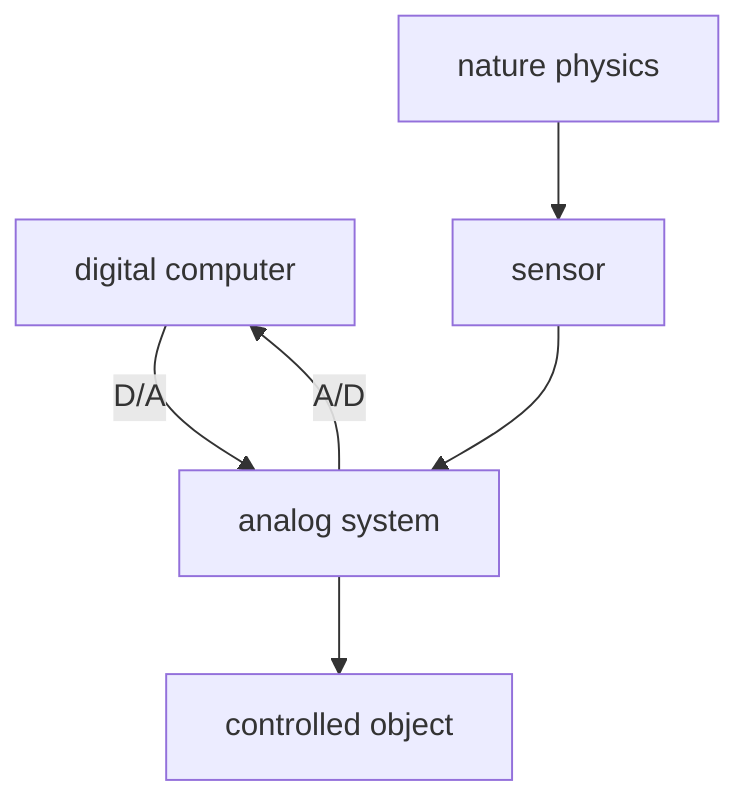
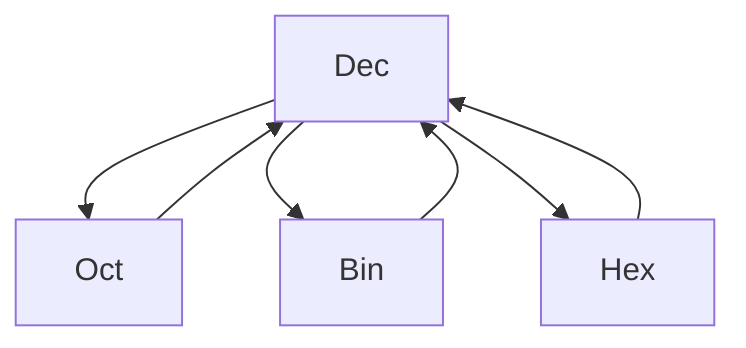

# Digital Circuit

Thursday noon 12:30~13:00 for asking

邮箱 yahui_zhao@tongji.edu.cn

数字电路中，晶体管一般工作在截止区和饱和区，起到开关的作用。

一些数字信号：

- 尖顶波
- 方波

---

数字信号的表示方法

- 电平型信号：低电平表示 0，高电平表示 1. 用时间节拍作为一个单位。
- 脉冲型信号：有脉冲为 1，无脉冲为 0.
- ~~电流信号：少~~

5G 指的就是时间节拍的频率。频率越高，信息量越大。

---

A/D transformation.

sample -> quantize

digital computer: store, analyze, control.

---

Digital electronic tech:

- encoding
- calculate
- memorize
- count
- store
- measure
- transform

Properties

- binary
- easy to integrate
- resistance to noise
- easy to restore and keep secret
- general

---

Content

- 布尔代数
- 逻辑门电路
- 组合逻辑电路
- 触发器
- 时序逻辑电路

---

# 1 Basic Digital Logic

---

Number System

- Decimal
- Binary
- Octal
- Hexadecimal: (0-9A-F)

---

| Dec | Bin  | Oct | Hex |
|:---:|:----:|:---:|:---:|
|  1  | 0001 | 01  |  1  |
|  2  | 0010 | 02  |  2  |
|  3  | 0011 | 03  |  3  |
|  4  | 0100 | 04  |  4  |
|  5  | 0101 | 05  |  5  |
|  6  | 0110 | 06  |  6  |
|  7  | 0111 | 07  |  7  |
|  8  | 1000 | 10  |  8  |
|  9  | 1001 | 11  |  9  |
| 10  | 1010 | 12  |  A  |
| 11  | 1011 | 13  |  B  |
| 12  | 1100 | 14  |  C  |
| 13  | 1101 | 15  |  D  |
| 14  | 1110 | 16  |  E  |
| 15  | 1111 | 17  |  F  |

---

乘法取整

$$
\begin{align*}
&(0.39)_{10} = (?)_{2}\\
&0.39 \times 2 = 0.78 \rightarrow 0\\
&0.78 \times 2 = 1.56 \rightarrow 1\\
&0.56 \times 2 = 1.12 \rightarrow 1\\
&0.12 \times 2 = 0.24 \rightarrow 0\\
&\cdots \\
&(0.39)_{10} = (0.0110\cdots)_{2}\\
\end{align*}
$$

---

Number System Convert

---

二进制算术运算

- 将减法转化为加法
- 乘法：被乘数左移，被乘数与部分积相加
- 除法：被除数右移，余数减去被除数
- 将四则运算转化为移位运算和加法运算

---

二进制正负数的表示法

二进制数存在符号 bit

- 正数为 0
- 负数为 1

---

二进制正负数的三种表示方法

1. 原码：符号位+绝对值二进制数
2. 反码：$N> 0, -N: 2^{n}-1-N$
3. 补码：$N> 0, -N: 2^{n}-N$

正数的三种表示相同：

+25: 00011001

原码：

-25: 10011001

反码：

-25: 11100110（对+25按位取反）

补码：

-25: 11100111（反码加一）

---

补码将减法变成加法。
