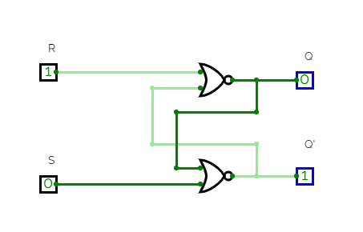
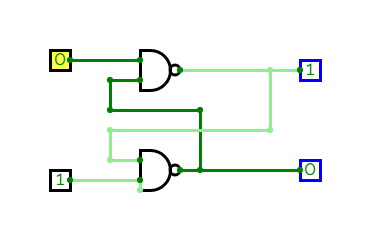
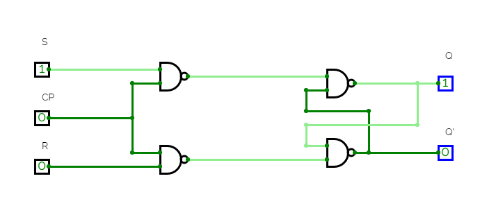
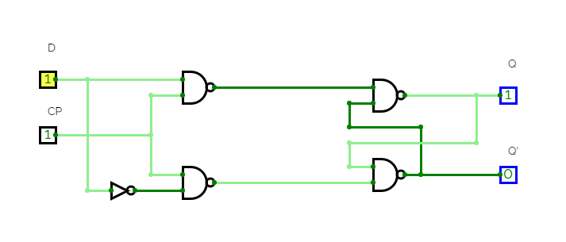
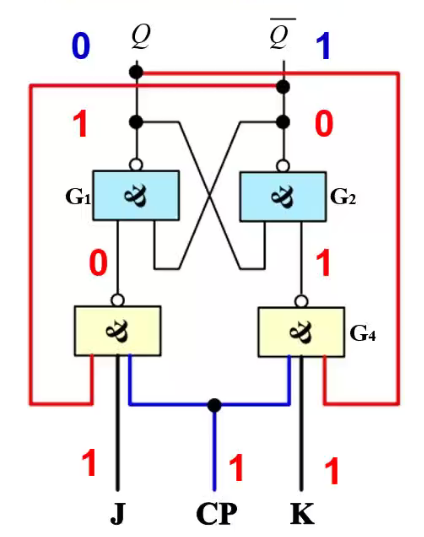
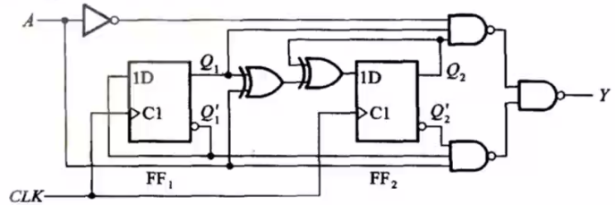
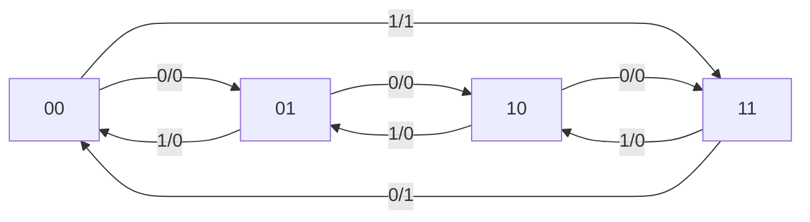
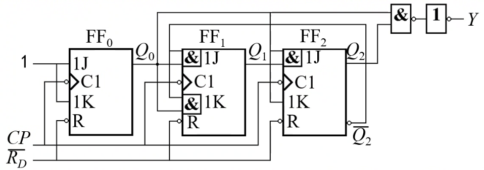
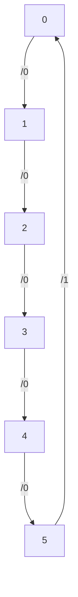

# Digital Circuit

---

## 5. 时序逻辑电路

---

- 组合逻辑电路：没有存储功能
- 时序逻辑电路：存在闭环反馈信号，有存储功能。

时序逻辑电路的输出不仅和当前的输入有关，还和**之前的状态有关**。

---

触发器

---

SR 锁存器（基本 RS 触发器）

以或非门构成为例：



- 1 状态：Q = 1，Q' = 0
- 0 状态：Q = 0，Q' = 1

---

| S   | R   | Qn  | Qn+1 | state               |
| --- | --- | --- | ---- | ------------------- |
| 0   | 0   | 0   | 0    | keep on             |
| 0   | 0   | 1   | 1    | keep on             |
| 1   | 0   | 0   | 1    | set as 1            |
| 1   | 0   | 1   | 1    | set as 1            |
| 0   | 1   | 0   | 0    | reset as 0          |
| 0   | 1   | 1   | 0    | reset as 0          |
| 1   | 1   | 0   | -    | Q = Q' = 0: invalid |
| 1   | 1   | 1   | -    | Q = Q' = 0: invalid |

---

组合逻辑
$$
\left\{\begin{aligned}
    & Q^{n+1} = S + \overline{R} Q^{n}\\
    & S R = 0
\end{aligned}\right.
$$

---

如果是由与非门构成，只是输入端的有效电平由**高电平变成低电平**，输出端的不定态由 0 变成 1，其他的逻辑不变。



---

Clock Pulse

使得所有触发器在同步信号（时钟脉冲）到达时，才按照输入信号改变状态。

---

同步电平触发器（钟控触发器）



当时钟信号为低电平时，输出状态必然被保存。时钟信号为高电平时，遵从或非门基本 RS 触发器的规律：
$$
\left\{\begin{aligned}
    & Q^{n+1} = S + \overline{R} Q^{n}\\
    & S R = 0
\end{aligned}\right.
$$
不定态为 1.（和与非门基本 RS 触发器一致）

有时存在**异步置零（一）端**，接在基本 RS 触发器的与非门上，不需要等待时钟信号，用于设置系统的初始状态。

---

同步 RS-FF 的缺点：

- 如果时钟信号的脉宽较大，那么有可能在时钟信号高电平期间，输入多次改变会引起输出多次改变，降低了电路的**抗干扰**能力。
- 可能出现不定态。

改进：

- R 由输入端 S 经过非门后接入

得到同步 D-FF

---



当 CP = 0 期间，保持。当 CP = 1 期间，
$$
Q^{n+1} = D
$$

---

同步 JK-FF

- 保留了同步 RS-FF 的双输入
- 避免了不定态的出现



---

引入反馈，将原来的不定态转化成了**状态翻转功能**

当 J = K = 1 时，
$$
Q^{n+1} = \overline{Q^{n}}
$$

其他情况和同步 RS-FF 相同。

总的逻辑函数有点像异或逻辑
$$
Q^{n+1} = J \overline{Q^{n}} + \overline{K} Q^{n}
$$

---

T-FF

将 J，K 连接在一起，只保留了翻转的功能。

```python
Q[n+1] = T ^ Q[n]
```

将 T 端接高电平，得到 T'-FF

---

如何解决 D-FF 的空翻现象？

边沿触发器。

---

SR 主从触发器

第一个触发器级联一个第二个触发器，两个触发器的时钟信号反相。

在时钟信号为高电平时，主触发器工作，从触发器的输入端变化，但是从触发器锁定，输出不变；当时钟信号下降沿到来时，主触发器锁定，从触发器工作，输出改变。

- 克服了空翻现象
- 仍需满足 $S \cdot R = 0$

特性方程和之前的一致：
$$
\left\{\begin{aligned}
    & Q^{n+1} = S + \overline{R} Q^{n}\\
    & S R = 0
\end{aligned}\right.
$$
要画输出电平，只要关注时钟信号下降沿的 S，R 电平就可以了。

---

JK 主从触发器

增加了反馈

- Q = 0 时，输入端 K 无效
- Q‘ = 0 时，输入端 J 无效

即使 J=K=1，也总有一个输入无效，状态翻转。

特性方程
$$
Q_{n+1} = J \overline{Q_{n}} + \overline{K} Q_{n}
$$

克服了空翻现象，存在一次变化现象：

在时钟信号高电平期间，即使 JK 输入信号有多次改变，但是由于**反馈信号**的存在，主触发器的状态只会改变一次。

和 SR 主从触发器**不一致**，**不是**只需要观察时钟信号下降沿的输入就可以了，在时钟信号高电平期间要观察输入端是否存在干扰，干扰会改变输出。

---

设想：构造一种触发器，输出仅仅取决于在时钟信号上升沿或下降沿的输入。

边沿触发器

- TTL 维持阻塞 D 触发器
- TTL 边沿 JK 触发器
- CMOS 边沿 D 触发器和 JK 触发器

---

CD4013 异步置位、复位 D 边沿触发器

| CP     | D   | R   | S   | Qn+1 |
| ------ | --- | --- | --- | ---- |
| 上升沿 | 1   | 0   | 0   | 1    |
| 上升沿 | 0   | 0   | 0   | 0    |
| else   | -   | 0   | 0   | Qn   |
| -      | -   | 0   | 1   | 1    |
| -      | -   | 1   | 0   | 0    |

---

将反相输出端 $\overline{Q}$ 接到输入 D，可以形成上升沿翻转，形成周期为时钟信号两倍的方波信号：**计数触发器**。

---
- 是否受时钟控制
    - 异步触发器
    - 钟控触发器
        - 同步触发器
        - 主从触发器
        - 边沿触发器
- 不同的触发方式
    - 电平触发：存在空翻现象，只能用于数据锁存
    - 边沿触发：只在时钟信号上升沿（下降沿）发生状态翻转，范围广，可靠性高，抗干扰
    - 主从触发：克服了空翻现象，但是对输入信号有限制，时钟信号有效电平期间不希望输入变化（主从 JK 触发器的一次改变现象）

---

同步时序逻辑电路分析

---

米里型时序电路



A 上升沿

$$
\begin{align*}
    & Q_{1}^{n+1} = \overline{Q_{1}^{n}} \\
    & Q_{2}^{n+1} = A \oplus Q_{1}^{n} \oplus Q_{2}^{n} \\
    & Y = A \overline{Q_{1}} \cdot \overline{Q_{2}} + \overline{A} Q_{1} Q_{2}
\end{align*}
$$

要注意 $Y$ 是组合逻辑，和时钟信号无关。

---

状态转换图



---

状态转换表

| A   | Q1n | Q2n | Q1n+1 | Q2n+1 | Y   |
| --- | --- | --- | ----- | ----- | --- |
| 0   | 0   | 0   | 0     | 1     | 0   |
| 0   | 0   | 1   | 1     | 0     | 0   |
| 0   | 1   | 0   | 1     | 1     | 0   |
| 0   | 1   | 1   | 0     | 0     | 1   |
| 1   | 0   | 0   | 1     | 1     | 1   |
| 1   | 0   | 1   | 0     | 0     | 0   |
| 1   | 1   | 0   | 0     | 1     | 0   |
| 1   | 1   | 1   | 1     | 0     | 0   | 

---

分析电路实例：



组合逻辑：$Y = Q_{0}^{n} Q_{2}^{n}$

驱动：
$$
\begin{align*}
    & J_{0} = K_{0} = 1 \\
    & J_{1} = K_{1} = Q_{0}^{n} \overline{Q_{2}^{n}} \\
    & J_{2} = Q_{0}^{n}Q_{1}^{n},  K_{2} = Q_{0}^{n}
\end{align*}
$$

时序逻辑：
$$
\begin{align*}
    & Q_{0}^{n+1} = \overline{Q_{0}^{n}} \\
    & Q_{1}^{n+1} = Q_{0}^{n} \cdot \overline{Q_{2}^{n}} \oplus \overline{Q_{1}^{n}} \\
    & Q_{2}^{n+1} = Q_{0}^{n} Q_{1}^{n} \overline{Q_{2}^{n}} + \overline{Q_{0}^{n}} Q_{2}^{n}
\end{align*}
$$

---

状态转换表
| Q2n | Q1n | Q0n | Q2n+1 | Q1n+1 | Q0n+1 | Y   |
| --- | --- | --- | ----- | ----- | ----- | --- |
| 0   | 0   | 0   | 0     | 0     | 1     | 0   |
| 0   | 0   | 1   | 0     | 1     | 0     | 0   |
| 0   | 1   | 0   | 0     | 1     | 1     | 0   |
| 0   | 1   | 1   | 1     | 0     | 0     | 0   |
| 1   | 0   | 0   | 1     | 0     | 1     | 0   |
| 1   | 0   | 1   | 0     | 0     | 0     | 1   |

功能：6 进制计数器

---

状态转换图



---

异步时序逻辑电路分析

---

时钟信号不同步，因此较之于同步时序逻辑，多了**时钟方程**。

---

常用时序逻辑电路——寄存器

---

输入、输出都是并行的寄存器称为**数码寄存器**和**静态寄存器**。

存在串行方式的寄存器（其他类型）称为**移位寄存器**。移位寄存器除了具有存储代码的功能，还可以对数据进行**移位**。

组成：触发器和相应的控制电路（数据接收、清除命令）。

- 并行：在时钟脉冲的作用下，同时输入或输出
- 串行：……逐位

---

双拍数码寄存器

![[images/Pasted image 20220510081216.png]]

1. step 1: 复位信号低电平脉冲（清零信号）
2. step 2: 控制信号高电平脉冲
3. step 3: 读取数据（此时复位信号高电平无效）

---

单拍数码寄存器

![[images/Pasted image 20220510081720.png]]

时钟信号上升沿接受数据

由 D 触发器构成，加入了 $\overline{CR}$ 异步清零端。

MSI 寄存器实例：74LS175

---

单向移位寄存器

![[images/Pasted image 20220510082359.png]]


- step 1: $\overline{R}$ 清零
- step 2: 按照从高位到低位的顺序串行输入数据（0xB: 1-0-1-1）
- step 3: 数据逐步右移，四个上升沿结束以后得到完整数据。

---

| DI  | CP  | Q0  | Q1  | Q2  | Q3  |
| --- | --- | --- | --- | --- | --- |
| 0   |     | 0   | 0   | 0   | 0   |
| 1   | 1   | 1   | 0   | 0   | 0   |
| 2   | 0   | 0   | 1   | 0   | 0   |
| 3   | 1   | 1   | 0   | 1   | 0   |
| 4   | 1   | 1   | 1   | 0   | 1   |
| 5   | 0   | 0   | 1   | 1   | 0   |
| 6   | 0   | 0   | 0   | 1   | 1   |
| 7   | 0   | 0   | 0   | 0   | 1   |
| 8   | 0   | 0   | 0   | 0   | 0   |

后四个脉冲用来从 $Q_{3}$ 端取数据。

改变各寄存器的位数，得到左移寄存器。

---

双向移位寄存器

在单向的基础上增加门电路的控制。

举例：74194

![[images/Pasted image 20220510083923.png]]

---

多功能集成寄存器：74194

![[images/Pasted image 20220510084129.png]]

- CP: 移位脉冲输入端
- DSR: 右移串行代码输入
- Di: 并行代码输入
- DSL: 左移串行代码输入
- $\overline{CR}$: 异步置零端，低电平有效

根据组合逻辑电路分析工作模式

- M = 0 保持
- M = 1 右移
- M = 2 左移
- M = 3 并行

---

扩展为 8 bit 寄存器

- 将两边芯片的 $M_{0}, M_{1}, CP, CR$ 端并联
- 低位片 D3 接高位片 Q0
- 高位片 Q0 接低位片 Q3

![[images/Pasted image 20220510090103.png]]

---

常用时序逻辑电路——计数器

按工作模式分类：

- 异步计数器
- 同步计数器

按功能分类：

- 加法
- 减法
- 可逆

各种进制……

主要功能：记录输入脉冲的个数，要求==完整==。

计数器的模：进制

---

二进制加法计数器

---

异步二进制计数器

![[images/Pasted image 20220510091644.png]]

- 加法计数器：上一信号的下降沿触发
- 减法计数器：上一信号的上升沿触发

模 M 计数器也是一个 M 分频器。

位数越多，时间延迟积累就越明显 $N t_{pd}$.

---

异步十进制计数器

取四位二进制计数器的前 10 个状态

![[images/Pasted image 20220512133806.png]]


其余的 6 个状态也可以进入同一个工作循环中，可以==自启动==。

---

集成二——五——十进制计数器 CT74LS290

模 2 计数器 + 模 5 计数器分别用不同的时钟信号触发（下降沿触发）

还有异步置零端和异步置九端

十进制计数的时候：

- Q0 = CP1
- S0A * S0B = 0
- R9A * R9B = 0
