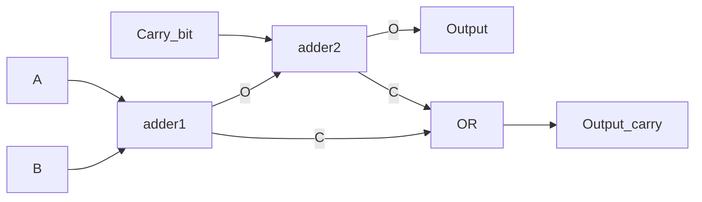

# Embedded System

---

- 10% 平时成绩
- 40% 期末考试
- 10% 小作业
- 40% 大作业

---

学习目标：

- 可以重建工作的系统
- 掌握 CPU 的工作过程，搭建解决实际问题的系统
- 掌握计算机的工作过程

---

## 数字电路基础

---

 在模拟电子电路中，三极管工作在放大区。

 在数字电路中，三极管工作在截止区或饱和区。因为：
 
- 放大区工作的功耗较大
- 截止区和饱和区构成三极管的两种状态

> 能承载的信息量和信噪比有关。——香农

---

一段波形是数字信号还是模拟信号，不取决于它的波形，而取决于人如何理解它。

数字信号牺牲信息量来获取较高的抗干扰能力。还能延时，压缩等等。

---

计算机是一套独特的规律科学？开始人类根据自己的社会经验抽象出的规则定义的机器？

后者。揣摩当初计算机设计者的思想。

写程序本质上就是翻译。


---

一些硬件储存信息的方法

- 磁盘：用 N/S 磁性来表征二进制
- 光盘：光盘的反射方向，收到光代表 1，未收到代表 0.

---

## 门电路

---

NOT


一个不驮载直流信号的基本放大电路就是非门。

- 当输入高电平，三极管导通处于饱和区，输出低电平。
- 当输入低电平，三极管截止，输出高电平。

---


---

AND


电路图：两个三极管串联。

---

OR

电路图：两个三极管并联

---

通过改接输出的位置，可以制造出与非门，或非门。

---

XOR


---


---

逻辑运算是**状态**的运算，不是电压值的运算。

因此逻辑运算不是只能通过电路实现，其他物理量也可以。

---

数字信号

- 易于储存，压缩
- 损坏以后可以修复（中继器）
- 可以推算传播损失函数，进行整形，恢复为方波

---

加法器

![[Pasted image 20220302102403.png]]

---

True Value Tablet

| A   | B   | $\Sigma$ | $C_{out}$ |
| --- | --- | -------- | --------- |
| 0   | 0   | 0        | 0         |
| 0   | 1   | 1        | 0         |
| 1   | 0   | 1        | 0         |
| 1   | 1   | 0        | 1         |

---

全加器



---

所有的运算都是由元运算（加减乘除与或非）张成的空间。

$$
\sin x = \frac{x}{1!} - \frac{x^{3}}{3!} + \frac{x^{5}}{5!} - \cdots
$$

---

时钟信号：方波，和输入输出信号做与运算。

当时钟信号值为 0，输入输出都为 0.

---

```cpp
char a = 1;
```

a 的存储单元的前七个改成 0，后一个改成 1.
