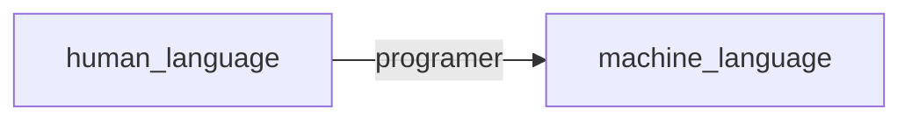
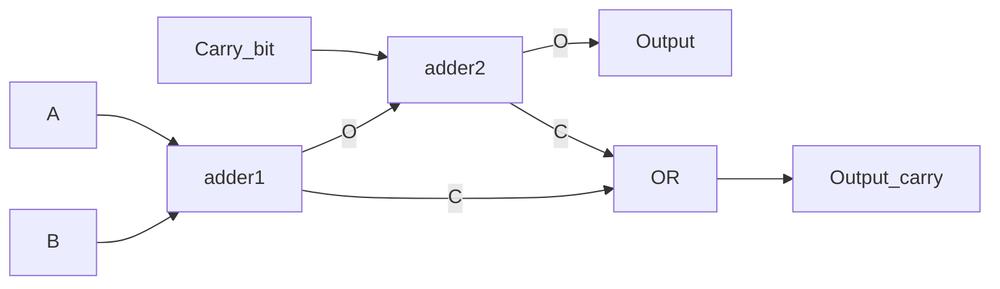

# Embedded System

---

- 10% 平时成绩
- 40% 期末考试
- 10% 小作业
- 40% 大作业

---

学习目标：

- 可以重建工作的系统
- 掌握 CPU 的工作过程，搭建解决实际问题的系统
- 掌握计算机的工作过程

---

## 数字电路基础

---

 在模拟电子电路中，三极管工作在放大区。

 在数字电路中，三极管工作在截止区或饱和区。因为：
 
- 放大区工作的功耗较大
- 截止区和饱和区构成三极管的两种状态

> 能承载的信息量和信噪比有关。——香农

---

一段波形是数字信号还是模拟信号，不取决于它的波形，而取决于人如何理解它。

数字信号牺牲信息量来获取较高的抗干扰能力。还能延时，压缩等等。

---

计算机是一套独特的规律科学？开始人类根据自己的社会经验抽象出的规则定义的机器？

后者。揣摩当初计算机设计者的思想。

写程序本质上就是翻译。



---

一些硬件储存信息的方法

- 磁盘：用 N/S 磁性来表征二进制
- 光盘：光盘的反射方向，收到光代表 1，未收到代表 0.

---

## 门电路

---

NOT


一个不驮载直流信号的基本放大电路就是非门。

- 当输入高电平，三极管导通处于饱和区，输出低电平。
- 当输入低电平，三极管截止，输出高电平。

---


---

AND


电路图：两个三极管串联。

---

OR

电路图：两个三极管并联

---

通过改接输出的位置，可以制造出与非门，或非门。

---

XOR


---


---

逻辑运算是**状态**的运算，不是电压值的运算。

因此逻辑运算不是只能通过电路实现，其他物理量也可以。

---

数字信号

- 易于储存，压缩
- 损坏以后可以修复（中继器）
- 可以推算传播损失函数，进行整形，恢复为方波

---

加法器

![[Pasted image 20220302102403.png]]

---

True Value Tablet

| A   | B   | $\Sigma$ | $C_{out}$ |
| --- | --- | -------- | --------- |
| 0   | 0   | 0        | 0         |
| 0   | 1   | 1        | 0         |
| 1   | 0   | 1        | 0         |
| 1   | 1   | 0        | 1         |

---

全加器



---

所有的运算都是由元运算（加减乘除与或非）张成的空间。

$$
\sin x = \frac{x}{1!} - \frac{x^{3}}{3!} + \frac{x^{5}}{5!} - \cdots
$$

---

时钟信号：方波，和输入输出信号做与运算。

当时钟信号值为 0，输入输出都为 0.

---

## 赋值的物理实现

---

```cpp
char a = 1;
```

a 的存储单元的前七个改成 0，后一个改成 1.

---

```cpp
#include <iostream>
using namespace std;
int main()
{
    char a[] = {1,2,3,4};
    short *I = (int *)a;
    cout << hex << *I << endl; // 0x201
    return 0;
}
```

低地址低字节

```cpp
int a = 80;
```

内存中：``50 00 00 00``

---

``signed`` and ``unsigned``

两种数的比较电路不同。JLE,JBE

```cpp
#include <iostream>
using namespace std;
int main()
{
    int a = 0;
    if (a>10)
        a = 20;

    unsigned int a = 0;
    if (a>10)
        a = 20;
    return 0;
}
```

这两种比较的 Assembly Language 不同。

---

CPU：好几套组合逻辑

如何让 CPU 知道正在调用的逻辑单元？

采用地址，但是考虑到可读性，汇编语言将地址转译成英文字母。

---

浮点数虽然表示的范围大，但它的相对误差是一定的。

也就是说，浮点数在表示较大的整数时，精度远远不如整型。

例如：

1000 0000 和 1000 1000 如果是浮点数中相邻的两个数，1000 0001 就无法用这种浮点数表示。
```cpp
    a + 1 == a
```

---

## C 语言回顾

---

1. 指针和数组
2. 结构体
3. 函数指针和结构体
4. 函数参数传递
5. 宏和预编译

---

数组天然配合循环。

硬件开发时轻易不要用 ``while`` 循环。否则极易进入死循环。

高维数组的转译：``arr[m][n]`` => ``arr[m*n]``

``arr[i][j]`` => ``arr[i*n+j]``

高维数组是计算机程序设计语言的福利：增强代码可读性。其物理存储还是一维形式连续的。

二维数组的折算使得其代码执行效率不如一维数组。

---

```cpp
#include <iostream>
using namespace std;
int main()
{
    int arr[m][n] = {{0}}; // ?
    int *p;
    for (int i=0; i<m; i++)
    {
        p = arr[i];
        for (int j=0; j<n; j++)
            func(p[j]); // 这种代码的执行效率高，不用每次计算乘法
    }
    return 0;
}
```

计算机的维度是组织数据的方式，不是真实的空间维度。

---

``int *p`` & ``int* p&

``p`` 和 ``*p`` 都是变量。

```cpp
    int a = 0;
    int* p1 = &a;
    char b = 'b';
    char* p2 = &b;
    p1++; // +4
    p2++; // +1
```

指针类型的计算根据指针所指的数据类型而确定。

直接给指针赋值非常危险。

```cpp
    int a = 0;
    int* p = &a;
    *(++p) = 1; // 病毒行为
```

---

```cpp
    char bytebuffer[] = { 0x23, 0x34, 0x6d, 0xca };
    int* p = (int *)bytebuffer;
```

---

```cpp
struct XX{
    ...;
}

int main()
{
    int bytebuffer[] = { 1,2,3,4,5,6,7,8 };
    XX* p = (XX*)bytebuffer;
    XX p = *(XX*)bytebuffer;
    return 0;
}
```

对于普遍情形而言，传输地址比传输数据更加轻量化。

---

结构成员对齐

结构体中每个成员分配的最小空间，32 位空间为 4 bytes，64 位空间为 8 bytes。

访问结构体成员，被编译器翻译为地址的**偏移量**。这一行为和访问数组元素的行为本质是一样的。

---

内存泄漏

```cpp
    char * p = new char[8];
    char a = 'a';
    p = &a; // 动态申请的 char[8] 不能再被访问，引起 8 bytes 的内存泄漏
```

有些软件运行时间过长需要重启，就是因为内存泄漏。

```cpp
    delete[] p; // 释放空间，不是删除变量
    p = &a; // 合理合法
```

---

变量的生命期

从定义开始，到同级的 ``}`` 结束（全局变量到文件末尾结束）。

每一对 ``{}`` 中是一个栈。

---

函数参数传递

讲变量转入函数，将实参的数据**拷贝**一份放入函数的栈顶。

函数中的形参从栈顶取得相应的数据。

因此函数如果修改形参的话，改变的是**拷贝的数据**，不改变外部的数据。

当然如果传输的类型是指针，情况就不同了。但是本质都是传递数据，只是数据是地址罢了。

一般来说推荐传入指针，可以添加 ``const`` 关键字防止误修改。

```cpp
int func(const int * a, int * b);
```

---

