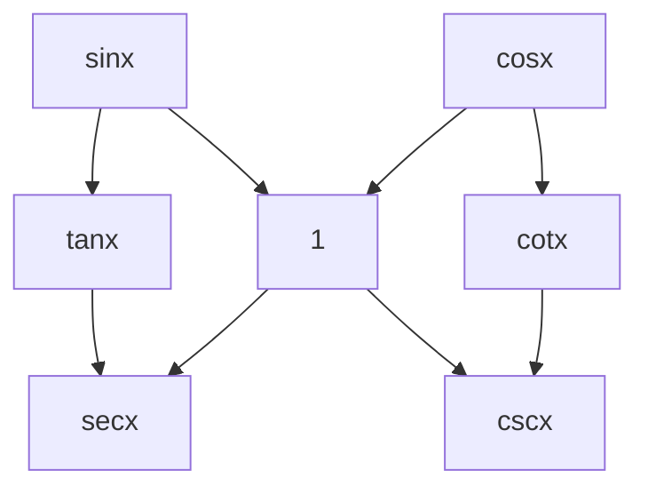

# Calculus2

indefinite and definite integrals

---

## Concepts

---

### 不定积分

---

I

一些不那么显然的积分表

$$
\begin{align*}
\int \tan x dx &= - \ln |\cos x| + C\\
\int \cot x dx &= \ln |\sin x| + C\\
\int \sec x dx &= \int \frac{\sec x (\sec x + \tan x)}{\sec x + \tan x} dx\\
&= \int \frac{\sec^{2}x dx + \sec x \tan x dx}{\sec x + \tan x}\\
&= \ln |\sec x + \tan x| +C\\
\int \csc x dx &= \int \frac{\csc x (\csc x + \cot x)}{\csc x + \cot x} dx\\
&= \int \frac{\csc^{2}x dx + \cot x \csc x dx}{\csc x + \cot x}\\
&= - \ln |\csc x + \cot x| + C
\end{align*}
$$

---

II

Corresponding methods to integrate some kind of derivative funcs:

1. Rational Fraction: Apart
2. Rational Formula for Trigonometric Funcs: $u = \tan \frac{x}{2}$
$$
R(\sin x, \cos x) = R\left(\frac{2u}{1+u^{2}}, \frac{1-u^{2}}{1+u^{2}}\right), x = 2 \arctan u, dx = \frac{2}{1+u^{2}} du
$$
Of course, not all Rational Fraction is solved by just apart. For example:
$$
\begin{align*}
    \int \frac{dx}{x(x^{10}+1)} &= \int \frac{x^{9}dx}{x^{10}(x^{10}+1)}\\
    &= \frac{1}{10} \int \frac{dx^{10}}{x^{10}(x^{10}+1)}\\
    &= \frac{1}{10} \ln \frac{x^{10}}{x^{10}+1} + C
\end{align*}
$$

***Attention***:
尽量不要涉及对数，因为 $\ln |x|$ 中绝对值的原因。

---

III

原函数存在的条件

充分不必要条件：导函数连续

不必要的原因（反例）：
$$
\begin{align*}
F(x) &= x^{2} \sin \frac{1}{x}\\
f(x) &= F'(x) \\
&= \begin{cases}
2x \sin \frac{1}{x} - \cos \frac{1}{x} & (x \neq 0)\\
0 & (x = 0)
\end{cases}
\end{align*}
$$

$x=0$ 是 $f(x)$ 的第二类间断点。但是 $f(x)$ 仍然存在原函数。

---

IV

关于 $\int \frac{dx}{x} = \ln |x| + C$ 中的绝对值：

$\ln x$ is antiderivative of $\frac{1}{x}$ on $(0, \infty)$.
$\ln(-x)$ is antiderivative of $\frac{1}{x}$ on $(-\infty, 0)$.

---

### 定积分

---

### 微分方程

---

I

如果微分方程的解中所含的任意独立常数的个数等于微分方程的阶数，那么这个解称之为微分方程的**通解**。

不含任意常数的解，称为**特解**。

通解不包含的解，称为**奇解**。如：
$$
\begin{align*}
    & y'^{2} - 4y^{2} = 0\\
    & \frac{\mathrm{d}y}{\sqrt{y}} = 2 \mathrm{d}x \\
    & y = (x+C)^{2}
\end{align*}
$$
求得了通解，但是不能包含解 $y=0$.

n 阶微分方程的一般形式：

$$
\begin{align*}
    f(x, y', y'', \cdots, y^{(n)}) = 0
\end{align*}
$$

---

II

齐次微分方程
$$
\begin{align*}
    \frac{\mathrm{d}y}{\mathrm{d}x} = \varphi(\frac{y}{x})
\end{align*}
$$
解法：
$$
\begin{align*}
    &u = \frac{y}{x}\\
    & \frac{\mathrm{d}ux}{\mathrm{d}x} = \varphi(u)\\
    & u + x \frac{\mathrm{d}u}{\mathrm{d}x} = \varphi(u)\\
    & \frac{\mathrm{d}u}{\varphi(u)-u} = \frac{\mathrm{d}x}{x}
\end{align*}
$$

---

III

一阶线性微分方程
$$
\begin{align*}
    & \frac{\mathrm{d}y}{\mathrm{d}x} + P(x)y = Q(x) \\
    & z = y e^{\int P(x) \mathrm{d}x} \\
    \mathrm{d} y &= \mathrm{d} \left(z e^{-\int P(x) \mathrm{d}x}\right) \\
    &= e^{-\int P(x) \mathrm{d}x} \mathrm{d}z - z P(x) e^{- \int P(x) \mathrm{d}x} \mathrm{d}x \\
    &= e^{-\int P(x) \mathrm{d}x} \mathrm{d}z - y P(x) \mathrm{d}x \\
    & e^{-\int P(x) \mathrm{d}x} \frac{\mathrm{d}z}{\mathrm{d}x} = Q(x) \\
    & y = e^{-\int P(x) \mathrm{d}x} \left(\int e^{P(x) \mathrm{d}x} Q(x) \mathrm{d}x+C \right)
\end{align*}
$$

---

IV

Bernoulli Equation
$$
\begin{align*}
    & \frac{\mathrm{d}y}{\mathrm{d}x} + P(x)y = Q(x)y^{\mu} \\
    & z = y^{1-\mu}, y = z^{\frac{1}{1-\mu}} \\
    & (\frac{1}{1-\mu}) \frac{y}{z} \frac{\mathrm{d}z}{\mathrm{d}x} + P(x) y = Q(x) \frac{y}{z} & (y=0) \\
    & \frac{\mathrm{d}z}{\mathrm{d}x} + (1-\mu) P(x) z = (1-\mu) Q(x)
\end{align*}
$$

---

V

$$
y'' = f(x,y') \Rightarrow p' = f(x, p)
$$

---

VI

$$
\begin{align*}
    & y'' = f(y,y') \\
    & y' = p \Rightarrow y'' = \frac{\mathrm{d}p}{\mathrm{d}x} = p \cdot \frac{\mathrm{d}p}{\mathrm{d}y} \\
    & \frac{\mathrm{d}p}{\mathrm{d}y} = g(y, p) = \frac{1}{p} f(y,p)
\end{align*}
$$

---

VII

二阶**线性**齐次微分方程
$$
\begin{align*}
    y'' + P(x) y' + Q(x) = 0
\end{align*}
$$
二阶**线性**非齐次微分方程
$$
\begin{align*}
    y'' + P(x) y' + Q(x) = f(x)
\end{align*}
$$
**线性指的是系数多项式只由 $x$ 决定。**

Properties:

1. Linear Combination: $y_{1},y_{2}$ is linearly independent $\Rightarrow y = C_{1} y_{1} + C_{2} y_{2}$
2. General + Special: $y = Y + y^{*}$

---

## Exercise

---

### 不定积分

---

I

$$
\begin{aligned}
\int \frac{x+1}{x(1 + x e^x)} \mathrm{d}x &= \int \frac{(x+1)e^x}{x e^x (1+xe^x)} \mathrm{d}x \\
&= \int \frac{\mathrm{d}(x e^x)}{x e^x} - \int \frac{\mathrm{d}(x e^x)}{1 + x e^x} \\
&= \ln \left| \frac{x e^x}{1 + x e^x}\right|
\end{aligned}
$$

***Attention***:
$$
(x e^x)' = (x+1)e^x
$$

---

II

$$
\begin{aligned}
\int_{\frac{\pi}{2}}^{2 \arctan 2} \frac{\mathrm{d}x}{(1- \cos x)\sin^2 x} &= \int_{\frac{\pi}{2}}^{2 \arctan 2} \frac{(1 + \cos x)\mathrm{d} x}{\sin^4 x} \\
&= \int_{\frac{\pi}{2}}^{2 \arctan 2} \frac{{\mathrm{d}x}}{\sin^4 x} + \int_{\frac{\pi}{2}}^{2 \arctan 2} \frac{\mathrm{d}(\sin x)}{\sin^4 x} \\
&= - \int_{\frac{\pi}{2}}^{2 \arctan 2} (1 + \cot^2 x) \mathrm{d}(\cot x) - \left.\frac{1}{3 \sin^3 x}\right|_{\frac{\pi}{2}}^{2 \arctan 2} \\
&= \left.\left(- \cot x - \frac{\cot^3 x}{3} - \frac{1}{3 \sin^3 x}\right)\right|_{\frac{\pi}{2}}^{2 \arctan 2} \\
&= \frac{55}{96}
\end{aligned}
$$

OR
$$
\begin{aligned}
\int_{\frac{\pi}{2}}^{2 \arctan 2} \frac{\mathrm{d}x}{(1-\cos x)\sin^2 x} &= - \int_{\frac{\pi}{2}}^{2 \arctan 2} \frac{\mathrm{d}(\cot x)}{1 - \frac{\cot x}{\sqrt{1 + \cot^2 x}}} \\
&= - \int_{\frac{\pi}{2}}^{2 \arctan 2} \frac{\sqrt{1 + \cot^2 x}\mathrm{d} x}{\sqrt{1 + \cot^2 x}-\cot x} \\
&= - \int_{0}^{-\frac{3}{4}} (1 + u^2 + \sqrt{1 + u^2} u) \mathrm{d}u \\
&= - \left.\left(u + \frac{u^3}{3} + \frac{1}{3} (1+u^2)^{\frac{3}{2}}\right)\right|_{0}^{-\frac{3}{4}}
\end{aligned}
$$

***Attention***:
也可以用万能公式换元。

---

III

$$
\begin{aligned}
\int_0^{\frac{\pi}{2}} \frac{\mathrm{d}x}{1 + \tan^{\sqrt{2}}x} & \overset{u = \frac{\pi}{2} - x}{=} \int_{\pi/2}^0 \frac{- \mathrm{d}u}{1 + \tan^{\sqrt{2}}(\frac{\pi}{2} - u)} \\
&= \int_0^{\pi /2} \frac{\mathrm{d}u}{1 + \frac{1}{\tan^{\sqrt{2}}u}} \\
&= \int_0^{\pi /2} \frac{\tan^{\sqrt{2}}u \mathrm{d}u}{1 + {\tan^{\sqrt{2}}u}} \\
&\overset{x=u}{=} \int_0^{\pi /2} \frac{\tan^{\sqrt{2}}x \mathrm{d}x}{1 + {\tan^{\sqrt{2}}x}} \\
\int_0^{\frac{\pi}{2}} \frac{\mathrm{d}x}{1 + \tan^{\sqrt{2}}x} & = \int_0^{\pi /2} \frac{\tan^{\sqrt{2}}x \mathrm{d}x}{1 + {\tan^{\sqrt{2}}x}} = \frac{1}{2} \int_0^{\frac{\pi}{2}} \mathrm{d} x = \frac{\pi}{4}
\end{aligned}
$$

***Attention***:
遇到不能写出原函数的定积分，需要转化成和原来积分有关系的形式。

---

IV

<!--
?There are some questions in following process.
$$
\begin{aligned}
\lim_{x \rightarrow 0} \frac{\int_0^{x^2}t^2 \sin \sqrt{x^2 - t^2} \mathrm{d} t}{x^7} &= \lim_{x \rightarrow 0} \frac{x^4 \sin \sqrt{x^2 - x^4} \cdot 2x}{7 x^6} \\
&= \frac{2}{7} \lim_{x \rightarrow 0} \frac{\sin x \sqrt{1 - x^2}}{x} \\
&= \frac{2}{7}
\end{aligned}
$$

因为上面的被积函数中显含有 $x$，不可以直接讲上下限作为自变量进行链式求导。
-->

---

V

$$
\begin{aligned}
\int_0^{\pi/2} \frac{\mathrm{d}x}{1 + \cos \theta \cos x} &= \int_0^{\pi/2} \frac{\mathrm{d}x}{1 + \cos \theta \frac{1 - \tan^2 \frac{x}{2}}{1 + \tan^2 \frac{x}{2}}} \\
&= \int_0^{\pi/2} \frac{(1+\tan^2 \frac{x}{2})\mathrm{d}x}{1+\tan^2 \frac{x}{2}+ \cos \theta (1 - \tan^2 \frac{x}{2})} \\
&= 2 \int_0^{\pi/2} \frac{\mathrm{d}(\tan \frac{x}{2})}{1 + \cos \theta + (1 - \cos \theta) \tan^2 \frac{x}{2}} \\
&= 2 \int_0^1 \frac{\mathrm{d}x}{1+\cos \theta + (1 - \cos \theta)x^2} \\
&= \frac{2}{1 + \cos \theta} \int_0^1 \frac{\mathrm{d}x}{1 + \left(\sqrt{\frac{1 - \cos \theta}{1 + \cos \theta}}x\right)^2} \\
&= 2 \sqrt{\frac{1}{(1 - \cos \theta)(1 + \cos \theta)}} \int_0^{\sqrt{\frac{1 - \cos \theta}{1 + \cos \theta}}} \frac{\mathrm{d}x}{1 + x^2} \\
&= \frac{2}{|\sin \theta|} \arctan \sqrt{\frac{1 - \cos \theta}{1 + \cos \theta}} \\
&= \frac{2}{|\sin \theta|} \arctan \left| \tan \frac{\theta}{2} \right| \\
&= \frac{\theta}{\sin \theta} & (\theta \in (0, \pi))
\end{aligned}
$$

***Attention***:
三角换元典型例题。

---

VI

$$
\begin{aligned}
&\int \frac{\sec x \tan^2 x + \sec^3 x}{\sqrt{\sec^4 x + \tan^4 x}} \mathrm{d}x \\
=& \int \frac{\tan x \mathrm{d} \sec x + \sec x \mathrm{d} \tan x}{\sqrt{(\sec^2 x - \tan^2 x)^2 + 2 \sec^2 x \tan^2 x}} \\
=& \int \frac{\mathrm{d} \sec x \tan x}{\sqrt{1 + 2 (\sec x \tan x)^2}} \\
=& \frac{\sqrt{2}}{2} \sinh^{-1} (\sqrt{2} \sec x \tan x) + C
\end{aligned}
$$

***Attention***:
可以通过这个著名的六边形来记忆三角函数之间的关系。

---

VII

$$
\begin{align*}
    &\int \frac{\mathrm{d}x}{1 + \sin x}\\
    =& \int \frac{1 - \sin x}{\cos^{2}x} \mathrm{x}\\
    =& \int \sec^{2}x \mathrm{d}x - \int \tan x \sec x \mathrm{d} x\\
    =& \tan x - \sec x + C
\end{align*}
$$

$$
\begin{align*}
    &\int \frac{x^{2}+1}{x^{4}+1} \mathrm{d} x\\
    =& \int \frac{1+ \frac{1}{x^{2}}}{x^{2}+ \frac{1}{x^{2}}} \mathrm{d}x\\
    =& \int \frac{\mathrm{d}\left(x - \frac{1}{x}\right)}{\left(x- \frac{1}{x}\right)^{2} + 2}\\
    =& \frac{\sqrt{2}}{2} \arctan \frac{\sqrt{2}}{2} \left(x - \frac{1}{x}\right) + C
\end{align*}
$$

$$
\begin{align*}
    &\int \frac{1}{\sin^{2}x-2\cos^{2}x} \mathrm{d}x\\
    =& \int \frac{1}{\tan^{2}x-2} \cdot \frac{\mathrm{d}x}{\cos^{2}x}\\
    =& \frac{\sqrt{2}}{4} \ln \left| \frac{\tan x - \sqrt{2}}{\tan x + \sqrt{2}} \right| + C
\end{align*}
$$

***Attention***:
Some simple tricks but hard to get.

---

VIII

$$
\begin{align*}
    &\int \frac{\mathrm{d}x}{1+\sqrt{x^{2}+2x+2}}\\
    \overset{x+1 = \tan t}{=}& \int \frac{\sec^{2}t \mathrm{d}t}{1+\sec t}\\
    =& \int \frac{\mathrm{d}t}{\cos t(1+\cos t)}\\
    =& \int \sec t \mathrm{d}t - \int \frac{\mathrm{d}t}{2 \cos^{2} \frac{t}{2}}\\
    =& \ln | \sec t + \tan t| - \tan \frac{t}{2} + C\\
    =& \ln | 1+x + \sqrt{x^{2}+ 2x + 2}| - \tan \frac{t}{2} + C\\
1+x=& \tan t = \frac{2\tan \frac{t}{2}}{1 - \tan^{2}\frac{t}{2}}\\
\Rightarrow& \tan \frac{t}{2} = \frac{-1 \pm \sqrt{x^{2}+2x+2}}{1+x}\\
& t \in (-\pi, \pi), \frac{t}{2} \in (-\frac{\pi}{2}, \frac{\pi}{2}), \tan \frac{t}{2} \in (-1, 1)\\
\tan \frac{t}{2} =& \frac{-1 + \sqrt{x^{2}+2x+2}}{1+x}\\
    &\int \frac{\mathrm{d}x}{1+\sqrt{x^{2}+2x+2}}\\
    =& \ln |1+x+\sqrt{x^{2}+ 2x + 2}| - \frac{-1 + \sqrt{x^{2}+ 2x + 2}}{x+1} + C
\end{align*}
$$

***Attention***:
在采用第二类换元法进行计算时，计算结束一定要把主元换回来，换回来的时候注意两个元的取值范围。

---

IX
