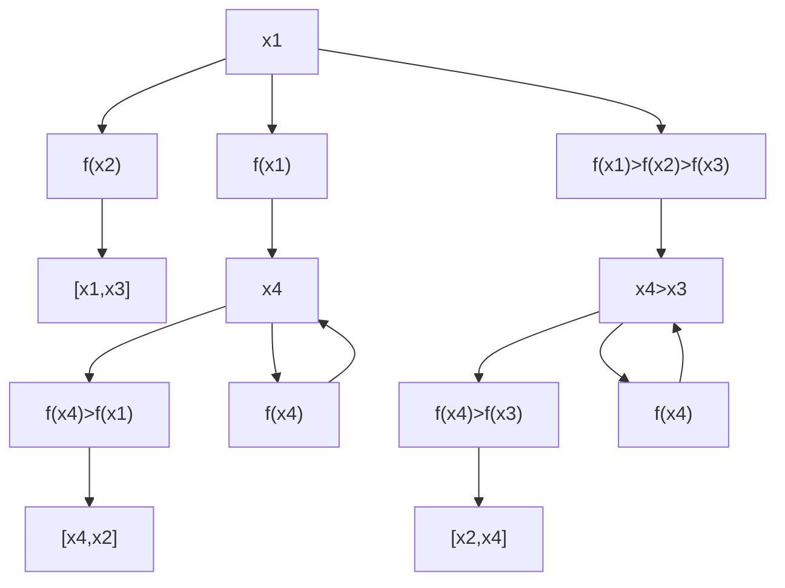

# Optimization

答疑：周五晚上 17：00 ~ 19：00，线上预约线下答疑，（智信馆 611）。

---

什么是最优化？

> 用数学的方式，借助计算机工具**描述和找出**优化问题最优解的一门学科。

机器学习 = 模型 + 优化方法

---

简单例子：回归分析

- 建立模型
$$
y = b_0 + b_1 t
$$
- 优化问题
$$
\min_{b_0, b_1} \left \Vert \begin{bmatrix}
1 & t_1 \\
\vdots & \vdots \\
1 & t_n
\end{bmatrix} \begin{bmatrix}
b_0 \\ b_1
\end{bmatrix} - \begin{bmatrix}
y_1 \\ \vdots \\ y_n
\end{bmatrix} \right \Vert
$$
---

最优化的应用：
1. 智能制造
2. 生产调度
3. 机器人
4. 运动规划（模型预测控制）

---

## 0 Introduction

---

### 0.1

什么是最优化？

三要素
- 优化目标
- 决策变量
- 约束条件

---

研究的问题
- 数学性质（线性？凸问题？存在？唯一？灵敏度？）
-  构造寻求最优解的计算方法
- 分析计算方法的：１.理论性质；２.实际计算表现

---

一些求解的方法
- 图解法
- 解析法
- 计算机＋最优化理论：迭代法
	- 搜索方向 $\lambda_k$
	- 搜索步长 $p^{(k)}$
$$
x^{(k+1)} = x^{(k)} + \lambda_k p^{(k)}
$$

---

难点：局部最优解和全局最优解不统一。

鞍点：在某一个维度上达到极值，但在另一个维度上不是。

---

### 0.2

课程的主要内容
1. 数学知识
2. 无约束优化
3. 线性规划
4. 非线性规划

---

## 5 Calculus Basic

---

### 5.1

序列、极限、函数连续性

---

- 定理一：收敛序列极限唯一（反证法）
- 定理二：任意收敛序列极限有界
- 定理三：单调有界序列必有极限（极限是上确界）
- 定理四：子列和原序列极限相同

---

定义矩阵序列的极限

$$
\lim_{k \rightarrow \infty} \Vert A_{k} - A \Vert = 0
$$
 Here, $\Vert \cdot \Vert: R^{m \times n} \rightarrow R$ is matrix norm. And a definition:
 $$
 \Vert A \Vert = \sqrt{\sum_{i, j} \vert a_{ij} \vert^{2}}
$$
$$
\begin{align*}
&A \in \mathbb{R}^{n \times n} \\
&\vert \lambda_{i}(A) \vert < 1 \iff \lim_{k \rightarrow \infty} A^{k} = O \iff \sum_{k=1}^{\infty} A^{k} = (I_{n}-A)^{-1}
\end{align*}
$$

The continuousness of $A(\xi): \mathbb{R}^{r} \rightarrow \mathbb{R}^{m \times n}$

To be continued...

---

### 5.2

differentiable

---

微积分的基本理念：利用仿射函数对函数进行局部近似。
$$
\begin{align*}
&\vec{f}: R^n \rightarrow R^m \\
&\vec{L} \in R^{m \times n}, \vec{y} \in R^m \\
&\vec{A}(\vec{x}) = \vec{L}(\vec{x}) + \vec{y} \\
&\lim_{\vec{x} \rightarrow \vec{x}_{0}, \vec{x}_{0} \in \Omega} \frac{\Vert \vec{f}(\vec{x}) - \vec{A}(\vec{x}) \Vert}{\Vert \vec{\vec{x}} - \vec{\vec{x}}_{0} \Vert} = \vec{0}\\
&\lim_{\vec{x} \rightarrow \vec{x}_{0}, \vec{x}_{0} \in \Omega} \frac{\Vert \vec{f}(\vec{x}) - \vec{L}(\vec{x}-\vec{x}_{0}) - \vec{f}(\vec{x}_{0}) \Vert}{\Vert \vec{x} - \vec{x}_{0} \Vert} = \vec{0}\\
&D \vec{f}(\vec{x}_{0}) = \vec{L} = \begin{bmatrix} \frac{\partial \vec{f}}{\partial x_{1}} (\vec{x_{0}}), \cdots, \frac{\partial \vec{f}}{\partial x_{n}} (\vec{x_{0}})\end{bmatrix} \\
=&\begin{bmatrix} \frac{\partial f_{1}}{\partial x_{1}} & \cdots & \frac{\partial f_{1}}{\partial x_{n}} \\ \cdots &  & \cdots \\ \frac{\partial f_{n}}{\partial x_{1}} & \cdots & \frac{\partial f_{n}}{\partial x_{n}}\end{bmatrix} \\
\end{align*}
$$

---

$$
\begin{align*}
&f: \mathbb{R}^{n}\rightarrow \mathbb{R} \\
&\nabla f(\vec{x}) = D f(\vec{x})^{T} = \begin{bmatrix} \frac{\partial f}{\partial x_{1}}  \\ \vdots \\ \frac{\partial f}{\partial x_{n}}\end{bmatrix} \\
&D^{2} f(\vec{x}) = D \nabla f(\vec{x}) = \begin{bmatrix} \frac{\partial}{\partial x_{1}}\left(\frac{\partial f}{\partial x_{1}}\right)  & \cdots & \frac{\partial}{\partial x_{n}}\left(\frac{\partial f}{\partial x_{1}}\right) \\ \vdots &  & \vdots \\ \frac{\partial}{\partial x_{1}}\left(\frac{\partial f}{\partial x_{n}}\right)  & \cdots & \frac{\partial}{\partial x_{n}}\left(\frac{\partial f}{\partial x_{n}}\right)\end{bmatrix}
\end{align*}
$$

---

### 5.3

derivative matrix

---

### 5.4

principle of derivative

---

### 5.5

水平集和参数化

---

### 5.6

Taylor series

---

## 6 集合约束和无约束优化问题

---

### 6.1

intoduction

---

$$
\begin{align*}
    &\text{minimize } f(x)\\
    &\text{subject to } x \in \Omega
\end{align*}
$$
从可行集合中找到使得目标函数最小的点。
$$
\begin{align*}
    &f:\mathbb{R}^{n} \rightarrow \mathbb{R}, \text{domain:} \Omega \subset \mathbb{R}^{n}\\
    &\exists \epsilon > 0, \forall x: 0 < \Vert x - x^{*} \Vert < \epsilon, f(x) > f(x^{*}) \text{ local minimum}\\
    &\forall x \in \Omega \text{\\} \{x_{0}\}, f(x) > f(x^{*}) \text{ global minimum}\\
\end{align*}
$$

- 局部极小点
- 全局最小点
$$
x^{*} = \mathrm{argmin}_{x \in \Omega} f(x)
$$

---

### 6.2

局部极小点的条件

---

可行方向：为了研究非内点为极小点的情况。

所有的可行方向构成了可行基在某一个点附近的逼近。

$\boldsymbol{d}$ is feasible direction of $\boldsymbol{x_{0}}$.
$$
\begin{align*}
    & \exists \alpha_{0} > 0, \forall \alpha \in [0, \alpha_{0}], \boldsymbol{x_{0}} + \alpha \boldsymbol{d} \in \Omega
\end{align*}
$$
定义很像极限。

---

方向导数

$$
\frac{\partial f}{\partial d}(x) = \lim_{\alpha \rightarrow 0} \frac{f(x+\alpha d)-f(x)}{\alpha}
$$
计算简化
$$
\begin{align*}
    \phi(\alpha) =& f(x+\alpha d) \\
    \frac{\partial f}{\partial d}(x) =& \left. \frac{\mathrm{d}}{\mathrm{d}\alpha}  \varphi(\alpha) \right|_{\alpha = 0}\\
    =& Df(x) d \\
    =& d^{T}\nabla f(x)
\end{align*}
$$

---

定理一：局部极小点的一阶必要条件

这是**排除法**。

$$
\begin{align*}
    & f \in C^{1}\\
    & \forall \boldsymbol{d} \text{ is feasible, } \frac{\partial f}{\partial \boldsymbol{d}}(\boldsymbol{x}^{*}) = \boldsymbol{d}^{T} \nabla f(\boldsymbol{x}^{*}) \geq 0\\
\end{align*}
$$

Proof: 
$$
\begin{align*}
    f(x) - f(x^{*}) &= \varphi(\alpha) - \varphi(0) \\
    &= \varphi'(0) \alpha + o(\alpha) \\
    &\geq 0
\end{align*}
$$

如果 $x^{*}$ 在 $\Omega$ 内部，则：
$$
\nabla f(x^{*}) = 0
$$

---

定理二：局部极小点的二阶必要条件

前提：满足一阶必要条件 $f \in C^{2}$
$$
\phi''(0) = d^{T} D^{2}f(x^{*}) d \geq 0
$$
黑塞矩阵**半正定**。

Proof:
$$
\begin{align*}
    \varphi'(\alpha) &= Df(\boldsymbol{x}^{*} + \alpha \boldsymbol{d}) \cdot \boldsymbol{d} \\
        &= \boldsymbol{d}^{T} \nabla f(\boldsymbol{x}^{*} + \alpha \boldsymbol{d}) \\
    \varphi''(\alpha) &= \boldsymbol{d}^{T} \frac{\mathrm{d}}{\mathrm{d}\alpha} (\nabla f(\boldsymbol{x}^{*} + \alpha \boldsymbol{d})) \\
        &= \boldsymbol{d}^{T} \boldsymbol{F}(x^{*} + \alpha \boldsymbol{d}) \boldsymbol{d} \\
    \varphi(\alpha) &= \varphi(0) + \varphi'(0) \alpha + \frac{\varphi''(0)}{2} \alpha^{2} + o(\alpha^{2})
\end{align*}
$$

---

当然，满足两个条件也不一定就是极小值（必要性）。例如：

- $x=0, f(x) = x^{3}$

但是只要有一个必要条件不满足，就一定不是极小值点。例如：

- $x = \begin{bmatrix}0 \\ 0\end{bmatrix}, f(x) = x_{1}^{2} - x_{2}^{2}$

---

定理三：局部极小点的二阶充分条件

前提：内点，$f \in C^{2}$

$$
\begin{align*}
    &\nabla f(\boldsymbol{x}^{*}) = 0\\
    &\boldsymbol{F}(\boldsymbol{x}^{*}) = D^{2}f(\boldsymbol{x}^{*}) > 0
\end{align*}
$$
第二条条件指的是矩阵**正定**。

---

## 7 一维搜索算法

---

$$
\varphi(\alpha) = f(\boldsymbol{x}_{k}+\alpha \boldsymbol{d}_{k})
$$

---

### 7.1

Introduction

求解单变量单值函数在闭区间的最小值。前提是在闭区间上单峰。

---

### 7.2

黄金分割法

---

只知道给定输入的函数值，不知道导数。

方法：对称压缩。

计算
$$
f(a_{1}), f(b_{1})
$$
从而压缩掉一个区间
$$
[a_{0,}a_{1}] \text{ or } [b_{1}, b_{0}]
$$

---

$$
\begin{align*}
    &f(a_{1)}< f(b_{1}) \Rightarrow x^{*} \in [a_{0}, b_{1}]\\
    &f(a_{1)} \geq f(b_{1}) \Rightarrow x^{*} \in [a_{1}, b_{0}]\\
\end{align*}
$$

---

如何选择 $a_{1}, b_{1}$？

**固定的压缩比**

$$
\begin{align*}
    &\rho (b_{0}-a_{0}) = (a_{1}-a_{0}) \\
    &\rho (b_{1}-a_{0}) = (b_{1}-b_{2}) \\
\end{align*}
$$
![[Pasted image 20220228210928.png]]

---

$$
\begin{align*}
    &\frac{\rho}{1-\rho} = \frac{1-\rho}{1} \\
    &\rho = \frac{3-\sqrt{5}}{2} \text{ or } \frac{3+\sqrt{5}}{2} \left(> \frac{1}{2}\right) \\
    &1-\rho = \frac{\sqrt{5}-1}{2}
\end{align*}
$$

---

从区间 $[a_{0}, b_{0}]$ 压缩到精度为 $\varepsilon$.

压缩次数

$$
N = \frac{\ln \frac{b_{0}-a_{0}}{\varepsilon}}{\ln (1-\rho)}
$$
 向上取整。

 ---

```python
def GoldenSectionSearch(func, start, end, precision):
    rho = (3-sqrt(5))/2
    a,b = [start],[end]
    ak = start + rho * (end - start)
    bk = end - rho * (end - start)
    fak = func(ak)
    fbk = func(bk)
    while (end - start > precision):
        if (fak <= fbk):
            end = bk
            bk,fbk = ak,fak
            ak = start + rho * (end - start)
            fak = func(ak)
        else:
            start = ak
            ak, fak = bk, fbk
            bk = end - rho * (end - start)
            fbk = func(bk)
        a.append(start)
        b.append(end)
    return (a,b)
```

---

 ### 7.3

 Fibbonaci Array

 ---

 如果压缩比 $\rho$ 可以调整？

 $$
 \{\rho_{k}\}
$$

 仍然保持对称压缩的方法。

每次迭代只计算一次函数值。

---

![[Pasted image 20220228211007.png]]

---

$$
\begin{align*}
    &\rho_{k+1}(1-\rho_{k}) = 1 - 2\rho_{k}\\
    &\rho_{k+1} = \frac{1-2\rho_{k}}{1-\rho_{k}} = 1 - \frac{\rho_{k}}{1-\rho_{k}}\\
    & \frac{b_{0}-a_{0}}{\varepsilon} = (1-\rho_{1})(1-\rho_{2}) \cdots (1-\rho_{k}) \\
    \text{minimize } & (1-\rho_{1})(1-\rho_{2}) \cdots (1-\rho_{k}) \\
    \text{subject to } & \rho_{k+1} = 1 - \frac{\rho_{k}}{1-\rho_{k}} \\
    &0 \leq \rho_{k} \leq \frac{1}{2}, k = 1, \cdots, N
\end{align*}
$$

---

Fibbonaci Array

| -1  | 0   | 1   | 2   | 3   | 4   | 5   |
| --- | --- | --- | --- | --- | --- | --- |
| 0   | 1   | 1   | 2   | 3   | 5   | 8   | 

---

$$
\begin{align*}
    &1-\rho_{k} = \frac{F_{N-k+1}}{F_{N-k+2}} \\
    &(1 - \rho_{1}) \cdots (1 - \rho_{N}) = \frac{1}{F_{N-k+1}}
\end{align*}
$$

---

最后一次压缩比为 1/2，实际操作中应该修正为

$$
\frac{1}{2} - \varepsilon
$$

---

```python
def FibonacciSearch(func, start, end, precision, epsilon):
    x,y = 1,1
    a,b = [start],[end]
    while (precision*y/(1+epsilon)<(end-start)):
        temp = x
        x = y
        y = temp+y

    ak = (x*start+(y-x)*end)/y
    bk = (x*end+(y-x)*start)/y
    fak = func(ak)
    fbk = func(bk)

    while (y>2):
        temp = x
        x = y - x
        y = temp
        if (fak <= fbk):
            end = bk
            bk,fbk = ak,fak
            ak = (x*start+(y-x)*end)/y
            fak = func(ak)
        else:
            start = ak
            ak, fak = bk, fbk
            bk = (x*end+(y-x)*start)/y
            fbk = func(bk)
        a.append(start)
        b.append(end)
    
    if (y==2):
        ak = (start+end)/2 - epsilon*(end-start)
        bk = (start+end)/2 + epsilon*(end-start)
        if (func(ak) <= func(bk)):
            a.append(start)
            b.append(bk)
        else:
            a.append(ak)
            b.append(end)
    return (a,b)
```

---

### 7.4

二分法

---

前提：可以计算一阶导数。

计算 $f\left(\frac{x_{1}+x_{2}}{2}\right)'$

如果导数为正，舍弃右侧；如果导数为负，舍弃左侧。

$$
\rho = \frac{1}{2}
$$

---

### 7.5

Newton Iteration

---

前提：可以计算二阶导数。

Taylor Theorem

$$
\begin{align*}
    &q(x) = f(x_{k}) + f'(x_{k}) (x-x_{k}) + \frac{1}{2} f''(x_{k}) (x-x_{k})^{2}\\
    &\text{minimize } q(x)\\
    &\text{subject to }x\\
    & x_{k+1} = x_{k} - \frac{f'(x_{k})}{f''(x_{k+1})}
\end{align*}
$$

用牛顿切线法寻找 $f'(x) = 0$ 的解。

---

Iteration precision

$$
|x_{k+1} - x_{k}| = \left|\frac{f'(x_{k})}{f''(x_{k+1})} \right| \leq \varepsilon
$$

---

If $f''(x_{k}) \leq 0$: 得到的是极大值，之后在凸优化，凹优化问题中会有详细讨论。

---

### 7.6

割线法——近似二阶

---

割线法运用了两步的历史信息。

$$
\begin{align*}
    &f''(x_{k}) = \frac{f'(x_{k})-f'(x_{k-1})}{x_{k}-x_{k-1}} \\
    &x_{k+1} = x_{k} - f'(x_{k}) \frac{x_{k}-x_{k-1}}{f'(x_{k})-f'(x_{k-1})}
\end{align*}
$$

---

```python
def SecantMethod(f, x1, x2, precision):
    def GetNullPoint(f, x1, x2):
        return (f(x2)*x1-f(x1)*x2)/(f(x2)-f(x1))
    PointLog = [x1, x2]
    while (abs(x2-x1)>precision*abs(x1)):
        temp = x2
        x2 = GetNullPoint(f, x1, x2)
        x1 = temp
        PointLog.append(x2)
    return PointLog
```

---

### 7.7

划界法

---

如何确定初始单峰区间？

$$
\forall x_{1}, x_{2}, x_{3}
$$


---

### 7.8

多维搜索优化问题中的一维搜索。

---

$$
\begin{align*}
    &\boldsymbol{x}_{k+1} = \boldsymbol{x}_{k} + \alpha_{k} \boldsymbol{d}_{k} \\
    &\Phi(\alpha) = f(\boldsymbol{x} + \alpha \boldsymbol{d}_{k})
\end{align*}
$$

对 $\Phi(\alpha)$ 进行一维搜索。

$$
\Phi'(\alpha) = \boldsymbol{d}_{k}^{T} \nabla f(\boldsymbol{x}+\alpha \boldsymbol{d}_{k})
$$

---

多维搜索问题的矛盾：

- 将算力用于计算下降方向
- 将算力用于计算最佳步长

一般来说方向的选取更为重要。

---
