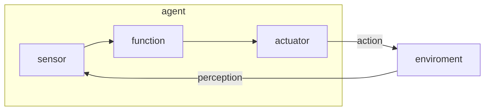
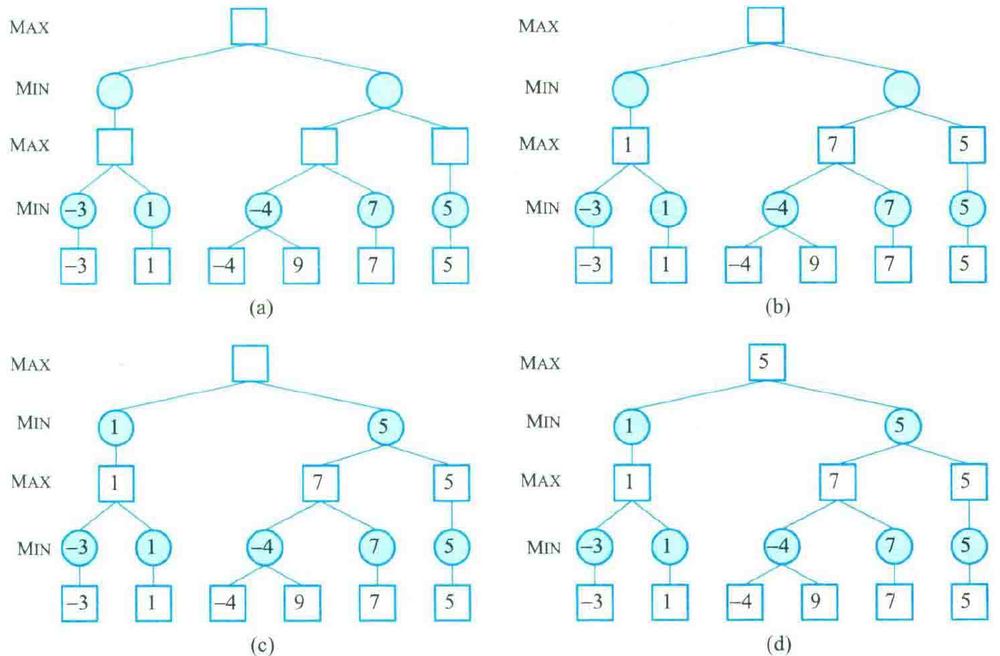
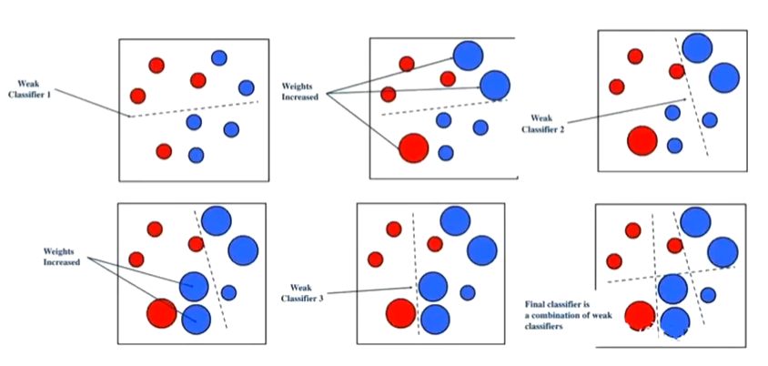
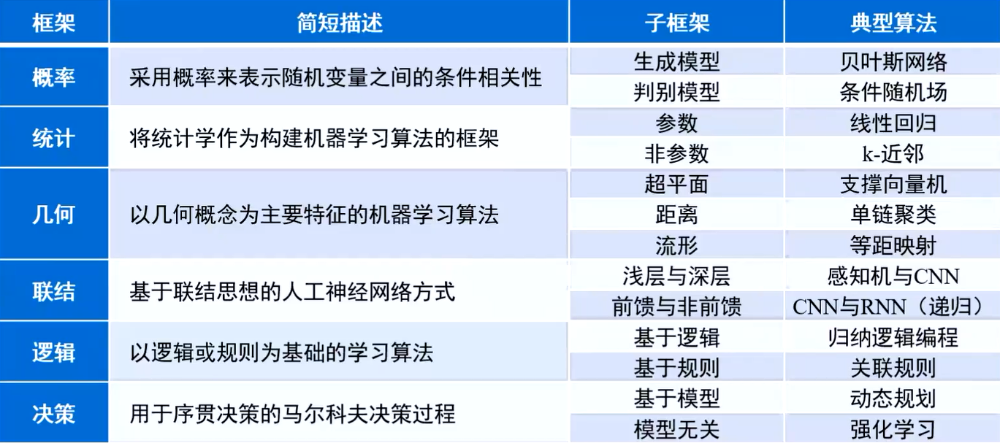
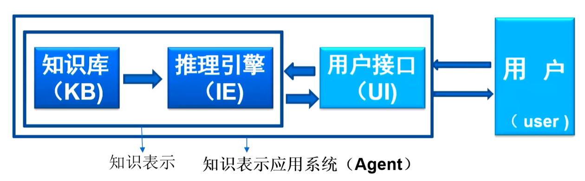
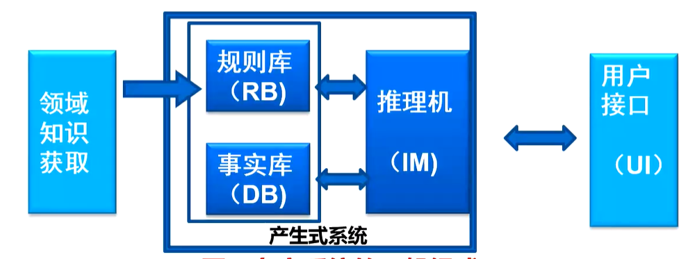
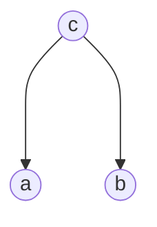
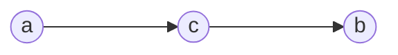
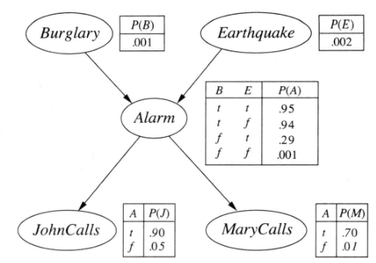

# 人工智能基础

尹慧琳 yinhuilin@tongji.edu.cn

- 平时作业 20%
- 课堂参与与评价 10%
- 小组大作业报告与交流讨论 20%
    - 分组约 4 人
    - PPT 汇报
    - 项目报告 word
    - 软件实现系统开发（程序代码和演示测试）
- 期中考试、期末考试 50%

## 1.绪论

什么是智能？知识和智力的总和。

贝叶斯公式

$$
\begin{aligned}
    & P(H|E) = P(H) \cdot  \frac{P(E|H)}{P(E)}
\end{aligned}
$$

- P: polynomial time 多项式时间内可以解决的问题
- NP: none-polynomial time 不可以……
- NP-complete: NP 中最难的问题
- NP-hard: 至少是 NP 中最难的问题

- 搜索问题求解
- 优化规划
- 数据学习
- 知识推理

## 2.体系论

agent 智能体

人工智能的研究路径

- 符号人工智能：符号表征实体 符号主义
- 亚符号人工智能：语义上无意义 联结主义 以神经网络为代表

- 整齐派：形式逻辑
- 不整齐派：无定形语义网络

- 逻辑派
- 反逻辑派

智能体的任务环境 PEAS

- Performance
- Environment
- Actuators
- Sensors

- 完全可观测、部分可观测
- 单智能体、多智能体
- 确定、随机
- 片段式、连续式
- 静态、动态、半动态

智能体的结构



- 硬件平台
- 主体函数
    - 查找表法
    - 神经网络
    - 基于逻辑规则的推论
    - 遍历选项计算成本

人工智能的内涵

- 思维
    1. **求解**：解决问题
    2. **规划**：输出策略
    3. **学习**：基于数据
    4. **推理**：利用知识
- 交互
    1. 感知
        1. 视觉
        2. 听觉
        3. ……
    2. 动作
        1. 语音
        2. 语言
        3. ……

## 3.搜索问题的求解

### 搜索问题建模

什么是搜索问题？

- 8 数码问题：$9!$ np-complete question
- 8 皇后问题
- 传教士与野人问题
- 最短路径

搜索问题的要素？

- 状态空间：问题表现出的所有组成 graph/tree
- 初始状态和目标状态
- 后继函数
- 目标测试
- 路径代价

```python
class search_problem:
    def __init__(state_space, init_state, goal, successor_func):
        self.state_space = state_space
        self.init_state = init_state
        self.goal = goal
        self.successor_func = successor_func
    def solve(self):
        for state in self.state_space:
            if self.successor_func(state, self.init_state) == self.goal:
                return True
        return False
```

- 增量形式化：8 皇后问题中依次往棋盘上放皇后，初始为 0，添加的过程中满足条件；
- 全态形式化：8 数码问题中存在不满足条件的初始状态，移动使之满足条件。

搜索问题的求解方法

- 扩展：对当前结点应用各种合法动作，生成后继状态加入边缘集。
- 搜索策略：如何选择结点执行扩展
- 终止判定方法
    - 到达目标结点
    - 迭代步数超限
    - 连续两步结果差距较小

搜索方法分类：

- 数搜索
- 图搜索 open-list, closed-list, 占用内存大。

### 盲目搜索

1. DFS 对于边缘集的结点，使用栈的方式遍历
    - 时间复杂度为指数级别，空间复杂度为线性
2. BFS 对于边缘集的结点，使用队列的方式遍历
    - 时间复杂度为指数级别，空间复杂度为指数级别
3. 回溯搜索 backtracking
    - 对于二叉树，每次扩展只产生一个后继节点，空间复杂度为常数级别。
    - 但是需要先把树转化为二叉树。
4. 改进：深度受限搜索，设定深度界限 $l$，深度大于 $l$ 的结点视作无效。
    - 降低复杂度，但是 $l$ 的大小不易设定
5. 迭代加深搜索：DFS + 每一步深度受限搜索
    - 当搜索树非常深，但是我们能确定答案一定在浅层节点时，就可以使用迭代加深 DFS

```python
class Graph:
    def __init__(self):
        self.graph = {
                'a' : ['b', 'c'],
                'b' : ['a', 'c', 'd'],
                'c' : ['a','b', 'd','e'],
                'd' : ['b' , 'c', 'e', 'f'],
                'e' : ['c', 'd'],
                'f' : ['d']
            }

    def bfs(self, start):
        queue = []
        queue.append(start)
        seen = set()
        seen.add(start)
        while len(queue) > 0:
            vertex = queue.pop(0)
            nodes = self.graph[vertex]
            for node in nodes:
                if node not in seen:
                    queue.append(node)
                    seen.add(node)
            print(vertex)

    def dfs(self, start):
        stack = []
        stack.append(start)
        seen = set()
        seen.add(start)
        while len(stack) > 0:
            vertex = stack.pop()
            nodes  = graph[vertex]
            for node in nodes:
                if node not in seen:
                    stack.append(node)
                    seen.add(node)
            print(vertex)
```

### 启发式搜索：存在评价函数

1. 一致代价搜索：扩展代价最低的边缘集结点
2. 贪婪搜索：到目标结点**直线距离**最短的结点作为入集结点
3. $A^{*}$ 搜索：统一上述两种搜索，既要考虑过去的代价，也要考虑将来的代价

## 4.优化问题求解

问题空间不一定确定可观察；到达目标的路径不重要；目标节点不唯一。

- 旅行推销员问题
- 背包问题
- 车辆路由问题：如何组织车辆寻找最佳的配货路径
- 负载均衡问题：为不同机器分配不同任务

优化问题的要素？

- 决策变量和参数
- 目标函数
- 约束条件

### 局部搜索算法

不以路径的搜寻为目的，不保存路径。

- 爬山法：随机选择可行解。之后每一步都用具有最高值的领域点替换，否则认为到达最优值。
    - 随机爬山：按照梯度分配概率，随机选择
    - 首选爬山：随机生成若干后继状态，选择最优
    - 随机重启爬山
- 局部束搜索：开始时随机选择 $k$ 个状态，生成它们的全部后继。从后继中选择最优的 $k$ 个，继续生成全部后继，直到找到局部最优解。

局部束搜索每次保存若干个状态，相比只保存一个状态的爬山法，速度更快。

### 元启发式

相比上一节的启发式函数，元启发式不依赖问题的特有条件，不需要人为假设。

- 禁忌搜索：将局部最优解放入禁忌表中，尽量不去碰禁忌表中的局部最优解，以期获得更大的搜索空间。
- 模拟退火
- 遗传算法

### 群体搜索

## 5.博弈问题求解

三要素

1. 智能体、局中人 players 理性的
2. 策略集
3. 赢得函数、收益

### 博弈问题

- 囚徒困境
- 最后通牒博弈
- 海盗分金币

- 合作博弈
- 非合作博弈

- 零和博弈
- 非零和博弈

是否知道对方的状态

- 完美信息博弈
- 不完美信息博弈

是否完整地知道规则

- 完全信息博弈
- 不完全信息博弈

- 对称
- 非对称

- 随机
- 非随机

- 同步
- 顺序

### 博弈问题策略

对抗搜索

| 比较事项 |          经典搜索          |          对抗搜索          |
|:--------:|:--------------------------:|:--------------------------:|
|   环境   |         单智能主体         |         多智能主体         |
| 搜索方式 |  到达目标节点的启发式搜索  |    战胜对手的对抗式搜索    |
|   优化   | 用启发式方法可以找到最优解 | 因为时间有限被迫采用近似解 |
| 评价函数 |        路径代价估计        |  评估博弈策略和局势的优劣  | 

最小最大策略：零和博弈

最小最大定理：

对于每个具有两个玩家和有限多个策略的零和博弈，每个玩家存在一个混合策略和一个值 $V$

- 如果确定玩家一的策略，在玩家二的所有策略中，玩家二的最大收益为 $-V$.
- 如果确定玩家二的策略，在玩家一的所有策略中，玩家一的最大收益为 $V$.

最小最大策略：博弈树的 DFS

在我方先手时，选择结果最大的节点作为博弈策略的后继；在对方先手时，选择结果最小的节点作为博弈策略的后继。



虽然图中没有体现出来，但是计算机在实际处理的时候一定是按照分支依次进行 DFS 的。

Alpha-Beta 剪枝：针对最小最大方法中，需要将整个决策树展开进行 DFS　的缺陷进行优化：减去显然不需要遍历的分支。

定义：

- 我方的最小得分 $\alpha$（初始为 $-\infty$）
- 对方的最大得分 $\beta$（初始为 $+\infty$）

## 6.约束问题求解

### 约束问题形式化

CSP: constraints satisfaction problem 将一个世界中的所有实体表征为一个对变量进行有限约束的同构集合。

- SAT: boolean satisfiability problem
- SMT: satisfiability modulo theories
- ASP: answer set programming

triple tuple $\{X, D, C\}$

- $X = \left\{ X_{1}, X_{2}, \cdots, X_{n} \right\}$ variables
- $D = \left\{ D_{1}, D_{2}, \cdots, D_{n} \right\}$ range for each var in $X$
    - $X_{i} \in D_{i} = \left\{ v_{1}, v_{2}, \cdots, v_{k} \right\}$
- $C = \left\{ C_{1}, C_{2}, \cdots, C_{m} \right\}$ constraints

二元组 constraint $C_{j} = \left\{ t_{j}, R_{j} \right\} \in C$

- $t_{j} \subset X$ 是具有 $k$ 个变量的作用域
- $R_{j}$ 是对这 $k$ 个变量的约束关系

约束图：

- 节点：表示一个变量
- 连线：表示连接的节点变量之间存在二元约束

- 状态：变量赋值
- 状态空间：所有状态的集合
- 约束问题的解：
    - 完备性：完整的、每个变量都被赋值
    - 一致性：赋值满足约束条件

## 7.时空关联规划

- 空间规划
    - 经典
    - 新经典
- 时序规划
- 调度规划
- 动作规划

### 规划问题定义

经典规划系统的定义：

- 状态集 $S$
- 动作集 $A$
- 事件集 $E$，一般指环境的动态性，而不是智能体本身引起的
- 动作 $a \in A$ 作用于状态 $s \in S$，$\gamma(s, a)$

状态转换系统

$$
\Sigma = (S, A, E, \gamma)
$$

对于受限转换系统，$E$ 为空集。

$$
\Sigma = (S, A, \gamma)
$$

经典规划问题

$$
P = (\Sigma, s_{0}, g)
$$

- 初始状态 $s_{0}$
- 目标状态 $g$

规划问题的解是一个**动作序列** $(a_{1}, a_{2}, \cdots, a_{k})$，途径状态 $(s_{1}, s_{2}, \cdots, s_{k})$，其中 $s_{k} = \gamma(s_{k-1}, a_{k})$.

### 规划问题求解

- 状态空间规划：状态图（搜索）
    - 前向搜索
    - 后向搜索
- 计划空间规划：节点本身是一个部分指定计划

部分计划定义为一个四元组

$$
n = (A, <, B, L)
$$

## 8.决策理论规划

### 决策理论规划概述

### Markov 模型

随机过程的无记忆性质，下一状态只依赖于当前状态，与之前状态无关。

$$
P\left[S(t+1)|\cap_{i=1}^{t} S(i)\right] = P \left[ S(t+1) | S(t) \right]
$$

Markov Process

$$
\begin{aligned}
MP &= (S, T) \\
T &= P \left[ S(t+1) = s_{t+1} | S(t) = s_{t} \right] \\
&= \begin{bmatrix}
p_{00} & p_{01} & \cdots & p_{0t} \\
p_{10} & p_{11} & \cdots & p_{1t} \\
\vdots & \vdots & \ddots & \vdots\\
p_{t0} & p_{t1} & \cdots & p_{tt}
\end{bmatrix} \\
1 &= \sum_{j=0}^{t} p_{ij}
\end{aligned}
$$

### MDP 优化控制

Markov Decision Process

$$
\begin{aligned}
MDP &= (S, A, T, R, \gamma) \\
\end{aligned}
$$

- state $S$
- action $A$
- transfer function $T(s_{t}, a_{t}, s_{t+1}) = P \left[ S(t+1)=t+1 | S(t) = s_{t}, A(t) = a_{t} \right]$
- reward $R(s_{t}, a_{t}) = E \left[ R(t+1) | S(t) = s_{t}, A(t) = a_{t} \right]$
    - 过渡的奖惩
    - 状态的奖惩
- discounting $\gamma$ 对于外来的事情的折扣，将来的事情不可预测，“能拿到的钱相对来说先拿到更好”。

策略：一个策略 $\pi$ 对每个状态输出一个动作。

$$
\begin{aligned}
\pi &: S \rightarrow A
\end{aligned}
$$

- 确定性策略：确定的函数 $\pi$
- 随机策略：不确定的函数，输入为状态和动作，输出为从这个状态到动作的概率

$$
\begin{aligned}
\pi &: S \times A \rightarrow [0, 1]
\end{aligned}
$$

表示一个时间和概率的对应关系。

MDP 的求解就是寻找这样一个策略 $\pi$

回报：

$$
\begin{aligned}
G_{t} &= \sum_{i=0}^{\infty} r_{t+i}
\end{aligned}
$$

价值函数：

- 状态价值函数

$$
V^{\pi}(s) = E^{\pi} \left[ G(t) | S(t) = s \right]
$$

### 动态规划

## 9.机器学习

泛化：可以对不在数据集中的数据进行预测。

- 统计学习：统计学习理论
- 模式识别：对数据中的模式进行处理，使用统计学习的方法
- 数据挖掘：在大规模数据中挖掘数据特征
- 计算机视觉：使计算机从较高层面理解图片或视频

PAC 可能近似正确原则：最终的 PAC 模型得到的输出 $h(\boldsymbol{X})$ 和标注 $c(\boldsymbol{X})$ 的泛化误差 $R(h)$ 尽可能小，这里的误差是一种**概率意义**上的误差。$h$ 是一个“近似正确”的函数。

NFL 没有免费午餐定理：没有一个学习算法在所有可能问题上性能均为最佳。这一定理广泛存在于各种问题中，有不同的形式：搜索、优化、共同进化、学习、监督学习等。**要讨论算法的优劣，必须给定问题的情景**。

发展脉络：

1. 人工神经网络 ANN
2. 决策树 Decision Tree
3. 提升算法 Boosting Algorithms
4. 支持向量机 Support Vector Machines
5. 强化学习 Reinforcement learning

### 人工神经网络

- 输入层
- 隐含层（可能有多个）
- 输出层

计算特点：并行式分布式计算

> [!tip]
> 数学基础：万能逼近定理
> 
> 任何闭区间内的连续函数都可以用含有一个隐含层的 BP 神经网络来逼近。即，一个三层的神经网络可以完成 $f: \mathbb{R}^{n} \rightarrow \mathbb{R}^{m}$.

BP(Back Propagation) 反向传播网络的两个过程：

- 工作信号（输入）正向传播
- 误差信号（计算的输出和标注的差值）反向传播

误差的定义：

$$
E(w, b) := \frac{1}{2} \sum_{i=0}^{n-1} (d_{i} - y_{i})^{2} = \frac{1}{2} \Vert f(\boldsymbol{x}) - \boldsymbol{y} \Vert^{2}
$$

其中，$w, b$ 为 ANN 的参数，表示连接权重和阈值，$d_{i}$ 表示根据此网络的计算输出值，$y_{i}$ 表示标注数据。

### 决策树

判断机制是一个条件判断数。

### 提升算法



通过多个弱学习器实现，第一个学习器的误判点在后续学习的过程中加大权重，保证它们不容易再被误判。

### 支持向量机

用于二分类。平面上有两种点，位于平面的两侧，用一条直线作为分界线，如果在上面（左面）是一类，下面（右面）是另一类。

$$
\begin{aligned}
f(\boldsymbol{w}, \boldsymbol{b}) &= \boldsymbol{w}^{T} \boldsymbol{x} + \boldsymbol{b} \\
y &= \mathrm{sgn} f(\boldsymbol{w}, \boldsymbol{b})
\end{aligned}
$$

最近点到分界线的距离：

$$
\mathrm{margin}(\boldsymbol{w}, \boldsymbol{b}) = \mathrm{min}_{\boldsymbol{x}} \left[ \mathrm{Dist} (\boldsymbol{w}, \boldsymbol{b}, \boldsymbol{x}) \right] = \mathrm{min}_{x} \left( \frac{| \boldsymbol{w}^{T} \boldsymbol{x} + \boldsymbol{b}|}{\Vert \boldsymbol{w} \Vert} \right)
$$

SVM 的目标：使得这个距离最大。

$$
\mathrm{max}_{\boldsymbol{w}, \boldsymbol{b}} margin(\boldsymbol{w}, \boldsymbol{b})
$$

> [!todo] 更多研究
> - 多元分类 SVM：更多项而不是一个简单的一次函数
> - 支撑向量聚类算法：数据分类的核方法
> - 贝叶斯 SVM

### 强化学习

与环境的交互，收到行为主义心理学的启发。

和监督学习和无监督学习并列，但是不需要任何预先给定的数据，而是接受环境对动作的奖励获得学习信息，根据当前状态和奖惩值更新模型参数。

## 10.机器学习的三个视角

- Task
- Paradigm
- Framework

任务：

1. 分类
2. 回归
3. 聚类：将离散的输入点聚合成几类
4. 排名：用排名值作为输出
5. 密度估计：估计某一空间中的概率密度
6. 降维映射
7. 序贯决策：根据当前状态和环境奖惩决定下一步动作

范式：

1. 监督学习
2. 无监督学习
3. 强化学习

框架：

1. 概率框架：条件相关性
2. **统计框架**：统计学习
3. 几何框架：欧式几何或黎曼几何，超平面、流形，例如 SVM
4. **联结框架**：例如 ANN
5. **逻辑框架**：基于逻辑或规则**推理**，例如专家系统
6. **决策框架**：用于序贯决策的 Markov 决策过程，例如 RL

### 学习的任务

#### 分类

1. 数据划分成**已知**的几个类别
2. 要用样本进行训练（监督学习）

- 线性分类：一条直线分界线 SVM
- 非线性分类

#### 回归

#### 聚类

和分类的区别：

1. 类别未知
2. 无训练样本

- 硬聚类
- 软聚类：基于概率分布或似然值

基于……聚类：

- 连通性
- 质心
- 分布
- 密度

#### 排名

#### 降维

保留数据的基本特征

### 学习的范式

| 范式       | 举例       |
| ---------- | ---------- |
| 监督学习   | SVM        |
| 无监督学习 | k-均值聚类 |
| 强化学习   | Q-学习     |

#### 无监督学习

只接受没有标注的数据。

**自监督学习属于无监督学习**。

要设计辅助任务来挖掘数据自身特征。

#### 强化学习

强化学习是和模型无关的 Markov 决策过程。和模型有关的 Markov 决策过程是动态规划。因此强化学习也被称为近似动态规划。

“探索与利用”困境：为了回报最大化，尽量**利用**以前的有小动作，为了**探索**更有效的动作，必须**尝试**以前没有选择过的动作。

适格录迹：适格录迹是一种事件发生的短暂记录，把与事件关联并且适合于学习更改的参数标记为“适格”。当发生时序差分误差时，只需从具有适格标记的事件中查找造成误差的原因。

### 学习的框架



#### 概率框架

Bayes 规则

$$
\begin{aligned}
P(H|E) &= \frac{P(E|H) \cdot P(H)}{P(E)} \\
\text{Posterior} &= \frac{\text{Likelihood} \cdot \text{prior}}{\text{evidence}}
\end{aligned}
$$

Bayes 规则提供了使用先验概率（假说成立的概率）、似然概率（使用假说推导得到的证据的概率）和证据概率来推导后验概率的方法。

- 生成模型：对每一类别的实际分布建模，学习得到联合概率分布。
- 判别模型：对类之间的决策边界进行建模，学习得到条件概率。

概率图模型

- 有向概率图：Bayes
- 无向概率图：Markov

#### 统计框架

- 参数模型
- 非参数模型

#### 几何框架

SVM

- 欧氏几何：超平面、线、面、距离
- 非欧几何：测地线距离、流行

#### 联结框架

ANN

- Perception 单个的感知机，一个神经元
- MLP 多层感知机

> [!tip] 为什么使用 Sigmoid 激活函数？
> 
> 因为它的导数可以用输出表示。
> $$
\begin{aligned}
\sigma(x) &= \frac{1}{1+e^{-x}} \\
\sigma'(x) &= - \frac{1}{(1+e^{-x})^{2}} \cdot (- e^{-x}) \\
&= \left(\frac{1}{1+e^{-x}} \right)\left( \frac{e^{-x}}{1+e^{-x}} \right) \\
&= \sigma(x) \left[ 1 - \sigma(x) \right]
\end{aligned}
> $$

深层神经网络与深度学习

相比全由全连接网络构成的网络，深度学习加入了**若干个**卷积层、池化层，避免了计算量过大、过拟合问题。

#### 逻辑框架

- 基于逻辑
    - 归纳逻辑编程
    - 逻辑学习机
- 基于规则
    - 随机森林
    - 决策树
    - 关联规则学习

## 11.确定性知识的表示与推理

知识系统



逻辑符号

- 与 $\land$
- 或 $\vee$
- 非 $\neg$
- 蕴含 $\Rightarrow$
- 当且仅当 $\iff$
- 任意 $\forall$
- 存在 $\exists$
- 等于 $=$

### 一阶逻辑系统

- 命题逻辑：基于事实的真假判断，非真即假
- 一阶逻辑：在命题逻辑上构建的形式系统，三段论就是一阶逻辑，还有 1+2=3

一阶逻辑设计对象和关系，可以表达任意和存在。逻辑值不是非真即假，而是存在或真、或假、或未知的情况。

$$
\forall x, x \in H \Rightarrow x \in M
$$

集合是一阶谓词。一阶逻辑中存在集合的逻辑概念。

- 对象：用项指代，有常量、变量、函数等等
- 关系：集合，用谓词指代
- 谓词符号：$=, \neq, \Rightarrow, \forall, \exists$
- 原子语句
- 形式模型

从集合论的角度说：

- 一阶逻辑：量化个体
- 二阶逻辑：量化包含个体的集合
- 三阶逻辑：量化包含包含个体的集合的集合
- ……

### 产生式系统

产生式

$$
P \rightarrow Q , \text{IF } P \text{ THEN } Q
$$

不用 $\Rightarrow$，因为不是精确的蕴含关系。

产生式系统也是有知识库和推理机构成，其中知识库由规则库和数据库构成，也叫专家系统。

推理：根据数据库中的事实对规则库中的前提条件求值的过程。

- 正向推理：从条件出发
- 反向推理：从目标出发
- 双向推理

正向推理的程序示例：

```python
def respond():
    while (not S.isempty()) and (not Question.isfinished()):
        data_base.add(conclude(select_rule(S)))
        respond()
```

专家系统



相比逻辑系统，专家系统的推理机可以是启发推理，不是绝对正确的。

专家系统的最主要优点就是它可以直接利用人的经验，但是缺点有很多。

- 知识库形成困难
- 决策困难，置信度较低
- 缺乏知识库的自组织、自学习机制，很难完备
- 规则少了没有结果，规则多了决策冲突

能不能结合神经网络和专家系统？能不能结合联结主义和逻辑主义？

## 12.不确定性知识的表示与推理

- 客观不确定性：概率
    - 用贝叶斯方法描述
- 主管不确定性：语言本身的多义性
    - 用模糊逻辑方法描述

### 贝叶斯方法

Bayes 学派：认为概率系统的参数是随机变量，要用确定的样本结果来估计随机变量的分布。

$$
P(H|E) = \frac{P(E|H) P(H)}{P(E)}
$$

根据先验分布 $P(H)$ 和样本信息来得到后验分布 $P(H|E)$，本质上就是用样本来修正假设。

最大后验估计

$$
\text{argmin}_{H} P(H|E)
$$

链式规则

$$
\begin{aligned}
P(X_{1}, \cdots, X_{n}) = \prod_{i=1}^{n} P(X_{i}|X_{1} \cap \cdots \cap X_{i-1})
\end{aligned}
$$

贝叶斯思想的应用：输入法拼写纠正。输入是样本，根据数据库计算各种可能结果的概率，排序在候选名单中。

$$
P(c|w) = \frac{P(w|c)P(c)}{P(w)}
$$

在已经输入错误的情况下，$P(w)=1$. $P(c)$ 为可能正确的词出现的概率，可以用数据库中的频率估计，$P(w|c)$ 为正确单词为 $c$ 时，输入错误为 $w$ 的概率。联合分布：

$$
P(w \cap c) = P(w | c) P(c)
$$

贝叶斯网络：有向无环图

- 每个节点表示一个随机变量
- 有连接的节点表示非条件独立
- 给定了每个节点在父节点下的条件概率分布 $P(X_{i}|\text{Parent}(X_{i}))$

由于没有连接表示条件独立：

$$
\begin{aligned}
P(X_{i}|X_{1}, \cdots, X_{i-1}) &= P(X_{i}|\text{Parent}(X_{i}))
\end{aligned}
$$

从图的末端搜索，得到：

$$
P(X_{1}, \cdots, X_{n}) = \prod_{i=1}^{n} P(X_{i}|\text{Parent}(X_{i}))
$$

一旦得知了变量之间的条件独立关系，就可以绘出 Bayesian 网络，大大简化了计算联合分布的步骤和计算量。

Bayesian 网络中可能由于一个变量未知变成已知导致其他变量的独立性改变，比如以下 tail-to-tail



$$
\begin{aligned}
P(a, b, c) &= P(a|c) P(b|c) P(c)\\
P(a, b|c) &= \frac{P(a,b,c)}{P(c)} \\
&= P(a|c) P(b|c)
\end{aligned}
$$

- 当 $c$ 未知时，不能得到 $P(a, b) = P(a) P(b)$
- 当 $c$ 已知时，能得到 $P(a, b|c) = P(a|c)P(b|c)$

还有 Markov 链也有相似的性质：在某一状态给定的情况下，下一状态和上一状态独立。



$$
\begin{aligned}
P(a, b) &= P(a) P(c|a) P(b|c) \neq P(a) P(b) \\
P(a, b|c) &= \frac{P(a,b)}{P(c)} \\
&= P(b|c) \cdot \frac{P(a) P(c|a)}{P(c)} \\
&= P(a|c) \cdot P(b|c)
\end{aligned}
$$

总之就是不直接相连的节点如果给定了它们之间节点的状态，它们就是条件独立的。



$$
\begin{aligned}
P(\neg b |j, m) &= \frac{P(\neg b, j, m)}{P(j, m)} \\
&= \frac{1}{P(j, m)} \cdot \sum_{a} \sum_{e} P(j | a) P(m | a) P(a | \neg b, e) P(e) P(\neg b) \\
&= \frac{P(\neg b)}{P(j, m)} \{ P(e) \left[ P(a | \neg b, e)P(m | a) P(j|a) + P(\neg a | \neg b, e)P(m | \neg a) P(j|\neg a) \right] \\
&+ P(\neg e) \left[ P(a | \neg b, \neg e)P(m|a)P(j|a) + P(\neg a| \neg b, \neg e)P(m | \neg a)P(j|\neg a) \right] \} \\
&= \frac{1}{P(j, m)} \times 0.999 \times[ 0.002 \times( 0.29 \times 0.70 \times 0.90 + 0.71 \times 0.01 \times 0.05) \\
&+ 0.998 \times (0.001 \times 0.70 \times 0.90 + 0.999 \times 0.01 \times 0.05) ] \\
&= \frac{0.00149186}{P(j, m)}
\end{aligned}
$$

### 模糊逻辑方法

- 隶属度：论域 $U$ 中一个元素 $u$ 属于集合 $A$ 的程度 $\mu_{A}(u) \in [0, 1]$. 隶属度和概率密度函数概念很像，高斯函数是常用的隶属度函数。
- 模糊集合：$A = \left\{ (u, \mu_{A}(u)) | u \in U \right\}$，模糊集合没有明确的概念。


## 13.知识和数据的融合使用
