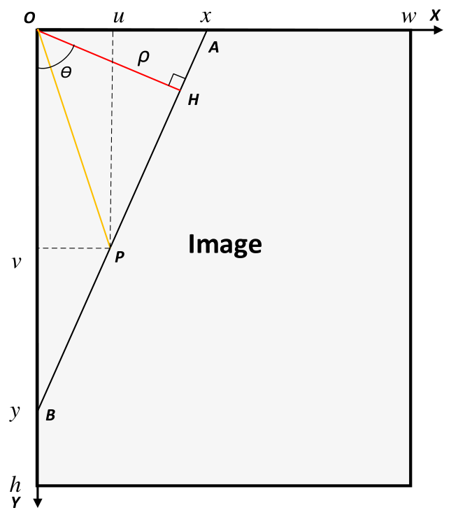

# Computer Vision

## Introduction

- Assistant: Thu 627: 19:00
- Prof.: 608

- Image Processing: Signal processing
- Machine Vision: high-level **understanding** from image/**video**

---

### Camera

- Kinect sensor: depth
- ZED: stereo
- Fish eye camera
- Line scan camera
- Event camera
- Scamp: SIMD 直接并行运算，可以得到 feature map, optical flow 等，完全可编程。

---

### Images

Sensor:

- CCD
- CMOS

[CCD 与CMOS 图像传感器区别在哪里？ - 知乎 (zhihu.com)](https://zhuanlan.zhihu.com/p/114541642)

datatype:

Commonly: \<uint8\> $3 \times H \times W$

---

OpenCV demo

```cpp
#include <opencv2/imgproc.h>
cv::Mat img = cv::imread(image_path, cv::IMREAD_COLOR);
cv::Mat greyimg;
cv::cvtColor(img, greyimg, cv::COLOR_BGR2GRAY);
```

---

GRAY2BGR?

OpenCV demo(not exactly)

```cpp
cv::Mat recover;
cv::cvtColor(greyimg, recover, cv::COLOR_GRAY2BGR);
```

deeplearning

---

Besides RGB (BGR in OpenCV), HSV:

- Hue ($0 \sim 2\pi$)
- Saturation ($0 \sim 100\%$)
- Value ($0 \sim 100\%$)

``cv::COLOR_BRG2HSV``

CIELab color space:

- L: 亮度 ($0 \sim 100$)
- a: 绿色到红色
- b: 蓝色到黄色

---

file type:

| format | compression | display | size   |
| ------ | ----------- | ------- | ------ |
| jpg    | lossy       | low     | small  |
| png    | no lossy    | medium  | medium |
| tiff   | no compress | high    | big    |
| bmp    | no compress | high    | big    |

---

### Linear-algebra

$l_{p}$ norm

$$
\begin{aligned}
\Vert \boldsymbol{x} \Vert_{p} &= \left( \sum_{i=1}^{n} x_{i}^{p} \right)^{\frac{1}{p}}\\
\Vert \boldsymbol{x} \Vert_{+\infty} &= \mathrm{max} \left\{ |x_{i}| \right\} \\
\Vert \boldsymbol{x} \Vert_{-\infty} &= \mathrm{min} \left\{ |x_{i}| \right\}
\end{aligned}
$$

---

3-D vector antisymmetric matrix

$$
\begin{aligned}
(\cdot)^{\wedge}&: \mathbb{R}^{3} \rightarrow \mathbb{R}^{3 \times 3} \\
\boldsymbol{a}^{\wedge} &= \begin{bmatrix}
0 & -a_{3} & a_{2} \\ 
a_{3} & 0 & -a_{1} \\ 
-a_{2} & a_{1} & 0
\end{bmatrix} \\
\boldsymbol{a} \times \boldsymbol{b} &= \boldsymbol{a}^{\wedge} \boldsymbol{b}
\end{aligned}
$$

$$
\begin{aligned}
\boldsymbol{a}^{\wedge} \boldsymbol{b} &= - \boldsymbol{b}^{\wedge} \boldsymbol{a} \\
(\boldsymbol{a}^{\wedge})^{T} &= - \boldsymbol{a}^{\wedge}
\end{aligned}
$$

向量三重积：

$$
\begin{aligned}
\boldsymbol{u} \times (\boldsymbol{v} \times \boldsymbol{w}) &= (\boldsymbol{u} \cdot \boldsymbol{w}) \boldsymbol{v} - (\boldsymbol{u} \cdot \boldsymbol{v}) \boldsymbol{w} \\
u^{\wedge} v^{\wedge} w &= v u^{T} w - w u^{T} v \\
&= (vu^{T} - u^{T} v I_{3}) w \\
u^{\wedge}v^{\wedge} &= v u^{T} - u^{T} v I_{3} 
\end{aligned}
$$

Other properties: [反对称矩阵的性质 | GWH Blog (gutsgwh1997.github.io)](https://gutsgwh1997.github.io/2020/05/26/%E5%8F%8D%E5%AF%B9%E7%A7%B0%E7%9F%A9%E9%98%B5%E7%9A%84%E6%80%A7%E8%B4%A8/)

---

3d rotation matrix

on XY plane by $\theta$ （注意是旋转后基矩阵的逆）

$$
\boldsymbol{R}_{\theta} = \begin{bmatrix}
\cos \theta & \sin \theta & 0 \\ 
-\sin \theta & \cos \theta & 0 \\ 
0 & 0 & 1
\end{bmatrix}
$$

on YZ plane by $\phi$

$$
\boldsymbol{R}_{\phi} = \begin{bmatrix}
1 & 0 & 0 \\ 
0 & \cos \phi & \sin \phi \\ 
0 & -\sin \phi & \cos \phi 
\end{bmatrix}
$$

on ZX plane by $\varphi$

$$
\boldsymbol{R}_{\varphi} = \begin{bmatrix}
-\sin \varphi & 0 & \cos \varphi \\ 
0 & 1 & 0 \\ 
\cos \varphi & 0 & \sin \varphi
\end{bmatrix}
$$

SO(3): special orthogonal group

---

矩陣求導の秘術

[矩阵求导的本质与分子布局、分母布局的本质（矩阵求导——本质篇） - 知乎 (zhihu.com)](https://zhuanlan.zhihu.com/p/263777564)

通常意义上的 Jacobian 矩阵：

$$
J = \frac{\partial \boldsymbol{y}}{\partial \boldsymbol{x}^{T}} = \begin{bmatrix}
\frac{\partial \boldsymbol{y}_{1}}{\partial \boldsymbol{x}_{1}} & \cdots & \frac{\partial y_{1}}{\partial x_{n}} \\ 
\vdots & \ddots & \vdots \\ 
\frac{\partial y_{n}}{\partial x_{1}} & \cdots & \frac{\partial y_{n}}{\partial x_{n}}
\end{bmatrix}
$$

和传统认知不同的是：

$$
\frac{\partial \boldsymbol{y}}{\partial \boldsymbol{x}} = \begin{bmatrix}
\begin{bmatrix} \frac{\partial y_{1}}{\partial x_{1}} \\ \vdots \\ \frac{\partial y_{1}}{\partial x_{1}}\end{bmatrix} \\ \vdots \\ \begin{bmatrix} \frac{\partial y_{n}}{\partial x_{1}} \\ \vdots \\ \frac{\partial y_{n}}{\partial x_{n}}\end{bmatrix}
\end{bmatrix} = \begin{bmatrix} \nabla y_{1} \\ \vdots \\ \nabla y_{n} \end{bmatrix}
$$

---

## Perspective-Transformation

- WCS(world coordinate system) $\boldsymbol{p}_{i}^{W}$
- CCS(camera coordinate system) $\boldsymbol{p}_{i}^{C}$


---

坐标系变换

$$
\begin{aligned}
\boldsymbol{p}_{i}^{C} &= \boldsymbol{R} \boldsymbol{p}_{i}^{W} + \boldsymbol{t} \\
\boldsymbol{p}_{i}^{C} &= \boldsymbol{R}' \left( \boldsymbol{p}_{i}^{W} + \boldsymbol{t}' \right) 
\end{aligned}
$$

- $\boldsymbol{R}$ rotate
- $\boldsymbol{t}$ translate

$$
\begin{aligned}
\widetilde{\boldsymbol{p}}_{i}^{C} &= \boldsymbol{P} \widetilde{\boldsymbol{p}}_{i}^{W} \\
\widetilde{\boldsymbol{p}}_{i}^{C} &= \begin{bmatrix} \boldsymbol{p}_{i}^{C} \\ 1 \end{bmatrix} \\
\widetilde{\boldsymbol{P}} &= \begin{bmatrix}
\boldsymbol{R} & \boldsymbol{t} \\
\boldsymbol{0}^{T} & 1
\end{bmatrix} =
\begin{bmatrix}
\boldsymbol{I}_{3} & \boldsymbol{t} \\
\boldsymbol{0}^{T} & 1
\end{bmatrix}
\begin{bmatrix}
\boldsymbol{R} & \boldsymbol{0} \\
\boldsymbol{0}^{T} & 1
\end{bmatrix} 
\end{aligned}
$$

所有的 $\widetilde{\boldsymbol{P}}$ 构成 SE(3) 群（special Euclidean group）

---

### Homogeneous-coordinates

[齐次坐标](LinearAlgebra1.md#齐次坐标)

- Rotation $\begin{bmatrix} \cos \theta & \sin \theta & 0 \\ -\sin \theta & \cos \theta & 0 \\ 0 & 0 & 1 \end{bmatrix}$
- Translation $\begin{bmatrix}1 & 0 & t_{x} \\ 0 & 1 & t_{y} \\ 0 & 0 & 1\end{bmatrix}$
- Scale $\begin{bmatrix}a & 0 & 0 \\ 0 & b & 0 \\ 0 & 0 & 1\end{bmatrix}$ (+ Rotation $\begin{bmatrix}a & b & 0 \\ -b & a & 0 \\ 0 & 0 & 1\end{bmatrix}$)
- Mirror $\begin{bmatrix}-1 & 0 & 0 \\ 0 & 1 & 0 \\ 0 & 0 & 1\end{bmatrix}$
- Shear $\begin{bmatrix}1 & \frac{s}{2} & 0 \\ \frac{s}{2} & 1 & 0 \\ 0 & 0 & 1\end{bmatrix}$
- Any $\begin{bmatrix}a & b & c \\ d & e & f \\ 0 & 0 & 1\end{bmatrix}$ (rotation+translation+scale+?mirror+?shear)

---

求过 $\boldsymbol{a} = \begin{bmatrix}a_{1} & a_{2}\end{bmatrix}^{T}$ 和 $\boldsymbol{b} = \begin{bmatrix}b_{1} & b_{2} \end{bmatrix}^{T}$ 的直线

补充齐次坐标，形成两条射线的方向向量

$$
\boldsymbol{B} = \begin{bmatrix}
a_{1} & b_{1}  \\ 
a_{2} & b_{2} \\ 
1 & 1
\end{bmatrix}
$$

法向量

$$
\begin{aligned}
\hat{n} &= \overline{\boldsymbol{a}} \times \overline{\boldsymbol{b}} \\
&= \begin{bmatrix}
0 & -1 & a_{2}\\
1 & 0 & -a_{1}\\
-a_{2} & a_{1} & 0
\end{bmatrix} \begin{bmatrix}b_{1} \\ b_{2} \\ 1\end{bmatrix} \\
0 &= \hat{\boldsymbol{n}} \cdot \left(\begin{bmatrix}x \\ y \\ 1\end{bmatrix} - \hat{\boldsymbol{a}}\right)
\end{aligned}
$$

齐次坐标的核心是升维，将原来经典的点线问题转化成了线面问题，通过叉积得到结果后对 $z$ 轴作归一化就是结果。

---

求直线的交点 $\boldsymbol{x} \in \mathbb{R}^{2}$

$$
\left\{ \begin{aligned}
a_{1} x_{1} + a_{2} x_{2} + a_{3} = 0\\
b_{1} x_{1} + b_{2} x_{2} + b_{3} = 0
\end{aligned} \right.
$$

使用齐次坐标：

$$
\begin{aligned}
&\boldsymbol{a}^{T} \begin{bmatrix}\boldsymbol{x} \\ 1\end{bmatrix} = 0 \\
&\boldsymbol{b}^{T} \begin{bmatrix}\boldsymbol{x} \\ 1\end{bmatrix} = 0
\end{aligned}
$$

$\begin{bmatrix}\boldsymbol{x} & 1\end{bmatrix}^{T}$ 与 $\boldsymbol{a}, \boldsymbol{b}$ 都正交，可以直接叉乘。

$$
\boldsymbol{a} \times \boldsymbol{b} = \boldsymbol{a}^{\wedge} \boldsymbol{b} = \lambda \begin{bmatrix}\boldsymbol{x} \\ 1\end{bmatrix}
$$

---

### Pinhole-Camera-Model

3D(CCS) ---> 2D(IPCS: image plane coordinate system)

将空间中的坐标 $\boldsymbol{p}_{i}^{C}$ 投影到相机平面 $\Pi: z = f$ 上。

> 理论上实际成像平面在针孔相机光圈的后面，但是为了简洁，对称变换至光圈前面处理。


$$
\begin{aligned}
\hat{\boldsymbol{p}}^{C} &= \frac{1}{z_{i}^{C}} \boldsymbol{p}^{C} = \begin{bmatrix} \frac{x_{i}^{C}}{z_{i}^{C}} & \frac{y_{i}^{C}}{z_{i}^{C}} & 1 \end{bmatrix}^{T}\\
\overline{p} &= f \hat{\boldsymbol{p}}^{C}
\end{aligned}
$$

---

### Intrinsic-Matrix

将物理坐标 IPCS 转化成像素坐标 PCS(Pixel Coordinate system)

$$
\begin{aligned}
u_{i} &= u_{o} + s_{x} x_{i}\\
v_{i} &= v_{o} + s_{y} y_{i}
\end{aligned}
$$

- $(u_{o}, v_{o})$: CCS origin O projection coordinate in PCS
- $(s_{x}, s_{y})$: pixel/mm

$$
\begin{aligned}
f_{x} :&= f s_{x} \\
f_{y} :&= f s_{y}
\end{aligned}
$$

$$
\widetilde{\boldsymbol{p}} = \begin{bmatrix}
u_{i} \\ 
v_{i} \\ 
1
\end{bmatrix} = \boldsymbol{K}\hat{\boldsymbol{p}}^{C} =\begin{bmatrix}
f_{x} & 0 & u_{0} \\ 
0 & f_{y} & v_{0} \\ 
0 & 0 & 1
\end{bmatrix} \begin{bmatrix}
\hat{x_{i}}^{C} \\ 
\hat{y_{i}}^{C} \\ 
1
\end{bmatrix}
$$

$$
\widetilde{\boldsymbol{p}} = \frac{1}{z_{i}^{C}} \boldsymbol{K} \boldsymbol{p}^{C}
$$

---

shear effect in intrinsic matrix

$$
K = \begin{bmatrix}
f_{x} & s & u_{0} \\ 
0 & f_{y} & v_{0} \\ 
0 & 0 & 1
\end{bmatrix}
$$

---

## Camera-Calibration

### Lens-distortion

- radial distortion

$$
\begin{aligned}
x_{undist} &= x_{dist} (1 + k_{1} r^{2} + k_{2} r^{4} + k_{3} r^{6} + \cdots) \\
y_{undist} &= y_{dist} (1 + k_{1} r^{2} + k_{2} r^{4} + k_{3} r^{6} + \cdots)
\end{aligned}
$$


- tangent disortion

$$
\begin{aligned}
x_{undist} &= x_{dist} + \left[ 2p_{1}x_{dist} y_{dist} + p_{2} (r^{2} + 2x_{dist}^{2}) \right] \\
y_{undist} &= y_{dist} + \left[ p_{1}(r^{2} + 2y^{2}_{dist}) + 2p_{2} x_{dist} y_{dist} \right]
\end{aligned}
$$

---

### chessboard-calibration

parameters:

- intrinsic matrix
- distortion coefficients
- extrinsic matrix(stereo)

- interesting points (from corner detection): $\boldsymbol{p}_{j}^{W}$
- camera poses $\boldsymbol{R}_{i}, \boldsymbol{t}_{i}$ (unknown)

$$
\begin{aligned}
& \text{minimize} && \sum_{i=1}^{n} \sum_{j=1}^{m} \Vert \boldsymbol{p}_{j} - \boldsymbol{\pi} (\boldsymbol{K}, \boldsymbol{R}_{i}, \boldsymbol{t}_{i}, k_{1}, k_{2}, k_{3}, p_{1}, p_{2}, \boldsymbol{p}_{j}^{W}) \Vert^{2}
\end{aligned}
$$

$$
\begin{aligned}
& \text{minimize} && \left \Vert \boldsymbol{p}_{j} - g \left( \frac{1}{z^{C}} \boldsymbol{K} \widetilde{\boldsymbol{R}} \widetilde{\boldsymbol{p}}^{W} \right) \right \Vert
\end{aligned}
$$

---

张正友标定法

张正友标定法是一种广泛使用的相机标定。它可以不借助外部的几何关系，仅凭借标准棋盘格和无需确定坐标的相机就可以实现对相机内参和 radial distortion 的标定。具体原理如下：

构建棋盘格的世界坐标系，棋盘格若为 $w \times h$，则棋盘格点可以表示为：

$$
\begin{aligned}
&\boldsymbol{M} = \begin{bmatrix}x &  y & 0\end{bmatrix}^{T}\\
&\left\{ \begin{aligned}
x = is && (i = 0, \cdots, w-1) \\
y = js && (j = 0, \cdots, h-1) \\
\end{aligned} \right.
\end{aligned}
$$

其中 $s$ 为棋盘格的边长，可以事先测量得到。由于 $z = 0$，简单起见，后面 $\widetilde{\boldsymbol{M}} = \begin{bmatrix}x & y & 1\end{bmatrix}^{T}$.

构建相机的像素坐标系，可以通过 ``cv::findChessboardCorners`` 函数寻找所有的棋盘格点 $\boldsymbol{m} = \begin{bmatrix}u & v\end{bmatrix}^{T}$ 并排序。

可以构建 $\widetilde{\boldsymbol{M}}$ 和 $\widetilde{\boldsymbol{m}}$ 之间的单应矩阵：

$$
s \widetilde{\boldsymbol{m}} = \boldsymbol{H} \widetilde{\boldsymbol{M}}
$$

$$
\widetilde{\boldsymbol{H}} = \begin{bmatrix}\boldsymbol{h}_{1} & \boldsymbol{h}_{2} & \boldsymbol{h}_{3}\end{bmatrix}
$$

不考虑畸变，可以表示关系为：

$$
\begin{aligned}
\widetilde{\boldsymbol{m}} &= \frac{1}{z^{C}} \boldsymbol{A} \begin{bmatrix}\boldsymbol{R} & \boldsymbol{t}\end{bmatrix} \begin{bmatrix}x \\ y \\ 0 \\ 1\end{bmatrix} \\
&= \lambda \boldsymbol{A} \begin{bmatrix}\boldsymbol{r}_{1} & \boldsymbol{r}_{2} & \boldsymbol{t}\end{bmatrix} \widetilde{\boldsymbol{M}}
\end{aligned}
$$

由于 $\boldsymbol{r}_{1} \cdot \boldsymbol{r}_{2} = 0, \Vert \boldsymbol{r}_{1} \Vert = \Vert \boldsymbol{r}_{2} \Vert = 1$

$$
\begin{aligned}
& \boldsymbol{h}_{1}^{T} \boldsymbol{A}^{-T} \boldsymbol{A}^{-1} \boldsymbol{h_{2}} = 0 \\
& \boldsymbol{h}_{1}^{T} \boldsymbol{A}^{-T} \boldsymbol{A}^{-1} \boldsymbol{h}_{1} = \boldsymbol{h}_{1}^{T} \boldsymbol{A}^{-T} \boldsymbol{A}^{-1} \boldsymbol{h}_{2}
\end{aligned}
$$

设 $\boldsymbol{B} = \boldsymbol{A}^{-T} \boldsymbol{A}^{-1}$ 则 $\boldsymbol{B}$ 是实对称阵。

$$
\begin{aligned}
\boldsymbol{B} &= \begin{bmatrix}
B_{11} & B_{12} & B_{13} \\
B_{12} & B_{22} & B_{23}\\
B_{13} & B_{23} & B_{33}
\end{bmatrix} \\
\boldsymbol{b} &= \begin{bmatrix}B_{11} &  B_{12} & B_{22} & B_{13} & B_{23} & B_{33}\end{bmatrix}^{T}
\end{aligned}
$$

设

$$
\boldsymbol{v}_{ij} = \begin{bmatrix}h_{i1}h_{j1} & h_{i1}h_{j2}+h_{i2}h_{j1} & h_{i2}h_{j2} & h_{i3}h_{j1}+h_{i1}h_{j3} & h_{i3}h_{j2}+h_{i2}h_{j3} & h_{i3}h_{j3}\end{bmatrix}^{T}
$$

则原来的式子可以表示为：

$$
\begin{bmatrix}
\boldsymbol{v}_{12}^{T} \\ 
(\boldsymbol{v}_{11} - \boldsymbol{v}_{22})^{T}
\end{bmatrix} \boldsymbol{b} = \boldsymbol{0}
$$

通过不同角度拍摄的图像，可以得到不同的矩阵，叠在一起得到：

$$
\boldsymbol{V} \boldsymbol{b} = \boldsymbol{0}
$$

事实上，它是优化问题：

$$
\begin{aligned}
& \text{min} && \Vert \boldsymbol{V} \boldsymbol{b} \Vert \\
& \text{s.t.} && \Vert \boldsymbol{b} \Vert = 0
\end{aligned}
$$

的解。$\boldsymbol{b}$ 取 $\boldsymbol{V}$ 矩阵奇异值分解以后对应奇异值最小的行空间的基（$\boldsymbol{V}^{T}$ 的最后一行）。

通过 $\boldsymbol{b}$ 可以得到 $\boldsymbol{B}$，进一步反解得到 $\boldsymbol{A}$.

$$
\begin{aligned}
v_{0} &= \frac{B_{12}B_{13} - B_{11}B_{23}}{B_{11}B_{22} - B_{12}^{2}}\\
\lambda &= B_{33} - \frac{B_{13}^{2} + v_{0}(B_{12} B_{23} - B_{11}B_{23})}{B_{11}} \\
\alpha &= \sqrt{ \frac{\lambda}{B_{11}} }\\
\beta &= \sqrt{\frac{\lambda B_{11}}{B_{11}B_{22} - B_{12}^{2}}}\\
\gamma &= - B_{12} \alpha^{2} \frac{\beta}{\lambda}\\
u_{0} &= \gamma \frac{v_{0}}{\alpha} - B_{13} \frac{\alpha^{2}}{\lambda}
\end{aligned}
$$

求出内参矩阵后，可以计算每一个相机位置对应的 $\boldsymbol{R}_{i}, \boldsymbol{t}_{i}$

$$
\begin{aligned}
\boldsymbol{r}_{i1} &= \frac{1}{\Vert \boldsymbol{A}^{-1} \boldsymbol{h}_{1} \Vert} \boldsymbol{A}^{-1} \boldsymbol{h}_{1}\\
\boldsymbol{r}_{i2} &= \frac{1}{\Vert \boldsymbol{A}^{-1} \boldsymbol{h}_{2} \Vert} \boldsymbol{A}^{-1} \boldsymbol{h}_{2} \\
\boldsymbol{t}_{i} &= \frac{1}{\Vert \boldsymbol{A}^{-1} \boldsymbol{h}_{3} \Vert} \boldsymbol{A}^{-1} \boldsymbol{h}_{3} \\
\boldsymbol{r}_{i3} &= \boldsymbol{r}_{i1} \times \boldsymbol{r}_{i2}
\end{aligned}
$$

至此为止，求解出了不考虑噪声和畸变情况下的内参矩阵。后面将 $\boldsymbol{A}, \boldsymbol{R}_{i}, \boldsymbol{t}_{i}$ 作为初始值送入 Levenberg-Marquardt 求解器中进行迭代优化。其中参数 $k_{1}, k_{2}, k_{3}$ 初始值为 0.

$$
\begin{aligned}
& \text{minimize} && \sum_{i=1}^{n} \sum_{j=1}^{m} \Vert \boldsymbol{m}_{j} - \boldsymbol{\pi} (\boldsymbol{A}, \boldsymbol{R}_{i}, \boldsymbol{t}_{i}, k_{1}, k_{2}, k_{3}, \boldsymbol{M}_{j}) \Vert^{2}
\end{aligned}
$$

---

## Epipolar-Geometry

---

3 matrix:

- Essential Matrix
- Fundamental Matrix
- Homography Matrix

Math tools:

- [特征值分解](LinearAlgebra2.md#5.3_对角化)
- [奇异值分解](LinearAlgebra2.md#7.4_奇异值分解)

---


$$
\begin{aligned}
\boldsymbol{p}_{L}^{C} &= \frac{z_{L}^{C}}{f_{L}} \overline{\boldsymbol{p}}_{L} \\
\boldsymbol{p}_{R}^{C} &= \frac{z_{R}^{C}}{f_{R}} \overline{\boldsymbol{p}}_{R} \\
\frac{\boldsymbol{p}_{L}^{C}}{z_{L}^{C}} &= \hat{\boldsymbol{p}}_{L}^{C}= \boldsymbol{K}_{L}^{-1} \widetilde{\boldsymbol{p}}_{L}= \boldsymbol{K}_{L}^{-1} \begin{bmatrix} \boldsymbol{p}_{L} \\ 1\end{bmatrix} \\
\frac{\boldsymbol{p}_{R}^{C}}{z_{R}^{C}} &= \hat{\boldsymbol{p}}_{R}^{C}= \boldsymbol{K}_{R}^{-1} \widetilde{\boldsymbol{p}}_{R} = \boldsymbol{K}_{R}^{-1} \begin{bmatrix} \boldsymbol{p}_{R}\\ 1\end{bmatrix} \\
\boldsymbol{p}_{R}^{C} &= \boldsymbol{R} \boldsymbol{p{_{L}^{C} + \boldsymbol{t}}}
\end{aligned}
$$

---

### Essential-Matrix

$$
\begin{aligned}
\boldsymbol{E} &= \boldsymbol{t}^{\wedge} \boldsymbol{R} \\
&=\begin{bmatrix} \boldsymbol{t} \times \boldsymbol{r}_{1} & \boldsymbol{t} \times \boldsymbol{r}_{2} & \boldsymbol{t} \times \boldsymbol{r}_{3} \end{bmatrix}
\end{aligned}
$$

$$
\begin{aligned}
\boldsymbol{p}_{R}^{C} &= \boldsymbol{R} \boldsymbol{p}_{L}^{C} + \boldsymbol{t} \\
\left( (\boldsymbol{p}_{R}^{C})^{T} \boldsymbol{t}^{\wedge} \right) \boldsymbol{p}_{R}^{C} &= \left( (\boldsymbol{p}_{R}^{C})^{T} \boldsymbol{t}^{\wedge} \right) \boldsymbol{R} \boldsymbol{p}_{L}^{C} + \left( (\boldsymbol{p}_{R}^{C})^{T} \boldsymbol{t}^{\wedge} \right) \boldsymbol{t} \\
- (\boldsymbol{p}_{R}^{C})^{T} (\boldsymbol{p}_{R}^{C})^{\wedge}\boldsymbol{t} &= (\boldsymbol{p}_{R}^{C})^{T} \left( \boldsymbol{t}^{\wedge} \boldsymbol{R} \right) \boldsymbol{p}_{L}^{C} + (\boldsymbol{p}_{R}^{C})^{T} \boldsymbol{t}^{\wedge} \boldsymbol{t}
\end{aligned}
$$

$$
\begin{aligned}
(\boldsymbol{p}_{R}^{C})^{T} \boldsymbol{E} \boldsymbol{p}_{L}^{C} &= 0 \\
(\hat{\boldsymbol{p}}_{R}^{C})^{T} \boldsymbol{E} \hat{\boldsymbol{p}}_{L}^{C} &= 0
\end{aligned}
$$

---

essential matrix: degree of freedom = 5

- $\boldsymbol{t}$: +3
- $\boldsymbol{R}$: +3
- scalable ambiguity: -1 就是说在基本矩阵公式中，$\lambda \boldsymbol{E}, (\lambda \in \mathbb{R})$ 都满足条件。

因此理论上只要 5 对 $\hat{\boldsymbol{p}}_{L, R}^{C}$ 就可以定 $\boldsymbol{E}$. 工程中使用 8 点法。

---

Get Essential Matrix:

$$
\begin{aligned}
& \begin{bmatrix}x & y & 1\end{bmatrix} \begin{bmatrix}e_{11} & e_{12} & e_{13} \\ e_{21} & e_{22} & e_{23} \\ e_{31} & e_{32} & e_{33}\end{bmatrix} \begin{bmatrix}x' \\ y' \\ 1\end{bmatrix} = 0 \\
& \begin{bmatrix}
xx' & xy' & x & yx' & yy' & y & x' & y' & 1
\end{bmatrix} \begin{bmatrix}
e_{11} \\ e_{12} \\ e_{13} \\ e_{21} \\ e_{22} \\ e_{23} \\ e_{31} \\ e_{32} \\ e_{33}
\end{bmatrix} = 0 \\
& \begin{bmatrix}
x_{1}x_{1}' & x_{1}y_{1}' & x_{1} & y_{1}x_{1}' & y_{1}y_{1}' & y_{1} & x_{1}' & y_{1}' & 1 \\
\cdots \\
x_{n}x_{n}' & x_{n}y_{n}' & x_{n} & y_{n}x_{n}' & y_{n}y_{n}' & y_{n} & x_{n}' & y_{n}' & 1 \\
\end{bmatrix} \begin{bmatrix}
e_{11} \\ e_{12} \\ e_{13} \\ e_{21} \\ e_{22} \\ e_{23} \\ e_{31} \\ e_{32} \\ e_{33}
\end{bmatrix} = 0
\end{aligned}
$$

---

From Essential Matrix Get Rotation & Translation

首先来看看 $E$ 的性质：

$$
\begin{aligned}
\mathrm{rank} \boldsymbol{E} &= \mathrm{rank} (\boldsymbol{t}^{\wedge} \boldsymbol{R}) \\
&= \mathrm{rank} (\boldsymbol{t}^{\wedge})
\end{aligned}
$$

$\boldsymbol{t}^{\wedge} \boldsymbol{x} = \boldsymbol{0}$ 的解为 $\boldsymbol{x} = \lambda \boldsymbol{t}$，$\boldsymbol{t}^{\wedge}$ 的零空间维数为 1，$\mathrm{rank} (\boldsymbol{t}^{\wedge}) = 2$.

对 $\boldsymbol{E}$ 作奇异值分解

$$
\begin{aligned}
\boldsymbol{E} &= \boldsymbol{U} \boldsymbol{\Sigma} \boldsymbol{V}^{T} \\
\boldsymbol{\Sigma} &= \begin{bmatrix}
s_{1} & 0 & 0\\
0 & s_{2} & 0\\
0 & 0 & 0
\end{bmatrix}
\end{aligned}
$$

$$
\begin{aligned}
\boldsymbol{E}^{T} \boldsymbol{E} &= \boldsymbol{V} \boldsymbol{\Sigma}^{T} \boldsymbol{\Sigma} \boldsymbol{V}^{T} \\
&= \boldsymbol{R}^{T} [\boldsymbol{t}]_{\times}^{T} [\boldsymbol{t}]_{\times} \boldsymbol{R} \\
\boldsymbol{\Sigma}^{2} &= \boldsymbol{Q} [\boldsymbol{t}]_{\times}^{T} [\boldsymbol{t}]_{\times}\boldsymbol{Q}^{T} \\
[\boldsymbol{t}]_{\times}^{T} [\boldsymbol{t}]_{\times} &= - [\boldsymbol{t}]_{\times}^{2} = \begin{bmatrix}
t_{2}^{2}+t_{3}^{2} & -t_{1}t_{2} & -t_{1}t_{3}\\
-t_{1}t_{2} & t_{1}^{2}+t_{3}^{2} & -t_{2}t_{3}\\
-t_{1}t_{3} & -t_{2}t_{3} & t_{1}^{2}+t_{2}^{2}
\end{bmatrix} \\
\lambda_{1} &= \lambda_{2} = t_{1}^{2}+t_{2}^{2}+t_{3}^{2}
\end{aligned}
$$

因为[矩阵奇异值等于 Gram 矩阵特征值开根号](LinearAlgebra2.md#7.4_奇异值分解)，所以 $\Sigma$ 的有两个奇异值而且相等。

$$
\boldsymbol{\Sigma} = \begin{bmatrix}
\sqrt{t_{1}^{2}+t_{2}^{2}+t_{3}^{2}} & 0 & 0 \\ 
0 & \sqrt{t_{1}^{2}+t_{2}^{2}+t_{3}^{2}} & 0 \\ 
0 & 0 & 0
\end{bmatrix}
$$

---

From Essential Matrix Get Rotation & Translation

再来看看 $[\boldsymbol{t}]_{\times}$ 的性质。

$$
\begin{aligned}
\boldsymbol{t} &= s \boldsymbol{U} \begin{bmatrix}0 \\ 0 \\ 1\end{bmatrix} \\
[\boldsymbol{t}]_{\times} &= s \left[ \boldsymbol{U} \begin{bmatrix}0 \\ 0 \\ 1\end{bmatrix} \right]_{\times} = s \boldsymbol{U} \begin{bmatrix}
0 & -1 & 0\\
1 & 0 & 0\\
0 & 0 & 0
\end{bmatrix} \boldsymbol{U}^{T}
\end{aligned}
$$

这里利用了性质：$\boldsymbol{b} = \boldsymbol{U} \boldsymbol{a} \iff [\boldsymbol{b}]_{\times} = \left[ \boldsymbol{U} \boldsymbol{a} \right]_{\times} = \boldsymbol{U} [\boldsymbol{a}]_{\times} \boldsymbol{U}^{T}$

> [!tip] Proof
> $$
> \begin{aligned}
\forall \boldsymbol{b} \in \mathbb{R}^{3}, (\boldsymbol{U} \boldsymbol{a}) \times (\boldsymbol{U} \boldsymbol{b}) &= \boldsymbol{U} (\boldsymbol{a} \times \boldsymbol{b}) \\
\iff \forall \boldsymbol{b} \in \mathbb{R}^{3}, \boldsymbol{U} [\boldsymbol{a}]_{\times} \boldsymbol{b} &= [\boldsymbol{U} \boldsymbol{a}]_{\times} \boldsymbol{U} \boldsymbol{b} \\
\iff \boldsymbol{U} [\boldsymbol{a}]_{\times} &= [\boldsymbol{U} \boldsymbol{a}]_{\times} \boldsymbol{U} \\
\iff [\boldsymbol{U} \boldsymbol{a}]_{\times} &= \boldsymbol{U} [\boldsymbol{a}]_{\times} \boldsymbol{U}^{T}
\end{aligned} $$

---

From Essential Matrix Get Rotation & Translation

如何从 $\boldsymbol{E}$ 中凑出来 $\boldsymbol{t}$ 和 $\boldsymbol{R}$ 呢？

$$
\begin{aligned}
\boldsymbol{E} &= \boldsymbol{U} \boldsymbol{\Sigma} \boldsymbol{V}^{T}  \\
&= \boldsymbol{U} \begin{bmatrix}
s & 0 & 0\\
0 & s & 0\\
0 & 0 & 0
\end{bmatrix} \boldsymbol{V}^{T} \\
&= \boldsymbol{U} \begin{bmatrix}
0 & -s & 0\\
s & 0 & 0\\
0 & 0 & 0
\end{bmatrix}\begin{bmatrix}
0 & 1 & 0\\
-1 & 0 & 0\\
0 & 0 & 1
\end{bmatrix} \boldsymbol{V}^{T} \\
&= \left( s\boldsymbol{U} \begin{bmatrix}
0 & -1 & 0\\
1 & 0 & 0\\
0 & 0 & 0
\end{bmatrix} \boldsymbol{U}^{T} \right)
\left( \boldsymbol{U} \begin{bmatrix}
0 & 1 & 0\\
-1 & 0 & 0\\
0 & 0 & 1
\end{bmatrix} \boldsymbol{V}^{T} \right)
\end{aligned}
$$

$$
\left\{ \begin{aligned}
\boldsymbol{t} &= \boldsymbol{U} \begin{bmatrix}0 \\ 0 \\ \pm s\end{bmatrix} \\
\boldsymbol{R} &= \boldsymbol{U} \begin{bmatrix}
0 & \pm 1 & 0\\
\mp 1 & 0 & 0\\
0 & 0 & 1
\end{bmatrix} \boldsymbol{V}^{T}
\end{aligned} \right.
$$

> [!tip] 关于自由度
> 事实上，为什么 $E$ 最后只剩下了 5 个自由度，原因也可以从这里看出来。使用特征点匹配，将左右照片的特征点带入 Elementary Matrix 方程 $(\hat{\boldsymbol{p}}^{C}_{R})^{T} \boldsymbol{E} (\hat{\boldsymbol{p}}^{C}_{L}) = 0$ 求解得到的 $E$，$s$ 的值实际上是任意值，这意味着双目标定的到的 $\boldsymbol{t}$ 只有方向信息，没有绝对的长度信息。
> 
> 对于一个没有绝对长度量纲的问题，这是正常的。在某些 SLAM 技术中，需要根据先验的长度信息（例如人、车的大小一般是某个范围的值）来获得准确的绝对定位。

---

解出来 4 个解，但是只有一种解符合情况。

> [!help] 为什么有四个解？
> 
> 因为实际过程中使用 $(\boldsymbol{p}_{R}^{C})^{T} \boldsymbol{E} \boldsymbol{p}_{L}^{C} = 0$ 解出 $E$，实际上不是 $\boldsymbol{E} = s \boldsymbol{U} \mathrm{diag}[1, 1, 0] \boldsymbol{V}^{T}$。
> 
> 而是 $\boldsymbol{E} = \pm s \boldsymbol{U} \mathrm{diag}[1, 1, 0] \boldsymbol{V}^{T}$。这里的 $\pm$ 对应的两种情况加上上面闭式解的两种情况一共形成 4 个解。


---

### Fundamental-Matrix

$$
\begin{aligned}
(\hat{\boldsymbol{p}}_{R}^{C})^{T} \boldsymbol{E} \hat{\boldsymbol{p}}_{L}^{C} &= 0 \\
\left( \boldsymbol{K}_{R} \widetilde{\boldsymbol{p}}_{R}^{-1} \right)^{T} \boldsymbol{E} (\boldsymbol{K}_{L}^{-1} \widetilde{\boldsymbol{p}}_{L}) &= 0 \\
\widetilde{\boldsymbol{p}}_{R} \boldsymbol{F} \widetilde{\boldsymbol{p}}_{L} &= 0 \\
\end{aligned}
$$

$$
\boldsymbol{F} := \boldsymbol{K}_{R}^{-T} \boldsymbol{E} \boldsymbol{K}_{L}^{-1} \in \mathbb{R}^{3 \times 3}
$$

作为一个 $3 \times 3$ 矩阵，$\boldsymbol{F}$ 原本有九个自由度。但是考虑到下面两个约束：

1. $\boldsymbol{F} \sim \lambda \boldsymbol{F}, \lambda \in \mathbb{R}$
2. $\mathrm{det} (\boldsymbol{F}) = 0$

$\boldsymbol{F}$ 的自由度为 7.

---

### Homography-Matrix

如果根据先验信息已知所有的采样点都在同一个平面上，那么还可以用约束更强的 Homography Matrix.

$$
\begin{aligned}
\boldsymbol{0} &= \boldsymbol{n}^{T} \boldsymbol{p}_{L}^{C} + b \\
\boldsymbol{p}_{R}^{C} &= \boldsymbol{R} \boldsymbol{p}_{L}^{C} + \boldsymbol{t} \\
&= \boldsymbol{R} \boldsymbol{p}_{L}^{C} + \left( - \frac{\boldsymbol{n}^{T} \boldsymbol{p}_{L}^{C}}{b} \right) \boldsymbol{t} \\
&= \left( \boldsymbol{R} - \frac{1}{b} \boldsymbol{n}^{T} \boldsymbol{t} \right) \boldsymbol{p}_{L}^{C} \\
z_{R}^{C} \boldsymbol{K}_{R}^{-1} \widetilde{\boldsymbol{p}}_{R} &= \left( \boldsymbol{R} - \frac{1}{b} \boldsymbol{n}^{T} \boldsymbol{t} \right) z_{L}^{C} \boldsymbol{K}_{L}^{-1} \widetilde{\boldsymbol{p}}_{L} \\
\widetilde{\boldsymbol{p}}_{R} &= \frac{z_{L}^{C}}{z_{R}^{C}} \boldsymbol{K}_{R} \left( \boldsymbol{R} - \frac{1}{b} \boldsymbol{n}^{T} \boldsymbol{t} \right) \boldsymbol{K}_{L}^{-1} \widetilde{\boldsymbol{p}}_{L}
\end{aligned}
$$

$$
\begin{aligned}
\boldsymbol{H} &= \frac{z_{L}^{C}}{z_{R}^{C}} \boldsymbol{K}_{R} \left( \boldsymbol{R} - \frac{1}{b} \boldsymbol{n}^{T} \boldsymbol{t} \right) \boldsymbol{K}_{L}^{-1} \\
\widetilde{\boldsymbol{p}}_{R} &= \boldsymbol{H} \widetilde{\boldsymbol{p}}_{L}
\end{aligned}
$$

> [!tip]
> 这里为了保证 $H$ 的存在，应当使得 $\frac{z_{L}^{C}}{z_{R}^{C}}$ 为定值。事实上，对于正常标定的双目相机系统，这是可以满足的。
> 
> 其实即使不是双目相机系统，而是一般的平面，那么两个平面之间也可以存在线性的坐标变换关系。

---

$\boldsymbol{H}$ 有 9 个元素，考虑到尺度任意性，减去一个自由度。Dof = 8

$$
\begin{aligned}
\boldsymbol{H} &= \begin{bmatrix}
h_{11} & h_{12} & h_{13} \\ 
h_{21} & h_{22} & h_{23} \\ 
h_{31} & h_{32} & 1
\end{bmatrix} \\
\widetilde{\boldsymbol{p}}_{R} &= \lambda \boldsymbol{H} \boldsymbol{\widetilde{p}}_{L}
\end{aligned}
$$

如何求 Homography Matrix？只需要 4 对点。先看某一对点：

$$
\begin{aligned}
\widetilde{\boldsymbol{p}}_{L} &= \begin{bmatrix}u_{1} & v_{1} & 1\end{bmatrix}^{T} \\
\widetilde{\boldsymbol{p}}_{R} &= \begin{bmatrix}u_{2} & v_{2} & 1\end{bmatrix}
\end{aligned}
$$

从这一对点可以得到 3 个线性方程，从齐次坐标消去 $\lambda$. 可以得到两个方程。

$$
\begin{bmatrix}
u_{1} & v_{1} & 1 & 0 & 0 & 0 & -u_{1}u_{2} & -u_{2}v_{1} \\ 
0 & 0 & 0 & u_{2} & v_{2} & 1 & -u_{1}v_{2} & -v_{1}v_{2}
\end{bmatrix} \begin{bmatrix}
h_{11} \\ h_{12} \\ h_{13} \\ h_{21} \\ h_{22} \\ h_{23} \\ h_{31} \\ h_{32}
\end{bmatrix} = \begin{bmatrix}v_{1} \\ v_{2}\end{bmatrix}
$$

使得矩阵可逆，必须凑够至少 4 对点。

---

### Trigulation

From: $\boldsymbol{p}_{L}, \boldsymbol{p}_{R}, \boldsymbol{R}, \boldsymbol{t}, \boldsymbol{K}_{L}, \boldsymbol{K}_{R}$ determine a 3D point ($\boldsymbol{p}^{C}, \widetilde{\boldsymbol{p}}^{C}$).

Assuming: WCS = LCCS

Projection Transform: 

$$
\begin{aligned}
\widetilde{\boldsymbol{p}}^{C} \rightarrow \boldsymbol{p}_{L}: \boldsymbol{P}_{L} &= \boldsymbol{K}_{L} \begin{bmatrix}\boldsymbol{I} & \boldsymbol{0}\end{bmatrix} \\
\widetilde{\boldsymbol{p}}^{C} \rightarrow \boldsymbol{p}_{R}: \boldsymbol{P}_{R} &= \boldsymbol{K}_{R} \begin{bmatrix}\boldsymbol{R} & \boldsymbol{t}\end{bmatrix} \\
\end{aligned}
$$

---

事实上，上面少了 $z_{L}^{C}, z_{R}^{C}$，无法得到定量结果；但是由于共线，叉乘结果为 0.

$$
\begin{aligned}
\boldsymbol{p}_{L} \times (\boldsymbol{P}_{L} \widetilde{\boldsymbol{p}}^{C}) = \boldsymbol{0} \\
\boldsymbol{p}_{R} \times (\boldsymbol{P}_{R} \widetilde{\boldsymbol{p}}^{C}) = \boldsymbol{0} \\
\end{aligned}
$$

记 $\boldsymbol{P}_{*}^{i}$ 为 $\boldsymbol{P}_{*}$ 的第 $i$ 行。

$$
\begin{aligned}
\begin{bmatrix}
0 & -1 & v_{L}\\
1 & 0 & -u_{L}\\
-v_{L} & u_{L} & 0
\end{bmatrix} \begin{bmatrix}
\boldsymbol{P}_{L}^{1} \widetilde{\boldsymbol{p}^{C}}\\
\boldsymbol{P}_{L}^{2} \widetilde{\boldsymbol{p}^{C}}\\
\boldsymbol{P}_{L}^{3} \widetilde{\boldsymbol{p}^{C}}\\
\end{bmatrix} = \boldsymbol{0}\\
\begin{bmatrix}
0 & -1 & v_{R}\\
1 & 0 & -u_{R}\\
-v_{R} & u_{R} & 0
\end{bmatrix} \begin{bmatrix}
\boldsymbol{P}_{R}^{1} \widetilde{\boldsymbol{p}^{C}}\\
\boldsymbol{P}_{R}^{2} \widetilde{\boldsymbol{p}^{C}}\\
\boldsymbol{P}_{R}^{3} \widetilde{\boldsymbol{p}^{C}}\\
\end{bmatrix} = \boldsymbol{0}\\
\end{aligned}
$$

---

由于 $\mathrm{rank} ([\boldsymbol{p}_{*}]_{\times}) = 2$，因此可以舍弃每一个矩阵方程的最后一行。

$$
\begin{aligned}
\begin{bmatrix}
- \boldsymbol{P}_{L}^{2} + v_{L} \boldsymbol{P}_{L}^{3} \\
\boldsymbol{P}_{L}^{1} - u_{L} \boldsymbol{P}_{L}^{3}\\
- \boldsymbol{P}_{R}^{2} + v_{R} \boldsymbol{P}_{R}^{3} \\
\boldsymbol{P}_{R}^{1} - u_{R} \boldsymbol{P}_{R}^{3}\\
\end{bmatrix}\widetilde{\boldsymbol{p}}^{C} = \boldsymbol{0}\\
\begin{bmatrix}
- \boldsymbol{P}_{L}^{2} + v_{L} \boldsymbol{P}_{L}^{3} \\
- \boldsymbol{P}_{L}^{1} + u_{L} \boldsymbol{P}_{L}^{3}\\
- \boldsymbol{P}_{R}^{2} + v_{R} \boldsymbol{P}_{R}^{3} \\
- \boldsymbol{P}_{R}^{1} + u_{R} \boldsymbol{P}_{R}^{3}\\
\end{bmatrix}\widetilde{\boldsymbol{p}}^{C} = \boldsymbol{0}\\
\end{aligned}
$$

这样就写成了 $\boldsymbol{A} \widetilde{\boldsymbol{p}}^{C} = \boldsymbol{0}$ 的形式。在实际求解过程中，不可能为 0，要求解一个优化问题：

$$
\begin{aligned}
& \text{min.} && \Vert \boldsymbol{A} \widetilde{\boldsymbol{p}}^{C} \Vert_{2}^{2} \\
& \text{s.t.} && \Vert \widetilde{\boldsymbol{p}}^{C} \Vert_{2}^{2} = 1
\end{aligned}
$$

---

对于这个问题，可以使用 SVD 分解的方法求解。假设 $\boldsymbol{A}$ 列满秩。（当使用多目匹配时会出现行大于列的情况）

$$
\begin{aligned}
\Vert \boldsymbol{A} \boldsymbol{p}\Vert^{2} &= \boldsymbol{p}^{T} \boldsymbol{V} \boldsymbol{\Sigma}^{T} \boldsymbol{\Sigma} \boldsymbol{V}^{T} \boldsymbol{p} \\
&= \boldsymbol{y}^{T} \begin{bmatrix}
\sigma_{1}^{2} & &\\
 & \ddots & \\
 & & \sigma_{n}^{2}
\end{bmatrix} \boldsymbol{y} && \left(\boldsymbol{y} = \boldsymbol{V}^{T} \boldsymbol{p} , \Vert \boldsymbol{y} \Vert = \Vert \boldsymbol{p} \Vert\right) \\
&\geq \sigma_{n}^{2} && (\boldsymbol{y} = \begin{bmatrix}0 & \cdots & 0 & 1\end{bmatrix}^{T}) \\
\boldsymbol{p} &= \boldsymbol{V} \begin{bmatrix}
0\\
\vdots\\
0\\
1
\end{bmatrix} = \boldsymbol{v}_{n}
\end{aligned}
$$

之后进行其次化得到 $\widetilde{\boldsymbol{p}}^{C}$

$$
\widetilde{\boldsymbol{p}}^{C} = \frac{1}{v_{4n}} \boldsymbol{v}_{n}
$$

---

### stereopsis

标定好的相机不需要在整个图片上匹配特征点，而只需要在对基线上进行一维搜索。

为了便于一维搜索，执行立体校正（stereo rectification）操作


$$
\begin{aligned}
\boldsymbol{R} &= \boldsymbol{I}_{3} \\
\boldsymbol{t} &= \begin{bmatrix}-t & 0 & 0\end{bmatrix}^{T}
\end{aligned}
$$

---

3 steps of stereo rectification:

1. rotate left camera by $\boldsymbol{R}^{T}$ 把左相机转得和右相机方向一样
2. rotate both by $\boldsymbol{R}_{rect}$
3. scale corespondence by designing equal $\boldsymbol{K}$

$$
\begin{aligned}
\boldsymbol{R}_{rect} &= \begin{bmatrix}\boldsymbol{r}_{1} & \boldsymbol{r}_{2} & \boldsymbol{r}_{3}\end{bmatrix}\\
\boldsymbol{r}_{1} &= -\frac{1}{\Vert \boldsymbol{t} \Vert} \boldsymbol{t}\\
\boldsymbol{r}_{2} &= \begin{bmatrix}0 & 0 & 1\end{bmatrix}^{T} \times \boldsymbol{r}_{1}\\
\boldsymbol{r}_{3} &= \boldsymbol{r}_{1} \times \boldsymbol{r}_{2}
\end{aligned}
$$

---

OpenCV source code for step 1&2:

```cpp
    if( matR->rows == 3 && matR->cols == 3 )
        cvRodrigues2(matR, &om);          // get vector rotation
    else
        cvConvert(matR, &om); // it's already a rotation vector
    cvConvertScale(&om, &om, -0.5); // get average rotation
    cvRodrigues2(&om, &r_r);        // rotate cameras to same orientation by averaging
    cvMatMul(&r_r, matT, &t);

    int idx = fabs(_t[0]) > fabs(_t[1]) ? 0 : 1;
    double c = _t[idx], nt = cvNorm(&t, 0, CV_L2);
    _uu[idx] = c > 0 ? 1 : -1;

    CV_Assert(nt > 0.0);

    // calculate global Z rotation
    cvCrossProduct(&t,&uu,&ww);
    double nw = cvNorm(&ww, 0, CV_L2);
    if (nw > 0.0)
        cvConvertScale(&ww, &ww, acos(fabs(c)/nt)/nw);
    cvRodrigues2(&ww, &wR);

    // apply to both views
    cvGEMM(&wR, &r_r, 1, 0, 0, &Ri, CV_GEMM_B_T);
    cvConvert( &Ri, _R1 );
    cvGEMM(&wR, &r_r, 1, 0, 0, &Ri, 0);
    cvConvert( &Ri, _R2 );
    cvMatMul(&Ri, matT, &t);
```

之后计算 Homograph 矩阵将原来的图像映射到新的相机平面上。

---

After rectification:

$$
\begin{aligned}
\boldsymbol{p}^{L} &= \boldsymbol{p}^{W} + \frac{\boldsymbol{t}}{2} \\
\boldsymbol{p}^{R} &= \boldsymbol{p}^{W} - \frac{\boldsymbol{t}}{2} \\
\overline{\boldsymbol{p}}^{L} &= \frac{f}{z^{W}}\left(\boldsymbol{p}^{W} + \frac{\boldsymbol{t}}{2}\right)\\
\overline{\boldsymbol{p}}^{R} &= \frac{f}{z^{W}}\left(\boldsymbol{p}^{W} - \frac{\boldsymbol{t}}{2}\right)\\
u_{L} - u_{R} &= \frac{ft}{z^{W}}\\
z^{W} &= \frac{ft}{d}
\end{aligned}
$$

---

## Image-Filtering

$$
\begin{aligned}
\omega * f(x, y) &= \sum_{dx=-a}^{a} \sum_{dy=-b}^{b} \omega(dx, dy) f(x-dx, y-dy) \\
\omega \otimes f(x, y) &=  \sum_{dx=-a}^{a} \sum_{dy=-b}^{b} \omega(dx, dy) f(x+dx, y+dy) \\
\end{aligned}
$$

卷积/互相关的三种 padding 方式：

- Valid 不 padding
- Same padding 右下各一
- Full padding 周围一周

---

### translation

$$
\begin{bmatrix}
1 & 0 & 0 \\ 
0 & 0 & 0 \\ 
0 & 0 & 0
\end{bmatrix}, \begin{bmatrix}
0 & 0 & 0 \\ 
0 & 0 & 0 \\ 
0 & 0 & 1
\end{bmatrix}
$$

---

### Laplacian-Filtering

$$
\begin{bmatrix}
0 & -1 & 0 \\ 
-1 & 4 & -1 \\ 
0 & -1 & 0
\end{bmatrix}
\begin{bmatrix}
-1 & -1 & -1 \\ 
-1 & 8 & -1 \\ 
-1 & -1 & -1
\end{bmatrix}
$$

```cpp
Laplacian( src_gray, dst, CV_16S, 1, 1.0, 0.0, BORDER_DEFAULT );
```

Laplacian-filtering 对高频噪声比较敏感，因此应用前经常先使用 GaussianBlur. 为了计算的简便，可以先将 LaplacianFilter 和 GaussianBlur 卷积，得到 LoG 卷积核以后再对原始图片做卷积。

$$
\begin{aligned}
\mathrm{LoG}(x, y) &= \nabla^{2} \left( \frac{1}{2\pi\sigma^{2}} e^{-\dfrac{x^{2}+y^{2}}{2\sigma^{2}}} \right) \\
&= - \frac{1}{\pi \sigma^{4}} \left(1 - \frac{x^{2}+y^{2}}{2\sigma^{2}}\right) e^{-\dfrac{x^{2}+y^{2}}{2\sigma^{2}}}
\end{aligned}
$$

将 Laplacian-filtering 与原图片相加，可以实现锐化效果。

$$
\begin{bmatrix}
0 & -1 & 0 \\ 
-1 & 5 & -1 \\ 
0 & -1 & 0
\end{bmatrix}
$$

---

### Gradient-Filtering

horizonal:

$$
G_{h} = \begin{bmatrix}
-1 & 0 & 1 \\ 
-x & 0 & x \\ 
-1 & 0 & 1
\end{bmatrix}
$$

vertical:

$$
G_{v} = G_{h}^{T}
$$

```cpp
Sobel(src_gray, grad_x, ddepth, 1, 0, ksize, scale, delta, BORDER_DEFAULT);
Sobel(src_gray, grad_y, ddepth, 0, 1, ksize, scale, delta, BORDER_DEFAULT);
```

---

### Box-Filtering

```cpp
void cv::filter2D(InputArray src, OutputArray dst, int ddepth, InputArray kernel, Point anchor,  double delta = 0, int borderType = BORDERDEFAULT)
```

$$
dst(x,y)=\sum_{\substack{0 \leq x'< b \\ 0 \leq y'< a}}kernel(x',y') \cdot src(x+x'−anchor.x,y+y'−anchor.y)
$$

$$
\mathrm{kernel} = \frac{1}{(2n+1)^{2}}\boldsymbol{J}_{2n+1}
$$

可以使用 Integral Graph 减少计算某一个区域元素和的复杂度。

```cpp
void blur( InputArray src, OutputArray dst, Size ksize, Point anchor = Point(-1,-1), int borderType = BORDER_DEFAULT );
```

---

### Gaussian-Filtering

$$
\frac{1}{16}\begin{bmatrix}
1 & 2 & 1 \\ 
2 & 4 & 2 \\ 
1 & 2 & 1
\end{bmatrix}, \frac{1}{256}\begin{bmatrix}
1 & 4 & 6 & 4 & 1 \\ 
4 & 16 & 24 & 16 & 4 \\ 
6 & 24 & 36 & 24 & 6 \\ 
4 & 16 & 24 & 16 & 4 \\ 
1 & 4 & 6 & 4 & 1 \\ 
\end{bmatrix}
$$

$$
G(x, y) = \frac{1}{2\pi \sigma^{2}} e^{-\dfrac{x^{2}+y^{2}}{2\sigma^{2}}}
$$

```cpp
void GaussianBlur( InputArray src, OutputArray dst, Size ksize, double sigmaX, double sigmaY = 0, int borderType = BORDER_DEFAULT );
```

怎么在去噪的同时保留边缘信息？

---

### Bilateral-Filtering

卷积可以看作一种加权求和。之前的 Gaussian Filtering 只考虑了距离差异上的权重，为了保留边缘信息，再将亮度差异算到权重中。

$$
\begin{aligned}
w(i, j, k, l) &= \mathrm{exp}\left( - \frac{(i - k)^{2} + (j - l)^{2}}{2\sigma_{d}^{2}} - \frac{\Vert I(i, j) - I(k, l)\Vert^{2}}{2\sigma_{r}^{2}} \right) \\
I_{D}(i, j) &= \frac{1}{\sum_{k, l} w(i, j, k, l)} \sum_{k, l} w(i, j, k, l) I(k, l)
\end{aligned}
$$

Bilateral-Filtering 在清除纹理信息的同时可以保留边缘信息。

```cpp
void bilateralFilter( InputArray src, OutputArray dst, int d, double sigmaColor, double sigmaSpace, int borderType = BORDER_DEFAULT );
```

---

### Mean-Filtering

non-linear，取中位数

---

### Morphological-Filtering

- dilation
- erosion

---

## Image-Interpolation


- Repeated linear interpolation
- Polynomial fit
- Weighted mean

---

Repeated linear interpolation

$$
\begin{aligned}
f(P) &= \frac{y_{2} - y}{y_{2} - y_{1}} f(R_{1}) + \frac{y-y_{1}}{y_{2}-y_{1}} f(R_{2}) \\
&= \frac{1}{(y_{2}-y_{1})(x_{2}-x_{1})} [ (y_{2}-y)(x_{2}-x)f(Q_{11}) + (y_{2}-y)(x-x_{1})f(Q_{21}) \\
&+ (y-y_{1})(x_{2}-x)f(Q_{12}) + (y-y_{1})(x-x_{1})f(Q_{22}) ] \\
&= \frac{1}{(x_{2} - x_{1})(y_{2} - y_{1})} \begin{bmatrix} x_{2}-x & x-x_{1}\end{bmatrix} \begin{bmatrix}f(Q_{11}) & f(Q_{12})\\
f(Q_{21}) & f(Q_{22})\end{bmatrix}\begin{bmatrix}y_{2}-y\\
y-y_{1}\end{bmatrix}
\end{aligned}
$$

---

Polynomial fit

$$
\begin{aligned}
f(P) &\approx a_{00} + a_{10}x + a_{01}y + a_{11}xy\\
\begin{bmatrix}
f(Q_{11})\\
f(Q_{12})\\
f(Q_{21})\\
f(Q_{22})\\
\end{bmatrix} &= \begin{bmatrix}
1 & x_{1} & y_{1} & x_{1}y_{1}\\
1 & x_{1} & y_{2} & x_{1}y_{2}\\
1 & x_{2} & y_{1} & x_{2}y_{1}\\
1 & x_{2} & y_{2} & x_{2}y_{2}\\
\end{bmatrix}\begin{bmatrix}
a_{00}\\
a_{10}\\
a_{01}\\
a_{11}
\end{bmatrix} \\
\begin{bmatrix}
a_{00}\\
a_{10}\\
a_{01}\\
a_{11}\\
\end{bmatrix} &= \begin{bmatrix}
x_{2}y_{2} & -x_{2}y_{1} & -x_{1}y_{2} & -x_{1}y_{1}\\
-y_{2} & y_{1} & y_{2} & -y_{1}\\
-x_{2} & x_{2} & x_{1} & -x_{1}\\
1 & -1 & -1 & 1
\end{bmatrix} \begin{bmatrix}
f(Q_{11})\\
f(Q_{12})\\
f(Q_{21})\\
f(Q_{22})
\end{bmatrix}
\end{aligned}
$$

---

Weighted mean

$$
\begin{aligned}
f(x, y) &\approx \begin{bmatrix}f(Q_{11}) & f(Q_{12}) & f(Q_{21}) & f(Q_{22})\end{bmatrix} \boldsymbol{w} \\
\begin{bmatrix}
1\\
x\\
y\\
xy
\end{bmatrix} &= \begin{bmatrix}
1 & 1 & 1 & 1\\
x_{1} & x_{1} & x_{2} & x_{2}\\
y_{1} & y_{2} & y_{1} & y_{2}\\
x_{1}y_{1} & x_{1}y_{2} & x_{2}y_{1} & x_{2}y_{2}
\end{bmatrix} \begin{bmatrix}
w_{11}\\
w_{12}\\
w_{21}\\
w_{22}
\end{bmatrix}
\end{aligned}
$$

---

## Image-Pyramid

- downsample
- upsample

直接下采样容易出现锯齿状波纹。可以使用 Gaussian Filtering，每下采样之前模糊化一次。

下采样的方法有：

- Max pooling: dark background
- Average pooling

```cpp
void cv::pyrUp(InputArray src, OutputArray dst, const Size & dstsize = Size(), int borderType = BORDER_DEFAULT )
void cv::pyrDown(InputArray src, OutputArray dst, const Size & dstsize = Size(), int borderType = BORDER_DEFAULT )
```

---

## Edge-Detection

- Sobel

$$
\begin{bmatrix}
-1 & 0 & 1 \\ 
-2 & 0 & 2 \\ 
-1 & 0 & 1
\end{bmatrix}
$$
在边缘检测之前，也可以先使用 bilaterial filtering 在滤波的同时保留边缘信息。

```cpp
GaussianBlur(image, src, Size(3, 3), 0, 0, BORDER_DEFAULT);
//![reduce_noise]

//![convert_to_gray]
// Convert the image to grayscale
cvtColor(src, src_gray, COLOR_BGR2GRAY);
//![convert_to_gray]

//![sobel]
/// Generate grad_x and grad_y
Mat grad_x, grad_y;
Mat abs_grad_x, abs_grad_y;

/// Gradient X
Sobel(src_gray, grad_x, ddepth, 1, 0, ksize, scale, delta, BORDER_DEFAULT);

/// Gradient Y
Sobel(src_gray, grad_y, ddepth, 0, 1, ksize, scale, delta, BORDER_DEFAULT);
//![sobel]

//![convert]
// converting back to CV_8U
convertScaleAbs(grad_x, abs_grad_x);
convertScaleAbs(grad_y, abs_grad_y);
//![convert]

//![blend]
/// Total Gradient (approximate)
addWeighted(abs_grad_x, 0.5, abs_grad_y, 0.5, 0, grad);
```

---

- Prewitt

$$
\begin{bmatrix}
-1 & 0 & 1 \\ 
-1 & 0 & 1 \\ 
-1 & 0 & 1
\end{bmatrix}
$$

- Scharr

$$
\begin{bmatrix}
-3 & 0 & 3 \\ 
-10 & 0 & 10 \\ 
-3 & 0 & 3
\end{bmatrix}
$$

- Roberts

$$
\begin{bmatrix}
-1 & 0 \\ 
0 & 1
\end{bmatrix}
$$

---

- Canny

Multiple Steps

---

## Line-Detection

Hough Line Transform



对于某一条直线，可以通过参数 $(\rho, \theta)$ 表示。对于某一个点，如果它在这条直线上，那么就有：

$$
\rho = u \sin \theta + v \cos \theta
$$

采集所有可能的边缘点，以 $(u, v)$ 为参数画出在 $(\rho, \theta)$ 平面上的正弦曲线，每画一条就在平面的点上计数一次，取计数最多的。这个概念很像概率学中的 Bayes 定理。


---

## Interest-Points

interest points == corner

使用特征点匹配来找到双目相机中对应的 $\boldsymbol{p}_{L}$ 和 $\boldsymbol{p}_{R}$.

---

### Corner

图片中存在 3 种点：

- flat 各个方向都平滑变化
- edge 某一个方向剧烈变化
- corner 各个方向都剧烈变化


灰度图片可以看作关于像素坐标的二元函数：

$$
I = I(x, y)
$$

通过 $I(x, y)$ 分析三种点？

---

找一个框，移动框，看亮度的变化。可以通过亮度变化和方向的关系判断类型。

$$
\begin{aligned}
E(\Delta x, \Delta y) &= \sum_{(x, y) \in W} \left[ I(x + \Delta x, y + \Delta y) - I(x, y) \right]^{2} \\
\end{aligned}
$$

化离散为连续，化差分为微分。

$$
\begin{aligned}
E(\Delta x, \Delta y) &= \sum_{(x, y) \in W} \left[ \frac{\partial I}{\partial x} \Delta x + \frac{\partial I}{\partial y} \Delta y \right]^{2} \\
&= \sum_{(x, y) \in W} \left\{ \begin{bmatrix} \Delta x & \Delta y\end{bmatrix}^{T} \begin{bmatrix}
I_{x}^{2} & I_{x}I_{y}\\
I_{x}I_{y} & I_{y}^{2}
\end{bmatrix} \begin{bmatrix}\Delta x \\ \Delta y \end{bmatrix} \right\} \\
&= \begin{bmatrix}  \Delta x & \Delta y\end{bmatrix}^{T} \begin{bmatrix}
\sum_{(x, y) \in W}I_{x}^{2} & \sum_{(x, y) \in W}I_{x}I_{y}\\
\sum_{(x, y) \in W}I_{x}I_{y} & \sum_{(x, y) \in W}I_{y}^{2}
\end{bmatrix} \begin{bmatrix}\Delta x \\ \Delta y \end{bmatrix} \\
&= \begin{bmatrix}  \Delta x & \Delta y\end{bmatrix}^{T} \begin{bmatrix}
A & B\\
B & C
\end{bmatrix} \begin{bmatrix}\Delta x \\ \Delta y \end{bmatrix} \\
\end{aligned}
$$

OpenCV:

```c++
void cv::cornerEigenValsAndVecs(InputArray src,
                                OutputArray dst,
                                int blocksize, // window size
                                int ksize, // aperture param of Sobel operator
                                int borderType = BORDER_DEFAULT
)
```

---

可以通过观察特征矩阵 $\boldsymbol{H} = \begin{bmatrix}A & B \\ B & C\end{bmatrix}$ 的特征值观察变化的剧烈程度，特征向量表示对应变化的方向。


避免直接计算：

$$
\left\{ \begin{aligned}
\lambda_{1}\lambda_{2} = \mathrm{det} \boldsymbol{H} \\
\lambda_{1} + \lambda_{2} = \mathrm{tr} \boldsymbol{H}
\end{aligned} \right.
$$

---

Algorithm:

1. ``cv::cvtColor`` to grey
2. calculate spatial derivates
3. calculate **Harris Responses**
4. NMS: non-maximum suppression

Harris Responses 的 3 种写法：

- $f = \lambda_{1} \lambda_{2} - k(\lambda_{1} + \lambda_{2})^{2}, k \in [0.04, 0.06]$ Harris & Stephen (1988)
- $f = \mathrm{min}(\lambda_{1}, \lambda_{2})$ Kanade & Tomasi (1994)
- $f = \frac{\lambda_{1} \lambda_{2}}{\lambda_{1} + \lambda_{2}} = \frac{\mathrm{det} \boldsymbol{H}}{\mathrm{tr} \boldsymbol{H}} \approx \lambda_{min}$ Nobel(1998) 我喜欢这种

```cpp
void cv::cornerHarris(InputArray src,
                      OutputArray dst,
                      int blockSize,
                      int ksize,
                      double k,
                      int borderType = BORDER_DEFAULT 
)
void cv::cornerMinEigenVal(InputArray src,
                           OutputArray dst,
                           int blockSize,
                           int ksize = 3,
                           int borderType = BORDER_DEFAULT 
)	
```

> [!help] 什么是 NMS？
> **非极大值压缩**：将不是极大值的点换成 0，凸显出极大值点。
> 
> 算法：遍历每一个点的邻域，如果领域中有比它大的说明它不是极大值点。
> 
> 非极大值压缩在目标检测中也有应用。

---

### SIFT

scale invariant feature transform

harris corner detection 需要指定 blocksize，如果 blocksize 指定太小，可能无法检测出角，只能检测出边。

---

## Optical-Flow


---

## SfM

struct from motion

step 6:

$$
\begin{aligned}
& \text{min}_{\boldsymbol{P}_{i}, \boldsymbol{X}_{j}, \lambda_{ij}} && \sum_{i=1}^{m} \sum_{j=1}^{n} w_{ij} \left\Vert \boldsymbol{x}_{ij} - \frac{1}{\lambda_{ij}} \boldsymbol{P}_{i} \boldsymbol{X}_{j} \right\Vert^{2} \\
\end{aligned}
$$

$w_{ij}$ is visibility flag, $w_{ij} = 0$ if $\boldsymbol{X}_{j}$ is not visible in $m$-th pose, otherwise $w_{ij} = 1$.
