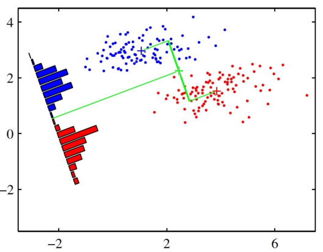
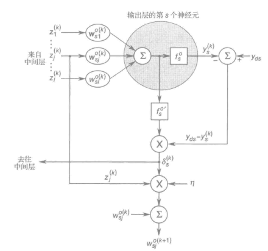
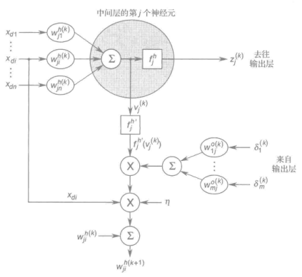
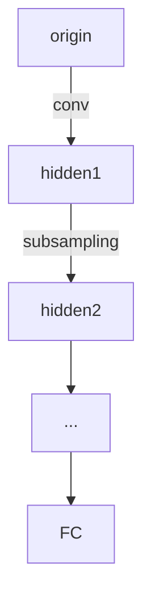

# 机器学习

- 考勤 + 作业
- 中作业
- 大作业

---

## 数学基础

### 概率论

事件 A 与事件 B 独立，等价于：

$$
P(A \wedge B) = P(A) \cdot P(B)
$$

事件通常相互依赖，给定中间变量，他们可能条件独立：

$$
P(A \perp B|C) = P(A, B | C) = P(A | C) \cdot P(B | C)
$$

---

- 概率质量函数
- 概率密度函数
- 累积分布函数

联合概率密度的乘积规则

$$
P(X_{1:D}) = p(x_{1}) p(x_{2}|x_{1}) p(x_{3}|x_{1}, x_{2}) \cdots p(x_{D}|x_{1}, ,x_{2} ,\cdots ,x_{D-1})
$$

---

逻辑函数 Sigmoid：将变量映射成概率。例如对二进制预测值 $y \in \{0, 1\}$ 的概率估计：

$$
\begin{aligned}
p(y|\boldsymbol{x}, \boldsymbol{\theta}) &= \mathrm{Ber}\{y, \sigma[f(\boldsymbol{x}, \boldsymbol{\theta})]\}\\
\mathrm{Ber}(y, p) &:= \begin{cases}
p && y=1 \\
1-p && y=0
\end{cases} \\
\sigma &: \mathbb{R} \rightarrow [0, 1] \\
\sigma(x) &= \frac{1}{1+e^{-x}}
\end{aligned}
$$

Sigmoid properties:

$$
\begin{aligned}
\sigma(-x) &= 1 - \sigma(x) \\
\sigma'(x) &= \sigma(x) [1 - \sigma(x)] \\
\mathrm{logit}(p) &:= \sigma^{-1}(x) = \ln \left( \frac{p}{1-p} \right) \\
\mathrm{softplus}(x) &:= \sigma_{+}(x)\\
&= \int_{-\infty}^{x} \sigma(\xi) \mathrm{\xi} \\
&= \int_{-\infty}^{x} \frac{e^{x} \mathrm{d} x}{1 + e^{x}} \\
&= \ln (1 + e^{x})
\end{aligned}
$$

---

Gaussian 分布对异常值敏感。t 分布具有更好的抗干扰性。

$$
f_{T}(t) = \frac{\Gamma\left(\frac{n+1}{2}\right)}{\sqrt{n \pi} \Gamma \left( \frac{n}{2} \right)} \left( 1 + \frac{t^{2}}{n} \right)^{- \frac{n+1}{2}}
$$

---

Beta distribution

$$
\begin{aligned}
f_{X}(x) &= \frac{x^{\alpha - 1} (1 - x)^{\beta - 1}}{B(\alpha, \beta)} \\
B (\alpha, \beta) &= \frac{\Gamma(\alpha)\Gamma(\beta)}{\Gamma(\alpha + \beta)} \\
\Gamma(\alpha) &= \int_{0}^{\infty} x^{\alpha-1} e^{-x} \mathrm{d} x
\end{aligned}
$$

$B(\alpha, \beta)$ 是概率归一化因子，考虑物理意义时可以忽略。

Beta distribution 对概率建模，衡量概率的概率。因此自变量 $\in [0, 1]$. Beta distribution 来源于二项分布。对于某一个概率标准 $p$，二项分布计算在这个标准下做试验的结果的分布，Beta distribution 计算根据实验结果反推 $p$ 的分布 $P(p)$

例如来自[【统计学进阶知识（一）】深入理解Beta分布：从定义到公式推导 - 知乎](https://zhuanlan.zhihu.com/p/69606875)的例子：向 $[0,1]$ 数轴上抛一个红球（均匀分布）坐标为 $X$，再独立地抛 $n$ 个白球。在红球左侧的白球数量 $K$ 满足二项分布。

$$
\begin{aligned}
P(K = k|X = x) &= \binom{k}{n} x^{k} (1-x)^{n-k}
\end{aligned}
$$

根据 Bayes 定理：

$$
\begin{aligned}
P(X = x|K = k) &= \frac{P(X = x)P(K = k|X = x)}{P(K = k)} \\
p_{X|K}(x|k) &= p_{X}(x) \cdot \frac{\binom{k}{n}x^{k} (1-x)^{n-k}}{\int_{0}^{1} \binom{k}{n}x^{k}(1-x)^{n-k} \mathrm{d} x} \\
&= \frac{x^{k}(1-x)^{n-k}}{\int_{0}^{1} x^{k}(1-x)^{n-k} \mathrm{d}x}
\end{aligned}
$$

可以看出已经初具 Beta distribution 雏形了。省略后续数学推导。

从粗略理解的角度，Beta distribution 的两个参数 $\alpha, \beta$ 可以看作试验成功和失败的次数（加一？）。

---

协方差

$$
\begin{aligned}
\mathrm{Cov} (X, Y) &= E[(X - E(X))(Y - E(Y))] \\
&= E(XY) - E(X)E(Y)
\end{aligned}
$$

$$
\begin{aligned}
\boldsymbol{x} &= \begin{bmatrix}x_{1} & x_{2} & \cdots & x_{D} \end{bmatrix}^{T} \in \mathbb{R}^{D} \\
\Sigma &= \mathrm{Cov} (\boldsymbol{x})\\
&= E\{[\boldsymbol{x} - \mu(\boldsymbol{x})] \left[ \boldsymbol{x} - \mu(\boldsymbol{x}) \right]^{T}\} \\
&= \begin{bmatrix}
D(x_{1}) & \mathrm{Cov}(x_{1}, x_{2}) & \cdots & \mathrm{Cov}(x_{1}, x_{D}) \\
\mathrm{Cov}(x_{2}, x_{1}) & D(x_{2}) & \cdots & \mathrm{Cov}(x_{2}, x_{D}) \\
\vdots  & \vdots & \ddots & \vdots\\
\mathrm{Cov}(x_{D}, x_{1}) & \mathrm{Cov}(x_{D}, x_{2}) & \cdots  & D(x_{D})
\end{bmatrix}
\end{aligned}
$$

$$
\begin{aligned}
\Sigma &= E(\boldsymbol{x} \boldsymbol{x}^{T}) - \boldsymbol{\mu} \boldsymbol{\mu}^{T} \\
\mathrm{Cov}(\boldsymbol{A} \boldsymbol{x} + \boldsymbol{b}) &= \boldsymbol{A} \boldsymbol{\mu} + \boldsymbol{b}\\
\mathrm{Cov}(\boldsymbol{x}, \boldsymbol{y}) &:= E \left[ (\boldsymbol{x} - E(\boldsymbol{x})) (\boldsymbol{y} - E(\boldsymbol{y})^{T}) \right]
\end{aligned}
$$

---

$$
\begin{aligned}
\rho(x, y) &= \frac{\mathrm{Cov}(x, y)}{\sqrt{D(x)D(y)}} \\
\boldsymbol{\rho}(\boldsymbol{x}) &= \begin{bmatrix}
\frac{1}{\sigma_{1}} & \cdots & 0 \\
\vdots & \ddots & \vdots \\
0 & \cdots & \frac{1}{\sigma_{n}}
\end{bmatrix}
\Sigma
\begin{bmatrix}
\frac{1}{\sigma_{1}} & \cdots & 0 \\
\vdots & \ddots & \vdots \\
0 & \cdots & \frac{1}{\sigma_{n}}
\end{bmatrix}
\end{aligned}
$$

相关性：独立一定不相关，不相关不一定独立。相关性也不能反应因果关系。

---

多维高斯分布

$$
N(\boldsymbol{x}|\boldsymbol{\mu}, \Sigma) = \frac{1}{(2\pi)^{\frac{D}{2}} \Vert \Sigma \Vert^{\frac{1}{2}}} e^{- \frac{1}{2} (\boldsymbol{x} - \boldsymbol{\mu})^{T} \Sigma^{-1} (\boldsymbol{x} - \boldsymbol{\mu})}
$$

比如以二维分布为例：

$$
\begin{aligned}
\Sigma &= \begin{bmatrix}
\sigma_{1}^{2} & \rho \sigma_{1} \sigma_{2}\\
\rho \sigma_{1} \sigma_{2} & \sigma_{2}^{2}
\end{bmatrix} \\
\Sigma^{-1} &= \frac{1}{(1-\rho^{2})\sigma_{1}^{2} \sigma_{2}^{2}} \begin{bmatrix}
\sigma_{2}^{2} & -\rho \sigma_{1} \sigma_{2}\\
-\rho \sigma_{1} \sigma_{2} & \sigma_{1}^{2}
\end{bmatrix} \\
\Vert \Sigma \Vert &= (1 - \rho^{2}) \sigma_{1}^{2} \sigma_{2}^{2} \\
P(x) &= \frac{1}{2\pi \sqrt{(1-\rho^{2})}\sigma_{1} \sigma_{2}} \mathrm{exp}\left[ - \frac{1}{2} \begin{bmatrix}x_{1} - \mu_{1} & x_{2} - \mu_{2}\end{bmatrix}  \Sigma^{-1} \begin{bmatrix}x_{1} - \mu_{1} \\ x_{2} - \mu_{2} \end{bmatrix}\right] \\
&= \frac{1}{2\pi \sqrt{(1-\rho^{2})}\sigma_{1} \sigma_{2}} \mathrm{exp}\\
&\left[ - \frac{1}{(1-\rho^{2})\sigma_{1}^{2} \sigma_{2}^{2}} \left( \frac{1}{2} \sigma_{2}^{2} (x_{1} - \mu_{1})^{2} - \rho \sigma_{1} \sigma_{2} (x_{1} - \mu_{1})(x_{2} - \mu_{2}) + \frac{1}{2} \sigma_{1}^{2}(x_{2} - \mu_{2})^{2} \right) \right] \\
&= \frac{1}{2\pi \sqrt{(1-\rho^{2})}\sigma_{1} \sigma_{2}} \mathrm{exp}\\
&\left[ - \frac{1}{1-\rho^{2}} \left( \frac{1}{2} \left( \frac{x_{1}-\mu_{1}}{\sigma_{1}} \right)^{2} - \frac{\rho}{\sigma_{1}\sigma_{2}} (x_{1} - \mu_{1})(x_{2} - \mu_{2}) + \frac{1}{2} \left( \frac{x_{2}-\mu_{2}}{\sigma_{2}} \right)^{2} \right) \right] \\
\end{aligned}
$$

如果相关，则概率包络为斜椭圆；如果不相关，概率包络为正椭圆。

---

极大似然估计

$$
\begin{aligned}
\hat{\theta} &= \mathrm{argmax}_{\theta} P(D|\theta) \\
&= \mathrm{argmax}_{\theta} \prod_{i=1}^{n} p(y_{i}|x_{i}, \theta) \\
&= \mathrm{argmin}_{\theta} - \sum_{i=1}^{n} \log p(y_{i}|x_{i}, \theta)
\end{aligned}
$$

可以通过求导得到 $\hat{\theta}$.

---

以 Gaussian 分布为例：

$$
\begin{aligned}
L(\mu, \sigma) &= \ln \prod_{i=1}^{n} \frac{1}{\sqrt{2\pi}\sigma} e^{- \dfrac{(y_{n}-\mu)^{2}}{2\sigma^{2}}}  \\
&= \sum_{i=1}^{n} \left[ \ln \left( \frac{1}{\sqrt{2\pi}\sigma} \right) - \frac{(y_{n} - \mu)^{2}}{2\sigma^{2}} \right] \\
&= -n \ln \sigma - \frac{1}{2\sigma^{2}} \sum_{i=1}^{n} (y_{n} - \mu)^{2} - \frac{n}{2} \ln 2\pi \\
\frac{\partial L}{\partial \mu} &= 0 \\
0 &= - \frac{1}{2\sigma^{2}} \sum_{i=1}^{n} 2(\mu - y_{n}) \\
\hat{\mu} &= \frac{1}{n} \sum_{i=1}^{n} y_{n} = \overline{Y} \\
\frac{\partial L}{\partial \sigma} &= 0 \\
0 &= - \frac{n}{\sigma} + \frac{1}{\sigma^{3}} \sum_{i=1}^{n} (y_{n} - \mu)^{2} \\
\sigma &= \sqrt{\frac{1}{n} \sum_{i=1}^{n}(y_{n} - \mu)^{2}} = S_{n}
\end{aligned}
$$

---

正则化

由于经验分布和真实分布不同（例如抛硬币可能出现多次正面的情况），因此在 Lagrange 函数中增加惩罚项 $\lambda C(\theta)$。$\lambda$ 衡量了惩罚项和损失函数的权重。惩罚项可以用先验概率确定。

$$
\begin{aligned}
L(\theta, \lambda) &= \left[ \frac{1}{N} \sum_{i=1}^{n} l(y_{i} | \theta, x_{i}) \right] + \lambda C(\theta) \\
C(\theta) &= -log(p(\theta))\\
\lambda &= 1 \\
L(\theta, \lambda) &= - \left[ \log p(D|\theta) + \log p(\theta) \right]
\end{aligned}
$$

如果不加正则项，会导致过拟合问题（参数和已有数据一致，导致泛化性能过低）；如果正则项太大，会导致欠拟合问题。

---

数据较少时避免过拟合的方法：

- k 折交叉验证
- 提前停止
- 找更多数据

---

### 信息论

数据的随机性越大，包含的信息越多，信息熵越大。但是信息熵越小，数据中越可能有“模式”。

$$
\begin{aligned}
H(X) &= - \sum_{i=1}^{n} p(X = x_{i}) \log p(X = x_{i}) \\
H(X) &= - \int_{X} f(x) \log f(x) \mathrm{d} x
\end{aligned}
$$

对于一个系统，熵越大，越稳定。

$$
\frac{\partial H}{\partial \theta} = 0
$$

---

交叉熵：常用于学习的 loss 函数。

$$
H(p, q) = - \sum_{k=1}^{N} p_{k} \log q_{k}
$$

联合熵：联合分布的熵。

条件熵：条件概率的熵。

$$
\begin{aligned}
H(Y|X) &= - \sum_{x, y} p(x,y) \log p(y|x) \\
&= -\sum_{x, y} p(x, y) \log p(x, y) + \sum_{x} p(x) \log p(x) \\
&= H(X, Y) - H(X)
\end{aligned}
$$

---

在计算连续随机变量的微分熵时，由于积分难以计算，可以转化成直方图以后离散化，计算离散信息熵。

---

如何计算两个分布之间的“距离”？

KL 散度：表征两个概率分布之间的相似性。KL 散度具有非负性。

互信息：衡量两个随机变量之间的依赖程度。

---

### 线性代数

张量

- 向量：一维张量
- 矩阵：二维张量
- 更高维：多维张量

范数

- 非负性
- 确定性，当且仅当等于 0 时范数等于 0.
- 标量积线性
- 三角不等式

2-norm

$$
\Vert X \Vert = \sqrt{\sum x_{ij}^{2}}
$$

1-norm

$$
\Vert X \Vert = \sum |x_{ij}|
$$

trace of matrix

$$
\begin{aligned}
\mathrm{tr}(ABC) &= \mathrm{tr}(BCA) = \mathrm{tr}(CAB)\\
\boldsymbol{x}^{T} A \boldsymbol{x} &= \mathrm{tr} (\boldsymbol{x} \boldsymbol{x}^{T} A) = \mathrm{tr} (A \boldsymbol{x} \boldsymbol{x}^{T})
\end{aligned}
$$

图论中的邻接矩阵：用邻接矩阵左乘一个状态向量可以得到随机游走的下一状态。

---

## 线性模型

$$
f(\boldsymbol{x}) = \boldsymbol{w}^{T} \boldsymbol{x} + b
$$

---

### 最小二乘法

构造

$$
\begin{aligned}
\hat{\boldsymbol{w}} &= \begin{bmatrix} \boldsymbol{w} \\ b \end{bmatrix} \\
\boldsymbol{X} &= \begin{bmatrix}
\boldsymbol{x}_{1}^{T} & 1 \\
\boldsymbol{x}_{2}^{T} & 1 \\
\vdots & \vdots \\
\boldsymbol{x}_{n}^{T} & 1
\end{bmatrix}
\end{aligned}
$$

将一维的最小二乘法扩展至多维，即：

$$
\begin{aligned}
&\text{minimize} && (\boldsymbol{y} - \boldsymbol{X} \hat{\boldsymbol{w}})^{T} (\boldsymbol{y} - \boldsymbol{X} \hat{\boldsymbol{w}}) \\
&\text{subject to} && \hat{\boldsymbol{w}} \\
&\Rightarrow && \hat{\boldsymbol{w}} = (\boldsymbol{X}^{T} \boldsymbol{X})^{-1} \boldsymbol{X}^{T} \boldsymbol{y}
\end{aligned}
$$

前提是 $\boldsymbol{X}$ 列满秩，$(\boldsymbol{X}^{T} \boldsymbol{X})$ 可逆。或者 $(\boldsymbol{X}^{T} \boldsymbol{X})$ 正定。这三个条件等价。

---

> [!tip] 补充：为什么 $\boldsymbol{A}^{T}\boldsymbol{A}$ 一定正定？

$$
\begin{aligned}
\boldsymbol{x}^{T} \boldsymbol{A}^{T} \boldsymbol{A} \boldsymbol{x} &= \Vert \boldsymbol{A} \boldsymbol{x} \Vert^{2} \geq 0 \\
\mathrm{rank} \boldsymbol{A} = n &\Rightarrow \mathrm{dim} \mathrm{Nul} \boldsymbol{A} = 0 \\
\end{aligned}
$$

$\boldsymbol{A}^{T} \boldsymbol{A}$ 半正定；当 $\boldsymbol{A}$ 列满秩时，矩阵正定。

---

> [!help] 如果 $\boldsymbol{X}$ 不能列满秩怎么办？
> 
> 比如常见的情形，输入的数据有很多个属性（$n$），但是样例（$m < n$）甚至还没有属性多。这样的矩阵 $\boldsymbol{X}$ 一定不可能列满秩。

方法：添加正则化项。

- Ridge Regression $L(\boldsymbol{w}, \lambda_{2}) = \Vert \boldsymbol{y} - \boldsymbol{X} \boldsymbol{w} \Vert^{2} + \lambda_{2} \Vert \boldsymbol{w} \Vert_{2}^{2}$
- Lasso Regression $L(\boldsymbol{w}, \lambda_{1}) = \Vert \boldsymbol{y} - \boldsymbol{X} \boldsymbol{w} \Vert^{2} + \lambda_{1} \Vert \boldsymbol{w} \Vert_{1}$
- Elastic Net $L(\boldsymbol{w}, \lambda_{1}, \lambda_{2}) = \Vert \boldsymbol{y} - \boldsymbol{X} \boldsymbol{w} \Vert^{2} + \lambda_{1} \Vert \boldsymbol{w} \Vert_{1} + \lambda_{2} \Vert \boldsymbol{w} \Vert_{2}^{2}$

$$
\begin{aligned}
\Vert \boldsymbol{w} \Vert_{i} &= \sqrt[i]{\left( \sum_{j=1}^{n} w_{j}^{i} \right)} \\
\Vert \boldsymbol{w} \Vert_{1} &= \sum_{j=1}^{n} |w_{j}| \\
\Vert \boldsymbol{w} \Vert_{0} &= \sum_{j=1}^{n} \mathscr{I} (w_{j} \neq 0)
\end{aligned}
$$

相比 Ridge 回归，Lasso 回归可以让更多的 $w_{j}$ 变成 0，让等式更简洁。组合了两种回归方式的 Elastic Net 效果有时最佳。

正则化本质上是在防止过拟合，调整正则化的参数以防止参数过大欠拟合。

---

最小二乘法和极大似然法本质上相通。

取正态分布

$$
\begin{aligned}
p(y_{i}|\boldsymbol{x}_{i}, \theta) &= \frac{1}{\sqrt{2\pi}\sigma} e^{-\dfrac{(y_{i} - \boldsymbol{w}^{T} \boldsymbol{x} - b)^{2}}{2\sigma^{2}}} \\
L(\theta) &= - \sum_{i=1}^{m} \log p(y_{i}|x_{i}, \theta) \\
&= C_{1} \sum_{i=1}^{m} \frac{1}{2} (y_{i} - \boldsymbol{w}^{T} \boldsymbol{x} - \boldsymbol{b})^{2} + C_{2}
\end{aligned}
$$

最小化似然函数等价于最小化乘方和的值。

由于似然函数和最小二乘为线性关系，因此上面的正则化和[数学基础](#概率论)一章中的正则化是一种东西。

---

非线性拟合：转换为线性问题

$$
\begin{aligned}
g(y) &= \boldsymbol{w}^{T} \boldsymbol{x} + b \\
y &= g^{-1}\left( \boldsymbol{w}^{T} \boldsymbol{x} + b \right)
\end{aligned}
$$

$g(\cdot)$ 连续且充分光滑。

---

### 对数几率回归

所谓对数几率，就是指上面非线性拟合的一种 $g(\cdot)$

$$
g(p) = \log \left( \frac{p}{1-p} \right)
$$

对于一个二分类问题，$p = p(y = 1)$，$1 - p = p(y=0)$. 两个概率的比叫做几率，取对数值为对数几率。假设对数几率和输入成线性关系。

$$
p = g^{-1} (\boldsymbol{w}^{T} \boldsymbol{x} + b) = \frac{1}{1+e^{-(\boldsymbol{w}^{T} \boldsymbol{x} + b)}}
$$

---

$$
\begin{aligned}
\beta &:= \begin{bmatrix} \boldsymbol{w} \\ b \end{bmatrix} \\
\hat{\boldsymbol{x}} &:= \begin{bmatrix} \boldsymbol{x} \\ 1 \end{bmatrix} \\
p(y_{i}|\boldsymbol{x}_{i}, \beta) &= p_{1}(x_{i}, \beta)^{y_{i}} p_{0}(x_{i}, \beta)^{1-y_{i}} \\
l(\beta) &= - \sum_{i=1}^{n} \ln p(y_{i}|x_{i}, \beta) \\
&= - \sum_{i=1}^{n} [ y_{i} \ln p_{1}(x_{i}, \beta) + (1 - y_{i}) \ln p_{0}(x_{i}, \beta) ] \\
\frac{\partial l}{\partial \beta} &= - \sum_{i=1}^{n} \left( \frac{y_{i}}{p_{1}(x_{i},\beta)} \frac{\partial p_{1}}{\partial \beta} - \frac{1 - y_{i}}{p_{0}(x_{i}, \beta)} \frac{\partial p_{1}}{\partial \beta} \right) \\
\frac{\partial l}{\partial \beta} = 0 &\Rightarrow \sum_{i=1}^{n} \left(  \frac{y_{i}}{p_{1}(x_{i}, \beta)}- \frac{1-y_{i}}{p_{0}(x_{i},\beta)} \right) = 0
\end{aligned}
$$

---

### 线性判别分析

Linear Discriminant Analysis

二分类问题，两个类别数据均值向量

$$
\begin{aligned}
\boldsymbol{m}_{1} &= \frac{1}{N_{1}} \sum_{x_{i} \in C_{1}} \boldsymbol{x}_{i} \\
\boldsymbol{m}_{2} &= \frac{1}{N_{2}} \sum_{x_{i} \in C_{2}} \boldsymbol{x}_{i} \\
\end{aligned}
$$

找到一个降维方法 $\boldsymbol{w}$

$$
\begin{aligned}
& \text{maximize} && \boldsymbol{w}^{T} (\boldsymbol{m}_{1} - \boldsymbol{m}_{2}) \\
& \text{subject to} && \Vert \boldsymbol{w} \Vert = 1
\end{aligned}
$$

Lagrange 方法

$$
\begin{aligned}
& \text{maximize} && \boldsymbol{w}^{T} (\boldsymbol{m}_{1} - \boldsymbol{m}_{2}) + \lambda (\boldsymbol{w}^{T} \boldsymbol{w} - 1) \\
& && \boldsymbol{w} = k (\boldsymbol{m}_{1} - \boldsymbol{m}_{2})
\end{aligned}
$$

---

但是上面的方法只适合与两个类的协方差为单位阵的整数倍的情况（即分布类似为圆形），作为一种修正，考虑类内的方差。

$$
\begin{aligned}
& \text{maximize} && | \boldsymbol{w}^{T} (\boldsymbol{m}_{1} - \boldsymbol{m}_{2}) | \\
& \text{or maximize} && \boldsymbol{w}^{T} (\boldsymbol{m}_{1} - \boldsymbol{m}_{2}) (\boldsymbol{m}_{1} - \boldsymbol{m}_{2})^{T} \boldsymbol{w} \\
& \text{subject to} && \boldsymbol{w}^{T} (\Sigma_{1} + \Sigma_{2}) \boldsymbol{w} = 1
\end{aligned}
$$

保证两个类的投影相聚较远的同时保证类内较为聚拢。



同样使用 Lagrange 方法求解。

- Between class covariance matrix $S_{B} = (\boldsymbol{m}_{1} - \boldsymbol{m}_{2}) (\boldsymbol{m}_{1} - \boldsymbol{m}_{2})^{T}$ 
- Within class covariance matrix $S_{w} = \Sigma_{1} + \Sigma_{2}$

$$
\begin{aligned}
L(\boldsymbol{w}) &= -\boldsymbol{w}^{T} S_{B} \boldsymbol{w} + \lambda ( \boldsymbol{w}^{T} S_{w} \boldsymbol{w} - 1) \\
\lambda S_{w} \boldsymbol{w} &= S_{b} \boldsymbol{w} = k (\boldsymbol{m}_{1} - \boldsymbol{m}_{2}) \\
\boldsymbol{w} &= k S_{w}^{-1} (\boldsymbol{m}_{1} - \boldsymbol{m}_{2})
\end{aligned}
$$

---

多分类 LDA

---

## 支持向量机

### 基本模型

> [!info] 一句话概括：找一个**超平面**将两类点分开，分得**越开越好**。

用数学语言表达，数据表示为 $\left\{ (\boldsymbol{x}_{i}, y_{i}): \boldsymbol{x}_{i} \in \mathbb{R}^{n}, y_{i} = \pm 1 \right\}$，$\boldsymbol{x}_{i}$ 表示输入 feature，$y_{i}$ 表征了类别。

分开表征了约束条件，分得越开越好表征了目标函数。

$$
\begin{aligned}
& \text{max}_{\boldsymbol{w}, b} && \text{min}_{i} \left(y_{i} \frac{\boldsymbol{w}^{T} \boldsymbol{x}_{i} + b}{\Vert \boldsymbol{w} \Vert}\right) \\
& \text{s.t.} && y_{i} (\boldsymbol{w}^{T} \boldsymbol{x}_{i} + b) \geq 1
\end{aligned}
$$

目标函数的最小化对应支持向量（离超平面距离最小的数据），因此上述问题等价为：

$$
\begin{aligned}
& \text{min} && \frac{1}{2} \boldsymbol{w}^{T} \boldsymbol{w} \\
& \text{s.t.} && y_{i}(\boldsymbol{w}^{T} \boldsymbol{x}_{i} + b) \geq 1
\end{aligned}
$$

---

### 核函数

$$
\kappa(x, x') = \kappa (x', x) \geq 0
$$

SE kernel

$$
\kappa(\boldsymbol{x}, \boldsymbol{x}') = \mathrm{exp} \left( - \frac{1}{2} (\boldsymbol{x} - \boldsymbol{x}') \Sigma^{-1} (\boldsymbol{x} - \boldsymbol{x}') \right)
$$

如果 $\Sigma$ 是对角矩阵

$$
\kappa(\boldsymbol{x}, \boldsymbol{x}') = \mathrm{exp} \left( - \frac{1}{2} \sum_{i=1}^{n} \frac{1}{\sigma_{i}^{2}} (x_{i} - x'_{i})^{2} \right)
$$

各向同性核 RBF kernel

$$
\kappa(\boldsymbol{x}, \boldsymbol{x}') = \mathrm{exp} \left( -\frac{\Vert \boldsymbol{x} - \boldsymbol{x}'\Vert^{2}}{2 \sigma^{2}} \right)
$$

Mercer kernel 正定核

比如

$$
\begin{aligned}
\kappa(\boldsymbol{x}, \boldsymbol{x}') &= (1 + \boldsymbol{x}^{T} \boldsymbol{x})^{2} \\
&= (1 + x_{1}x_{1}' + x_{2}x_{2}')^{2} \\
&= 1 + 2x_{1}x'_{1} + 2 x_{2}x'_{2} + 2x_{1}x_{2}x'_{1}x'_{2} + x_{1}^{2}x_{1}^{'2} + x_{2}^{2} x_{2}^{'2} \\
\boldsymbol{\phi}(\boldsymbol{x}) &= \begin{bmatrix} 1 & \sqrt{2}x_{1} & \sqrt{2}x_{2} & \sqrt{2}x_{1}x_{2} & x_{1}^{2} & x_{2}^{2}\end{bmatrix}^{T} \\
\kappa(\boldsymbol{x}, \boldsymbol{x}') &= \boldsymbol{\phi}^{T} (\boldsymbol{x}) \boldsymbol{\phi}(\boldsymbol{x}')
\end{aligned}
$$

---

## 人工神经网络

Linear score function

$$
f(\boldsymbol{x}) = \boldsymbol{W} \boldsymbol{x}
$$

Nerual Network(2 or 3 layers)

$$
\begin{aligned}
f(x) &= \boldsymbol{W}_{2} \mathrm{max} (0, \boldsymbol{W}_{1}\boldsymbol{x}) \\
f(x) &= \boldsymbol{W}_{3} \mathrm{max} (0, \boldsymbol{W}_{2} \mathrm{max}(0, \boldsymbol{W}_{1}\boldsymbol{x}))
\end{aligned}
$$

Nonlinear fire function:

- ReLU
- Sigmoid
- tanh
- Leaky ReLU
- Maxout $\mathrm{max}(\boldsymbol{w}_{1}^{T} \boldsymbol{x} + \boldsymbol{b}_{1}, \boldsymbol{w}_{2}^{T} \boldsymbol{x} + \boldsymbol{b}_{2})$
- ELU

隐藏层的神经元越多，对训练集的拟合效果越好。相应地，也更容易过拟合。添加正则项 $R(\boldsymbol{W})$

---

### BP 算法

```python
class Layer:
    @staticmethod
    def sigmoid(x):
        return 1/(1 + np.exp(-x))

    def __init__(self, ni: int, no: int, lr: float, isfirst: bool = False):
        self.ni = ni
        self.no = no
        self.lr = lr
        self.isfirst = isfirst
        self.input = np.zeros(ni + 1)
        self.input_grad = np.zeros(ni + 1)
        self.weight = np.random.randn(no, ni + 1)  # b = weight[0]
        self.weight_grad = np.zeros((no, ni + 1))  # b = weight[0]
        self.output = np.zeros(no)
        self.output_grad = np.zeros(no)

    def front(self, input):
        assert input.shape[0] == self.ni
        self.input = np.concatenate(([1], input))
        self.output = self.sigmoid(self.weight @ self.input)
        return self.output

    def back(self, next_grad):
        assert next_grad.shape[0] == self.no
        self.output_grad = next_grad
        self.dsigmoid = self.output * (1 - self.output)
        self.weight_grad = self.input * \
            (self.dsigmoid * self.output_grad).reshape(-1, 1)  # numpy broadcast
        self.weight -= self.lr * self.weight_grad
        if (not self.isfirst):
            self.input_grad = (
                self.weight * (self.dsigmoid * self.output_grad).reshape(-1, 1)).sum(axis=0)
        return self.input_grad[1:]

class MLP:
    @staticmethod
    def loss(pred, data):
        return np.average(1/2*(pred - data)**2)

    def __init__(self, *args, lr:float=0.001) -> None:
        self.layers = []
        for i, n in enumerate(args):
            if (len(args) - 1 == i):
                continue
            self.layers.append(Layer(n, args[i + 1], isfirst=(i == 0), lr=lr))

    def pred(self, input):
        assert input.shape[0] == self.layers[0].ni
        val = input
        for layer in self.layers:
            val = layer.front(val)
        return val

    def train(self, input, output) -> None:
        assert output.shape[0] == self.layers[-1].no
        val = self.pred(input)
        grad = val - output
        l = self.loss(val, output)
        for layer in self.layers[::-1]:
            grad = layer.back(grad)
        return l
```

本质上是固定步长梯度下降法。对所有的权重参数和偏置参数求取最优解。

 

### 卷积神经网络



---

## 贝叶斯分类器

- 判别式模型：直接根据数据 $\boldsymbol{x}$ 建模得到 $P(c|\boldsymbol{x})$
- 生成式模型：根据联合概率分布 $P(c, \boldsymbol{x})$ 建模得到 $P(c|\boldsymbol{x})$

$$
P(c|\boldsymbol{x}) = \frac{P(c) P(\boldsymbol{x}|c)}{P(\boldsymbol{x})}
$$

---

## 聚类

### 问题描述

- Dataset: $D = \left\{ \boldsymbol{x}_{1}, \cdots, \boldsymbol{x}_{m} \right\}, \boldsymbol{x}_{i} = \begin{bmatrix}\boldsymbol{x}_{i1} & \cdots & \boldsymbol{x}_{in}\end{bmatrix}^{T}$
- Cluster: $\left\{ C_{l}: l = 1, 2, \cdots, k \right\}, C_{l} \cap C_{l'} = \varnothing$
- Result: $\boldsymbol{\lambda} = \begin{bmatrix}\lambda_{1} & \cdots &  \lambda_{m}\end{bmatrix}^{T}, (\lambda_{i} = 1, 2, \cdots, k)$

---

### 性能度量

- 自定义模型划分：$C$
- 标准模型划分：$C^{*}$

$$
\begin{aligned}
a &= \left| SS \right|, SS = \left\{ (\boldsymbol{x}_{i}, \boldsymbol{x}_{j}): \lambda_{i} = \lambda_{j}, \lambda^{*}_{i} = \lambda^{*}_{j} \right\} \\
b &= \left| SD \right|, SD = \left\{ (\boldsymbol{x}_{i}, \boldsymbol{x}_{j}): \lambda_{i} = \lambda_{j}, \lambda^{*}_{i} \neq \lambda^{*}_{j} \right\} \\
c &= \left| DS \right|, DS = \left\{ (\boldsymbol{x}_{i}, \boldsymbol{x}_{j}): \lambda_{i} \neq \lambda_{j}, \lambda^{*}_{i} = \lambda^{*}_{j} \right\} \\
d &= \left| DD \right|, DD = \left\{ (\boldsymbol{x}_{i}, \boldsymbol{x}_{j}): \lambda_{i} \neq \lambda_{j}, \lambda^{*}_{i} \neq \lambda^{*}_{j} \right\} \\
\end{aligned}
$$

类似监督学习中的“查准率”、“查全率”。

---

- Jaccard Coefficient $JC = \dfrac{a}{a+b+c}$
- FMI(Fowlkes and Mallows Index) $FMI = \sqrt{\dfrac{a}{a+b} \cdot \dfrac{a}{a+c}}$
- Rand Index $RI = \dfrac{a+d}{\binom{m}{2}}$

---

- DBI(Davies-Bouldin Index)

$$
DBI = \frac{1}{k} \sum_{i=1}^{k} \mathrm{max}_{j \neq i} \left( \frac{\mathrm{avg}(C_{i}) + \mathrm{avg}(C_{j})}{\mathrm{dist}(\mu_{i}, \mu_{j})} \right)
$$

其中，簇内样本间的平均距离

$$
\mathrm{avg}(C_{i}) = \frac{\sum_{1\leq i \leq j \leq \left| C \right|} \mathrm{dist} (\boldsymbol{x}_{i}, \boldsymbol{x}_{j})}{\binom{\left| C \right|}{2}}
$$

- DI(Dunn Index)

$$
DI = \mathrm{min}_{1 \leq i \leq k} \left[ \mathrm{min_{j \neq i} \left( \frac{d_{min} (C_{i}, C_{j})}{\mathrm{max}_{1 \leq l \leq k} \mathrm{diam} (C_{l})} \right)} \right]
$$

其中，$d_{min}$ 为簇 $C_{i}, C_{j}$ 最近的样本距离，$\mathrm{diam} (C_{l})$ 为样本内最远距离。

---

### 距离度量

对于连续属性，可直接使用 $p$ norm.

$$
\Vert \boldsymbol{x} \Vert_{p} = \left( \sum x_{i}^{p} \right)^{\frac{1}{p}}
$$

对于离散属性：

- 有序属性，例如图片像素亮度，可以直接使用 $p$ norm.
- 无序属性，例如类别，定义 VDM(Value Difference Metric)

---

### 原型聚类算法

k-means

$$
E = \sum_{i=1}^{k} \sum_{\boldsymbol{x} \in C_{i}} \Vert \boldsymbol{x} - \boldsymbol{\mu}_{i} \Vert_{2}^{2}
$$
