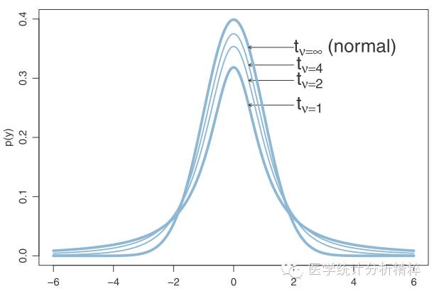

# 概率论与数理统计

微信群

## 第一章 随机事件和概率

### 随机试验

- 可以在相同的条件下重复地进行
- 所有可能结果在试验前已知且不止一个
- 结果不能确定

### 样本空间

每一个可能出现的结果成为样本点，记作 $\omega$，所有样本点的集合称为样本空间，记作 $\Omega$.

### 随机事件

样本空间的子集，用大写字母表示，仅含一个基本点的随机事件为**基本事件**。

$\Omega$ 为必然事件，$\phi$ 为不可能事件。

关系：

1. 包含关系。事件 A 的发生必然导致 B 的发生。$A \subset B,\ A\neq \phi$
2. 相等关系。互相包含
3. 和事件。当且仅当事件 A 和事件 B 中至少有一个发生时，和事件发生。$A \cup B = \{\omega : \omega \in A \ or \ \omega \in B\}$
4. 交事件。当且仅当事件 A 和事件 B 中同时发生时，交事件发生。$AB = A \cap B = \{\omega : \omega \in A \ and \ \omega \in B\}$
5. 差事件。$A - B = \{\omega : \omega \in A \ and \ \omega \notin B\}$
6. 互不相容事件（互斥）。$A \cap B = \phi$. 任意一组基本事件总是两两互不相容。
7. 对立事件。$\bar{A}=\Omega -A,\ A-B=A\bar{B}$.

$$
AB \subset A \subset A \cup B
$$

### 随机事件关系规律

1. 交换律

2. 结合律

3. 分配律

   $A \cup (BC)=(A \cup B)(A \cup C)$

   $A(B \cup C)=(AB) \cup (AC)$

4. 德摩根法则 $\overline{A \cup B}=\overline{A} \cap \overline{B}, \ \overline{A \cap B}=\overline{A} \cup \overline{B}$

### 等可能概型

基本事件发生的可能性均等。

#### 一、古典概型

1. 实验样本空间是一个有限集合
2. 每一个样本点再一次实验中以**相等的可能性**出现

$$
\begin{aligned}
\Omega &= \{\omega_1, \cdots, \omega_n\} \\
P(\omega_1) &= \cdots = P(\omega_n) \\
P(A) &= \frac{n_A}{n}
\end{aligned}
$$

计数方法：

1. 有放回的抽取 $P_n(r)=n^r$
2. 不放回的抽取 $P_n(r)=\frac{n!}{(n-r)!}$
3. 不放回的抽取且不考虑顺序 $P_n(r)=\binom{n}{r}=\frac{n!}{r!(n-r)!}$

#### 二、几何概型

样本空间是某一个空间区域。

$$
P(A) = \frac{m(A)}{m(\Omega)}
$$

m 表示广义体积。

贝特朗奇论（Bertrand Paradox）

### 用频率估计概率

$$
P(A) = \lim_{n\rightarrow \infty}\frac{n_A}{n}
$$

作为概率的统计定义。

### 概率的公理化定义与性质

不同的模型的三条性质：

1. 非负性 $P(A) > 0$
2. 规范性 $P(\Omega) =1$
3. 可列可加性 $A_1,A_2,\cdots \text{两两互不相容， }\ P(\cup_{i=1}A_i) = \sum_{i=1}P(A_i)$

满足上面三条公理，则称 $P(A)$ 为概率。

一条值得注意的性质：

$$
\text{when } A \subset B,\ P(A) \leq P(B)
$$

注意，上面的性质：

1. 逆定理不成立（比较显然）
2. 小于等于号的等号不可删去，即使 ***A*** 是 ***B*** 的真子集。

**因为在几何概型中，有可能出现删去一个或无穷个样本点以后，概率仍然不变的情况。**

例题：

$$
\begin{aligned}
&P(A) = 0.3 \ P(B) = 0.4 \ P(\bar{A}C) = 0.25 \ P(AB) = 0 \ P(BC) = 0.2 \\
&\text{Get: } P(\bar{ABC})
\end{aligned}
$$

$$
\begin{align*}
&P(\bar{A}\bar{B}\bar{C})=1-P(A)-P(B)-P(C)+P(AB)+P(AC)+P(BC)-P(ABC)\\
&=1-P(A)-P(B)-[P(C)-P(AC)]+P(AB)+P(BC)-P(ABC)\\
&=1-P(A)-P(B)-P(\bar{A}C)+P(AB)+P(BC)-P(ABC)\\
&0 \leq P(ABC) \leq P(AB) =0 \ \Rightarrow P(ABC)=0\\
&P(\bar{A}\bar{B}\bar{C})=1-P(A)-P(B)-P(\bar{A}C)+P(AB)+P(BC)\\
&=1-0.3-0.4-0.25+0+0.2\\
&=0.25
\end{align*}
$$

### 条件概率

已知 ***B*** 发生的条件下 ***A*** 发生的概率

$$
P(A|B) = \frac{P(AB)}{P(B)}
$$

布里耶摸球模型

坛子中有 b 只黑球及 r 只红球，随机取一只，把原球放回，并加进与抽出球同色的球 c 只。再摸第二次，这样下去一共摸了 n 次，问前面的 $n_1$ 次出现黑球，后面的 $n_2 = n - n_1$ 次出现红球的概率是多少？

最后的概率只与摸出的球各有多少个有关，与具体的顺序无关。

### 独立事件

定义（两个事件独立）：

$$
P(AB) = P(A) P(B)
$$

定义（三个事件**相互**独立）：

$$
\begin{align*}
&P(AB) = P(A) P(B) \\
&P(BC) = P(B) P(C) \\
&P(AC) = P(A) P(C) \\
&P(ABC) = P(A) P(B) P(C)
\end{align*}
$$

注意第四个等式的成立并不建立在前三个等式成立的基础上。对于前三个等式成立而第四个等式不成立的情况，称作三个时间**两两独立**。

同理，多个事件独立需要相似的 $2^n-n-1$ 个等式。

定理：如果两个事件独立，则它们的互斥、他们与互斥事件之间也独立。

### 贝努利实验与二项分布

在一个实验中，只关心某个事件 ***A*** 是否发生。***n*** 次独立重复实验。

$$
P_n(k) = \binom{n}{k} p^k (1-p)^{n-k}
$$

### 全概率公式

完备实验组（样本空间的一个划分）

- ***n*** 个事件两两互不相容
- $A_1 \cup A_2 \cup \cdots \cup A_n = \Omega$

全概率公式

$$
P(B) = \sum_{i=1}^n P(A_i) P(B|A_i)
$$

### 贝叶斯公式

$$
P(A_i|B) = \frac {P(A_i) P(B|A_i)}{\sum_{i=1}^n P(A_i) P(B|A_i)}
$$

### 第一章例题

- 已知 $P(A)=0.5$，$P(B)=0.4$，$P(A|\overline{B})=0.6$，求 $P(AB)$，$P(A|A \cup \overline{B})$。

0.14，25/37

## 第二章 离散型随机变量及其分布

### 随机变量

给定一个随机事件：

$$
\forall \omega \in \Omega, \exists X=X(\omega)
$$

***X*** 为单值实值函数。定义为一维随机变量。

离散型随机变量：随机变量只能取有限个或可列无限个值。

### 概率函数

$$
p_i = P(X=a_i) \\
$$

满足：

$$
p_i \geq 0 \\
\sum_i p_i = 1
$$

用表格表示的概率函数：分布列。

### 常用离散型随机变量

$$
\begin{align*}
&X \sim B(n,p) \\
&P(X=k) = \binom{n}{k} p^k (1-p)^{n-k} \\
&X = 0, 1, 2, \cdots, n \\
\\
&X \sim G(p) \\
&P(X=k) = p (1-p)^{k-1} \\
&X = 1, 2, \cdots, \infty \\
\\
&X \sim H(N,M,n) \\
&P(X=k) = \frac{\binom{M}{k}\binom{N-M}{n-k}}{\binom{N}{n}} \\
&\max(0, n+M-N) \leq k \leq \min(n,M) \\
\\
&X \sim P(\lambda) \ \lambda > 0 \\
&P(X=k) = \frac{\lambda ^k}{k!} e^{-\lambda} \\
&X = 0, 1, 2, \cdots, \infty
\end{align*}
$$

泊松分布中，$\lambda$ 表示数学期望。

关于泊松分布和伯努利分布的统一性，可由泊松定理得证：

$$
\lim _{n \rightarrow \infty} \binom{n}{k} p^k (1-p)^{n-k} = e^{-np} \frac{(np)^k}{k!}
$$

事实上，对于泊松分布概率的归一化条件，其证明和指数函数的级数有联系。

$$
\sum_{k=1}^{\infty} e^{-np} \frac{(np)^k}{k!} = e^{-np} \sum_{k=1}^{\infty} \frac{(np)^k}{k!} = e^{-np} e^{np} = 1
$$

### 二维随机变量及其分布

如果每一个样本点都与 n 个有序实数对应，则称之为 n 维随机变量。

对于二维离散型随机变量：记其定义域为 $\Omega$，对于每一个样本点 $\omega$，都有一对有序实数对 $(X, Y) = (X(\omega), Y(\omega))$ 与之对应。

$$
P(\{X = a_i\} \cup \{Y = b_j\}) = P(X = a_i, Y = b_i) = p_{ij}
$$

根据概率的性质：

$$
\begin{aligned}
&p_{ij} > 0 \\
&\sum_i \sum_j p_{ij} = 1
\end{aligned}
$$

边缘概率函数：

$$
\begin{align*}
&p_{i.} = P(X = a_i) = P(\cup_j \{X = a_i, Y = b_j\}) = \sum_j P(X = a_i, Y = b_j) = \sum_j p_{ij} \\
&p_{.j} = P(Y = b_j) = P(\cup_i \{X = a_i, Y = b_j\}) = \sum_i P(X = a_i, Y = b_j) = \sum_i p_{ij}
\end{align*}
$$

### 随机变量的独立性和条件分布

独立性的定义：

$$
\forall (i, j) \in \Omega, \ p_{ij} = p_{i.} \cdot p_{.j}
$$

对于随机变量 $X, Y$ 独立性的充分必要条件：

$$
P(X \in S_1, Y \in S_2) = P(X \in S_1) \times P(Y \in S_2)
$$

## 第三章 连续型随机变量及其分布

### 分布函数

对于随机变量 $X$：

$$
\begin{aligned}
&F(x) = P(X \leq x) \ (-\infty < x < \infty) \\
&P(a < X \leq b) = F(b) - F(a)
\end{aligned}
$$

根据[概率的性质](#概率的公理化定义与性质)，也可以得到分布函数的性质：

- $0 \leq F(x) \leq 1$
- $x_1 < x_2 \Rightarrow F(x_1) \leq F(x_2)$
- $\lim_{x \rightarrow -\infty} F(x) = 0$
- $\lim_{x \rightarrow +\infty} F(x) = 1$
- 右连续：$\lim_{x \rightarrow x_0^+} F(x) = F(x_0)$
- $P(x = x_0) = F(x_0) - \lim_{x \rightarrow x_0^-} F(x)$

随机变量分布函数的线性组合（权重之和为 1）也是随机变量的分布函数。凡是满足上述性质的函数都是随机变量的分布函数。

同理有对二维（乃至多维）的随机变量的分布函数的定义：

$$
\begin{align*}
&F(x, y) = P(X \leq x, Y \leq y) \\
&P(a < X \leq b, c < Y \leq d) = F(b, d) - F(b, c) - F(a, d) + F(a, c)
\end{align*}
$$

二维分布函数的性质：

- $0 \leq F(x, y) \leq 1$
- 固定一个自变量的值，分布函数随另一个自变量单调不减。
- $\lim_{x \rightarrow -\infty}F(x, y) = 0 \ \lim_{y \rightarrow -\infty}F(x, y) = 0$
- $\lim_{x \rightarrow \infty, y \rightarrow \infty}F(x, y) = 1$
- 固定一个自变量的值，分布函数作为一元函数关于另一个自变量至少右连续。

### 密度函数

定义：

$$
F(x) = \int_{-\infty}^{x} f(x) \mathrm{d}x
$$

密度函数并不唯一。但必须满足下面两个条件：

- $f(x) > 0$
- $\int_{-\infty}^{\infty} f(x) \mathrm{d}x = 1$

凡是满足上述两个条件的都是密度函数。

对于离散型随机变量：

- $F(x)$ 是连续函数，且当 $f(x)$ 在 $x = x_0$ 处连续时，$f(x) = F'(x)$
- $\forall c \in R, P(X = c) = 0$
- $\forall a < b, P(a < X \leq b) = \int_a^b f(x) \mathrm{d}x$
- $P(a < X \leq b) = P(a \leq X < b) = P(a \leq X \leq b) = P(a < X < b)$

### 常用连续性随机变量

均匀分布 $X \sim R(a,b)$

$$
\begin{equation}
f(x) = \left\{
\begin{array}{rcl}
\frac{1}{b-a} && {a<x<b} \\
0 && {x \leq a \text{ or } x \geq b}
\end{array} \right.
\end{equation}
$$

指数分布 $X \sim E(\lambda)$

$$
\begin{equation}
f(x) = \left\{
\begin{array}{rcl}
\lambda e^{-\lambda x} && {x>0} \\
0 && {x \leq 0}
\end{array} \right.
\end{equation}
$$

指数分布具有无记忆性（这一点和离散型随机变量中的几何分布相似）

$$
P(X > s+t | X > s) = \frac{1 - (1 - e^{- \lambda (s+t)})}{1 - (1 - e^{- \lambda s})} = P(X > t)
$$

正态分布 $X \sim N(\mu, \sigma^2)$

$$
f(x) = \frac{1}{\sqrt{2 \pi} \sigma} e^{\frac{(x - \mu)^2}{2 \sigma^2}}
$$

标准正态分布 $\mu = 0, \sigma = 1$

$$
\varphi (x) = \frac{1}{\sqrt{2 \pi}} e^{-\frac{x^2}{2}} \\
\varPhi (x) = \int_{-\infty}^{x} \varphi(x) \text{d} x
$$

密度函数 $\varphi(x)$ 是偶函数。

分布函数 $\varPhi (x)$ 不是初等函数，其值可以通过查表得到，满足以下性质：

$$
\varPhi(x) + \varPhi(-x) = 1
$$

对于 $X \sim N(\mu, \sigma^2)$：

$$
P(a < X < b) = \varPhi(\frac{b - \mu}{\sigma}) - \varPhi(\frac{a - \mu}{\sigma})
$$

### 二维连续性随机变量及其分布

联合概率密度

$$
F(x, y) = \int_{-\infty}^{x} \int_{-\infty}^{y} f(x, y) \text{ d}x \text{ d}y
$$

同样满足

- 归一化条件
- 非负性

联合概率密度函数性质

- 对于连续分布函数 $F(x, y)$，在 $f(x, y)$ 连续处：

$$
\frac{\partial^2}{\partial x \partial y} F(x, y) = f(x, y)
$$

- 对于平面曲线 L

$$
P((x, y) \in L) = 0
$$

- 对于平面区域（集合）D

$$
P((x, y) \in D) = \iint_D f(x, y) \text{ d}x \text{ d}y
$$

常见二维分布

- 均匀分布
- 二维正态分布

$$
f(x, y) = \frac{1}{2 \pi \sigma_1 \sigma_2 \sqrt{1 - \rho^2}} e^{-\frac{1}{2(1 - \rho^2)} [(\frac{x - \mu_1}{\sigma_1})^2 -2 \rho \frac{(x - \mu_1)(y - \mu_2)}{\sigma_1 \sigma_2}+ (\frac{y - \mu_2}{\sigma_2})^2]}
$$

边缘分布函数和边缘连续函数

$$
F_X(x) = \int_{-\infty}^{x} \left[\int_{-\infty}^{+\infty} f(x, y) \text{ d}y \right] \text{ d}x \\
f_X(x) = \int_{-\infty}^{+\infty} f(x, y) \text{ d}y
$$

对 y 同理。

对于二维正态分布

$$
f(x, y) = \frac{1}{2 \pi \sigma_1 \sigma_2 \sqrt{1 - \rho^2}}
e^{-\frac{1}{2(1 - \rho^2)}
[(\frac{x - \mu_1}{\sigma_1})^2
-2 \rho \frac{(x - \mu_1)(y - \mu_2)}{\sigma_1 \sigma_2} + (\frac{y - \mu_2}{\sigma_2})^2]}
$$

$\mu_1, \sigma_1$ 反应 $X$ 的边缘分布。

$$
\begin{align}
f_X(x) &= \int_{-\infty}^{+\infty} f(x, y) \text{d}y \\
&=  \frac{1}{2 \pi \sigma_1 \sqrt{1 - \rho^2}} \int_{-\infty}^{\infty} e^{-\frac{1}{2 (1 - \rho^2)}(a^2 - 2 \rho ab + b^2)} \text{d}b \\
&= \frac{1}{2 \pi \sigma_1 \sqrt{1 - \rho^2}} \int_{-\infty}^{\infty} e^{-\frac{1}{2 (1 - \rho^2)}[(1 - \rho^2)a^2 + (b - \rho a)^2]} \text{d}b \\
&= \frac{1}{2 \pi \sigma_1 \sqrt{1 - \rho^2}} \int_{-\infty}^{\infty} e^{-\frac{a^2}{2}} \cdot e^{-\frac{(b - \rho a)^2}{2 (1 - \rho^2)}} \text{d} b \\
&= \frac{1}{2 \pi \sigma_1} \int_{-\infty}^{\infty} e^{-\frac{(x - \mu_1)^2}{2 \sigma_1 ^2}} \cdot \int_{-\infty}^{\infty} e^{- \frac{1}{2} (\frac{b - \mu a}{\sqrt{1 - \rho ^2}})^2} \text{d}(\frac{b - \mu a}{\sqrt{1 - \rho ^2}}) \\
&= \frac{1}{\sqrt{2 \pi} \sigma_1} \int_{-\infty}^{\infty} e^{-\frac{(x - \mu_1)^2}{2 \sigma_1 ^2}} \\
&= f(x)
\end{align}
$$

对于 $Y$ 同理。

$\rho$ 反应了两个随机变量的关联程度，$\rho = 0$ 则两个随机变量独立：（只有正态分布是这样，普遍来说相关系数为 0 不一定独立）

$$
f_{XY}(x, y) = f_X(x) \cdot f_Y(y)
$$

$\rho$ 是两个随机变量的相关系数。详细见下一节和[相关系数](#协方差和相关系数)。

### 连续型随机变量的独立性和条件分布

定义：

$$
\begin{align*}
&\forall -\infty < x, y < \infty,\\
& P(X<x, Y<y) = F(x,y) = F_X(x) \cdot F_Y(y) = P(X<x) \cdot P(Y<y)
\end{align*}
$$

等价于：

$$
f(x,y) = f_X(x) \cdot f_Y(y)
$$

==验证两个随机变量不独立：需要找一个点。==

$$
\exists x,y, f(x, y) \neq f_X(x) \cdot f_Y(y)
$$

关于二维连续变量的正态分布：

当且仅当 $\rho = 0$ 时，两个随机变量独立。

条件密度函数：

$$
\begin{align}
P(X < x | Y = y) &= \lim_{\Delta y \rightarrow 0} P(X < x | y < Y < y + \Delta y) \\
&= \lim_{\Delta y \rightarrow 0} \frac{P(X < x, y < Y < y + \Delta y)}{P(y < Y < y + \Delta y)}
\end{align}
$$

$$
f_{X|Y}(x|y) = \frac{f(x, y)}{f_Y(y)} \\
f_{Y|X}(y|x) = \frac{f(x, y)}{f_X(x)}
$$

$$
F_{X|Y}(x,y) = \int_{-\infty}^x f_{X|Y}(u|y) \text{d}u \\
F_{Y|X}(x,y) = \int_{-\infty}^y f_{Y|X}(v|x) \text{d}v
$$

### 随机变量的函数及其分布

#### 一维问题

求 $Y = g(X)$ 的密度函数：

$$
\begin{aligned}
F_Y(y) &= P(X \in S_y) = \int_{S_y} f_X(x) \text{d}x \\
f_Y(y) &= \frac{\text{d} F_Y(y)}{\text{d} y}
\end{aligned}
$$

当 $g$ 为单调连续函数时，存在反函数 $g^{-1}$

$$
f_X(x) \mathrm{d}x = f_Y(y) \mathrm{d}y \\
f_Y(y) = f_X(x) (g^{-1})'
$$

#### 二维问题

现在只分析 $Z = X + Y$

$$
\begin{align}
F_Z(z) &= \iint_{x + y < z} f(x, y) \mathrm{d}x \mathrm{d}y \\
&= \int_{-\infty}^{\infty} \left\{ \int_{-\infty}^{z-x} f(x, y) \mathrm{d}y \right\} \mathrm{d} x \\
&\overset{u=x+y}{=} \int_{-\infty}^{\infty} \left\{ \int_{-\infty}^{z} f(x, u-x) \mathrm{d}u \right\} \mathrm{d}x \\
&=\int_{-\infty}^{z} \left\{ \int_{-\infty}^{\infty} f(x, u-x) \mathrm{d}x \right\} \mathrm{d}u
\end{align}
$$

$$
f_Z(z) = \int_{-\infty}^{\infty} f(x, z-x) \mathrm{d} x
$$

当两个随机变量 $X$，$Y$ 独立时，

$$
f_Z(z) = \int_{-\infty}^{\infty} f_X(x) f_Y(z-x) \mathrm{d}x
$$

上式称为卷积公式。

### 正态分布的可加性

==相互独立==的随机变量 $X \sim N(\mu_1, \sigma_1^2)$，$Y \sim N(\mu_2, \sigma_2^2)$ 则：

$$
X + Y \sim N(\mu_1 + \mu_2, \sigma_1^2 + \sigma_2^2)
$$

相似地，在离散型随机变量中，二项分布和泊松分布也满足可加性。

独立很重要，一个反例：

$$
2 X \sim N(2 \mu, 4 \sigma^2)
$$

而不是 $2 \sigma^2$

证明可以使用卷积公式。

过程中使用：

$$
\int_{-\infty}^{\infty} e^{-\frac{(x - \mu)^2}{2 \sigma^2}} \mathrm{d} x = \frac{1}{\sqrt{2 \pi} \sigma}
$$

或者配方。

对于其他形式的 $Z = g(X, Y)$，可以利用相似的方法，问题的关键是求解得到：

$$
D_z = \{ (x,y): g(x,y) \leq z \}
$$

对于 $U = \mathrm{max} (X, Y)$ 和 $V = \mathrm{min} (X,Y)$.（$X, Y$ 相互独立）

$$
\begin{aligned}
F_U(u) &= F_X(u) \cdot F_Y(u) \\
F_V(v) &= 1 - (1 - F_X(v)) \cdot (1 - F_Y(v))
\end{aligned}
$$

后面会用到的一个公式：

$$
\begin{align*}
U &= \mathrm{max} (X_1, X_2, \cdots, X_n) \Rightarrow F_U(u) = F^n(u) \\
V &= \mathrm{min} (X_1, X_2, \cdots, X_n) \Rightarrow F_V(v) = 1 - (1 - F(v))^n
\end{align*}
$$

## 第四章 随机变量的数字特征

### 数学期望

离散型随机变量的数学期望：设离散型随机变量 $X$ 的概率函数为：

$$
P(X = a_i) = p_i, i=1,2\cdots
$$

当级数 $\sum_{i=1}^{\infty} |a_i| p_i$ 收敛时，称下式为随机变量 $X$ 的数学期望：

$$
E(X) = \sum_i a_i p_i
$$

在保证级数绝对收敛时，才可以对级数的某几项进行操作（比如移动、加括号等等）。

二项分布的期望：$X \sim B(n, p), E(X) = np$.

泊松分布的期望：$X \sim P(\lambda), E(X) = \lambda$

$$
\begin{equation}
\begin{array}{rlc}
E(X) &= \sum_{i=0}^{\infty} i \frac{\lambda^i}{i!} e^{-\lambda} \\
&= \lambda \sum_{i=0}^{\infty} \frac{\lambda^i}{i!} e^{-\lambda} \\
&= \lambda
\end{array}
\end{equation}
$$

几何分布的期望：$X \sim G(n, p), E(X) = \frac{1}{p}$.

$$
\begin{align}
E(X) &= \sum_{i=1}^{\infty} i p (1-p)^{i-1} \\
&= -p \sum_{i=1}^{\infty} \frac{\mathrm{d}}{\mathrm{d}p} (1-p)^k \\
&= -p \frac{\mathrm{d}}{\mathrm{d}p} \sum (1-p)^k \\
&= -p \frac{\mathrm{d}}{\mathrm{d}p} \left( \frac{1-p}{1-(1-p)} \right) \\
&= \frac{1}{p}
\end{align}
$$

连续型随机变量的数学期望：设连续性随机变量 $X$ 的密度函数为 $f(x)$：

$$
E(X) = \int_{-\infty}^{\infty} x f(x) \mathrm{d}x
$$

均匀分布：$E(X) = \frac{a + b}{2}$

指数分布：$f(x) = \lambda e^{-\lambda x}, E(X) = \frac{1}{\lambda}$

正态分布：$E(X) = \mu$

随机变量函数的数学期望：

$Y = g(X)$, $\sum_{i=0}^{\infty} \left| g(a_i) \right| p_i$ 收敛：

$$
E(Y) = \sum_i g(a_i) p_i
$$

$Y=g(X)$, $\int_{-\infty}^{\infty} g(x) f(x) \mathrm{d}x$ 存在：

$$
E(Y) = \int_{-\infty}^{\infty} g(x) f(x) \mathrm{d}x
$$

$Z = g(X, Y)$

$$
E(Z) = \int_{-\infty}^{\infty} \int_{-\infty}^{\infty} g(x, y) f(x, y) \mathrm{d}x \mathrm{d}y
$$

例题：设 $X \sim P(\lambda)$，求 $E(X^2)$。

$$
\begin{align}
E(X^2) &= \sum k^2 \frac{\lambda^k}{k!} e^{-\lambda} \\
&= \sum k(k-1) \frac{\lambda^k}{k!} e^{-\lambda} + \sum k \frac{\lambda^k}{k!} e^{-\lambda} \\
&= \lambda^2 + \lambda
\end{align}
$$

期望的性质：

- $E(c) = c$
- 线性运算
- 独立变量：$E(XY) = E(X) E(Y)$

在超几何分布的试验中，每一次试验都是 0-1 分布。

$$
E\left(\sum X_{i}\right) = \sum E(X_i) = \sum p_i
$$

对于 $X \sim H(N,M,n)$，做 n 次不独立的试验，**每次事件发生的概率都相等** $X_i \sim B\left(1, \frac{M}{N}\right)$：

$$
E = \frac{nM}{N}
$$

### 方差与标准差

设 $X$ 是一个随机变量

$$
D(X) := E \left\{ \left[ X - E(X) \right]^2 \right\} = E(X^2) - E^2(X) \geq 0
$$

标准差：$\sqrt{D(X)}$

$X \sim B(1, p), D(X) = E(X^2) - E^2(X) = p - p^2 = p(1 - p)$.

$X \sim P(\lambda), D(X) = E(X^2) - E^2(X) = \lambda^2 + \lambda - \lambda^2 = \lambda$.

$X \sim G(p)$

$$
\begin{align}
D(X) &= \sum_{k=1}^{\infty} k^2 p(1-p)^{k-1} - \frac{1}{p^2} \\
&= p(1-p) \sum_{k=1}^{\infty} k (k-1) (1-p)^{k-2} + p \sum_{k=1}^{\infty} k (1-p)^{k-1} - \frac{1}{p^2} \\
&= \frac{1-p}{p^2}
\end{align}
$$

$X \sim R(a, b), D(X) = E(X^2) - E^2(X) = \int_a^b x^2 \frac{1}{b - a} \mathrm{d}x - \left( \frac{a + b}{2} \right)^2 = \frac{1}{3} \frac{b^3 - a^3}{b - a} - \left( \frac{a+b}{2} \right)^2 = \frac{(b - a)^2}{12}$

$X \sim E(\lambda), D(X) = \int_0^{\infty} \lambda x^2 e^{- \lambda x} \mathrm{d}x - (\int_0^{\infty} \lambda x e^{- \lambda x} \mathrm{d}x)^2 = \frac{2}{\lambda^2} - (\frac{1}{\lambda})^2 = \frac{1}{\lambda^2}$

$X \sim N(\mu, \sigma^2), D(X) = \sigma^2$

Properties:

- $D(C) = 0$
- $D(kX + c) = k^2 D(X)$
- $D(X \pm Y) = D(X) + D(Y) \pm 2[E(XY) - E(X)E(Y)] = D(X) + D(Y) \pm 2E \{[X - E(X)][Y - E(Y)]\}$
- $D(X \pm Y) = D(X) + D(Y)$，当 $X, Y$ 相互独立时。

$X \sim B(n, p), X_i \sim B(1, p), D(X) = \sum_i p(1 - p) = np(1-p)$.

- 中心化：$X_* = X - E(X)$ $E(X_*) = 0$
- 标准化：$X^*=\frac{X- E(X)}{\sqrt{D(X)}}$ $E(X^*) = 0, D(X^*) = 1$

### 协方差和相关系数

$$
\mathrm{cov}(X, Y) = E[(X - E(X))(Y - E(Y))] = E(XY) - E(X)E(Y)
$$

称为协方差（covariance）。
$$
D(X \pm Y) = D(X) + D(Y) \pm 2 \mathrm{cov}(X, Y)
$$
当 $X, Y$ 相互独立时，协方差 $\mathrm{cov}(X, Y) = 0$.

证明：$\mathrm{cov}(X+Y, X-Y) = D(X) - D(Y)$

$$
\begin{align}
\mathrm{cov}(X+Y, X-Y) &= \frac{D(2X) - D(X+Y) - D(X - Y)}{4} \\
&+ \frac{D(X+Y) + D(X-Y) - D(2Y)}{4} \\
&= \frac{D(2X) - D(2Y)}{4} \\
&= D(X) - D(Y)
\end{align}
$$

Properties:

- 交换律 $\mathrm{cov}(X, Y) = \mathrm{cov}(Y, X)$
- 线性律 $\mathrm{cov} (\sum_i a_i X_i, \sum_j b_j Y_j) = \sum_i \sum_j a_i b_j \mathrm{cov}(X_i, Y_j)$
- 方差与协方差 $D(\sum_i X_i) = \mathrm{cov}(\sum_i X_i, \sum_i X_i) = \sum_i \sum_j \mathrm{cov}(X_i, X_j) = \sum_i D(X_i) + 2 \sum_{1\leq i < j \leq n}\mathrm{cov}(X_i, X_j)$

相关系数的定义：

$$
\rho (x, y) = E \left(X^*,Y^*\right) = \frac{\mathrm{cov}(X,Y)}{\sqrt{D(X)D(Y)}}
$$

根据定义：

$$
D(X \pm Y) = D(X) + D(Y) \pm 2 \rho (X,Y) \sqrt{D(X) D(Y)}
$$

上面的公式适合在不知道联合分布，只知道相关系数的时候求解方差。

==注意：协方差和相关系数即使都是 0，两个随机变量也不一定独立。==

相关系数的性质：

- $\rho(X,Y) = \rho(Y,X)$
- $\left|\rho(X,Y)\right| \leq 1$
- $\left|\rho(X,Y)\right| = 1 \iff \exists k,c \in R, P(Y=kX+c) = 1$

证明方法：将主元换成随机变量的中心化结果，在利用柯西不等式求解，顺便得到取等条件。

$$
\begin{align}
\rho(X,Y) &= \frac{\mathrm{cov}(X,Y)}{\sqrt{D(X)D(Y)}} \\
&= \frac{E\{[X-E(X)][Y-E(Y)]\}}{\sqrt{E[(X-E(X))^2]E[(Y-E(Y)^2)]}} \\
&= \frac{E(X_*Y_*)}{\sqrt{E(X_*^2)E(Y_*^2)}} \\
&= \sqrt{\frac{E^2(XY)}{E(X^2)E(Y^2)}} \\
&= \sqrt{\frac{(\sum_{ij} p_{ij} x_i y_j)^2}{(\sum_{ij} p_{ij} x_i^2)(\sum_{ij} p_{ij} y_j^2)}} \\
&= \frac{\sum_{ij} (\sqrt{p_{ij}} x_i)(\sqrt{p_{ij}} y_j)}{\sqrt{\sum_{ij} (\sqrt{p_{ij}}x_i)^2 \sum_{ij} (\sqrt{p_{ij}} y_j)^2}} \\
&\in [-1, 1]
\end{align}
$$

根据柯西不等式的取等条件，当且仅当 $X$ 和 $Y$ 中的元素呈现线性关系时，$|\rho|=1$。

- $\rho = 1$，正线性相关。
- $\rho = -1$，负线性相关。

这个公式也隐含了柯西——施瓦茨不等式

$$
E^2(XY) \leq E(X^2) E(Y^2)
$$

不相关的定义：

$$
\mathrm{cov}(X,Y) = 0 \iff E(X,Y) = E(X)E(Y)
$$

二维正态分布的优良性质：

$X$，$Y$ 独立 $\iff \mathrm{cov}(X,Y)=0$

==但是要注意的是，仅仅知道两个随机变量分别满足一维的正态分布，并不能有上述等价关系，因为它们不一定满足二维正态分布。==

### 矩

- $k$ 阶原点矩 $E(X^k)$
- $k$ 阶中心矩 $E(X_*^k)$
- $(k,l)$ 阶联合原点矩 $E(X^k Y^l)$
- $(k,l)$ 阶联合中心矩 $E(X_*^k Y_*^l)$

协方差矩阵

$$
C=
\begin{bmatrix}
\mathrm{cov}(X_1,X_1) & \cdots & \mathrm{cov}(X_1, X_n) \\
\cdots & \cdots & \cdots \\
\mathrm{cov}(X_n,X_1) & \cdots & \mathrm{cov}(X_n, X_n)
\end{bmatrix}
$$

期望向量

$$
\vec{\mu} =
\begin{bmatrix}
E(X_1) \\
\cdots \\
E(X_n)
\end{bmatrix}
$$

用期望向量和协方差矩阵表示的多维正态分布

$$
f(x_1,x_2,\cdots,x_n) = (2 \pi)^{-\frac{n}{2}} \left|C\right|^{-\frac{1}{2}} \exp \left\{ -\frac{1}{2}(x-\vec{\mu})^T C^{-1} (x-\vec{\mu})\right\}
$$

### 切比雪夫不等式

$$
\forall X, \forall \varepsilon >0, P(\left|X - \mu\right| \geq \varepsilon) \leq \frac{\sigma^2}{\varepsilon^2} \\
P(X^* \geq \varepsilon) \leq \frac{1}{\varepsilon^2}
$$

## 第五章 随机变量序列的极限

### 大数定律

随机变量序列的极限：
$$
\exists c, \forall \varepsilon > 0 \\
\lim_{n \rightarrow \infty} P(|X_n - c| < \varepsilon) = 1
$$
那么称随机变量序列 $\{ X_n \}$ 依概率收敛于 $c$.

CONDTION:

- $X_n \overset{P}{\rightarrow} a$
- $Y_n \overset{P}{\rightarrow} b$
- $g(x, y)$ is continuous at $(a, b)$.

CONCLUSION:

- $g(X_n, Y_n) \overset{P}{\rightarrow} g(a, b)$

大数定律的条件形式

- 切比雪夫大数定律：两两不相关且方差有界。
- 辛钦大数定律：独立同分布。（这些随机变量的方差不存在时，定理仍然成立）
- 伯努利大数定律：独立同分布大数定律在伯努利分布的特例。

大数定律的结论形式

$$
\begin{aligned}
&\overline{X} = \frac{1}{n} \sum_{i=1}^n X_i \overset{P}{\rightarrow} \overline{E(X)} = \frac{1}{n} \sum_{i=1}^n E(X_i) \\
&\overline{X_*} = \frac{1}{n} \sum_{i=1}^n X_{i*} \rightarrow 0
\end{aligned}
$$

**关于伯努利大数定律的证明**：

两两独立的随机变量 $X_i \sim B(n, p)$ 及其和 $N_A \sim B(n,p)$，频率 $f_n(A) = \frac{1}{n} N_A$.

$$
\begin{align*}
E(f_n(A)) &= p \\
D(f_n(A)) &= \frac{1}{n^2} \sum D(X_i) = \frac{p(1-p)}{n}
\end{align*}
$$

根据切比雪夫不等式

$$
\begin{aligned}
&P(|f_n(A) - p| > \varepsilon) \leq \frac{D(f_n(A))}{\varepsilon} \\
&\lim_{n \rightarrow \infty} P(|f_n(A) - p| > \varepsilon) = 0 \\
&\overline{X} \overset{P}{\rightarrow} p
\end{aligned}
$$

频率收敛于概率。

**关于切比雪夫大数定律的证明：**

证明和伯努利大数定律相似

$$
\begin{align*}
D(\overline{X}) &= \frac{1}{n^2} \sum D(X_i) \leq \frac{c}{n} \\
P(|\overline{X} - \overline{E(X)}| > \varepsilon) &< \frac{D(\overline{X})}{\varepsilon^2} < \frac{c}{\varepsilon^2 n} \rightarrow 0 \\
\overline{X} &\rightarrow \overline{E(X)}
\end{align*}
$$

### 中心极限定理

独立同分布：Levy-lindberg 中心极限定理

$$
\lim_{n \rightarrow \infty} P \left( \frac{\sum_{i=1}^n X_i - n\mu}{\sqrt{n} \sigma}\leq x \right) = \Phi(x)
\iff \sum_{i=0}^n X_i \sim N(n \mu, n \sigma^2)
$$

当一个变量收到大量微小独立的因素影响时，这个变量一般服从正态分布。

$$
\left( \Phi(\frac{n - \lambda}{\sqrt{\lambda}}) - \sum_{k = 0}^n e^{-\lambda} \frac{\lambda^k}{k!} \right) \rightarrow 0
$$

作为一个特例：De Moivre-Laplace Centeral Limit Theorem

$$
\text{Independent random variables }X_i \sim B(1, p) \Rightarrow \lim_{n \rightarrow \infty} P\left(\frac{\sum X_i - np}{\sqrt{np(1-p)}} \leq x\right) = \Phi (x)
$$

用正态分布估算试验次数 $n$ 较大的二项分布的概率分布函数：

$$
P(a<X<b) = \sum_{a<k<b} \binom{n}{k} p^k (1-p)^k \approx \Phi \left(\frac{b - np}{\sqrt{np(1-p)}}\right) - \Phi \left(\frac{b - np}{\sqrt{np(1-p)}}\right)
$$

其中，当 $a=0$ 时，取 $a = - \infty$；当 $b = n$ 时，取 $b = + \infty$。

## 第七章 数理统计的基本概念

### 直方图和条形图

绘制直方图的一般步骤：

1. 采集 $n$ 个数据，最小数据 $x_{(1)} = \min_{1 \leq i \leq n} x_i$，最小数据 $x_{(n)} = \max_{1 \leq i \leq n} x_i$
2. 选定常数 $a, b$ 略微超过数据的范围。将区间 $(a,b]$ 等分为 $m$ 组 $(a_{j-1}, a_j]$，其中 $j = 0,1,\cdots, m$，$a = a_0 < a_1 < \cdots < a_m = b$。
3. 计算各组相应的频数 $f_j = \frac{n_j}{n}$
4. 在平面直角坐标系中画出 $m$ 个矩形，矩形的底边为 $(a_{j-1}, a_j]$，高度和频数成正比。

条形图

### 总体和样本

- 样本观测值 $(x_1, x_2, \cdots, x_n)$
- 样本容量 $n$
- 抽样前样本观测值是随机变量 $(X_1, X_2, \cdots, X_n)$
- 简单随机样本：代表性；独立性（独立同分布）

样本的联合密度函数

- 连续性：

$$
f^*(x_1, x_2, \cdots, x_n) = \prod f(x_i)
$$

- 离散型：

$$
f^*(x_1, x_2, \cdots, x_n) = \prod P(X_i = x_i)
$$

### 统计量

样本均值

$$
\overline{X} = \frac{1}{n} \sum_{i=1}^{n} x_{i}
$$

样本方差和标准差

$$
S^2 = \frac{1}{n-1} \sum_{i=1}^n (x_i - \overline{X})^2
$$

样本的 $k$ 阶原点矩

$$
A'_{k} = \frac{1}{n} \sum_{i=1}^{n} x_{i}^{k}
$$

样本的 $k$ 阶中心矩

$$
A_{k} = \frac{1}{n} \sum_{i=1}^{n} (x_{i} - \overline{X})^{2}
$$

记二阶中心矩 $A_2 = S_n^2$

上面这些量的两重性：

1. 它们是样本的函数，是随机变量
2. 一旦获得样本观测值，这些量是可以计算的。

统计量的定义：样本 $(X_1, X_2, \cdots, X_n)$ 的函数，而且不包含总体分布中任何未知的参数。

一些统计量的性质：($E(X) = \mu, D(X) = \sigma^2$)

- $\overline{X}$

$$
\begin{aligned}
E(\overline{X}) &= \mu \\
D(\overline{X}) &= \frac{1}{n^2} D(\sum_{i=1}^n X_i) \\
&= \frac{1}{n^2} \sum_{i=1}^n D(X_i) \\
&= \frac{1}{n^2} n \sigma^2 \\
&= \frac{\sigma^2}{n}
\end{aligned}
$$

- $S^2 = \frac{1}{n-1} \sum_{i=1}^n (X_i - \overline{X})^2$

$$
\begin{aligned}
E(S^2) &= \frac{1}{n-1} \sum E[(X_i - \overline{X})^2] \\
&= \frac{1}{n-1} \sum E(X_i^2 - n \overline{X}^2) \\
&= \frac{nE(X_i^2)}{n-1} - \frac{n}{n-1} E(\overline{X}^2) \\
&= \frac{n(D(X_i) + E^2(X_i))}{n-1} - \frac{n}{n-1} \left[ D(\overline{X}) + E^2(\overline{X}) \right] \\
&= \frac{n\sigma^{2} + n \mu^{2}}{n-1} - \frac{n}{n-1} \left(\frac{\sigma^{2}}{n} + \mu^{2}\right) \\
&= \sigma^2 \\
E(S_n^2) &= \frac{n-1}{n} \sigma^2
\end{aligned}
$$

关于这个知识点，后面还有关于[参数估计的好坏的讨论](#统计量的评选标准)：无偏估计和渐进无偏估计。

- $n \rightarrow \infty, \overline{X} \overset{P}{\rightarrow} \mu, S^2 \overset{P}{\rightarrow} \sigma^2, S_n^2 \overset{P}{\rightarrow} \sigma^2$

证明方法利用[函数的极限等于极限的函数](#大数定律)。

最大次序统计量和最小次序统计量

$$
X_{(1)}=\min_{1 \leqslant i \leqslant n} X_{i}, \quad X_{(n)}=\max _{1 \leqslant i \leqslant n} X_{i}
$$

### 三个常用分布

- $\chi^2$ 分布
- $t$ 分布
- $F$ 分布

独立同分布的随机变量都服从标准正态分布

$$
X_i \sim N(0,1)
$$

这些随机变量的平方和服从的分布称为自由度为 $n$ 的 $\chi^2$ 分布。

$$
Y = \sum_{i=1}^{n} X_i^2 \sim \chi^2(n)
$$

有几个标准正态分布就有几个自由度。

$$
\begin{aligned}
F_Y(y) &= \int_{\Vert x \Vert \leq \sqrt{y}} f^*(x_1, \cdots, x_n) \mathrm{d}^n x \\
&= \int_{\Vert x \Vert \leq \sqrt{y}} (2 \pi)^{- \frac{n}{2}} e^{- \frac{y}{2}} \mathrm{d}^n x \\
&= \int_0^y (2 \pi)^{- \frac{n}{2}} e^{- \frac{y}{2}} S_n(\sqrt{y}) \mathrm{d} \sqrt{y} \\
&= \int_0^y (2 \pi)^{- \frac{n}{2}} e^{- \frac{y}{2}} \frac{2 \pi^{\frac{\pi}{2}}}{\Gamma(\frac{n}{2})} y^{\frac{n-1}{2}} \frac{\mathrm{d} y}{2 \sqrt{y}} \\
&= \int_0^y \frac{e^{\frac{n}{2}} e^{-\frac{y}{2}}}{2^{\frac{n}{2}} \Gamma(\frac{n}{2})} \mathrm{d} y
\end{aligned}
$$

其中 $S_n(r)$ 为 n 维球的表面积。

$$
f_Y(y) =
\begin{cases}
   \frac{1}{2^{\frac{n}{2}} \Gamma(\frac{n}{2})} e^{\frac{n}{2}} e^{-\frac{y}{2}} & (y>0) \\
   0 & (y \leq 0)
\end{cases}
$$

$\chi^2$ 分布的期望，方差和可加性

- $E(Y) = n, D(Y) = 2n$
- 如果随机变量 $X, Y$ 相互独立，$X + Y \sim \chi^2(m + n)$

PROOF:

$$
\begin{align*}
&E(Y) = \sum E(X_i^2) = \sum(D(X_i) + (E(X))^2)) = n \\
&D(Y) = \sum D(X_i^2) = \sum [E(X_i^4) - E^2(X_i^2)] \\
&E(X_i^4) = \frac{1}{\sqrt{2 \pi}}\int_{- \infty}^{+ \infty} x^4 e^{- \frac{x^2}{2}} \mathrm{d}x = 3 \times 1 = 3 \\
&E(X_i^2) = \frac{1}{\sqrt{2 \pi}}\int_{- \infty}^{+ \infty} x^2 e^{- \frac{x^2}{2}} \mathrm{d}x = 1 \\
&D(Y) = 2n
\end{align*}
$$

p 分位数 $\chi^2_p(n)$
$$
P(Y \leq \chi^2_p(n)) = p
$$

t 分布

$$
X \sim N(0,1), Y \sim \chi^2(n)
$$

两个随机变量独立。

$$
T = \frac{X}{\sqrt{Y/n}}
$$
记为 t 分布。

$$
T \sim t(n)
$$

密度函数是一个偶函数

$$
f_{T}(t)=\frac{\Gamma\left(\frac{n+1}{2}\right)}{\sqrt{n \pi} \Gamma\left(\frac{n}{2}\right)}\left(1+\frac{t^{2}}{n}\right)^{-\frac{n+1}{2}}
$$

- $n \geq 2$ 时，$E(T) = 0$.
- $n = 1$ 时，$E(T)$ 不存在。

和正态分布的关系：

$$
\begin{aligned}
\lim_{n \rightarrow \infty} f_T(t) &= \lim_{n \rightarrow \infty} \frac{\Gamma\left(\frac{n+1}{2}\right)}{\sqrt{n \pi} \Gamma\left(\frac{n}{2}\right)} \cdot \lim_{n \rightarrow \infty} \left(1+\frac{t^{2}}{n}\right)^{-\frac{n+1}{t^2} \cdot \frac{t^2}{2}} \\
&= \lim_{n \rightarrow \infty} \frac{\sqrt{n/2}}{\sqrt{\pi n}} e^{- \frac{t^2}{2}} \\
&= \frac{1}{\sqrt{2 \pi}} e^{- \frac{t^2}{2}}
\\&=\Phi(t)
\end{aligned}
$$

当 $n > 45$ 时，$t_p(n) \approx u_p$，后者是标准正态分布的分位数。

t 分布适用于小样本模型，其“宽厚”的特征使得 t 分布相比正态分布容偏率更高。

F 分布

$$
X \sim \chi^2(n), Y \sim \chi^2(n)
$$

两个随机变量独立。

$$
F = \frac{X/m}{Y/n} \sim F(m,n)
$$

$$
\frac{1}{F} \sim F(n,m) \\
t^2 \sim F(1,n)
$$

$$
F_p(m,n) = \frac{1}{F_{1-p}(n,m)}
$$

### 抽样分布

$(X_1, X_2, \cdots, X_n)$ is a sample from $X \sim N(\mu, \sigma^2)$.

- $\overline{X} \sim N(\mu, \frac{\sigma^2}{n})$
- $\frac{(n-1)S^2}{\sigma^2} = \frac{nS_n^2}{\sigma^2} = \frac{1}{n} \sum (X_i - \overline{X})^2 \sim \chi^2(n-1)$
- $\overline{X} \perp S^{2}$ （相互独立）。

在第二条中，虽然 n 个中心化值 $(X_i - \overline{X}$ 不是相互独立的，但是消除他们之间唯一的线性约束 $\sum (X_i - \overline{X}) = 0$ 之后，可以化简称为 $n - 1$ 个独立的部分，因此自由度为 $n - 1$。

$$
\begin{aligned}
&X_i \sim N(\mu, \sigma^2) \\
&\sqrt{n} \frac{\overline{X}-\mu}{S} = \sqrt{n-1} \frac{\overline{X}-\mu}{S_n} \sim t(n-1)
\end{aligned}
$$

## 第八章 参数估计

参数：未知的数字特征

参数空间：未知参数的取值空间

$$
\theta \in \Theta
$$

点估计：依据样本估计参数是数轴上的某一个值，表现为数轴上的一个点。

$$
\hat{\theta} = h(X_1, X_2, \cdots, X_n)
$$

区间估计

$$
[h_1(X_1, X_2, \cdots, X_n), h_2(X_1, X_2, \cdots, X_n)] \subset \Theta
$$

### 两种常用的点估计

- 矩估计
- 极大似然估计

样本的 k 阶原点矩

$$
A_k = \frac{1}{n} \sum_{i=1}^n X_i^k
$$

对于样本方差

$$
S_n^2 = \frac{1}{n} \sum_{i=1}^n (X_i - \overline{X})^2 = A_2 - A_1^2
$$

矩估计：

$$
\begin{aligned}
&a_k = \frac{1}{n} \sum_{i=1}^n x_i^k \rightarrow \alpha_k = E(X^k) \\
&\hat{\theta} = \phi(\vec{A}) \rightarrow \theta = \phi(\vec{\alpha})
\end{aligned}
$$

矩的方法核心在于“替换”。

$$
S_n^2 \rightarrow \sigma^2
$$

矩的参数估计不唯一，但是低阶的矩估计更好。

对于均匀分布

$$
\begin{aligned}
X &\sim R(\theta_1, \theta_2) \\
\alpha_1 &= \frac{\theta_1 + \theta_2}{2} \\
\alpha_2 - \alpha_{1}^{2} &= \frac{(\theta_2 - \theta_2)^2}{12}
\end{aligned}
$$

估计得到

$$
\hat{\theta}_1 = \overline{X} - \sqrt{3} S_n \\
\hat{\theta}_2 = \overline{X} + \sqrt{3} S_n
$$

极大似然估计：极大值、似然函数、估计参数

样本的联合密度函数：

$$
f^*(x_1, \cdots, x_n) = \prod_{i=1}^n f(x_i)
$$

似然函数：加入参数 $\theta$

$$
\begin{aligned}
L(\theta) &= L(\theta, x_1, \cdots, x_n) = \prod_{i=1}^{n} f(x_i, \theta) \\
P(\theta | \boldsymbol{x}) &= \frac{P(\theta)}{P(\boldsymbol{x})} P(\boldsymbol{x}|\theta) = \frac{P(\theta)}{P(\boldsymbol{x})} L(\theta)
\end{aligned}
$$

让参数在取得某一个值时，似然函数最大，概率的概率最大，最符合样本。

$$
L(\hat{\theta}) = \max L(\theta)
$$

- 极大似然估计值：$\hat{\theta} = \hat{\theta}(\vec{x})$
- 极大似然估计量：$\hat{\theta} = \hat{\theta}(\vec{X})$

为了计算方便，一般计算

$$
\left.\frac{\mathrm{d}}{\mathrm{d}\theta} \ln L(\theta)\right|_{\hat{\theta}} = 0
$$

对于参数之间的关系，估计量也满足

$$
\theta' = \phi(\vec{\theta}) \Rightarrow \hat{\theta'} = \phi(\vec{\hat{\theta}})
$$

对于某些情况，不存在似然函数的驻点，例如：

$$
\begin{aligned}
&X \sim R(0, \theta) \\
&f(x) = \frac{1}{\theta}  \\
&L(\theta) = \begin{cases}
\frac{1}{\theta^n} & \theta \geq X_i, \forall i \\
0 & otherwise
\end{cases}
\end{aligned}
$$

但是仍然要使得似然函数最大，使得 $\hat{\theta}$ 最小。

$$
\hat{\theta} = X_{(n)} = \mathrm{max}\{X_1, X_2, \cdots, X_n\}
$$

选择参数等于最大次序统计量。

指数分布有相似的结论。

$$
\begin{aligned}
&X \sim H(\theta, r, l) \\
&L(\theta) = P(X = x_1) = \frac{\binom{r}{x_1} \cdot \binom{\theta - r}{l - x_1}}{\binom{\theta}{l}}
\end{aligned}
$$

求导比较繁，采用如下方法

$$
\frac{L(\theta)}{L(\theta - 1)}
$$

### 统计量的评选标准

无偏估计和渐进无偏估计

$$
\begin{aligned}
&E[\hat{\theta}(X_1, X_2, \cdots, X_n)] = \theta \\
&\lim_{n \rightarrow \infty} E[\hat{\theta}(X_1, X_2, \cdots, X_n)] = \theta
\end{aligned}
$$

一般来说次序统计量对应的无偏估计一般不是无偏估计。比如说：

- 均匀分布
- 其他单调递增的似然函数对应的分布

有效性

当无偏估计时，

$$
D(\hat{\theta}) = E[(\theta - \hat{\theta})^{2}]
$$

两种估计都是无偏估计时，估计的方差越小，越**有效**。

相合估计量

$$
\lim_{n\rightarrow \infty} P(\vert \hat{\theta}(X_1, \cdots, X_n) - \theta \vert > \varepsilon) > 0
$$

相合的充分条件

$$
\lim_{n \rightarrow \infty} D(\hat{\theta}) = 0
$$

利用切比雪夫不等式易证。

### 置信区间

$$
P(\theta_1 < \theta < \theta_2) \geq 1 - \alpha
$$

置信水平 $1 - \alpha$，置信区间上下限。

求解方法：

1. 给定置信水平 $1 - \alpha$
2. 用极大似然法求解 $\hat{\theta}$
3. 寻找随机变量 $J = J(X_1, \cdots, X_n, \hat{\theta}) \sim J(\hat{\theta})$
4. $\alpha = J_{\frac{\alpha}{2}}, \beta = J_{\frac{1 - \alpha}{2}}$
5. $\alpha \leq J \leq \beta \iff \theta_1 \leq \theta \leq \theta_2$

正态总体的置信区间

- $\sigma^2$ 已知时，$\mu$ 的置信区间

$$
J = \sqrt{n}\frac{\overline{X} - \mu}{\sigma} \sim N(0,1)
$$

- $\mu$ 已知时，$\sigma^2$ 的置信区间

$$
J = \frac{1}{\sigma^2} \sum_{i=1}^{n} (X_i^2 - \mu)^2 \sim \chi^2(n)
$$

- $\mu, \sigma^2$ 都未知时，$\mu$ 的置信区间

$$
J = \sqrt{n} \frac{\overline{X} - \mu}{S} \sim t(n-1)
$$

- $\mu, \sigma^2$ 都未知时，$\sigma^2$ 的置信区间

$$
J = n \frac{S_n^2}{\sigma^2} \sim \chi^2(n-1)
$$

## 邻接矩阵

对于一个图（数据结构），存在邻接矩阵 $A$，如果研究一个随机行走问题，邻接矩阵中存放从当前节点转移到下一节点的概率，根据概率的归一性，有：

$$
\begin{aligned}
& \boldsymbol{A} = \begin{bmatrix}
p_{1 \rightarrow 1} & p_{1 \rightarrow 2} & \cdots & p_{1 \rightarrow n} \\
p_{2 \rightarrow 1} & p_{2 \rightarrow 2} & \cdots & p_{2 \rightarrow n} \\
\vdots & \vdots & \ddots & \vdots\\
p_{n \rightarrow 1} & p_{n \rightarrow 2} & \cdots & p_{n \rightarrow n}
\end{bmatrix}\\
& \boldsymbol{A} \cdot \boldsymbol{1}_{n \times 1} = \boldsymbol{1}_{n \times 1}
\end{aligned}
$$

所以有一个特征值 $\lambda_{1} = 1$.

状态向量 $\boldsymbol{v} \in \mathbb{R}^{n}$ 表征当前在各个节点的概率。

根据全概率公式

$$
\begin{aligned}
P(X_{k+1} = i) &= \sum_{j=1}^{n} P(X_{k} = j) P(j \rightarrow i) \\
\boldsymbol{v}_{k+1} &= \boldsymbol{A} \boldsymbol{v}_{k} \\
v_{k} &= \boldsymbol{A}^{k} \boldsymbol{v}_{0}
\end{aligned}
$$

对 $\boldsymbol{A}$ 作相似对角化（如果可能）：

$$
\begin{aligned}
\boldsymbol{A} &= \boldsymbol{P} \boldsymbol{D} \boldsymbol{P}^{-1} \\
\boldsymbol{A}^{k} &= \boldsymbol{P} \boldsymbol{D}^{k} \boldsymbol{P}^{-1}
\end{aligned}
$$

如果其他的特征值均为实数，而且绝对值小于 1，那么最终状态收敛。

$$
\begin{aligned}
\lim_{k \rightarrow \infty} \boldsymbol{v}_{k} &= \boldsymbol{v}_{\infty}
\end{aligned}
$$
