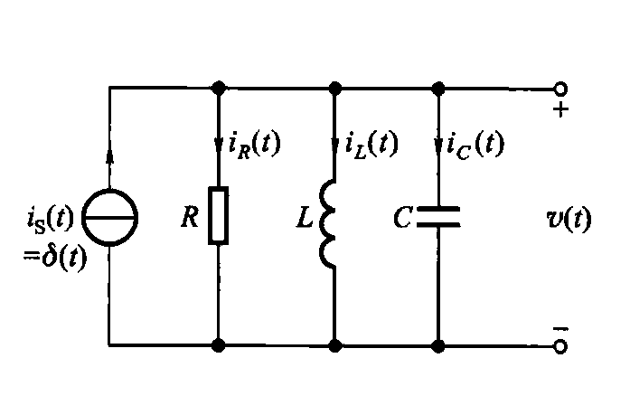
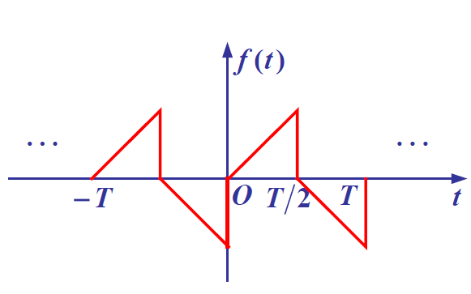
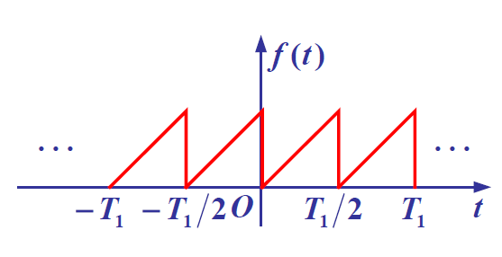
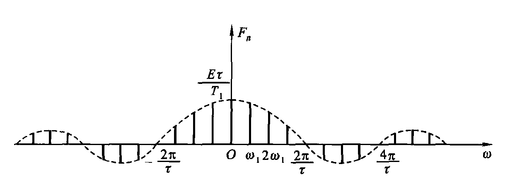

# Signals and Systems

时域、频域、复频域、离散域。

答疑：

Z622 Tue 11:45(12:15)~13:20

---

信号（确定性）

- 连续时间信号
- 离散时间信号

分析信号的描述、特性、运算。

- 时域分析
- 频域分析

---

系统（LTI）

- 连续时间系统
- 离散时间系统

分析系统的描述、特性、响应和求解。

- 复频域分析
- Z 域分析

---

平时成绩 40%

- 15% 考勤 + 课堂参与
- 10% 平时作业
- 15% 实验成绩（MATLAB）
- 60% 期中（连续信号与系统） + 期末

---

## 1 Introduction

---

### 1.1

信号分析的基本思想：把复杂信号分解成**简单基本单元信号**的线性组合。

系统分析：研究输入输出关系

系统综合：根据需求设计系统


---

### 1.2

信号的描述和分类

描述

1. 物理上：随时间变化的物理量
2. 数学上：一个或多个变量的函数
3. 形态上：波形

数学描述——表达式

---

MATLAB -- sound

```matlab
load chirp
sound(y, Fs)
```

---

信号的分类

- 确定性
- 随机性（干扰噪声）

---

- 连续信号(t)
- 离散信号(n)

---

- 周期信号

$$
\begin{aligned}
    &x(t+T) = x(t) \\
    &x(n+N) = x(n)
\end{aligned}
$$

- 非周期信号

---


抽样信号幅值连续，数字信号幅值不连续。它们的时间都不连续。

---

信号的特性

1. 时间特性：波形随时间变化
2. 频率特性：不同的频率分量（幅值，相位，信号带宽）
3. 能量特性：周期信号一定是功率信号，非周期不一定。

---

几种典型确定信号

- 指数信号
- 正弦信号
- 复指数信号
- 抽样信号
- 钟形脉冲函数

---

指数信号

$$
f(t) = Ke^{\alpha t}
$$

时间常数

$$
\tau = \frac{1}{|\alpha|}
$$

---

正弦信号

频域的自变量是角频率，不是频率。

衰减正弦信号

$$
f(t) =
\begin{cases}
K e^{-\alpha t} \cos (\omega t + \varphi) & (t > 0) \\
0 & (t < 0)
\end{cases}
$$

$t=0$ 是关键点。

---

复指数信号

$$
\begin{aligned}
    f(t) &= K e^{st} & (s = \sigma + j \omega) \\
    &= K e^{\sigma t} \cos \omega t + j K e^{\sigma t} \sin \omega t
\end{aligned}
$$

---

抽样信号

Sampling signal

$$
Sa(t) = \frac{\sin t}{t} = \mathrm{sinc} (t/\pi)
$$

Properties:

- $Sa(t) = Sa(-t)$
- $Sa(0) = 1$
- $Sa(t) = 0, t = \pm \pi, \pm 2 \pi, \cdots$
- $\lim_{t \rightarrow \infty} Sa(t) = 0$
- $\int_0^{\infty} Sa(t) dt = \frac{\pi}{2}$

---

钟形脉冲函数

Gauss Signal

$$
f(t) = E e^{- \left(\frac{t}{\tau}\right)^2}
$$

---

### 1.3

信号的运算

---

- 平移，反褶，尺度
- 微积分
- 两个信号的相加或相乘

---

平移

$$
f(t) \rightarrow f(t- \tau)
$$

$\tau > 0$ 右移（滞后）
$\tau < 0$ 左移（超前）

超前信号在物理上是有极限的。

---

翻转

$$
f(t) \rightarrow f(-t)
$$

没有物理实现的器件。

但是通过堆栈的“后进先出”可以在数字信号处理中实现。

---

展缩

$$
f(t) \rightarrow f(\alpha t)
$$

- $|\alpha| < 1$，坐标轴拉长
- $|\alpha| > 1$，坐标轴收缩

---

一般情况

$$
f(t) \rightarrow f(at+b)
$$

- 先平移 $b$，左加右减
- 标度变换，如果 $a<0$，再翻转

$$
f(mt+n) \rightarrow f(at+b)
$$

---

微分和积分

对阶跃信号做微分得到冲激信号。对于冲激信号进行识别，可以应用与自动驾驶的车道线识别。

---

相加和相乘

**同一时刻**对信号进行相加或相乘。

同等功率下，信号的频率越大，传播的距离越短。

信号不做除法，无意义。

---

### 1.4

阶跃信号和冲激信号

---

奇异信号和奇异函数

函数不连续或导数积分不连续

---

单位斜变信号

$$
R(t) =
\begin{cases}
0 & (t<0) \\
t & (t>0)
\end{cases}
$$

三角形脉冲

$$
f(t) =
\begin{cases}
\frac{K}{\tau}R(t) & (t \leq \tau) \\
0 & (t>\tau)
\end{cases}
$$

---

单位阶跃信号

$$
u(t) = R'(t) = 
\begin{cases}
0 & (t<0) \\
1 & (t>0)
\end{cases}
$$

No def or $\frac{1}{2}$ on $t = 0$.

---

用单位阶跃信号描述其他信号

门函数

$$
f(t) = u\left(t+ \frac{\tau}{2}\right)- u\left(t - \frac{\tau}{2}\right)
$$

与其他函数相乘，只保留 $\tau$ 时间内的部分。（卡门）

---

符号函数

$$
sgn(t) = 2u(t) - 1 = u(t) - u(-t)
$$

---

单位冲激函数

$$
\begin{align*}
&\delta(t) = \begin{cases}0 &(t \neq 0) \\ \infty & (t=0) \end{cases} \\
&\int_{-\infty}^{\infty} \delta(t) \mathrm{d}t = 1 \\
&\int_{-\infty}^{\infty} \delta(t) \mathrm{d}t = \int_{0-}^{0+} \delta(t) \mathrm{d}t \\
\end{align*}
$$

---

用阶跃函数定义（不严谨）

$$
\delta(t) = \frac{d}{dt} u(t)
$$

---

用极限定义

$$
\begin{align*}
&u_{\Delta}(t) =
\begin{cases}
\frac{1}{\tau} R(t) &(t\leq \tau) \\
1 & (t> \tau)
\end{cases}\\
&\delta(t) = \lim_{\tau \rightarrow 0} \frac{d}{dt} u_{\Delta}(t)
\end{align*}
$$

或者用门限函数。

$$
\begin{align*}
    &p(t) = \frac{1}{\tau} \left[u\left(t + \frac{\tau}{2}\right) - u \left(t - \frac{\tau}{2}\right) \right] \\
    & \delta(t) = \lim_{\tau \rightarrow 0} p(t) = \lim_{\tau \rightarrow 0} \frac{1}{\tau} \left[u \left( t + \frac{\tau}{2} \right) - u \left( t - \frac{\tau}{2} \right) \right]
\end{align*}
$$

---

冲激函数的性质

1. 抽样性
2. 奇偶性（$\delta(t) = \delta(-t)$）
3. 冲激偶
4. 标度变换

---

抽样性

$$
\int_{-\infty}^{\infty} \delta(t - t_{0}) f(t) \mathrm{d} t = f(t_{0})
$$

---

冲激偶

$$
\begin{align*}
    &\delta'(t) = \frac{d}{dt}\delta(t) \Rightarrow \int_{-\infty}^{t} \delta'(\tau) \mathrm{d} \tau = \delta(t)\\
    &\int_{-\infty}^{\infty} \delta'(t) \mathrm{d}t = 0\\
    & \int_{-\infty}^{\infty} \delta'(t) f(t) \mathrm{d}t \\
    =& \left. (\delta(t) f(t)) \right|_{-\infty}^{\infty} - \int_{-\infty}^{\infty} f'(t) \delta(t) \mathrm{d}t\\
    =& -f'(0) \\
    & \int_{-\infty}^{\infty} \delta^{(n)} (t) f(t) \mathrm{d}t = (-1)^{n} f^{(n)}(0)
\end{align*}
$$

冲激偶就像时空的褶皱。

---

$$
\begin{align*}
    & f(t) \delta'(t) = f(0) \delta'(t) - f'(0)\delta(t)
\end{align*}
$$

???

---

### 1.5

信号的分解

---

- 直流+交流
- 奇+偶
- 脉冲
- 实部+虚部
- 正交
- (分形理论)

---

DC+AC

$$
\begin{align*}
    &f(t) = f_{D}(t) + f_{A}(t) \\
    & f_{D}(t) = \frac{1}{T} \int_{t_{0}}^{t_{0}+T} f(t) \mathrm{d}t \\
    P &= \frac{1}{T} \int_{t_{0}}^{t_{0}+T} f^{2}(t) \mathrm{d}t \\
    &= \frac{1}{T} \left( \int_{t_{0}}^{t_{0}+T} [f_{D}(t) + f_{A}(t)]^{2} \mathrm{d}t \right) \\
    &= f_{D}^{2}(t) + \frac{1}{T} \left( \int_{t_{0}}^{t_{0}+T} f_{A}^{2}(t) \mathrm{d}t \right)
\end{align*}
$$

DC,AC 正交。

---

odd+even

$$
\begin{align*}
    & f_{o}= \frac{1}{2}(f(t)-f(-t))
    & f_{e}= \frac{1}{2}(f(t)+f(-t))
\end{align*}
$$

---

pulse

$$
\begin{align*}
    f(t) &= \sum_{\tau=-\infty}^{\infty}  f(\tau) [u(t-\tau) - u(t-\tau-\Delta \tau)] \\
    &= \sum_{\tau=-\infty}^{\infty}  f(\tau) \frac{[u(t-\tau) - u(t-\tau-\Delta \tau)]}{\Delta \tau} \Delta \tau \\
    &= \int_{-\infty}^{\infty} f(\tau) \delta(t-\tau) \mathrm{d}\tau
\end{align*}
$$

也可以分解成连续阶跃信号的和

$$
f(t) = f(0) u(t) + \int_{0}^{t} \frac{\mathrm{d}}{\mathrm{d}\tau} f(\tau) u(t-\tau) \mathrm{d}\tau , t \geq 0
$$

---

Real+Imag

$$
\begin{align*}
    & f(t) = f_{r}(t) + j f_{i}(t)\\
    & f_{r}(t) = \frac{1}{2} [ f(t) + f^{*}(t) ] \\
    & f_{i}(t) = \frac{1}{2j} [ f(t) - f^{*}(t) ] \\
\end{align*}
$$

---

正交

---

### 1.6

系统模型及其分类

---

系统模型的基本运算

- 加法器
- 乘法器
- 标量乘法器
- 微分器
- 积分器
- 延时器

---

系统的表示

1. 数学表达式
2. 系统图：形象地表示其功能

---

系统的互联

1. 级联 Cascade
2. 并联 Parallel
3. 反馈 Feedback

---

系统的分类

1. 即时系统（无记忆）：全电阻网络
    - 恒等系统
2. 动态系统（记忆）：输出不仅和当前输入有关，也和其他时刻的输入有关。

---

可逆性：单射

如果一个系统和另一个系统级联之后构成恒等系统，则两个系统互逆。

---

因果性

输出只与此前输入有关则为因果系统。

非因果系统：

$$
\begin{align*}
    &y(t) = x(t+1) \\
    &y(n) = x(n) + x(n+1) \\
    &y(n) = x(-n)
\end{align*}
$$

一切即时系统（无记忆）都是因果的。一切物理可实现的连续时间系统都是因果的。

---

稳定性

输入有界 ---> 输出有界

RC; RLC 均为稳定系统。

不稳定系统

$$
\begin{align*}
    & y(n) = \sum_{k = -\infty}^{n} x(k) \\
    & y(t) = \int_{-\infty}^{t} x(\tau) \mathrm{d}\tau
\end{align*}
$$

---

时变、时不变系统

时不变：输入产生时间平移，输出只产生相同的时间平移。time-invariant

---

线性

叠加性+齐次性

对于系统：

$$
r(t) = H\{e[f(t)]\}
$$

下面的命题仍然成立

$$
\sum_{i} c_{i} r(t) = H \left\{ \sum_{i} c_{i} e[f(t)] \right\}
$$

线性系统一定是线性方程，但反之不成立。

$$
\begin{align*}
    & y(t) = kx(t) + 2
\end{align*}
$$

去掉 (+2) 才是线性系统。

$$
\begin{align*}
    & y(t) = kx(t)
\end{align*}
$$

线性系统满足零输入时零输出。

---

增量线性系统

线性系统+与输入无关的响应（零输入响应）

---

重点：**确定性**信号作用下的**集总参数***线性***时不变**系统。

---

### 1.7

线性时不变系统

---

1. 线性 $e_{1} \rightarrow r_{1}, e_{2} \rightarrow r_{2} \Rightarrow c_{1} e_{1} + c_{2} e_{2} \rightarrow c_{1} r_{1} + c_{2} r_{2}$
2. 时不变 $e(t) \rightarrow r(t) \Rightarrow e(t-\tau) \rightarrow r(t-\tau)$
3. 微分、积分 $e \rightarrow r \Rightarrow \frac{\mathrm{d}e}{\mathrm{d}t} \rightarrow \frac{\mathrm{d}r}{\mathrm{d}t}$

---

### 1.8

系统分析方法

---


---

- 输入输出描述法
- 状态变量分析法（多输入输出）

数学模型解法：

- 时域分析
    - 经典方法
        - 连续系统：微分方程
        - 离散系统：差分方程
    - 卷积积分
- 变换域
    - FT
    - LT
    - ZT
    - (DFT)
    - (DWT)

---

## 2 时域分析法

---

### 2.1

Introduction

---

### 2.2

系统数学模型的建立

---

1. 建立系统模型（写微分方程）：元件约束，拓扑约束。
2. 求系统响应（解方程）
    1. 经典法
    2. 双零法（零输入响应，零输出响应）
        1. 零输入：经典法
        2. 零状态：卷积积分

---

在 RLC 电路中，有几个**独立的**储能元件，微分方程就有几阶。

例：两个并联的电容存在关联，不独立。

---

### 2.3

用时域经典法求解微分方程‘

---

用高阶微分方程表示系统：

$$
\begin{align*}
    & C_{0} \frac{\mathrm{d}^{n}}{\mathrm{d}t^{n}} r(t) + \cdots +C_{n} r(t) \\
    =& E_{0} \frac{\mathrm{d}^{n}}{\mathrm{d}t^{n}} e(t) + \cdots +E_{n} e(t) \\
    \text{Homogeneous sol: }& C_{0} \frac{\mathrm{d}^{n}}{\mathrm{d}t^{n}} r(t) + \cdots +C_{n} r(t) = 0 \\
    & C_{0} \alpha^{n} + \cdots + C_{n} \alpha = 0
\end{align*}
$$

如果没有重根：

$$
r(t) = \sum_{k=0}^{n} A_{k} e^{\alpha_{k}t}
$$

如果有重根：

$$
\begin{align*}
    & \alpha_{1} = \cdots = \alpha_{k} \\
    & r(t) = \left( \sum_{i=1}^{k} A_{i} t^{k-i} \right) e^{\alpha_{1}t} + \sum_{i=k+1}^{n} A_{i}e^{\alpha_{i}t}
\end{align*}
$$

---

特解和激励的数学形式有关

$$
\begin{align*}
    e(t) = E && r_{p}(t) &= B \\
    e(t) = t^{n} && r_{p}(t) &= P_{n}(t) \\
    e(t) = \cos \omega t && r_{p}(t) &= B_{1} \cos \omega t + B_{2} \sin \omega t \\
    e(t) = t^{p} e^{\alpha t} \cos \omega t && r_{p}(t) &= (A_{0} + \cdots A_{p}t^{p}) e^{\alpha t} \cos \omega t + (B_{0} + \cdots + B_{p} t^{p}) e^{\alpha t} \sin \omega t
\end{align*}
$$

---

借助初始条件确定 $A_{i}$

---

### 2.4

起始点的跳变

---

求解系统的齐次解以后

$$
\begin{align*}
    i_{h}(t) &= f(t) && (t \geq 0^{+}) \\
        &= f(t) u(t)
\end{align*}
$$

---

通过 $i(0_-)$ 求解 $i(0_{+})$ 

依据电路元件的性质：

- $i_L(0_{-)}= i_L(0_{+})$
- $u_C(0_{-}) = u_C(0_{+})$

$$
\begin{align*}
    & r^{(k)}(0_{-}) = \begin{bmatrix} r(0_{-}) & \frac{\mathrm{d}}{\mathrm{d}t} r(0_{-})  & \cdots & \frac{\mathrm{d}^{n-1}}{\mathrm{d}t^{n-1}}r(0_{-}) \end{bmatrix} \\
    \rightarrow & r^{(k)}(0_{+}) = \begin{bmatrix} r(0_{+}) & \frac{\mathrm{d}}{\mathrm{d}t} r(0_{+})  & \cdots & \frac{\mathrm{d}^{n-1}}{\mathrm{d}t^{n-1}}r(0_{+}) \end{bmatrix}
\end{align*}
$$

---

但是当有冲击激励强迫作用于系统，上述的换路定理不再成立。

$$
\begin{align*}
    v_{C}(t) &= v_{C}(0_{-}) \frac{1}{C} \int_{0_{-}}^{t} i(t) \mathrm{d}t \\
        &=v_{C}(0_{-}) \frac{1}{C} \int_{0_{-}}^{0^{+}} i(t) \mathrm{d}t + \frac{1}{C} \int_{0_{+}}^{t} i(t) \mathrm{d}t
\end{align*}
$$

---

冲激函数匹配法确定初始条件

$t=0$ 时刻等式左右的 $\delta(t)$ 以及各阶导数应该系数相等（平衡）。

举例



---

Differential Equation

$$
\begin{align*}
    & i_{S}(t) = \frac{1}{R} L \frac{\mathrm{d}i_{L}}{\mathrm{d}t} + i_{L} + C \frac{\mathrm{d}}{\mathrm{d}t} \left( L \frac{\mathrm{d}i_{L}}{\mathrm{d}t} \right) \\
    & \frac{\mathrm{d}^{2}i_{L}}{\mathrm{d}t^{2}} + \frac{1}{RC} \frac{\mathrm{d}i_{L}}{\mathrm{d}t} + \frac{1}{CL} i_{L} = \frac{1}{CL} \delta(t)
\end{align*}
$$

二阶导数项存在奇异函数，一阶导数项存在阶跃函数，因此 $i_{L}$ 为连续函数。

$$
\begin{align*}
    & i_{L}(0_{+}) = i_{L}(0_{-}) = 0 \\
    & \frac{\mathrm{d}i_{L}}{\mathrm{d}t}(0_{+}) = \frac{\mathrm{d}i_{L}}{\mathrm{d}t}(0_{-}) + \frac{1}{LC} = \frac{1}{LC}
\end{align*}
$$

将这两个作为初始条件，齐次解就是最终解。

---

$$
\begin{align*}
    & \frac{\mathrm{d}r}{\mathrm{d}t}+3r = 3 \delta'(t) \\
    & \frac{\mathrm{d}r}{\mathrm{d}t} = a \delta(t) + b \delta'(t) + c \Delta u(t) & \Delta u = u(t), t \in (0_{-}, 0_{+}) \\
    & r = a \Delta u(t) + b \delta(t) \\
    & \begin{bmatrix}
        3 & 0 & 1 \\ 
        1 & 3 & 0 \\ 
        0 & 1 & 0 \end{bmatrix}
    \begin{bmatrix}
        a \\ 
        b \\ 
        c \end{bmatrix}
    = \begin{bmatrix}
        0 \\ 
        0 \\ 
        3 \end{bmatrix} \Rightarrow \begin{bmatrix}
        a \\ 
        b \\ 
        c \end{bmatrix} = \begin{bmatrix}
        -9 \\ 
        3 \\ 
        27 \end{bmatrix} \\
    &r = -9 \Delta u(t) + 3 \delta(t)\\
    &r(0_{+}) - r(0_{-}) = -9
\end{align*}
$$

关于单位跳变函数 $\Delta u(t)$. 它是为了研究在 0 附近的跳变行为所特殊定义的函数。

它和阶跃函数很像，但并不是，它的积分等于 0. 因此在高阶导数项中可以“凭空”出现 $\Delta u(t)$，见上题。

---

### 2.5

零输入响应和零状态响应

---

$$
e(t) = H[r(t)] + H[x(0_{-})]
$$

可以将原始状态等效成激励源。

$$
H[x(0_{-})] = H[r_{0}(t)]
$$

---

- 全响应 = 齐次响应 + 特解
- 全响应 = 零输入响应 + 零状态响应
- 全响应 = 暂态响应 + 稳态响应

特解包含在零状态响应中，因为零输入显然只是自由的。零状态响应中也有自由的成分。

---

零输入响应不存在跳变

$$
\begin{align*}
    & r_{zi}^{(k)}(0_{+}) = r_{zi}^{(k)}(0_{-})\\
    & r_{zi}(t) = \sum_{k=1}^{n} A_{zi,k} e^{\alpha_{k}t} 
\end{align*}
$$

总响应

$$
\begin{align*}
    r(t) &= r_{zi}(t) + r_{zs}(t) \\
        &= \sum A_{zik} e^{\alpha_{k}t} + \sum A_{zsk} e^\alpha
\end{align*}
$$

---

将输入信号分解为简单信号的和，分别求解。

$$
\begin{align*}
    x_{i}(t) & \rightarrow y_{i}(t) \\
    \sum x_{i}(t) & \rightarrow \sum  y_{i}(t)
\end{align*}
$$

---

### 2.6

冲激响应和阶跃响应

---

将输入信号分解为一系列矩形脉冲信号。

$$
\begin{align*}
    x_{\Delta}(t) &= \sum_{k=-\infty}^{\infty} x(k \Delta)(t-k \Delta)\Delta \\
    x(t) &= \int x(\tau) \delta(t-\tau) \mathrm{d}\tau
\end{align*}
$$

---

单位冲激响应：单位冲激信号在**零状态**响应。

$$
\delta(t) \rightarrow h(t)
$$

---

一阶电路的冲激响应。

$$
RC \frac{\mathrm{d}v_{C}}{\mathrm{d}t} + v_{C} = \delta(t)
$$

$\delta(t)$ 在 $t=0_{+}$ 时刻转化为系统的储能。之后体现为在初始储能后齐次方程的解。

$$
\begin{align*}
    & RC \frac{\mathrm{d}v_{C}}{\mathrm{d}t} + v_{C} = 0 \\
    & \alpha = - \frac{1}{RC} \\
    & v_{C} = A e^{- \frac{t}{RC}} u(t)
\end{align*}
$$

---

求 $v_C(0_{+})$.

方法一：

$$
\begin{align*}
    & \frac{\mathrm{d}v_{C}}{\mathrm{d}t} = a \delta(t) + b \Delta u(t) \\
    & v_{C} = a \Delta u(t) \\
    & \Rightarrow a = \frac{1}{RC} \\
    & v_{C}= \frac{1}{RC} e^{- \frac{t}{RC}} u(t) \\
    & i = C \frac{\mathrm{d}v_{C}}{\mathrm{d} t} = - \frac{1}{R^{2}C} e^{- \frac{t}{RC}} u(t) + \frac{1}{R} \delta(t)
\end{align*}
$$

方法二：直接将解的形式代入解得常数。（==求完冲激响应一定要加上阶跃函数项==）

$$
\begin{align*}
    &v_{C} = A e^{- \frac{t}{RC}} u(t)
\end{align*}
$$

阶跃响应：系统在单位阶跃信号下的**零状态**响应。

---

求冲激响应 $h(t)(n>m)$

$$
\begin{align*}
    & \begin{bmatrix}
        1 & a_{n-1} & \cdots & a_{0} \end{bmatrix} \begin{bmatrix}
        \frac{\mathrm{d}^{n}}{\mathrm{d}t^{n}} r \\ 
        \frac{\mathrm{d}^{n-1}}{\mathrm{d}t^{n-1}} r \\ 
        \vdots \\ 
        r
        \end{bmatrix} = 
        \begin{bmatrix}
        1 & b_{m-1} & \cdots & b_{0} \end{bmatrix} \begin{bmatrix}
        \frac{\mathrm{d}^{m}}{\mathrm{d}t^{m}} e \\ 
        \frac{\mathrm{d}^{m-1}}{\mathrm{d}t^{m-1}} e \\ 
        \vdots \\ 
        e
        \end{bmatrix} 
\end{align*}
$$

先求冲激响应 $\hat{h}(t)$

$$
\begin{align*}
    & \begin{bmatrix}
        1 & a_{n-1} & \cdots & a_{0} \end{bmatrix} \begin{bmatrix}
        \frac{\mathrm{d}^{n}}{\mathrm{d}t^{n}} r \\ 
        \frac{\mathrm{d}^{n-1}}{\mathrm{d}t^{n-1}} r \\ 
        \vdots \\ 
        r
        \end{bmatrix} = \delta(t)
\end{align*}
$$

仅有最高阶导数含有 $\delta(t)$. 因此得到初始条件

$$
\hat{h}^{(n-1)}(0_{+}) = 1, \hat{h}^{(n-1)}(0_{+}) = \cdots = \hat{h}(0_{+}) = 0
$$

根据齐次解和初始条件得到 $\hat{h}(t)$ 后（==求完冲激响应一定要加上阶跃函数项==）

$$
h(t) = \begin{bmatrix} 1 & b_{m-1} & \cdots & b_{0} \end{bmatrix}
    \begin{bmatrix}
        \frac{\mathrm{d}^{m}}{\mathrm{d}t^{m}} \hat{h} \\ 
        \frac{\mathrm{d}^{m-1}}{\mathrm{d}t^{m-1}} \hat{h} \\ 
        \vdots \\ 
        \hat{h}
    \end{bmatrix}
$$

---

对于 $(n \leq m)$ 的情况，只能采用之前的方法去求解，上一片的方法不行，因为 $h$ 中含有奇异函数项。

---

### 2.7

卷积

---

$$
f_{1}(t) * f_{2}(t) = \int_{-\infty}^{\infty} f_{1}(\tau) f_{2}(t - \tau) \mathrm{d} \tau
$$

---

求系统的零状态响应 $r_{zs} (t)$ .

$$
\begin{align*}
    r(t) &= H[e(t)] \\
        &= H\left[\int e(\tau) \delta(t-\tau) \mathrm{d} \tau\right]\\
        &= \int e(\tau) H[\delta(t - \tau)] \mathrm{d} \tau \\
        &= \int e(\tau) h(t - \tau) \mathrm{d} \tau \\
        &= e(t) * h(t)
\end{align*}
$$

运算过程的实质：一个信号不动，另一个信号翻转以后平移 $t$.

用图解法求积分限，再用解析法。

$$
f_{1}(t) \text{ on } [a,b], f_{2}(t) \text{ on } [c,d] \Rightarrow g(t) = f_{1}(t) * f_{2}(t) \text{ on } [a+c,b+d]
$$

---

求解系统响应使用双零法

- 零输入：齐次解，用初始条件求系数
- 零状态：卷积

---

### 2.8

卷积性质

---

1. 交换律
2. 分配律（并联）
3. 结合律（级联）

---

微积分性质

$$
\begin{align*}
    & g'(t) = f'(t) * h(t) = f(t) * h'(t) \\
    & g^{(-1)} = f^{(-1)} * h(t) = f(t) * h^{(-1)}(t) & (Integral) \\
    & g^{(m-n)}= f^{(m)}* h^{(-n)} = f^{(-n)} * h^{(m)}
\end{align*}
$$

**可导和可微的区别**：求导以后再积分是不是本身？

对于不可微的函数，不能应用微分性质。

---

冲激函数和阶跃函数

$$
\begin{align*}
    & f(t) * \delta(t) = f(t) \\
    & f(t) * \delta^{(n)}(t) = f^{(n)}(t) \\
    & f(t) * u(t) = f^{(-1)}(t) = \int_{-\infty}^{t} f(\lambda) \mathrm{d} \lambda
\end{align*}
$$

---

时移特性

$$
f(t-t_{1}) * h(t - t_{2}) = g(t-t_{1}-t_{2})
$$

---

## 3 傅里叶变换

---

### 3.1

Introduction

---

研究信号的分解

将信号分解为什么样的简单基本信号？

分解以后可以利用线性叠加得到总响应。

$$
\begin{align*}
    x(t) &= \sum_{i} a_{i} x_{i}(t) \\
    y(t) &= \sum_{i} a_{i} y_{i}(t) & x_{i} \rightarrow y_{i}
\end{align*}
$$

之前利用卷积进行了冲激响应的分解。

---

信号分解可以在：

- 时域（物理现实）
- 频域（既有物理，又有数学）
- 变换域（数学工具）

可以分解为正弦分量（频率不同），把时间为变量的时域分析变成以频率为变量的频域分析。

---

频域分析

研究对象：连续时间信号和系统

基本单元：正弦信号或复指数信号

傅里叶级数和傅里叶变换。

傅里叶级数对应周期信号。

傅里叶变换对应非周期信号。

---

### 3.2

周期信号

---

正交函数集

$$
\int_{t_{1}}^{t_{2}} \varphi_{1}(t) \varphi_{2}(t) \mathrm{d} t = 0
$$

$$
\int_{t_{1}}^{t_{2}} \varphi_{i}(t) \varphi_{j}(t) = \begin{cases} 0 & i \neq j \\ K_{i} & i = j \end{cases}
$$

$K_{i} = 1$ 归一化正交函数集。

???

---

信号的正交分解

$$
f(t) \approx \sum_{i} C_{i} \varphi_{i}(t)
$$

误差

$$
\varepsilon = \frac{1}{t_{2}-t_{1}} \int_{t_{1}}^{t_{2}} \left(f(t) - \sum_{j=1}^{n} C_{j} \varphi_{j}(t)\right)^{2} \mathrm{d}t
$$

当 $n \rightarrow \infty, \varepsilon \rightarrow 0$.

---

三角函数集是正交函数集

$$
\begin{align*}
    & \int_{-\frac{T}{2}}^{\frac{T}{2}} \cos n \omega t \sin m \omega t \mathrm{d} t = 0 \\
    & \int_{-\frac{T}{2}}^{\frac{T}{2}} \cos n \omega t \cos m \omega t \mathrm{d} t = \begin{cases} 0 & m \neq n \\ \frac{T}{2} & n = m \end{cases} \\
    & \int_{-\frac{T}{2}}^{\frac{T}{2}} \sin n \omega t \sin m \omega t \mathrm{d} t = \begin{cases} 0 & m \neq n \\ \frac{T}{2} & n = m \end{cases}
\end{align*}
$$

---

傅里叶级数存在条件：

1. 能量有限 $\int_{-\infty}^{\infty} f^{2}(t) \mathrm{d}t < \infty$
2. 满足迪利克雷条件

- 间断点存在，个数有限
- 极大值极小值个数有限
- 绝对可积

---

$$
f(t) = a_{0} + \sum_{n=1}^{\infty} (a_{n} \cos n \omega_{1} t + b_{n} \sin n \omega_{1} t)
$$

系数公式

$$
\begin{align*}
    & a_{n} = \frac{<f(t), \cos n \omega_{1} t>}{<\cos n \omega_{1} t, \cos n \omega_{1} t>} \\
    & b_{n} = \frac{<f(t), \sin n \omega_{1} t>}{<\sin n \omega_{1} t, \sin n \omega_{1} t>} \\
    &
\end{align*}
$$

很像 Gram-Schmidt 方法。

这里的内积记号取积分的定义（离散的向量到连续的定义域）

$$
\begin{align*}
    & a_{n} = \frac{2}{T_{1}} \int_{t_{0}}^{t_{0}+T} f(t) \cos n \omega_{1} \mathrm{d}t \\
    & b_{n} = \frac{2}{T_{1}} \int_{t_{0}}^{t_{0}+T} f(t) \sin n \omega_{1} \mathrm{d}t
\end{align*}
$$

特别地，$a_{0}$ 表示直流分量。

$$
a_{0} = \frac{1}{T_{1}} \int_{t_{0}}^{t_{0} + T} f(t) \mathrm{d}t
$$

---

周期锯齿波

$$
\begin{align*}
    &\left\{ \begin{aligned}
        &f(t) = \frac{A}{T} t (- \frac{T}{2} < t \leq \frac{T}{2}) \\\\
        &f(t+T) = f(t)
    \end{aligned}\right. \\
    & a_{n} = 0 \\
    & b_{n} = \frac{2}{T} \int_{- \frac{T}{2}}^{\frac{T}{2}} \frac{A}{T} t \sin \frac{2n \pi t}{T} \mathrm{d}t = \frac{A}{n \pi} (-1)^{n+1} \\
    & f(t) = 0 + \frac{A}{\pi} \sin \omega t - \frac{A}{2\pi} \sin 2 \omega t + \cdots \\
\end{align*}
$$

---

当然可以使用有相位差的余弦（或正弦）分量表示。

$$
f(t) = c_{0} + \sum_{i=1}^{\infty} c_{i} \cos (i \omega t + \varphi_{i}) = d_{0} + \sum_{i=1}^{\infty} d_{i} \sin (i \omega t + \varphi_{i})
$$

---

指数形式的傅里叶级数

指数函数集

$$
\{ e^{j n \omega t}\}, n = 0, \pm 1, \pm 2, \cdots
$$

其正交性的定义：和共轭相乘

$$
\int_{t_{0}}^{t_{0}+T} e^{jn \omega_{1} t} \overline{e^{jm \omega_{1} t}} \mathrm{d}t = \int_{t_{0}}^{t_{0}+T} e^{j(n-m)\omega t} \mathrm{d}t
$$

存在负频率，（物理现实中不存在）。

---

$$
\begin{align*}
    f(t) &= a_{0} + \sum_{n=1}^{\infty} (a_{n} \cos n \omega_{1} t + b_{n} \sin n \omega_{1} t) \\
        &= a_{0} + \sum_{n=1}^{\infty} \left(a_{n} \frac{e^{j n \omega_{1} t}+e^{-j n \omega_{1} t}}{2} + b_{n} \frac{e^{j n \omega_{1} t}-e^{-j n \omega_{1} t}}{2j}\right)\\
        &= F(0) + \sum_{n=1}^{\infty} \left(\frac{a_{n}-jb_{n}}{2}e^{j n \omega_{1} t} + \frac{a_{n}+jb_{n}}{2} e^{-jn \omega_{1} t}\right) \\
        &= F(0) + \sum_{n=1}^{\infty} [ F(n \omega_{1})e^{jn \omega_{1} t} + F(-n \omega_{1}) e^{-jn \omega_{1} t} ] & (-b_{n} = b_{-n}) \\
        &= \sum_{-\infty}^{\infty} F(n) e^{j n \omega t}
\end{align*}
$$

---

$$
\begin{align*}
    F(n) &= \frac{a_{n}-jb_{n}}{2} \\
        &= \frac{1}{T} \int_{t_{0}}^{t_{0}+T} f(t) (\cos  n \omega_{1} t - j \sin n \omega_{1} t)\\
        &= \frac{1}{T} \int_{t_{0}}^{t_{0}+T} f(t) e^{-j n \omega t} \mathrm{d}t
\end{align*}
$$

$f(t)$ 和 $F(n)$ 是一一对应的。

可以观察到，这和指数函数的正交性定义是相关的。

---

频谱图

$$
\begin{align*}
    & F(n \omega_{1}) = \frac{a_{n}-jb_{n}}{2} = \frac{1}{2} c_{n} e^{j \varphi_{i}}\\
    & \varphi_{i} = -\arctan \frac{b_{n}}{a_{n}}\\
    & |F(n \omega_{1})| = \frac{1}{2} c_{n}
\end{align*}
$$

- 幅度频谱图 $c_{i}, |F(i)| \sim i$
- 相位频谱图 $\varphi_{i} \sim i$

奇偶性

- 幅频函数是偶函数
- 相频函数是奇函数

这一点实际上保证了在指数函数的形式下，得到的==时域函数仍然是实数函数==，虚部为 0.

---

周期信号的频谱图

- 离散性（自变量取孤立的整数值）
- 谐波性
- 收敛性（频率越大，幅度越小）

---

三角函数的频谱图横坐标只有非负半轴

指数函数的频谱图横坐标有全部轴

指数频谱图的幅频特性为三角频谱图的对半分（偶函数）

指数频谱图的相频特性为三角频谱图的中心对称（奇函数）

---

冲击序列

$$
\delta_{T}(t) = \sum_{n=-\infty}^{\infty} \delta(t-nT_{1})
$$

求频谱图

$$
F(n) = \frac{1}{T_{1}} \int_{- \frac{T_{1}}{2}}^{\frac{T_{1}}{2}} \delta(t) e^{-j n \omega_{1} t} \mathrm{d}t = \frac{1}{T_{1}}
$$

满足离散型和谐波性，但是不满足收敛性。

---

偶函数的频谱图

$$
\begin{align*}
    & b_{n} = 0 \\
    & F(n) = \frac{a_{n}}{2}
\end{align*}
$$

奇函数的频谱图

$$
\begin{align*}
    &a_{n} = 0 \\
    &F(n) = -j \frac{b_{n}}{2} \\
    &F(-n) = j \frac{b_{n}}{2}
\end{align*}
$$

---

奇谐函数 $f(t) = -f\left(t \pm \frac{T}{2}\right)$



奇谐函数的偶次谐波分量为 0.

$$
\begin{align*}
    F(n \omega) &= \frac{1}{T_{1}} \int_{- \frac{T_{1}}{2}}^{\frac{T_{1}}{2}} f(t) e^{-jn \omega_{1} t} \mathrm{d}t \\
        &= \frac{1}{T_{1}} \left( \int_{- \frac{T_{1}}{2}}^{0} f(t) e^{-jn \omega_{1} t}\mathrm{d}t + \int_{0}^{\frac{T_{1}}{2}} f(t) e^{-jn \omega_{1} t}\mathrm{d}t \right) \\
        &= \frac{1}{T_{1}} \left( -\int_{0}^{\frac{T_{1}}{2}} f\left(t - \frac{T_{1}}{2}\right) e^{-jn \omega_{1} \left(t- \frac{T_{1}}{2}\right)}\mathrm{d}t + \int_{0}^{\frac{T_{1}}{2}} f(t) e^{-jn \omega_{1} t}\mathrm{d}t \right) \\
        &= \frac{1}{T_{1}} \int_{0}^{\frac{T_{1}}{2}} f(t) \left(e^{-jn \omega_{1} t} - e^{-jn \omega_{1} \left(t- \frac{T_{1}}{2}\right)} \right)\mathrm{d}t \\
        &= \frac{1}{T_{1}} (1-e^{jn \pi}) \int_{0}^{\frac{T_{1}}{2}} f(t) e^{-jn \omega_{1} t} \mathrm{d}t \\
\end{align*}
$$

---

偶谐函数 $f(t) = f(t \pm \frac{T_{1}}{2})$



同理，偶谐函数的奇次谐波分量为 0.

$$
F(n \omega_{1}) = \frac{1}{T_{1}}(1+e^{jn \pi}) \int_{0}^{\frac{T_{1}}{2}} f(t) e^{-jn \omega_{1} t} \mathrm{d}t
$$

其实偶谐函数可以理解为：实际的基波频率是给定的基波频率的两倍，实际的周期是 $\frac{T_{1}}{2}$.

---

帕塞娃定理（Parseval's Theorem）

$$
\begin{align*}
    P &= \frac{1}{T} \int_{0}^{T} f^{2}(t) \mathrm{d}t \\
        &= \frac{1}{T} \int_{0}^{T}  \left[a_{0} + \sum_{n=1}^{\infty} (a_{n}\cos n \omega t +b_{n} \sin n \omega t)\right]^{2} \mathrm{d}t \\
        &= a_{0}^{2} + \frac{1}{2} \sum_{n=1}^{\infty} (a_{n}^{2} + b_{n}^{2}) \\
        &= \sum_{-\infty}^{\infty} |F(n)|^{2}
\end{align*}
$$

功率谱系数：$|F(n)|^{2} \sim n$

---

傅里叶有限级数和最小均方误差

Gibbs 现象

- Fourier 级数在信号的连续点处收敛于信号本身，在信号的不连续点处收敛于信号==左右极限的平均值==。
- 用有限项级数作为近似时，会不可避免地在信号的不连续处出现==震荡==和==超量==。
- 超量的幅度不会随着项数的增加而减少，只是会向不连续点压缩，频率增大，能量占比减少。

---

### 3.3

典型周期信号的傅里叶级数

---

脉宽为 $\tau$，周期为 $T$ 的方波信号

$$
\begin{align*}
    F(n \omega_{1}) &= \frac{1}{T} \int_{- \frac{T}{2}}^{\frac{T}{2}} f(t) e^{-jn \omega_{1} t} \mathrm{d}t \\
        &= \frac{1}{T} \int_{- \frac{\tau}{2}}^{\frac{\tau}{2}} E e^{-jn\omega_{1}t} \mathrm{d}t \\
        &= \frac{E}{-jn \omega_{1} T} \left(e^{- \frac{jn \omega_{1} \tau}{2}} - e^{\frac{jn \omega_{1} \tau}{2}}\right) \\
        &= \frac{E \tau}{T} \mathrm{Sa}\left(\frac{n \omega_{1} \tau}{2}\right)
\end{align*}
$$

谱线间隔：$\omega_{1} = \frac{2\pi}{T}$，信号的周期越大，间隔越近，对于非周期信号，$T \rightarrow \infty$



---

其他典型信号

- 周期锯齿脉冲
- 周期三角脉冲
- 周期半波余弦
- 周期全波余弦

结论：周期锯齿余弦的振幅以 $\frac{1}{n}$ 的形式衰减，后三者以 $\frac{1}{n^{2}}$ 的形式衰减。

---

周期锯齿波

$$
\begin{align*}
    &\left\{ \begin{aligned}
        &f(t) = \frac{A}{T} t (- \frac{T}{2} < t \leq \frac{T}{2}) \\\\
        &f(t+T) = f(t)
    \end{aligned}\right. \\
    & a_{n} = 0 \\
    & b_{n} = \frac{2}{T} \int_{- \frac{T}{2}}^{\frac{T}{2}} \frac{A}{T} t \sin \frac{2n \pi t}{T} \mathrm{d}t = \frac{A}{n \pi} (-1)^{n+1} \\
    & f(t) = 0 + \frac{A}{\pi} \sin \omega t - \frac{A}{2\pi} \sin 2 \omega t + \cdots \\
\end{align*}
$$

---

周期三角脉冲

$$
\begin{align*}
    &\begin{aligned}
        f(t) &= E\left(1 - \frac{2|t|}{T_{1}}\right) & t \in \left[- \frac{T_{1}}{2}, \frac{T_{1}}{2}\right] \\
        f(t) &= f(t \pm T_{1}) & t \in \mathbb{R}
    \end{aligned} \\
    & b_{n} = 0 \\
    & a_{0} = \frac{E}{2} \\
\end{align*}
$$

$$
\begin{align*}
    a_{n} &= \frac{2}{T_{1}} \int_{- \frac{T_{1}}{2}}^{\frac{T_{1}}{2}} f(t) \cos n \omega_{1} t \mathrm{d}t \\
        &= \frac{4}{T_{1}} \int_{0}^{\frac{T_{1}}{2}} E\left(1- \frac{2t}{T_{1}}\right) \cos n \omega_{1} t \mathrm{d}t \\
        &= \frac{2E}{n^{2}\pi^{2}} (1 - \cos n \pi) \\
    f(t) &= \frac{E}{2} + \frac{2E}{\pi^{2}} \sum_{n=1}^{\infty} \frac{1}{n^{2}}(1-\cos n \pi) 
\end{align*}
$$

---

周期半波余弦

$$
\begin{align*}
    f(t) &= E \cos \omega_{1} t & t \in \left[- \frac{\pi}{4 \omega_{1}}, \frac{\pi}{4 \omega_{1}}\right] \\
        &= 0 & t \in \left[\frac{-\pi}{2 \omega_{1}}, - \frac{\pi}{4 \omega_{1}}\right] \cup \left[\frac{\pi}{2 \omega_{1}},  \frac{\pi}{4 \omega_{1}}\right]
\end{align*}
$$

$$
\begin{align*}
    b_{n} &= 0 \\
    a_{0} &= \frac{1}{T_{1}} \int_{- \frac{T_{1}}{4}}^{\frac{T_{1}}{4}} E \cos \omega_{1} t \mathrm{d} t \\
        &= \frac{E}{2 \pi} \int_{- \frac{\pi}{2}}^{\frac{\pi}{2}} \cos \theta \mathrm{d} \theta \\
        &= \frac{E}{\pi} \\
    a_{n} &= \frac{2}{T_{1}} \int_{-\frac{T_{1}}{4}}^{\frac{T_{1}}{4}} E \cos \omega_{1} t \cos n \omega_{1} \mathrm{d} t \\
        &= \frac{E}{T_{1}} \int_{-\frac{T_{1}}{4}}^{\frac{T_{1}}{4}} [\cos (n-1) \omega_{1} t - \cos (n+1) \omega_{1} t] \mathrm{d} t \\
        &= \frac{E}{2 \pi} \left(\frac{1}{n-1} \int_{-\left(n-1\right) \frac{\pi}{2}}^{(n-1) \frac{\pi}{2}} \cos \theta \mathrm{d} \theta - \frac{1}{n+1} \int_{-(n+1) \frac{\pi}{2}}^{(n+1) \frac{\pi}{2}} \cos \theta \mathrm{d} \theta\right) \\
        &= - \frac{2E}{\pi} \frac{1}{n^{2}-1} \cos\frac{n \pi}{2}
\end{align*}
$$

周期半波余弦的频谱只含有直流、基频和偶数倍基频的分量。

---

周期全波余弦信号

$$
\begin{align*}
    f(t) &= E \cos \frac{\omega_{1} t}{2} & t \in \left[- \frac{T_{1}}{2}, \frac{T_{1}}{2}\right] \\
    b_{n} &= 0 \\
    a_{0} &= \frac{1}{T_{1}} \int_{-\frac{T_{1}}{2}}^{\frac{T_{1}}{2}} E \cos \frac{\omega_{1} t}{2} \mathrm{d} t \\
        &= \frac{2E}{\pi} \\
    a_{n} &= \frac{2}{T_{1}} \int_{-\frac{T_{1}}{2}}^{\frac{T_{1}}{2}} E \cos \left(\frac{\omega_{1} t}{2}\right) \cos (n \omega_{1}t )\mathrm{d} t \\
        &= \frac{E}{T_{1}} \int_{-\frac{T_{1}}{2}}^{\frac{T_{1}}{2}} \left(\cos \left(n- \frac{1}{2}\right) \omega_{1} t - \cos \left(n+ \frac{1}{2}\right) \omega_{1} t \right) \mathrm{d} t \\
        &= \frac{(-1)^{n+1}}{4n^{2} -1}\frac{4E}{\pi}
\end{align*}
$$

---

频带宽度

引出：对于方波信号，第一个零点以内 $[- \frac{2\pi}{\tau}, \frac{2 \pi}{\tau}]$ 包含了大部分的能量，信号的功率主要集中在低频段。

在满足一定失真条件下，信号可以用某段频率范围的信号表示，次频率范围称为**频带宽度**。

对于方波信号，$B_{\omega} = \frac{2 \pi}{\tau}$ 或 $B_{f} = \frac{1}{\tau}$.

对于一般的周期信号，取幅度大于 $\frac{1}{10} |F(n \omega_{1})|_{max}$ 的频率范围为频带宽度。

---

### 3.4

傅里叶变换——非周期信号的频谱分析

---

存在条件：绝对可积

---

$$
\begin{align*}
    & T_{1} \rightarrow \infty \\
    & F(n \omega_{1}) = \frac{1}{T_{1}} \int_{- \frac{\tau}{2}}^{\frac{\tau}{2}}f(t) e^{-jn \omega_{1}t} \mathrm{d}t \rightarrow 0 \\
    & \omega_{1} \rightarrow 0
\end{align*}
$$

离散谱 ---> 连续谱

---

不再使用 $F(n \omega_{1})$ 而使用谱密度函数（类似[概率密度函数](PossibilityStatistics.md#密度函数)）

$$
\begin{align*}
    & \omega_{1} \rightarrow \mathrm{d} \omega\\
    & n \omega_{1} \rightarrow \omega
\end{align*}
$$

$$
\begin{align*}
    F(\omega) &= \lim_{T_{1} \rightarrow \infty} T_{1} F(n \omega_{1}) \\
        &= \int_{- \frac{\tau}{2}}^{\frac{\tau}{2}} f(t) e^{-j \omega t} \mathrm{d} t
\end{align*}
$$

$$
F(\omega) = |F(\omega)| e^{j \varphi(\omega)}
$$

- $|F(\omega)| \sim \omega$ 幅频
- $\varphi(\omega) \sim \omega$ 相频

---

反变换

$$
\begin{align*}
    f(t) &= \sum F(n \omega_{1}) e^{j n \omega_{1} t} \\
        &= \sum \frac{F(n \omega_{1})}{\omega_{1}} e^{j n \omega_{1} t} \omega_{1} \\
        &= \sum \frac{F(\omega)}{T_{1}\omega_{1}} e^{j \omega t} \omega_{1} \\
        & \rightarrow \frac{1}{2\pi} \int_{-\infty}^{\infty} F(\omega) e^{j \omega t} \mathrm{d} \omega
\end{align*}
$$

---

$$
\begin{align*}
    F(\omega) &= \int_{-\infty}^{\infty} f(t) e^{-j \omega t} \mathrm{d} t \\
        &= \int_{-\infty}^{\infty} (f_{even}(t) + f_{odd}(t))(\cos \omega t - j \sin \omega t) \mathrm{d} t \\
        &= \int_{-\infty}^{\infty} f_{even}(t) \cos \omega t \mathrm{d} t - j \int_{-\infty}^{\infty} f_{odd}(t) \sin \omega t \mathrm{d}t \\
        &= 2 \int_{0}^{\infty} f_{even}(t) \cos \omega t \mathrm{d} t - j 2 \int_{0}^{\infty} f_{odd}(t) \sin \omega t \mathrm{d} t \\
    R(\omega) &= 2 \int_{0}^{\infty} f_{even}(t) \cos \omega t \mathrm{d} t \\
    X(\omega) &= 2 \int_{0}^{\infty} f_{odd}(t) \sin \omega t \mathrm{d} t
\end{align*}
$$

---

傅里叶变换的物理意义

$$
\begin{align*}
    f(t) &= \frac{1}{2 \pi} \int_{-\infty}^{\infty} F(\omega) e^{j \omega t} \mathrm{d} \omega \\
        &= \frac{1}{2\pi} \int_{-\infty}^{\infty} |F(\omega)| e^{j \varphi_{\omega}} e^{j \omega t} \mathrm{d} \omega \\
        &= \frac{1}{2\pi} \int_{-\infty}^{\infty} |F(\omega)| \left[\cos (\omega t + \varphi_{\omega}) + j \sin (\omega t + \varphi_{\omega}) \right] \mathrm{d} \omega \\
        &= \frac{1}{2\pi} \int_{-\infty}^{\infty} |F(\omega)| \cos ( \omega t + \varphi_{\omega}) \mathrm{d} \omega \\
        &= \int_{0}^{\infty} \frac{|F(\omega)|}{\pi} \mathrm{d} \omega \cos [\omega t + \varphi(\omega)]
\end{align*}
$$

其中已利用 $\varphi_{\omega}$ 是奇函数，第二部分函数的积分主值是 0.

这样就也可以将非周期信号转化称为一系列频率的谐振的和，其振幅为 $\frac{|F(\omega)|}{\pi} \mathrm{d} \omega$.

---

### 3.5

典型非周期信号的频谱

---

- 矩形脉冲信号
- 单边指数信号
- 直流信号
- 符号函数
- 升余弦脉冲信号

---

矩形脉冲信号

$$
\begin{align*}
    f(t) &= \begin{cases}
        E & t \in \left[- \frac{\tau}{2}, \frac{\tau}{2}\right] \\
        0 & else
        \end{cases} \\
    F(\omega) &= \int_{-\infty}^{\infty} f(t) e^{-j \omega t} \mathrm{d}t \\
        &= E \int_{- \frac{\tau}{2}}^{\frac{\tau}{2}} e^{-j \omega t} \mathrm{d} t \\
        &= E \tau \mathrm{Sa} \left( \frac{\omega \tau}{2} \right)
\end{align*}
$$

---

单边指数信号

$$
\begin{align*}
    f(t) & = E e^{-\alpha t} u(t) \\
    F(\omega) &= \int_{-\infty}^{\infty} E e^{-\alpha t} u(t) e^{-j \omega t} \mathrm{d} t \\
        &= E \int_{0}^{\infty} e^{-(\alpha+j \omega)t} \mathrm{d} t \\
        &= \frac{E}{\alpha + j \omega}
\end{align*}
$$

幅频曲线

$$
|F(\omega)| = \frac{E}{\sqrt{\alpha^{2} + \omega^{2}}}
$$

相频曲线

$$
\varphi(\omega) = - \arctan \frac{\omega}{\alpha}
$$

---

直流信号

不满足绝对可积的条件，因此不能直接积分变换。

取矩形脉冲信号 $\tau \rightarrow \infty$ 的极限

$$
\begin{align*}
    F(\omega) &= \lim_{\tau \rightarrow \infty} E \tau \mathrm{Sa}\left(\frac{\omega \tau}{2}\right) \\
    &= 2\pi E \lim_{\tau \rightarrow \infty} \frac{\tau}{2\pi} \mathrm{Sa} \left(\frac{\omega \tau}{2}\right) \\
    &= 2\pi E \delta(\omega)
\end{align*}
$$

时域无限宽，频域无线窄。

---

关于 $\delta(\omega)$ 的另一个形式的（假装）证明：

$$
\begin{align*}
    \int_{-\infty}^{\infty} \frac{\tau}{2\pi} \mathrm{Sa} \left(\frac{\omega \tau}{2}\right) \mathrm{d} \omega &= \frac{1}{\pi} \int_{-\infty}^{\infty} \mathrm{Sa} \theta \mathrm{d}\theta \\
    \int_{-\infty}^{\infty} \mathrm{Sa} \theta \mathrm{d} \theta &= \int_{-\infty}^{\infty} \frac{\sin x}{x} \mathrm{d}x = \pi \\
    \Rightarrow \int_{-\infty}^{\infty} \frac{\tau}{2\pi} \mathrm{Sa}\left(\frac{\omega \tau}{2}\right) \mathrm{d} \omega &= 1
\end{align*}
$$

当 $\omega = 0$ 时，

$$
\lim_{\tau \rightarrow \infty} \frac{\tau}{2\pi} \mathrm{Sa} \left(\frac{\omega \tau}{2}\right) = \lim_{\tau \rightarrow \infty} \frac{\tau}{2\pi} = \infty 
$$

---

符号函数

同样不满足绝对可积的条件，取下面函数的近似。

$$
\begin{align*}
    \mathrm{sgn}(t) &= \lim_{\alpha \rightarrow 0^{+}}f_{\alpha}(t) = \lim_{\alpha \rightarrow 0^{+}} \left\{\begin{aligned}
        e^{-\alpha t} && (t>0) \\
        -e^{\alpha t} && (t<0)
    \end{aligned}\right. \\
    F_{\alpha}(\omega) &= \int_{-\infty}^{\infty} f_{\alpha}(t) e^{-j \omega t} \mathrm{d} t \\
        &= - \int_{-\infty}^{0} e^{(\alpha-j \omega) t} \mathrm{d} t + \int_{0}^{\infty} e^{-(\alpha+j \omega)t} \mathrm{d}t \\
        &= - \frac{1}{\alpha-j \omega} + \frac{1}{\alpha + j \omega} \\
        &= -j \frac{2\omega}{\alpha^{2}+\omega^{2}} \\
    F(\omega) &= \lim_{\alpha \rightarrow 0^{+}} F_{\alpha}(\omega) = -j \frac{2}{\omega}
\end{align*}
$$

---

升余弦脉冲信号

$$
f(t) = \frac{E}{2} \left(1 + \cos \frac{\pi t}{\tau}\right)
$$

$$
\begin{align*}
    F(\omega) &= \int_{-\infty}^{\infty} f(t) e^{-j \omega t} \mathrm{d}t \\
        &= \int_{-\tau}^{\tau} \frac{E}{2} \left(1 + \cos \frac{\pi t}{\tau}\right) e^{-j \omega t} \mathrm{d}t \\
        &= E \tau \left[\mathrm{Sa}(\omega \tau) + \frac{1}{2} \mathrm{Sa}\left(\omega \tau - \pi\right) + \frac{1}{2} \mathrm{Sa}(\omega \tau + \pi)\right] \\
        &= \frac{E\sin(\omega \tau)}{\omega\left[1-\left(\frac{\omega \tau}{\pi}\right)^{2}\right]}
\end{align*}
$$

---

### 3.6

冲激函数和阶跃函数的傅里叶变换

---

冲激函数

$$
\begin{align*}
    F(\omega) &= \int_{-\infty}^{\infty} \delta(t) e^{-j \omega t} \mathrm{d}t \\
        &= 1
\end{align*}
$$

时域无穷窄，频域无穷宽。

$$
\begin{align*}
    & \delta(t) \rightarrow 1 \\
    & \delta(\omega) \rightarrow \frac{1}{2\pi}
\end{align*}
$$

---

冲激偶函数

$$
\begin{align*}
    F(\omega) &= \int_{-\infty}^{\infty} \delta'(t) e^{- j \omega t} \mathrm{d}t \\
        &= - (e^{-j \omega t})' \\
        &= j \omega
\end{align*}
$$

---

阶跃函数

$$
\begin{align*}
    u(t) &= \lim_{\alpha \rightarrow 0^{+}} f_{\alpha}(t) = \lim_{\alpha \rightarrow 0} \left\{\begin{aligned}
            e^{- \alpha t} && (t>0) \\
            0 && (t<0)
        \end{aligned} \right. \\
    F_{\alpha}(t) &= \int_{-\infty}^{\infty} f_{\alpha}(t) e^{-j \omega t} \mathrm{d}t \\
        &= \int_{0}^{\infty} e^{-\alpha t} e^{-j \omega t} \mathrm{d} t \\
        &= \frac{1}{\alpha + j \omega} \\
    F(u(t)) &= \frac{1}{j \omega}
\end{align*}
$$

---

这样做是不对的！

$$
\begin{align*}
    F[u(t)] &= \lim_{\alpha \rightarrow 0} \frac{1}{\alpha+j \omega} \\
        &= \lim_{\alpha \rightarrow 0} \left( \frac{\alpha}{\alpha^{2}+\omega^{2}} - j \frac{\omega}{\alpha^{2}+\omega^{2}} \right) \\
        &= \lim_{\alpha \rightarrow 0} \left(\frac{1}{\alpha} \frac{1}{1+\left(\frac{\omega}{\alpha}\right)^{2}} - j \frac{\omega}{\alpha^{2}+\omega^{2}}\right) \\
        &= \pi \delta(0) + \frac{1}{j \omega}
\end{align*}
$$

??? Last Step

---

可以通过符号函数的傅里叶变换得到

$$
\begin{align*}
    u(t) &= \frac{1}{2} + \frac{1}{2} \mathrm{sgn}(t) \\
    F[u(t)] &= F\left(\frac{1}{2}\right) + \frac{1}{2} \left(-j \frac{2}{\omega}\right) \\
        &= \frac{1}{2} 2\pi \delta(\omega) + \frac{1}{j \omega} \\
        &= \pi \delta(\omega) + \frac{1}{j \omega}
\end{align*}
$$

---

### 3.7

傅里叶变换的基本性质

---

对称性质

$$
\begin{align*}
    f(t) &= \frac{1}{2\pi} \int_{-\infty}^{\infty} F(\omega) e^{j \omega t} \mathrm{d} t \\
    f(-t) &= \frac{1}{2\pi}\int_{+\infty}^{-\infty} F(\omega) e^{-j \omega t} \mathrm{d}(-t) \\
        &= \frac{1}{2\pi}\int_{-\infty}^{\infty} F(\omega) e^{-j \omega t} \mathrm{d}t \\
        & \omega \leftrightarrow t\\
    f(-\omega) &= \frac{1}{2\pi} \int_{-\infty}^{\infty} F(t) e^{-j \omega t} \mathrm{d}t \\
    F[F(t)] &= 2\pi f(- \omega)
\end{align*}
$$

---

线性性质

$$
F(c_{1}f_{1}(t) + c_{2}f_{2}(t)) = c_{1}F_{1}(\omega) + c_{2}F_{2}(\omega)
$$

---

时域积分

$$
\begin{align*}
    & \int_{-\infty}^{t} f(t) \mathrm{d} t \rightarrow \pi F(0) \delta(\omega) + \frac{F(\omega)}{j \omega}
\end{align*}
$$

---

### 3.8

卷积定理

---

- 时域卷积定理
- 频域卷积定理

$$
\begin{align*}
    &f_{1}(t) \rightarrow F_{1}(\omega) \\
    &f_{2}(t) \rightarrow F_{2}(\omega) \\
    & f_{1}(t) * f_{2}(t) \rightarrow F_{1}(\omega) \cdot F_{2}(\omega) \\
    & f_{1}(t) \cdot f_{2}(t) \rightarrow \frac{1}{2\pi} F_{1}(\omega) * F_{2}(\omega)
\end{align*}
$$

---

$$
\begin{align*}
    F(f_{1}(t) * f_{2}(t)) &= \int_{-\infty}^{\infty} e^{-j \omega t} \left( \int_{-\infty}^{\infty} f_{1}(\tau) f_{2}(t-\tau) \mathrm{d}\tau \right) \mathrm{d} t \\
        &= \int_{-\infty}^{\infty} f_{1}(\tau) \left(\int_{-\infty}^{\infty} f_{2}(t-\tau) e^{-j\omega(t-\tau)} \mathrm{d}(t-\tau)\right) e^{-j \omega \tau} \mathrm{d} \tau \\
        &= F_{1}(\omega) F_{2}(\omega)
\end{align*}
$$

---

用卷积求解积分函数的频域

$$
\begin{align*}
    & \int_{-\infty}^{t} f(t) \mathrm{d} t = \int_{-\infty}^{\infty} f(\tau) u(t-\tau) \mathrm{d} \tau = f(t) * u(t) \\
    & \int_{-\infty}^{t} f(t) \mathrm{d} t \rightarrow F(\omega) F(u(t))
\end{align*}
$$

---

求系统响应

$$
\begin{align*}
    & r(t) = e(t) * h(t) \Rightarrow r(t) = F^{-1}(E(\omega)H(\omega))
\end{align*}
$$

但是在实际操作中，常用 Laplace 变换。

---

### 3.9

周期信号的傅里叶变换

---

周期信号不满足绝对可积条件，因此不能仅仅使用定义求。

引入==奇异函数==。

---

正弦函数的傅里叶变换

$$
\begin{align*}
    & 1 \rightarrow 2\pi \delta(\omega) \\
    & F(\cos \omega_{0} t) = F\left( \frac{e^{j \omega_{0} t}+e^{-j \omega_{0} t}}{2}\right) \rightarrow \frac{1}{2} [2\pi \delta(\omega - \omega_{0}) + 2\pi \delta(\omega+\omega_{0})] = \pi \delta(\omega-\omega_{0}) + \pi \delta(\omega+\omega_{0})
\end{align*}
$$

---

一般周期信号

$$
\begin{align*}
    f(t) &= \sum_{-\infty}^{\infty} F(n \omega_{1}) e^{j n \omega_{1} t} \\
        & \rightarrow \sum_{-\infty}^{\infty} F(n \omega_{1}) 2\pi \delta(\omega - n \omega_{1}) \\
        & \rightarrow 2\pi \sum_{-\infty}^{\infty} F(n \omega_{1}) \delta(\omega - n \omega_{1})
\end{align*}
$$

周期信号的频谱由一系列冲激函数构成。乘以 Dirac Delta 再乘以 $2\pi$. 频谱密度是无穷大。

---

单个脉冲的傅里叶变换 $F_{0}(\omega)$ 和脉冲经过周期延拓以后的周期函数的傅里叶级数的关系。

$$
\begin{align*}
    & f_{0}(t) \rightarrow F_{0}(\omega) \\
    & F_{0}(\omega) = \int_{-\infty}^{\infty} f_{0}(t) e^{-j \omega t} \mathrm{d} t \\
    & F(n \omega_{1}) = \frac{1}{T_{1}}\left. F_{0}(\omega) \right|_{\omega=n \omega_{1}}
\end{align*}
$$

???

---

周期单位冲激序列的傅里叶变换

$$
\begin{align*}
    & \delta_{T}(t)= \sum_{-\infty}^{\infty} \delta(t - n T_{1}) \\
    & F(\delta_{T}(t)) = \frac{1}{T_{1}} F(\delta(t)) = \frac{1}{T_{1}} \\
    & \delta_{T}(t) = \sum_{-\infty}^{\infty} \frac{1}{T_{1}}e^{jn \omega_{1}t} \\
    & F(\delta_{T}(t)) = \frac{1}{T_{1}} \sum_{-\infty}^{\infty} F(e^{jn \omega_{1} t}) = \frac{2\pi}{T_{1}} \sum_{-\infty}^{\infty} \delta(\omega - n \omega_{1})
\end{align*}
$$

---

周期矩形脉冲序列的傅里叶变换

$$
\begin{align*}
    &F(n \omega_{1}) =  \frac{E\tau}{T_{1}} \mathrm{Sa} \left(\frac{n \omega_{1} \tau}{2}\right) \\
    & F(\omega) = E \tau \omega_{1} \mathrm{Sa} \left(\frac{\omega \tau}{2}\right) \delta(\omega - n \omega_{1})
\end{align*}
$$

或者使用时域卷积定理

$$
\begin{align*}
    & f(t) = f_{0}(t) * \delta_{T}(t) \\
    & F(\omega) = F_{0}(\omega) \omega_{1} \sum_{-\infty}^{\infty} \delta(\omega - n \omega_{1})
\end{align*}
$$

---

### 3.10

抽样信号的傅里叶变换

---

在一定条件下，可以用离散时间信号**代替**连续时间信号而不丢失原来连续时间信号的信息。

- 抽样
- 理想抽样
- 矩形脉冲抽样

---

$$
\begin{align*}
    & f_{s}(t) = f(t) \cdot p(t) \\
    & F_{s}(\omega) = \frac{1}{2\pi} F(\omega) * P(\omega)
\end{align*}
$$

抽样脉冲取

$$
\begin{align*}
    & P(\omega) = 2\pi \sum_{-\infty}^{\infty} P_{n} \delta(\omega - n \omega_{s}) \\
    & F_{s}(\omega) = \sum_{-\infty}^{\infty} P_{n} F(\omega - n \omega_{s})
\end{align*}
$$

---

理想抽样

$$
\begin{align*}
    & p(t) = \delta_{T}(t) \\
    & F_{s}(\omega) = \frac{1}{T_{s}} \sum_{-\infty}^{\infty} F(\omega-n \omega_{s})
\end{align*}
$$

???

---

矩形脉冲信号
???

---
？？？表示有缺失的部分
但是现在已经2000多行了。
