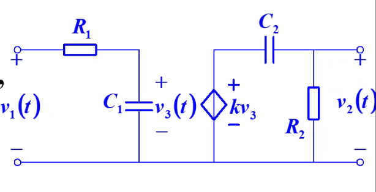
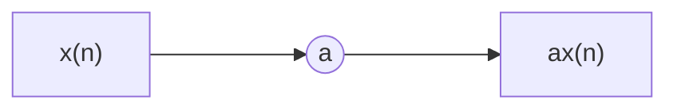
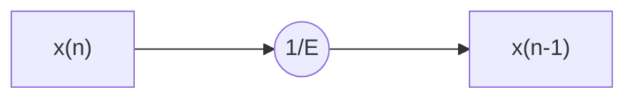

# Signals and Systems

---

## 4 拉普拉斯变换

---

### 4.1

introduction

---

Disadvantage of Fourier Transform

- 绝大部分的傅里叶反变换比较难求
- 不满足迪利克雷条件的信号无法求解

Solutions

- 引入广义函数 $u(t), \delta(t)$
- 利用 Laplace Transform
    - 求解简单，初始条件被自动计入
    - 但是物理概念不清晰

---

复频域分析的基本信号

$$
e^{st}, s = \sigma + j \omega
$$

$\sigma = 0$ 时退化为 Fourier Transform.

---

### 4.2

Definition of Laplace Transform

---

对于因果信号，令零时刻为起始时刻

$$
\begin{align*}
    &\forall t < 0, f(t) = 0 \\
    &\mathscr{F}[f(t)] = \int_{0}^{\infty} f(t) e^{-j \omega t} \mathrm{d} t
\end{align*}
$$

对于不满足迪利克雷条件的信号，引入衰减因子，使他满足绝对可积条件

$$
\begin{align*}
    \mathscr{\mathscr{L}}[f(t)] &= \int_{0}^{\infty} f(t) e^{-\sigma t} e^{-j \omega t} \mathrm{d} t \\
        &= \int_{0}^{\infty} f(t) e^{-st} \mathrm{d} t
\end{align*}
$$

---

Inverse Laplace Transform

$$
\begin{align*}
    f(t)e^{-\sigma t} &= \frac{1}{2\pi} \int_{-\infty}^{\infty} F(s) e^{j \omega t} \mathrm{d} \omega \\
    f(t) &= \frac{1}{2\pi} \int_{-\infty}^{\infty} F(s) e^{st} \mathrm{d} \omega \\
        &= \frac{1}{j2\pi} \int_{\sigma-j\infty}^{\sigma+j\infty} F(s) e^{st} \mathrm{d}s & (\mathrm{d}s = j \mathrm{d} \omega)
\end{align*}
$$

---

采用 $0_{-}$ 系统

$$
F(s) = \int_{0_{-}}^{\infty} f(t) e^{-st} \mathrm{d}t
$$

---

convergence of Laplace Transform

$$
\begin{align*}
    &\int_{-\infty}^{\infty} | e^{-\sigma t} f(t) | \mathrm{d} t < \infty \\
    & \lim_{t \rightarrow \infty } e^{-\sigma t} f(t) = 0 \\
    & \sigma > \sigma_{0} 
\end{align*}
$$

Region of Convergence: $\sigma > \sigma_{0}$.

---

$$
\begin{align*}
    & \lim_{t \rightarrow \infty} t^{n} e^{-\sigma t} = 0 & (\sigma > 0) \\
    & \lim_{t \rightarrow \infty} e^{\alpha t} e^{-\sigma t} = 0 & (\sigma > \alpha) \\
    & \lim_{t \rightarrow \infty} e^{t^{2}} e^{-\sigma t} = \infty 
\end{align*}
$$

---

$$
\begin{align*}
    \mathscr{L}[u(t)] &= \int_{0}^{\infty} e^{-st} \mathrm{d}t = \frac{1}{s} \\
    \mathscr{L}[\delta(t-t_{0})] &= \int_{0}^{\infty} \delta(t-t_{0}) e^{-st} \mathrm{d} t = e^{-st_{0}} \\
    \mathscr{L}(e^{\alpha t}) &= \int_{0}^{\infty} e^{-(s-a)t} \mathrm{d} t  = \frac{1}{s-a} \\
    \mathscr{L}(t^{n}) &= \frac{n!}{s^{n+1}}
\end{align*}
$$

---

$$
\begin{align*}
    \mathscr{L}(\cos \omega t) &= \frac{s}{s^{2}+\omega^{2}} \\
    \mathscr{L}(\sin \omega t) &= \frac{\omega}{s^{2}+\omega^{2}} \\
\end{align*}
$$

More Details in [Laplace Transformation](IntegralTransforms#Laplace Transformation)

---

### 4.3

Basic Properties of Laplace Transformation

---

- Linearity
- Derivative & Integration
    - $t$ domain
    - $s$ domain
- Shifting
    - $t$ domain
    - $s$ domain
 - Scaling
     - $t$ domain

---

电容的 $s$ domain 模型

$$
\begin{align*}
    v_{C}(t) &= \frac{1}{C} \int_{-\infty}^{t} i_{C}(\tau) \mathrm{d} \tau \\
    v_{C}(t) &= 
\end{align*}
$$

???

---

初值定理

Condition: $f(t)$ and $f'(t)$ 可以进行 Laplace Transform

Conclusion

$$
f(0_{+}) = \lim_{t \rightarrow 0_{+}} f(t) = \lim_{s \rightarrow \infty} s F(s)
$$

---

Proof:

$$
\begin{align*}
    sF(s) - f(0) &= \mathscr{L}(f'(t)) \\
        &= \int_{0_{-}}^{0^{+}} f'(t) e^{-st} \mathrm{d}t + \int_{0^{+}}^{\infty} f'(t) e^{-st} \mathrm{d}t \\
        &= \int_{0_{-}}^{0^{+}} e^{-st} \mathrm{d}[f(t)] + \int_{0^{+}}^{\infty} f'(t) e^{-st} \mathrm{d}t \\
        &= f(0_{+}) - f(0_{-}) + \int_{0_{+}}^{\infty} f'(t) e^{-st}\mathrm{d}t \\
    sF(s) &= f(0_{+}) + \int_{0^{+}}^{\infty} f'(t) e^{-st} \mathrm{d} t \\
    \lim_{s \rightarrow \infty} sF(s) &= f(0_{+}) + \int_{0^{+}}^{\infty} f'(t) \lim_{s \rightarrow \infty} e^{-st} \mathrm{d} t \\
        &= f(0^{+})
\end{align*}
$$

---

修正？???

---

终值定理

Condition: $f(t)$ and $f'(t)$ 可以进行 Laplace Transform

Conclusion

$$
f(\infty) = \lim_{t \rightarrow \infty} f(t) = \lim_{s \rightarrow 0} s F(s)
$$

---

### 4.4

Inverse Laplace Transform

---

- 部分分式分解
    - 一阶实数极点
    - 重根情况
    - 共轭复数根
    - 假分式
- 留数法

---

一阶实数极点

$$
\begin{align*}
    F(s) &= A(s)/B(s)\\
        &= \frac{A(s)}{\prod_{i=1}^{n}(s-s_{i})} \\
        &= \sum_{i=1}^{n} \frac{k_{i}}{s-s_{i}} \\
    k_{i} &= \lim_{s \rightarrow s_{i}} (s - s_{i})F(s)
\end{align*}
$$

---

重根情况

$$
\begin{align*}
    F(s) &= \sum_{i=1}^{n} \frac{k_{i}}{(s-s_{0})^{i}} \\
    k_{i} &= \frac{1}{(n-i)!} \lim_{s \rightarrow s_{0}} \frac{\mathrm{d}}{\mathrm{d}s} [ (s-s_{0})^{n} F(s) ]
\end{align*}
$$

---

共轭复数根情况

$$
\begin{align*}
    F(s) &= \sum_{i=1}^{n} \frac{k_{i}}{s-s_{i}} \\
    s_{i} = s_{j}^{*} & \Rightarrow k_{i} = k_{j}^{*} \\
\end{align*}
$$

---

假分式

$$
\begin{align*}
    F(s) &= p_{m-n}(s) + F'(s) \\
    \mathscr{L}^{-1}(1) &= \delta(s) \\
    \mathscr{L}^{-1}(s) &= \delta'(s) \\
    & \cdots
\end{align*}
$$

---

含有 $e^{-\alpha s}$ 项的非有理式

使用 $t$-shifting 性质

$$
\begin{align*}
    F(s) &= e^{-\alpha s} G(s) \\
    f(t) &= g(t - \alpha) u(t - \alpha)
\end{align*}
$$

---

### 4.5

$s$ 域电路分析

---

分析步骤

1. 列 $s$ 域方程
    - 列 $t$ 域方程，用 Laplace Tranform 转化成 $s$ 域方程
    - 直接套用元件的 $s$ 域模型
2. 求解 $s$ 域方程
3. Inverse Laplace Transform

---

从 $t$ 域方程到 $s$ 方程，可以不考虑零点跳变。

$$
\begin{align*}
    \mathscr{L}\left[\frac{\mathrm{d}f(t)}{\mathrm{d}t}\right] &= s F(s) - f(0_{-}) \\
    \mathscr{L}\left[\frac{\mathrm{d}^{2}f(t)}{\mathrm{d}t^{2}}\right] &= s^{2} F(s) - sf(0_{-}) - f'(0_{-}) \\
\end{align*}
$$

---

电阻

$$
\begin{align*}
    U_{R}(t) &= R I_{R}(t) \\
    U_{R}(s) &= R I_{R}(s) \\
\end{align*}
$$

---

电感

$$
\begin{align*}
    u_{L}(t) &= L \frac{\mathrm{d}i_{L}(t)}{\mathrm{d}t} \\
    U_{L}(s) &= Ls I_{L}(s)  - Li_{L}(0_{-})
\end{align*}
$$

---

电容

$$
\begin{aligned}
    &v_{C}(t)=\frac{1}{C} \int_{-\infty}^{t} i_{C}(\tau) \mathrm{d} t \\
    &V_{C}(s)=I_{C}(s) \frac{1}{s C}+\frac{1}{s} v_{C}\left(0_{-}\right)
\end{aligned}
$$

---

### 4.6

系统函数

---

$$
r_{zs}(t) = e(t) * h(t) \Rightarrow R_{zs}(s) = E(s)H(s)
$$

取 $e(t) = \delta(t)$

$$
H(s) = R_{zs} = \mathscr{L}[r(t)] = \mathscr{L}[h(t)]
$$

---

几种系统函数

- 策动点函数：激励和响应在同一个端口
    - 策动点导纳
    - 策动点电阻
- 转移函数
    - 转移导纳
    - 转移电阻
    - 电压比
    - 电流比

---

可以利用 $s$ 域元件模型图求解网络函数

$$
H(s) = \frac{R_{zs}(s)}{E(s)}
$$

其实求的是零状态响应，不用考虑 $s$ 域元件模型的 $0_{-}$ 状态。

---

联结方式

- 并联

$$
h(t) = h_{1}(t) + h_{2}(t) \Rightarrow H(s) = H_{1}(s) + H_{2}(s)
$$

- 串联

$$
h(t) = h_{1}(t) * h_{2}(t) \Rightarrow H(s) = H_{1}(s) H_{2}(s)
$$

- 反馈

$$
\begin{align*}
    & E_{2}(s) = E(s) - E_{1}(s) \\
    & R(s) = E_{2}(s) H_{1}(s) \\
    & E_{1}(s) = R(s) H_{2}(s) \\
    & H(s) = \frac{R(s)}{E(s)} = \frac{H_{1}(s)}{1 + H_{1}(s)H_{2}(s)}
\end{align*}
$$

---

### 4.7

系统函数的零点、极点

---

Laplace Transform region of convergence is the **intersection** of each Laplace Transform.

---

$$
X(s) = \frac{A_{p_{1}}(s)}{B_{p_{2}}(s)} = M \frac{\prod_{i=1}^{p_{1}} (s-\alpha_{i})}{\prod_{i=1}^{p_{2}} (s-\beta_{i})}
$$

- 零点 $\alpha_{i}$ （用空心圆表示）
- 极点 $\beta_{i}$ （用叉号表示）

可以在复平面上画出零极点图。

---

如果网络函数只有一重极点

$$
\begin{align*}
    H(s) &= \sum_{i=1}^{n} \frac{K_{i}}{s - p_{i}} \\
    h(t) &= \sum_{i=1}^{n} K_{i} e^{p_{i}t}
\end{align*}
$$

如果网络函数含有多重极点，将一重极点的结果乘以对应的 $t$ 的幂次就可以了。

---

对于物理可行的稳定系统

$$
t \rightarrow \infty , h(t) \rightarrow 0
$$

极点落在复平面的左半平面上。

如果极点落在虚轴上，要进一步判断极点的重数。重数大于一的极点落在虚轴上一定不稳定。

---

零状态响应的自由响应分量和强迫响应分量

$$
\begin{align*}
    E(s) &= \frac{\sum_{l=1}^{u}(s-z_{l})}{\sum_{k=1}^{v}(s-p_{k})} = \sum_{k=1}^{v} \frac{A_{k}}{s-p_{k}} \\
    H(s) &= \frac{\sum_{j=1}^{m}(s-z_{j})}{\sum_{i=1}^{n}(s-p_{i})} = \sum_{i=1}^{n} \frac{A_{i}}{s-p_{i}} \\
    R(s) &= \sum_{i=1}^{n} \frac{A_{i}}{s-p_{i}} + \sum_{k=1}^{v} \frac{A_{k}}{s-p_{k}}\\
    r(t) &= \sum_{i=1}^{n} A_{i} e^{p_{i}t} + \sum_{i=1}^{v} A_{k} e^{p_{k}t}
\end{align*}
$$

第一项为自由响应，第二项为强迫响应。

两者相加的过程中，有可能相加为零，丢失某个频率。

---

暂态响应和稳态响应

- 暂态响应 $\mathrm{Re} (p) < 0$
- 稳态响应 $\mathrm{Re} (p) = 0$

---

### 4.8

频响特性

---

定义：系统在正弦信号激励下稳态响应随频率变化的情况

$$
H(j \omega)
$$

前提：系统是**稳定**的**因果**系统（极点全部位于左半复平面）$\lim_{t \rightarrow \infty} h(t) = 0$

---

系统函数 $H(s)$，激励 $e(t) = E_{m} \sin (\omega_{0} t)$，设系统的稳态响应：

$$
r_{mm}(t) = E_{m} H_{0} \sin(\omega_{0} t + \varphi_{0})
$$

则记频响特性

$$
\left. H(s) \right|_{s=j \omega_{0}} = H(j \omega_{0}) = H_{0} e^{j \varphi_{0}}
$$

???

---

几种常见滤波器

- 低通滤波器：低频导通，高频阻态
- 高通滤波器：高频导通，低频阻态
- 带通滤波器：某一段频率范围导通，其他阻态
- 带阻滤波器：某一段频率范围阻态，其他导通

---

根据零极点图绘制频响特性曲线

$$
H(j \omega) = \left. K \frac{\prod_{j=1}^{m}(s - z_{j})}{\prod_{i=1}^{n}(s - p_{i})} \right|_{s=j \omega}
$$

- 分子项 $j \omega - z_{j} = N_{j} e^{j \psi_{j}}$
- 分母项 $j \omega - p_{i} = M_{i} e^{j \theta_{i}}$

$$
\begin{align*}
    &|H(j \omega)| = K \frac{\prod_{j=1}^{m}N_{j}}{\prod_{i=1}^{n}M_{i}} \\
    &\varphi(\omega) = \sum_{j=1}^{m}\psi_{j} - \sum_{i=1}^{n}\psi_{i}
\end{align*}
$$

---

RC 高通

$$
\begin{align*}
    H(s) &= \frac{R}{R+\frac{1}{sC}} = \frac{s}{s+\frac{1}{RC}} \\
    N_{1} &= j \omega = \omega e^{j \frac{\pi}{2}} \\
    M_{1} &= j \omega + \frac{1}{RC} = \sqrt{\omega^{2} + \frac{1}{(RC)^{2}}} e^{j \arctan \omega RC} \\
    |H(j \omega)| &= \frac{\omega}{\sqrt{\omega^{2} + \frac{1}{(RC)^{2}}}} \\
    \varphi(j \omega) &= \frac{\pi}{2} - \arctan \omega RC = \arctan \frac{1}{\omega RC}
\end{align*}
$$

---

RC 低通

$$
H(s) = \frac{1}{RC} \cdot \frac{1}{s+\frac{1}{RC}}
$$

同理。

---

带通：低通和高通级联

$$
\begin{align*}
    H(s) &= \frac{1}{R_{1}C_{1}} \frac{1}{s+ \frac{1}{R_{1}C_{1}}} k \frac{s}{s + \frac{1}{R_{2}C_{2}}} \\
        &= \frac{ks}{R_{1}C_{1}\left(s+ \frac{1}{R_{1}C_{1}}\right)\left(s+ \frac{1}{R_{2}C_{2}}\right)} \\
\end{align*}
$$

如果令 $R_{1}C_{1} \ll R_{2}C_{2}$，那么在频率较小的时候，极点 $- \frac{1}{R_{1}C_{1}}$ 对函数的影响较小，可以仅仅受极点 $- \frac{1}{R_{2}C_{2}}$ 和原点零点的影响，为高通滤波器；在频率较大的时候，可以看作仅仅受极点 $- \frac{1}{R_{1}C_{1}}$ 的影响，为低通滤波器。

$$
\left. H(j \omega) \right|_{\frac{1}{R_{2}C_{2}} < \omega <  \frac{1}{R_{1}C_{1}}} \approx \frac{k}{R_{1}C_{1}} \frac{j \omega}{\frac{1}{R_{1}C_{1}} \cdot j \omega } = k
$$

---

### 4.10

全通网络

---

全通网络：对于所有频率的正弦波，都能按照同样的幅度传输系数通过，不发生线性失真。

$$
H(j \omega) = C
$$

零极点图：零点位于右半复平面，极点位于左半复平面，关于虚数轴镜像对称。

$$
H(j \omega) = K \frac{\prod_{i=1}^{n} (j \omega - z_{i})}{\prod_{i=1}^{n} (j \omega - p_{i})}
$$

???

---

最小相移系统：零点全部位于左半复平面。
???

---

### 4.11

线性系统的稳定性

---

定义：BIBO，有界输入得到有界零状态输出。

充分必要条件

$$
\int_{-\infty}^{\infty} |h(t)| \mathrm{d} t < \infty
$$

---

Proof:

充分性

$$
\begin{align*}
    r(t) &= \int_{-\infty}^{\infty} h(\tau) e(t - \tau) \mathrm{d} t \\
        & \leq M_{e} \int_{-\infty}^{\infty} h(\tau) \mathrm{d}t \\
        & \leq M_{e} \int_{-\infty}^{\infty} |h(\tau)| \mathrm{d}t \\
        & \leq M_{e}M_{h}
\end{align*}
$$

---

必要性

$$
\begin{align*}
    \exists e(t) &= \mathrm{sgn} [h(t)] \\
    r(t) &= \int_{-\infty}^{\infty} h(\tau) e(t - \tau) \mathrm{d} t \\
    r(0) &= \int_{-\infty}^{\infty} h(\tau) e(- \tau) \mathrm{d}t \\
        &= \int_{-\infty}^{\infty} |h(t)|\mathrm{d}t
\end{align*}
$$

---

系统稳定性的判据

- 时域：冲激响应绝对可积
- 频域：系统函数的极点
    - 极点全部位于左半平面：稳定
    - 存在极点位于右半平面：不稳定
    - 虚轴上存在一阶极点：临界稳定（实际不稳定）
    - 虚轴上存在高阶极点：不稳定

---

## 7 离散时间系统的时域分析

---

### 7.1

introduction

用序列表示离散信号的时候一定要标出 $n=0$ 的位置，前后加大括号。

---

### 7.2

离散时间信号——序列

---

前向差分

$$
\Delta x(n) = x(n+1) - x(n)
$$

后向差分

$$
\nabla x(n) = x(n) - x(n-1)
$$

重排：在重排的过程中，对于压缩（抽取：decimation），会有信息丢失（不可逆）；对于扩展（插值：interpolation），需要有信息补足（可逆）。

---

单位样值信号

$$
\delta(n) = \left\{\begin{aligned}
    0 && n \neq 0 \\
    1 && n = 0
\end{aligned}\right.
$$

$$
x(n) = \sum_{m=-\infty}^{\infty} x(m) \delta(n - m)
$$

---

单位阶跃信号

$$
u(n) = \left\{\begin{aligned}
    1 && n \geq 0 \\
    0 && n < 0
\end{aligned}\right. = \sum_{k=0}^{\infty} \delta(n - k)
$$

$u(0) = 1$

---

矩形序列

$$
R(n) = \left\{\begin{align*}
        1 && 0 \leq n \leq N-1 \\
        0 && \text{else}
    \end{align*}\right. = u(0) - u(n - N)
$$

---

斜变序列

$$
S(n) = n u(n)
$$

---

单边指数序列

$$
x(n) = a^{n} u(n)
$$

- 当 $a < -1$，震荡发散
- 当 $-1 < a < 0$，震荡衰减

---

正弦序列

$$
x(n) = \sin \omega_{0} n
$$

离散域中的频率量纲为**弧度**。

$$
\omega_{0} \in (-\pi, \pi)
$$

---

周期序列的条件：$x(n+N) = x(n)$

1. $\frac{2\pi}{\omega_{0}}= N$ 正整数
2. $\frac{2\pi}{\omega_{0}}= \frac{N}{m}$ 有理数
3. $\frac{2\pi}{\omega_{0}}\notin Q$ 不是周期序列

---

复指数序列

$$
\begin{align*}
    &x(n) = e^{j \omega_{0} n} = \cos \omega_{0} n + j \sin \omega_{0} n \\
    & |x(n)| = 1 \\
    & \mathrm{arg} x(n) = \omega_{0} n
\end{align*}
$$

---

### 7.3

离散时间系统的数学模型

---

仍然只研究线性、时不变、因果系统。

因果性：系统响应不能出现在激励之前。

差分方程

举例：人口增长（响应）和国外净移民（激励）

$$
\begin{align*}
    & y(n+1) - (1+a-b)y(n) = x(n)
\end{align*}
$$

---

从微分方程到差分方程

$$
\begin{align*}
    & \frac{\mathrm{d}y}{\mathrm{d}t} = ay(t) + f(t) \\
    & \frac{\mathrm{d}y}{\mathrm{d}t} \approx \frac{y(t)-y(t-T)}{T} \approx \frac{y(t+T)-y(t)}{T} \\
    & y(t) = y(nT) \rightarrow y(n) \\
    & x(t) = x(nT) \rightarrow x(n) \\
    & \frac{y(n) - y(n-1)}{T} = a y(n) + f(n) \\
    & y(n) + \frac{1}{1+aT} y(n-1) + \frac{T}{1+aT} f(n)
\end{align*}
$$

---

标量乘法器

延时器：移位寄存器

---

差分方程通用形式

$$
\sum_{k=0}^{N} a_{k} y(n - k) = \sum_{r=0}^{M} b_{r} x(n - r)
$$

阶数：==响应==变量最高和最低序号的差数 $N$

---

### 7.4

线性常系数差分方程的求解

---

迭代法：基础解法，但是无法得到解析解

---

时域经典法：齐次解 + 通解

$$
\begin{align*}
    &\sum_{k=0}^{N} a_{k} y(n - k) = \sum_{r=0}^{M} b_{r} x(n - r) \\
    & \sum_{k=0}^{N} a_{k} y(n - k) = 0 \\
    & \sum_{k=0}^{N} a_{k} r^{k} = 0
\end{align*}
$$

- 无重根 $y_{h}(n) = \sum_{k=1}^{N} C_{k} r_{k}^{n}$
- 有重根 $y_{h}(n) = \sum_{i=1}^{m} C_{i}n^{m-i}r_{i}^{n} + \sum_{j=m+1}^{N} C_{j} r_{j}^{n}$
- 有共轭复根

---

差分方程的边界条件

$$
\{ y(-1), \cdots, y(-N) \}
$$

---

特解

和连续时域相同

---

## 8 z 变换和离散系统的 z 域分析

---

## 8.1

introduction

---

ZT 在离散系统中的低位等同于 LT 在连续系统中的低位。

---

## 8.2

ZT 的定义、典型离散信号的 ZT

---

抽样信号的 LT
