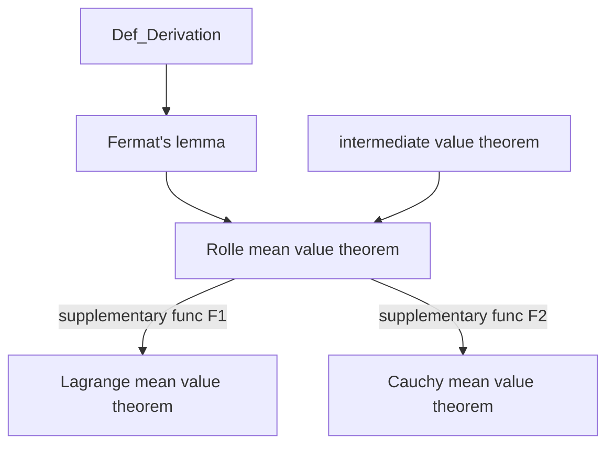

# Calculus1

limit, derivative and mean value theorem

## Concepts

### 极限

Two Important Limitations

$$
\begin{aligned}
    \sin x &< x < \tan x \\
    1 &< \frac{x}{\sin x} < \frac{1}{\cos x} \\
    \cos x &< \frac{\sin x}{x} < 1 \\
    &\lim_{x \rightarrow 0} \frac{\sin x}{x} = 1
\end{aligned}
$$

$$
\begin{aligned}
    A_n &= (1 + \frac{1}{n})^n \\
    &= \sum_{k=0}^{n} \binom{n}{k} \frac{1}{n^k} \\
    A_{n+1} &= \sum_{k=0}^{n+1} \binom{n+1}{k} \frac{1}{(n+1)^k} \\
    &\binom{n+1}{k} \frac{1}{(n+1)^k} - \binom{n}{k} \frac{1}{n^k} \\
    &= \frac{1}{k!} [(1 - \frac{1}{n+1})(1 - \frac{2}{n+1}) \cdots (1 - \frac{k-1}{n+1}) \\
    &- (1 - \frac{1}{n})(1 - \frac{2}{n}) \cdots (1 - \frac{k-1}{n})] \\
    &>0 \\
    A_{n+1} &> A_n \\
    A_n &= 1 + 1 + \frac{n(n-1)}{2} \frac{1}{n^2} + \frac{n(n-1)(n-2)}{3 \times 2} \frac{1}{n^3} + \cdots \\
    &+ \frac{n(n-1) \cdots n(n-1) \cdots [n-(n-1)]}{n!} \frac{1}{n^n} \\
    &< 2 + \frac{1}{2!} + \frac{1}{3!} + \cdots + \frac{1}{n!} \\
    &< 2 + \frac{1}{2^1} + \frac{1}{2^2} + \cdots + \frac{1}{2^{n-1}} \\
    &< 3
\end{aligned}
$$

单调有界数列必有极限。

定义
$$
e = \lim_{n \rightarrow \infty} (1 + \frac{1}{n})^n
$$

---

在求数列极限的时候，假设 $a$ 为数列极限之前必须证明数列是收敛的。不然必然无法得到有意义的结果。

---

证明数列发散：

- 存在不收敛的子列
- 存在两个收敛的子列，但他们的极限不相等

证明函数发散：

可以将函数的自变量作为一个数列的极限，对于数列 $\{ f(x_n) \}$，应用上面的方法。基于以下定理：
$$
\lim_{x \rightarrow x_0} f(x) = A (\infty) \\
\iff \forall \{x_n\} \in \{\{x_n\}: \lim_{n \rightarrow \infty} x_n = x_0\}, \lim_{n \rightarrow \infty} f(x_n) = A (\infty)
$$

---

初等函数在**定义区间**内连续，而不是在**定义域**内连续。

因为对于仅仅在孤立点上有定义的初等函数（例如 $f(x) = \sqrt{\sin x -1}$），不存在极限的概念，也就不能说连续。

这一点和复变函数中解析函数的定义有相似之处。?

---

无穷大和无界的区别：

- 无穷大：数列的极限是无穷大
- 无界：包括了数列的极限是无穷大和数列不存在极限且上极限（或者下极限）是无穷大两种情况，对于后者，存在两个子列的极限不相等。

因此无穷大必定无界，无界不一定无穷大。

---

### 导数

---

微分的定义

$$
\begin{aligned}
    \Delta y &= f(x + \Delta x) - f(x) \\
    \Delta y &= A \Delta x + o(\Delta x)
\end{aligned}
$$
如果 A 是不依赖于 $\Delta x$ 的常数，那么记作微分：
$$
\mathrm{d} y = A \Delta x
$$

---

高阶导数

Lebniz Formula:
$$
(uv)^{(n)} = \binom{n}{k} u^{(k)} v^{(n - k)}
$$

基本初等函数的高阶导数：
$$
\begin{aligned}
    (x^{\mu})^{(n)} &= \mu (\mu - 1) \cdots (\mu - n + 1) x^{\mu - n} \\
    (a^x)^{(n)} &= a^x \ln^n a \\
    (\ln x)^{(n)} &= (-1)^{n-1} \frac{(n-1)!}{x^n} \\
    (\sin ax)^{(n)} &= a^n \sin(ax + \frac{n \pi}{2}) \\
    (\cos ax)^{(n)} &= a^n \cos(ax + \frac{n \pi}{2})
\end{aligned}
$$
注意幂函数的高阶导数可能不一定是上面的公式，有可能为 0.

---

在求解参数方程的导数以及高阶导数的时候要注意到参数方程的导函数也是参数方程的形式。

$$
\begin{cases}
x = x(t) \\
\frac{\mathrm{d}y}{\mathrm{d}x} = \frac{y'(t)}{x'(t)}
\end{cases}
$$

因此对于更高阶的导数：

$$
\begin{cases}
x = x(t) \\
\frac{\mathrm{d}^2 y}{\mathrm{d}t^2} = \frac{(\frac{y'(t)}{x'(t)})'}{x'(t)}
\end{cases}
$$

---

复合函数的导数

- $f'\left[g(x)\right]$: $f'(t)$ 在 $t = g(x)$ 处的取值。
- $\left\{f\left[g(x)\right]\right\}' = f'\left[g(x)\right] \cdot g'(x)$

---

### 中值定理和导数的应用

---

中值定理的逻辑关系：

满足 $F(a) = F(b)$ 的光滑函数 $F_1(x),F_2(x)$:
$$
F_1(x) = f(x) - \frac{f(b)-f(a)}{b-a} (x-a)
$$

$$
F_2(x) = f(x) - \frac{f(b)-f(a)}{g(b)-g(a)}g(x)
$$

---

用洛必达法则求得的极限不存在不代表极限不存在。举例：

$$
\begin{aligned}
    &\lim_{x \rightarrow \infty} \frac{x + \sin x}{x} = 1 \\
    &\lim_{x \rightarrow 0} \frac{x^2 \sin \frac{1}{x}}{\sin x} = \lim_{x \rightarrow 0} \frac{x}{\sin x} \lim_{x \rightarrow 0} \left( x \sin \frac{1}{x} \right) = 0
\end{aligned}
$$

---

泰勒中值定理的思想来源于逼近，即：
$$
\begin{aligned}
    &p(x) = \sum_{i=0}^{n} a_i (x-x_0)^i \\
    &\lim_{x \rightarrow x_0} \frac{f(x) - p(x)}{(x-x_0)^n} = 0 \\
    &a_i = \frac{f^{(i)}(x_0)}{i!}
\end{aligned}
$$
反复套用洛必达法则，就可以验证确实足够“逼近”。

当 $f(x)$ 在 $U(x_0)$ 处存在 $n+1$ 阶导数时，有更完备的结论。
$$
\forall x \in U(x_0), p(x) = \sum_{i=0}^{n} \frac{f^{(i)}(x_0)}{i!} (x-x_0)^i + \frac{f^{(n+1)}(\xi)}{(n+1)!} (x-x_0)^{n+1} \ (\xi \in (x_0, x))
$$
这里的 $\xi$ 和 Lagrange 中值定理中的 $\xi$ 有相似之处。(n=0)

---

Definitions in the Applications of Derivatives

极大（小）值：$x_0 \in (a,b)$ where $f(x)$ exists.
$$
\exists \delta > 0, \forall x \in \overset{o}{U}(x_0, \delta), f(x) <(>) f(x_0)
$$
极值与极值点。

函数如果在极值点存在导数，那么导数一定为 0.(Fermat's lemma)

导数为零的点称为驻点。驻点不都是极值点。

函数的凹凸性：Continuous $f(x)$ in (a,b).
$$
\forall x_1, x_2 \in (a,b), f(\frac{x_1 + x_2}{2}) <(>) \frac{f(x_1) + f(x_2)}{2} \\
$$
拐点：函数凹凸性的分界点，是**坐标**。

---

$f(x)$ 在包含 $x_0$ 的开区间内可导且 $f'(x_0)>0$，判断：$\exists \delta > 0, f(x)$ 在 $U(x_0, \delta)$ 上单调递增。

不一定：构造离谱函数:sob:
$$
f(x) = \begin{cases}
    0 & (x = 0) \\
    x + 2x^2 \sin \frac{1}{x} & (x \neq 0) \\
\end{cases}
$$
$$
\begin{aligned}
    &f'(0) = \lim_{x \rightarrow 0} \frac{x + 2x^2 \sin \frac{1}{x}}{x} \\
    &= 1 + \lim_{x \rightarrow 0} 2x \sin \frac{1}{x} = 1 \\
    &x \neq 0, f'(x) = 1 + 4x \sin \frac{1}{x} - 2 \cos \frac{1}{x} \\
    &x = \frac{1}{\pi(2k + 1/2)}, f'(x) = 1 + \frac{4}{\pi(2k + 1/2)} > 0 \\
    &x = \frac{1}{2k \pi}, f'(x) = -1 < 0
\end{aligned}
$$

当 $x \rightarrow 0$，单调区间无穷小，不存在这样的邻域。

---

$(0, +\infty)$ 上的可导函数 $f(x)$: $\lim_{x \rightarrow + \infty} f(x) = 0$，是否一定有 $\lim_{x \rightarrow + \infty} f'(x) = 0$？

不一定：反例如下。
$$
\begin{aligned}
    &f(x) = \frac{\sin x^2}{x} \\
    &f'(x) = 2 \cos x^2 - \frac{\sin x^2}{x^2}
\end{aligned}
$$

---

## Exercise

---

### 极限练习

---

I

$$
\begin{aligned}
\lim _{x \rightarrow+\infty}(\sin \sqrt{x+1}-\sin \sqrt{x}) & = \lim _{x \rightarrow+\infty} 2 \cos \frac{\sqrt{x+1}+\sqrt{x}}{2} \sin \frac{\sqrt{x+1}-\sqrt{x}}{2} \\ & = \lim _{x \rightarrow+\infty} 2 \cos \frac{\sqrt{x+1}+\sqrt{x}}{2} \sin \frac{1}{2(\sqrt{x+1}+\sqrt{x})}
\end{aligned}
$$

***Attention***:
一般来说，和差的极限都不能直接算，需要先转化称因式乘积的形式。

---

II

$$
\begin{aligned}
\lim_{x \rightarrow + \infty} \left(\frac{x-1}{x}\right)^{\sqrt{x}} &= \lim_{x \rightarrow + \infty} \left(\frac{\sqrt{x}-1)(\sqrt{x}+1)}{\sqrt{x} \cdot \sqrt{x}}\right)^{\sqrt{x}} \\
&= \lim_{x \rightarrow + \infty} \left(\frac{\sqrt{x}-1}{\sqrt{x}}\right)^{\sqrt{x}} \left(\frac{\sqrt{x}+1}{\sqrt{x}}\right)^{\sqrt{x}} \\
&= e^{-1} e \\
&= 1
\end{aligned}
$$

---

III

$$
\begin{aligned}
\lim_{x \rightarrow 0} (\cos x)^{\frac{1}{\sin^2 x}}
&= \lim_{x \rightarrow 0} e^{\frac{\ln \cos x}{\sin^2 x}} \\
&\overset{c = \cos x}{=} \lim_{c \rightarrow 1} e^{\frac{\ln c}{1 - c^2}} \\
&= \lim_{c \rightarrow 1} e^{-\frac{1}{c+1} \cdot \frac{\ln c}{c - 1}} \\
&= e^{-\frac{1}{2}}
\end{aligned}
$$

***Attention***:
把幂的问题转化成指数是通用方法。相似的还有下面的问题：

$$
\begin{aligned}
\lim_{x\rightarrow 0} (\frac{a^x +b^x + c^x}{3})^{\frac{1}{x}}
&= \exp \lim_{x \rightarrow 0}( \frac{1}{x} \ln \frac{a^x + b^x + c^x}{3}) \\
&= \exp \lim \frac{1}{x} \ln (1 + \frac{a^x -1 + b^x -1 + c^x -1}{3}) \\
&= \exp \frac{1}{3} \lim \left[ (\frac{a^x - 1}{x}) + (\frac{b^x - 1}{x}) + (\frac{c^x - 1}{x}) \right ] \\
&= \sqrt[3]{abc}
\end{aligned}
$$

---

IV

$x_1 = 1; x_{n+1} = 1 + \frac{x_n}{x_n + 1}; ?: \lim_{x \rightarrow \infty} x_n$

**单调有界数列必有极限**。

- 单调：
    $$
    \begin{aligned}
        x_2 - x_1 &= x_2 - 1 = \frac{x_1}{x_1 + 1} \\
        \forall n \geq 2, &\text{Suppose } x_n > x_{n-1} \\
        x_{n+1} - x_{n} &= \frac{x_n}{x_n+1} - \frac{x_{n-1}}{x_{n-1}+1} \\
        &= \frac{x_n - x_{n-1}}{(1 + x_n)(1 + x_{n-1})} \\
        &>0
    \end{aligned}
    $$
- 有界：
    $$
    x_1 < 2 \\
    \forall n \geq 2, x_n = \frac{x_{n-1}}{x_{n-1} + 1} + 1 < 2 \\
    $$
因此存在极限，记$\lim_{n \rightarrow \infty} x_n = a$
$$
a = 1 + \frac{a}{a+1} \Rightarrow a = \frac{1 \pm \sqrt{5}}{2}
$$
Due to $a > 0$, $\lim_{n \rightarrow \infty} x_n = a = \frac{1 + \sqrt{5}}{2}$

***Attention***:
利用数学归纳法证明数列递增的技巧。

---

V

介值定理例题：

Continuous $f(x)$ on $[a,b]$, $a<c<d<b$.

To prove:
$$
\forall \alpha, \beta \in R^+, \exists \xi \in [a,b], f(\xi) (\alpha + \beta) = \alpha f(c) + \beta f(d)
$$

*Sol*:

Suppose $m = \min f(x), M = \max f(x)$ on [a,b].

$$
m \leq \frac{\alpha f(c) + \beta f(d)}{\alpha + \beta} \leq M
$$

根据介值定理：

$$
\forall y \in [m, M], \exists \xi \in [a, b], f(\xi) = y
$$

Q.E.D

***Attention***:
这里使用的是介值定理的值域推论。

---

VI

承接上面的题:cry:

Continuous $f(x)$ on (a,b), $\forall i \in \{1,2,3,\cdots,n\},x_i \in (a,b), t_i > 0, \sum_{i=1}^n t_i = 1$

To prove:
$$
\exists \xi \in (a,b), f(\xi) = \sum_{i=1}^{n} t_i f(x_i)
$$

*Sol*:

$$
a_i = f(x_i): \max a_i = M, \min a_i = m \\
\text{Suppose } m = f(x'), M = f(x'') \\
\sum_{i=1}^{n} t_i f(x_i) \in [m, M]
$$

根据介值定理：

$$
\forall y \in [m, M], \exists \xi \in [x', x''], f(\xi) = y
$$

Q.E.D

***Attention***:
这里不是闭区间连续，所以进行了特殊处理。

---

### 导数练习

---

I 对数函数的定义

对于 f(x) on $(0, + \infty)$，存在 $f'(1)$，且：
$$
\forall x, y \in (0, +\infty), f(xy) = f(x) + f(y)
$$
求：$f'(x)$

*Sol*: get it by definition.

$$
\begin{aligned}
    f'(x) &= \lim_{\Delta x \rightarrow 0} \frac{f(x + \Delta x) - f(x)}{\Delta x} \\
    &= \frac{1}{x} \lim_{\Delta x \rightarrow 0} \frac{f[x(1+ \frac{\Delta x}{x})] - f(x)}{\frac{\Delta x}{x}} \\
    &= \frac{1}{x} \lim_{\Delta x \rightarrow 0} \frac{f(1 + \frac{\Delta x}{x})}{\frac{\Delta x}{x}}
\end{aligned}
\\
f(1) = f(x) - f(x) = 0 \Rightarrow f'(x) = \frac{1}{x} f'(1)
$$

***Attention***:
没有什么好 Attention 的:cry:。根据定义拆开就好了。

---

II 参数方程的导函数
$$
\begin{cases}
    x = 3t^2 + 2t + 3 \\
    e^y \sin t -y + 1 = 0 \\
\end{cases} \\
?: \left.\frac{\mathrm{d}^2 y}{\mathrm{d} x^2}\right|_{t=0}
$$

*Sol*:
$$
\begin{aligned}
    &\mathrm{d} x = (6t + 2)\mathrm{d} t \\
    &e^y \sin t \mathrm{d} y + e^y \cos t \mathrm{d} t - \mathrm{d} y = 0 \\
    &(6t+2)(1 - e^y \sin t) \frac{d y}{d x} = e^y \cos t \\
    &\ln(6t+2) + \ln (1-e^y \sin t) + \ln \frac{dy}{dx} = y + \ln \cos t \\
    & \frac{1}{t+\frac{1}{3}}dt + \frac{-1}{1-e^y \sin t}(e^y \sin t dy + e^y \cos t dt) + \frac{1}{\frac{dy}{dx}} d \frac{dy}{dx} \\
    & = dy - \tan t dt
\end{aligned}
$$

$$
t=0 \Rightarrow \begin{bmatrix}
    x \\ y
\end{bmatrix} = \begin{bmatrix}
    3 \\ 1
\end{bmatrix} \\
dx = 2 dt, dy = e dt \\
\frac{dy}{dx} = \frac{e}{2} \\
$$
代入：
$$
\begin{aligned}
    &3 dt - e dt + \frac{2}{e} d \frac{dy}{dx} = dy \\
    &d \frac{dy}{dx} = \frac{e}{2} dy - \frac{e(-e+3)}{2} dt \\
    &= \frac{e^2}{4} dx - \frac{e(-e+3)}{4} dx \\
    &= \frac{2e^2-3e}{4} dx \\
    & \frac{d^2 y}{d x^2} = \frac{2e^2-3e}{4}
\end{aligned}
$$

***Attention***:
计算过程中尽量不要出现分式。

---

III 求 $\left.(\arctan x)^{(n)}\right|_{x = 0}$

*Sol*:

Suppose $y = \arctan x, y' = \frac{1}{1 + x^2}$
$$
\begin{aligned}
    &(1 + x^2) y' = 1 \\
    &\left[(1+x^2)y'\right]^{(n)} = 0 \\
\end{aligned}
$$
Apply Lebniz Formula, considering:
$$
\begin{aligned}
    &(1+x^2)' = 2x \\
    &(1+x^2)'' = 2 \\
    &(1+x^2)^{(n)} = 0 \ (n \geq 3)
\end{aligned}
$$
Get:
$$
\begin{aligned}
    &(1+x^2) y^{(n+1)} + 2nx y^{(n)} + n(n-1) y^{(n-1)} = 0 \\
    &x=0 \Rightarrow y^{(n+1)} + n(n-1) y^{(n-1)} = 0 \\
    & y^{(n+1)} = - n(n-1) y^{(n-1)} \\
\end{aligned}
$$
Consider $y(x=0) = 0, y'(x=0) = 1$,
Result:
$$
y{(n)} = \begin{cases}
    0 & n = 2m \\
    (-1)^m (2m)! & n = 2m+1 \\
\end{cases} m = 0,1,2,\cdots
$$
***Attention***:
同理，不要出现分式，转化成因式乘积以后应用莱布尼兹公式。

---

IV

$$
\begin{cases}
    x = 2t + |t| \\
    y = 5t^2 + 4t |t|
\end{cases}, ?: \left.\frac{dy}{dx}\right|_{t=0}
$$

*Sol*:
$$
\begin{aligned}
    \left.\frac{dy}{dx}\right|_{t=0}
    &= \lim_{\Delta t \rightarrow 0} \frac{5 \Delta t^2 + 4 \Delta t |\Delta t|}{2 \Delta t + |\Delta t|} \\
    &= \lim_{\Delta t \rightarrow 0} \Delta t \frac{5+4 \frac{|\Delta t|}{\Delta t}}{2 + \frac{|\Delta t|}{\Delta t}} \\
    &= 0
\end{aligned}
$$

***Attention***:
直接上定义。因为 $t=0$ 时，$\frac{dy}{dt},\frac{dx}{dt}$ 不存在。

---

V

Continuous $f(x)$ with $f'(0)$ existing.
$$
\forall x, y \in U(0,\delta), f(x+y) = \frac{f(x)+f(y)}{1-4f(x)f(y)}
$$
To prove:

- $\forall x \in U(0,\delta), f(x)$ is differentiable.
- If $f'(0) = \frac{1}{2}, \ f(x) = \frac{\tan x}{2}$

*Sol*:

Suppose $y=0$:
$$
\forall x \in U(0,\delta),f(x) = \frac{f(x) + f(0)}{1 - 4 f(0)f(x)} \Rightarrow f(0) = 0
$$

$$
\begin{aligned}
    \lim_{y\rightarrow0} \frac{f(x+y)-f(x)}{y}
    &= \lim_{y\rightarrow0} \frac{1}{y} \left[\frac{f(x)+f(y)}{1-4f(x)f(y)}-f(x)\right] \\
    &= \lim_{y\rightarrow0} \frac{f(y)}{y} \cdot \frac{1+4f^2(x)}{1-4f(x)f(y)} \\
    &= f'(0) \left[1+4f^2(x)\right]
\end{aligned}
$$
$f(x)$ is differentiable.

$$
\begin{aligned}
    f'(x) &= f'(0) \left[1+4f^2(x)\right] \\
    \frac{df}{dx} &= \frac{1 + 4 f^2}{2} \\
    dx &= \frac{d(2f)}{1+(2f)^2} \\
    f(x) &= \frac{1}{2} \tan x
\end{aligned}
$$

***Attention***:
总之这类问题就是先要找到 0 点的函数值，然后直接根据定义求导函数。

---

VI

Continuous $f(x)$ on [a,b] that $f(a) = f(b) = 0, f'(a) f'(b) > 0$.

To prove:
$$
\exists \xi \in (a,b), f(\xi) = 0
$$

*Sol*:

不妨设 $f'(a)>0, f'(b)<0$.
$$
\begin{aligned}
    &\lim_{x\rightarrow a} \frac{f(x)-f(a)}{x-a} = f'(a) > 0 \\
    &\exists \delta_1>0, \forall x \in \overset{o}{U}(0,\delta_1), \frac{f(x)-f(a)}{x-a} > 0 \\
    &\exists c \in (a,a+\delta_1), f(c) > f(a) = 0 \\
    &\text{In a similar way, } \exists d \in (b-\delta_2, b), f(d) < f(b) = 0 \\
    &\exists \xi \in (c,d), f(\xi) = 0
\end{aligned}
$$

***Attention***:
图像化的思路大体上是容易想到的，主要就是利用极限的定义去说明这个事情。

---

### 中值定理和导数的应用练习

---

I

$$
\begin{aligned}
    \lim_{x\rightarrow0} \left[\frac{\ln(1+x)}{x}\right]^{\frac{1}{x}}
    &= \exp \lim_{x \rightarrow 0} \frac{1}{x} \ln \left[\frac{\ln(1+x)}{x}\right] \\
    &= \exp \lim_{x \rightarrow 0} \frac{x-(1+x)\ln(1+x)}{x(1+x)\ln(1+x)} & L'hospital Rule \\
    &= \exp \lim_{x \rightarrow 0} \frac{x-(1+x)\ln(1+x)}{x\ln(1+x)} & \lim_{x \rightarrow 0} \frac{1}{1+x} = 1 \\
    &= \exp \lim_{x \rightarrow 0} \left[ \frac{x-\ln(1+x)}{x\ln(1+x)} - 1 \right] \\
    &= \exp \lim_{x \rightarrow 0} \left[ \frac{1 - \frac{1}{1+x}}{\ln(1+x) + \frac{x}{1+x}} - 1 \right] & L'hospital Rule \\
    &= \exp \lim_{x \rightarrow 0} \left[ \frac{x}{x+(1+x)\ln(1+x)} -1 \right] \\
    &= \exp \lim_{x \rightarrow 0} \left[ \frac{1}{1+\ln(1+x) + \frac{\ln(1+x)}{x}} -1 \right] \\
    &= \exp \lim_{x \rightarrow 0} \left[ \frac{1}{1 + \frac{\ln(1+x)}{x}} -1 \right] \\
    &= \exp \lim_{x \rightarrow 0} \left[ \frac{1}{2} - 1 \right] & \lim_{x\rightarrow 0} \frac{\ln(1+x)}{x} = 1 \\
    &= \frac{1}{\sqrt{e}}
\end{aligned}
$$

---

II

Continuous on [0,1], derivable on (0,1) $f(x)$ that:

- $0<f(x)<1$
- $f'(x) \neq 1$

To prove:
$$
\exists \text{ unique } \xi \in (0,1), f(\xi) = \xi
$$

一道 Rolle mean value theorem 的典例。

*Sol*:

**Existence**:
$$
\begin{aligned}
    &F(x) = f(x) - x \\
    &F(0) = f(0) > 0 \\
    &F(1) = f(1) - 1 < 0 \\
    &\exists \xi \in (0,1), F(\xi) = 0
\end{aligned}
$$
**Uniqueness**:
$$
\begin{aligned}
    &\text{Suppose } \exists \xi_1, \xi_2 \in (0,1), \xi_1 < \xi_2, F(\xi_1) = F(\xi_2) = 0 \\
    &\exists \eta \in (\xi_1, \xi_2), F'(\eta) = 0 \\
    &f'(\eta) = 1
\end{aligned}
$$
Contradict.

Q.E.D

***Attention***:
构造辅助函数。

---

III

$f(x), g(x)$ on [a,b] with their existsing 2-order derivatives that $g''(x) \neq 0$.

$$
f(a) = f(b) = g(a) = g(b) = 0
$$
To prove:

- $\forall x \in (a,b), g(x) \neq 0$
- $\exists \xi \in (a,b), \frac{f(\xi)}{g(\xi)} = \frac{f''(\xi)}{g''(\xi)}$

*Sol*:
$$
g(x) = g'(\theta_1 x) (x-a) = g''(\theta_2 \theta_1 x) (x-a)^2 \neq 0
$$
$$
\begin{aligned}
    &\frac{f(\xi)}{g(\xi)} = \frac{f''(\xi)}{g''(\xi)} \Rightarrow f(\xi) g''(\xi) - g(\xi) f''(\xi) = 0 \\
    &f g'' + f' g' - f' g' - g f'' = 0 \\
    &(fg' - f'g)' = 0 \\
    &F(x) = f(x) g'(x) - f'(x) g(x), F(a) = F(b) = 0
\end{aligned}
$$
Apply the Rolle Theorem.

***Attention***:
第二问这里构造辅助函数的技巧和运动学中加速度的推导过程有点类似。

---

IV

$a \neq 0, f(x)$ is continuous on [a,b], derivable on (a,b).

To prove:
$$
\begin{aligned}
    \exists x_1, x_2, x_3 \in (a,b) \\
    f'(x_1) &= (a+b) \frac{f'(x_2)}{2x_2} \\
    & = (a^2 + ab + b^2) \frac{f'(x_3)}{3x_3^2}
\end{aligned}
$$

*Sol*:

$$
\begin{aligned}
    f'(x_1) &= (a+b) \frac{f'(x_2)}{2x_2} \\
    & = (a^2 + ab + b^2) \frac{f'(x_3)}{3x_3^2}
\end{aligned}
\iff
\begin{aligned}
    (b - a) f'(x_1) &= (b^2 - a^2) \frac{f'(x_2)}{2x_2} \\
    & = (b^3 - a^3) \frac{f'(x_3)}{3x_3^2}
\end{aligned}
$$

Apply Cauchy mean value theorem:
$$
\begin{aligned}
    \exists x_1 \in (a,b), &\frac{f(b)-f(a)}{b-a} = \frac{f'(x_1)}{1} \\
    \exists x_2 \in (a,b), &\frac{f(b)-f(a)}{b^2-a^2} = \frac{f'(x_2)}{2x_2} \\
    \exists x_3 \in (a,b), &\frac{f(b)-f(a)}{b^3-a^3} = \frac{f'(x_3)}{3x_3^2} \\
    f(b) - f(a)
    &= (b - a) f'(x_1) \\
    &= (b^2 - a^2) \frac{f'(x_2)}{2x_2} \\
    &= (b^3 - a^3) \frac{f'(x_3)}{3x_3^2}
\end{aligned}
$$

***Attention***:
难:sob:不过说实话立方和公式的影子还是挺明显的。

---

V 用 Taylor mean value theorem 证明函数的凸凹性与二阶导数的关系。

$$
\forall x \in (a,b), f''(x) < 0
$$
To prove:
$$
\forall x_1, x_2 \in (a,b), \forall 0<t<1, f[tx_1 + (1-t)x_2] \geq tf(x_1) + (1-t)f(x_2)
$$
*Sol*:

when $x_1=x_2$,
$$
\forall 0<t<1, f[tx_1 + (1-t)x_2] = tf(x_1) + (1-t)f(x_2)
$$
when $x_1 \neq x_2$, suppose $x_0 = tx_1 + (1-t)x_2$
$$
\begin{aligned}
    f(x_1) &= f(x_0) + f'(x_0)(x_1-x_0) + \frac{1}{2} f''(\xi)(x_1-x_0)^2 \\
    f(x_2) &= f(x_0) + f'(x_0)(x_2-x_0) + \frac{1}{2} f''(\xi)(x_2-x_0)^2
\end{aligned}
$$
$$
t = \frac{x_0 - x_2}{x_1 - x_2}
$$
$$
\begin{aligned}
    tf(x_1) + (1-t)f(x_2) &= f(x_0) + f'(x_0) \left[ t(x_1 - x_0) + (1-t)(x_2 - x_0) \right] \\
    &+ \frac{1}{2} f''(x_0) \left[ t(x_1 - x_0)^2 + (1-t)(x_2 - x_0)^2 \right] \\
    &> f(x_0)
\end{aligned}
$$
***Attention***:
这道题和之前的一道题（这道题前面没有记录）比较像，都是要取中间的点作为迭代起始点。第一眼看上去并不像可以用泰勒中值定理解答。

---

VI

$f(x)$ on [a,b] has 2-order derivative, $f'(a) = f'(b) = 0$.

To prove:
$$
\exists c \in (a,b), |f''(c)| \geq \frac{4}{(b-a)^2} |f(b) - f(a)|
$$

*Sol*:
$$
\begin{aligned}
    &f(\frac{a+b}{2}) = f(a) + f'(a) (\frac{b-a}{2}) + \frac{f''(\xi_1)}{2} (\frac{b-a}{2})^2 \\
    &f(\frac{a+b}{2}) = f(b) + f'(b) (\frac{a-b}{2}) + \frac{f''(\xi_2)}{2} (\frac{a-b}{2})^2 \\
    &f(b) - f(a) = \frac{f''(\xi_1)-f''(\xi_2)}{2} \frac{(b-a)^2}{4} \\
    &\frac{4}{(b-a)^2} |f(b) - f(a)| = \left| \frac{f''(a) - f''(b)}{2} \right| \\
    &\leq \frac{|f''(\xi_1)| + |f''(\xi_2)|}{2} \\
    &\leq |f''(c)|
\end{aligned}
$$
其中 $f''(c) = \max \{f''(\xi_1), f''(\xi_2)\}$

***Attention***:
还是要学会使用不等式的诸多结论。

---

VII

$f(x)$ on [0,1] has 2-order derivative, $|f'(x)| \leq a, |f''(x)| \leq b$.

To prove: $\forall x \in (0,1),|f'(x)| \leq 2a + \frac{b}{2}$

*Sol*:
$$
\begin{aligned}
    &\forall c \in (0,1), \forall x \in [0,1], f(x) - f(c) = f'(c)(x-c) + \frac{f''(c)}{2}(x-c)^2 \\
    &x=0, f(0) - f(c) = f'(c)(-c) + \frac{f''(\xi_1)}{2}(-c)^2 \\
    &x=1, f(1) - f(c) = f'(c)(1-c) + \frac{f''(\xi_2)}{2}(1-c)^2 \\
    &f(1) - f(0) = f'(c) + \frac{1}{2} \left[ f''(\xi_2) (1-c)^2 - f''(\xi_1) c^2 \right] \\
    &f'(c) = f(1) - f(0) + \frac{1}{2} \left[ f''(\xi_1) c^2 - f''(\xi_2) (1-c)^2 \right] \\
\end{aligned}
$$
$$
\begin{aligned}
    &f(1) - f(0) \leq 2a \\
    &\left[ f''(\xi_1) c^2 - f''(\xi_2) (1-c)^2 \right] \leq b [c^2 + (1-c)^2] \leq b \\
    &f'(c) \leq 2a + \frac{b}{2}
\end{aligned}
$$

***Attention***:
这道题就是上面 V&VI 两道题的思路的综合。既要学会在中间的点进行泰勒展开，又要学会必要的放缩技巧。

---

VIII

$$
\begin{aligned}
    \lim x^{\frac{3}{2}} ( \sqrt{x+2} - 2 \sqrt{x+1} + \sqrt{x})
\end{aligned}
$$
My answer: by Taylor series.
$$
\begin{aligned}
    &\lim x^{\frac{3}{2}} ( \sqrt{x+2} - 2 \sqrt{x+1} + \sqrt{x}) \\
    = &\lim x^{3/2} \cdot \sqrt{x} (\sqrt{1+2/x} - 2\sqrt{1+1/x} + 1) \\
    = &\lim x^2 (1 + \frac{1}{2} \frac{2}{x} - \frac{1}{8} \frac{4}{x^2} - 2\left(1 + \frac{1}{2} \frac{1}{x} - \frac{1}{8} \frac{1}{x^2}\right) + 1) \\
    = & - \frac{1}{4}
\end{aligned}
$$
Other answer: by L'hospital Priciple.

---

IX

$$
3f(x) + 4x^2f \left( - \frac{1}{x} \right) + \frac{7}{x} = 0
$$
求 $f(x)$ 极大值、极小值。

*Sol*:

事实上，这不是一个抽象函数问题，可以解出函数的具体形式。

$$
\begin{aligned}
    t &= - \frac{1}{x} \\
    0 &= 3 f(-\frac{1}{t}) + 4 \frac{1}{t^2} f(t) - 7t \\
    \begin{bmatrix}
        - \frac{7}{x} \\
        7x
    \end{bmatrix}
    &= \begin{bmatrix}
        3 & 4x^2 \\
        \frac{4}{x^2} & 3
    \end{bmatrix}
    \begin{bmatrix}
        f(x) \\
        f \left( - \frac{1}{x} \right)
    \end{bmatrix} \\
    f(x) &= 4x^3 + \frac{3}{x} \\
    f'(x) &= 12 x^2 - \frac{3}{x^2} \\
    f''(x) &= 24 x + \frac{6}{x^3} \\
\end{aligned}
$$
极大值：$f(-1/\sqrt{2}) = -4 \sqrt{2}$

极小值：$f(1/\sqrt{2}) = 4 \sqrt{2}$

***attention***:
先想想能不能直接求出函数。

---

X

Function $f(x)$ has 5-order derivatives in $U(x_0)$.
$$
f'(x_0) = f''(x_0) = f'''(x_0) = f^{x4)}(x_0) = 0, f^{(5)}(x_0) > 0
$$
分析 $x_0$ 在函数中的地位（极值点？拐点？）。

*Sol*:

$$
f^{x4)}(x_0) = 0, f^{(5)}(x_0) > 0
$$
因此 $x_0$ 是 $f'''(x)$ 的极小值。
$$
\forall x \in \overset{o}{U} (x_0), f'''(x) < f'''(x_0) = 0
$$
因此 $f''(x)$ 在 $U(x_0)$ 上单调递增
$$
f''(x) \begin{cases}
    < 0 & (x < x_0) \\
    > 0 & (x > x_0)
\end{cases}
$$
因此 $x_0$ 是 $f(x)$ 的拐点。
$f'(x_0)$ 是 $f'(x)$ 的极小值。
$$
f'(x) > f'(x_0) = 0
$$

$x_0$ 不是极值点。

---

XI

To prove:
$$
\forall x \in (0,1), \sqrt{\frac{1-x}{1+x}} < \frac{\ln(1+x)}{\arcsin x}
$$

*Sol1*:

It is to prove:
$$
\forall x \in (0,1), \frac{\sqrt{1-x^2}}{1+x} < \frac{\ln(1+x)}{\arcsin x}
$$
Suppose:
$$
\begin{aligned}
    f(x) &= (1+x) \ln(1+x) - \sqrt{1-x^2} \arcsin x \\
    f'(x) &= 1 + \ln(1+x) + \frac{x}{\sqrt{1-x^2}} \arcsin x - 1 \\
    &= \ln (1+x) + \frac{x}{\sqrt{1-x^2}} \arcsin x \\
    &>0 \\
    f(x) &> f(0) = 0
\end{aligned}
$$
Q.E.D

*Sol2*:

It is to prove:
$$
\forall x \in (0,1), \frac{\sqrt{1-x^2}}{1+x} < \frac{\ln(1+x)}{\arcsin x}
$$
Suppose:
$$
\begin{aligned}
    f(x) &= \ln(1+x) \\
    g(x) &= \arcsin x \\
    \frac{\ln (1+x)}{\arcsin x} &= \frac{f(x)}{g(x)} \\
    &= \frac{f(x) - f(0)}{g(x) - g(0)} \\
    &= \frac{f'(\theta x)}{g'(\theta x)} & (\theta \in (0,1)) \\
    &= \frac{\sqrt{1-(\theta x)^2}}{1+\theta x} \\
    &> \frac{\sqrt{1-x^2}}{1+x}
\end{aligned}
$$

***Attention***:
总之就是要看到一个重要的变形，能够用上：
$$
(\arcsin x)' = \frac{1}{\sqrt{1-x^2}}
$$

---

XII

To prove:
$$
\forall a,b \in R^+, a^a b^b \geq \left(\frac{a+b}{2}\right)^{a+b}
$$

*Sol*:

Suppose $x = b/a \in R+$

It is to prove:
$$
\begin{aligned}
    & a \ln a + b \ln b - (a + b) \ln \left(\frac{a+b}{2}\right) \geq 0 \\
    & a \left(\ln a + x \ln a + x \ln x - ( 1+x) \ln a - (1+x) \ln \frac{1+x}{2} \right) \geq 0 \\
    & x\ln x - (1+x) \ln (1+x) - (1+x) \ln 2 \geq 0
\end{aligned}
$$
Suppose
$$
\begin{aligned}
    f(x) & = x\ln x - (1+x) \ln (1+x) + (1+x) \ln 2 \\
    f'(x) & = \ln x - \ln (1+x) + \ln 2 \\
    & = \ln \frac{2x}{1 + x} \\
    f''(x) & = \frac{1}{x(1+x)} > 0
\end{aligned}
$$
$x = 1$ 为 $f(x)$ 的极小值点，也是最小值点。
$$
f(x) \geq f(1) = 0
$$

Q.E.D

***Attention***:
convert the multivariables problem to single variable problem.

---

XIII

$f(x)$ has 2-order derivative on (a,b) that $f''(x) < 0$

To prove:
$$
\forall \{x_n\} \in (a,b), f \left( \frac{x_1 + \cdots x_n}{n} \right) \geq \frac{1}{n} \left[ f(x_1) + \cdots + f(x_n) \right]
$$

*Sol*:

Suppose
$$
\begin{aligned}
    \overline{x} =& \frac{x_1 + \cdots + x_n}{n}, e_i = x_i - \overline{x} \\
    f(x_i) =& f(\overline{x} + e_i) = f(\overline{x}) + f'(\overline{x}) e_i + \frac{f''(\overline{x}+\theta_i e_i)}{2} e_i^2 \\
    &\frac{1}{n} \left[ f(x_1) + \cdots + f(x_n) \right] \\
    =& \frac{1}{n} \left[ n f(\overline{x}) + f'(\overline{x}) \sum_{i=1}^n e_i + \frac{1}{2} \sum_{i=1}^n f''(\overline{x} + \theta_i e_i) e_i^2 \right] \\
    =& f(\overline{x}) + \sum_{i=1}^n \frac{f''(\overline{x} + \theta_i e_i)}{2n} e_i^2 \\
    <& f(\overline{x})
\end{aligned}
$$

***Attention***:
使用 Taylor mean value theorem 来解题，一般都选取中间的点作为迭代的起始点。

---

XIV

$$
\lim_{x \rightarrow 0} \frac{1}{x^2} \left(1 - \cos x \cdot \sqrt{\cos 2x} \cdot \sqrt[3]{\cos 3x} \cdots \sqrt[n]{\cos nx}\right)
$$

*Sol*:

$$
\begin{aligned}
    &\lim_{x \rightarrow 0} \frac{1}{x^2} \left(1 - \cos x \cdot \sqrt{\cos 2x} \cdot \sqrt[3]{\cos 3x} \cdots \sqrt[n]{\cos nx}\right) \\
    =& - \lim_{x \rightarrow 0} \frac{(\cos x \cdot \sqrt{\cos 2x} \cdot \sqrt[3]{\cos 3x} \cdots \sqrt[n]{\cos nx})'}{2x}
\end{aligned}
$$
Suppose $f(x) = \cos x \cdot \sqrt{\cos 2x} \cdot \sqrt[3]{\cos 3x} \cdots \sqrt[n]{\cos nx}$
$$
\begin{aligned}
&f'(x) = f(x) \cdot \frac{d}{dx} \ln f(x) \\
=& f(x) \cdot \frac{d}{dx} \left(\ln \cos x + \frac{\ln \cos 2x}{2} + \cdots + \frac{\ln \cos nx}{n}\right) \\
=& - f(x) \cdot \left(\tan x + \tan 2x + \cdots + \tan nx \right) \\
& - \lim_{x \rightarrow 0} \frac{(\cos x \cdot \sqrt{\cos 2x} \cdot \sqrt[3]{\cos 3x} \cdots \sqrt[n]{\cos nx})'}{2x} \\
=& \lim_{x\rightarrow 0} \frac{f(x)}{2x} \left(\tan x + \tan 2x + \cdots + \tan nx \right) \\
=& \frac{n(n+1)}{4}
\end{aligned}
$$

***Attention***:
当然这道题也可以通过小量运算技巧来直接算出答案。

---

XV

$f(x)$ is continuous on $[0,1]$, derivable on $(0,1)$. $f(0) = 0, f(1) = 1$.

To prove:
$$
\exists \xi_1, \xi_2 (\xi_1 \neq \xi_2) \in (0,1), f'(\xi_1) f'(\xi_2) = 1
$$

*Sol*:

Suppose $x_0 \in (0,1)$:
$$
\begin{aligned}
    &f(x_0) - f(0) = f'(\xi_1) x_0 & \xi_1 \in (0, x_0) \\
    &f(1) - f(x_0) = f'(\xi_2) (1 - x_0) & \xi_2 \in (x_0, 1) \\
    &f'(\xi_1)f'(\xi_2) = \frac{f(x_0)}{x_0} \cdot \frac{1 - f(x_0)}{1 - x_0}
\end{aligned}
$$

Below to prove:
$$
\exists x_0 \in (0,1), f(x_0) = 1-x_0
$$
Suppose:
$$
\begin{aligned}
    &g(x) = f(x) + x - 1 \\
    &g(0) = f(0) - 1 = -1 < 0 \\
    &g(1) = f(1) = 1 > 0 \\
    &\exists x_0 \in (0,1), f(x_0) = 1-x_0 \\
    &f'(\xi_1) f'(\xi_2) = \frac{1 - x_0}{x_0} \frac{1 - (1-x_0)}{1 - x_0} = 1
\end{aligned}
$$

Q.E.D

***Attention***:
一个对称的问题，反正就是要构造特殊的分段点 $x_0$.

---

XVI

$f(x)$ is derivative on $[a,b]$ and that
$$
f'_+(a) > L > f'_-(b)
$$
To prove:
$$
\exists \xi \in (a,b), f'(\xi) = L
$$

*Sol*:

首先要归零
$$
\begin{aligned}
    F(x) &= f(x) - Lx \\
    F'_+(a) &= f'_+(a) - L > 0 \\
    F'_-(b) &= f'_-(b) - L < 0 \\
\end{aligned}
$$
根据导数的定义
$$
\lim_{x \rightarrow a+} \frac{F(x) - F(a)}{x - a} = F'_+(a) > 0
$$
Continuous $f(x)$ on $[a,b]$, so:
$$
\exists \delta > 0, \forall x \in (a, a+ \delta), F(x) > F(a)
$$
$F(a)$ 不是最大值，同理，$F(b)$ 也不是最大值。
$$
\exists \xi \in (a,b), \forall x \in [a,b] \text{ and } x \neq \xi, F(x) < F(\xi) \Rightarrow F'(\xi) = 0
$$

Q.E.D

***Attention***:
一般的题目都是用导函数解决原函数的问题，这个题目是用原函数解决导函数的问题。连续函数端点存在且有界，必然存在最大值。

---

XVII

$f(x)$ is continuous on $[0,1]$, derivable on $(0,1)$ and $f(0) = 0$.
$$
\forall x \in (0,1), |f'(x)| \leq |f(x)|
$$
To prove:
$$
\forall x \in [0,1], f(x) = 0
$$

*Sol*:

$$
\begin{aligned}
|f(x)| =& |f'(\xi_1)| x \\
\leq & |f(\xi_1)| x \\
\leq & |f(\xi_2)| x \xi_1 \\
\leq & |f(\xi_3)| x \xi_1 \xi_2 \\
\cdots \\
\leq & |f(\xi_{n+1})| x \xi_1 \xi_2 \cdots \xi_n \\
\leq & |f(\xi_{n+1})| \xi_1 \xi_2 \cdots \xi_n \\
\leq & |f(\xi_{n+1})| \xi_1^n \\
|f(x)| =& \lim_{n \rightarrow \infty} |f(x)| \\
\leq & \lim_{n \rightarrow \infty} |f(\xi_{n+1})| \xi_1^n
\end{aligned}
$$

$f(x)$ is continuous on $(0,1) \Rightarrow$ $|f(\xi_{n+1})|$ is bounded.
$$
\lim_{n \rightarrow \infty} |f(\xi_{n+1})| \xi_1^n = 0
$$
$$
f(x) = 0
$$
Q.E.D

***Attention***:
开始做的时候是想通过反证法，如果 $|f(x)|$ 不为 0，$|f(\xi_{n+1})|$ 无穷大来表明在 0 处不连续。其实转过弯来就能得到更加优雅的证明方法。

---

XVIII

$f(x)$ has 3-order continuous derivatives on $[0,1]$.
$$
f(0) = 1, f(2) = 2, f'(1) = 0
$$
To prove:
$$
\exists \xi \in (0,2), |f'''(\xi)| \geq 3
$$

*Sol*:

Taylor Theorem!!!

$$
\begin{aligned}
f(0) =& f(1) + f'(1) (-1) + \frac{f''(1)}{2} (-1)^2 + \frac{f'''(\xi_1)}{6} (-1)^3 & (\xi_1 \in (0,1)) \\
f(2) =& f(1) + f'(1) (1) + \frac{f''(1)}{2} (1)^2 + \frac{f'''(\xi_2)}{6} (1)^3 & (\xi_2 \in (1,2)) \\
f(2) - f(0) =& \frac{1}{6} \left(f'''(\xi_1) + f'''(\xi_2)\right) \\
&f'''(\xi_1) + f'''(\xi_2) = 6
\end{aligned}
$$

Q.E.D

***Attention***:
一般遇到高阶导数直接泰勒中值定理套中间的点就对了。

---

XIX

Function $f(x)$ is continuous and derivative on $[0,1]$, $f(1) = 0$, constant $a>1$.

To prove: $\exists \xi \in (0,1), f'(\xi) = - \frac{a}{\xi} f(\xi)$

*Sol*:

**构造函数**
$$
\begin{align*}
    F(x) &= x^{a} f(x), F(0) = F(1) = 0 \\
    F'(x) &= a x^{a-1} f(x) + x^{a} f'(x) \\
        &= x^{a} [f'(x) + \frac{a}{x} f(x)]
\end{align*}
$$

直接应用罗尔定理就结束了。

***Attention***:
只差一步
