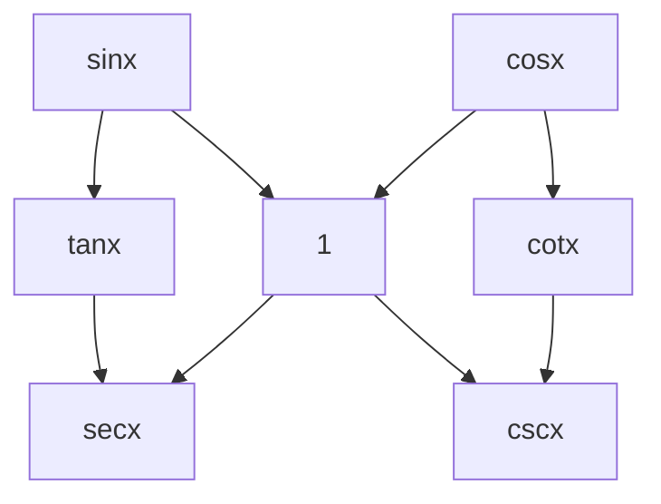

# Calculus2

[TOC]

indefinite and definite integrals

---

## Concepts

---

### 不定积分

---

I

一些不那么显然的积分表

$$
\begin{align*}
\int \tan x dx &= - \ln |\cos x| + C\\
\int \cot x dx &= \ln |\sin x| + C\\
\int \sec x dx &= \int \frac{\sec x (\sec x + \tan x)}{\sec x + \tan x} dx\\
&= \int \frac{\sec^{2}x dx + \sec x \tan x dx}{\sec x + \tan x}\\
&= \ln |\sec x + \tan x| +C\\
\int \csc x dx &= \int \frac{\csc x (\csc x + \cot x)}{\csc x + \cot x} dx\\
&= \int \frac{\csc^{2}x dx + \cot x \csc x dx}{\csc x + \cot x}\\
&= - \ln |\csc x + \cot x| + C
\end{align*}
$$

---

II

Corresponding methods to integrate some kind of derivative funcs:

1. Rational Fraction: Apart
2. Rational Formula for Trigonometric Funcs: $u = \tan \frac{x}{2}$
$$
R(\sin x, \cos x) = R\left(\frac{2u}{1+u^{2}}, \frac{1-u^{2}}{1+u^{2}}\right), x = 2 \arctan u, dx = \frac{2}{1+u^{2}} du
$$
Of course, not all Rational Fraction is solved by just apart. For example:
$$
\begin{align*}
    \int \frac{dx}{x(x^{10}+1)} &= \int \frac{x^{9}dx}{x^{10}(x^{10}+1)}\\
    &= \frac{1}{10} \int \frac{dx^{10}}{x^{10}(x^{10}+1)}\\
    &= \frac{1}{10} \ln \frac{x^{10}}{x^{10}+1} + C
\end{align*}
$$

***Attention***:
尽量不要涉及对数，因为 $\ln |x|$ 中绝对值的原因。

---

III

原函数存在的条件

充分不必要条件：导函数连续

不必要的原因（反例）：
$$
\begin{align*}
F(x) &= x^{2} \sin \frac{1}{x}\\
f(x) &= F'(x) \\
&= \begin{cases}
2x \sin \frac{1}{x} - \cos \frac{1}{x} & (x \neq 0)\\
0 & (x = 0)
\end{cases}
\end{align*}
$$

$x=0$ 是 $f(x)$ 的第二类间断点。但是 $f(x)$ 仍然存在原函数。

---

IV

关于 $\int \frac{dx}{x} = \ln |x| + C$ 中的绝对值：

$\ln x$ is antiderivative of $\frac{1}{x}$ on $(0, \infty)$.
$\ln(-x)$ is antiderivative of $\frac{1}{x}$ on $(-\infty, 0)$.

---

### 定积分

---

定积分通过插入分点进行定义：
$$
\begin{align*}
    & \forall \xi_{i} \in [x_{i-1},x_{i}], S = \sum_{i=1}^{n} f(\xi_{i}) \Delta x_{i} \\
    & \lambda = \max \{ \Delta x_{1}, \Delta x_{2}, \cdots, \Delta x_{n} \} \\
    & \int_{x_{0}}^{x_{n}} f(x) \mathrm{d}x = \lim_{\lambda \rightarrow 0} \sum_{i=1}^{n} f(\xi_{i}) \Delta x_{i} \\
\end{align*}
$$

---

反常积分

无穷区间
$$
\begin{align*}
    & \int_{a}^{+\infty} f(x) \mathrm{d}x = \lim_{b \rightarrow +\infty} \int_{a}^{b} f(x) \mathrm{d}x \\
    & \int_{-\infty}^{b} f(x) \mathrm{d}x = \lim_{a \rightarrow -\infty} \int_{a}^{b} f(x) \mathrm{d}x \\
    & \exists \int_{-\infty}^{\infty} f(x) \mathrm{d}x \iff \exists \int_{-\infty}^{0} f(x) \mathrm{d}x, \exists \int_{0}^{\infty}f(x) \mathrm{d}x
\end{align*}
$$

无界函数

$f(x)$ is continuous on $(a,b]$, $f(a+) = \infty$. $g(x)$ is continuous on $[a,b)$, $g(b-) = \infty$.
$$
\begin{align*}
    & \int_{a}^{b} f(x) \mathrm{d}x = \lim_{t \rightarrow a+} \int_{t}^{b} f(x) \mathrm{d}x \\
    & \int_{a}^{b} g(x) \mathrm{d}x = \lim_{t \rightarrow b-} \int_{a}^{t} g(x) \mathrm{d}x
\end{align*}
$$

---

关于反常积分的理解问题

判断下面的积分是否存在？
$$
\int_{-\infty}^{\infty} \frac{x}{\sqrt{1+x^{2}}} \mathrm{d}x
$$
不存在（==根据定义==）
$$
\begin{align*}
    & \int_{-\infty}^{0} \frac{x}{\sqrt{1+x^{2}}}\mathrm{d}x = \left. \sqrt{1+x^{2}} \right|^{0}_{-\infty} \rightarrow \infty \\
    & \int_{0}^{\infty} \frac{x}{\sqrt{1+x^{2}}}\mathrm{d}x = \left. \sqrt{1+x^{2}} \right|^{\infty}_{0} \rightarrow \infty \\
\end{align*}
$$

（但是存在下面的积分的极限，称为 Cauchy Principle Value in [Cauchy Principle Value](ComplexFunction#Cauchy Principle Value)）
$$
\lim_{b \rightarrow \infty} \int_{-b}^{b} \frac{x}{\sqrt{1+x^{2}}} \mathrm{d}x = 0
$$

---

一些特殊的关系，==对于连续函数而言，这是充要条件==

$\forall x, f(x) = f(x+l)$
$$
\begin{align*}
    & \int_{a}^{a+l} f(x) \mathrm{d}x = \int_{0}^{l} f(x) \mathrm{d}x \\
    & \int_{a}^{a+nl}f(x)\mathrm{d}x=n\int_{0}^{l}f(x)\mathrm{d}x
\end{align*}
$$

---

$f(x)$ is continuous on $[0,1]$.
$$
\begin{align*}
    & \int_{0}^{\frac{\pi}{2}}f(\sin x)\mathrm{d}x = \int_{0}^{\frac{\pi}{2}}f(\cos x)\mathrm{d}x \\
    & \int_{0}^{\pi} f(\sin x) \mathrm{d}x = 2 \int_{0}^{\frac{\pi}{2}}f(\sin x) \mathrm{d}x \\
    & \int_{0}^{\pi} xf(\sin x) \mathrm{d}x = \frac{\pi}{2} \int_{0}^{\pi} f(\sin x) \mathrm{d}x
\end{align*}
$$
前两个比较容易，第三行的证明如下：
$$
\begin{align*}
    \int_{0}^{\pi} x f(\sin x) \mathrm{d}x &= \int_{\pi}^{0} (\pi-y) f(\sin (\pi - y)) \mathrm{d}(\pi-y) \\
        &= \int_{0}^{\pi} (\pi - y) f(\sin y) \mathrm{d}y \\
        &= \pi \int_{0}^{\pi} f(\sin y) \mathrm{d}y - \int_{0}^{\pi} x f(\sin x) \mathrm{d}x \\
        &= \frac{\pi}{2} \int_{0}^{\pi}f(\sin x)\mathrm{d}x
\end{align*}
$$
像极了 [不定积分](#不定积分) 中的 III 题。

---

三角函数在特殊区间上的幂的积分（点火公式）
$$
\begin{align*}
    I_{n} &= \int_{0}^{\frac{\pi}{2}} \sin^{n}x \mathrm{d}x = \int_{0}^{\frac{\pi}{2}} \cos^{n}x \mathrm{d}x \\
    
    n \text{ even, }I_{n} &= \int_{0}^{\frac{\pi}{2}} \cos^{n-1}x \mathrm{d} (\sin x) \\
        &= - (n-1) \int_{0}^{\frac{\pi}{2}} \sin x (-\sin x) \cos^{n-2} x \mathrm{d}x \\
        &= (n-1) \int_{0}^{\frac{\pi}{2}} \cos^{n-2} x \mathrm{d}x - (n-1) \int_{0}^{\frac{\pi}{2}} \cos^{n}x \mathrm{d}x \\
    I_{n} &= \frac{n-1}{n} I_{n-2} & \left(I_{0} = \frac{\pi}{2}\right)\\
    I_{n} &= \frac{n-1}{n} \frac{n-3}{n-2} \cdot \frac{1}{2} \cdot \frac{\pi}{2} \\
    n \text{ odd, } I_{n} &= \frac{n-1}{n} \cdot \frac{n-3}{n-2} \cdots \frac{2}{3} \cdot 1 & (I_{1} = 1) \\
    \int_{0}^{\pi} \sin^{n}x \mathrm{d}x &= 2I_{n} \\
    \int_{0}^{\pi} \cos^{n}x \mathrm{d}x &= \begin{cases} 0 & n \text{ odd} \\ 2I_{n} & n \text{ even} \end{cases} \\
    \int_{0}^{2\pi}\sin^{n}x \mathrm{d}x &= \int_{0}^{2\pi} \cos^{n}x \mathrm{d}x = \begin{cases} 0 & n \text{ odd} \\ 4I_{n} & n \text{ even} \end{cases} \\
\end{align*}
$$

---

积分中值定理
$$
\exists \xi \in (a,b), f(\xi)(b-a) = \int_{a}^{b} f(x) \mathrm{d}x
$$

---

### 微分方程

---

I

如果微分方程的解中所含的任意独立常数的个数等于微分方程的阶数，那么这个解称之为微分方程的**通解**。

不含任意常数的解，称为**特解**。

通解不包含的解，称为**奇解**。如：
$$
\begin{align*}
    & y'^{2} - 4y^{2} = 0\\
    & \frac{\mathrm{d}y}{\sqrt{y}} = 2 \mathrm{d}x \\
    & y = (x+C)^{2}
\end{align*}
$$
求得了通解，但是不能包含解 $y=0$.

n 阶微分方程的一般形式：

$$
\begin{align*}
    f(x, y', y'', \cdots, y^{(n)}) = 0
\end{align*}
$$

---

II

齐次微分方程
$$
\begin{align*}
    \frac{\mathrm{d}y}{\mathrm{d}x} = \varphi(\frac{y}{x})
\end{align*}
$$
解法：
$$
\begin{align*}
    &u = \frac{y}{x}\\
    & \frac{\mathrm{d}ux}{\mathrm{d}x} = \varphi(u)\\
    & u + x \frac{\mathrm{d}u}{\mathrm{d}x} = \varphi(u)\\
    & \frac{\mathrm{d}u}{\varphi(u)-u} = \frac{\mathrm{d}x}{x}
\end{align*}
$$

---

III

一阶线性微分方程
$$
\begin{align*}
    & \frac{\mathrm{d}y}{\mathrm{d}x} + P(x)y = Q(x) \\
    & z = y e^{\int P(x) \mathrm{d}x} \\
    \mathrm{d} y &= \mathrm{d} \left(z e^{-\int P(x) \mathrm{d}x}\right) \\
    &= e^{-\int P(x) \mathrm{d}x} \mathrm{d}z - z P(x) e^{- \int P(x) \mathrm{d}x} \mathrm{d}x \\
    &= e^{-\int P(x) \mathrm{d}x} \mathrm{d}z - y P(x) \mathrm{d}x \\
    & e^{-\int P(x) \mathrm{d}x} \frac{\mathrm{d}z}{\mathrm{d}x} = Q(x) \\
    & y = e^{-\int P(x) \mathrm{d}x} \left(\int e^{P(x) \mathrm{d}x} Q(x) \mathrm{d}x+C \right)
\end{align*}
$$

---

IV

Bernoulli Equation
$$
\begin{align*}
    & \frac{\mathrm{d}y}{\mathrm{d}x} + P(x)y = Q(x)y^{\mu} \\
    & z = y^{1-\mu}, y = z^{\frac{1}{1-\mu}} \\
    & (\frac{1}{1-\mu}) \frac{y}{z} \frac{\mathrm{d}z}{\mathrm{d}x} + P(x) y = Q(x) \frac{y}{z} & (y=0) \\
    & \frac{\mathrm{d}z}{\mathrm{d}x} + (1-\mu) P(x) z = (1-\mu) Q(x)
\end{align*}
$$

---

V

General Form:
$$
\begin{align*}
    & P(x,y) \mathrm{d}x + Q(x,y) \mathrm{d}y = 0 \\
    & \text{if } \frac{\partial P(x,y)}{\partial y} = \frac{\partial Q(x)}{\partial x} \Rightarrow \mathrm{d} u(x,y) = P(x,y) \mathrm{d}x + Q(x,y) \mathrm{d} y \\
    &C = u(x,y) = \int_{x_{0}}^{x} P(x,y) \mathrm{d}x + \int_{y_{0}}^{y} Q(x,y) \mathrm{d}y
\end{align*}
$$

For general situations: $\frac{\partial P}{\partial y} \neq \frac{\partial Q}{\partial x}$, we can observe to get $u(x, y)$, that:
$$
\begin{align*}
    & u(x,y) P(x,y) \mathrm{d}x + u(x,y) Q(x,y) \mathrm{d}y = 0 \\
    & \frac{\partial uP}{\partial y} = \frac{\partial uQ}{\partial x}\\
\end{align*}
$$
For two special cases
$$
\begin{align*}
    u(x) &= e^{\int \frac{1}{Q} \left( \frac{\partial P}{\partial y} - \frac{\partial Q}{\partial x}\right)\mathrm{d}x} & \frac{\partial}{\partial y} \left(\frac{1}{Q} \left( \frac{\partial P}{\partial y} - \frac{\partial Q}{\partial x}\right) \right) = 0 \\
    u(y) &= e^{\int \frac{1}{P} \left( \frac{\partial Q}{\partial x} - \frac{\partial P}{\partial y}\right)\mathrm{d}y} & \frac{\partial}{\partial x} \left(\frac{1}{P} \left( \frac{\partial Q}{\partial x} - \frac{\partial P}{\partial x}\right) \right) = 0
\end{align*}
$$

---

VI

$$
y'' = f(x,y') \Rightarrow p' = f(x, p)
$$

---

VII

$$
\begin{align*}
    & y'' = f(y,y') \\
    & y' = p \Rightarrow y'' = \frac{\mathrm{d}p}{\mathrm{d}x} = p \cdot \frac{\mathrm{d}p}{\mathrm{d}y} \\
    & \frac{\mathrm{d}p}{\mathrm{d}y} = g(y, p) = \frac{1}{p} f(y,p)
\end{align*}
$$

---

VIII

二阶**线性**齐次微分方程
$$
\begin{align*}
    y'' + P(x) y' + Q(x) = 0
\end{align*}
$$
二阶**线性**非齐次微分方程
$$
\begin{align*}
    y'' + P(x) y' + Q(x) = f(x)
\end{align*}
$$
**线性指的是系数多项式只由 $x$ 决定。**

Properties:

1. Linear Combination: $y_{1},y_{2}$ is linearly independent $\Rightarrow y = C_{1} y_{1} + C_{2} y_{2}$
2. General + Special: $y = Y + y^{*}$

---

IX

Constant coeffecients 2-order linear homogeneous derivative equation
$$
y'' + py' + q = 0
$$
Constant coeffecients 2-order linear nonhomogeneous derivative equation
$$
y'' + py' + q = f(x)
$$
For homogeneous one, guess
$$
\begin{align*}
    & y = e^{\lambda x} \\
    & (\lambda^{2} + p \lambda + q) e^{\lambda x} = 0
\end{align*}
$$
If $\lambda_{1} \neq \lambda_{2}$ 
$$
\begin{align*}
    y &= C_{1}e^{\lambda_{1}x} + C_{2}e^{\lambda_{2}x} & (\lambda_{1},\lambda_{2} \in \mathbb{R}) \\
    y &= e^{\omega x}(C_{1}\cos \beta x + C_{2} \sin \beta x) & (\lambda_{1},\lambda_{2} = \omega \pm i \beta)
\end{align*}
$$
If $\lambda_{1}= \lambda_{2} = \lambda$
$$
\begin{align*}
    & y_{1} = e^{\lambda x} \\
    & \text{Suppose } y_{2} = C(x) y_{1} \\
    & y_{1} C''(x) + (2y'_{1} + py_{1}) C'(x) + (y''_{1} + p y'_{1} + qy_{1})C(x) = 0 \\
    & y_{1} C''(x) + (2\lambda + p) y_{1}C'(x) + (\lambda^{2} + p \lambda + q)C(x) = 0 \\
    & C''(x) = 0 \\
    & y_{2} = x e^{\lambda x} \\
    & y = (C_{1} + C_{2}x)e^{\lambda x}
\end{align*}
$$
For nonhomogeneous one
$$
\begin{align*}
    f(x) &= e^{\lambda x} P_{m}(x) \\
    y^{*} &= x^{k} Q_{m}(x) e^{\lambda x}
\end{align*}
$$
其中 $k$ 根据 $\lambda$ 不是特征根，是特征单根，是特征二重根的情况分别取 0，1，2.
$$
\begin{align*}
    f(x) &= e^{\lambda x}[P_{m}(x) \cos \omega x + P_{n}(x) \sin \omega x] \\
    y^{*} &= x^{k} e^{\lambda x} [Q_{t1}(x) \cos \omega x + Q_{t2} \sin \omega x]
\end{align*}
$$
其中 $k$ 根据 $\lambda + i \omega$ 不是特征根，是特征根的情况分别取 0，1.
$$
t = \max (m,n)
$$

---

## Exercise

---

### 不定积分练习

---

I

$$
\begin{aligned}
\int \frac{x+1}{x(1 + x e^x)} \mathrm{d}x &= \int \frac{(x+1)e^x}{x e^x (1+xe^x)} \mathrm{d}x \\
&= \int \frac{\mathrm{d}(x e^x)}{x e^x} - \int \frac{\mathrm{d}(x e^x)}{1 + x e^x} \\
&= \ln \left| \frac{x e^x}{1 + x e^x}\right|
\end{aligned}
$$

***Attention***:
$$
(x e^x)' = (x+1)e^x
$$

---

II

$$
\begin{aligned}
\int_{\frac{\pi}{2}}^{2 \arctan 2} \frac{\mathrm{d}x}{(1- \cos x)\sin^2 x} &= \int_{\frac{\pi}{2}}^{2 \arctan 2} \frac{(1 + \cos x)\mathrm{d} x}{\sin^4 x} \\
&= \int_{\frac{\pi}{2}}^{2 \arctan 2} \frac{{\mathrm{d}x}}{\sin^4 x} + \int_{\frac{\pi}{2}}^{2 \arctan 2} \frac{\mathrm{d}(\sin x)}{\sin^4 x} \\
&= - \int_{\frac{\pi}{2}}^{2 \arctan 2} (1 + \cot^2 x) \mathrm{d}(\cot x) - \left.\frac{1}{3 \sin^3 x}\right|_{\frac{\pi}{2}}^{2 \arctan 2} \\
&= \left.\left(- \cot x - \frac{\cot^3 x}{3} - \frac{1}{3 \sin^3 x}\right)\right|_{\frac{\pi}{2}}^{2 \arctan 2} \\
&= \frac{55}{96}
\end{aligned}
$$

OR
$$
\begin{aligned}
\int_{\frac{\pi}{2}}^{2 \arctan 2} \frac{\mathrm{d}x}{(1-\cos x)\sin^2 x} &= - \int_{\frac{\pi}{2}}^{2 \arctan 2} \frac{\mathrm{d}(\cot x)}{1 - \frac{\cot x}{\sqrt{1 + \cot^2 x}}} \\
&= - \int_{\frac{\pi}{2}}^{2 \arctan 2} \frac{\sqrt{1 + \cot^2 x}\mathrm{d} x}{\sqrt{1 + \cot^2 x}-\cot x} \\
&= - \int_{0}^{-\frac{3}{4}} (1 + u^2 + \sqrt{1 + u^2} u) \mathrm{d}u \\
&= - \left.\left(u + \frac{u^3}{3} + \frac{1}{3} (1+u^2)^{\frac{3}{2}}\right)\right|_{0}^{-\frac{3}{4}}
\end{aligned}
$$

***Attention***:
也可以用万能公式换元。

---

III

$$
\begin{aligned}
\int_0^{\frac{\pi}{2}} \frac{\mathrm{d}x}{1 + \tan^{\sqrt{2}}x} & \overset{u = \frac{\pi}{2} - x}{=} \int_{\pi/2}^0 \frac{- \mathrm{d}u}{1 + \tan^{\sqrt{2}}(\frac{\pi}{2} - u)} \\
&= \int_0^{\pi /2} \frac{\mathrm{d}u}{1 + \frac{1}{\tan^{\sqrt{2}}u}} \\
&= \int_0^{\pi /2} \frac{\tan^{\sqrt{2}}u \mathrm{d}u}{1 + {\tan^{\sqrt{2}}u}} \\
&\overset{x=u}{=} \int_0^{\pi /2} \frac{\tan^{\sqrt{2}}x \mathrm{d}x}{1 + {\tan^{\sqrt{2}}x}} \\
\int_0^{\frac{\pi}{2}} \frac{\mathrm{d}x}{1 + \tan^{\sqrt{2}}x} & = \int_0^{\pi /2} \frac{\tan^{\sqrt{2}}x \mathrm{d}x}{1 + {\tan^{\sqrt{2}}x}} = \frac{1}{2} \int_0^{\frac{\pi}{2}} \mathrm{d} x = \frac{\pi}{4}
\end{aligned}
$$

***Attention***:
遇到不能写出原函数的定积分，需要转化成和原来积分有关系的形式。

---

IV

<!--
?There are some questions in following process.
$$
\begin{aligned}
\lim_{x \rightarrow 0} \frac{\int_0^{x^2}t^2 \sin \sqrt{x^2 - t^2} \mathrm{d} t}{x^7} &= \lim_{x \rightarrow 0} \frac{x^4 \sin \sqrt{x^2 - x^4} \cdot 2x}{7 x^6} \\
&= \frac{2}{7} \lim_{x \rightarrow 0} \frac{\sin x \sqrt{1 - x^2}}{x} \\
&= \frac{2}{7}
\end{aligned}
$$

因为上面的被积函数中显含有 $x$，不可以直接讲上下限作为自变量进行链式求导。
-->

---

V

$$
\begin{aligned}
\int_0^{\pi/2} \frac{\mathrm{d}x}{1 + \cos \theta \cos x} &= \int_0^{\pi/2} \frac{\mathrm{d}x}{1 + \cos \theta \frac{1 - \tan^2 \frac{x}{2}}{1 + \tan^2 \frac{x}{2}}} \\
&= \int_0^{\pi/2} \frac{(1+\tan^2 \frac{x}{2})\mathrm{d}x}{1+\tan^2 \frac{x}{2}+ \cos \theta (1 - \tan^2 \frac{x}{2})} \\
&= 2 \int_0^{\pi/2} \frac{\mathrm{d}(\tan \frac{x}{2})}{1 + \cos \theta + (1 - \cos \theta) \tan^2 \frac{x}{2}} \\
&= 2 \int_0^1 \frac{\mathrm{d}x}{1+\cos \theta + (1 - \cos \theta)x^2} \\
&= \frac{2}{1 + \cos \theta} \int_0^1 \frac{\mathrm{d}x}{1 + \left(\sqrt{\frac{1 - \cos \theta}{1 + \cos \theta}}x\right)^2} \\
&= 2 \sqrt{\frac{1}{(1 - \cos \theta)(1 + \cos \theta)}} \int_0^{\sqrt{\frac{1 - \cos \theta}{1 + \cos \theta}}} \frac{\mathrm{d}x}{1 + x^2} \\
&= \frac{2}{|\sin \theta|} \arctan \sqrt{\frac{1 - \cos \theta}{1 + \cos \theta}} \\
&= \frac{2}{|\sin \theta|} \arctan \left| \tan \frac{\theta}{2} \right| \\
&= \frac{\theta}{\sin \theta} & (\theta \in (0, \pi))
\end{aligned}
$$

***Attention***:
三角换元典型例题。

---

VI

$$
\begin{aligned}
&\int \frac{\sec x \tan^2 x + \sec^3 x}{\sqrt{\sec^4 x + \tan^4 x}} \mathrm{d}x \\
=& \int \frac{\tan x \mathrm{d} \sec x + \sec x \mathrm{d} \tan x}{\sqrt{(\sec^2 x - \tan^2 x)^2 + 2 \sec^2 x \tan^2 x}} \\
=& \int \frac{\mathrm{d} \sec x \tan x}{\sqrt{1 + 2 (\sec x \tan x)^2}} \\
=& \frac{\sqrt{2}}{2} \sinh^{-1} (\sqrt{2} \sec x \tan x) + C
\end{aligned}
$$

***Attention***:
可以通过这个著名的六边形来记忆三角函数之间的关系。

---

VII

$$
\begin{align*}
    &\int \frac{\mathrm{d}x}{1 + \sin x}\\
    =& \int \frac{1 - \sin x}{\cos^{2}x} \mathrm{x}\\
    =& \int \sec^{2}x \mathrm{d}x - \int \tan x \sec x \mathrm{d} x\\
    =& \tan x - \sec x + C
\end{align*}
$$

$$
\begin{align*}
    &\int \frac{x^{2}+1}{x^{4}+1} \mathrm{d} x\\
    =& \int \frac{1+ \frac{1}{x^{2}}}{x^{2}+ \frac{1}{x^{2}}} \mathrm{d}x\\
    =& \int \frac{\mathrm{d}\left(x - \frac{1}{x}\right)}{\left(x- \frac{1}{x}\right)^{2} + 2}\\
    =& \frac{\sqrt{2}}{2} \arctan \frac{\sqrt{2}}{2} \left(x - \frac{1}{x}\right) + C
\end{align*}
$$

$$
\begin{align*}
    &\int \frac{1}{\sin^{2}x-2\cos^{2}x} \mathrm{d}x\\
    =& \int \frac{1}{\tan^{2}x-2} \cdot \frac{\mathrm{d}x}{\cos^{2}x}\\
    =& \frac{\sqrt{2}}{4} \ln \left| \frac{\tan x - \sqrt{2}}{\tan x + \sqrt{2}} \right| + C
\end{align*}
$$

***Attention***:
Some simple tricks but hard to get.

---

VIII

$$
\begin{align*}
    &\int \frac{\mathrm{d}x}{1+\sqrt{x^{2}+2x+2}}\\
    \overset{x+1 = \tan t}{=}& \int \frac{\sec^{2}t \mathrm{d}t}{1+\sec t}\\
    =& \int \frac{\mathrm{d}t}{\cos t(1+\cos t)}\\
    =& \int \sec t \mathrm{d}t - \int \frac{\mathrm{d}t}{2 \cos^{2} \frac{t}{2}}\\
    =& \ln | \sec t + \tan t| - \tan \frac{t}{2} + C\\
    =& \ln | 1+x + \sqrt{x^{2}+ 2x + 2}| - \tan \frac{t}{2} + C\\
1+x=& \tan t = \frac{2\tan \frac{t}{2}}{1 - \tan^{2}\frac{t}{2}}\\
\Rightarrow& \tan \frac{t}{2} = \frac{-1 \pm \sqrt{x^{2}+2x+2}}{1+x}\\
& t \in (-\pi, \pi), \frac{t}{2} \in (-\frac{\pi}{2}, \frac{\pi}{2}), \tan \frac{t}{2} \in (-1, 1)\\
\tan \frac{t}{2} =& \frac{-1 + \sqrt{x^{2}+2x+2}}{1+x}\\
    &\int \frac{\mathrm{d}x}{1+\sqrt{x^{2}+2x+2}}\\
    =& \ln |1+x+\sqrt{x^{2}+ 2x + 2}| - \frac{-1 + \sqrt{x^{2}+ 2x + 2}}{x+1} + C
\end{align*}
$$

***Attention***:
在采用第二类换元法进行计算时，计算结束一定要把主元换回来，换回来的时候注意两个元的取值范围。

---

IX

$$
\begin{align*}
    \int e^{-|x|} &= \left\{ \begin{aligned}
        - e^{-x} + C && (x \geq 0) \\
        e^{x} - 2 + C && (x < 0)
    \end{aligned} \right.
\end{align*}
$$

***Attention***:
原函数连续。

---

### 定积分练习

---

I

To prove:
$$
\lim_{n \rightarrow \infty} \int_{0}^{1} \frac{x^{n}}{1+x} \mathrm{d}x = 0
$$

*Sol*:
$$
\begin{align*}
    \frac{x^{n}}{1+x} & \leq x^{n} \\
    \int_{0}^{1} \frac{x^{n}}{1+x} \mathrm{d}x &\leq \int_{0}^{1} x^{n} \mathrm{d}x = \frac{1}{1+n}\\
    \lim_{n \rightarrow \infty} \frac{x^{n}}{1+x} \mathrm{d}x &\leq \lim_{n \rightarrow 0} \frac{1}{1+n} = 0
\end{align*}
$$

***Attention***:
注意不能使用积分中值定理简单求解
$$
\lim_{n \rightarrow 0} \int_{0}^{1} \frac{x^{n}}{1+x} \mathrm{d}x = \lim_{n \rightarrow 0} \frac{\xi^{n}}{1+\xi} = 0
$$
第二个等号不成立。因为 $\xi = \xi_n$ 是随 $n$ 变化的量。

---

II

$$
\begin{align*}
    & \lim_{n \rightarrow \infty} \left(\frac{1}{\sqrt{4n^{2}-1^{2}}} + \frac{1}{\sqrt{4n^{2}-2^{2}}} + \cdots + \frac{1}{\sqrt{4n^{2}-n^{2}}}\right) \\
    =& \lim_{n \rightarrow \infty} \frac{1}{n} \left(\frac{1}{\sqrt{4-\left(\frac{1}{n}\right)^{2}}} + \frac{1}{\sqrt{4-\left(\frac{2}{n}\right)^{2}}} + \cdots + \frac{1}{\sqrt{4-\left(\frac{n}{n}\right)^{2}}} \right) \\
    =& \int_{0}^{1} \frac{1}{\sqrt{4-x^{2}}} \mathrm{d}x \\
    =& \frac{\pi}{6}
\end{align*}
$$

$$
\begin{align*}
    & \lim_{n \rightarrow \infty} \sum_{i=1}^{n} \frac{2^{\frac{i}{n}}}{n+\frac{1}{i}} 
    \in \left[ \lim_{n \rightarrow \infty} \sum_{i=1}^{n} \frac{2^{\frac{i}{n}}}{n+1}, \lim_{n \rightarrow \infty} \sum_{i=1}^{n} \frac{2^{\frac{i}{n}}}{n} \right]\\
    & \lim_{n \rightarrow \infty} \sum_{i=1}^{n} \frac{2^{\frac{i}{n}}}{n} 
    = \lim_{n \rightarrow \infty} \frac{1}{n} \sum_{i=1}^{n} 2^{\frac{i}{n}} 
    = \int_{0}^{1} 2^{x} \mathrm{d}x = \frac{1}{\ln 2} \\
    & \lim_{n \rightarrow \infty} \sum_{i=1}^{n+1} \frac{2^{\frac{i}{n}}}{n} 
    = \lim_{n \rightarrow \infty} \frac{n}{n+1} \frac{1}{\ln2} = \frac{1}{\ln2} \\
    & \lim_{n \rightarrow \infty} \sum_{i=1}^{n} \frac{2^{\frac{i}{n}}}{n+\frac{1}{i}} = \frac{1}{\ln2}
\end{align*}
$$
***Attention***:
两题都把极限问题转化成了积分问题，在第二题中，一定要看清分母中的 $\frac{1}{i}$ 是完完全全的干扰项。

---

### 微分方程练习

---

I

$y_{1} \neq 0$ is a solution of derivative equation:
$$
y'' + P(x) y' + Q(x) = 0
$$
Find the General Solution.

*Sol*:

Suppose $y_{2}$ is a solution **linearly independent** with $y_{1}$:
$$
y_{2} = C(x) y_{1}
$$
Then:
$$
\begin{align*}
    & y_{2}'' + P(x) y_{2}' + Q(x)y_{2} = 0\\
    & C''(x) y_{1} + 2 C'(x) y'_{1} + C(x) y''_{1} + P(x) C'(x)y_{1} + P(x) C(x) y'_{1} + Q(x)C(x)y_{1} = 0 \\
\end{align*}
$$
Due to:
$$
\begin{align*}
    & y''_{1} + P(x) y'_{1} + Q(x) y_{1} = 0\\
    & C''(x) y_{1} + C'(x) [P(x) y_{1} + 2 y'_{1}] = 0\\
    & \frac{\mathrm{d}C'}{\mathrm{d}x} = - C' \frac{P(x)y_{1}+2y'_{1}}{y_{1}} \\
    & \ln C' = - \int P(x) \mathrm{d}x - 2 \int \frac{y'_{1}}{y_{1}} \mathrm{d}x = - \int P(x) \mathrm{d}x - 2 \ln |y_{1}| \\
    & C'(x) = \frac{1}{y_{1}^{2}} e^{-\int P(x) \mathrm{d}x} \\
    & y_{2} = y_{1} \int \frac{1}{y_{1}^{2}} e^{-\int P(x) \mathrm{d}x} \mathrm{d}x
\end{align*}
$$
General Solution:

$$
y = C_{1} y_{1} + C_{2} y_{1} \int \frac{1}{y_{1}^{2}} e^{-\int P(x) \mathrm{d}x} \mathrm{d}x
$$

***Attention***:
这里利用二阶微分方程只有两个线性无关的基的定理，能够直接设 $y_{2} = C(x) y_{1}$. 为什么不是 $y_{2} = A(x) y_{1} + B(x)$？因为这不**线性**。

---

II

$$
(1+x) \mathrm{d}y + (y + x^{2} + x^{3} ) \mathrm{d}x = 0
$$

*Sol*:
$$
\begin{align*}
    \frac{\partial P(x,y)}{\partial y} &= \frac{\partial}{\partial y} (y + x^{2} + x^{3}) = 1 \\
    \frac{\partial Q(x,y)}{\partial x} &= \frac{\partial}{\partial x}(1+x) = 1 \\
    \frac{\partial P(x,y)}{\partial y} &= \frac{\partial Q(x,y)}{\partial x} \Rightarrow \exists u(x,y), \frac{\partial u}{\partial x}= P(x,y), \frac{\partial u}{\partial y} = Q(x,y) \\
    u(x,y) &= \int P(x,y) \mathrm{d}x + \varphi(y) \\
        &= xy + \frac{x^{3}}{3} + \frac{x^{4}}{4} + \varphi(y) \\
    1+x &= \frac{\partial u}{\partial y} = x + \varphi'(y) \Rightarrow \varphi'(y) = 1 \Rightarrow \varphi(y) = y + C \\
    u(x,y) &= \frac{x^{4}}{4} + \frac{x^{3}}{3}+ yx + y - C \\
    \mathrm{d} u(x,y) &= 0 \Rightarrow \frac{x^{4}}{4} + \frac{x^{3}}{3}+ yx + y = C \\
\end{align*}
$$

**Attention**:
和复变函数中寻找 [Harmonic Function](ComplexFunction#Harmonic Function) 的过程很像。

---

III

$y_{1}= x, y_{2}= e^{x},y_{3}=e^{2x}$ are 3 solutions of
$$
\begin{align*}
    & y'' + P(x) y' + Q(x) y = f(x)
\end{align*}
$$
Find the solution $y$ that $y(0) = 1, y'(0) = 3$

*Sol*:

$y_{2}-y_{1},y_{3}-y_{1}$ are two linearly independent solutions of
$$
\begin{align*}
    & y'' + P(x)y' + Q(x)y = 0
\end{align*}
$$
General Solution:
$$
\begin{align*}
    & Y = C_{1}(e^{x}-x) + C_{2}(e^{2x}-x) \\
    & y = Y + x \\
    & \begin{cases} y(0) = C_{1} + C_{2} \\ y'(0) = 1 + C_{2} \end{cases} 
    \Rightarrow \begin{cases} C_{1} = -1 \\ C_{2}= 2 \end{cases} \\
    & y = 2 e^{2x} - e^{x}
\end{align*}
$$

***Attention***:
这部分内容和线性方程组的特解和通解结合起来理解会比较好。[定理六：矩阵方程解的唯一性](LinearAlgebra1.md#定理六：矩阵方程解的唯一性)

---

IV

$$
\begin{align*}
    & \forall x, y \in \mathbb{R}, f(x,y) = e^{x}f(y) + e^{y}f(x) \\
    & f'(0) = e
\end{align*}
$$

My *Sol*:
$$
\begin{align*}
    f'(x) &= \lim_{x \rightarrow 0} \frac{f(x+y)-f(x)}{y} \\
        &= \lim_{x \rightarrow 0} \frac{f(x+y) - e^{y} f(x) + e^{y} f(x) - f(x)}{y} \\
        &= \lim_{x \rightarrow 0} \left(\frac{f(x+y)-e^{y}f(x)}{f(y)} \cdot \frac{f(y)}{y} + f(x) \frac{e^{y}-1}{y} \right) \\
        &= e^{x} f'(0) + f(x) \\
        &= e^{x+1} + f(x) \\
    f'(x) - f(x) &= e^{x+1} \\
        f(x) &= e^{\int \mathrm{d}x} \left(\int e^{- \int \mathrm{d}x} e^{x+1} \mathrm{d}x + C \right) = e^{x} (ex + C)
\end{align*}
$$
Std *Sol*:
$$
\begin{align*}
    \frac{\partial}{(\partial y)} :& f'(x+y) = e^{x} f'(y) + e^{y} f(x) \\
    y = 0: & f'(x) = e^{x} f'(0) + f(x) \\
    & f'(x) - f(x) = e^{x} f'(0)
\end{align*}
$$

***Attention***:
注意小量的阶数问题。