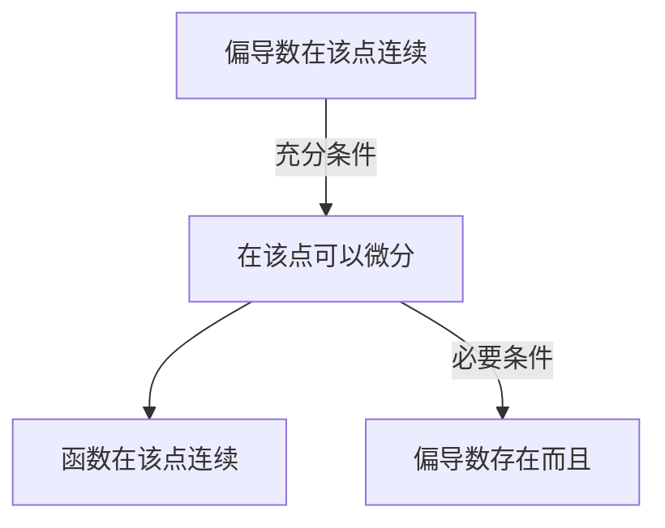
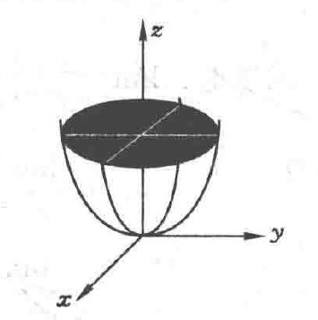
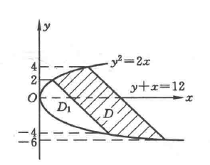
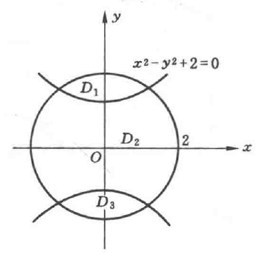

# Calculus3

[TOC]

---

## Concepts

---

### 空间解析几何与向量代数

---

关于向量积（叉积）概念的若干阐述（来自 [3B1B Video](https://www.bilibili.com/video/BV1ys411472E?p=12&vd_source=85e71cac8676a765a42642c92ce0cd1b)）

从来就不存在什么二元叉积，一切都来自于一个 3 阶行列式

$$
\boldsymbol{A} = \begin{bmatrix} \boldsymbol{w} & \boldsymbol{u} & \boldsymbol{v} \end{bmatrix} \in \mathbb{R}^{3 \times 3}
$$

如果把 $\boldsymbol{w}$ 作为自变量，矩阵 $\boldsymbol{A}$ 的行列式的值作为因变量构建函数：

$$
f(\boldsymbol{w}) = \mathrm{det}\left(\begin{bmatrix} \boldsymbol{w} & \boldsymbol{u} & \boldsymbol{v} \end{bmatrix}\right)
$$

根据行列式的性质，可以证明这是一个线性变换，即

- $f(\boldsymbol{0}) = 0$
- $f(a \boldsymbol{x} + b \boldsymbol{y}) = a f(\boldsymbol{x}) + b f(\boldsymbol{y})$

根据线性变换和矩阵乘法的等价性：

$$
f(\boldsymbol{w}) = \boldsymbol{p}^{T} \boldsymbol{w}
$$

其中，$\boldsymbol{p}^{T} \in \mathbb{R}^{1 \times 3}$ 是一个线性算子，记：

$$
\boldsymbol{p} = \boldsymbol{u} \times \boldsymbol{v}
$$

叉积对应的几何意义是平行六面体的体积。

$$
\mathrm{det}(\begin{bmatrix} \boldsymbol{w} & \boldsymbol{u} & \boldsymbol{v} \end{bmatrix}) = (\boldsymbol{u} \times \boldsymbol{v}) \cdot \boldsymbol{w}
$$

那么如何计算 $\boldsymbol{p}$ 呢？

$$
\begin{align*}
    \boldsymbol{p} & = p_{1} \cdot \hat{i} + p_{2} \cdot \hat{j} + p_{3} \cdot \hat{k} \\
    & = \boldsymbol{p}^{T} \begin{bmatrix} \hat{i} \\ \hat{j} \\ \hat{k} \end{bmatrix} \\
    & = f \left( \begin{bmatrix} \hat{i} \\ \hat{j} \\ \hat{k} \end{bmatrix}\right) \\
    & = \mathrm{det} \left( \begin{bmatrix}
        \hat{i} & u_{1} & v_{1} \\ 
        \hat{j} & u_{2} & v_{2} \\ 
        \hat{k} & u_{3} & v_{3} \\ 
    \end{bmatrix}\right)
\end{align*}
$$

---

异面直线距离

$$
\begin{align*}
    & L_{1}: \frac{x - x_{1}}{m_{1}} = \frac{y - y_{1}}{n_{1}} = \frac{z - z_{1}}{l_{1}} && M_{1}: \begin{bmatrix} x_{1} & y_{1} & z_{1} \end{bmatrix}^{T} \\
    & L_{2}: \frac{x - x_{2}}{m_{2}} = \frac{y - y_{2}}{n_{2}} = \frac{z - z_{2}}{l_{2}} && M_{2}: \begin{bmatrix} x_{2} & y_{2} & z_{2} \end{bmatrix}^{T} \\
\end{align*}
$$

异面直线距离就是和两直线上的两点距离在两个直线都垂直的方向上的投影。

$$
\begin{align*}
    & \boldsymbol{n} = \boldsymbol{s}_{1} \times \boldsymbol{s}_{2} \\
    & d = \frac{1}{\Vert \boldsymbol{n} \Vert} \boldsymbol{n}^{T} (\boldsymbol{r}_{1} - \boldsymbol{r}_{2}) \\
    & d = \frac{1}{\Vert s_{1} \times s_{2} \Vert} \left| \begin{matrix} \boldsymbol{r}_{1} - \boldsymbol{r}_{2} & \boldsymbol{s}_{1} & \boldsymbol{s}_{2} \end{matrix} \right|
\end{align*}
$$

---

一个向量与三个坐标平面的夹角满足关系：

$$
\begin{align*}
    & \cos^{2} \alpha + \cos^{2} \beta + \cos^{2} \gamma = 2
\end{align*}
$$

$$
\begin{align*}
    \cos^{2} \alpha & = 1 - \sin^{2} \alpha = 1 - \left( \frac{\boldsymbol{v} \cdot \hat{k}}{|\boldsymbol{v}| \cdot |\boldsymbol{\hat{k}}|} \right)^{2} \\
    & = 1 - \frac{z^{2}}{x^{2} + y^{2} + z^{2}} \\
    & \cos^{2} \alpha + \cos^{2} \beta + \cos^{2} \gamma \\
    & = 3 - \frac{x^{2}}{x^{2} + y^{2} + z^{2}} - \frac{y^{2}}{x^{2} + y^{2} + z^{2}} - \frac{z^{2}}{x^{2} + y^{2} + z^{2}} \\
    &= 2
\end{align*}
$$

---

### 多元函数微分

---

- 聚点：对于集合 $D$ 和点 $P$，如果点 $P$ 的任意去心领域内都有点属于 $D$，那么点 $P$ 是集合 $D$ 的聚点。
- 二重极限：二元函数 $f(x, y)$ 的定义域为 $D$，点 $P_{0}$ 是 $D$ 的聚点。

$$
\begin{align*}
    & \forall \varepsilon > 0, \exists \delta > 0, \forall P(x, y) \in D \cap \mathring{U}(P_{0}, \delta), \exists A \in \mathbb{R}, |f(x, y) - A| < \varepsilon
\end{align*}
$$

那么 $A$ 是函数 $f(x, y)$ 在 $(x_{0}, y_{0})$ 处的二重极限，记作：

$$
\begin{align*}
    & \lim_{\substack{x \rightarrow x_{0} \\ y \rightarrow y_{0}}} f(x, y) = A
\end{align*}
$$

此处的 $P \rightarrow P_{0}$ 指的是以任意方式趋近于，如果只是沿着某些特定的直线或曲线趋近于计算得到相同的 $A$，并不能**断定该点存在多重极限**且极限值为 $A$. 但是判断多重极限不存在相对比较容易：

1. 沿着某一条特殊的路径计算得到极限不存在；
2. 沿着两条路径计算得到的极限存在，但不相等。

- 点上连续、间断
- 开区间、闭区间上连续
- 有界性与最大最小值定理
- 介值定理
- 偏导数：函数 $u = f(\boldsymbol{x})$

$$
\begin{align*}
    & \frac{\partial u}{\partial x_{i}} = \lim_{\boldsymbol{x} \rightarrow \boldsymbol{x}_{0}} \frac{f(\vec{x}_{0} + \Delta x \vec{e}_{i})}{\Delta x} = f_{x_{i}}(\boldsymbol{x}_{0}) = f'_{i}(\boldsymbol{x}_{0})
\end{align*}
$$

- 二阶偏导数：函数 $u = f(x)$

$$
\frac{\partial}{\partial y} \left(\frac{\partial u}{\partial x}\right)= f_{xy}(x, y) = \frac{\partial^{2} u}{\partial x \partial y}
$$

- 二阶混合偏导数：如果两个二阶混合偏导数在定义域 $D$ 内连续，那么相等。

$$
\frac{\partial^{2}u}{\partial x \partial y} = \frac{\partial^{2}u}{\partial y \partial x}
$$

---

- 全微分：$A, B$ 是无关的常数

$$
\begin{align*}
    & \Delta z = A \Delta x + B \Delta y + o(\sqrt{\Delta x^{2} + \Delta y^{2}}) \Rightarrow \mathrm{d}z = A \mathrm{d} x + B \mathrm{d} y
\end{align*}
$$

- 可微条件

**下图中只有标出的箭头表示因果逻辑关系，未标出则不具有因果逻辑关系。**

$$
\begin{align*}
    & A = \frac{\partial f}{\partial x} \\
    & B = \frac{\partial f}{\partial y} \\
\end{align*}
$$

- 链式法则

$$
\begin{align*}
    & z = f(u(x, y), v(x, y))\\
    & \frac{\partial z}{\partial x} = \frac{\partial f}{\partial u} \frac{\partial u}{\partial x} + \frac{\partial f}{\partial v} \frac{\partial u}{\partial x} \\
    & \frac{\partial z}{\partial y} = \frac{\partial f}{\partial u} \frac{\partial u}{\partial y} + \frac{\partial f}{\partial v} \frac{\partial u}{\partial y} \\
\end{align*}
$$

- 全微分形式不变性

$$
\begin{align*}
    \mathrm{d}z &= \frac{\partial z}{\partial x} \mathrm{d} x + \frac{\partial z}{\partial y} \mathrm{d} y \\
        &= (f_{1}' u_{x} + f_{2}' v_{x}) \mathrm{d}x + (f_{1}' u_{y} + f_{2}' v_{y}) \mathrm{d}y \\
        &= f_{1}'(u_{x} \mathrm{d}x + u_{y} \mathrm{d}y) + f'_{2} (u_{y} \mathrm{d}y + v_{y} \mathrm{d}y) \\
        &= f'_{1} \mathrm{d}u + f'_{2} \mathrm{d}v
\end{align*}
$$

---

隐函数求导

$$
\begin{align*}
    & F(x, y) = 0 \Rightarrow \frac{\partial F}{\partial x} = 0 \\
    & F_{x} + F_{y} \frac{\mathrm{d}y}{\mathrm{d}x} = 0 \\
    & y'(x) = - \frac{F_{x}}{F_{y}}
\end{align*}
$$

同理，对于隐函数 $F(x, y, z) = 0$

$$
\begin{align*}
    & \frac{\partial z}{\partial x} = - \frac{F_{x}}{F_{z}}\\
    & \frac{\partial z}{\partial y} = - \frac{F_{y}}{F_{z}}
\end{align*}
$$

---

空间曲线的切向量

对于参数方程的情况，直接求偏导就可以了。

对于联立方程的情况

$$
\begin{align*}
    & F(x, y, z) = 0 \\
    & G(x, y, z) = 0
\end{align*}
$$

切向量可以用两个曲面的法向量叉乘得到

$$
\begin{align*}
    & \boldsymbol{T} = \boldsymbol{F}_{n} \times \boldsymbol{G}_{n} = \mathrm{det}\left(\begin{bmatrix}
        \hat{i} & \hat{j} & \hat{k} \\ 
        F_{x} & F_{y} & F_{z} \\ 
        G_{x} & G_{y} & G_{z} \\ 
    \end{bmatrix}\right)
    = \mathrm{det}\left(\begin{bmatrix}
        F_{y} & F_{z} \\ 
        G_{y} & G_{z}
    \end{bmatrix}\right) \begin{bmatrix}
        1 \\ 
        y'(x_{0}) \\ 
        z'(x_{0})
    \end{bmatrix}
\end{align*}
$$

这一点和[练习](#多元函数微分练习)中的 Jacobian Matrix 相关结论相容。

---

空间曲面的法向量

$$
\begin{align*}
    & F(x, y, z) = 0 \\
    & \hat{n} = \begin{bmatrix}
        F_{x}(x_{0}, y_{0}, z_{0})  \\ 
        F_{y}(x_{0}, y_{0}, z_{0})  \\ 
        F_{z}(x_{0}, y_{0}, z_{0})  \\ 
    \end{bmatrix}
\end{align*}
$$

可以根据法向量求出[切平面](optimize2.md#20.3)和法线的方程。

---

- 方向角：某直线和该维度空间中坐标轴的夹角。
- 方向余弦：方向角的余弦值
- 方向导数：以 2 维空间为例

$$
\begin{align*}
    \frac{\partial f}{\partial \boldsymbol{l}} & = \lim_{\rho \rightarrow 0} \frac{f(x_{0} + \rho \cos \alpha, y_{0} + \rho \cos \beta) - f(x_{0}, y_{0})}{\rho} \\
        &= f_{x} \cos \alpha + f_{y} \cos \beta
\end{align*}
$$

其余维度空间同理。

- 梯度：

$$
\begin{aligned}
    & \boldsymbol{g} = \nabla f = \begin{bmatrix}
        f_{x} \\ 
        f_{y} \\ 
        f_{z}
    \end{bmatrix}
\end{aligned}
$$

---

- 极值点：将一元函数对应定义中的去心领域扩展至对应的维数。
- 二元函数的极值判定
    - 必要条件：如果是极值且一阶偏导数存在，那么一阶偏导数的值为 0
    - 充分条件：如果在所求点 $(x_{0}, y_{0})$ 附近的一个领域内二元函数连续且存在**一阶、二阶连续偏导数**

$$
\begin{aligned}
    & A := f_{xx}(x_{0}, y_{0}) \\
    & B := f_{xy}(x_{0}, y_{0}) \\
    & C := f_{yy}(x_{0}, y_{0}) \\
    & \left\{ \begin{aligned}
        &AC - B^{2} > 0 \Rightarrow (x_{0}, y_{0}) \text{是极值点}, 
            \left\{\begin{aligned}
                & A > 0, \text{min} \\
                & A < 0, \text{max}
            \end{aligned}\right. \\
        & AC - B^{2} < 0 \Rightarrow (x_{0}, y_{0}) \text{不是极值点} \\
        & AC - B^{2} = 0 \Rightarrow \text{invalid}
    \end{aligned}\right.
\end{aligned}
$$

---

条件极值的求解（[有约束优化问题](optimize2.md#仅含等式约束的优化问题)）

$$
\begin{aligned}
    & \text{minimize} && z = f(x, y) \\
    & \text{subject to} && \varphi(x, y) = 0 \\
\end{aligned}
$$

Lagrange Method

$$
\begin{aligned}
    L(x, y, \lambda) & = f(x, y) + \lambda \varphi(x, y) \\
    \nabla L(x, y, \lambda)& = \begin{bmatrix}
        f_{x}(x, y) + \lambda \varphi_{x}(x, y) \\
        f_{y}(x, y) + \lambda \varphi_{y}(x, y) \\
        \varphi(x, y)
    \end{bmatrix} = \boldsymbol{0}
\end{aligned}
$$

通过这种方法求解驻点。

---

### 重积分

---

计算二重积分

1. 利用直角坐标，将被积区域分割成若干 X 型区域和 Y 型区域，然后按照坐标的顺序先后积分；
2. 利用极坐标，分三种情况，**要注意 $\theta$ 的范围**
    1. 极点在积分区域外
    2. 极点在积分区域边界
    3. 极点在积分区域内

$$
\begin{aligned}
    & \iint_{D} f(x, y)  \mathrm{d} \sigma = \int_{\alpha}^{\beta}  \mathrm{d} \theta \int_{r_{1}(\theta)}^{r_{2}(\theta)} rf(r \cos \theta, r \sin \theta)  \mathrm{d} r \\
    & \iint_{D} f(x, y)  \mathrm{d} \sigma = \int_{\alpha}^{\beta}  \mathrm{d} \theta \int_{0}^{r_{2}(\theta)} rf(r \cos \theta, r \sin \theta)  \mathrm{d} r \\
    & \iint_{D} f(x, y)  \mathrm{d} \sigma = \int_{0}^{2\pi}  \mathrm{d} \theta \int_{0}^{r_{2}(\theta)} rf(r \cos \theta, r \sin \theta)  \mathrm{d} r \\
\end{aligned}
$$

---

计算三重积分

- 直角坐标，分三种方法
    1. 三次积分，一个坐标一个坐标地做一元定积分；
    2. 投影法（先一后二），先计算一个坐标，投影到另外两个坐标构成的平面以后做二元积分；
    3. 截面法（先二后一），先计算一个截面，在另一个坐标上做一元积分。

$$
\begin{aligned}
    & \iiint_{\Omega} f(x, y, z)  \mathrm{d} v = \int_{a}^{b}  \mathrm{d} x \int_{y_{1}(x)}^{y_{2}(x)}  \mathrm{d} y \int_{z_{1}(x, y)}^{z_{2}(x, y)} f(x, y, z)  \mathrm{d} z \\
    & \iiint_{\Omega} f(x, y, z)  \mathrm{d}v = \int_{D_{xy}} \mathrm{d} x \mathrm{d} y \int_{z_{1}(x, y)}^{z_{2}(x, y)} f(x, y, z)  \mathrm{d} z \\
    & \iiint_{\Omega} f(x, y, z)  \mathrm{d} v = \int_{a}^{b}  \mathrm{d} x \int_{D_{x}} f(x, y, z)  \mathrm{d} y  \mathrm{d} z \\
    &
\end{aligned}
$$

- 柱坐标

$$
\begin{aligned}
    & \iiint_{\Omega}f(x, y, z)  \mathrm{d} v = \iiint_{\Omega} f(\rho \cos \theta, \rho \sin \theta, z) \rho  \mathrm{d} \rho  \mathrm{d} \theta  \mathrm{d} z
\end{aligned}
$$

- 球坐标

$$
\begin{aligned}
    & \iiint_{\Omega} f(x, y, z)  \mathrm{d} v = \iiint_{\Omega} f( \rho \sin \varphi \cos \theta, \rho \sin \varphi \sin \theta, \rho \cos \theta) r^{2} \sin \theta  \mathrm{d} r \mathrm{d} \theta  \mathrm{d}
\end{aligned}
$$

---

光滑曲面的面积

$$
\begin{aligned}
    S & = \iint_{D_{xy}}  \left| \begin{bmatrix}  \mathrm{d} x \\  0 \\ z_{x} \mathrm{d} x \end{bmatrix} \times \begin{bmatrix} 0 \\  \mathrm{d} y \\ z_{y}  \mathrm{d} y \end{bmatrix}\right| \\
    & = \iint_{D_{xy}}  \left| \begin{bmatrix} -z_{x} \mathrm{d} x  \mathrm{d} y \\ -z_{y} \mathrm{d} x  \mathrm{d} y \\  \mathrm{d} x  \mathrm{d} y \end{bmatrix}\right| \\
    & = \iint_{D_{xy}} \sqrt{1 + z_{x}^{2} + z_{y}^{2}}  \mathrm{d} x  \mathrm{d} y
\end{aligned}
$$

---

轮换对称性

若积分区域 $D$ 关于直线 $y = x$ 对称，则

$$
\begin{aligned}
    & \iint_{D} f(x, y)  \mathrm{d} \sigma = \iint_{D} f(y, x)  \mathrm{d} \sigma
\end{aligned}
$$

e.g.

$$
\begin{aligned}
    & \iint_{D} x^{2}  \mathrm{d} \sigma = \iint_{D} y^{2}  \mathrm{d} \sigma = \frac{1}{2} \iint_{D} (x^{2} + y^{2})  \mathrm{d} \sigma = \frac{1}{2} \cdot 2\pi \int_{0}^{a} \rho^{2} \cdot \rho  \mathrm{d} \rho = \frac{\pi}{4} a^{4} \\
    & \iint_{x^{2} + y^{2} \leq a^{2}} (x^{2} - 2x + 3y + 2)  \mathrm{d} \sigma \\
    &= \iint_{D} x^{2}  \mathrm{d} \sigma + \iint_{D} (-2x + 3y)  \mathrm{d} \sigma + 2 \iint_{D}  \mathrm{d} \sigma \\
    &= \frac{\pi}{4} a^{4} + 2 \pi a^{2}
\end{aligned}
$$

其中 $\iint_{D}(-2x + 3y)  \mathrm{d} \sigma$ 根据奇偶性可以直接得出为 0.

对于三重积分，也有类似的性质：

如果改变两个变量的位置，积分区域不变，那么在积分式中改变变量的位置，积分的结果不变。

$$
\begin{aligned}
    & \{\boldsymbol{x} \in \mathbb{R}^{3}: \varphi(\begin{bmatrix} x_{1} & x_{2} & x_{3} \end{bmatrix}^{T}) \leq 0\} = \{\boldsymbol{x} \in \mathbb{R}^{3}: \varphi(\begin{bmatrix}x_{2} & x_{1} & x_{3}\end{bmatrix}^{T}) \leq 0 \} \\
    & \iint_{\Omega}f(\begin{bmatrix}x_{1} & x_{2} & x_{3}\end{bmatrix}^{T})  \mathrm{d} v = \iint_{\Omega} f(\begin{bmatrix} x_{2} & x_{1} & x_{3}\end{bmatrix}^{T})  \mathrm{d} v
\end{aligned}
$$

---

二重积分换元法

$$
\begin{aligned}
    & J(u, v) := \frac{\partial (x, y)}{\partial (u, v)} = \begin{bmatrix}
        \dfrac{\partial x}{\partial u} & \dfrac{\partial x}{\partial v}\\
         \dfrac{\partial y}{\partial u} &  \dfrac{\partial y}{\partial v} \\
    \end{bmatrix} \\
    & \iint_{D} f(x, y)  \mathrm{d} x  \mathrm{d} y = \iint_{D} f[x(u, v), y(u, v)]  \mathrm{det}[J(u, v)]  \mathrm{d} u  \mathrm{d} v
\end{aligned}
$$

前提：Jacobian Matrix 的行列式不为 0. 

这种换元实际上代表着一种坐标变换（不一定线性）

$$
\begin{aligned}
    & \left\{ \begin{aligned}
        & x = x(u, v) \\
        & y = y(u, v)
    \end{aligned}\right. \\
    & \begin{bmatrix}  \mathrm{d} x \\  \mathrm{d} y\end{bmatrix} =  \frac{\partial(x, y)}{\partial(u, v)} \begin{bmatrix}  \mathrm{d} u \\  \mathrm{d} v\end{bmatrix}
\end{aligned}
$$

行列式的值代表了坐标变换对面积微元的压缩或放大的倍数。

---

## Exercise

---

### 空间解析几何与向量代数练习

---

I

过定点 $(1, 1, 1)$ 的三维空间直线与两个直线 $l_{1}: \frac{x}{1} = \frac{y}{2} = \frac{z}{3}, l_{2}: \frac{x-1}{2} = \frac{y-2}{1} = \frac{z-3}{4}$ 相交，求该直线方程。

*Sol*:

设所求直线 $l_{3}: \frac{x-1}{m} = \frac{y-1}{n} = \frac{z-1}{p}$

显然 $l_{1}$ 经过原点，原点到定点 $(1, 1, 1)$ 的向量与所求直线以及 $l_{1}$ 方向向量 $s_{1} = \begin{bmatrix} 1 & 2 & 3 \end{bmatrix}^{T}$ 共面。合成的矩阵的行列式为零。

$$
\begin{align*}
    \det\left(
    \begin{bmatrix} 
        1 & 1 & m \\ 
        1 & 2 & n \\ 
        1 & 3 & p
    \end{bmatrix}\right) = 0
\end{align*}
$$

同理，对直线 $l_{2}$ 也有相似性质：

$$
\begin{align*}
    & \det \left( \begin{bmatrix}
        0 & 2 & m \\ 
        1 & 1 & n \\ 
        2 & 4 & p
    \end{bmatrix}\right)
\end{align*}
$$

可以得到方向向量 $s_{3}$ 的一个解为：

$$
\begin{align*}
    s_{3} &= (\begin{bmatrix} 1 & 1 & 1 \end{bmatrix}^{T} \times \begin{bmatrix} 1 & 2 & 3 \end{bmatrix}^{T})
         \times (\begin{bmatrix} 0 & 1 & 2 \end{bmatrix}^{T} \times \begin{bmatrix} 2 & 1 & 4 \end{bmatrix}^{T}) \\
        &= \begin{bmatrix} 1 & -2 & 1 \end{bmatrix}^{T} \times \begin{bmatrix} 2 & 4 & -2 \end{bmatrix}^{T} \\
        &= \begin{bmatrix} 0 & 4 & 8 \end{bmatrix}^{T}
\end{align*}
$$

$$
\begin{align*}
    & l_{3}: \left\{
        \begin{aligned}
            & x = 1 \\
            & y - 1 = \frac{z-1}{2}
        \end{aligned}
    \right.
\end{align*}
$$

---

II

设直线 $L:\left\{\begin{aligned} x + 5y + z = 0 \\ x - z + 4 = 0 \end{aligned}\right.$，平面 $\pi: x - 4y - 8z - 9 = 0$，求直线 $L$ 在平面 $\pi$ 上的投影直线的方程。

*Sol*:

**过直线 $L$ 的平面中一部分可以用平面系表示**：

$$
\begin{align*}
    & (1 + \lambda) x + 5 y + (1 - \lambda) z + 4 \lambda = 0 \\
\end{align*}
$$

假设其中的平面（对应的 $\lambda = \lambda_{0}$）与平面 $\pi$ 垂直，则：

$$
\begin{align*}
    & \begin{bmatrix}
        1 + \lambda_{0}  \\ 
        5 \\ 
        1 - \lambda_{0}
    \end{bmatrix} \cdot \begin{bmatrix}
        1 \\ 
        -4 \\ 
        -8
    \end{bmatrix} = 0
\end{align*}
$$

解得 $\lambda_{0} = 3$

用两个平面方程联立作为求解的直线方程：

$$
\left\{\begin{align*}
    & 4x + 5y - 2z + 12 = 0 \\
    & x - 4y - 8z - 9 = 0
\end{align*}\right.
$$

***Attention***:

作为求解投影直线的通用方法，先找平面方程再求直线方程比复杂的向量计算更稳定。

当然求平面方程出了使用平面系的方法，也可以使用向量的方法。如果已知给出直线的方向向量 $\boldsymbol{s}$ 和给出平面的法向量 $\boldsymbol{n}$，过给定直线垂直于给定平面的平面的法向量

$$
\boldsymbol{n}' = \boldsymbol{s} \times \boldsymbol{n}
$$

综上所述：

- 如果给出直线的方程是两个平面方程联立，适合用平面系的方法；
- 如果给出直线的方程是连等式，适合使用向量的方法。

---

III

求空间直线（用两个平面的方程表示）在三个坐标平面上的投影直线方程。

***Attention***:

只需要将两个方程中的对应坐标消去即可。

---

IV

试把曲线

$$
\left\{\begin{align*}
    & 2y^{2} + z^{2} + 4x = 4z \\
    & y^{2} + 3 z^{2} - 8x = 12z
\end{align*}\right.
$$

转化成两个柱面的交线，其中一个柱面的母线平行于 $x$ 轴，另一个平行于 $z$ 轴。

*Sol*:

消去变量 $x$，得到平行于 $x$ 轴的柱面方程：

$$
y^{2} + (z - 2)^{2} = 4
$$

同理，得到平行于 $z$ 轴的柱面方程：

$$
y^{2} + 4x = 0
$$

答案为：

$$
\left\{\begin{align*}
    & y^{2} + z^{2} - 4z = 0 \\
    & y^{2} + 4x = 0
\end{align*}\right.
$$

***Attention***:

这里的消去方法和上一片（III）中的类似，对于求解曲线到坐标平面投影的曲线方程，也有相似的消去解法。

$$
\left\{\begin{align*}
    & F(x, y, z) = 0 \\
    & G(x, y, z) = 0
\end{align*}\right. \Rightarrow H(x, y) = 0
$$

那么曲线 $\left\{\begin{align*} & F(x, y, z) = 0 \\ & G(x, y, z) = 0 \end{align*}\right.$ 在坐标平面 $xOy$ 的投影曲线方程为 $\left\{\begin{align*} & H(x, y) = 0 \\ & z = 0 \end{align*}\right.$.

---

V

求直线 $\frac{x-1}{0} = \frac{y}{1} = \frac{z-1}{2}$ 绕 $z$ 轴旋转形成的曲面的方程。

*Sol*:

直线的参数方程为

$$
\left\{\begin{align*}
    & x = 1 \\
    & y = t \\
    & z = 1 + 2t \\
\end{align*}\right.
$$

旋转以后

$$
\left\{\begin{align*}
    & \sqrt{x^{2} + y^{2}} = \sqrt{1 + t^{2}} \\
    & z = 1 + 2t
\end{align*}\right.
$$

消去参数

$$
\begin{align*}
 & x^{2} + y^{2} = 1 + \left(\frac{z-1}{2}\right)^{2}
\end{align*}
$$

***Attention***:

这个给定直线和 $z$ 轴无交点，因此形成的曲面不是锥面，而是单叶双曲面。

---

VI

证明曲线

$$
\left\{\begin{align*}
    & 4x -5y - 10z - 20 = 0 \\
    & \frac{x^{2}}{25} + \frac{y^{2}}{16} - \frac{z^{2}}{4} = 1
\end{align*}\right.
$$

是两条相交直线，并求出它的对称式方程。

*Sol*:

直接代入消元

$$
\begin{align*}
    & z = \frac{2}{5} x - \frac{1}{2} y - 2 \\
    & \frac{x^{2}}{25} + \frac{y^{2}}{16} - \frac{1}{4} \left(\frac{2}{5} x - \frac{1}{2} y - 2\right)^{2} = 1 \\
    & xy - 5y + 4x = 20 \\
    & (x - 5)(y + 4) = 0
\end{align*}
$$

因此两条直线为

$$
\begin{align*}
    & L_{1}: \left\{\begin{aligned}
        & x = 5 \\
        & y + 2z = 0 
    \end{aligned}\right. \\
    & L_{2}: \left\{\begin{aligned}
        & y = -4 \\
        & 2x - 5z = 0 
    \end{aligned}\right.
\end{align*}
$$

对称式方程

$$
\begin{align*}
    & L_{1}: \frac{x-5}{0} = \frac{y}{2} = \frac{z}{-1} \\
    & L_{2}: \frac{x}{5} = \frac{y+4}{0} = \frac{z}{2}
\end{align*}
$$

两条直线的交点为 $(5, -4, 2)$

***Attention***:

没什么好注意的，就直接计算找规律 $(x - 5)(y + 4) = 0$ 就好了。

---

### 多元函数微分练习

---

I Jacobian Determinant

对于一个特别的例子：

$$
\left\{\begin{align*}
    & F(x, y, u, v) = 0 \\
    & G(x, y, u, v) = 0
\end{align*}\right.
$$

已知

$$
\left\{\begin{align*}
    & u = u(x, y) \\
    & v = v(x, y)
\end{align*}\right.
$$

那么分别对 $x, y$ 求全微分，得到 4 个方程：

$$
\begin{align*}
    & 0 = \left(\frac{\partial F}{\partial x} + \frac{\partial F}{\partial u} \frac{\partial u}{\partial x} + \frac{\partial F}{\partial v} \frac{\partial v}{\partial x} \right)\mathrm{d} x  + \left(\frac{\partial F}{\partial y} + \frac{\partial F}{\partial u} \frac{\partial u}{\partial y} + \frac{\partial F}{\partial v} \frac{\partial v}{\partial y} \right)\mathrm{d} y \\
    & 0 = \left(\frac{\partial G}{\partial x} + \frac{\partial G}{\partial u} \frac{\partial u}{\partial x} + \frac{\partial G}{\partial v} \frac{\partial v}{\partial x} \right)\mathrm{d} x  + \left(\frac{\partial G}{\partial y} + \frac{\partial G}{\partial u} \frac{\partial u}{\partial y} + \frac{\partial G}{\partial v} \frac{\partial v}{\partial y} \right)\mathrm{d} y \\
\end{align*}
$$

由于 $\mathrm{d}x, \mathrm{d}y$ 独立，因此 4 个括号中的项均为 0. 将 $\frac{\partial u}{\partial x}, \frac{\partial u}{\partial y}, \frac{\partial v}{\partial x}, \frac{\partial v}{\partial y}$ 作为主元：

$$
\begin{align*}
    & F_{u} u_{x} + F_{v} v_{x} = - F_{x} \\
    & G_{u} u_{x} + G_{v} v_{x} = - G_{x} \\
    & F_{u} u_{y} + F_{v} v_{y} = - F_{y} \\
    & G_{u} u_{y} + G_{v} v_{y} = - G_{y}
\end{align*}
$$

利用 Cramer's rule，得到

$$
\begin{align*}
    & u_{x} = - \frac{\mathrm{det}\left(\frac{\partial(F, G)}{\partial(x, v)}\right)}{\mathrm{det}\left(\frac{\partial(F, G)}{\partial(u, v)}\right)} \\
    & v_{x} = - \frac{\mathrm{det}\left(\frac{\partial(F, G)}{\partial(u, x)}\right)}{\mathrm{det}\left(\frac{\partial(F, G)}{\partial(u, v)}\right)} \\
    & u_{y} = - \frac{\mathrm{det}\left(\frac{\partial(F, G)}{\partial(y, v)}\right)}{\mathrm{det}\left(\frac{\partial(F, G)}{\partial(u, v)}\right)} \\
    & v_{y} = - \frac{\mathrm{det}\left(\frac{\partial(F, G)}{\partial(u, y)}\right)}{\mathrm{det}\left(\frac{\partial(F, G)}{\partial(u, v)}\right)} \\
\end{align*}
$$

---

II 构造一个二元函数，满足“可导但不连续”

*Sol*:

可导指的是存在两个偏导数，两个偏导数 $f_{x}, f_{y}$ **考察的都是二元函数在坐标轴上趋近于的行为**。因此需要构造坐标轴方向和其余方向行为不同的一个二元函数。

$$
\begin{aligned}
    & f(x) = \left\{\begin{aligned}
        & x^{2} + y^{2} && (xy = 0) \\
        & 1 && (xy \neq 0)
    \end{aligned}\right. \\
    & f_{x}(0, 0) = f_{y}(0, 0) = 0, \text{ both partial derivatives exist.} \\
    & f(0, 0) = 0 \neq \lim_{\substack{y = x \\ x \rightarrow 0}} f(x, y) = 1
\end{aligned}
$$

可导但是不连续。

***Attention***:

注意多元函数**可导**和**连续**的逻辑关系不同于一元函数。

---

III 二元混合偏导数不相等的例子

$$
\begin{aligned}
    & f(x, y) = \left\{\begin{aligned}
        & xy \frac{x^{2}-y^{2}}{x^{2}+y^{2}} && (x^{2} + y^{2} \neq 0) \\
        & 0 && (x^{2} + y^{2} = 0)
    \end{aligned}\right. \\
    & f_{x}(0, 0) = f_{y}(0, 0) = 0 \\
    & f_{x}(x, y) =  \left\{\begin{aligned}
        & 0 && (x^{2} + y^{2} = 0) \\
        & \frac{y(x^{4} + 4x^{2}y^{2} - y^{4})}{(x^{2} + y^{2})^{2}} && (x^{2} + y^{2} \neq 0)
    \end{aligned}\right. \\
    & f_{y}(x, y) =  \left\{\begin{aligned}
        & 0 && (x^{2} + y^{2} = 0) \\
        & -\frac{x(y^{4} + 4y^{2}x^{2} - x^{4})}{(y^{2} + x^{2})^{2}} && (y^{2} + x^{2} \neq 0)
    \end{aligned}\right.
\end{aligned}
$$

当 $x^{2} + y^{2} = 0$ 时，

$$
\begin{aligned}
    & f_{xy} = \lim_{\Delta y \rightarrow 0} \frac{f_{x}(0, \Delta y) - f_{x}(0, 0)}{\Delta y} = -1 \\
    & f_{yx} = \lim_{\Delta x \rightarrow 0} \frac{f_{y}(\Delta x, 0) - f_{y}(0, 0)}{\Delta x} = 1 \\
    & f_{xy} \neq f_{yx}
\end{aligned}
$$

***Attention***:

二阶偏导数连续，则二阶混合偏导数一定相等。

---

IV 证明函数极限不存在

$$
\begin{aligned}
    & \lim_{(x, y) \rightarrow (0^{+}, 0)} x^{y}
\end{aligned}
$$

*Sol*:

$$
\begin{aligned}
    \lim_{(x,y) \rightarrow (0^{+}, 0)} x^{y} &= e^{\lim_{(x, y) \rightarrow (0^{+}, 0)} y \ln x}
\end{aligned}
$$

取不同的路径趋近于 $(0^{+}, 0)$

$$
\begin{aligned}
    & y = \frac{k}{\ln x} \\
    & \lim_{(x, y) \rightarrow (0^{+}, 0)}x^{y} = e^{k}
\end{aligned}
$$

各不相等，因此极限不存在。

---

V 证明连续、偏导数存在、不可微

$$
f(x, y) = \sqrt{|xy|}
$$

*Sol*:

证明连续需要利用放缩，放缩到和 $x^{2} + y^{2}$ 有关的项（**因为去心领域就是这么定义的**）。

$$
\begin{aligned}
    & |xy| < \frac{x^{2}+y^{2}}{2} \\
    & 0 < f(x, y) < \sqrt{\frac{x^{2}+y^{2}}{2}} \\
    & \lim_{(x, y) \rightarrow (0, 0)} f(x, y) = \lim_{(x,y) \rightarrow (0,0)} \sqrt{\frac{x^{2}+y^{2}}{2}} = 0 = f(0, 0)
\end{aligned}
$$

因此连续。

证明偏导数存在用定义

$$
\begin{aligned}
    & f_{x}(0, 0) = \lim_{\Delta x \rightarrow 0} \frac{f(\Delta x, 0) - f(0, 0)}{\Delta x} = 0 \\
    & f_{y}(0, 0) = \lim_{\Delta y \rightarrow 0} \frac{f(0, \Delta y) - f(0, 0)}{\Delta y} = 0 \\
\end{aligned}
$$

证明不可微同样用定义

$$
\begin{aligned}
    & \alpha = f(x, y) - f_{x}(0, 0) x - f_{y}(0, 0) y = \sqrt{|xy|} \\
    & \lim_{(x, y) \rightarrow (0, 0)} \frac{\alpha}{\rho} = \lim \sqrt{\frac{|xy|}{x^{2}+y^{2}}}
\end{aligned}
$$

取趋近方向为不同的 $y = kx$

$$
\begin{aligned}
    & \lim_{(x, y) \rightarrow (0, 0)} \frac{\alpha}{\rho} = \lim \sqrt{\frac{|k|x^{2}}{(1+k^{2})x^{2}}} = \sqrt{\frac{|k|}{1+k^{2}}}
\end{aligned}
$$

各不相同。因此极限不存在，函数不可微。

***Attention***:

利用 $\lim_{\boldsymbol{x} \rightarrow \boldsymbol{0}} \frac{f(x, y) - f_{x}(x_{0}, y_{0})(x - x_{0}) - f_{y}(x_{0}, y_{0})(y - y_{0})}{\rho}$ 是否存在判断是否可微。

---

VI 偏导数计算

$$
\begin{aligned}
    & u = f(x, y, z), z = x^{2} \sin t, t = \ln (x + y)
\end{aligned}
$$

求解 $\dfrac{\partial u}{\partial x},  \dfrac{\partial^{2} u}{\partial x \partial y}$.

*Sol*:

$$
\begin{aligned}
    \frac{\partial u}{\partial x} & = f'_{1} + f'_{3}  \frac{\partial z}{\partial x} \\
        &= f'_{1} + f'_{3} \left(2x \sin t + x^{2} \cos t \frac{\partial t}{\partial x}\right) \\
        &= f'_{1} + f'_{3} \left(2x \sin t + \frac{x^{2}}{x+y} \cos t \right) \\
\end{aligned}
$$

$$
\begin{aligned}
    \frac{\partial^{2} u}{\partial x \partial y} 
        &= f''_{12} + f''_{13}  \frac{\partial z}{\partial y} 
        + \left(2x \sin t + \frac{x^{2}}{x+y} \cos t \right)\left(f''_{32} + f''_{33} \frac{\partial z}{\partial y}\right) 
        + f'_{3} \left\{2x \cos t  \frac{\partial t}{\partial y} + x^{2} \left[- \frac{1}{(x+y)^{2}}\right] \cos t 
        + \frac{x^{2}}{x+y} (-\sin t) \frac{\partial t}{\partial y}\right\} \\
    & = f''_{12} + f''_{13} \frac{x^{2}}{x+y} \cos t
        + \left(2x \sin t + \frac{x^{2}}{x+y} \cos t\right) \left(f''_{32} + f''_{33} \frac{x^{2}}{x+y} \cos t\right)
        + f'_{3} \left\{\frac{2x}{x+y} \cos t - \left(\frac{x}{x+y}\right)^{2} \cos t - \left(\frac{x}{x+y}\right)^{2} \sin t\right\}
\end{aligned}
$$

***Attention***:

注意在求二阶偏导数的时候也要考虑第三项和变量 $y$ 之间的相关关系。

---

VII 宗量变换

将下面的方程变换为关于变量 $u, t$ 的方程：

$$
\begin{aligned}
    & \frac{\partial^{2} z}{\partial x^{2}} + \frac{\partial^{2} z}{\partial y^{2}} = 0
\end{aligned}
$$

已知 $z = z(x, y)$ 具有二阶连续偏导数

$$
\begin{aligned}
    & x = e^{u} \cos t \\
    & y = e^{u} \sin t
\end{aligned}
$$

*Sol*:

$$
\begin{aligned}
    & \begin{bmatrix}
    x \\
    y
    \end{bmatrix} = f  \left(\begin{bmatrix}
        u \\
        t
    \end{bmatrix}\right) \\
    & \begin{bmatrix}
         \mathrm{d}x \\
         \mathrm{d}y
    \end{bmatrix} = \begin{bmatrix}
        e^{u} \cos t & -e^{u} \sin t \\
        e^{u} \sin t & e^{u} \cos t
    \end{bmatrix} \begin{bmatrix}
         \mathrm{d} u \\
         \mathrm{d} t
    \end{bmatrix} \\
    & \begin{bmatrix}  \mathrm{d} u \\  \mathrm{d} t \end{bmatrix}
    = e^{-u} \begin{bmatrix}
        \cos t & \sin t \\
        -\sin t & \cos t
    \end{bmatrix}\begin{bmatrix}
         \mathrm{d}x\\
         \mathrm{d}y
    \end{bmatrix}
\end{aligned}
$$

$$
\begin{aligned}
    \frac{\partial z}{\partial u} & = \left( \frac{\partial z}{\partial x} \frac{\partial x}{\partial u} +  \frac{\partial z}{\partial y}  \frac{\partial y}{\partial u}\right) \\
        &= z_{x} x + z_{y} y \\
    \frac{\partial^{2} z}{\partial u^{2}} &=  \frac{\partial}{\partial x}  \left(\frac{\partial z}{\partial u}\right) \frac{\partial x}{\partial u} +  \frac{\partial}{\partial y}  \left(\frac{\partial z}{\partial u}\right) \frac{\partial y}{\partial u} \\
        &= x  \frac{\partial}{\partial x}\left(z_{x} x + z_{y} y\right) + y \frac{\partial}{\partial y}(z_{x}x + z_{y}y) \\
        &= x^{2}z_{xx} + xz_{x} + xyz_{yx} + xyz_{xy} + y^{2} z_{yy} + yz_{y} \\
        &= x^{2} z_{xx} + 2xy z_{xy} + y^{2} z_{yy} + xz_{x} + yz_{y} \\
     \frac{\partial z}{\partial t} &=  \left(\frac{\partial z}{\partial x} \frac{\partial x}{\partial t} + \frac{\partial z}{\partial y} \frac{\partial y}{\partial t}\right) \\
        &= -yz_{x} + xz_{y} \\
     \frac{\partial^{2} z}{\partial t^{2}} &=  \frac{\partial}{\partial x}  \left( \frac{\partial z}{\partial t}\right) \frac{\partial x}{\partial t} + \frac{\partial}{\partial y}  \left( \frac{\partial z}{\partial t} \right) \frac{\partial y}{\partial t} \\
        &= -y  \frac{\partial}{\partial x}(-y z_{x} + xz_{y}) + x  \frac{\partial}{\partial y}  \left(-y z_{x} + x z_{y} \right) \\
        &= y^{2} z_{xx} - yz_{y} - xyz_{yx} - xz_{x} - xy z_{xy} + x^{2}z_{yy} \\
        &= y^{2} z_{xx} + x^{2} z_{yy} - 2xy z_{xy} - xz_{x} - yz_{y} \\
     \frac{ \partial^{2} z}{\partial u^{2}} +  \frac{\partial^{2} z}{\partial t^{2}} & = (x^{2} + y^{2})(z_{xx} + z_{yy}) = 0
\end{aligned}
$$

***Attention***:

注意过程的对称性，要考虑所有变量之间的“影响”，即偏导数是否为 0，是否互相独立。

---

VIII 极值点判断

已知二元函数 $f(x, y)$ 在坐标原点 $(0, 0)$ 附近的某个领域内连续，且满足

$$
\begin{aligned}
    & \lim_{(x, y) \rightarrow(0, 0)}  \frac{f(x, y) - xy}{(x^{2} + y^{2})^{2}} = 1
\end{aligned}
$$

判断 $(0, 0)$ 是否为函数 $f(x, y)$ 的极值点。

*Sol*:

$$
\begin{aligned}
    & \alpha := \frac{f(x, y) - xy}{(x^{2} + y^{2})^{2}} - 1 \\
    & \lim_{(x, y) \rightarrow (0, 0)} \alpha(x, y) = 0 \\
    & f(x, y) = xy + (x^{2} + y^{2})^{2} + \alpha(x, y) (x^{2} + y^{2})^{2} \\
    & f(x, x) = x^{2} + x^{4} + \alpha(x, x) x^{4} = x^{2} + o(x^{2}) \\
    & f(x, -x) = -x^{2} + x^{4} + \alpha(x, -x) x^{4} = -x^{2} + o(x^{4})
\end{aligned}
$$

$f(x, y)$ 在原点附近的领域内有正有负，而 $f(0, 0) = 0$，因此显然不是极值点。

***Attention***:

这种问题一旦不能根据定义求解，就直接举反例。

---

IX 最值问题

求原点到椭圆上动点的最大最小距离，已知椭圆：

$$
 \left\{ \begin{aligned}
    & z = x^{2} + y^{2} \\
    & x + y + z - 1 = 0
\end{aligned} \right.
$$

*Sol*:

典型的等式约束优化问题

$$
\begin{aligned}
    & \text{minimize} && d^{2} = x^{2} + y^{2} + z^{2} \\
    & \text{subject to} && F_{1}(x, y, z) = x^{2} + y^{2} - z = 0 \\
    & && F_{2}(x, y, z) = x + y + z - 1 = 0
\end{aligned}
$$

$$
\begin{aligned}
    & l(x, y, z, \lambda_{1}, \lambda_{2}) = d^{2} + \lambda_{1} F_{1} + \lambda_{2} F_{2} \\
    & \nabla l = \boldsymbol{0} \\
    & \Rightarrow \begin{bmatrix}
        2(1 + \lambda_{1}) x + \lambda_{2} \\
        2(1 + \lambda_{1}) y + \lambda_{2} \\
        2z + \lambda_{2} - \lambda_{1}\\
        x^{2} + y^{2} - z \\
        x + y + z - 1
    \end{bmatrix} = \boldsymbol{0} \\
    & \Rightarrow  \left\{\begin{aligned}
        & x = y \\
        & x^{2} + y^{2} - z = 0 \\
        & x + y + z - 1 = 0
    \end{aligned} \right. \\
    & \Rightarrow \begin{bmatrix} x \\ y \\ z \end{bmatrix} = \begin{bmatrix}  \frac{-1 \pm \sqrt{3}}{2} \\ \frac{-1 \pm \sqrt{3}}{2} \\ 2 \mp \sqrt{3} \end{bmatrix} \\
    & d = \sqrt{z^{2} + z} \\
    & d_{min} = \sqrt{9 - 5\sqrt{3}}, d_{max} = \sqrt{9 + 5 \sqrt{3}}
\end{aligned}
$$

***Attention***:

注意有约束优化问题的消元技巧，既然已经能看出 $x = y$，就可以直接舍弃中间变量 $\lambda_{1}, \lambda_{2}$.

---

### 重积分练习

---

I 补充区域方法

区域 $D$ 由抛物线 $y^{2} = 2x$ 和两条直线 $x + y = 4, x + y = 12$ 围成，计算积分

$$
\begin{aligned}
    & \iint_{D} (x + y)  \mathrm{d} \sigma
\end{aligned}
$$

*Sol*:

首先画出相关区域，记 $D_{1}$ 表示抛物线 $y^{2} = 2x$ 和直线 $x + y = 4$ 围成的区域。

$$
\begin{aligned}
    \iint_{D} (x + y)  \mathrm{d} \sigma  &= \iint_{D+D_{1}} (x + y)  \mathrm{d} x  \mathrm{d} y - \iint_{D_{1}} (x + y)  \mathrm{d} x  \mathrm{d} y \\
    \iint_{D + D_{1}} (x + y)  \mathrm{d} x  \mathrm{d} y &= \int_{-6}^{4}  \mathrm{d} y \int_{\frac{y^{2}}{2}}^{12-y}(x + y)  \mathrm{d} x \\
        & = \int_{-6}^{4}  \mathrm{d} y  \left[ \frac{1}{2} (12-y)^{2} - \frac{1}{2} \left(\frac{y^{2}}{2}\right)^{2} + y\left(12 - y - \frac{y^{2}}{2}\right)\right] \\
        & = \int_{-6}^{4}  \left( - \frac{1}{8} y^{4} - \frac{1}{2} y^{3} - \frac{1}{2} y^{2} +72 \right)  \mathrm{d} y \\
        & =  \left.  \left(- \frac{1}{40}y^{5} - \frac{1}{8} y^{4} - \frac{1}{6} y^{3} + 72 y \right)\right|_{-6}^{4} \\
    \iint_{D_{1}} (x + y)  \mathrm{d} x  \mathrm{d} y &= \int_{-4}^{2}  \mathrm{d} y \int_{\frac{y^{2}}{2}}^{4-y} (x + y)  \mathrm{d} x \\
        & = \int_{-4}^{2}  \mathrm{d} y  \left[ \frac{1}{2} (4-y)^{2} - \frac{1}{2} \left(\frac{y^{2}}{2}\right)^{2} + y\left(4 - y - \frac{y^{2}}{2}\right)\right] \\
        & = \int_{-4}^{2}  \left( - \frac{1}{8} y^{5} - \frac{1}{2} y^{3} - \frac{1}{2} y^{2} + 8 \right)  \mathrm{d} y \\
    \iint_{D}(x + y)  \mathrm{d} \sigma &= \frac{6626}{15}
\end{aligned}
$$

***Attention***:

可能会想到用换元法，但是对于反解比较困难，直角坐标划分区域相对直接的问题还是直接求解比较适合。

---

II 摆线

区域 $D$ 由 $x$ 轴和摆线围合而成，已知摆线方程为

$$
 \left\{ \begin{aligned}
    & x = a(t - \sin t) \\
    & y = a (1 - \cos t)
\end{aligned}\right.
$$

求

$$
I = \iint_{D} y^{2}  \mathrm{d} \sigma
$$

*Sol*:

设 $y = y(x)$ 为消去参数以后的摆线方程，先积分 $y$

$$
\begin{aligned}
    I & = \int_{0}^{2\pi a}  \mathrm{d} x \int_{0}^{y(x)} y^{2}  \mathrm{d} y = \frac{1}{3} \int_{0}^{2\pi a} y^{3}(x)  \mathrm{d} x \\
    \mathrm{d} x & = a(1 - \cos t)  \mathrm{d} t = y(x)  \mathrm{d} t \\
    I & = \frac{1}{3} \int_{0}^{2\pi} y^{4}  \mathrm{d} t \\
    & = \frac{a^{4}}{3} \int_{0}^{2\pi} (1 - \cos t)^{4}  \mathrm{d} t \\
    & = \frac{16a^{4}}{3} \int_{0}^{2\pi} \sin^{8} \frac{t}{2}  \mathrm{d} t \\
    & = \frac{32a^{4}}{3} \int_{0}^{\pi} \sin^{8} t  \mathrm{d} t \\
    & = \frac{32a^{4}}{3} \cdot 2 \cdot \frac{7}{8} \cdot \frac{5}{6} \cdot \frac{3}{4} \cdot \frac{1}{2} \cdot \frac{\pi}{2} \\
    & = \frac{35}{12} \pi a^{4}
\end{aligned}
$$

***Attention***:

注意积分的先后顺序，后面利用了点火公式。

---

III 轮换对称性

$$
\begin{aligned}
    & D =  \left\{ (x, y) \in \mathbb{R}^{2}: x \geq 0, y \geq 0, x + y \leq 1 \right\} \\
    & \iint_{D} (x^{2} + y^{2})  \mathrm{d} \sigma
\end{aligned}
$$

*Sol*:

轮换对称性：$f(x, y) = x^{2} + y^{2} = f(y, x)$，$D$ 关于直线 $y = x$ 对称。

$$
\begin{aligned}
    & \iint_{D}(x^{2} + y^{2})  \mathrm{d} \sigma = 2 \iint_{D} x^{2}  \mathrm{d}\sigma = 2\int_{0}^{1}  x^{2} \mathrm{d} x \int_{0}^{1-x}  \mathrm{d} y = \frac{1}{6}
\end{aligned}
$$

---

IV 轮换对称性

$$
\begin{aligned}
    & D =  \left\{ (x, y) \in \mathbb{R}^{2}: x \geq 0, y \geq 0, x^{2} + y^{2} \leq 1 \right\} \\
    & \iint_{D} (|x - y| + 2)  \mathrm{d} x  \mathrm{d} y
\end{aligned}
$$

*Sol*:

同样有 $f(x, y) = |x - y| + 2 = f(y, x)$，$D$ 关于直线 $y = x$ 对称。

$$
\begin{aligned}
    \iint_{D}(|x - y| + 2)  \mathrm{d} x  \mathrm{d} y &= 2 S_{D} + 2 \iint_{ \substack{x^{2}+ y^{2} \leq 1 \\y \leq x}} (x - y)  \mathrm{d} x  \mathrm{d} y \\
        &= \frac{\pi}{2} + 2 \int_{0}^{\frac{\pi}{4}}  \mathrm{d} \theta \int_{0}^{1} \rho ( \cos \theta - \sin \theta ) \rho  \mathrm{d} \rho \\
        &= \frac{\pi}{2} + \frac{2}{3} \int_{0}^{\frac{\pi}{4}}(\cos \theta - \sin \theta)  \mathrm{d} \theta \\
        &= \frac{\pi}{2} + \frac{2}{3}(\sqrt{2} - 1)
\end{aligned}
$$

***Attention***:

上面两题分别介绍了轮换对称性在化简运算时的两种方式：

- 化简函数式
- 化简积分域

---

V 轮换对称性

$$
\begin{aligned}
    & f(x) > 0 \\
    & D =  \left\{ (x, y): x^{2} + y^{2} \leq R^{2} \right\} \\
    & I = \iint_{D}  \frac{af(x) + b f(y)}{f(x) + f(y)}  \mathrm{d} \sigma
\end{aligned}
$$

*Sol*:

区域 $D$ 关于直线 $y = x$ 对称，因此

$$
\begin{aligned}
    & I = \iint_{D}  \frac{a f(x) + b f(y)}{f(x) + f(y)}  \mathrm{d} \sigma = \iint_{D}  \frac{a f(y) + b f(x)}{f(y) + f(x)}  \mathrm{d} \sigma \\
    & I = \frac{1}{2} \iint_{D}  \left[  \frac{a f(x) + bf(y)}{a + b} +  \frac{a f(y) + bf(x)}{f(y) + f(x)} \right]  \mathrm{d} \sigma \\
    & I = \frac{\pi}{2} (a + b) R^{2}
\end{aligned}
$$

***Attention***:

轮换对称性的基本性质：**只要积分域对称**，就可以使用 $\iint_{D} f(x, y)  \mathrm{d} \sigma = \iint_{D} f(y, x)  \mathrm{d} \sigma$. 特别地，$\iint_{D} f(x)  \mathrm{d} \sigma = \iint_{D} f(y)  \mathrm{d} y$.

---

VI

$$
\begin{aligned}
    & I = \iint_{x^{2}+y^{2}\leq 4}  \mathrm{sgn}(x^{2}-y^{2}+2)  \mathrm{d}x  \mathrm{d}y
\end{aligned}
$$

*Sol*:

$$
\begin{aligned}
    I & = \iint_{x^{2}+y^{2}\leq 4}  \mathrm{d} x  \mathrm{d} y - 2 \iint_{ \substack{x^{2}+y^{2}\leq4\\x^{2}- y^{2}+2 \leq 0}}  \mathrm{d} x  \mathrm{d}y \\
    &= 4\pi - 4 \int_{D_{1}}  \mathrm{d} \sigma \\
    \int_{D_{1}} \mathrm{d} \sigma &= \int_{-1}^{1}  \mathrm{d} x \int_{\sqrt{2+x^{2}}}^{\sqrt{4-x^{2}}}  \mathrm{d} y \\
    &= \int_{-1}^{1} \sqrt{4-x^{2}}  \mathrm{d} x - \int_{-1}^{1} \sqrt{2+x^{2}}  \mathrm{d}x \\
\end{aligned}
$$

$$
\begin{aligned}
    \int_{-1}^{1} \sqrt{4 - x^{2}}  \mathrm{d} x &= 2\int_{-1}^{1} \sqrt{1-\left(\frac{x}{2}\right)^{2}}  \mathrm{d}x \\
    &= 4 \int_{- \frac{1}{2}}^{\frac{1}{2}} \sqrt{1-x^{2}}  \mathrm{d} x \\
    &= 4 \int_{- \frac{\pi}{6}}^{\frac{\pi}{6}} \sin^{2} t  \mathrm{d} t \\
    &= \frac{2\pi}{3} - \sqrt{3}
\end{aligned}
$$

$$
\begin{aligned}
    \int_{-1}^{1} \sqrt{2+x^{2}}  \mathrm{d}x& = 2 \int_{- \frac{\sqrt{2}}{2}}^{\frac{\sqrt{2}}{2}} \sqrt{1+x^{2}}  \mathrm{d}x \\
    &=2 \int_{-\tan^{-1} \frac{\sqrt{2}}{2}}^{\tan^{-1} \frac{\sqrt{2}}{2}} \sec t  \mathrm{d} \tan t \\
    & = 2\int_{-\tan^{-1} \frac{\sqrt{2}}{2}}^{\tan^{-1} \frac{\sqrt{2}}{2}} \sec^{3}  \mathrm{d} t \\
    \int \sec^{3} t \mathrm{d} t &= \int \sec t  \mathrm{d} \tan t \\
    &= \sec t \tan t - \int \tan t  \mathrm{d} \sec t \\
    & = \sec t \tan t - \int \sec t \tan^{2} t  \mathrm{d} t \\
    & = \sec t \tan t - \int \sec^{3} t  \mathrm{d} t + \int \sec t  \mathrm{d} t \\
    & = \frac{1}{2}  \left( \sec t \tan t + \int \sec t  \mathrm{d} t \right) \\
    & = \frac{1}{2} \sec t \tan t + \frac{1}{2} \int  \frac{\sec t(\sec t + \tan t)}{\sec t + \tan t}  \mathrm{d} t \\
    & = \frac{1}{2} \sec t \tan t + \frac{1}{2} \ln|\sec t + \tan t| + C
\end{aligned}
$$

$$
\begin{aligned}
    \int_{-1}^{1} \sqrt{2+x^{2}}  \mathrm{d} x &= \left.(\sec t \tan t + \ln |\sec t + \tan t|)\right|_{-\tan^{-1} \frac{1}{2}}^{\tan^{-1} \frac{1}{2}} && t = \tan^{-1}  \left( \frac{x}{\sqrt{2}} \right) \\
    &= x \sqrt{1+x^{2}} + \ln |x + \sqrt{1+x^{2}}|
\end{aligned}
$$

***Attention***:

???

---

VII

对于在 $[0, 1]$ 上的单调递减恒正一元函数 $f(x)$，求证：

$$
\begin{aligned}
    &  \frac{\int_{0}^{1}xf^{2}(x) \mathrm{d} x}{\int_{0}^{1}xf(x) \mathrm{d}x} \leq  \frac{\int_{0}^{1}f^{2}(x) \mathrm{d}x}{\int_{0}^{1}f(x) \mathrm{d} x}
\end{aligned}
$$

*Sol*:

$$
\begin{aligned}
    I &:= \int_{0}^{1}f^{2}(x) \mathrm{d} x \cdot \int_{0}^{1} xf(x)  \mathrm{d} x
        - \int_{0}^{1}xf^{2}(x) \mathrm{d} x \cdot \int_{0}^{1}f(x)  \mathrm{d} x \\
    I & = \int_{0}^{1}f^{2}(x) \mathrm{d} x \cdot \int_{0}^{1} yf(y)  \mathrm{d} y
        - \int_{0}^{1}xf^{2}(x) \mathrm{d} x \cdot \int_{0}^{1}f(y)  \mathrm{d} y \\
        &= \iint_{D}(y - x)f^{2}(x)f(y) \mathrm{d} \sigma \\
    I & = \int_{0}^{1}f^{2}(y) \mathrm{d} y \cdot \int_{0}^{1} xf(x)  \mathrm{d} x
        - \int_{0}^{1}yf^{2}(y) \mathrm{d} y \cdot \int_{0}^{1}f(x)  \mathrm{d} x \\
        &= \iint_{D} (x-y) f^{2}(y) f(x)  \mathrm{d} \sigma
\end{aligned}
$$

两式相加

$$
\begin{aligned}
    2I &= \iint_{D} (x - y) f(x) f(y) [f(y) - f(x)]  \mathrm{d} \sigma \geq 0
\end{aligned}
$$

***Attention***:

同时使用两种换元方法，保持式子的对称性。

---

VIII Cauchy Inequation

$$
\begin{aligned}
    &  \left[ \int_{a}^{b} f(x) g(x)  \mathrm{d}x \right]^{2} \leq  \left[ \int_{a}^{b} f^{2}(x)  \mathrm{d} x \right] \cdot  \left[ \int_{a}^{b} g^{2}(x)  \mathrm{d} x \right]
\end{aligned}
$$

*Sol*:

$$
\begin{aligned}
    I & := \int_{a}^{b} f^{2}(x)  \mathrm{d} x \int_{a}^{b}g^{2}(x)  \mathrm{d} x -  \left[ \int_{a}^{b} f(x) g(x)  \mathrm{d} x \right]^{2} \\
    I &= \int_{D} f^{2}(x) g^{2}(y)  \mathrm{d} \sigma - \int_{D} f(x)g(x) f(y)g(y)  \mathrm{d} \sigma \\
    I &= \int_{D} f^{2}(y) g^{2}(x)  \mathrm{d} \sigma - \int_{D} f(x)g(x) f(y)g(y)  \mathrm{d} \sigma \\
\end{aligned}
$$

两式相加：

$$
\begin{aligned}
    2I & = \int_{D}  \left[ f^{2}(x) g^{2}(y) + f^{2}(y) g^{2}(x) - 2 f(x)g(x)f(y)g(y) \right]  \mathrm{d} \sigma \\
    &= \int_{D}  \left[ f(x) g(y) - f(y) g(x) \right]^{2}  \mathrm{d} \sigma \\
    & \geq 0
\end{aligned}
$$

---

IX

To proof: continuous $f(x)$ on $[0, 1]$.

$$
\begin{aligned}
    & 2 \int_{0}^{a} f(x) \mathrm{d} x \int_{x}^{a} f(y) \mathrm{d}y =  \left[ \int_{0}^{a} f(x)  \mathrm{d} x \right]^{2}
\end{aligned}
$$

*Sol*:

$$
\begin{aligned}
    & D_{1} :=  \left\{ (x, y) \in \mathbb{R}^{2}: 0 \leq x \leq 1, 0 \leq y \leq x \right\} \\
    & D_{2} :=  \left\{ (x, y) \in \mathbb{R}^{2}: 0 \leq x \leq 1, x \leq y \leq 1 \right\} \\
    & D :=  \left\{ (x, y) \in \mathbb{R}^{2}: 0 \leq x \leq 1, 0 \leq y \leq 1 \right\}
\end{aligned}
$$

$$
\begin{aligned}
    RHS &= \int_{0}^{a} f(x)  \mathrm{d} x \int_{0}^{a} f(y)  \mathrm{d} y \\
        &= \iint_{D} f(x) f(y)  \mathrm{d} \sigma \\
        &= \iint_{D_{1}} f(x) f(y) \mathrm{d} \sigma + \iint_{D_{2}} f(x) f(y)  \mathrm{d} \sigma \\
        &= \int_{0}^{1} f(y)  \mathrm{d}y \int_{y}^{1} f(x)  \mathrm{d} x + \int_{0}^{1} f(x)  \mathrm{d}x \int_{x}^{1} f(y)  \mathrm{d}y \\
        &= LHS
\end{aligned}
$$

---

X

$f(x, y)$ 在原点附近的某个领域内连续，区域 $D =  \left\{ (x, y): x^{2} + y^{2} \leq t^{2} \right\}$ 在领域内，定义：

$$
\begin{aligned}
    & F(t) = \iint_{D} f(x, y)  \mathrm{d} x  \mathrm{d} y
\end{aligned}
$$

试着证明：

$$
\lim_{t \rightarrow 0^{+}}  \frac{F'(t)}{t} = 2\pi f(0, 0)
$$

*Sol*:

显然就是用极坐标啦。

$$
\begin{aligned}
    F(t) &= \int_{0}^{t}  r \mathrm{d} r \int_{0}^{2\pi} f(r \cos \theta, r \sin \theta)  \mathrm{d} \theta \\
    F'(t) &= t \int_{0}^{2\pi}f(t \cos \theta, t \sin \theta)  \mathrm{d} \theta \\
    \lim_{t \rightarrow 0^{+}}  \frac{F'(t)}{t} &= \lim_{t \rightarrow 0^{+}} \int_{0}^{2\pi}f(t \cos \theta, t \sin \theta)  \mathrm{d} \theta \\
        &= 2\pi \lim_{t \rightarrow 0^{+}} f(t \cos \theta, t \sin \theta) \\
        &= 2\pi f(0, 0)
\end{aligned}
$$

***Attention***:

一定不要忘记了积分中值定理呀！这可以作为一个稀有的典型案例，应用积分中值定理解题。

---

XI

Continuous $f(x) > 0$.

$$
\begin{aligned}
    F(t) &=  \frac{\iiint_{\Omega(t)} f(x^{2} + y^{2} + z^{2})  \mathrm{d} v}{\iint_{D(t)} f(x^{2} + y^{2})  \mathrm{d} \sigma} \\
    G(t) &=  \frac{\iint_{D(t)} f(x^{2}+y^{2})  \mathrm{d} \sigma}{\int_{-t}^{t} f(x^{2})  \mathrm{d} x} \\
    \Omega(t) &=  \left\{ \begin{bmatrix} x & y & z \end{bmatrix}^{T}: x^{2} + y^{2} + z^{2} \leq t^{2} \right\} \\
    D(t) &=  \left\{ \begin{bmatrix} x & y \end{bmatrix}^{T}: x^{2} + y^{2} \leq t^{2} \right\}
\end{aligned}
$$

To prove:

1. $F(x)$ 在 $\mathbb{R}^{+}$ 上单调递增；
2. $\forall t > 0, F(x) > \frac{2}{\pi} G(x)$

*Sol*:

$$
\begin{aligned}
    F(t) &=  \frac{\int_{0}^{\pi} \sin \varphi  \mathrm{d} \varphi \int_{0}^{2\pi}  \mathrm{d} \theta \int_{0}^{t} f(r^{2})r^{2}  \mathrm{d} r}{\int_{0}^{2\pi} \mathrm{d} \theta \int_{0}^{t} f(r^{2})r  \mathrm{d} r} \\
        &= 2 \frac{\int_{0}^{t}f(r^{2})r^{2}  \mathrm{d} r}{\int_{0}^{t}f(r^{2})r  \mathrm{d} r} \\
    t_{2} & > t_{1} \\
    \frac{1}{2}  \left(  F(t_{2}) - F(t_{1})\right) &= \frac{\int_{0}^{t_{2}}f(r^{2})r^{2}  \mathrm{d} r}{\int_{0}^{t_{2}}f(r^{2})r  \mathrm{d} r} - \frac{\int_{0}^{t_{1}}f(r^{2})r^{2}  \mathrm{d} r}{\int_{0}^{t_{1}}f(r^{2})r  \mathrm{d} r} \\
        &= \frac{1}{\int_{0}^{t_{2}} f(r^{2})r  \mathrm{d} r \int_{0}^{t_{1}}f(r^{2})r  \mathrm{d} r}  \left[ \iint_{D} f(x^{2})f(y^{2})x^{2}y - f(x^{2})f(y^{2})xy^{2}  \mathrm{d} \sigma \right] \\
    D &:=  \left\{ \begin{bmatrix} x & y \end{bmatrix}^{T}: 0 \leq x \leq t_{2}, 0 \leq y \leq t_{1} \right\}
\end{aligned}
$$

经过轮换对称性的化简

$$
\begin{aligned}
    \frac{1}{2}  \left[ F(t_{2}) - F(t_{1}) \right] &= k  \left[ \iint_{D} f(x^{2}) f(y^{2}) xy (x-y)  \mathrm{d} \sigma \right] \\
        &=  k  \left[ \iint_{D_{1}} f(x^{2}) f(y^{2}) xy (x-y)  \mathrm{d} \sigma \right] \\
        & > 0 \\
    D_{1} &:=  \left\{ \begin{bmatrix} x & y \end{bmatrix}^{T}: t_{1} \leq x \leq t_{2}, 0 \leq y \leq t_{1} \right\}
\end{aligned}
$$

因此 $F(x)$ 单调递增。

$$
\begin{aligned}
    G(x) &= \pi  \frac{\int_{0}^{t} f(r^{2}) r  \mathrm{d} r}{\int_{0}^{t} f(r^{2})  \mathrm{d} r} \\
    F(x) - \frac{2}{\pi}G(x) &= 2  \left[  \frac{\int_{0}^{t} f(r^{2})r^{2}  \mathrm{d} r}{\int_{0}^{t} f(r^{2})r  \mathrm{d} r} -  \frac{\int_{0}^{t} f(r^{2})r  \mathrm{d} r}{\int_{0}^{t} f(r^{2})  \mathrm{d} r} \right] \\
        &= \frac{2}{\int_{0}^{r} f(r^{2}) r  \mathrm{d} r \cdot \int_{0}^{t} f(r^{2})  \mathrm{d} r}  \left[ \int_{0}^{t} f(x^{2})x^{2}   \mathrm{d}x \int_{0}^{t} f(y^{2})  \mathrm{d} y - \int_{0}^{t} f(x^{2}) x  \mathrm{d} x \int_{0}^{t} f(y^{2}) y  \mathrm{d} y \right] \\
        &= k \iint_{D} f(x^{2})f(y^{2})  \left( \frac{x^{2}+y^{2}}{2} - xy \right)  \mathrm{d} \sigma \\
        &> 0
\end{aligned}
$$

***Attention***:

标准做法是对 $F(x)$ 和构造函数求导，直接得到单调性以后证明结果。这里沿用了之前题目的技巧。

---
