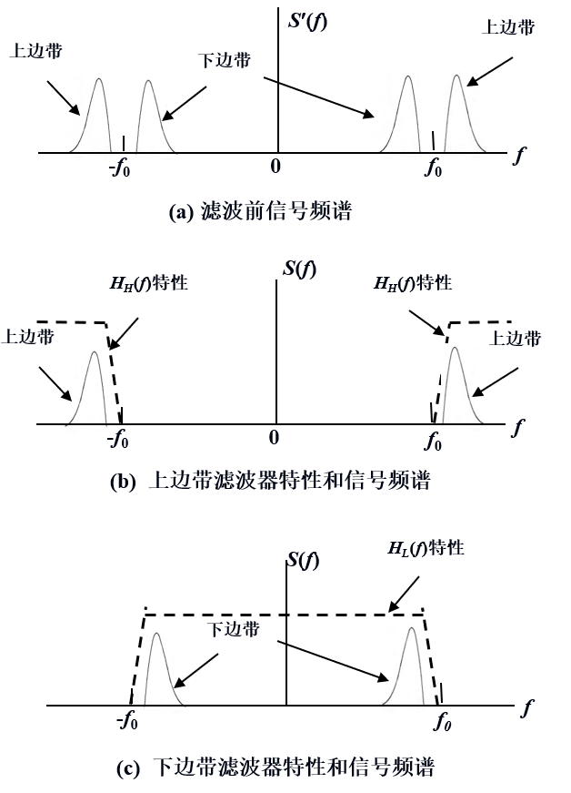

# 通信原理

李雪峰 lixuefeng@tongji.edu.cn

3 节实验课

- 期末考试（闭卷） 60%
- 实验报告 20%
- 日常作业 10%
- 出勤率课堂表现 10%

## 1. 概论

信息量的定义

$$
\begin{aligned}
    &I = - \log_{2} P
\end{aligned}
$$

标定一个等概率、二进制码元的信息量为 1 bit. 则一个等概率、$M$ 进制码元的信息量为 $\log_{2}M$ bit.

### 1.3_数字通信

- 模拟通信系统
    - 要求：高保真度
    - 准则：信号噪声功率比
    - 参量估值方法
- 数字通信系统
    - 要求：正确
    - 准则：错误率
    - 统计判决理论

数字通信的优势

- 纠错检错，提高抗干扰性
- 数字加密
- 综合模拟信号和数字信号
- 体积小、易于设计制造
- 可压缩
- 输出信噪比随带宽按指数规律增长（模拟系统则为线性）

数字通信系统模型

- 信源编码：压缩、模数转换、加密
- 信道编码：可靠性纠错
- 调制
    - 频带搬运（带通信道）
    - 仅作波形变换（基带信号）
    - 多路复用时保证信道互相正交
- 信道传输
    - 信道传输特性影响
    - 外加噪声影响
- 同步：知道起止时刻
    - 位同步 位：码元
    - 字同步 字：码组（由若干码元构成）

模拟通信系统模型

数字通信系统的主要性能

- 有效性：传输效率
    - 码元速率 $R_{B}$：单位时间内传播的码元速率 Baud
    - 信息速率 $R_{b}$：单位时间内传播的信息量 bit/s
    - 消息速率 $R_{M}$：单位时间传输的消息数目 传输文字时：字/s，与一条消息的码元长度以及同步码元的额外开销有关。

$$
\begin{aligned}
    & R_{b} = R_{B} \log_{2}M
\end{aligned}
$$
- 可靠性：错误率
    - 误码率 $P_{e}$：错误接收码元数目 / 传输码元总数目
    - 误比特率 $P_{b}$：错误接受比特数目 / 传输比特总数目
    - 误字率 $P_{w}$：错误接受字数 / 传输总字数

$$
\begin{aligned}
    & P_{b} = \frac{P_{e}}{\log_{2}M} \\
    & P_{w} = 1 - (1 - P_{e})^{k}
\end{aligned}
$$

其中 $k$ 表示字长。上面的公式二仅当 $M=2$ 时成立。

### 1.4_信道模型

信道模型

调制信道数学模型

$$
\begin{aligned}
    & e_{O}(t) = f[e_{I}(t)] + n(t)
\end{aligned}
$$

乘性干扰：

$$
\begin{aligned}
    & e_{O}(t) = k(t) e_{I}(t) + n(t)
\end{aligned}
$$

$k(t)$ 表示时变线性网络的特性，表征了各种失真：

- 线性失真：不产生新的频率分量
- 非线性失真
- 延迟
- ……

- 当 $k(t)$ 为常数，则表示最简单的情况：衰减。恒定参量信道，例如同轴电缆。
- 当 $k(t)$ 不为常数，则称为随即单数信道，例如蜂窝移动网络。

编码信道模型：二进制信道、无记忆信道

恒定参数信道：非时变线性网络

1. 线性失真

振幅 ~ 频率特性：低频段和高频段衰减较大，在某一个频段的信道特性为水平线。

补偿方法：叠加一个低频段和高频段衰减较小的模拟电路。

2. 非线性失真

- 振幅特性非线性
- 频率偏移
- 相位抖动
- ……

随即参数信道

共性：

- 衰减随机变化
- 传输时延随机变化
- 多径效应：**快**衰落

发送信号 $A \cos \omega t$ 经过 $n$ 条路经到达接收端。

$$
\begin{aligned}
    R(t) & = \sum_{i=1}^{n} r_{i}(t) \cos \omega_{0}[t - \tau_{i}(t)] \\
        &= \sum_{i=1}^{n} r_{i}(t) \cos (\omega_{0} t + \varphi_{i}(t)) \\
        &= \sum_{i=1}^{n} r_{i}(t) \cos \varphi_{i}(t) \cos \omega_{0} t - r_{i} \sin \varphi_{i}(t) \sin \omega_{0} t \\
        &= X_{c}(t) \cos \omega_{0} t - X_{s}(t) \sin \omega_{0} t
\end{aligned}
$$

可以得到包络线

$$
\begin{aligned}
    & V(t) = \sqrt{X_{c}^{2}(t) + X_{s}^{2}(t)}
\end{aligned}
$$

接收信号的相位

$$
\begin{aligned}
    & \varphi(t) = \tan^{-1} \frac{X_{s}(t)}{X_{c}(t)}
\end{aligned}
$$

$$
R(t) = V(t) \cos [\omega_{0} t + \varphi(t)]
$$

对于只有两条路径，衰减相同的情况：

$$
\begin{aligned}
    f(t) & \iff F(\omega) \\
    a f(t - \tau_{0}) + a f(t - \tau_{0} - \tau) & \iff a F(\omega) e^{-j \omega_{0} \tau_{0}} (1 + e^{-j \omega_{0} \tau})
\end{aligned}
$$

可以得到频域传递函数

$$
\begin{aligned}
    & H(\omega) = a e^{-j \omega \tau} (1 + e^{-j \omega \tau}) \\
    & |H(\omega)| = a |1 + e^{-j \omega \tau}| = 2a \left| \cos \left( \frac{\omega\tau}{2} \right) \right|
\end{aligned}
$$

传递函数会出现周期性的衰落，称为频率选择性衰落。

## 2. 信号

### 2.1_信号的类型

### 2.2_确知信号

- 能量信号：总能量有限，平均功率为 0. 表现为脉冲。
    - 频谱密度
    - 能量谱密度
- 功率信号：平均功率为有限值，能量无穷大。表现为不收敛的函数。
    - 频谱
    - 功率谱密度

功率信号的频谱

$$
\begin{aligned}
    f(t) &=  \left\{ \begin{aligned}
        &V && \frac{-\tau}{2} < t < \frac{\tau}{2} \\
        &0 && \frac{\tau}{2} < t < \left(T - \frac{\tau}{2}\right)  
    \end{aligned} \right. \\
    f(t) &= f(t - T) \\
    C(j n\omega_{0}) &=  \frac{1}{T} \int_{\frac{-\tau}{2}}^{\frac{\tau}{2}} V e^{-j n\omega_{0} t} \mathrm{d} t \\
    &= \frac{2V}{n \omega_{0}T} \sin \left(n \omega_{0} \frac{\tau}{2}\right)
\end{aligned}
$$

是分立的谱线。$C(jn \omega_{0})$

能量信号的频谱密度

$$
\begin{aligned}
    & f(t) = \left\{ \begin{aligned}
        & 1 && |t| < \frac{\tau}{2} \\
        & 0 && \text{else}
\end{aligned} \right. \\
    & F(\omega) = \tau \mathrm{Sa}\left(\frac{\omega \tau}{2}\right)
\end{aligned}
$$

是连续的函数。$F(\omega)$

|            频谱密度            |            频谱            |
|:------------------------------:|:--------------------------:|
|             连续谱             |           离散谱           |
|              V/Hz              |             V              |
| 在某一个频率点上的幅度为无穷小 | 有时为 0，有时为某一特定值 | 

ps. 对于实际的长距离函数来说，带宽资源比较重要，不能直接传播矩形波，往往传播它的频谱密度函数：抽样函数。

通过抽样函数得到的 Dirac-delta

$$
\begin{aligned}
    & \delta(t) = \lim_{k \rightarrow \infty} \frac{k}{\pi} \mathrm{Sa} (kt) \\
    & \int_{-\infty}^{\infty} \frac{k}{\pi} \mathrm{Sa} (kt) \mathrm{d} t = 1
\end{aligned}
$$

应用：为了测试器件的频率特性，需要让信号具有均匀的频谱密度。此时就采用冲激信号来测试。

$$
\begin{aligned}
    & \delta(t) \iff 1(\omega)
\end{aligned}
$$

能量谱密度：能量在频谱上的分布。

根据巴塞法尔定理

$$
\begin{aligned}
    & E = \int_{-\infty}^{\infty} \left| s(t) \right|^{2} \mathrm{d} t = \int_{-\infty}^{\infty}|S(f)|^{2} \mathrm{d} f
\end{aligned}
$$

前提：$s(t)$ 是实信号。

> proof
 
$$
\begin{aligned}
\int_{-\infty}^{\infty} \left| s(t) \right|^{2} \mathrm{d} t &= \int_{-\infty}^{\infty} s(t) s(t) \mathrm{d} t && (s(t) \in \mathbb{R}) \\
&= \int_{-\infty}^{\infty} s(t) \left[ \int_{-\infty}^{\infty} S(f) e^{i2 \pi f t} \mathrm{d} f \right] \mathrm{d} t \\
&= \int_{-\infty}^{\infty} S(f) \left[ \int_{-\infty}^{\infty} s(t) e^{i2\pi ft} \mathrm{d} f \right] \mathrm{d} t \\
&= \int_{-\infty}^{\infty} S(f) S(-f) \mathrm{d} f \\
&= \int_{-\infty}^{\infty} |S(f)|^{2} \mathrm{d} f && (S(-f) = S^{*} (f))
\end{aligned}
$$

> 当 $s(t) \in \mathbb{R}$ 时，$S(-f) = S^{*}(f)$

记能量谱密度为 $G(f) = |S(f)|^{2}$

$$
\begin{aligned}
    & E = \int_{-\infty}^{\infty} G(f) \mathrm{d} f
\end{aligned}
$$

功率信号

将功率谱信号的一部分 $|t| < \dfrac{T}{2}$ 取出作为能量信号进行能量谱密度分析，就是功率谱密度：功率在频谱上的分布。

$$
\begin{aligned}
    & P(f) = \lim_{T \rightarrow \infty} \frac{1}{T} |S_{T}(f)|^{2} \\
    & P = \lim_{T \rightarrow \infty} \frac{1}{T} \int_{-\infty}^{\infty} |S_{T} (f)|^{2} \mathrm{d} f = \int_{-\infty}^{\infty} P(f) \mathrm{d} f
\end{aligned}
$$

自相关函数

能量信号

$$
\begin{aligned}
    & R(\tau) = \int_{-\infty}^{\infty} s(t) s(\tau + t) \mathrm{d} t \\
\end{aligned}
$$

功率信号

$$
\begin{aligned}
    & R(\tau) = \lim_{T \rightarrow \infty} \int_{-\frac{T}{2}}^{\frac{T}{2}} s(t) s(\tau + t) \mathrm{d} t
\end{aligned}
$$

互相关函数

能量信号

$$
\begin{aligned}
    & R_{12}(\tau) = \int_{-\infty}^{\infty} s_{1}(t) s_{2}(\tau + t) \mathrm{d} t
\end{aligned}
$$

功率信号

$$
\begin{aligned}
    & R_{12}(\tau) = \lim_{T \rightarrow \infty} \int_{- \frac{T}{2}}^{\frac{T}{2}} s_{1}(t) s_{2}(\tau + t) \mathrm{d} t
\end{aligned}
$$

互相关的性质：

$$
\begin{aligned}
    & R_{21}(\tau) = R_{12}(-\tau) \\
    R_{21}(\tau) &= \int_{-\infty}^{\infty} s_{2}(t) s_{1}(\tau + t) \mathrm{d} t \\
        & = \int_{-\infty}^{\infty} s_{2}(x - \tau) s_{1}(x) \mathrm{d} x && (x = t + \tau) \\
        &= R_{12}(-\tau)
\end{aligned}
$$

### 2.3_随机信号

分布函数

$$
F_{X}(x) = \left\{ \begin{aligned}
    & 0 && x < x_{1} \\
    & \sum_{k=1}^{i} p_{k} && x_{i} \leq x < x_{i+1} \\
    & 1 && x \geq x_{n}
\end{aligned} \right.
$$

概率密度函数

$$
p_{X}(x) = \frac{\mathrm{d} F_{x}(x)}{\mathrm{d} x}
$$

### 2.4_随机变量举例

- 正态分布
- 均匀分布
- 瑞利分布：可以理解为二维高斯分布在底面圆（圆的半径就是瑞利分布的 x）上的线积分。

$$
\begin{aligned}
    & p_{X}(x) = \frac{2x}{a} e^{- \dfrac{x^{2}}{a}}
\end{aligned}
$$

### 2.5_随机信号的数字特征

- 期望：信号的直流分量，反映功率
- 方差：信号的交流分量，反映噪声
- 矩

k 阶矩

$$
\begin{aligned}
    & E[(X - a)^{k}] = \int_{-\infty}^{\infty} (x-a)^{k} p_{X}(x) \mathrm{d} x
\end{aligned}
$$

- $a = 0$ 原点矩
- $a = \overline{X}$ 中心矩

### 2.6_随机过程

$$
X(A, t_{i}) = X(t_{i})
$$

- 期望
- 方差
- 自相关函数

$$
R(t_{1}, t_{2}) = E[X(t_{1}) X(t_{2})]
$$

严格平稳随机过程：所有统计特性均与观察起点无关

广义平稳随机过程：下面的数字特征与观察起点无关

$$
\begin{aligned}
    & E[X(t)] = m_{X} = Const. \\
    & D[X(t)] = E[X^{2}(t)] - \{E[X(t)]\}^{2} = \sigma_{X}^{2} = Const. \\
    & R_{X}(t_{1}, t_{2}) = R_{X}(t_{1} - t_{2}) = R_{X}(\tau)
\end{aligned}
$$

各态历经性指的是一个信号实现会遍历这个信号所有实现可能的所有状态，表明可以使用**一个实现**的时间平均代替**所有实现**的统计平均。这样大大简化了观测一个随机信号的成本。

$$
\begin{aligned}
    & m_{X} = \lim_{T \rightarrow \infty} \frac{1}{T} \int_{- \frac{T}{2}}^{\frac{T}{2}} X_{i}(t) \mathrm{d} t \\
\end{aligned}
$$

> 各态历经性：统一了自相关函数的两种定义。

$$
\begin{aligned}
    & R_{X}(\tau) = \lim_{T \rightarrow \infty} \frac{1}{T} \int_{- \frac{T}{2}}^{\frac{T}{2}} X_{i}(t) X_{i}(t + \tau) \mathrm{d} t
\end{aligned}
$$

如果信号具有各态历经性，那么一定是严格平稳随机过程。事实上，很难判定一个过程是否具有各态历经性，往往根据直觉。

考虑到具有各态历经性的随机信号的特性：统计平均 = 时间平均，可以归纳信号的特性与矩的关系如下：

- 一阶原点矩 $E(X_{i}(t))$：信号的直流分量 $\lim_{T \rightarrow \infty} \dfrac{1}{T} \int_{- \frac{T}{2}}^{\frac{T}{2}} X_{i}(t) \mathrm{d} t$
- 一阶原点矩的平方：直流分量功率
- 二阶原点矩：总功率
- 二阶原点矩的平方根：均方根
- 二阶中心矩：交流分量功率

自相关函数特性

一、根据随机过程自相关函数的定义：

$$
\begin{aligned}
    & R(0) = E(X^{2}(t)) = P_{X} \\
    & R(\tau) = E[X(t_{1}) X(t_{1} + \tau)] = E[X(t_{1} + \tau) X(t_{1} + \tau - \tau)] = R(-\tau)
\end{aligned}
$$

$R(0)$ 代表了各态历经性随机过程总的归一化平均功率。

二、

$$
|R(\tau)| \leq R(0) = P_{X}
$$

Proof:

$$
\begin{aligned}
& E \left\{ [X(t) \pm X(t + \tau)]^{2} \right\} \geq 0 \\
& E[X^{2}(t)] + E[X^{2}(t + \tau)] \pm 2 E[X(t) X(t + \tau)] \geq 0 \\
& 2R(0) \pm 2R(\tau) \geq 0 \\
& |R(\tau)| \leq R(0)
\end{aligned}
$$

三、

$$
\begin{aligned}
R (\infty) &= \lim_{\tau \rightarrow \infty} E[X(t) X(t + \tau)] \\
&= \lim_{\tau \rightarrow \infty} E[X(t)] \cdot E[X(t + \tau)] && (\text{Independent }X(t), X(t + \tau)) \\
&= m_{X}^{2}
\end{aligned}
$$

$R(\infty)$ 代表各态历经性随机过程**直流分量**的归一化功率。

四、自然地

$$
\begin{aligned}
R(0) - R(\infty) = \sigma_{X}^{2}
\end{aligned}
$$

- 一方面可以从 $\sigma^{2}_{X} = m_{X^{2}} - (m_{X})^{2}$ 来理解
- 另一方面可以从**总功率 = 直流分量功率 + 交流分量功率**来理解

至此发现，对于具有各态历经性的随机过程来说，**自相关函数可以表征所有的数字特征**。

根据 [Parseval 定理](#2.2_确知信号)：

$$
P = \lim_{T \rightarrow \infty} \frac{1}{T} \int_{- \frac{T}{2}}^{\frac{T}{2}} s^{2}(t) \mathrm{d} t = \lim_{T \rightarrow \infty} \int_{-\infty}^{\infty} \frac{|S_{T}(f)|^{2}}{T} \mathrm{d} f
$$

因此功率谱密度

$$
P(f) = \lim_{T \rightarrow \infty} \frac{|S_{T}(f)|^{2}}{T}
$$

功率谱密度和自相关函数互成傅里叶变换

对于随机过程的一个实现，其功率谱密度为：

$$
\begin{aligned}
P(f) &= \lim_{T \rightarrow \infty} \frac{1}{T} S_{T}(f) \cdot S_{T}^{*}(f) \\
&= \lim_{T \rightarrow \infty} \frac{1}{T} \int_{- \frac{T}{2}}^{\frac{T}{2}} s(t) e^{-j \omega t} \mathrm{d} t \left( \int_{- \frac{T}{2}}^{\frac{T}{2}} s(t) e^{-j \omega t'} \mathrm{d} t' \right)^{*} \\
&= \lim_{T \rightarrow \infty} \frac{1}{T} \int_{- \frac{T}{2}}^{\frac{T}{2}} s(t) e^{-j \omega t} \mathrm{d} t \int_{- \frac{T}{2}}^{\frac{T}{2}} s^{*}(t') e^{j \omega t'} \mathrm{d} t' \\
&= \lim_{T \rightarrow \infty} \frac{1}{T} \int_{- \frac{T}{2}}^{\frac{T}{2}} \int_{- \frac{T}{2}}^{\frac{T}{2}} s(t) s(t') e^{-j \omega(t - t')} \mathrm{d} t \mathrm{d} t'
\end{aligned}
$$

对于随机过程，根据数字特征的定义

$$
\begin{aligned}
P_{X}(f) &= E[P(f)] \\
&= \lim_{T \rightarrow \infty} \frac{1}{T} \int_{- \frac{T}{2}}^{\frac{T}{2}} \int_{- \frac{T}{2}}^{\frac{T}{2}} E[s(t) s(t')] e^{-j \omega (t - t')} \mathrm{d} t \mathrm{d} t' \\
&= \lim_{T \rightarrow \infty} \frac{1}{T} \int_{- \frac{T}{2}}^{\frac{T}{2}} \int_{- \frac{T}{2}}^{\frac{T}{2}} R(t - t') e^{-j \omega (t - t')} \mathrm{d}t \mathrm{d} t'
\end{aligned}
$$

令

$$
\begin{aligned}
& \left\{ \begin{aligned}
    & \tau = t - t' \\
    & k = t + t'
\end{aligned} \right. \\
& \left\{ \begin{aligned}
    & t = \frac{\tau+k}{2} \\
    & t' = \frac{k - \tau}{2}
\end{aligned} \right. \\
& \begin{bmatrix} \mathrm{d} t \\ \mathrm{d} t'\end{bmatrix} = \begin{bmatrix} \frac{1}{2} & 
\frac{1}{2} \\
- \frac{1}{2} & \frac{1}{2}
\end{bmatrix} \cdot \begin{bmatrix}
\mathrm{d} \tau\\
\mathrm{d} k
\end{bmatrix}
\end{aligned}
$$

利用 Jacobian 矩阵的性质，注意换元以后积分区域的变化。

$$
\begin{aligned}
P_{X}(f) &= \lim_{T \rightarrow \infty} \frac{1}{T} \iint_{\Omega_{T}} R(\tau) e^{-j \omega \tau} \left(\frac{1}{2} \mathrm{d} \tau \mathrm{d} k\right) \\
&= \lim_{T \rightarrow \infty} \frac{1}{T} \int_{-T}^{T} \left( \int_{-T + |\tau|}^{T - |\tau|} \frac{1}{2} \mathrm{d} k \right) R(\tau) e^{-j \omega \tau} \mathrm{d} \tau \\
&= \lim_{T \rightarrow \infty} \int_{-T}^{T} \left( 1 - \frac{|\tau|}{T} \right) R(\tau) e^{-j \omega \tau} \mathrm{d} \tau \\
&= \int_{-\infty}^{\infty} R(\tau) e^{-j \omega \tau} \mathrm{d} \tau
\end{aligned}
$$

证明完毕。

> 例：设一个二进制平稳随机信号，值只能取 $\pm a$，已知在时间 $T$ 内信号值改变的次数满足 Poisson 分布，改变次数的均值为 $\mu T$，求改随机信号的自相关函数和功率谱密度。

解：对自相关函数，其值只能取两种 $\pm a^{2}$

当 $\tau > 0$ 时，

$$
\begin{aligned}
& N \sim P(\mu \tau) \\
& P(N = k) = \frac{e^{-\mu T} (\mu T)^{k}}{k!} \\
& P(R(\tau) = a^{2}) = P(N \text{ is even}) \\
& P(R(\tau) = -a^{2}) = P(N \text{ is odd}) \\
& R(\tau) = a^{2} (P(N = 0) - P(N = 1) + P(N = 2) - P(N = 3) + \cdots) \\
&= a^{2}e^{-\mu \tau}\left( \frac{(\mu \tau)^{0}}{0!} - \frac{(\mu \tau)^{1}}{1!} + \frac{(\mu \tau)^{2}}{2!} - \frac{(\mu \tau)^{3}}{3!} + \cdots \right) \\
& = a^{2} e^{- 2 \mu \tau}
\end{aligned}
$$

对称地，当 $\tau \leq 0$ 时，$R(\tau) = a^{2} e^{2 \mu \tau}$

$$
\begin{aligned}
R(\tau) &= a^{2} e^{-2\mu |\tau|} \\
P_{X}(f) &= \int_{-\infty}^{\infty} R(\tau) e^{-j \omega \tau} \mathrm{d} \tau \\
&= a^{2} \left[ \int_{-\infty}^{0} e^{2\mu \tau} e^{-j \omega \tau} \mathrm{d} \tau + \int_{0}^{ \infty} e^{-2\mu \tau} e^{-j \omega \tau} \mathrm{d} \tau \right] \\
&= a^{2} \left( \frac{1}{2\mu - j \omega} + \frac{1}{2\mu + j \omega} \right) \\
&= \frac{\mu a^{2}}{\mu^{2} + \frac{\omega^{2}}{4}}
\end{aligned}
$$

白噪声的自相关函数和功率谱密度

白噪声的频谱从 0 到 $\infty$ 连续分布。带宽无限制，因此功率无限。

$$
P_{n}(f) = \frac{n_{0}}{2}
$$

理想白噪声处处不相关

$$
R(\tau) = \int_{-\infty}^{\infty} P_{n}(f) e^{i 2\pi f} \mathrm{d} f = \frac{n_{0}}{2} \delta(\tau)
$$

实际白噪声有带宽限

$$
\begin{aligned}
P_{n}(f) &= \frac{n_{0}}{2} [u(f + f_{H}) - u(f - f_{H})] \\
R(\tau) &= \frac{n_{0}}{2} f_{H} \frac{\sin 2 \pi f_{H} \tau}{2\pi f_{H} \tau}
\end{aligned}
$$

### 2.7_高斯过程

$$
p_{X}(x, t_{1}) = \frac{1}{\sqrt{2 \pi}\sigma} e^{- \dfrac{(x-a)^{2}}{2 \sigma^{2}}}
$$

- 对称性
- 单调性
- 归一化
- 标准化

对于多个设备同时观测的情况，各个随机过程相互独立

$$
p_{X_{i}}(x_{1}, \cdots, x_{n}, t_{1}, \cdots, t_{n}) = \prod_{i=1}^{n} p_{X_{i}}(x_{i}, t_{i})
$$

是广义平稳随机过程。

> 两个随机过程相关与否决定于互相关函数是否为 0；独立与否决定于联合概率密度是否是一位概率密度的乘积。
> 相互独立则一定互不相关，互不相关不一定相互独立。

$$
\begin{aligned}
    & F_{X}(y) = \int_{-\infty}^{y} p_{X}(x) \mathrm{d} x = \Phi\left(\frac{x-a}{\sigma}\right) \\
    & \Phi(y) = \int_{-\infty}^{y} \frac{1}{\sqrt{2\pi}} e^{- \frac{x^{2}}{2}} \mathrm{d} x
\end{aligned}
$$

误差函数

$$
\mathrm{erf}(x) = \frac{2}{\sqrt{\pi}} \int_{0}^{x} e^{-z^{2}} \mathrm{d} z
$$

转换公式

$$
\begin{aligned}
F(x) &= \left\{ \begin{aligned}
& \frac{1}{2} + \frac{1}{2} \mathrm{erf}\left(\frac{x-a}{\sqrt{2}\sigma}\right) && (x \geq a) \\
& 1 - \frac{1}{2} \mathrm{erfc} \left(\frac{x-a}{\sqrt{2}\sigma}\right) && (x < a)
\end{aligned} \right.
\end{aligned}
$$

### 2.8_窄带随机过程

受到信道特性影响，带宽远小于频率的绝对值。

$$
\Delta f \ll f_{c}
$$

由于频率较为集中，可以近似为如下函数——包络线加相位变化的正弦波。

$$
\begin{aligned}
    X(t) & = a_{X}(t) \cos [\omega_{0} t + \varphi_{X}(t)] \\
        &= X_{c}(t) \cos \omega_{0} t - X_{s} \sin \omega_{0} t
\end{aligned}
$$

$a_{X}(t), \varphi_{X}(t)$ 的变化过程比 $\cos \omega_{0} t$ 要缓慢得多。

- 同相分量 $X_{c} = a_{X}(t) \cos \varphi_{X}(t)$
- 正交分量 $X_{s} = a_{X}(t) \sin \varphi_{X}(t)$

如果 $X(t)$ 是均值为 0 高斯过程，则：

1. $X_{c}(t), X_{s}(t)$ 也是均值为 0 的高斯过程，而且方差和 $X(t)$ 相等；
2. $a_{X}(t)$ 服从瑞利分布，$\varphi_{X}(t)$ 服从均匀分布。

$$
\begin{aligned}
p(a_{X}) &= \frac{a_{X}}{\sigma_{X}^{2}} e^{- \dfrac{a_{X}^{2}}{2 \sigma_{X}^{2}}} && (a_{X} \geq 0) \\
p(\varphi_{X}) &= \frac{1}{2\pi} && (0 \leq \varphi_{X} \leq 2\pi)
\end{aligned}
$$

proof 1:

$$
\begin{aligned}
E[X(t)] &= E[X_{c}(t)] \cos \omega_{0} t - E[X_{s}(t)] \sin \omega_{0} t \\
&\Rightarrow  \left\{ \begin{aligned}
& E[X_{c}(t)] = 0 \\
& E[X_{s}(t)] = 0
\end{aligned} \right.
\end{aligned}
$$

自相关函数

$$
\begin{aligned}
R_{X}(t, t + \tau) &= R_{X_{c}}(t, t + \tau) \cos \omega_{0} t \cos \omega_{0} (t + \tau) \\
&- R_{X_{c}X_{s}}(t, t + \tau) \cos \omega_{0} t \sin \omega_{0} (t + \tau) \\
&- R_{X_{s}X_{c}}(t, t + \tau) \sin \omega_{0} t \cos \omega_{0} (t + \tau) \\
&+ R_{X_{s}}(t, t + \tau) \sin \omega_{0} t \sin \omega_{0} (t + \tau)
\end{aligned}
$$

对于平稳随机过程

$$
\begin{aligned}
&R_{X}(t, t+\tau) = R_{X}(\tau) \\
t = 0 &\Rightarrow R_{X}(\tau) = R_{X_{c}}(\tau) \cos \omega_{0} \tau - R_{X_{c}X_{s}} (\tau) \sin \omega_{0} \tau \\
t = \frac{\pi}{2\omega_{0}} &\Rightarrow R_{X}(\tau) = R_{X_{s}}(\tau) \cos \omega_{0} \tau + R_{X_{s}X_{c}} (\tau) \sin \omega_{0} \tau
\end{aligned}
$$

和时间 $t$ 无关，因此 $X_{c}(t), X_{s}(t)$ 也是平稳随机过程。另外还可以得到：

$$
\begin{aligned}
\left\{ \begin{aligned}
& R_{X_{c}}(\tau) = R_{X_{s}}(\tau) \\
& R_{X_{s}X_{c}}(\tau) = - R_{X_{c}X_{s}}(\tau)
\end{aligned} \right.
\end{aligned}
$$

根据互相关函数的定义：

$$
\begin{aligned}
& R_{X_{s}X_{c}}(\tau) = R_{X_{c}X_{s}}(- \tau) \\
&\Rightarrow R_{X_{c}X_{s}}(-\tau) = - R_{X_{c}X_{s}}(\tau) 
\end{aligned}
$$

$R_{X_{c}X_{s}}(\tau)$ 是奇函数，$R_{X_{c}X_{s}}(\tau) = R_{X_{s}X_{c}}(\tau) = 0$，同一时刻的 $X_{s}, X_{c}$ 是互不相关的。

$$
\begin{aligned}
& \left\{ \begin{aligned}
R_{X}(\tau) & = R_{X_{c}}(\tau) \cos \omega_{0} \tau \\
R_{X_{c}}(\tau) & = R_{X_{s}}(\tau)
\end{aligned} \right. \\
&\Rightarrow R_{X}(0) = R_{X_{s}}(0) = R_{X_{c}}(0) \\
&\Rightarrow \sigma_{X} = \sigma_{X_{c}} = \sigma_{X_{s}}
\end{aligned}
$$

### 2.9_正弦波加窄带随机过程

信号 + 噪声

$$
r(t) = A \cos (\omega_{0} t + \theta) + n(t)
$$

由于信道的不稳定性，认为 $\theta$ 是随机值，$n(t)$ 是噪声，认为是窄带随机过程。

$r(t)$ 的包络概率密度为满足广义瑞利分布（莱斯分布）：

$$
\begin{aligned}
p_{r}(x) &= \frac{x}{\sigma^{2}} I_{0} \left( \frac{Ax}{\sigma^{2}} \right) e^{- \dfrac{x^{2} + A^{2}}{2\sigma}} && x \geq 0
\end{aligned}
$$

其中：

- $\sigma^{2}$ 是 $n(t)$ 的方差。
- $I_{0}(\cdot)$ 是零阶贝塞尔函数。$I_{0}(0) = 0$

取 $A \rightarrow 0$，退化为瑞利分布。

$r(t)$ 的相位包括正弦信号的随即相位 $\theta$ 和噪声的相位 $\varphi$ 两部分。给定 $\theta$：

$$
\begin{aligned}
p(\varphi | \theta) = \frac{1}{2\pi}e^{- \frac{A^{2}}{2\sigma^{2}}} + \frac{A \cos (\theta - \varphi)}{2 \sqrt{2\pi} \sigma} e^{- \frac{A^{2}}{2\sigma^{2}} \sin^{2}(\theta - \varphi)} \left\{ 1 + \mathrm{erf} \left[ \frac{A \cos (\theta - \varphi)}{\sqrt{2} \sigma} \right] \right\}
\end{aligned}
$$

全概率公式：

$$
p(\varphi) = \int_{0}^{2\pi} p(\varphi | \theta) p(\theta) \mathrm{d} \theta
$$

从这些不懂怎么证明的数学公式中绘图，可以得出关于信噪比 $A/\sigma$ 的定性结论：

- $\dfrac{A}{\sigma}$ 较小，噪声大，包络曲线退化为瑞利分布，相位退化为均匀分布；
- $\dfrac{A}{\sigma}$ 较大，噪声小，包络曲线退化为高斯分布，相位退化为 0 点的冲激函数。

### 2.10_信号通过线性系统

线性系统：

- 无源
- 无记忆
- 非时变

因果性、线性

确知信号通过线性系统

$$
\begin{aligned}
    & y(t) = h(t) * x(t) \\
    & \left\{ \begin{aligned}
        & h(t) = 0 && (t < 0) \\
        & \int_{-\infty}^{\infty} |h(t)| \mathrm{d} t < \infty
    \end{aligned} \right. \\
    & Y(f) = H(f) X(f)
\end{aligned}
$$

如果输入信号具有周期性，频谱为分立谱线

$$
\begin{aligned}
    & x(t) = \sum_{n=-\infty}^{\infty} C(n \omega_{0}) e^{j n \omega_{0} t} \\
    & y(t) = \sum_{n=-\infty}^{\infty} C(n \omega_{0}) H(n \omega_{0}) e^{j n \omega_{0} t}
\end{aligned}
$$

无失真传输条件

$$
y(t) = k x(t - t_{d})
$$

仅发生了放大和延时，波形不变。

$$
\begin{aligned}
    & H(f) = \frac{Y(f)}{X(f)} = k e^{-j t_{d} \omega} \\
    & |H| = k = Const. \\
    & \varphi = t_{d} \omega = 2 \pi t_{d} f
\end{aligned}
$$

幅频特性为常数，相频特性为过原点的直线。

## 3. 模拟调制系统

### 3.1_概述

模拟调制：用来自信源的基带模拟信号调制某载波。

- 将信源信号转化成适合在信道中传输的已调信号
- 改善抗干扰性能
- 同一信道多个信号频分复用

载波：确知周期信号

$$
c(t) = A \cos (\omega_{0} t + \varphi_{0})
$$

大部分调制器可以认为是乘法器。

- 线性调制
    - 调幅 AM
    - 单边带
    - 双边带
    - 残留边带
- 非线性
    - 调频 FM
    - 相位调制

### 3.2_线性调制

$$
\begin{aligned}
    m(t) & \iff M(\omega) \\
    s(t) = m(t) A \cos \omega_{0} t & \iff S(\omega)
\end{aligned}
$$

$$
S(\omega) = \frac{A}{2} [M(\omega - \omega_{0}) + M(\omega + \omega_{0})]
$$

调幅 AM

$$
\begin{aligned}
    m'(t) &:= m(t) + 1 \\
    s(t) &= m'(t) \cdot A \cos \omega_{0} t
\end{aligned}
$$

+1 是为了保证调整以后的信号 $m'(t) \geq 0$，避免幅度为负。"1" 的值要根据信号的强度确定。

解调方法：直接整流、低通滤波就可以了，本质上还是一个时域的方法。

功率和带宽资源浪费！

双边带调制：不在加入直流分量，甚至要保证 $m(t)$ 不存在直流分量，这样就能解决 $\pm f_{0}$ 处功率浪费。

解调中也需要载波成分（与发射端同频同相），和信号与系统中一样。如果考虑不能保证同频同相的误差：

$$
\begin{aligned}
    & r'(t) = m'(t) \cos \omega_{0} t \cos [(\omega_{0} + \Delta \omega) t + \varphi] \\
    &= \frac{1}{2} m'(t) \left\{ \cos (\Delta \omega t + \varphi) + \cos [(2 \omega_{0} + \Delta \omega) t + \varphi] \right\} \\
\end{aligned}
$$

低通滤波以后得到的信号为：

$$
\frac{1}{2} m'(t) \cos (\Delta \omega t + \varphi)
$$

当同频同相时，

$$
\frac{1}{2} m'(t)
$$

可以节省功率，但是由于设备复杂，不能广泛应用。

单边带调制

因为边带对称，只发送一半边带。节省了一半功率，更重要地，节省了一半带宽。

基于无法得到完全同频同相的载波信号的缺陷，设计出了：

残留边带方式

解调时不需要载波分量，容许存在一部分低频分量和直流分量。

$$
S(f) = \frac{A}{2} \left[ M(f - f_{0}) + M(f + f_{0} \right] H(f)
$$

### 3.3_非线性调制

频率调制

$$
\begin{aligned}
    & c(t) = A \cos \varphi(t) = A \cos (\omega_{0} t + \varphi) \\
    & \omega_{0} = \frac{\mathrm{d}\varphi(t)}{\mathrm{d}t}
\end{aligned}
$$

瞬时频率

$$
\begin{aligned}
    & c(t) = A \cos \varphi(t) \\
    & \varphi(t) = \int_{0}^{t} \omega(t) \mathrm{d} t
\end{aligned}
$$

角度调制：$\varphi(t)$ 随着 $m(t)$ 变化

相位调制

$$
\begin{aligned}
    & \varphi(t) = \varphi_{0} + \omega_{0} t + k_{p} m(t) \\
    & \omega(t) = \omega_{0} + k_{p} \frac{\mathrm{d} m(t)}{\mathrm{d} t}
\end{aligned}
$$

频率调制

$$
\begin{aligned}
    & \omega(t) = \omega_{0} + k_{f} m(t) \\
    & \varphi(t) = \varphi_{0} + \omega_{0} t + k_{f} \int_{0}^{t} m(t) \mathrm{d} t
\end{aligned}
$$

## 4. 模拟信号的数字化

### 4.1_引言

A/D:

- 抽样
- 量化
- 编码

音频信号：每秒钟取样 8000 次，每次取样 8 位码，共 64 kbps

PCM 脉冲编码调制

1. 标准 PCM
2. 差分脉冲编码调制 DPCM
3. 自适应 DPCM

### 4.2_模拟信号的抽样

抽样定理：对于带宽有限的模拟信号，如果抽样速率足够大，这些抽样值就可以完全恢复出原信号。

均匀抽样定理：

$$
T \leq \frac{1}{2f_{H}}
$$

证明：对于原信号 $s(t)$ 进行等间隔抽样

$$
\begin{aligned}
s_{k}(t) &= s(t) \delta_{T}(t) \\
S_{k}(f) &= S(f) * \Delta_{\Omega}(f) \\
\Delta_{\Omega}(f) &= \frac{1}{T} \sum_{n=-\infty}^{\infty} \delta\left(f - \frac{n}{T}\right)
\end{aligned}
$$

关于 $\mathscr{F}\Delta_{\Omega}(f)$ 的傅里叶变换证明见[积分变换的笔记](IntegralTransforms.md#Discrete_Revolution)。

$$
\begin{aligned}
S_{k}(f) &= \frac{1}{T} \left[ S(f) * \sum_{n=-\infty}^{\infty}\delta\left(f - \frac{n}{T}\right) \right] \\
&= \frac{1}{T} \sum_{n=-\infty}^{\infty} S\left(f - \frac{n}{T}\right)
\end{aligned}
$$

离散采样以后的频谱变成了周期性的，如果周期 $f_{s} = \dfrac{1}{T}$ 可以使得频谱不交叠，那么就可以使用一个低通滤波器来提取原来的信号。得到抽样定理：

$$
f_{s} \geq 2f_{H}
$$

> [!help]
> 为什么是 $2f_{H}$？
> 
> 因为低通信号的频谱范围是 $-f_{H} \sim f_{H}$，抽样信号的频域周期必须大于 $2f_{H}$.

一般来说低通滤波器不是理想的，因此 $f_{s}$ 要比 $2f_{H}$ 大许多。

那么带通模拟信号呢？如果信号的最低频率比 0 要大许多，还有将抽样频率取得像之前定理指出的那么高吗？

$$
\begin{aligned}
f_{s} &= 2 B \left(1 + \frac{k}{n}\right) = \frac{2f_{H}}{n} \\
B &:= f_{H} - f_{L} \\
\frac{f_{H}}{B} &:= n + k
\end{aligned}
$$

其中：

- $0 < k < 1$
- $n$ 是小于 $\dfrac{f_{H}}{B}$ 的最大整数。

相当于利用了 $-f_{L} \sim f_{L}$ 中间的空空地带。但是上面的公式指出的是一个合理的抽样频率，不是所有大于这个 $f_{s}$ 的抽样都能无损恢复，可能原来叠在空空地带的频率会变得和原来频谱交叠。

---

模拟脉冲调制

- PAM 脉冲振幅调制 一个方波抽样脉冲和基带信号直接相乘
- PWM 脉冲宽度调制 将 PAM 的幅值转换成占空比
- PPM 脉冲位置调制 将 PAM 的幅值转化成脉冲相位（位置）的变化

---

### 4.3_抽样信号的量化

$$
\begin{aligned}
s_{q}(kT) &= q_{i} && m_{i-1} \leq s(kT) < m_{i}
\end{aligned}
$$

- 均匀量化
- 非均匀量化

---

均匀量化

- 量化噪声
- 信号量噪比

$$
\begin{aligned}
S &= E(s_{k}^{2}) = \int_{a}^{b} s_{k}^{2} f(s_{k}) \mathrm{d} s_{k} \\
N_{q} &= E[(s_{k} - s_{q})^{2}] = \sum_{i=1}^{M} \int_{a + (i-1) \Delta v}^{a + i \Delta v} E\left\{\left\{s_{k} - \left[a + \left(i- \frac{1}{2}\right) \Delta v\right]\right\}^{2} \right\} f(s_{k}) \mathrm{d} s_{k}
\end{aligned}
$$

量噪比的定义：功率之比 $\dfrac{S}{N_{q}}$.

> [!tip]
> 均匀量化是保证绝对偏差差不多的量化，非均匀量化是保证相对偏差差不多的量化，更适用于小信号的量化。

为了实现非均匀量化，首先要将抽样信号经过一个非线性环节转换成新信号，再对新信号进行均匀量化。

$$
\begin{aligned}
y &= y(x) \\
\frac{\mathrm{d}x}{\mathrm{d}y} &\propto x
\end{aligned}
$$

可以猜出来是对数函数

$$
\begin{aligned}
y &= 1 + \frac{1}{k} \ln x
\end{aligned}
$$

---

hw: 4.3 4.4 4.13 4.14

4.4 4.5

## 5. 基带数字信号的表示和传输

## 6. 数字调制系统

## 7. 同步
