# 自动控制原理

> I hear and I forget.
> I see and I remember.
> I do and I practice.

Abilities

- basic understanding of the feedback ctrl theory
- perform analysis and design of feedback ctrl systems
- experience

Textbooks

- *Modern Control System*, R.C.Dorf 13th edition
- *Modern Control Engineering*, K.Ogata, 5th edition
- *MATLAB for Control Engineers*, K.Ogata
- IEEE Control System Magazine
- IEEE Spectrum

## 1. Introduction to Control Systems

Control System: **desired response**.

History of Control

- [Watt stream engine flyball governor](https://www.bilibili.com/video/BV1VQ4y1D7ZV?share_source=copy_web&vd_source=e3e40d365bf2e2c7fbda5741b433dc1c)
- Wiener: Cybernetic, or control and communication in the animal and machine, 1948

Example1: Bicycle Steering Control

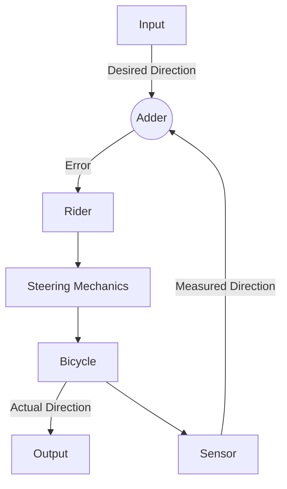
```mermaid
flowchart TD;
I[Input] --> |Desired Direction| A((Adder)) --> |Error| R[Rider] --> S[Steering Mechanics] --> B[Bicycle] --> |Actual Direction| O[Output]
B --> Se[Sensor] --> |Measured Direction| A
```

Example2: Flyball speed control

Fundamental of Control System

- Sensor
- Controller
- Actuator
- Processor

The principle of Feedback Control: to **control the process** by using the **difference** between the output and reference input.

negative / positive feedback

Example of positive feedback:

- 麦克风和音响互相干扰
- 房价
- 军机在控制的时候故意引入一定正反馈，保证转向的灵敏

Types of Control Structure

- Open-loop ctrl sys: ctrl **directly** without feedback

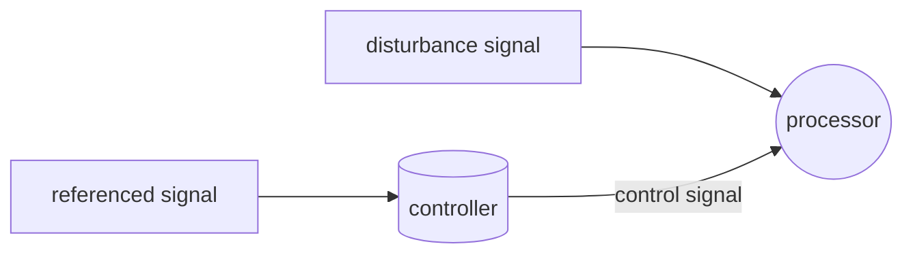
```mermaid
flowchart LR;
D[disturbance signal] --> P((processor))
R[referenced signal] --> C[(controller)] --> |control signal| P
```

- Closed-loop

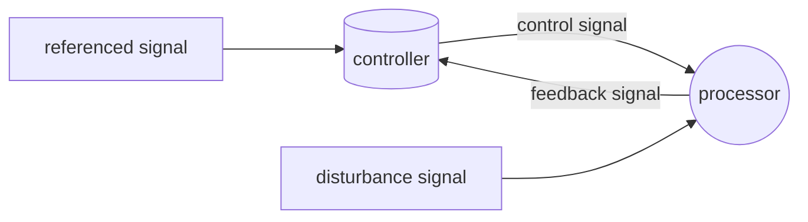
```mermaid
flowchart LR;
R[referenced signal] --> C[(controller)] --> |control signal| P --> |feedback signal| C
D[disturbance signal] --> P((processor))
```

- 前馈（对干扰信号有所了解）

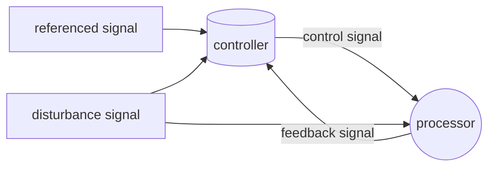
```mermaid
flowchart LR;
R[referenced signal] --> C[(controller)] --> |control signal| P --> |feedback signal| C
D[disturbance signal] --> P((processor))
D --> C
```

Component

- Signal generators: AC/DC
- Comparison units
- Controller: 微机原理、嵌入式
- Amplifiers: AC/Motor
- Energy unit: Motor
- Actuators: Motor
- Process: 运动控制和过程控制（“一体两用”的“两用”）
- Measurement units

Performance Indexed of Control Systems 评价控制系统的指标

1. Stability “稳”
2. Steady-state performance 稳态表现 “准”
3. Transient performance 动态表现 “快”

Classification of ctrl sys

- math description:
    - SISO: single input single output; MIMO: multi input multi output
    - linear; nonlinear
    - time-invariant; time-variant: 系统的参数随时间变化
    - continuous-time; discrete-time; hybrid
- ctrl object:
    - regulation ctrl: 调整
    - tracking ctrl: 跟踪（更为动态）
- plant types:
    - motion ctrl
    - process ctrl
- actuator types:
    - 电控：灵敏快速
    - 液压：功率大
    - 气动

Simulation with MATLAB

- Control engineering is an *exciting* subject, and it is everywhere!
- *Feedback* is the most important concept of control engineering.

> *Let us control everything!*

## 2. Mathematical Models of Systems

### 2.1_Intro

To design a ctrl model:

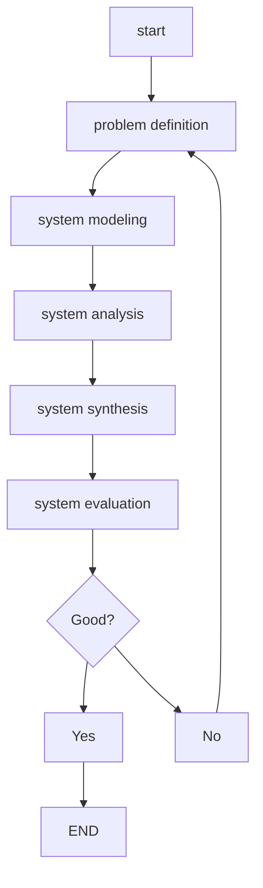
```mermaid
flowchart TD
start -->p[problem definition] --> s1[system modeling] --> a[system analysis] --> s2[system synthesis] --> e[system evaluation] --> G{"Good?"} --> Yes --> END
G --> No --> p
```

Two modeling method:

- physical principle 机理
    - differential or difference equation
    - transfer function/matrix
    - state space equations(optimal ctrl, robust ctrl)
- identification 辨识：很难建立机理模型，参数随时间变化（灰箱模型）
    - 例如敲西瓜

### 2.2_DE

$$
\begin{aligned}
    & F(t) = kx(t) + c  \frac{ \mathrm{d} x}{ \mathrm{d} t} + m  \frac{ \mathrm{d}^{2} x}{ \mathrm{d} t^{2}} \\
    & V(t) = \frac{1}{C} q(t) + R  \frac{ \mathrm{d} q}{ \mathrm{d} t} + L  \frac{ \mathrm{d}^{2} q}{ \mathrm{d} t^{2}}
\end{aligned}
$$

DC Motor

- high power workhorse
- torque ~ current
- steady state const load velocity ~ current

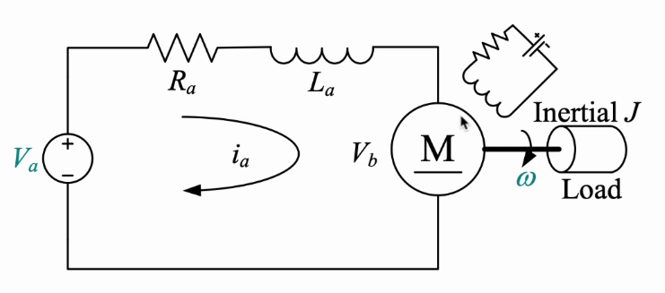

$$
\begin{aligned}
    & V_{a} = R_{a} i_{a} + L_{a}  \frac{ \mathrm{d} i_{a}}{ \mathrm{d} t} + V_{b} \\
    & T_{L} = T_{m}- T_{d} = J  \frac{ \mathrm{d} \omega}{ \mathrm{d} t} \\
    & V_{b} = K_{m} \omega \\
    & T_{m} = K_{m} i_{a}
\end{aligned}
$$

- $T_{L}$: load torque
- $T_{m}$: motor torque
- $T_{d}$: disturbance torque

$$
\begin{aligned}
    &  \frac{L_{a}J}{K_{m}} \frac{ \mathrm{d}^{2}\omega}{ \mathrm{d} t^{2}} + \frac{R_{a}J}{K_{m}} \frac{\mathrm{d}\omega}{ \mathrm{d}t} + K_{m} = V_{a}
\end{aligned}
$$

### 2.3_Linear_Approximations_of_Physical_Sys

What is Linear Approximation

- $e(t) = 0 \Rightarrow r(t) = 0$
- $E(t) = ae_{1}(t) + be_{2}(t) \Rightarrow r(t) = ar_{1}(t) + br_{2}(t)$

Suppose the sys:

$$
\begin{aligned}
    & g: x(t) \rightarrow y(t)
\end{aligned}
$$

Taylor expansion:

$$
\begin{aligned}
    y&  = g(x_{0}) + g'(x_{0}) (x - x_{0}) + \frac{g''(x_{0})}{2} (x - x_{0})^{2} + \cdots \\
    &= g'(x_{0}) (x +  \frac{g(x_{0})}{g'(x_{0})} - x_{0})
\end{aligned}
$$

### 2.4_LT

### 2.5_Transfer_Func

Utilize Laplace Transform to build **transfer function**

- 零初始条件
- 线性时不变系统

以弹簧阻尼振子为例

$$
\begin{aligned}
    & M  \frac{ \mathrm{d}^{2} x}{ \mathrm{d} t^{2}} + c  \frac{ \mathrm{d} x}{ \mathrm{d} t} + k x = r(t) \\
    & M [s^{2} X(s) - sx(0^{-})-x'(0^{-})] + c [sX(s)-x(0^{-})] + k X(s) = R(s) \\
\end{aligned}
$$

根据零初始条件

$$
\begin{aligned}
    & M s^{2}X(s) + c s X(s) + k X(s) = R(s) \\
    & H(s) = \frac{X(s)}{R(s)} = \frac{1}{Ms^{2}+cs+k}
\end{aligned}
$$

对 RLC 并联电路，输入电流，输出电压：

$$
\begin{aligned}
    &  \frac{v(t)}{R} + C  \frac{ \mathrm{d} v(t)}{ \mathrm{d} t} + \frac{1}{L} \int v(t)  \mathrm{d} t = i(t) \\
    & \frac{1}{R} V(s) + C s V(s) + \frac{1}{Ls} V(s) = I(s) \\
    & H(s) = \frac{V(s)}{I(s)} = \frac{1}{\frac{1}{R}+ Cs  + \frac{1}{Ls}} = \frac{RLs}{CLRs^{2} + Ls + R}
\end{aligned}
$$

采用复阻抗的概念也可以直接得到传递函数等于电阻

$$
\begin{aligned}
    & H(s) = \frac{1}{\sum D} = \frac{1}{\frac{1}{R} + \frac{1}{Ls} + Cs }
\end{aligned}
$$

The transform function of Op-Amp circuits

$$
\begin{aligned}
    & v_{o} = K(v_{+} - v_{-})
\end{aligned}
$$

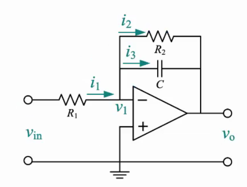

$$
\begin{aligned}
    & i_{1} = \frac{v_{in} - v_{1}}{R_{1}} \\
    & i_{2} = \frac{v_{1}-v_{o}}{R_{2}} \\
    & i_{3} =  C\frac{ \mathrm{d} i_{3} }{ \mathrm{d} t} \\
    & i_{1} = i_{2} + i_{3} && (\text{rule 1}) \\
    & v_{1} = 0 && (\text{rule 2})
\end{aligned}
$$

或者直接使用复阻抗

$$
\begin{aligned}
    & \frac{V_{in}}{R_{1}} + \frac{V_{o}}{R_{2}} + \frac{V_{o}}{sC} = 0 \\
    & H(s) = \frac{V_{o}}{V_{in}} = -\frac{\frac{1}{R_{1}}}{\frac{1}{R_{2}}+ \frac{1}{sC}}
\end{aligned}
$$

Simple PID controller by Op-Amp

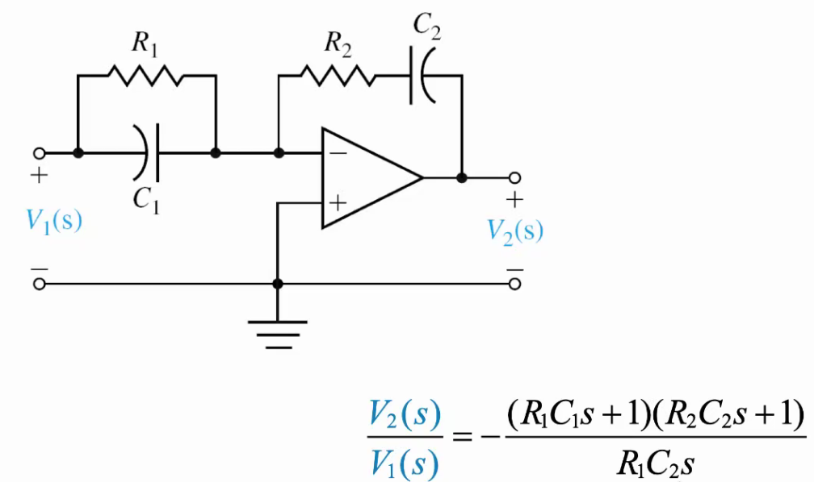

公式中 $s$ 表示微分，0 次项表示比例，$\dfrac{1}{s}$ 表示积分。

相应地，对于电机控制：

$$
\begin{aligned}
    V_{a} &= \frac{L_{a}J}{K_{m}} \frac{ \mathrm{d}^{2}\omega}{ \mathrm{d} t^{2}} + \frac{R_{a}J}{K_{m}} \frac{\mathrm{d}\omega}{ \mathrm{d}t} + K_{m} \\
    \frac{\omega(s)}{V_{a}(s)}  &= \frac{1}{\frac{L_{a}J}{K_{m}}s^{2} + \frac{R_{a}J}{K_{m}}s + K_{m}} \\
    &= \frac{\frac{1}{K_{m}}}{\tau_{m} \tau_{a} s^{2} + \tau_{m} s + 1} &&  \left( \tau_{a} = \frac{L_{a}}{R_{a}}, \tau_{m} = \frac{R_{a}J}{K_{m}^{2}} \right) \\
    &= \frac{\frac{1}{K_{m}}}{\tau_{m} s + 1} && (\tau_{m} \gg \tau_{a})
\end{aligned}
$$

或者对于每一个方程都进行 LT：

$$
\left\{ \begin{aligned}
    & V_{a} = R_{a} i_{a} + L_{a}  \frac{ \mathrm{d} i_{a}}{ \mathrm{d} t} + V_{b} \\
    & T_{L} = T_{m}- T_{d} = J  \frac{ \mathrm{d} \omega}{ \mathrm{d} t} \\
    & V_{b} = K_{m} \omega \\
    & T_{m} = K_{m} i_{a}
\end{aligned} \right. \Rightarrow  \left\{ \begin{aligned}
    & V_{a}(s) - V_{b}(s) = (R_{a} + sL_{a}) I_{a}(s) \\
    & T_{L}(s) = T_{m}(s) - T_{d}(s) = Js \omega(s) \\
    & V_{b}(s) = K_{m}\omega(s) \\
    & T_{m}(s) = K_{m} I_{a}(s)
\end{aligned} \right.
$$

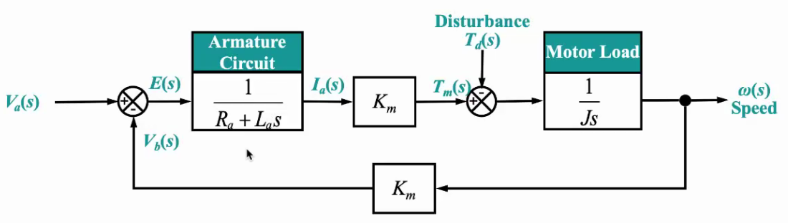

### 2.6_Block_Diagram

单位负反馈系统

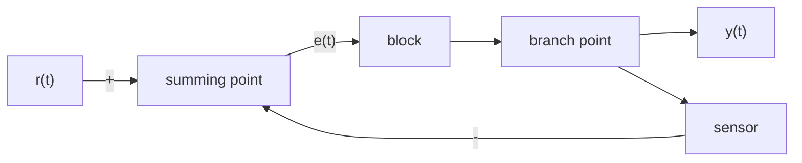
```mermaid
flowchart LR;
I["r(t)"] --> |"+"|Add[summing point] --> |"e(t)"| G[block] --> b[branch point] --> O["y(t)"]
b --> sensor --> |"-"|Add
```

- 级联系统 $\boldsymbol{X}_{3} = \boldsymbol{G}_{2} \boldsymbol{G}_{1} \boldsymbol{X}_{1}$
- branch point 前移
- branch point 后移
- summing point 前移
- summing point 后移
- eliminate a feedback loop

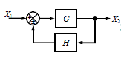

$$
\begin{aligned}
    & X_{3} = X_{1} \pm X_{4} \\
    & X_{2} = G X_{3} \\
    & X_{4} = H X_{2} \\
    & X_{2} = G X_{1} \pm GH X_{2} \\
    & (I \mp GH)X_{2} = G X_{1} \\
    & X_{2} = (I \mp GH)^{-1} G X_{1}
\end{aligned}
$$

如何化简复杂的反馈网络？

综合利用上面的移动等效原理。

移动的过程中不能交换求和点和分支点的位置，不能“去耦”。

### 2.7_Signal-Flow_Graph

- cascade

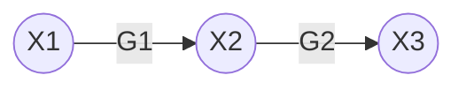
```mermaid
flowchart LR
1((X1)) --> |G1| 2((X2)) --> |G2| 3((X3))
```

- parallel

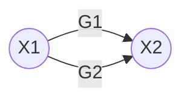
```mermaid
flowchart LR
1((X1)) --> |G1| 2((X2))
1 --> |G2| 2
```

- cascade & parallel
- feedback

Mason's Gain Formula

$$
P = \frac{1}{\Delta} \sum_{k} P_{k} \Delta_{k}
$$

- $k$ 前项通道
- $P_{k}$ 前项通道的转移函数
- $\Delta$ 奇怪的东西??? 下式中相乘的 $I$ 是不相交的回路

$$
\Delta = 1 - \sum_{k} I_{a} + \sum_{k} I_{b} I_{c} - \cdots
$$

- $\Delta_{k}$ 令 $P_{k} = 0$ 重新计算 $\Delta$

### 2.8_MATLAB_Sim

```matlab
roots % root of polynomial
poly % get polynomial from roots
polyval % value of polynomial
conv % convolution
tf % transfer func
pole
zero
pzmap
series
parallel
feedback
step
impulse
```

## 3.Time-Domain_Analysis

### 3.1_Intro

### 3.2_Feedback_Ctrl_Sys_Characteristics

$$
\begin{aligned}
    & Y(s) = \frac{G(s)}{1 + GH(s)} R(s) \\
    & GH(s) \gg 1 \Rightarrow Y(s) \approx \frac{1}{H(s)} R(s)
\end{aligned}
$$

深度负反馈，忽略了 $G(s)$ 本身的影响。可以降低系统的相应的系统模型的依赖性。

存在干扰时

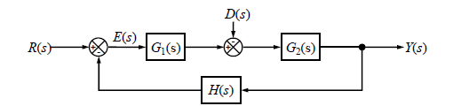

利用线性系统的叠加性质，分母是相同的，分子取决于输入到输出的前向通道。

$$
\begin{aligned}
    Y(s) &= \frac{G_{1}G_{2}(s)}{1 + G_{1}G_{2}H(s)} R(s) - \frac{DG_{2}(s)}{1 + G_{1}G_{2}H(s)} D(s) \\
        & \approx \frac{1}{H(s)} R(s) - \frac{1}{G_{1}H(s)} D(s) && (G_{1}G_{2}H(s) \gg 1)
\end{aligned}
$$

Feedback control can reduce the effect of disturbance inputs.

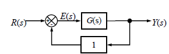

$$
\begin{aligned}
    & E(s) = \frac{1}{1+ GH(s)} R(s) = \frac{1}{1+G(s)} R(s) \\
    & r(t) = u(t), R(s) = \frac{1}{s} \\
\end{aligned}
$$

Open-Loop:

$$
\begin{aligned}
    Y(s) &= G(s) \cdot R(s) = \frac{G(s)}{s} \\
    e_{ol}&= \lim_{t \rightarrow \infty} [r(t) -  y(t)] = 1 - \lim_{s \rightarrow 0} sY(s) = 1 - G(0)
\end{aligned}
$$

Closed-Loop:

$$
e_{cl} = \lim_{t \rightarrow \infty} [r(t) - y(t)] = 1 - \lim_{s \rightarrow 0} sY(s) = \frac{1}{1+G(0)}
$$

对于 $G(0)>1$，$e_{cl} < e_{ol}$

Feedback System can reduce system's steady-state error.

> 如何在物理意义上理解终值定理？$t \rightarrow \infty$ 时，系统趋向于稳定，频率基本为 0.

e.g. Boring Machine 盾构机

挖海底隧道从两头开始挖，如何保证对接成功？

Boring Machine's Math Model

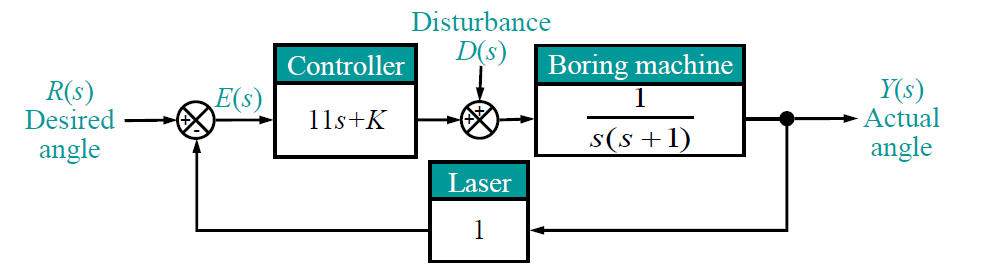

$$
\begin{aligned}
    Y(s) &= \frac{\frac{11s + K}{s(s+1)}}{1 + \frac{11s+K}{s(s+1)}} R(s) + \frac{\frac{1}{s(s+1)}}{1 + \frac{11s+K}{s(s+1)}} D(s) \\
    E(s) &= R(s) - Y(s) = \frac{1}{1 + \frac{11s+K}{s(s+1)}} R(s) - \frac{\frac{1}{s(s+1)}}{1 + \frac{11s+K}{s(s+1)}} D(s) \\
    e(\infty) &= \lim_{s \rightarrow 0} sE(s) = \lim_{s \rightarrow 0} \left(\frac{s^{3}+s^{2}}{s^{2}+12s+K} R\left(s\right) - \frac{s}{s^{2}+12s+K} D(s)\right) \\
\end{aligned}
$$

$$
\begin{aligned}
    e(\infty) &= \left\{ \begin{aligned}
        &= \lim_{s \rightarrow 0} \frac{s^{2}+s}{s^{2}+12s+K} = 0 &&(r(t) = u(t), d(t) = 0) \\
        &= \lim_{s \rightarrow 0} \frac{-1}{s^{2}+12s+K} = - \frac{1}{K} && (r(t) = 0, d(t) = u(t))
    \end{aligned} \right.
\end{aligned}
$$

### 3.3_Stability_of_Feedback_Sys

stable sys: bounded input ---> bounded output

- stable
    - global
    - asympotic
- neutral
- nonstable

LTI sys is stable if and only if:

$$
\int_{-\infty}^{\infty} |h(t)| \mathrm{d} t < \infty
$$

这里的有界是按照新的规则：积分来判断的。

系统的转移函数可以通用的写成：

$$
\begin{aligned}
    H(s) & = \frac{p(s)}{q(s)} \frac{K \prod_{i=1}^{M}(s+z_{i})}{s^{N} \prod_{k=1}^{Q} (s+\sigma_{k}) \prod_{m=1}^{R}[s^{2} + 2 \alpha_{m} s + (\alpha_{m}^{2} + \omega_{m}^{2})]} \\
    h(t) & = \sum_{k=1}^{N+Q} A_{k} e^{-\sigma_{k}t} + \sum_{m=1}^{R} \frac{B_{m}}{\omega_{m}} e^{-\alpha_{m}t} \sin (\omega_{m} t + \theta_{m})
\end{aligned}
$$

LTI sys is stable if and only if:

- all the roots of characteristic equation have negative real parts
- all the poles of its transfer func are in the left side of $s$ plane

如何在不求解特征方程的情况下判断系统的稳定性？

- Lyapunov Methods
- Routh-Kurwitz Criterion

**Routh-Kurwitz Criterion**

characteristic equation:

$$
\begin{aligned}
    & q(s) = a_{n}s^{n} + \cdots + a_{1}s + a_{0} \\
    & \begin{array}{c|cc}
        s^{n} & a_{n} & a_{n-2} & a_{n-4} & \cdots \\
        s^{n-1} & a_{n-1} & a_{n-3} & a_{n-5} & \cdots \\
        s^{n-2} & b_{n-1} & b_{n-3} & b_{n-5} & \cdots \\
        s^{n-3} & c_{n-1} & c_{n-3} & c_{n-5} & \cdots \\
        \vdots & \vdots & \vdots & \vdots & \ddots \\
        s^{0} & h_{n-1} & h_{n-3} & h_{n-5} & \cdots
    \end{array}
\end{aligned}
$$

其中，$b_{i}, c_{i}, \cdots, h_{i}$ 等可以通过二阶行列式迭代得到

$$
\begin{aligned}
    & b_{n-1} = - \frac{1}{a_{n-1}} \begin{vmatrix} a_{n} & a_{n-2} \\ a_{n-1} & a_{n-3} \end{vmatrix} \\
    & b_{n-3} = - \frac{1}{a_{n-1}} \begin{vmatrix} a_{n} & a_{n-4} \\ a_{n-1} & a_{n-5} \end{vmatrix} \\
    & b_{n-5} = - \frac{1}{a_{n-1}} \begin{vmatrix} a_{n-2} & a_{n-6} \\ a_{n-3} & a_{n-7} \end{vmatrix} \\
    & \cdots \\
    & c_{n-1} = - \frac{1}{b_{n-1}} \begin{vmatrix}a_{n-1} & a_{n-3} \\ b_{n-1} & b_{n-3}\end{vmatrix} \\
    & \cdots \\
    & \cdots
\end{aligned}
$$

系统稳定的充要条件：$a_{n}, a_{n-1}, b_{n-1}, c_{n-1}, \cdots, h_{n-1}$ 不变号。

e.g.

$$
\begin{aligned}
    & q(s) = s^{5} + 2s^{4} + 2s^{3} + 4s^{2} + 11s + 10
\end{aligned}
$$

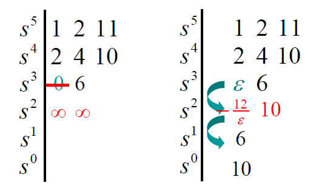

变号两次，因此有两个极点在复平面右半平面。

e.g. 更极端的情况，算出来一行都是 0.

$$
\begin{aligned}
    & q(s) = s^{5} + 2 s^{4} + 24 s^{3} + 48 s^{2} -25 s - 50
\end{aligned}
$$

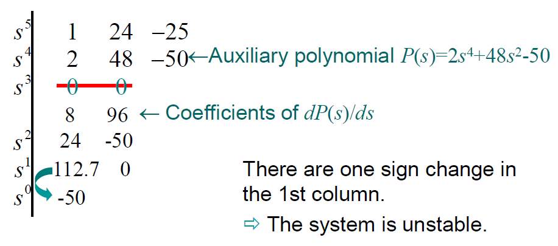

变号一次，因此有一个极点在复平面右半平面。

如果算出来一行都是 0，那么将上一行作为多项式（注意幂次），求导得到的系数取代下一行。

如果阵列中存在一行都是 0 的情况，那么必然存在关于原点中心对称的极点对。

如果为实系数多项式，那么复数极点只能以共轭复数极点对的情况出现。

Auxiliary polynomial 的根可以告诉关于可能不稳定的情况的信息。

[更多参考：Routh-Kurwitz准则——判别实系数多项式有无实部非负的根的充要条件 - 间宫羽咲sama的文章 - 知乎](https://zhuanlan.zhihu.com/p/105605367)

[(matlab algorithm)venkateshshukla/routh-hurwitz: Find out stability of Transfer Function by Routh Kurwitz Criterion given it characteristic equation. (github.com)](https://github.com/venkateshshukla/routh-hurwitz)

How to define the relative stability?

对于一个稳定系统，看最靠近虚轴的极点到虚轴的距离。

通过换元：$s \rightarrow s - a$ 带入特征多项式，应用 Routh-Kurwitz 判据得到 $a$ 的范围。

### 3.4_Steady_State_Error

- stable 稳定
- steady 稳态

对于 $H(s) = 1$ 的反馈系统：

$$
\begin{aligned}
    Y(s) &= R(s) \cdot \frac{G(s)}{1 + G(s)} \\
    E(s) :&= R(s) - Y(s) = R(s) \frac{1}{1+G(s)} \\
    e_{ss} :&= \lim_{t \rightarrow \infty} e(t) = \lim_{s \rightarrow 0} sE(s) = \lim_{s \rightarrow 0} \frac{s R(s)}{1 + G(s)}
\end{aligned}
$$

一些容易跟踪的信号举例：

$$
\begin{aligned}
    r(t) &= A u(t) && R(s) = \frac{A}{s} \\
    r(t) &= At u(t) && R(s) = \frac{A}{s^{2}} \\
    r(t) &= \frac{A}{2} t^{2} u(t) && R(s) = \frac{A}{s^{3}} \\
\end{aligned}
$$

对于阶跃信号

$$
\begin{aligned}
    e_{ss} = \lim_{s \rightarrow 0} \frac{A}{1+G(0)}
\end{aligned}
$$

考虑如下形式的传递函数

$$
G(s) = \frac{K \prod_{i=1}^{M}(s + z_{i})}{s^{N} \prod_{i=1}^{Q}(s + p_{i})}
$$

$N$: Type number. 表征了开环中积分环节的数量。

if $N = 0$, define the **position error constant**:

$$
\begin{aligned}
    K_{p} :&= \lim_{s \rightarrow 0} \left. G(s) \right|_{N=0} = K \frac{\prod_{i=1}^{M}z_{i}}{\prod_{i=1}^{Q}p_{i}} \\
    e_{ss} &= \frac{A}{1+K_{p}}
\end{aligned}
$$

if $N=1, 2$

$$
\begin{aligned}
    K_{p} :&= \infty \\
    e_{ss} &= 0
\end{aligned}
$$

对于 Ramp 信号，定义 **velocity error constant**:

$$
\begin{aligned}
    K_{v} :&= \lim_{s \rightarrow 0} sG(s) = \left\{ \begin{aligned}
        & 0 && N=0 \\
        & K \frac{\prod_{i=1}^{M}z_{i}}{\prod_{i=1}^{Q}p_{i}} && N = 1 \\
        & \infty && N = 2
\end{aligned} \right. \\
    e_{ss} &= \lim_{s \rightarrow 0} s \cdot \frac{\frac{A}{s^{2}}}{1 + G(s)} = \left\{ \begin{aligned}
        & \infty && N = 0 \\
        & \frac{A}{K_{v}} && N=1 \\
        & 0 && N = 2
\end{aligned} \right.
\end{aligned}
$$

对于 Acceleration 信号，定义 **acceleration error constant**:

$$
\begin{aligned}
    K_{a}:&= \lim_{s \rightarrow 0} s^{2}G(s)\left\{ \begin{aligned}
        & 0 && N=0 \\
        & K \frac{\prod_{i=1}^{M}z_{i}}{\prod_{i=1}^{Q}p_{i}} && N = 1 \\
        & \infty && N = 2
\end{aligned} \right. \\
\end{aligned}
$$

结论相似，当 $N=0,1$ 时，稳态误差无穷；当 $N=2$ 时，有固定的稳态误差。

| N(Type number) |      Step Input      |     Ramp Input     | Acceleration Input |
|:--------------:|:--------------------:|:------------------:|:------------------:|
|       0        | $\dfrac{A}{1+K_{p}}$ |      $\infty$      |      $\infty$      |
|       1        |          0           | $\dfrac{A}{K_{v}}$ |      $\infty$      |
|       2        |          0           |         0          | $\dfrac{A}{K_{a}}$ |

看起来开环积分环节越多，对于加速大的信号的稳定效果越好；但是并非如此，会影响系统的稳定性（原点处的极点）。

*Expansion*:

1. Non-unity feedback
2. Disturbance
3. Unstable system
    1. 不稳定系统能否跟踪？否
    2. 不能跟踪的是否一定是不稳定的？否
        - 稳定系统一定能跟踪阶跃信号

前两个问题，用老办法算就行了，有干扰的时候干扰也算作预期。

### 3.5_Transient_Response

1-order sys

$$
\begin{aligned}
    G(s) &= \frac{1}{Ts} \\
    Y(s) &= \frac{1}{1+G(s)} R(s) \\
\end{aligned}
$$

对于阶跃信号

$$
\begin{aligned}
    r(t) &= u(t) \Rightarrow Y(s) = \frac{1}{s} - \frac{1}{s+\frac{1}{T}} \\
    y(t) &= \left(1 - e^{- \dfrac{t}{T}}\right)u(t)
\end{aligned}
$$

对于斜坡信号

$$
\begin{aligned}
    r(t) &= tu(t) \Rightarrow Y(s) = \frac{1}{s^{2}} - \frac{T}{s} + \frac{T^{2}}{Ts+1} \\
    y(t) &= (t - T + T e^{- \frac{t}{T}})u(t) \\
    e_{ss} &= T
\end{aligned}
$$

对于脉冲信号

$$
\begin{aligned}
    r(t) &= \delta(t) \Rightarrow Y(s) = \frac{1}{1+Ts} \\
    y(t) &= \frac{1}{T}e^{- \frac{t}{T}} u(t)
\end{aligned}
$$

Criterion of transient response: time constant $T$

2-order sys

$$
\begin{aligned}
    G(s) & = \frac{K}{s(s+p)} \\
    Y(s) & = \frac{G(s)}{1 + G(s)} R(s) \\
        &= \frac{K}{s^{2}+ps+K} R(s) \\
    \frac{Y(s)}{R(s)} &= \frac{\omega_{n}^{2}}{s^{2} + 2\zeta \omega_{n} s + \omega_{n}^{2}} \\
    p_{1,2} &= \left\{ \begin{aligned}
        & - \zeta \omega_{n} \pm \sqrt{\zeta^{2} - 1} \omega_{n} && (\zeta > 1) \text{ overdamp} \\
        & - \zeta \omega_{n} \pm j \sqrt{1 - \zeta^{2}} \omega_{n} && (\zeta < 1) \text{ underdamp}
    \end{aligned} \right.
\end{aligned}
$$

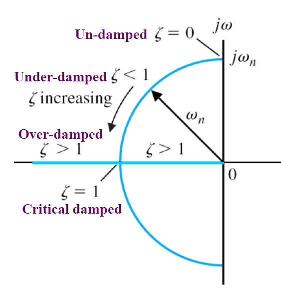

用一组几何参数表征极点的位置：

$$
\begin{aligned}
    & \theta = \cos^{-1} \zeta \\
    & \omega_{n} && \text{Natural Frequence} \\
    & \omega_{d} = \omega_{n} \sin \theta = \omega_{n} \sqrt{1 - \zeta^{2}} && \text{Damped Frequency} \\
    & \zeta && \text{Damping ratio}
\end{aligned}
$$

Step Input

$$
\begin{aligned}
    R(s) &= \frac{1}{s} \\
    Y(s) &= \frac{\omega_{n}^{2}}{s(s^{2} + 2 \zeta \omega_{n} s + \omega_{n}^{2})} \\
        &= \frac{1}{s} - \frac{s + \zeta \omega_{n}}{(s + \zeta \omega_{n})^{2} + \omega_{d}^{2}} - \frac{\zeta \omega_{n}}{\omega_{d}} \frac{\omega_{d}}{(s + \zeta \omega_{n})^{2}+ \omega_{d}^{2}} \\
    y(t) &= u(t) \left[ 1 - e^{-\zeta \omega_{n} t}\cos \omega_{d} t - e^{- \zeta \omega_{n} t} \frac{\zeta}{\sqrt{1 - \zeta^{2}}} \sin \omega_{d} t \right] \\
        &= u(t) \left[ 1 - \frac{e^{- \zeta \omega_{n} t}}{\sqrt{ 1 - \zeta^{2}}}\sin (\omega_{d} t + \theta) \right] && \theta = \cos^{-1} \zeta
\end{aligned}
$$

- Undamped $\zeta = 0$

$$
y(t) = u(t)[1 - \cos \omega_{d} t]
$$

- Critical damped $\zeta = 1$

$$
\begin{aligned}
    Y(s) & = \frac{1}{s} - \frac{1}{s+\zeta \omega_{n}} - \frac{1}{(s + \zeta \omega_{n})^{2}} \\
    \Rightarrow y(t) &= u(t) \left[ 1 - e^{-\omega_{n} t} (1 + \omega_{n} t) \right]
\end{aligned}
$$

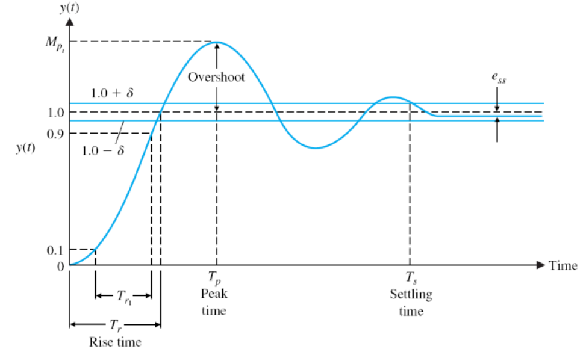

- Swiftness
    - Rise time $T_{r}$
        - overdamped 10% -> 90\% （实际没啥用）
        - underdamped 0\% -> 100\%
    - Peak time $T_{p}$: The time required for the response to reach the first peak of the overshoot.
- Closeness
    - Settling time $T_{s}$
    - Overshoot $\sigma := \dfrac{y(T_{p}) - y(\infty)}{y(\infty)} \times 100 \%$

求 $T_{r}$

$$
\begin{aligned}
    y(T_{r})&=1 \\
    1 &= 1 - \frac{e^{-\zeta \omega_{n} t}}{\sqrt{1 - \zeta^{2}}} \sin(\omega_{d} T_{r} + \theta) \\
    T_{r} &= \frac{\pi - \theta}{\omega_{d}} = \frac{\pi - \cos^{-1} \zeta}{\omega_{n} \sqrt{1 - \zeta^{2}}}
\end{aligned}
$$

求 $T_{p}$

$$
\begin{aligned}
    0 &= \left. \frac{\mathrm{d} y(t)}{\mathrm{d} t} \right|_{T_{p}} \\
    0 &= \zeta \omega_{n} e^{- \zeta \omega_{n} T_{p}} \sin (\omega_{d}T_{p} + \theta) - \omega_{d} e^{- \omega_{n} t} \cos (\omega_{d} T_{p} + \theta) \\
    0 &= \sin \omega_{d} T_{p} \\
    T_{p} &= \frac{\pi}{\omega_{d}} = \frac{\pi}{\omega_{n}\sqrt{1-\zeta^{2}}}
\end{aligned}
$$

求 $\sigma$

$$
\begin{aligned}
    y(\infty) &= 1 \\
    y(T_{p}) &= 1- \frac{e^{-\zeta\omega_{n}t}}{\sqrt{1 - \zeta^{2}}} \sin (\omega_{d} T_{p} + \theta) \\
        &= 1 + e^{-\zeta\omega_{n}t} \frac{\sin \theta}{\sqrt{1 - \zeta^{2}}} \\
        &= 1 + e^{-\zeta \omega_{n} T_{p}} \\
    \sigma &= \frac{y(T_{p})-y(\infty)}{y(\infty)} = e^{-\zeta\omega_{n}T_{p}} \\
    \sigma &= e^{- \frac{\pi \zeta}{\sqrt{1 - \zeta^{2}}}}
\end{aligned}
$$

求 $T_{s}$

$$
\begin{aligned}
    y(t) &= 1 - \frac{e^{-\zeta \omega_{n} t}}{\sqrt{1 - \zeta^{2}}} \sin (\omega_{d} t + \theta) \\
    E_{y}(t) &= 1 \pm \frac{1}{\sqrt{1 - \zeta^{2}}} e^{-\zeta \omega_{n} t} && \text{envelope curve} \\
    T_{s} &\approx \left\{ \begin{aligned}
        &\frac{4}{\zeta \omega_{n}} && (2\%) \\
        &\frac{3}{\zeta \omega_{n}} && (5\%) \\
    \end{aligned} \right.
\end{aligned}
$$

```matlab
zeta = 0:0.01:1;
Tr = (pi - acos(zeta))./sqrt(1 - zeta.*zeta);
Tp = pi./sqrt(1 - zeta.*zeta);
sigma = exp(-pi.*zeta./sqrt(1 - zeta.*zeta));
Ts = 3./zeta;
plot(zeta, Tr, 'r')
hold on;
plot(zeta, Tp, 'g')
hold on;
plot(zeta, sigma, 'b')
hold on;
plot(zeta, Ts, 'k')
legend('Tr','Tp','sigma','Ts');
ylim([0 10])
```

如果已知系统是 2 阶 LTI 系统，可以根据阶跃响应 peak 点的坐标计算系统的参数。

- $\sigma \Rightarrow \zeta$
- $T_{p} \Rightarrow \omega_{d} \Rightarrow \omega_{n}$

How to reduce a **high order** sys?

- rule 1: 消去相邻很近的零点极点对。
- rule 2: 消去到虚轴距离远远大于其他极点的极点 $|\Re p_{1}| > 10 |\Re p_{2}|$

如果零极点对在右半平面，能否消去？

dominant poles

**Effects of Integral and Derivative Ctrl**

- Series
- Feedback Compensation

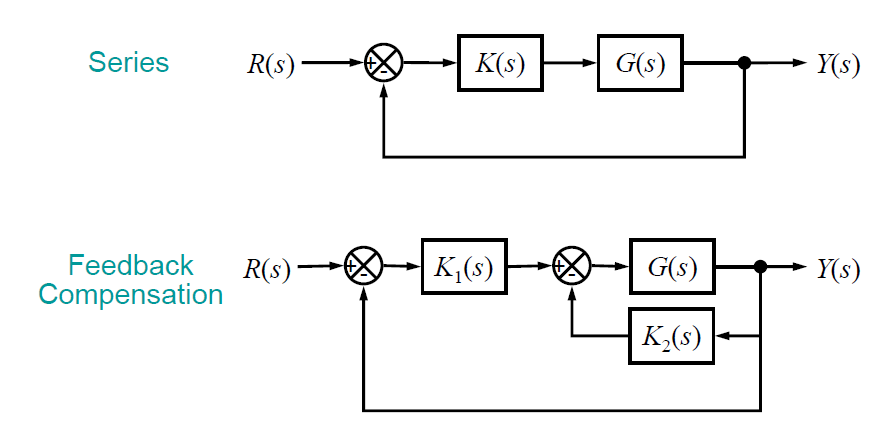

对于级联系统（上图），如果反馈函数为 1，$K(s) = 1$，则控制器后 $u(t)$ 等于误差 $e(t)$.

如果 $K(s) = \frac{1}{s}$，$u(t) = \int_{0}^{t} e(\tau) \mathrm{d} \tau$

Integral Ctrl:

- type number $\uparrow$，tracking ability $\uparrow$
- stability $\downarrow$
- response more vibrant and slower（船大难掉头）

如果 $K(s) = s$，$u(t) = \frac{\mathrm{d} e(t)}{\mathrm{d} t}$

Derivative Ctal:

- no direct effect on steady error
- 输出正比于变化率，超前预测
- adds damping
- 和其他控制方式配合使用

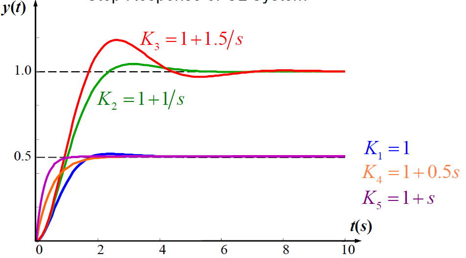

其他量化指标

- ISE 累积效应，对大误差敏感
- IAE 累计效应，对大误差敏感度不如 ISE
- ITSE 累积效应，对后期误差敏感
- ITAE 累积效应，对大误差敏感度不如 ITSE

$$
\begin{aligned}
ISE &= \int_{0}^{T} e^{2} (t) \mathrm{d} t \\
IAE &= \int_{0}^{T} |e (t)| \mathrm{d} t \\
ITSE &= \int_{0}^{T} t e^{2} (t) \mathrm{d} t \\
IAE &= \int_{0}^{T} t|e (t)| \mathrm{d} t
\end{aligned}
$$

因地制宜地选取量化指标来衡量系统。

### 3.6_Time_Domain_Analysis_with_MATLAB

```matlab
[y, T] = lsim(sys, u, t)
```

- ``y, T`` 输出
- ``sys`` 系统
- ``u`` 输入

计算系统的时域响应。

## 4.Root_Locus_Method

### 4.1_Intro

- $t$ domain Method
    - difficult to predict the performance **as parameters change**.
- Routh-Kirwitz Criterion
    - no clues for relative stability
    - no clues for poles
    - difficult to predict the performance **as parameters change**.
- $f$ domain Method

- simple to implement
- easy to predict sys performance
- possible to indicate better parameters

### 4.2_Root_Locus_Concept

- Roots: of characteristic equation
- Locus: roots on $s$ plane when ***A SYSTEM PARAMETER*** changes

考虑一个简单的闭环系统（反馈为 1）开环增益为

$$
G(s) = \frac{K}{s(s+c)}
$$

令 $c = 1$

$$
\begin{aligned}
G(s) &= \frac{K}{s(s+1)} \\
G_{CL}(s) &= \frac{G(s)}{1 + G(s)} = \frac{K}{s^{2}+s+K}\\
s^{2}+s+K = 0 &\Rightarrow 1 + \frac{K}{s^{2}+s} = 0
\end{aligned}
$$

计算极点

$$
\begin{aligned}
s_{1,2} &= - \frac{1}{2} \pm \frac{1}{2} \sqrt{1 - 4K} \\
K < 0 &\Rightarrow  s_{1,2} = - \frac{1}{2} \pm \frac{1}{2} \sqrt{1 + 4 |K|} \\
K = 0 &\Rightarrow s_{1,2} = 0, -1 \\
K < \frac{1}{4} &\Rightarrow s_{1,2} = -\frac{1}{2} \pm \frac{1}{2} \sqrt{ 1 - 4K} \\
K = \frac{1}{4} &\Rightarrow s_{1,2} = - \frac{1}{2} , - \frac{1}{2} \\
K > 0 &\Rightarrow s_{1,2} = - \frac{1}{2} \pm j \frac{1}{2} \sqrt{4K - 1}
\end{aligned}
$$

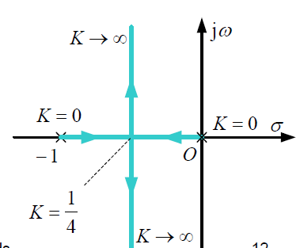

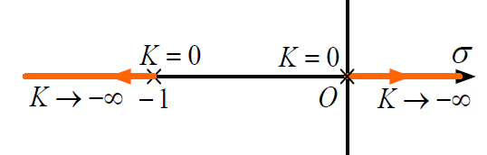

令 $K = 1$

$$
\begin{aligned}
G(s) &= \frac{1}{s(s+c)} \\
G_{CL}(s) &= \frac{G(s)}{1 + G(s)} = \frac{1}{s^{2}+cs+1} \\
s_{1,2} &= - \frac{c}{2} \pm \frac{1}{2} \sqrt{c^{2} - 4}
\end{aligned}
$$

$$
\begin{aligned}
c = 0 &\Rightarrow \pm j \\
0 < c < 2 &\Rightarrow - \frac{c}{2} \pm j \frac{1}{2} \sqrt{4 - c^{2}} \\
c = 2 &\Rightarrow -2 \\
c > 2 &\Rightarrow - \frac{c}{2} \pm \frac{1}{2} \sqrt{c^{2} - 4} \\
c \rightarrow \infty &\Rightarrow 0, \infty
\end{aligned}
$$

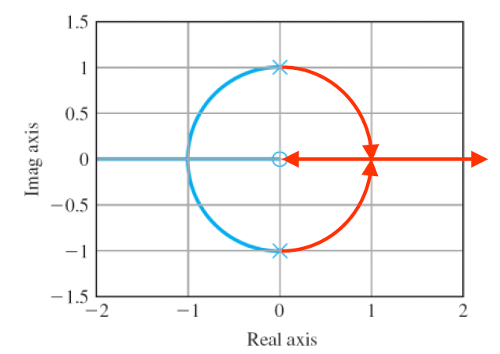

对于一个常见的闭环负反馈系统，特征方程为：

$$
\begin{aligned}
& 1 + GH(s) = 0 \\
& KL(s) := GH(s) && L(s) := \frac{B(s)}{A(s)} \\
& \left\{ \begin{aligned}
    & 1 + KL(s) = 0 \\
    & 1 + K \frac{B(s)}{A(s)} = 0 \\
    & A + KB = 0 \\
    & L = - \frac{1}{K}
\end{aligned} \right.
\end{aligned}
$$

Roots Locus Cond:

$$
1 + KL(s) = 0
$$

- Phase Cond 决定根轨迹形状

$$
\begin{aligned}
\mathrm{Arg} (KL(s)) &= - \pi + 2\pi k && (k \in \mathbb{Z}) \\
-\pi + 2\pi k &= \sum_{i=1}^{m} \mathrm{Arg}(s - z_{i}) - \sum_{i=1 }^{n} \mathrm{Arg}(s - p_{i}) && (k \in \mathbb{Z})
\end{aligned}
$$

- Magnitude Cond 决定变化参数 $K$ 的值

$$
\begin{aligned}
1 &= \left| KL(s) \right|\\
1 &= K \frac{|s - z_{1}| \cdots |s - z_{m}|}{|s - p_{1}|  \cdots |s - p_{n}|}
\end{aligned}
$$

默认 $K > 0$ 为根轨迹，$K < 0$ 为补（Complementary）根轨迹。

### 4.3_Guidelines_for_Sketching_Root_Loci

假设：

- 角度方向定义和极坐标相同
- 负反馈系统
- 主要讨论 $s$ 平面上半平面的根轨迹（因为极点共轭，根轨迹关于实数轴对称）
- 反馈通道为 1

6 Rules:

- General rule 1
- General rule 2
- General rule 3
- Complementary rule 4
- Complementary rule 5
- Complementary rule 6

**Rule 1**:

- n branches of the locus start at the **poles** of $L(s)$
- m branches of the locus end at the **zeros** of $L(s)$

> proof

- Starts points ($K$ = 0)

$$
\begin{aligned}
& \lim_{K \rightarrow 0} \left| 1 + K L(s) \right| = 0 \\
&\Rightarrow \lim_{K \rightarrow 0} \left| L(s) \right| = \lim_{K \rightarrow 0} \left| \frac{1}{K} \right| = \infty \\
&\Rightarrow  \lim_{K \rightarrow 0} \left| \frac{B(s)}{A(s)} \right| = \infty \\
&\Rightarrow (s - p_{1}) \cdots (s - p_{n}) = 0
\end{aligned}
$$

- End points ($K = \infty$)

$$
\begin{aligned}
& \lim_{K \rightarrow \infty} \left| 1 + KL(s) \right| = 0 \\
&\Rightarrow \lim_{K \rightarrow \infty} |L(s)| = \lim_{K \rightarrow \infty}\left| \frac{1}{K} \right| = 0 \\
&\Rightarrow \left\{ \begin{aligned}
& s = z_{i} && (i \leq m, i \in \mathbb{Z})\\
& s \rightarrow \infty && (m < n)
\end{aligned} \right.
\end{aligned}
$$

**Rule 2**

奇数个零极点的左侧存在实轴上的根轨迹。

> proof 关于相角的讨论。

**Rule 3**

rule 1 指出的剩下的 $(n - m)$ 个分支的去向：渐近线

- $\sigma_{A}$ 渐近线和实轴的交点
- $\varphi_{A}$ 渐近线和实轴的夹角

$$
\begin{aligned}
\sigma_{A}&= \frac{\sum_{i=1}^{n} p_{i} - \sum_{i=1}^{m} z_{i}}{n - m} \\
\varphi_{A} &= \pi\frac{2q + 1}{n-m} && (q = 0, 1, \cdots , n - m  - 1)
\end{aligned}
$$

关于 $\varphi_{A}$ 的说明：

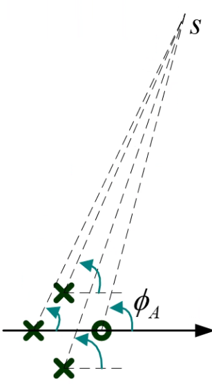

**Rule 4**

根轨迹如何穿越虚轴？（稳定性的阴阳界）穿越点的 $K$ 值非常重要。

- Methods
    - Routh-Kirwitz Criterion
    - Shut up & Calculate

$$
\begin{aligned}
s &:= j \omega \\
& \left\{ \begin{aligned}
\Re [1 + KL(j \omega)] & = 0 \\
\Im [1 + KL(j \omega)] & = 0
\end{aligned} \right.
\end{aligned}
$$

**Rule 5**

根轨迹相交（有重根）满足条件：

$$
\begin{aligned}
& B(s) \frac{\mathrm{d} A(s)}{\mathrm{d} s} +  A(s) \frac{\mathrm{d} B(s)}{\mathrm{d} s} = 0 \\
& \pi \cdot \frac{2q+1}{r} && (q = 0, 1, \cdots, r - 1)
\end{aligned}
$$

第二行表示在重根以后轨迹分离（或汇聚）的角度。

$$
\begin{aligned}
f(s) &= A(s) + K B(s) = 0
\end{aligned}
$$

如果有多重极点

$$
\begin{aligned}
\frac{\mathrm{d} f}{\mathrm{d} s} &= A'(s) + K B'(s) = 0 \\
&\Rightarrow K = - \frac{A'(s)}{B'(s)}
\end{aligned}
$$

综合两式：

$$
\begin{aligned}
& A(s) - \frac{A'(s)}{B'(s)} B(s) = 0 \\
& A(s) B'(s)= A'(s) B(s) \\
&\Rightarrow  \frac{\mathrm{d} K}{\mathrm{d} s} = \frac{AB' - A'B}{B^{2}} = 0
\end{aligned}
$$

当然这不等价，当 $B(s) \rightarrow \infty$ 也会出现 $\dfrac{\mathrm{d} K}{\mathrm{d} s} = 0$ 的情况；当 $\dfrac{\mathrm{d} K}{\mathrm{d} s} = 0$ 的时候可能 $K < 0$.

- 汇合分离点（重根）不一定只有一个。
- 也不一定在实轴上。

When $B(s) = 1$, the necessary condition is $A'(s) = 0$.

**Rule 6**

根轨迹的发射角和入射角

假设极点、零点的重数为 $r$

$$
\begin{aligned}
r \varphi_{pr} &= (2k+1)\pi - \sum_{\substack{j=1\\j \neq r}}^{n}\mathrm{arg}(p_{r} - p_{j}) + \sum_{\substack{k=1}}^{m}\mathrm{arg}{p_{r} - z_{k}} \\
r \varphi_{zr} &= (2k+1)\pi - \sum_{j=1}^{n}\mathrm{arg}(z_{r} - p_{j}) + \sum_{\substack{k=1\\k \neq r}}^{m}\mathrm{arg}{z_{r} - z_{k}}
\end{aligned}
$$

证明方法就是利用相角条件和极限法：极点非常接近于开环极点、零点。

Summary:

- Rule 1: Starting/terminating points
- Rule 2: Loci on real axis
- Rule 3: Locus asymptotes
- Rule 4: Imaginary axis crossing points
- Rule 5: Breakaway/breakin points
- Rule 6: Angle of departure and arrival

Conservation of sum of system poles OL/CL if $n \geq m + 2$

$$
\begin{aligned}
f(s) &:= A(s) + KB(s) \\
&= s^{n} - \sum_{i=1}^{n}p_{i} s^{n-1} - \cdots \\
&= + K \left( s^{m} - \sum_{k=1}^{m}z_{k} s^{m-1} - \cdots \right) \\
&= s^{n} - \sum_{i=1}^{n} p_{i} s^{n-1} - \cdots
\end{aligned}
$$

对于闭环极点 $\lambda_{i}$

$$
\begin{aligned}
f(s) &:= \prod_{i=1 }^{n}(s - \lambda_{i}) \\
&= s^{n} - \sum_{i=1 }^{n} \lambda_{i} s^{n-1} - \cdots \\
&\Rightarrow \sum_{i=1}^{n}p_{i} = \sum_{i=1 }^{n} \lambda_{i}
\end{aligned}
$$

两种问题：

- 已知开环系统零极点，求根轨迹
- 已知系统要求参数（例如阻尼比），求 $K$
    - Analytic Method
    - Graphic Method 根据阻尼比画出满足条件的直线 ($\cos \alpha = - \zeta$)，找直线和根轨迹的交点。

### 4.4_Root_Locus_Analysis_of_Ctrl_Sys

Effect of adding zeros and poles

对于一个系统

$$
KL(s) = \frac{K}{(s+p_{1})(s+p_{2})}
$$

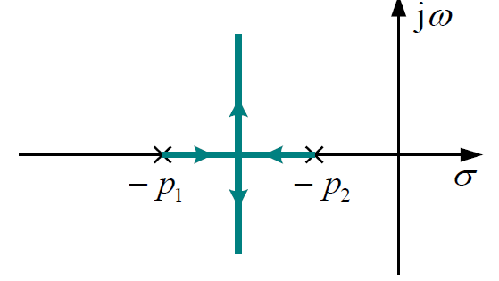

增加零点

$$
KL(s) = K\frac{s + z}{(s+p_{1})(s+p_{2})}
$$

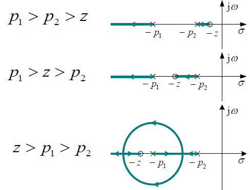

增加零点，使得系统的根轨迹“向左偏”。增加了微分器。

对于系统

$$
\begin{aligned}
KL(s) & = \frac{K(s+z)}{(s+p_{1})(s+p_{2})} && z > p_{1} > p_{2}
\end{aligned}
$$

增加极点 $p_{3}$

$$
KL(s) = \frac{K(s+z)}{(s+p_{1})(s+p_{2})(s+p_{3})}
$$

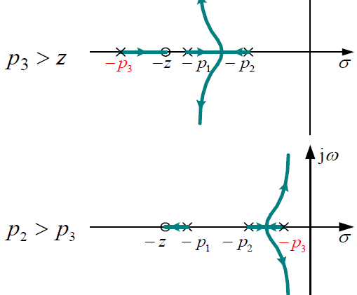

增加极点，使得系统的根轨迹“向右偏”。增加了积分器。

Effect of Pole and Zeros Movements

$$
\begin{aligned}
KL(s) &= \frac{K(s+1)}{s^{2}(s+a)} && a > 0
\end{aligned}
$$

Breakin/away points in $[-a, -1], [-1, -a]$

$$
\begin{aligned}
K &= - \frac{A(s)}{B(s)} = - \frac{s^{2}(s+a)}{s+1} \\
\frac{\mathrm{d} K}{\mathrm{d}s} &= 0 \\
s &= \frac{-(a+3)\pm \sqrt{a^{2}-10a+9}}{4}
\end{aligned}
$$

$a = 10$

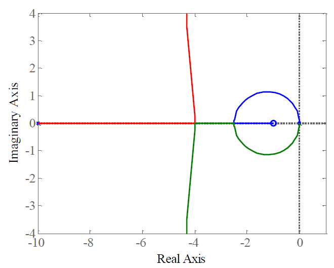

$a=9$

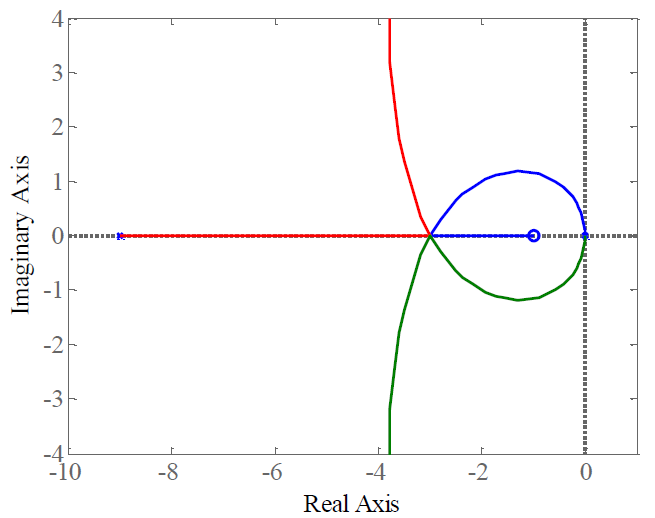

$a=8$

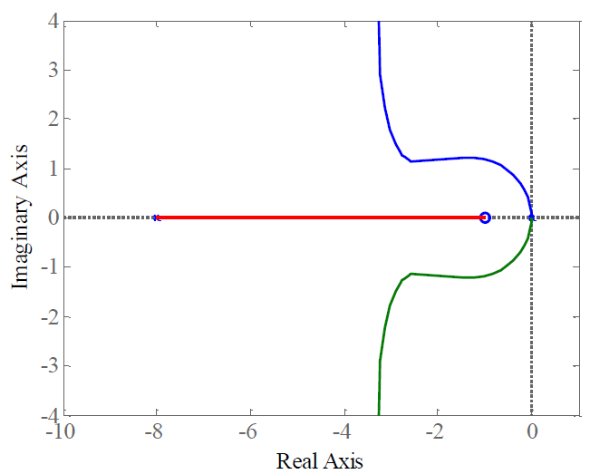

$a=3$

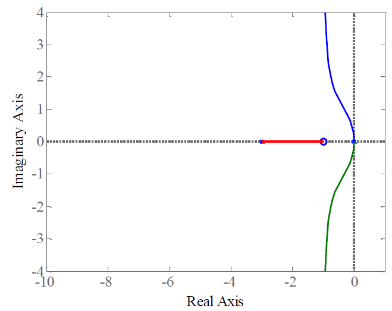

$a=1$

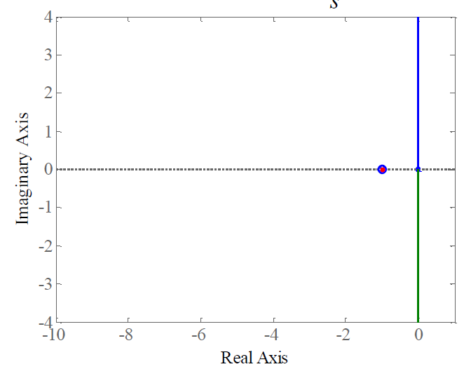

$a=0.5$

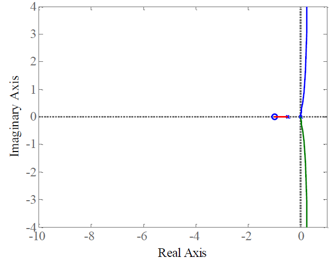

如何理解零点对极点触发的根轨迹的“吸引力”？

$$
KL(s) = \frac{K(s^{2}+2s+4)}{s(s+4)(s+6)(s^{2}+1.4s+1)}
$$

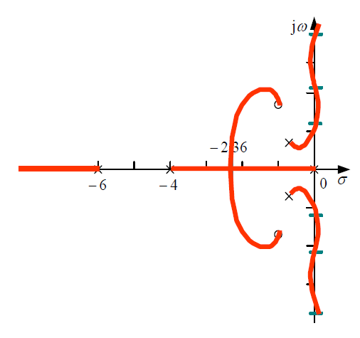

如何提高系统的稳定性？加零点（微分器）

### 4.5_Extensions_of_Root_Locus_Method

- complementary root locus
- time delay
- multi parameters vary at same time

**Complementary root locus**

- case 1: non-minimus phase systems

什么时最小相位系统？

稳定系统的零点全部在虚轴左侧（零极点都在左侧平面）。

如果零点有在右侧的，虽然系统仍然稳定，但称作非最小相位系统。“顽皮的孩子”：先反向，后回归。

$$
\begin{aligned}
KL(s)&= \frac{K(1-T_{1}s)}{s(1+Ts)} && K, T_{1}, T > 0 \\
(-K) \widetilde{L}(s) &= \frac{(-K)(T_{1}s - 1)}{s(1+Ts)} \\
\mathrm{arg} \widetilde{L}(s) &= 2\pi k
\end{aligned}
$$

辐角规则变化了，幅值规则没变化。

- case 2: positive feedback

$$
\begin{aligned}
1 - KL(s) &= 0 && K > 0 \\
1 + (-K)L(s) &= 0 && -K < 0 \\
\mathrm{arg} \widetilde{L}(s) &= 2\pi k
\end{aligned}
$$

辐角规则变化后，6 条规则中变化了的：

- Rule 2 $\rightarrow$ 在偶数个零极点左侧。
- Rule 3 $\rightarrow$ 渐近线角度关于虚轴对称。

$$
\varphi_{A} = \frac{2k\pi}{n-m}
$$

- Rule 6 $\rightarrow$ 出发角和到达角

$$
\begin{aligned}
\varphi_{pr} &= 2\pi k + \sum \cdots \\
\varphi_{zr} &= 2\pi k - \sum \cdots
\end{aligned}
$$

根轨迹和补根轨迹构成更完善的图片。

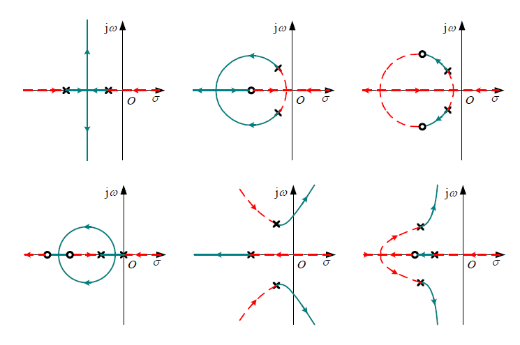

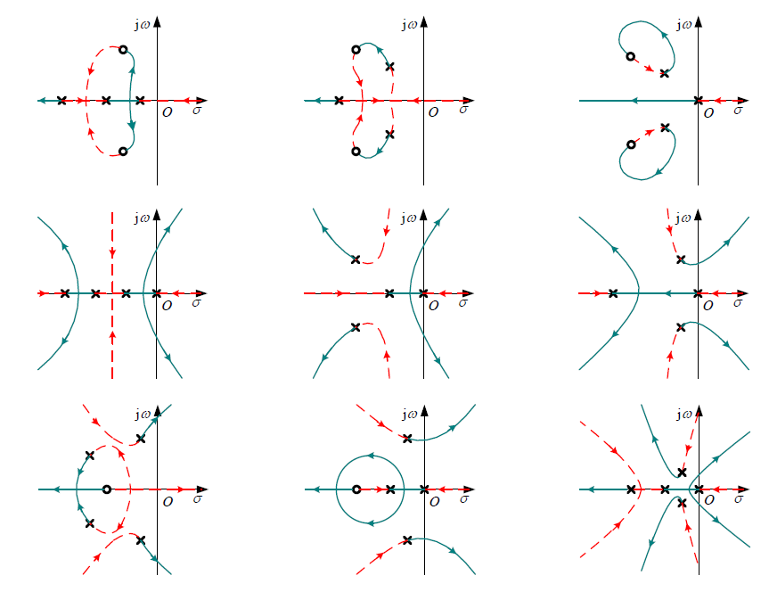

**Pure Time Delay**

$$
\begin{aligned}
& 1 + KL(s) e^{-Ts} && K > 0, \text{Rational }L(s)
\end{aligned}
$$

Pade Approximation:

$$
\begin{aligned}
e^{-Ts} & \approx \frac{1}{1+Ts} \\
e^{-Ts} & \approx \frac{1 - \frac{1}{2} Ts}{1 + \frac{1}{2}Ts} \\
e^{-Ts} & \approx \frac{1 - \frac{1}{2} Ts + \frac{1}{12} T^{2}s^{2}}{1 + \frac{1}{2} Ts + \frac{1}{12} T^{2}s^{2}}
\end{aligned}
$$

???

**Root Contour**

等高线：多种参数。

例如：对于不同 $c$，绘制出 $K$ 变化产生的根轨迹，呈现在同一个 $s$ 平面中。

### 4.6_Root_Locus_with_MATLAB

```matlab
rlocus()
rltool()
pade()
```

## 5.Frequency_Response_Method

### 5.1_Concept_of_Frequency-Response_Characteristics

对于 RC 电路

$$
\begin{aligned}
G(s) &= \frac{1}{1+RC s}\\
G(j \omega) &= \frac{1}{1+ j RC \omega}
\end{aligned}
$$

研究一个线性时不变系统，对于一个正弦信号输入，输出的稳态正弦信号的幅值和相位。

- 频率特性曲线
- Nyquist graph
- Bode graph
- Nochols graph

频率响应：LTI 系统，如果输入为正弦信号，稳态输出为同频率的正弦信号，但是幅值和相位发生了变化。

对于 RC 电路，给定正弦信号输入 $u_{r} = A \sin \omega t$

$$
\begin{aligned}
U_{c}(s) &= G(s) \cdot \frac{A \omega}{s^{2} + \omega^{2}} \\
&= \frac{\frac{A \omega}{T}}{(s+ \frac{1}{T})(s^{2} + \omega^{2})} \\
&= \frac{A \omega T}{1 + \omega^{2} T^{2}} \frac{1}{s + \frac{1}{T}} \\
&+ \frac{A}{\sqrt{1+\omega^{2}T^{2}}} \left( \frac{1}{\sqrt{1+\omega^{2}T^{2}}}\cdot \frac{\omega}{s^{2} + \omega^{2}} - \frac{\omega T}{\sqrt{1 + \omega^{2}T^{2}}}\cdot \frac{s}{s^{2}+\omega^{2}} \right) \\
u_{c}(t) &= \frac{A \omega T}{1 + \omega^{2} T^{2}} e^{- \frac{t}{T}} + \frac{A}{\sqrt{1+\omega^{2}T^{2}}} \sin (\omega t - \tan^{-1} \omega T)
\end{aligned}
$$

频率特性：上述情境下，输出输入的幅值比、相角差。

$$
\begin{aligned}
|G(j \omega)| &= \frac{A}{\sqrt{1+\omega^{2}T^{2}}} \\
\angle G(j \omega) &= - \tan^{-1} \omega T
\end{aligned}
$$

频率特性和系统传递函数的关系：

$$
G(j \omega) = \left. G(s) \right|_{s = j \omega}
$$

理解这个问题，可以想到：$G(s)$ 是冲激信号的响应。

### 5.2_Amplitude_and_phase_Frequency_Characteristics(Nyquist)

一些典型系统的频率特性，变化 $\omega$，研究 $G$ 在复平面上的变化。

- Gain: $G(j \omega) = G(s) = K, |G| = K, \angle G = 0$
- Derivative factor: $G(j \omega) = G(s) = j \omega, |G| = \omega, \angle G = \frac{\pi}{2}$ 
- Integral factor: $G(j \omega) = G(s) = \frac{1}{j \omega}, |G| = \frac{1}{\omega}, \angle G = - \frac{\pi}{2}$
- First-order factor: $G(j \omega) = G(s) = \frac{1}{1+ j \omega T}, |G| = \frac{1}{\sqrt{1+\omega^{2}T^{2}}}, \angle G = - \tan^{-1} \omega T$

一阶环节的 Nyquist 图是半圆。

- Unstable First-order factor:

$$
\begin{aligned}
G(s) &= \frac{1}{Ts-1} \\
G(j \omega) &= \frac{1}{-1 + j \omega T} \\
|G| &= \frac{1}{\sqrt{1+\omega^{2}T^{2}}}\\
\angle G&= -\pi + \tan^{-1} \omega T
\end{aligned}
$$

- Reciprocal First-order factor

$$
\begin{aligned}
G(s) &= \pm 1 + s T \\
G(j \omega) &= \pm 1 + j T \omega \\
|G| &= \sqrt{1 + \omega^{2} T^{2}} \\
\angle G &= \left\{ \begin{aligned}
& \tan^{-1} \omega T \\
& \pi - \tan^{-1} \omega T
\end{aligned} \right.
\end{aligned}
$$

- Quadratic factor

$$
\begin{aligned}
G(s) &= \frac{\omega_{n}^{2}}{s^{2} + 2 \xi \omega_{n} s + \omega_{n}^{2}} = \frac{1}{\left( \frac{s}{\omega_{n}} \right)^{2} + 2 \xi \left( \frac{s}{\omega_{n}} \right) + 1 } \\
|G| &= \frac{1}{\sqrt{\left( 1 - \frac{\omega^{2}}{\omega_{n}^{2}} \right)^{2} + 4 \xi^{2} \frac{\omega^{2}}{\omega_{n}^{2}} }} \\
\angle G &= - \tan^{-1} \frac{2 \xi \frac{\omega}{\omega_{n}}}{1 - \frac{\omega^{2}}{\omega_{n}^{2}}}
\end{aligned}
$$

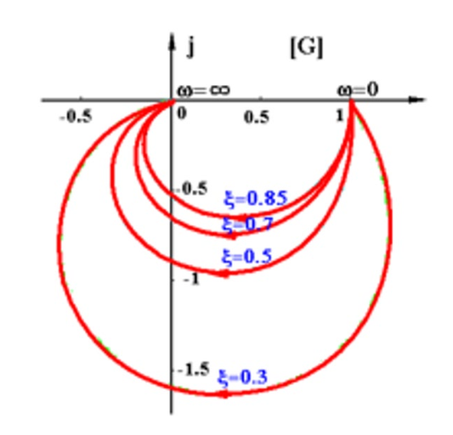

- $\omega = 0 \Rightarrow |G| = 1, \angle G = 0$
- $\omega = \omega_{n} \Rightarrow |G| = \frac{1}{2\xi}, \angle G = - \frac{\pi}{2}$
- $\omega = \infty \Rightarrow |G| = 0, \angle G = - \pi$

resonant $\omega_{r}$

$$
\begin{aligned}
0 &= \frac{\mathrm{d} |G|}{\mathrm{d} \omega} \\
\omega_{r} &= \omega_{n} \sqrt{1 - 2 \xi^{2}} \\
M_{r} &= |G(j \omega_{r})| = \frac{1}{2\xi \sqrt{1 - \xi^{2}}}
\end{aligned}
$$

- 当 $\xi \geq \frac{\sqrt{2}}{2}$，认为不存在 $\omega_{r}, M_{r}$.
- 当 $\xi = \frac{\sqrt{2}}{2}$，此时 Nyquist 图在 $\omega = 0$ 处的切线是平行于虚轴的。
- 当 $\xi = 0$，$\omega_{r}= \omega_{n}, M_{r} = \infty$.

对于不稳定的二阶震荡环节，Nyquist 图与稳定的共轭。

$$
G(j \omega) = \frac{\omega_{n}^{2}}{s^{2}-2\xi \omega_{n}s + \omega_{n}^{2}}
$$

- Reciprocal quadratic factor

$$
G(s) = T^{2}s^{2} \pm 2 \xi T s + 1
$$

- Delay time

$$
G(s) = e^{-\tau s}
$$

Cascade:

$$
\begin{aligned}
\left| G \right| &= \prod_{i=1}^{n} \left| G_{i} \right| \\
\varphi(\omega) &= \sum_{i=1}^{n} \varphi_{i}(\omega)
\end{aligned}
$$

绘制要点：

1. 起点（$\omega = 0$）终点（$\omega = \infty$）
2. 和实数轴的交点（算就行了）
3. 单调性等
4. 渐近线

$$
\begin{aligned}
\lim \Re G(j \omega) &= C \\
\lim \Im G(j \omega) &= C \\
\lim \frac{\Im G}{\Re G} &= C
\end{aligned}
$$

e.g.

$$
\begin{aligned}
G(s) &= \frac{5}{s(s+1)(2s+1)} \\
G(j \omega) &= \frac{5}{j \omega(j \omega + 1)(j 2 \omega + 1)} \\
&= \frac{5}{\omega(1+\omega^{2})(1 + 4 \omega^{2})} (-j)(1 - j \omega)(1 - j 2 \omega) \\
&= \frac{5}{\omega(1+\omega^{2})(1 + 4 \omega^{2})} (-j)(1 - 2 \omega^{2} - j3 \omega) \\
&= - \frac{15}{(1+\omega^{2})(1+4\omega^{2})} - j \frac{5(1-2\omega^{2})}{\omega(1+\omega^{2})(1+4\omega^{2})} \\
\Re G(j0) &= -15
\end{aligned}
$$

渐近线：$x = -15$

HW:

$$
\begin{aligned}
G_{k}(s) = \frac{k(1+2s)}{s^{2}(0.5s+1)(s+1)}
\end{aligned}
$$

### 5.3_Bode_Diagrams

反映了 $|G(j\omega)|$ 和 $\omega$ 在大尺度上的关系：$L(\omega) = 20 |\lg G(j \omega)| \sim \lg \omega$

对于普遍的系统传递函数：

$$
\begin{aligned}
G(j \omega) &= \frac{K_{b} \prod_{i=1}^{Q}(1 + j \omega \tau_{i})}{(j \omega)^{N} \prod_{m=1}^{M}(1 + j \omega \tau_{m}) \prod_{k=1}^{R}\left(1 + \frac{2\xi_{k}}{\omega_{nk}} \omega + \frac{(j\omega)^{2}}{\omega_{nk}^{2}}\right)} \\
L(\omega) &= 20 \lg |G(j \omega) | \\
&= 20 \lg |K_{b}| + \sum_{i=1}^{Q} 20 \lg |1 + j \omega \tau_{i} | - 20 N \lg \omega \\
&- \sum_{m=1}^{M} 20 \lg |1 + j \omega \tau_{m}| - \sum_{k=1}^{R} 20 \lg \left|1 + \frac{2\xi_{k}}{\omega_{nk}} \omega + \frac{(j\omega)^{2}}{\omega_{nk}^{2}} \right|
\end{aligned}
$$

相角有相似的叠加关系。

典型环节：

- Gain $L(\omega) = 20 \lg |K| = C, \varphi(\omega) = 0$
- Derivative Factor $L(\omega) = 20 \lg |\omega|, \varphi(\omega) = \frac{\pi}{2}$
- Integral Factor $L(\omega) = - 20 \lg |\omega| , \varphi(\omega) = - \frac{\pi}{2}$

后两者曲线的斜率为 $\pm 20$.

- First-Order Factor

$$
\begin{aligned}
L(\omega) &= - 20 \lg \sqrt{1 + \omega^{2} T^{2}} \\
&= \left\{ \begin{aligned}
&0 && \left(\omega \ll \frac{1}{T}\right) \\
&-20 \lg (\omega T) = -20 \lg \omega - 20 \lg T && \left(\omega \gg \frac{1}{T}\right)
\end{aligned} \right. \\
\varphi(\omega) &= - \arctan \omega T \\
&= \left\{ \begin{aligned}
& 0 && \left(\omega \ll \frac{1}{T}\right) \\
& - \frac{\pi}{2} && \left(\omega \gg \frac{1}{T}\right)
\end{aligned} \right.
\end{aligned}
$$

对于相位图，在 $\frac{1}{10\tau} < \omega < \frac{10}{\tau}$ 区间内部进行线性近似：

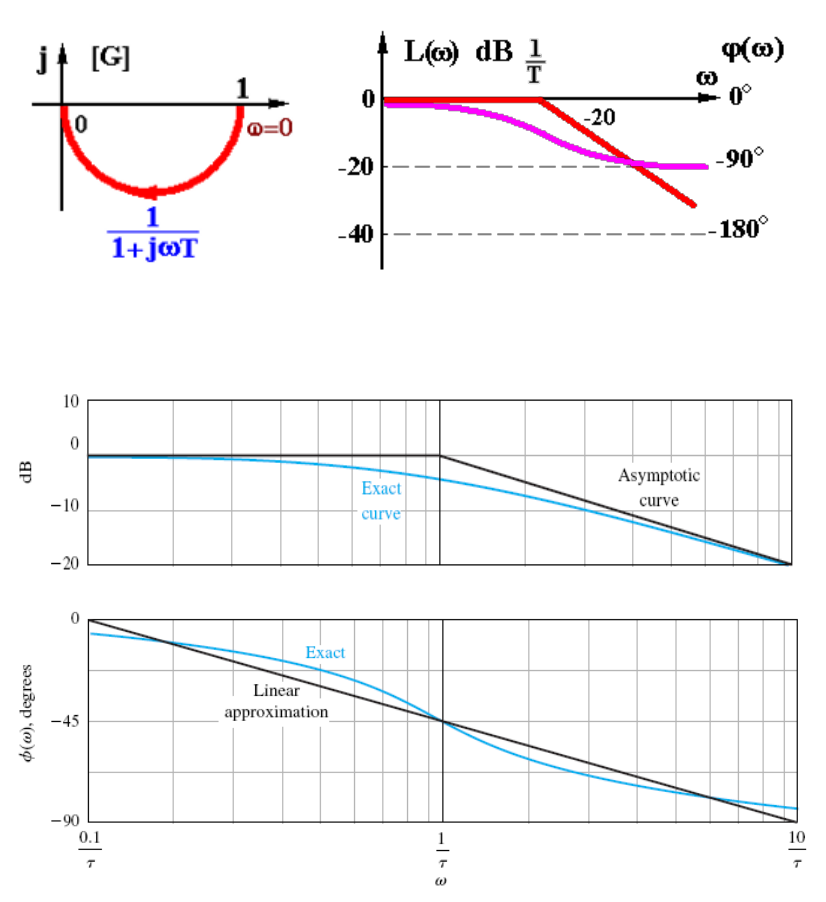

> [!tip]
> 和模电里面是一致的。拐角矫正 -3 dB

> [!more]
> 如果 $1 + j \omega T$ 变成 $-1 + j \omega T$，变成了非最小相位系统，幅值特性一致，但是相角特性是相反数。
> > [!question] 何以称之为“最小相位”？
> > 因为对于最小相位系统，随着频率 $\omega$ 的增加，系统的相位一直越来越滞后，不断变小。对于非最小相位系统，会出现所谓的“反常现象”，就是说相位会有单调增加的区间。

- Reciprocal First-Order Factor

$$
\begin{aligned}
G(s) &= (\pm) 1 + sT \\
L(\omega) &= 20 \lg \sqrt{1 + \omega^{2} T^{2}} \\
\varphi(\omega) &= \arctan \omega T && (\pi - \arctan \omega T)
\end{aligned}
$$

刚好是一阶因子的倒数（相反数）。

- Quadratic Factor

$$
\begin{aligned}
L(\omega) &= - 20 \lg \sqrt{\left(1 - \left(\frac{\omega}{\omega_{n}}\right)^{2}\right)^{2} + \left(2 \xi \frac{\omega}{\omega_{n}}\right)^{2}} \\
&= \left\{ \begin{aligned}
& 0 && ( \omega \ll \omega_{n} ) \\
& -40 \lg \frac{\omega}{\omega_{n}} && (\omega \gg \omega_{n})
\end{aligned} \right.
\end{aligned}
$$

注意 $\xi$ 的值会影响拐角处的矫正。越小影响越大。

> [!attention]
> 当 $\xi < \frac{\sqrt{2}}{2}$ 时，$L(\omega)$ 单调下降。

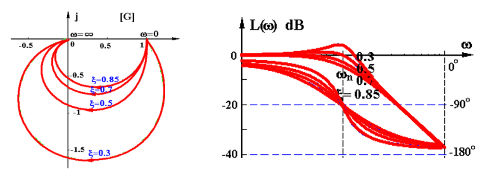

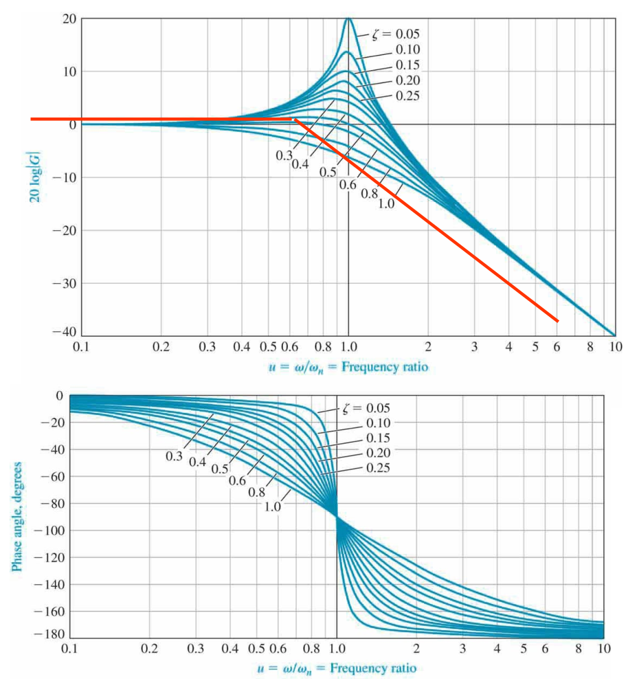

- Receprocal Quadratic Factors
- Delay Factor

> [!appication] 应用：使用 Bode Graph 反推传递函数，解决思路和模电也非常像。

不同的是二阶环节，举例如下：

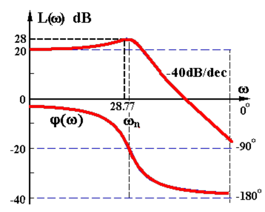

$$
\begin{aligned}
20 \lg |K| &= 20 \\
20 \lg \frac{|K|}{2\xi \sqrt{1 - \xi^{2}}} &= 28 \\
\omega_{n} \sqrt{1 - 2 \xi^{2}} &= 28.77
\end{aligned}
$$

> [!attention] 注意要舍弃 $\xi > \frac{\sqrt{2}}{2}$ 的解。

另外对于一个单纯震荡频率当 $\xi < \dfrac{\sqrt{2}}{2}$ 时，要求截止频率 Cutoff $\omega_{c}: L(\omega_{c}) = L(0)$

> [!summary]
> $\omega_{c}: L(\omega_{c}) = 0$ cutoff
>
> $\omega_{g}$ 交界频率
>
> $\omega_{r}$ 共振频率

对于一个普遍的传递函数，其 $L(\omega)$ 满足叠加性质。分别画出各个因子的 Bode Graph，再叠加。

- 化成标准型（尾“1”）
- 列出各个环节（因子）的转折频率
- 基准线（比例环节和积分环节、纯微分环节）
- 基准线上加偏置（惯性环节、二阶环节）
- 矫正（转折频率处，考虑 $\xi$ 查表）
- 检查
    - 最右侧的斜率为 $-20(n - m)$ dB/dec
    - 最右侧的相角 $- \dfrac{\pi}{2} (n - m)$

已知 Bode Graph 求 $G(s)$，如果不考虑非最小相位系统，通过幅值特性就可以确定。但是如果考虑非最小相位系统，一定是要相角特性才能确定。

> [!warning]
> 一定要对所有的惯性环节的 $\pm1$ 做遍历，都讨论一遍才能确定。

> [!note] 非最小相位系统：相位不存在最小值，存在在右半平面的零点。

e.g.

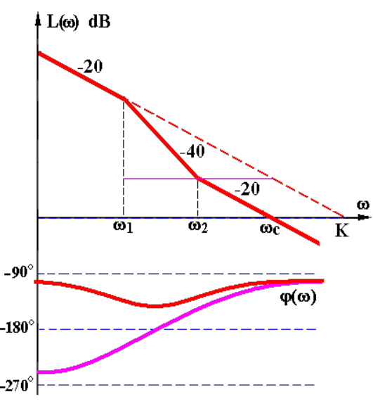

一般来说，红色线是最小相位系统的 Bode Graph。但是考虑非最小相位系统，会出现紫色线。

> [!summary]
> - The absolute value of phase angle variation of non-minimum phase system is usually greater than minimum phase system.
> - Non-minimum phase systems may not be unstable.
> - For minimum phase sys, $L(\omega)$ can determine $G(s)$.
> - For non-minimum phase sys, $L(\omega)$ can not determine a unique $G(s)$.

带延迟环节的系统，相角范围也被拉大，也不是非最小相位系统。

### 5.4_Performance_Specification_in_the_F_Domain

以二阶震荡环节为例：

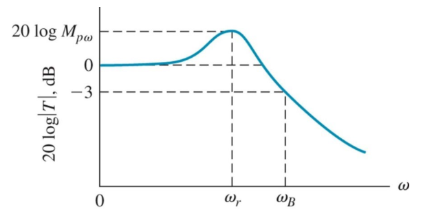

- $M_{pw}$ 谐振峰值
- $\omega_{r}$ 共振频率
- $\omega_{B}$ 带宽，从低频段的 $L(\omega)$ 下降 -3dB

> [!tip]
> 又让我想起了模电，功率变为 $\dfrac{1}{2}$，幅值变成 $\dfrac{\sqrt{2}}{2}$.
> 
> 带宽 $\omega_{B}$ 反应了系统对不同频率输入信号的忠实再现能力。

$\dfrac{\omega_{B}}{\omega_{n}}$ 和 $\xi$ 之间存在近似的线性关系。

> [!help] 服了，为什么不能推导一下？

$$
\begin{aligned}
\omega_{r} &= \omega_{n} \sqrt{1 - 2 \xi^{2}} \\
M_{r} &= \left| G(j \omega_{r}) \right| = \frac{1}{2\xi \sqrt{1 - \xi^{2}}} \\
M(\omega_{B}) &= \frac{\omega_{n}^{2}}{\sqrt{(\omega_{n}^{2} - \omega_{b}^{2})^{2} + (2 \xi \omega_{n} \omega_{b})^{2}}} = \frac{\sqrt{2}}{2} \\
\omega_{B} &= \omega_{n} \sqrt{1 - 2 \xi^{2} + \sqrt{2 - 4 \xi^{2} + 4 \xi^{4}}} \\
T_{s} & \approx \frac{3.5}{\xi \omega_{n}} \\
\omega_{b} T_{s} &= \cdots
\end{aligned}
$$

### 5.5_Log_Magnitude_and_Phase_Diagram

Nichols Chart: close loop

但是一般使用开环的频率特性，判断闭环的稳定性和稳定裕度。

### 5.6_Frequency_Response_Methods_Using_Matlab

$$
G(s) = \frac{5(0.1s + 1)}{s(0.5s + 1)\left(\dfrac{s^{2}}{2500} + \dfrac{6}{50}s + 1\right)}
$$

```matlab
num = 5 * [0.1 1];
f1 = [1 0];
f2 = [0.5 1];
f3 = [1/2500 6/50 1];
den = conv(f1, conv(f2, f3));
sys = tf(num, den);
bode(sys);
omega = logspace(-1, 3, 200); % 200 points between 0.1 and 1000
bode(sys, omega);
```

## 6.Stability_in_the_Frequency_Domain

### 6.1_Nyquist_Stability_Criterion

$1 + G(s)H(s)$ 的极点是 $G(s)H(s)$ 的极点，零点是 $G_{CL}(s)$ 的极点。

对于单位负反馈，可以用 $G(j \omega)$ 的特点判定闭环特性。中间桥梁就是 $1 + G(s)$.

稳定的充要条件：

$$
F(s) = 1 + G(s)H(s)
$$

的所有零点在复平面左半平面。

> [!help] 辐角定理
> 将顺时针闭合围线（不经过极点，其中包含零点和极点，规定右边是内部）函数映射到新的平面，新的围线绕原点的顺时针周数等于原来围线中零点和极点的个数差。

在右半平面构造无穷半径的闭合围线（能包含所有的可能零极点），用 $F(s) = 1 + G(s) H(s)$ 映射以后看圈数，或者看 $G(s)H(s)$ 绕 $(-1, j0)$ 转的圈数 $N$。

$$
Z = N + P
$$

系统稳定，则 $Z = 0, N = -P$. 当然，如果系统开环就是稳定的，$P = 0, N = 0$.

一个巧合：Nyquist 图正是虚轴上半轴经过 $G(s)H(s)$ 映射以后的图，可能无穷大半径映射没了？

下半轴是对称的 Nyquist 图。因为所有的虚部相反，原来的函数共轭变换。

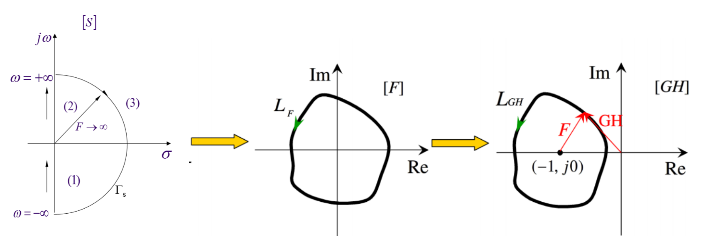

然而，如果系统不是零型系统，虚轴围线会经过极点 $(0, j0)$，要对定理做修改。

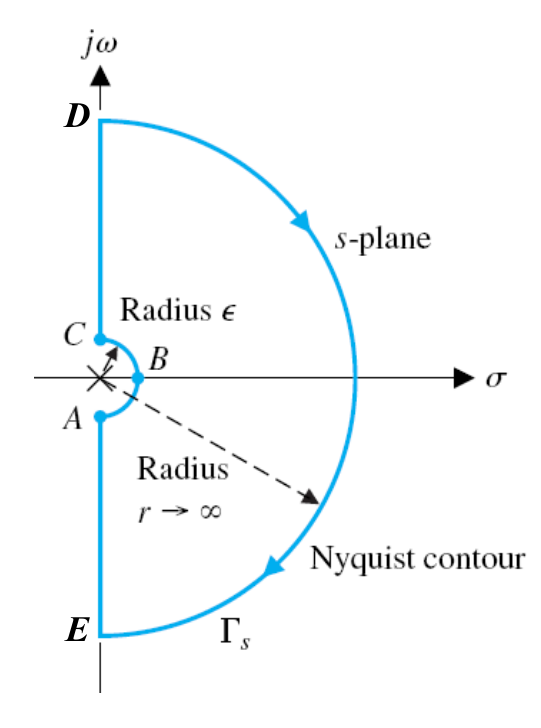

在原点处的小半圆会映射成无穷大半圆。如下图：

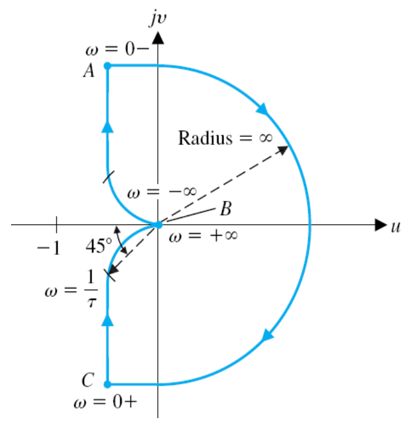

这个小半圆的映射：

$$
\begin{aligned}
s &= \varepsilon e^{j \varphi} && \left(\varphi: -\frac{\pi}{2} \rightarrow \frac{\pi}{2}\right) \\
G(s)H(s) &= \lim_{\varepsilon \rightarrow 0} \frac{\widetilde{K}}{\varepsilon}e^{-j \varphi} && \left(\frac{\pi}{2} \rightarrow -\frac{\pi}{2}\right)
\end{aligned}
$$

如果积分环节数量更多，要用同样的方法去判断：

- II: $(\pi \rightarrow - \pi)$
- III: $\left( \frac{3}{2}\pi \rightarrow - \frac{3}{2} \pi \right)$

Nyquist Criterion & Bode Graph

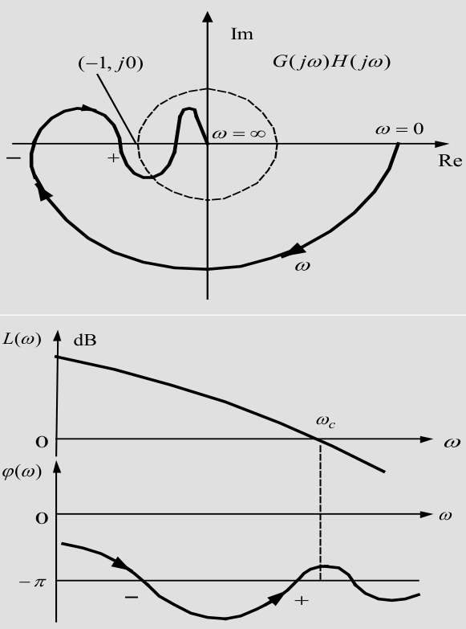

通过看相角的之前变化，来判断是不是包围了 $(-1, j0)$，$\omega_{c}$ 就是 $|G(j \omega)| = 1$ 的情况。

### 6.2_Stability_Margins

稳定裕度：相对稳定的程度。

| 稳定程度 | 时域   | 频域                 |
| -------- | ------ | -------------------- |
| 稳定程度 | 虚轴   | $(-1, j0)$           |
| 稳定程度 | 阻尼比 | 到 $(-1, j0)$ 的距离 | 

> [!help] 如何衡量到 $(-1, j0)$ 的距离？

- Cutoff frequency $\omega_{c}: |G(j \omega_{c})| = 1$
- Phase margin $\gamma = \pi + \mathrm{arg} G(j \omega_{c})$
- Phase crossover $\omega_{g}: \mathrm{arg} G(j \omega_{g}) = \pi$
- Amplitude margin $h = \dfrac{1}{|G(j \omega_{g})|}$

> [!info] 相角裕度越大、幅值裕度越大，系统越稳定。


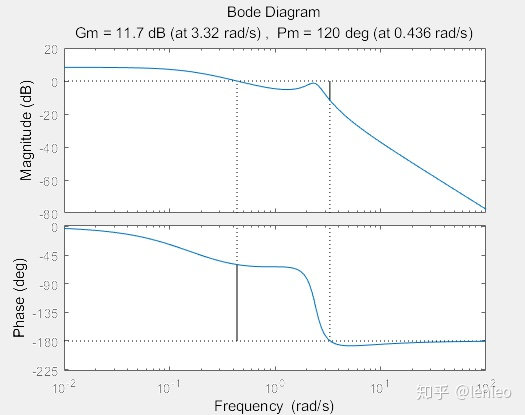

### 6.3_OLsys_Frequency

三频段理论

- 低频段和稳态性能相关：低频段由系统的型号数和增益决定，[后者决定系统的稳态误差](#3.4_Steady_State_Error)。
- 中频段和动态性能相关：中频段是 $\omega_{c}, \omega_{g}$ 附近的频段。一般这里的斜率都是 -20，这样稳定性好。
- 高频段和抗高频干扰能力相关：右侧越低，对高频信号的放大越小，抗干扰能力越好。

对于典型二阶系统

$$
\begin{aligned}
T_{OL}(s) &= \frac{\omega_{n}^{2}}{s(s+2\xi \omega_{n})} \\
T_{CL}(s) &= \frac{\omega_{n}^{2}}{s^{2}+2 \xi \omega_{n} s + \omega_{n}^{2}} \\
\gamma &= \arctan \frac{2\xi}{\sqrt{\sqrt{4 \xi^{4}+1} - 2 \xi^{2}}} \\
\omega_{n} T_{s} & \propto \frac{\gamma}{\tan \gamma} \\
\omega_{c} &= \omega_{n} \sqrt{\sqrt{4 \xi^{4}+1}-2\xi^{2}}
\end{aligned}
$$

发现了时域性能和频域性能的关系。

对于高于二阶系统的情况，时域法使用主导极点法，频域法使用求频域指标对应时域指标的方法。

### 6.4_CLsys_Frequency

通过某些方法求出闭环系统的 Bode Graph

- 零频值 $M_{0} = M(\omega = 0)$
- 谐振性能 $\omega_{r} = \omega_{n} \sqrt{1 - 2\xi^{2}}, M_{r} = \dfrac{1}{2\xi \sqrt{1 - \xi^{2}}}$
- 带宽频率 $B$

### 6.5_sys_frequency_with_Matlab

``bode, logspace, nyquist, nichols, margin, pade``

## 7.Design

### 7.1_Introduction

- Root Locus Method (Time Domain)
    - 增加环节相当于增加开环零极点，改变零极点的分布和根轨迹的形状
        - 增加零点，根轨迹左移，稳定度增加
        - 增加极点，根轨迹右移，改变动态性能
- Bode Graph Method (Freq Domain)
    - [三频段理论](#6.3_OLsys_Frequency)

### 7.2_Phase-Lead_Design

超前校正

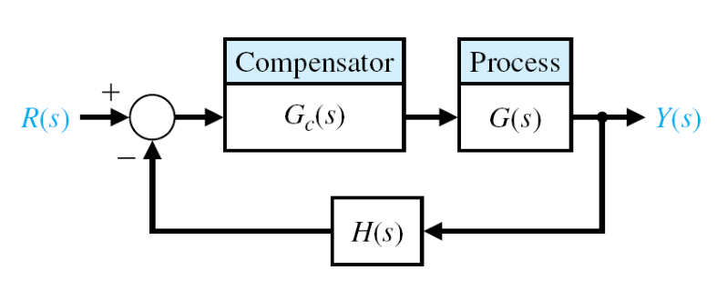

$$
\begin{aligned}
G_{c}(s) &= \frac{K \prod_{i=1}^{m}(s + z_{i})}{\prod_{j=1}^{n}(s + p_{j})}
\end{aligned}
$$

如果只考虑一阶：

$$
G_{c}(s) = \frac{K(s+z)}{(s+p)}
$$

> [!tldr]
> - Phase-lead $-p < -z$
> - Phase-lag $-z < -p$

设计问题就是选择合适的 $K, z, p$ 来获得理想的性能。

> [!help] 为什么叫做超前矫正？
> 因为超前校正可以为原有的控制系统提供超前的附加相角。Bode Graph 如下图所示：
> 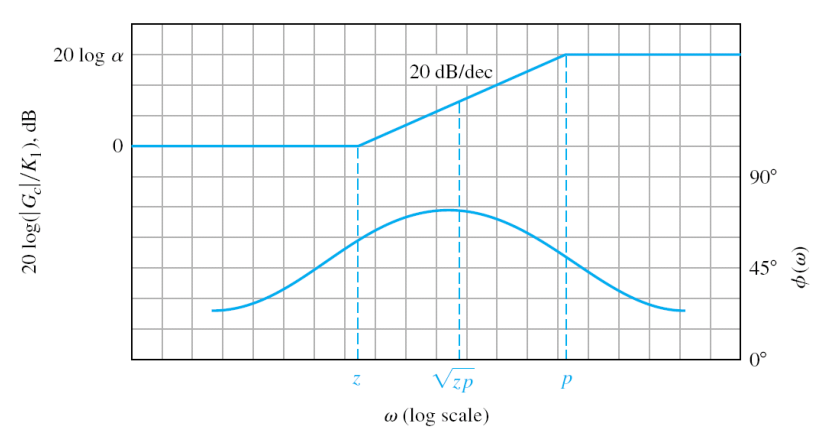

从时域角度来看，Phase-Lead 矫正将根轨迹左移，因为 $-p < -z \Rightarrow \mathrm{arg}G_{c}(s) > 0$.

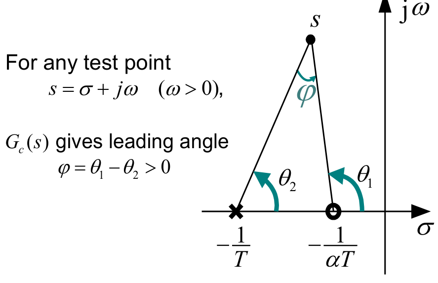

### 7.3_Phase-Lag_Design

### 7.4_Phase-Lead-Lag_Design

### 7.5_System_Design_with_Matlab

## 8.Digital_Control_System

### 8.1_intro_of_digital

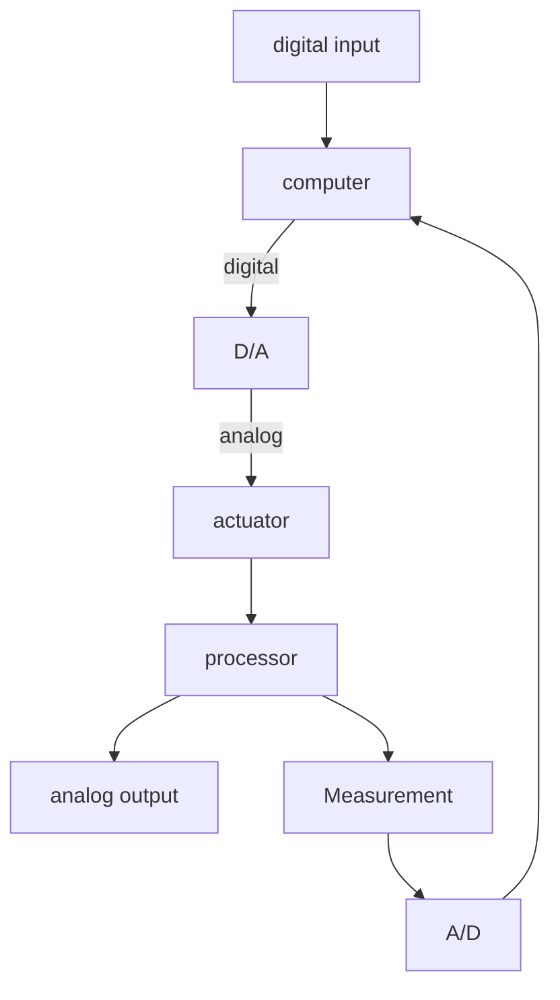
```mermaid
flowchart TD;
I[digital input] --> computer --> |digital| D/A --> |analog| actuator --> processor --> O[analog output]
processor --> Measurement --> A/D --> computer
```

### 8.2_Sampled_Data

理想 AD：理想采样开关 + 0 阶保持器

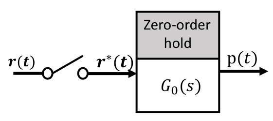

$$
\begin{aligned}
r^{*}(t) &= r(t) \sum_{i= 0}^{\infty}\delta (t - nT) \\
R^{*}(s) &= R(s) \mathscr{L} \left[ \sum_{i=0}^{\infty} \delta (t - nT) \right] \\
&= R(s) \sum_{i=0}^{\infty} e^{-nTs} \\
&= \frac{R(s)}{1-e^{-nTs}} \\
G_{0}(s) &= \frac{1-e^{-sT}}{s} \\
g_{0}(t) &= u(t) - u(t - T)
\end{aligned}
$$

零阶保持器对系统频率特性的影响

$$
\begin{aligned}
G_{0}(j \omega) &= \frac{1 - e^{-jT \omega}}{j \omega} \\
&= e^{-j \frac{\omega T}{2}} \frac{e^{j \frac{\omega T}{2}} - e^{-j \frac{\omega T}{2}}}{j \omega} \\
&= \frac{2 \sin \frac{\omega T}{2}}{\omega} e^{-j \frac{\omega T}{2}}
\end{aligned}
$$
