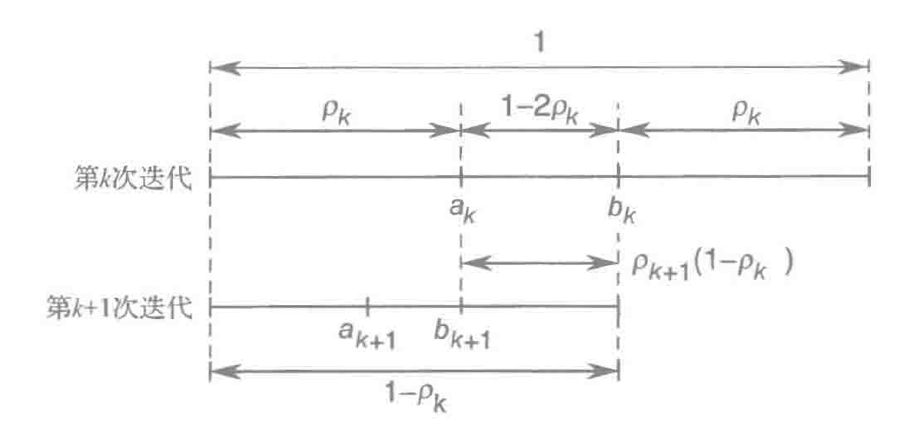
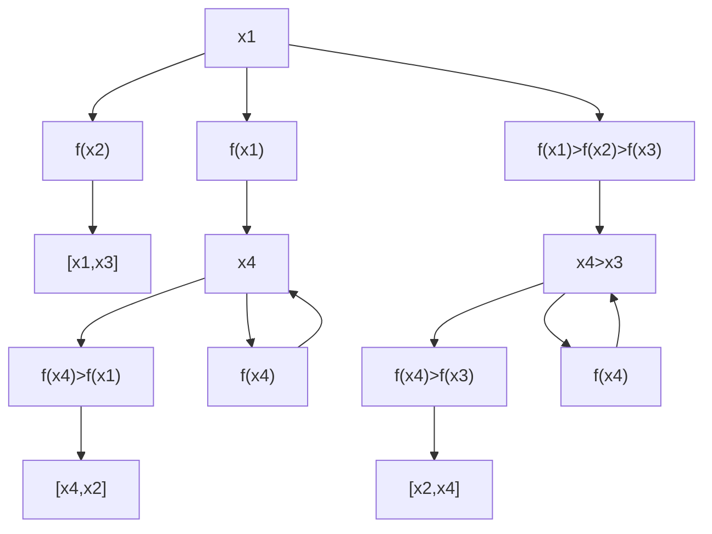

# Optimization

无约束优化问题

---

答疑：周五晚上 17：00 ~ 19：00，线上预约线下答疑，（智信馆 611）。

---

什么是最优化？

> 用数学的方式，借助计算机工具**描述和找出**优化问题最优解的一门学科。

机器学习 = 模型 + 优化方法

---

简单例子：回归分析

- 建立模型

$$
y = b_0 + b_1 t
$$

- 优化问题

$$
\min_{b_0, b_1} \left \Vert \begin{bmatrix}
1 & t_1 \\
\vdots & \vdots \\
1 & t_n
\end{bmatrix} \begin{bmatrix}
b_0 \\ b_1
\end{bmatrix} - \begin{bmatrix}
y_1 \\ \vdots \\ y_n
\end{bmatrix} \right \Vert
$$

---

最优化的应用：

1. 智能制造
2. 生产调度
3. 机器人
4. 运动规划（模型预测控制）

---

## 0 Introduction

---

### 0.1

什么是最优化？

三要素

- 优化目标
- 决策变量
- 约束条件

---

研究的问题

- 数学性质（线性？凸问题？存在？唯一？灵敏度？）
-  构造寻求最优解的计算方法
- 分析计算方法的：１.理论性质；２.实际计算表现

---

一些求解的方法

- 图解法
- 解析法
- 计算机＋最优化理论：迭代法
	- 搜索方向 $\lambda_k$
	- 搜索步长 $p^{(k)}$

$$
x^{(k+1)} = x^{(k)} + \lambda_k p^{(k)}
$$

---

难点：局部最优解和全局最优解不统一。

鞍点：在某一个维度上达到极值，但在另一个维度上不是。

---

### 0.2

课程的主要内容
1. 数学知识
2. 无约束优化
3. 线性规划
4. 非线性规划

---

## 5 Calculus Basic

---

### 5.1

序列、极限、函数连续性

---

- 定理一：收敛序列极限唯一（反证法）
- 定理二：任意收敛序列极限有界
- 定理三：单调有界序列必有极限（极限是上确界）
- 定理四：子列和原序列极限相同

---

定义矩阵序列的极限

$$
\lim_{k \rightarrow \infty} \Vert A_{k} - A \Vert = 0
$$

 Here, $\Vert \cdot \Vert: R^{m \times n} \rightarrow R$ is matrix norm. And a definition:

$$
 \Vert A \Vert = \sqrt{\sum_{i, j} \vert a_{ij} \vert^{2}}
$$

$$
\begin{align*}
&A \in \mathbb{R}^{n \times n} \\
&\vert \lambda_{i}(A) \vert < 1 \iff \lim_{k \rightarrow \infty} A^{k} = O \iff \sum_{k=1}^{\infty} A^{k} = (I_{n}-A)^{-1}
\end{align*}
$$

The continuousness of $A(\xi): \mathbb{R}^{r} \rightarrow \mathbb{R}^{m \times n}$

Definition:

$$
\lim_{\Vert \boldsymbol{\xi} - \boldsymbol{\xi}_{0} \Vert \rightarrow 0} \Vert \boldsymbol{A}(\boldsymbol{\xi}) - \boldsymbol{A}(\boldsymbol{\xi}_{0}) \Vert = 0
$$

---

### 5.2

differentiable

---

微积分的基本理念：利用仿射函数对函数进行局部近似。

$$
\begin{align*}
&\vec{f}: R^n \rightarrow R^m \\
&\vec{L} \in R^{m \times n}, \vec{y} \in R^m \\
&\vec{A}(\vec{x}) = \vec{L}(\vec{x}) + \vec{y} \\
&\lim_{\vec{x} \rightarrow \vec{x}_{0}, \vec{x}_{0} \in \Omega} \frac{\Vert \vec{f}(\vec{x}) - \vec{A}(\vec{x}) \Vert}{\Vert \vec{\vec{x}} - \vec{\vec{x}}_{0} \Vert} = \vec{0}\\
&\lim_{\vec{x} \rightarrow \vec{x}_{0}, \vec{x}_{0} \in \Omega} \frac{\Vert \vec{f}(\vec{x}) - \vec{L}(\vec{x}-\vec{x}_{0}) - \vec{f}(\vec{x}_{0}) \Vert}{\Vert \vec{x} - \vec{x}_{0} \Vert} = \vec{0}\\
\end{align*}
$$

---

### 5.3

derivative matrix

---

$$
\begin{align*}
&\vec{L} = D \vec{f}(\vec{x}_{0}) \\
&= \begin{bmatrix} \frac{\partial \vec{f}}{\partial x_{1}} (\vec{x_{0}}), \cdots, \frac{\partial \vec{f}}{\partial x_{n}} (\vec{x_{0}})\end{bmatrix} \\
&=\begin{bmatrix} \frac{\partial f_{1}}{\partial x_{1}} & \cdots & \frac{\partial f_{1}}{\partial x_{n}} \\ \cdots &  & \cdots \\ \frac{\partial f_{n}}{\partial x_{1}} & \cdots & \frac{\partial f_{n}}{\partial x_{n}}\end{bmatrix} \\
\end{align*}
$$

---

对于单值函数 $f: \mathbb{R}^{n}\rightarrow \mathbb{R}$，定义梯度和黑塞矩阵

$$
\begin{align*}
    &\nabla f(\vec{x}) = D f(\vec{x})^{T} 
    = \begin{bmatrix} 
        \frac{\partial f}{\partial x_{1}}  \\ 
        \vdots \\ 
        \frac{\partial f}{\partial x_{n}}
    \end{bmatrix} \\
    & \boldsymbol{F}(\boldsymbol{x)} = D^{2} f(\vec{x}) = D \nabla f(\vec{x}) \\
    & = \begin{bmatrix} 
        \frac{\partial}{\partial x_{1}}\left(\frac{\partial f}{\partial x_{1}}\right)  & \cdots & \frac{\partial}{\partial x_{n}}\left(\frac{\partial f}{\partial x_{1}}\right) \\ 
        \vdots & \ddots & \vdots \\ 
        \frac{\partial}{\partial x_{1}}\left(\frac{\partial f}{\partial x_{n}}\right)  & \cdots & \frac{\partial}{\partial x_{n}}\left(\frac{\partial f}{\partial x_{n}}\right)
    \end{bmatrix}
\end{align*}
$$

---

### 5.4

principle of derivative

---

在定义域均为开集的情况下

$$
\begin{align*}
    & g: D \rightarrow \mathbb{R}, D \in \mathbb{R}^{n} \\
    & \boldsymbol{f}: (a, b) \rightarrow D \\
    & h(t) = g[\boldsymbol{f}(t)]
\end{align*}
$$

则有求导法则

$$
\frac{\mathrm{d}}{\mathrm{d}t} h(t) = D g(\boldsymbol{f}(t)) \cdot D \boldsymbol{f} (t) = (\nabla g[\boldsymbol{f}(t)])^{T} \cdot \begin{bmatrix}
    f_{1}'(t)  \\ 
    \vdots \\ 
    f_{n}'(t)
\end{bmatrix}
$$

---

$$
\begin{align*}
    & \boldsymbol{f}, \boldsymbol{g}: \mathbb{R}^{n} \rightarrow \mathbb{R}^{m} \\
    & h: \mathbb{R}^{n} \rightarrow \mathbb{R} \\
    & h(\boldsymbol{x}) = \boldsymbol{f}(\boldsymbol{x})^{T} \cdot \boldsymbol{g}(\boldsymbol{x})
\end{align*}
$$

乘积求导法则

$$
D h(\boldsymbol{x}) = \boldsymbol{f}(\boldsymbol{x})^{T} D \boldsymbol{g}(\boldsymbol{x}) + \boldsymbol{g}(x)^{T} D \boldsymbol{f}(\boldsymbol{x})
$$

---

其他常用公式

$$
\begin{align*}
    & D (\boldsymbol{y}^{T} \boldsymbol{x}) = \boldsymbol{y}^{T} \\
    & D (\boldsymbol{x}^{T} \boldsymbol{A} \boldsymbol{x}) = \boldsymbol{x}^{T} (\boldsymbol{A} + \boldsymbol{A}^{T})
\end{align*}
$$

---

### 5.5

水平集和参数化

---

$f:\mathbb{R}^{n} \rightarrow \mathbb{R}$ 的水平集为
$$
\{\boldsymbol{x} \in \mathbb{R}^{n}: f(\boldsymbol{x}) = c, c \in \mathbb{R} \}
$$

梯度向量和水平集曲线在这点的切线正交。

$$
\begin{align*}
    & \boldsymbol{x} = \boldsymbol{x}(\theta), f(\boldsymbol{x}) = c, g(\theta) = f(\boldsymbol{x}(\theta)) \\
    & g'(\theta) = 0 \\
    & D f(\boldsymbol{x}) \frac{\partial \boldsymbol{x}}{\partial \theta} = 0 \\
    & \frac{\partial \boldsymbol{x}}{\partial \theta} \cdot \nabla f(\boldsymbol{x}) = 0
\end{align*}
$$

---

### 5.6

Taylor series

---

$$
\begin{align*}
    &f(\boldsymbol{x}) = f(\boldsymbol{x}_{0}) + D f(\boldsymbol{x}_{0}) (\boldsymbol{x} - \boldsymbol{x}_{0}) \\
    &+ \frac{1}{2} (\boldsymbol{x} - \boldsymbol{x}_{0})^{T} D^{2} f(\boldsymbol{x}_{0}) (\boldsymbol{x} - \boldsymbol{x}_{0}) + o(\Vert \boldsymbol{x}-\boldsymbol{x}_{0} \Vert^{2})
\end{align*}
$$

---

## 6 集合约束和无约束优化问题

---

### 6.1

introduction

---

$$
\begin{align*}
    &\text{minimize } f(x)\\
    &\text{subject to } x \in \Omega
\end{align*}
$$

从可行集合中找到使得目标函数最小的点。

$$
\begin{align*}
    & &&f:\Omega \rightarrow \mathbb{R}, \Omega \subset \mathbb{R}^{n}\\
    &\text{local} &&\exists \epsilon > 0, \forall x: 0 < \Vert x - x^{*} \Vert < \epsilon, f(x) > f(x^{*}) \\
    &\text{global} &&\forall x \in \Omega \text{\\} \{x^{*}\}, f(x) > f(x^{*}) \\
\end{align*}
$$

- 局部极小点
- 全局最小点

$$
x^{*} = \mathrm{argmin}_{x \in \Omega} f(x)
$$

---

### 6.2

局部极小点的条件

---

可行方向：为了研究非内点为极小点的情况。

所有的可行方向构成了可行基在某一个点附近的逼近。

$\boldsymbol{d}$ is feasible direction of $\boldsymbol{x_{0}}$.

$$
\begin{align*}
    & \exists \alpha_{0} > 0, \forall \alpha \in [0, \alpha_{0}], \boldsymbol{x_{0}} + \alpha \boldsymbol{d} \in \Omega
\end{align*}
$$

定义很像极限。

---

方向导数

$$
\frac{\partial f}{\partial \boldsymbol{d}}(x) = \lim_{\alpha \rightarrow 0} \frac{f(x+\alpha d)-f(x)}{\alpha}
$$

计算简化

$$
\begin{align*}
    \phi(\alpha) =& f(x+\alpha d) \\
    \frac{\partial f}{\partial \boldsymbol{d}}(x) =& \left. \frac{\mathrm{d}}{\mathrm{d}\alpha}  \varphi(\alpha) \right|_{\alpha = 0}\\
    =& Df(x) \boldsymbol{d} \\
    =& \boldsymbol{d}^{T}\nabla f(x)
\end{align*}
$$

---

定理一：局部极小点的一阶必要条件

这是**排除法**。

$$
\begin{align*}
    & f \in C^{1}\\
    & \forall \boldsymbol{d} \text{ is feasible, } \frac{\partial f}{\partial \boldsymbol{d}}(\boldsymbol{x}^{*}) = \boldsymbol{d}^{T} \nabla f(\boldsymbol{x}^{*}) \geq 0\\
\end{align*}
$$

Proof: 

$$
\begin{align*}
    f(x) - f(x^{*}) &= \varphi(\alpha) - \varphi(0) \\
    &= \varphi'(0) \alpha + o(\alpha) \\
    &\geq 0
\end{align*}
$$

如果 $x^{*}$ 在 $\Omega$ 内部，则：

$$
\nabla f(x^{*}) = 0
$$

---

定理二：局部极小点的二阶必要条件

前提：满足一阶必要条件 $f \in C^{2}$

$$
\phi''(0) = d^{T} D^{2}f(x^{*}) d \geq 0
$$

黑塞矩阵**半正定**。

Proof:

$$
\begin{align*}
    \varphi'(\alpha) &= Df(\boldsymbol{x}^{*} + \alpha \boldsymbol{d}) \cdot \boldsymbol{d} \\
        &= \boldsymbol{d}^{T} \nabla f(\boldsymbol{x}^{*} + \alpha \boldsymbol{d}) \\
    \varphi''(\alpha) &= \boldsymbol{d}^{T} \frac{\mathrm{d}}{\mathrm{d}\alpha} (\nabla f(\boldsymbol{x}^{*} + \alpha \boldsymbol{d})) \\
        &= \boldsymbol{d}^{T} \boldsymbol{F}(x^{*} + \alpha \boldsymbol{d}) \boldsymbol{d} \\
    \varphi(\alpha) &= \varphi(0) + \varphi'(0) \alpha + \frac{\varphi''(0)}{2} \alpha^{2} + o(\alpha^{2})
\end{align*}
$$

---

当然，满足两个条件也不一定就是极小值（必要性）。例如：

- $x=0, f(x) = x^{3}$

但是只要有一个必要条件不满足，就一定不是极小值点。例如：

- $x = \begin{bmatrix}0 \\ 0\end{bmatrix}, f(x) = x_{1}^{2} - x_{2}^{2}$

$$
D^{2} f(\boldsymbol{x}) = \begin{bmatrix}
        2 & 0 \\ 
        0 & -2
    \end{bmatrix} \ngeq 0
$$

---

定理三：局部极小点的二阶充分条件

前提：内点，$f \in C^{2}$

$$
\begin{align*}
    &\nabla f(\boldsymbol{x}^{*}) = 0\\
    &\boldsymbol{F}(\boldsymbol{x}^{*}) = D^{2}f(\boldsymbol{x}^{*}) > 0
\end{align*}
$$

第二条条件指的是矩阵**正定**。

---

证明：瑞利不等式

$$
\lambda_{min}(\boldsymbol{P}) \Vert \boldsymbol{x} \Vert^{2} \leq \boldsymbol{x}^{T} \boldsymbol{P} \boldsymbol{x} \leq \lambda_{max}(\boldsymbol{P}) \Vert \boldsymbol{x} \Vert^{2}
$$

$$
\begin{align*}
    &\varphi(\alpha) = f(\boldsymbol{x^{*} + \alpha \boldsymbol{d}}) = f(x^{*}) + \frac{1}{2} \boldsymbol{x}^{T} \boldsymbol{F}(\boldsymbol{x}^{*}) \boldsymbol{x}^{T} + o(\Vert \boldsymbol{x} \Vert^{2}) \\
    &\geq f(\boldsymbol{x}^{*}) + \frac{1}{2} \lambda_{min}(\boldsymbol{F}(\boldsymbol{x}^{*})) \Vert \boldsymbol{x} \Vert^{2} + o(\Vert \boldsymbol{x} \Vert^{2})
\end{align*}
$$

---

## 7 一维搜索算法

---

### 7.1

Introduction

求解单变量单值函数在闭区间的最小值。前提是在闭区间上单峰。

---

### 7.2

黄金分割法

---

只知道给定输入的函数值，不知道导数。

方法：对称压缩。

计算

$$
f(a_{1}), f(b_{1})
$$

从而压缩掉一个区间

$$
[a_{0,}a_{1}] \text{ or } [b_{1}, b_{0}]
$$

---

$$
\begin{align*}
    &f(a_{1})< f(b_{1}) \Rightarrow x^{*} \in [a_{0}, b_{1}]\\
    &f(a_{1}) \geq f(b_{1}) \Rightarrow x^{*} \in [a_{1}, b_{0}]\\
\end{align*}
$$

此后还要==充分利用上一次计算的结果==。

---

如何选择 $a_{1}, b_{1}$？

**固定的压缩比**

$$
\begin{align*}
    &\rho (b_{0}-a_{0}) = (a_{1}-a_{0}) \\
    &\rho (b_{1}-a_{0}) = (b_{1}-b_{2}) \\
\end{align*}
$$


---

$$
\begin{align*}
    &\frac{\rho}{1-\rho} = \frac{1-\rho}{1} \\
    &\rho = \frac{3-\sqrt{5}}{2} \text{ or } \frac{3+\sqrt{5}}{2} \left(> \frac{1}{2}\right) \\
    &1-\rho = \frac{\sqrt{5}-1}{2}
\end{align*}
$$

---

从区间 $[a_{0}, b_{0}]$ 压缩到精度为 $\varepsilon$.

压缩次数

$$
N = \frac{\ln \frac{\varepsilon}{b_{0}-a_{0}}}{\ln (1-\rho)}
$$

向上取整。

---

```python
def GoldenSectionSearch(func, start, end, precision):
    rho = (3-sqrt(5))/2
    a,b = [start],[end]
    ak = start + rho * (end - start)
    bk = end - rho * (end - start)
    fak = func(ak)
    fbk = func(bk)
    while (end - start > precision):
        if (fak <= fbk):
            end = bk
            bk,fbk = ak,fak
            ak = start + rho * (end - start)
            fak = func(ak)
        else:
            start = ak
            ak, fak = bk, fbk
            bk = end - rho * (end - start)
            fbk = func(bk)
        a.append(start)
        b.append(end)
    return (a,b)
```

---

### 7.3

Fibbonaci Array

---

如果压缩比 $\rho$ 可以调整？

$$
\{\rho_{k}\}
$$

仍然保持对称压缩的方法。

每次迭代只计算一次函数值。

---



---

$$
\begin{align*}
    &\rho_{k+1}(1-\rho_{k}) = 1 - 2\rho_{k}\\
    &\rho_{k+1} = \frac{1-2\rho_{k}}{1-\rho_{k}} = 1 - \frac{\rho_{k}}{1-\rho_{k}}\\
    & \frac{b_{0}-a_{0}}{\varepsilon} = (1-\rho_{1})(1-\rho_{2}) \cdots (1-\rho_{k}) \\
    \text{minimize } & (1-\rho_{1})(1-\rho_{2}) \cdots (1-\rho_{k}) \\
    \text{subject to } & \rho_{k+1} = 1 - \frac{\rho_{k}}{1-\rho_{k}} \\
    &0 \leq \rho_{k} \leq \frac{1}{2}, k = 1, \cdots, N
\end{align*}
$$

---

Fibbonaci Array

| -1  | 0   | 1   | 2   | 3   | 4   | 5   |
| --- | --- | --- | --- | --- | --- | --- |
| 0   | 1   | 1   | 2   | 3   | 5   | 8   | 

---

$$
\begin{align*}
    &1-\rho_{k} = \frac{F_{N-k+1}}{F_{N-k+2}} \\
    &(1 - \rho_{1}) \cdots (1 - \rho_{N}) = \frac{1}{F_{N-k+1}}
\end{align*}
$$

---

最后一次压缩比为 1/2，实际操作中应该修正为

$$
\frac{1}{2} - \varepsilon
$$

---

```python
def FibonacciSearch(func, start, end, precision, epsilon):
    x,y = 1,1
    a,b = [start],[end]
    while (precision*y/(1+epsilon)<(end-start)):
        temp = x
        x = y
        y = temp+y

    ak = (x*start+(y-x)*end)/y
    bk = (x*end+(y-x)*start)/y
    fak = func(ak)
    fbk = func(bk)

    while (y>2):
        temp = x
        x = y - x
        y = temp
        if (fak <= fbk):
            end = bk
            bk,fbk = ak,fak
            ak = (x*start+(y-x)*end)/y
            fak = func(ak)
        else:
            start = ak
            ak, fak = bk, fbk
            bk = (x*end+(y-x)*start)/y
            fbk = func(bk)
        a.append(start)
        b.append(end)
    
    if (y==2):
        ak = (start+end)/2 - epsilon*(end-start)
        bk = (start+end)/2 + epsilon*(end-start)
        if (func(ak) <= func(bk)):
            a.append(start)
            b.append(bk)
        else:
            a.append(ak)
            b.append(end)
    return (a,b)
```

---

### 7.4

二分法

---

前提：可以计算一阶导数。

计算 $f\left(\frac{x_{1}+x_{2}}{2}\right)'$

如果导数为正，舍弃右侧；如果导数为负，舍弃左侧。

$$
\rho = \frac{1}{2}
$$

---

### 7.5

Newton Iteration

---

前提：可以计算二阶导数。

Taylor Theorem

$$
\begin{align*}
    &q(x) = f(x_{k}) + f'(x_{k}) (x-x_{k}) + \frac{1}{2} f''(x_{k}) (x-x_{k})^{2}\\
    &\text{minimize } q(x)\\
    &\text{subject to }x\\
    & x_{k+1} = x_{k} - \frac{f'(x_{k})}{f''(x_{k+1})}
\end{align*}
$$

用牛顿切线法寻找 $f'(x) = 0$ 的解。

---

Iteration precision

$$
|x_{k+1} - x_{k}| = \left|\frac{f'(x_{k})}{f''(x_{k+1})} \right| \leq \varepsilon
$$

---

If $f''(x_{k}) \leq 0$: 得到的是极大值，之后在凸优化，凹优化问题中会有详细讨论。

---

### 7.6

割线法——近似二阶

---

割线法运用了两步的历史信息。

$$
\begin{align*}
    &f''(x_{k}) = \frac{f'(x_{k})-f'(x_{k-1})}{x_{k}-x_{k-1}} \\
    &x_{k+1} = x_{k} - f'(x_{k}) \frac{x_{k}-x_{k-1}}{f'(x_{k})-f'(x_{k-1})}
\end{align*}
$$

---

```python
def SecantMethod(f, x1, x2, precision):
    def GetNullPoint(f, x1, x2):
        return (f(x2)*x1-f(x1)*x2)/(f(x2)-f(x1))
    PointLog = [x1, x2]
    while (abs(x2-x1)>precision*abs(x1)):
        temp = x2
        x2 = GetNullPoint(f, x1, x2)
        x1 = temp
        PointLog.append(x2)
    return PointLog
```

---

### 7.7

划界法

---

如何确定初始单峰区间？

$$
\forall x_{1}, x_{2}, x_{3}
$$



---

### 7.8

多维搜索优化问题中的一维搜索。

---

$$
\begin{align*}
    &\boldsymbol{x}_{k+1} = \boldsymbol{x}_{k} + \alpha_{k} \boldsymbol{d}_{k} \\
    &\Phi(\alpha) = f(\boldsymbol{x} + \alpha \boldsymbol{d}_{k})
\end{align*}
$$

对 $\Phi(\alpha)$ 进行一维搜索。

$$
\Phi'(\alpha) = \boldsymbol{d}_{k}^{T} \nabla f(\boldsymbol{x}+\alpha \boldsymbol{d}_{k})
$$

---

多维搜索问题的矛盾：

- 将算力用于计算下降方向
- 将算力用于计算最佳步长

一般来说方向的选取更为重要。

---

## 8 梯度方法

---

### 8.1

Introduction

---

函数在一个点处在沿着梯度方向增加最快。
$$
\begin{align*}
    \Vert \boldsymbol{d} \Vert &= 1 \\
    \varphi(\alpha) &= f(\boldsymbol{x} + \alpha \boldsymbol{d}) \\
    \varphi'(0) &= \boldsymbol{d}^{T} \nabla f(\boldsymbol{x}) \leq \Vert f(\boldsymbol{x}) \Vert
\end{align*}
$$

取负梯度方向

$$
\begin{align*}
    & f(\boldsymbol{x}_{0} - \alpha \nabla f(\boldsymbol{x}_{0})) = f(\boldsymbol{x}_{0}) - \alpha \Vert \nabla f(\boldsymbol{x}_{0}) \Vert^{2} + o(\alpha) \\
    & \boldsymbol{x}_{k+1} = \boldsymbol{x}_{k} - \alpha_{k} \boldsymbol{g}_{k} & \boldsymbol{g}_{k} = \nabla f(\boldsymbol{x}_{k})
\end{align*}
$$

---

### 8.2

最速下降法

---

$$
\alpha_{k} = \mathrm{argmin}_{\alpha \geq 0} f(\boldsymbol{x}_{k} - \alpha \nabla f(\boldsymbol{x}_{k}))
$$

在梯度法的同时计算一个一维搜索问题。

---

**正交性**

迭代过程得到序列 $\{ \boldsymbol{x}_{k} \}$.

$$
\forall k \geq 0, (\boldsymbol{x}_{k+1} - \boldsymbol{x}_{k}) \cdot (\boldsymbol{x}_{k+2} - \boldsymbol{x}_{k+1}) = 0
$$

Proof:

$$
\begin{align*}
    0 &= \varphi'_{k}(\alpha_{k}) \\
        &= f'(\boldsymbol{x}_{k} - \alpha \nabla f(\boldsymbol{x}_{k})) \\
        &= D f(\boldsymbol{x}_{k+1}) (-\nabla f(\boldsymbol{x}_{k})) \\
        &= - \nabla f(\boldsymbol{x}_{k+1}) \cdot \nabla f(\boldsymbol{x}_{k}) \\
    & \Rightarrow (\boldsymbol{x}_{k+1} - \boldsymbol{x}_{k}) \cdot (\boldsymbol{x}_{k+2} - \boldsymbol{x}_{k+1}) = 0
\end{align*}
$$

Q.E.D

---

**严格下降**

$$
\forall k \geq 0 , \nabla f(\boldsymbol{x}_{k}) \neq 0, f(\boldsymbol{x}_{k+1}) < f(\boldsymbol{x}_{k})
$$

Obviously.

---

**停止条件**：一阶必要条件

$$
\nabla f(\boldsymbol{x}_{k}) = 0
$$

适合数值计算的停止条件

$$
\begin{align*}
    & \Vert f(\boldsymbol{x}_{k}) \Vert < \varepsilon \\
    & \frac{|f(\boldsymbol{x}_{k+1})-f(\boldsymbol{x}_{k})|}{|f(\boldsymbol{x}_{k})|} < \varepsilon \\
    & \frac{|f(\boldsymbol{x}_{k+1})-f(\boldsymbol{x}_{k})|}{\max\{1, |f(\boldsymbol{x}_{k})|\}} < \varepsilon
\end{align*}
$$

避免停止过程中分母过小。

---

二次函数

$Q \in \mathbb{R}^{n \times n}$ 是对称正定矩阵。

$$
f(\boldsymbol{x}) = \frac{1}{2} \boldsymbol{x}^{T} Q \boldsymbol{x} + \boldsymbol{b}^{T} \boldsymbol{x}
$$

最优的步长可以有解析解。

$$
\alpha_{k} = \frac{\boldsymbol{g}_{k}^{T}\boldsymbol{g}_{k}}{\boldsymbol{g}_{k}^{T}Q \boldsymbol{g}_{k}}
$$

Proof:

$$
\begin{align*}
    \alpha_{k} &= \mathrm{argmin}_{\alpha_{k}} f(\boldsymbol{x}_{k} - \alpha_{k} \boldsymbol{g}_{k}) \\
    f(\boldsymbol{x}_{k}-\alpha_{k}\boldsymbol{g}_{k}) &= \frac{1}{2} (\boldsymbol{x}_{k} - \alpha_{k} \boldsymbol{g}_{k})^{T} \boldsymbol{Q} (\boldsymbol{x}_{k} - \alpha_{k} \boldsymbol{g}_{k}) + \boldsymbol{b}^{T} (\boldsymbol{x}_{k} - \alpha_{k} \boldsymbol{g}_{k}) \\
        &= f(\boldsymbol{x}_{k}) - \alpha_{k} \boldsymbol{x}_{k}^{T}\boldsymbol{Q}\boldsymbol{g}_{k} + \frac{1}{2} \alpha_{k}^{2} \boldsymbol{g}_{k}^{T} \boldsymbol{Q}\boldsymbol{g}_{k} - \alpha_{k} \boldsymbol{b}^{T}\boldsymbol{g}_{k} \\
        &= \frac{1}{2} \boldsymbol{g}_{k}^{T} \boldsymbol{Q}\boldsymbol{g}_{k} \alpha_{k}^{2} - \boldsymbol{g}_{k}^{T} (\boldsymbol{Q}\boldsymbol{x}_{k} - \boldsymbol{b}) \alpha_{k} + f(\boldsymbol{x}_{k}) \\
    \alpha_{k} &= \frac{\boldsymbol{g}_{k}^{T}(\boldsymbol{Q}\boldsymbol{x}_{k} - \boldsymbol{b})}{\boldsymbol{g}_{k}^{T} \boldsymbol{Q} \boldsymbol{g}_{k}} \\
        &= \frac{\boldsymbol{g}_{k}^{T}\boldsymbol{g}_{k}}{\boldsymbol{g}_{k}^{T} \boldsymbol{Q} \boldsymbol{g}_{k}} & (\boldsymbol{g}_{k} = \boldsymbol{Q}\boldsymbol{x}_{k} - \boldsymbol{b}) \\
\end{align*}
$$

---

当目标函数为

$$
f(\boldsymbol{x}) = \frac{x_{1}^{2}}{5} + x_{2}^{2}
$$

图像为比较扁的椭圆，迭代路径会不停在狭窄的谷底抖动。这是最速下降法的缺陷之一。

可以使用预调矩阵将水平集进行变换，把它”变圆“。

---

### 8.3

梯度方法的性质分析——收敛性

---

全局收敛：任意初始点产生的迭代序列收敛到一阶必要条件的点。

收敛有多快？

局部收敛：足够靠近极小点的初始点产生的迭代序列收敛到一阶必要条件的点。

离极小点得有多近？

---

目标函数设定为二次函数

$$
\begin{align*}
    f(\boldsymbol{x}) &= \frac{1}{2} \boldsymbol{x}^{T} Q \boldsymbol{x} - \boldsymbol{b}^{T} \boldsymbol{x} \\
    \nabla f(\boldsymbol{x}) &= \boldsymbol{Q} \boldsymbol{x} - \boldsymbol{b} \\
    \boldsymbol{F}(x) &= Q > 0 \\
    \boldsymbol{x}^{*} &= \boldsymbol{Q}^{-1} \boldsymbol{b}
\end{align*}
$$

---

- 最速下降法
- 固定步长下降法

---

$$
\begin{align*}
    V(\boldsymbol{x}) &= \frac{1}{2} (\boldsymbol{x}-\boldsymbol{x}^{*})^{T} Q (\boldsymbol{x}-\boldsymbol{x}^{*}) \\
        &= f(\boldsymbol{x}) + \boldsymbol{b}^{T}\boldsymbol{x} - \boldsymbol{x}^{T}\boldsymbol{Q}\boldsymbol{x}^{*} + \frac{1}{2} \boldsymbol{x}^{*T} \boldsymbol{Q} \boldsymbol{x}^{*} \\
        &= f(\boldsymbol{x}) + \frac{1}{2} \boldsymbol{x}^{*T} Q \boldsymbol{x}^{*} 
\end{align*}
$$

当 $\boldsymbol{x} = \boldsymbol{x}^{*}$，$V(\boldsymbol{x}) = 0$. 可以用 $\Vert V(\boldsymbol{x}) \Vert$ 的大小衡量收敛的情况。

---

迭代公式

$$
\begin{align*}
    & \boldsymbol{x}_{k+1} = \boldsymbol{x}_{k} + \alpha g_{k} \\
    & g_{k} = \nabla f(\boldsymbol{x}_{k}) = \boldsymbol{Q}\boldsymbol{x}_{k}-\boldsymbol{b}
\end{align*}
$$

满足

$$
V(\boldsymbol{x}_{k+1}) = (1 - \gamma_{k}) V(\boldsymbol{x}_{k})
$$

---

可以求解 $\gamma_k$.

$$
\begin{align*}
    \boldsymbol{y}_{k} &= \boldsymbol{x}_{k} - \boldsymbol{x}^{*} \\
    V(\boldsymbol{x}_{k}) &= \frac{1}{2} \boldsymbol{y}_{k}^{T} Q \boldsymbol{y}_{k} \\
    V(\boldsymbol{x}_{k+1}) &= \frac{1}{2} (\boldsymbol{y}_{k} - \alpha_{k}\boldsymbol{g}_{k})^{T} Q (\boldsymbol{y}_{k} - \alpha_{k}\boldsymbol{g}_{k}) \\
        &= V(\boldsymbol{x}_{k}) - \alpha_{k} \boldsymbol{g}_{k}^{T} \boldsymbol{Q} \boldsymbol{y}_{k} + \frac{1}{2} \boldsymbol{g}_{k}^{T} \boldsymbol{Q} \boldsymbol{g}_{k} \alpha_{k}^{2} \\
    \gamma_{k} &= \frac{V(\boldsymbol{x}_{k})-V(\boldsymbol{x}_{k+1})}{V(\boldsymbol{x}_{k})} \\
        &= \frac{2\boldsymbol{g}_{k}^{T}\boldsymbol{Q}\boldsymbol{y}_{k} \alpha - \boldsymbol{g}_{k}^{T}\boldsymbol{Q}\boldsymbol{g}_{k} \alpha^{2}}{\boldsymbol{y}_{k}^{T} \boldsymbol{Q} \boldsymbol{y}_{k}} \\
        &= \frac{2 \boldsymbol{g}_{k}^{T} \boldsymbol{g}_{k} \alpha - \boldsymbol{g}_{k}^{T} \boldsymbol{Q} \boldsymbol{g}_{k} \alpha^{2}}{\boldsymbol{g}_{k}^{T} \boldsymbol{Q}^{-1} \boldsymbol{g}_{k}} \\
        &= \alpha \frac{\boldsymbol{g}_{k}^{T} \boldsymbol{Q} \boldsymbol{g}_{k}}{\boldsymbol{g}_{k}^{T} \boldsymbol{Q}^{-1} \boldsymbol{g}_{k}} \left(2 \frac{\boldsymbol{g}_{k}^{T} \boldsymbol{g}_{k}}{\boldsymbol{g}_{k}^{T} \boldsymbol{Q} \boldsymbol{g}_{k}} - \alpha\right)
\end{align*}
$$

---

迭代序列 $\{\boldsymbol{x}_{k}\}$ 收敛于极小点的充分必要条件

$$
\sum_{k=0}^{\infty} \gamma_{k} = \infty
$$

Proof:

$$
\begin{align*}
    & \boldsymbol{x}_{k} \iff \boldsymbol{x}^{*} \iff V(\boldsymbol{x}_{k}) \rightarrow 0 \\
    & \iff \prod_{k=0}^{\infty} (1-\gamma_{k}) = 0 \\
    & \iff - \sum_{k=0}^{\infty} \ln(1-\gamma_{k}) = \infty \\
\end{align*}
$$

---

To prove:

$$
\sum_{k=0}^{\infty} \gamma_{k} = \infty \iff - \sum_{k=0}^{\infty} \ln(1-\gamma_{k}) = \infty
$$

Step 1:

$$
\begin{align*}
    & - \ln(1-\gamma_{k}) > \gamma_{k} \\
    & \sum_{k=0}^{\infty} \gamma_{k} = \infty \Rightarrow - \sum_{k=0}^{\infty} \ln(1-\gamma_{k}) = \infty
\end{align*}
$$

---

Step2: （反证法）

$$
\begin{align*}
    & \sum_{k=0}^{\infty} \gamma_{k} < \infty \Rightarrow \gamma_{k} \rightarrow 0 \\
    & \left. [-\ln(1-\gamma_{k})]' \right|_{\gamma_{k}=0} = 1 < 2 \\
    & \Rightarrow \exists \varepsilon > 0, \forall \gamma_{k} < \varepsilon, -\ln(1-\gamma_{k}) < 2 \gamma_{k} \\
    & \Rightarrow - \sum_{k=0}^{\infty} \ln(1-\gamma_{k}) < 2 \sum_{k=0}^{\infty} \gamma_{k} < \infty
\end{align*}
$$

Q.E.D

注意到在 Step 2 中的证明中，条件 $\gamma_{k} > 0$ 是必不可少的，这和之前最速下降法的[严格下降](optimize1.md#8.2)性质对应。

---

瑞利不等式

$$
\forall \boldsymbol{Q} \in \mathbb{R}^{n \times n}, \boldsymbol{Q} = \boldsymbol{Q}^{T} > 0, \lambda_{min}(\boldsymbol{Q}) \Vert \boldsymbol{x} \Vert^{2} \leq \boldsymbol{x}^{T} \boldsymbol{Q} \boldsymbol{x} \leq \lambda_{max}(\boldsymbol{Q}) \Vert \boldsymbol{x} \Vert^{2}
$$

---

将之前求得的目标函数为二次函数的最速下降法的步长

$$
\alpha_{k} = \frac{\boldsymbol{g}_{k}^{T} \boldsymbol{g}_{k}}{\boldsymbol{g}_{k}^{T} \boldsymbol{Q} \boldsymbol{g}_{k}}
$$

带入下降因子中

$$
\begin{align*}
    \gamma_{k} &= \alpha_{k} \frac{\boldsymbol{g}_{k}^{T} \boldsymbol{Q} \boldsymbol{g}_{k}}{\boldsymbol{g}_{k}^{T} \boldsymbol{Q}^{-1} \boldsymbol{g}_{k}} \left(2 \frac{\boldsymbol{g}_{k}^{T} \boldsymbol{g}_{k}}{\boldsymbol{g}_{k}^{T} \boldsymbol{Q} \boldsymbol{g}_{k}} - \alpha_{k} \right) \\
    &= \frac{\boldsymbol{g}_{k}^{T} \boldsymbol{g}_{k}}{\boldsymbol{g}_{k} \boldsymbol{Q}^{-1} \boldsymbol{g}_{k}}\left(2 \frac{\boldsymbol{g}_{k}^{T} \boldsymbol{g}_{k}}{\boldsymbol{g}_{k}^{T} \boldsymbol{Q} \boldsymbol{g}_{k}} - \frac{\boldsymbol{g}_{k}^{T}\boldsymbol{g}_{k}}{\boldsymbol{g}_{k}^{T}\boldsymbol{Q}\boldsymbol{g}_{k}} \right) \\
    &= \frac{(\boldsymbol{g}_{k}^{T}\boldsymbol{g}_{k})^{2}}{\boldsymbol{g}_{k}^{T}\boldsymbol{Q}^{-1}\boldsymbol{g}_{k} \cdot \boldsymbol{g}_{k}^{T}\boldsymbol{Q}\boldsymbol{g}_{k}}
\end{align*}
$$

根据 Rayleigh 不等式

$$
\begin{align*}
    & \frac{\lambda_{min}}{\lambda_{max}} \leq \gamma_{k} \leq \frac{\lambda_{max}}{\lambda_{min}}\\
    & \sum_{k=0}^{\infty} \gamma_{k} = \infty
\end{align*}
$$

这个过程和初始取点无关，因此：

最速下降法为**全局收敛**算法。

---

固定步长算法在满足条件时为**全局收敛**算法。

$$
0 < \alpha < \frac{2}{\lambda_{max}(Q)}
$$

Proof:

Sufficiency:

$$
\begin{align*}
    \gamma_{k} &= \alpha \frac{\boldsymbol{g}_{k}^{T} \boldsymbol{Q} \boldsymbol{g}_{k}}{\boldsymbol{g}_{k}^{T} \boldsymbol{Q}^{-1} \boldsymbol{g}_{k}} \left(2 \frac{\boldsymbol{g}_{k}^{T} \boldsymbol{g}_{k}}{\boldsymbol{g}_{k}^{T} \boldsymbol{Q} \boldsymbol{g}_{k}} - \alpha\right)\\
    &\geq \alpha \frac{\boldsymbol{g}_{k}^{T} \boldsymbol{Q} \boldsymbol{g}_{k}}{\boldsymbol{g}_{k}^{T} \boldsymbol{g}_{k}} \cdot \frac{\boldsymbol{g}_{k}^{T}\boldsymbol{g}_{k}}{\boldsymbol{g}_{k}^{T} \boldsymbol{Q}^{-1} \boldsymbol{g}_{k}} \left(\frac{2}{\lambda_{max}(\boldsymbol{Q})}-\alpha\right)\\
    &> \alpha \lambda^{2}_{min}(\boldsymbol{Q})\left(\frac{2}{\lambda_{max}(\boldsymbol{Q})}-\alpha\right) \\
    & > 0 \\
    \sum_{k-0}^{\infty}\gamma_{k} &= \infty
\end{align*}
$$

Necessity:

$$
\begin{align*}
    \boldsymbol{x}^{(k+1)} - \boldsymbol{x}^{*} &= \boldsymbol{x}^{(k)} - \alpha (\boldsymbol{Q}\boldsymbol{x}^{(k)} - \boldsymbol{b}) - \boldsymbol{x}^{*} \\
        &= \boldsymbol{x}^{(k)} - \boldsymbol{x}^{*} - \alpha \boldsymbol{Q} \boldsymbol{x}^{(k)} + \alpha \boldsymbol{Q} \boldsymbol{x}^{*} \\
        &= (\boldsymbol{I} - \alpha \boldsymbol{Q}) ( \boldsymbol{x}^{(k)} - \boldsymbol{x}^{*})
\end{align*}
$$

如果 $\boldsymbol{x}^{(0)} - \boldsymbol{x}^{*}$ 是矩阵 $\boldsymbol{Q}$ 的特征向量，对应特征值 $\lambda_{max}$.

$$
\begin{align*}
    \boldsymbol{x}^{(k+1)} - \boldsymbol{x}^{*} &= (1 - \alpha \lambda_{max}(\boldsymbol{Q})) (\boldsymbol{x}^{(k)} - \boldsymbol{x}^{*}) \\
        &= (1 - \alpha \lambda_{max}(\boldsymbol{Q}))^{k+1} (\boldsymbol{x}^{(0)} - \boldsymbol{x}^{*}) \\
        \Vert \boldsymbol{x}^{(k+1)} - \boldsymbol{x}^{*} \Vert &= | 1 - \alpha \lambda_{max}(Q) |^{k+1} \Vert \boldsymbol{x}^{(0)} - \boldsymbol{x}^{*} \Vert
\end{align*}
$$

如果 $\alpha \leq 0 \text{ or }\alpha \geq \frac{2}{\lambda_{max}(\boldsymbol{Q})}$, 将不收敛。

---

**收敛率**

矩阵的条件数

$$
r = \frac{\lambda_{max}(Q)}{\lambda_{min}(Q)}
$$

---

**收敛阶数**

$$
0 < \lim_{k \rightarrow \infty} \frac{\Vert \boldsymbol{x}_{k+1} - \boldsymbol{x}^{*} \Vert}{\Vert \boldsymbol{x}_{k} - \boldsymbol{x}^{*} \Vert^{p}} < \infty
$$

最速下降法在最不理想的情况下收敛阶数为 1.

---

## 9 牛顿法

---

### 9.1

---

在确定搜索方向的时候，最速下降法只用到了一阶导数（梯度），如果用到二阶导数？

将目标函数在迭代点附近进行二阶泰勒展开。

$$
\begin{align*}
    f(\boldsymbol{x}) &= f(\boldsymbol{x}_{k}) + (\boldsymbol{x}-\boldsymbol{x}_{k})^{T} \boldsymbol{g}_{k} + \frac{1}{2} (\boldsymbol{x}-\boldsymbol{x}_{k})^{T} \boldsymbol{F}(\boldsymbol{x}_{k}) (\boldsymbol{x}-\boldsymbol{x}_{k}) + o(\Vert \boldsymbol{x} - \boldsymbol{x}_{k} \Vert^{2}) \\
    f'(\boldsymbol{x}) &\approx \boldsymbol{g}_{k} + \boldsymbol{F}(\boldsymbol{x}_{k}) (\boldsymbol{x}-\boldsymbol{x}_{k}) \\
    \boldsymbol{x}_{k+1} &= \boldsymbol{x}_{k}- \boldsymbol{F}^{-1}(\boldsymbol{x}_{k}) \boldsymbol{g}_{k}
\end{align*}
$$

---

牛顿法分两步：

1. 求解 $\boldsymbol{F}(\boldsymbol{x}_{k}) \boldsymbol{d}_{k} = - \boldsymbol{g}_{k}$
2. 迭代 $\boldsymbol{x}_{k+1} = \boldsymbol{x}_{k} + \boldsymbol{d}_{k}$

牛顿法也可以用于求解多元方程 $\boldsymbol{g}(\boldsymbol{x}) = \boldsymbol{0}$

$\boldsymbol{F}(\boldsymbol{x})$ 为 $\boldsymbol{g}(\boldsymbol{x}_{k})$ 的 Jacobian Matrix.

$$
\boldsymbol{F}(\boldsymbol{x})_{i \times j} = \frac{\partial g_{i}}{\partial x_{j}}
$$

---

### 9.2

牛顿法的性质分析

---

$f \in C^{3}, \nabla f(\boldsymbol{x}^{*})=0, \exists \boldsymbol{F}^{-1}(\boldsymbol{x}^{*})$

$$
\begin{align*}
    \forall \boldsymbol{x}_{0} \Vert \boldsymbol{x}_{0} - \boldsymbol{x}^{*} \Vert < \varepsilon, p=2
\end{align*}
$$

Proof:

$$
\begin{align*}
    & \nabla f(\boldsymbol{x}) = \nabla f(\boldsymbol{x}_{0}) + \boldsymbol{F}(\boldsymbol{x}_{0})(\boldsymbol{x}-\boldsymbol{x}_{0}) + O(\Vert \boldsymbol{x} - \boldsymbol{x}_{0} \Vert^{2})
\end{align*}
$$

---

牛顿法的缺陷：如果初始点离极小点较远，牛顿法不一定能收敛。

有时候会导致 Hessen 矩阵为奇异矩阵，方法失败。

---

加入一维搜索，计算牛顿法的步长。

---

### 9.3

---

牛顿法的缺陷 2：如果 Hessen 矩阵不正定

Levenberg Marquardt 修正。

$$
\boldsymbol{F}(\boldsymbol{x}_{k}) \rightarrow \boldsymbol{F}(\boldsymbol{x}_{k}) + \mu_{k} I
$$

---

### 9.4

在非线性最小二乘法中的应用

---

例子：用正弦函数拟合实验数据。

$$
\hat{y} = A \sin(\omega t + \varphi)
$$

确定参数 $A, \omega, \varphi$.

构造目标函数

$$
\sum_{i=1}^{m} (y_{i} - A \sin(\omega t + \varphi))^{2}
$$

决策变量

$$
\boldsymbol{x} = \begin{bmatrix} A & \omega & \varphi \end{bmatrix}^{T}
$$

定义

$$
r_{i}(\boldsymbol{x}) = y_{i} - A \sin (\omega t + \varphi)
$$

---

## 10 共轭方向法

---

### 10.1

Introduction

---

二次型函数

$$
f(\boldsymbol{x}) = \frac{1}{2} \boldsymbol{x}^{T} \boldsymbol{Q} \boldsymbol{x} - \boldsymbol{b}^{T} \boldsymbol{x}
$$

共轭方向

$$
\forall i \neq j, \boldsymbol{d}_{i} \boldsymbol{Q} \boldsymbol{d}_{j} = 0
$$

共轭方向法的优势

- n 维问题，n 步结果
- 共轭梯度法不需要计算黑森矩阵
- 不需要存储大矩阵，不需要求逆

---

任意小于等于正定实对称阵的阶数的共轭方向线性无关。

反证法

$$
\begin{align*}
    & \alpha_{0} \boldsymbol{d}_{0} + \cdots + \alpha_{k} \boldsymbol{d}_{k} = 0\\
    & \boldsymbol{d}_{j}^{T} \boldsymbol{Q} (\alpha_{0} \boldsymbol{d}_{0} + \cdots + \alpha_{k} \boldsymbol{d}_{k}) = 0\\
    & \alpha_{j} \boldsymbol{d}_{j}^{T} \boldsymbol{Q} \boldsymbol{d}_{j} = 0 \\
    & \Vert \boldsymbol{d}_{j} \Vert \neq 0, \boldsymbol{Q} > 0 \Rightarrow \alpha_{j} = 0
\end{align*}
$$

构成一组基。

---

通过 Gram-Schmidt 方法构造共轭方向。

---

### 10.2

基本的共轭方向法

---

基本的共轭方向算法：以共轭方向作为下降的方向。

$$
\begin{align*}
    \boldsymbol{x}_{k+1} &= \boldsymbol{x}_{k} + \alpha_{k} \boldsymbol{d}_{k} \\
    \alpha_{k} &= - \frac{\boldsymbol{g}_{k}^{T} \boldsymbol{d}_{k}}{\boldsymbol{d}_{k}^{T} \boldsymbol{Q} \boldsymbol{d}_{k}} 
\end{align*}
$$

---

n 步收敛性质

$$
\forall \boldsymbol{x}_{0}, \boldsymbol{x}_{n} = \boldsymbol{x}^{*}
$$

Proof:

$$
\begin{align*}
    & \boldsymbol{x}^{*} - \boldsymbol{x}_{0} = \beta_{0} \boldsymbol{d}_{0} + \cdots + \beta_{n-1} \boldsymbol{d}_{n-1}
\end{align*}
$$

To prove $\beta_{k} = \alpha_{k}$

$$
\begin{align*}
    \boldsymbol{d}_{k}^{T} \boldsymbol{Q} (\boldsymbol{x}^{*} - \boldsymbol{x}_{0}) &= \beta_{k} \boldsymbol{d}_{k}^{T} \boldsymbol{Q} \boldsymbol{d}_{k} \\
    \beta_{k} & = \frac{\boldsymbol{d}_{k}^{T} \boldsymbol{Q} (\boldsymbol{x}^{*} - \boldsymbol{x}_{0})}{\boldsymbol{d}_{k}^{T}\boldsymbol{Q} \boldsymbol{d}_{k}} \\
    \boldsymbol{d}_{k}^{T} \boldsymbol{Q} (\boldsymbol{x}_{0} - \boldsymbol{x}^{*}) &= \boldsymbol{d}_{k}^{T} \boldsymbol{Q} (\boldsymbol{x}_{0} - \boldsymbol{x}_{k}) + \boldsymbol{d}_{k} \boldsymbol{Q} ( \boldsymbol{x}_{k} - \boldsymbol{x}^{*}) \\
    \boldsymbol{x}_{0} - \boldsymbol{x}_{k} &= -\alpha_{0} \boldsymbol{d}_{0} + \cdots + \alpha_{k-1} \boldsymbol{d}_{k-1} \\
    \boldsymbol{d}_{k}^{T} \boldsymbol{Q} (\boldsymbol{x}_{0} - \boldsymbol{x}_{k}) &= 0 \\
    \boldsymbol{d}_{k}^{T} \boldsymbol{Q} (\boldsymbol{x}_{0} - \boldsymbol{x}^{*}) &= \boldsymbol{d}_{k}^{T} \boldsymbol{Q} (\boldsymbol{x}_{k} - \boldsymbol{x}^{*}) = \boldsymbol{d}_{k}^{T} (\boldsymbol{g}_{k} - 0) = \boldsymbol{d}_{k}^{T}  \boldsymbol{g}_{k} \\
    \beta_{k} &= - \frac{\boldsymbol{d}_{k}^{T} \boldsymbol{g}_{k}}{\boldsymbol{d}_{k}^{T}\boldsymbol{Q} \boldsymbol{d}_{k}}
\end{align*}
$$

Q.E.D

---

共轭方向算法，每一步都是贪心算法。

$$
f(\boldsymbol{x}_{k+1}) = \min_{\alpha_{0,}\cdots, \alpha_{k}} f\left(\boldsymbol{x}_{0} + \sum_{i=0}^{k} \alpha_{i} \boldsymbol{d}_{i}\right)
$$

---

### 10.3

共轭梯度法

---

随着迭代不断计算出共轭方向。

$$
\begin{align*}
    & \boldsymbol{d}_{0} = - \boldsymbol{g}_{0}\\
    & \boldsymbol{d}_{k+1} = - \boldsymbol{g}_{k+1} + \beta_{k} \boldsymbol{d}_{k} \\
    & \beta_{k} = - \frac{\boldsymbol{g}_{k+1}^{T}\boldsymbol{Q}\boldsymbol{d}_{k}}{\boldsymbol{d}_{k}^{T}\boldsymbol{Q}\boldsymbol{d}_{k}}
\end{align*}
$$

Proof:

$$
\begin{align*}
    \boldsymbol{d}_{0}^{T} \boldsymbol{Q} \boldsymbol{d}_{1} &= \boldsymbol{d}_{0}^{T} \boldsymbol{Q} (-\boldsymbol{g}_{1} + \beta_{0} \boldsymbol{d}_{0}) \\
        &= \boldsymbol{d}_{0}^{T} \boldsymbol{Q} \left(-\boldsymbol{g}_{1} + \frac{\boldsymbol{g}_{1}^{T}\boldsymbol{Q}\boldsymbol{d}_{0}}{\boldsymbol{d}_{0}^{T}\boldsymbol{Q}\boldsymbol{d}_{0}} \boldsymbol{d}_{0}\right)\\
        &= 0
\end{align*}
$$

数学归纳法

$$
\begin{align*}
    \boldsymbol{d}_{k}^{T}\boldsymbol{Q}\boldsymbol{d}_{k+1}
\end{align*}
$$

---

### 10.4

目标函数为一般函数时的共轭梯度法

---

如何避免计算黑森矩阵？

$$
\begin{align*}
    \alpha_{k} &= - \frac{\boldsymbol{g}_{k}^{T} \boldsymbol{d}_{k}}{\boldsymbol{d}_{k}^{T} \boldsymbol{Q} \boldsymbol{d}_{k}} \\
    \beta_{k} &= \frac{\boldsymbol{g}_{k+1}^{T} \boldsymbol{Q} \boldsymbol{d}_{k}}{\boldsymbol{d}_{k}^{T} \boldsymbol{Q} \boldsymbol{d}_{k}}
\end{align*}
$$

$\alpha_{k}$ 的求解直接使用一维搜索算法。

用若干方法替换 $\beta_{k}$ 中的 $\boldsymbol{Q} \boldsymbol{d}_{k}$.

三种公式

- Hestens-Stiefel
- Polak-Ribiere
- Fletcher-Reeves

---

## 11 拟牛顿法

---

### 11.1

Introduction

---

牛顿法的缺陷

1. 不能保证全局收敛
2. 必须计算黑森矩阵，对于不正定的情况，不一定能找到下一个迭代点
3. 矩阵求逆

---

### 11.2

黑森矩阵逆矩阵的近似

---

$$
\boldsymbol{d}_{k} = - \boldsymbol{F}(\boldsymbol{x}_{k})^{-1} \boldsymbol{g}_{k}
$$

构造近似矩阵 $\boldsymbol{H}_{k} \approx \boldsymbol{F}(\boldsymbol{x}_{k})^{-1}$

$$
\begin{align*}
    & \boldsymbol{x}_{k+1} = \boldsymbol{x}_{k} - \boldsymbol{F}(\boldsymbol{x}_{k})^{-1} \boldsymbol{g}_{k} \\
    \rightarrow & \boldsymbol{x}_{k+1} = \boldsymbol{x}_{k} - \alpha_{k} \boldsymbol{H}_{k} \boldsymbol{g}_{k} \\
    f(\boldsymbol{x}_{k+1}) &= f(\boldsymbol{x}_{k}) + \boldsymbol{g}_{k}^{T} (\boldsymbol{x}_{k+1} - \boldsymbol{x}_{k}) + o(\Vert \boldsymbol{x}_{k+1} - \boldsymbol{x}_{k} \Vert) \\
    &= f(\boldsymbol{x}_{k}) + \boldsymbol{g}_{k}^{T} (-\alpha_{k}\boldsymbol{H}_{k} \boldsymbol{g}_{k}) + o(\Vert \boldsymbol{x}_{k+1} - \boldsymbol{x}_{k} \Vert) \\
    &= f(\boldsymbol{x}_{k}) -\alpha_{k} \boldsymbol{g}_{k}^{T} \boldsymbol{H}_{k} \boldsymbol{g}_{k} + o(\Vert \boldsymbol{x}_{k+1} - \boldsymbol{x}_{k} \Vert) \\
\end{align*}
$$

保证下降的最简单方法是使得近似矩阵 $\boldsymbol{H}_{k}$ 为正定矩阵。

---

如何保证所谓的“**近似**？先讨论他们应该满足的条件。

对于二次函数

$$
\begin{align*}
    & \boldsymbol{F}(\boldsymbol{x}) = \boldsymbol{Q} \\
    & \boldsymbol{g}_{k+1} - \boldsymbol{g}_{k} = \boldsymbol{Q}(\boldsymbol{x}_{k+1} - \boldsymbol{x}_{k}) \\
    & \Delta \boldsymbol{g}_{k} = \Delta \boldsymbol{x}_{k} \\
    & \boldsymbol{Q}^{-1} \Delta \boldsymbol{g}_{k} = \Delta \boldsymbol{x}_{k} \\
    & \boldsymbol{H}_{k+1} \Delta \boldsymbol{g}_{k} = \Delta \boldsymbol{x}_{k} \\
\end{align*}
$$

$$
\boldsymbol{H}_{n} \begin{bmatrix} \Delta\boldsymbol{g}_{0} &   \Delta\boldsymbol{g}_{1} & \cdots & \Delta\boldsymbol{g}_{n-1} \end{bmatrix} = \begin{bmatrix} \Delta\boldsymbol{x}_{0} & \Delta\boldsymbol{x}_{1} & \cdots & \Delta\boldsymbol{x}_{n-1} \end{bmatrix}
$$

在生成的过程中

$$
\begin{align*}
    & \boldsymbol{H}_{n} \Delta \boldsymbol{g}_{k} = \Delta \boldsymbol{x}_{k} & k = 0, 1, \cdots, n-1
\end{align*}
$$

拟牛顿法的迭代公式

$$
\left\{
\begin{align*}
    \boldsymbol{d}_{k} &= - \boldsymbol{H}_{k} \boldsymbol{g}_{k} \\
    \boldsymbol{x}_{k+1} &= \boldsymbol{x}_{k} + \alpha_{k} \boldsymbol{d}_{k} \\
    \alpha_{k} &= \mathrm{argmin}_{\alpha>0} f(\boldsymbol{x}_{k+1})
\end{align*}
\right.
$$

---

拟牛顿法也是一种共轭方向法。

对于对称的矩阵

$$
\boldsymbol{H}_{n+1} \Delta \boldsymbol{g}_{k} = \Delta \boldsymbol{x}_{k}, k = 0, 1, \cdots , n
$$

$\boldsymbol{d}_{0},\boldsymbol{d}_{1},\cdots,\boldsymbol{d}_{n+1}$ 关于 $\boldsymbol{Q}$ 是共轭的。

证明采用数学归纳法

$$
\begin{align*}
    \boldsymbol{d}_{1}^{T} \boldsymbol{Q} \boldsymbol{d}_{0} &= - \boldsymbol{g}_{1}^{T} \boldsymbol{H}_{1} \boldsymbol{Q} \boldsymbol{d}_{0} \\
        &= -\boldsymbol{g}_{1}^{T} \boldsymbol{H}_{1} \boldsymbol{Q} \frac{\Delta\boldsymbol{x}_{0}}{\alpha_{0}} \\
        &= - \frac{1}{\alpha_{0}} \boldsymbol{g}_{1}^{T} \boldsymbol{H}_{1} \Delta \boldsymbol{g}_{0} \\
        &= - \frac{1}{\alpha_{0}}\boldsymbol{g}_{1}^{T} \Delta \boldsymbol{x}_{0} \\
        &= - \boldsymbol{g}_{1}^{T} \Delta \boldsymbol{d}_{0}\\
    \alpha_{0} & = \mathrm{argmin}_{\alpha} \varphi(\alpha) = f(\boldsymbol{x}_{0} + \alpha \boldsymbol{d}_{0}) \\
    \varphi'(\alpha_{0}) &= 0 \\
    0 &= \boldsymbol{g}_{1}^{T} \boldsymbol{d}_{0} \\
    \Rightarrow \boldsymbol{d}_{1}^{T} \boldsymbol{Q} \boldsymbol{d}_{0} & = 0
\end{align*}
$$

---

假设 $\boldsymbol{d}_{0}, \cdots, \boldsymbol{d}_{k}$ 关于 $\boldsymbol{Q}$ 共轭。下证：$\forall i = 0,\cdots,k, \boldsymbol{d}_{k+1}^{T}\boldsymbol{Q}\boldsymbol{d}_{i} = 0$

应用相同的思路

$$
\begin{align*}
    \boldsymbol{d}_{k+1}^{T} \boldsymbol{Q} \boldsymbol{d}_{i} &= -\boldsymbol{g}_{k+1} \Delta \boldsymbol{d}_{i}
\end{align*}
$$

根据[此时梯度与此前任意共轭方向正交的特性](#9.2)，$\boldsymbol{d}_{k+1}^{T} \boldsymbol{Q} \boldsymbol{d}_{i} = 0$

后续讨论构造 $\boldsymbol{H}_{k}$ （不唯一）的三种方法。

---

### 11.3

秩一修正公式

---

矩阵的迭代方程

$$
\boldsymbol{H}_{k+1} = \boldsymbol{H}_{k} + \alpha_{k} \boldsymbol{z}_{k} \boldsymbol{z}_{k}^{T}
$$

根据 $\boldsymbol{H}_{k+1} \Delta \boldsymbol{g}_{k} = \Delta \boldsymbol{x}_{k}$，求解 $\alpha_{k}, \boldsymbol{z}_{k}$.

$$
\begin{align*}
    & (\boldsymbol{H}_{k} + \alpha_{k} \boldsymbol{z}_{k} \boldsymbol{z}_{k}^{T}) \Delta \boldsymbol{g}_{k} = \Delta \boldsymbol{x}_{k} \\
    & \alpha_{k} (\Delta \boldsymbol{g}_{k}^{T} \boldsymbol{z}_{k}) \boldsymbol{z}_{k} = \Delta \boldsymbol{x}_{k} - \boldsymbol{H}_{k} \Delta \boldsymbol{g}_{k} \\
    & \boldsymbol{z}_{k} = \frac{\Delta \boldsymbol{x}_{k} - \boldsymbol{H}_{k} \Delta \boldsymbol{g}_{k}}{\alpha_{k}(\Delta \boldsymbol{g}_{k}^{T} \boldsymbol{z}_{k})} \\
    & \alpha_{k} \boldsymbol{z}_{k} \boldsymbol{z}_{k}^{T} =
        \frac{(\Delta \boldsymbol{x}_{k} - \boldsymbol{H}_{k} \Delta \boldsymbol{g}_{k})
            (\Delta \boldsymbol{x}_{k} - \boldsymbol{H}_{k} \Delta \boldsymbol{g}_{k})^{T}}
        {\alpha_{k}(\Delta \boldsymbol{g}_{k}^{T} \boldsymbol{z}_{k})^{2}} \\
    & \alpha_{k} (\Delta \boldsymbol{g}_{k}^{T} \boldsymbol{z}_{k})^{2} 
        = \Delta \boldsymbol{g}_{k}^{T} [\alpha_{k} (\Delta \boldsymbol{g}_{k}^{T} \boldsymbol{z}_{k}) \boldsymbol{z}_{k}] 
        = \Delta \boldsymbol{g}_{k}^{T} (\Delta \boldsymbol{x}_{k} - \boldsymbol{H}_{k} \Delta \boldsymbol{g}_{k})\\
    & \alpha_{k} \boldsymbol{z}_{k} \boldsymbol{z}_{k}^{T}
        = \frac{(\Delta \boldsymbol{x}_{k} - \boldsymbol{H}_{k} \Delta \boldsymbol{g}_{k})(\Delta \boldsymbol{x}_{k} - \boldsymbol{H}_{k} \Delta \boldsymbol{g}_{k})^{T}}
        {\Delta \boldsymbol{g}_{k}^{T} ( \Delta \boldsymbol{x}_{k} - \boldsymbol{H}_{k} \Delta \boldsymbol{g}_{k})}
\end{align*}
$$

---

秩一算法的步骤

1. 置初始值 $k=0, \boldsymbol{x}_{0}, \boldsymbol{H}_{0} = \boldsymbol{H}_{0}^{T}$
2. ``while`` $\boldsymbol{g}_{k} \neq \boldsymbol{0}$, $\boldsymbol{d}_{k} = - \boldsymbol{H}_{k} \boldsymbol{g}_{k}$
3. 计算

$$
\begin{align*}
    &\alpha_{k} = \mathrm{argmin}_{\alpha>0} f(\boldsymbol{x}_{k} + \alpha \boldsymbol{d}_{k}) \\
    & \boldsymbol{x}_{k+1} = \boldsymbol{x}_{k} + \alpha_{k} \boldsymbol{d}_{k} \\
    & \Delta \boldsymbol{x}_{k} = \alpha_{k} \boldsymbol{d}_{k} \\
    & \boldsymbol{g}_{k+1} = \nabla f(\boldsymbol{x}_{k+1}) \\
    & \Delta \boldsymbol{g}_{k} = \boldsymbol{g}_{k+1} - \boldsymbol{g}_{k} \\
    & \boldsymbol{H}_{k+1} = \boldsymbol{H}_{k} + 
        \frac{(\Delta \boldsymbol{x}_{k} - \boldsymbol{H}_{k} \Delta \boldsymbol{g}_{k})(\Delta \boldsymbol{x}_{k} - \boldsymbol{H}_{k} \Delta \boldsymbol{g}_{k})^{T}}
        {\Delta \boldsymbol{g}_{k}^{T} ( \Delta \boldsymbol{x}_{k} - \boldsymbol{H}_{k} \Delta \boldsymbol{g}_{k})}
\end{align*}
$$

---

下面证明：虽然秩一算法是由 $\boldsymbol{H}_{k+1} \Delta \boldsymbol{g}_{k} = \Delta \boldsymbol{x}_{k}$ 推导得到，但是

$$
\forall i = 0, 1, \cdots, k, \boldsymbol{H}_{k+1} \Delta \boldsymbol{g}_{i} = \Delta \boldsymbol{x}_{i}
$$

即证

$$
\begin{align*}
    & \frac{(\Delta \boldsymbol{x}_{k} - \boldsymbol{H}_{k} \Delta \boldsymbol{g}_{k})(\Delta \boldsymbol{x}_{k} - \boldsymbol{H}_{k} \Delta \boldsymbol{g}_{k})^{T}}
    {\Delta \boldsymbol{g}_{k}^{T} ( \Delta \boldsymbol{x}_{k} - \boldsymbol{H}_{k} \Delta \boldsymbol{g}_{k})}
    \Delta \boldsymbol{g}_{i} = 0 \\
    \Rightarrow & (\Delta \boldsymbol{x}_{k} - \boldsymbol{H}_{k} \Delta \boldsymbol{g}_{k})^{T} \Delta \boldsymbol{g}_{i} = 0
\end{align*}
$$

接下来顺着证明

$$
\begin{align*}
    \Delta \boldsymbol{x}_{k} \Delta \boldsymbol{g}_{i}
        - \Delta \boldsymbol{g}_{k}^{T} \boldsymbol{H}_{k} \Delta \boldsymbol{g}_{i}
        &= \Delta \boldsymbol{x}_{k}^{T} \Delta \boldsymbol{g}_{i} - \Delta \boldsymbol{g}_{k}^{T} \Delta \boldsymbol{x}_{i} \\
        &= \Delta \boldsymbol{x}_{k}^{T} \Delta \boldsymbol{g}_{i} - \Delta \boldsymbol{x}_{k}^{T} \boldsymbol{Q} \Delta \boldsymbol{x}_{i} \\
        &= \Delta \boldsymbol{x}_{k}^{T} \Delta \boldsymbol{g}_{i} - \Delta \boldsymbol{x}_{k}^{T} \Delta \boldsymbol{g}_{i} \\
        &= 0
\end{align*}
$$

Q.E.D

---

秩一算法的缺陷

1. 迭代得到的 $\boldsymbol{H}$ 不一定是正定的。
2. 当 $\Delta \boldsymbol{g}_{k}^{T} (\Delta \boldsymbol{x}_{k} - \boldsymbol{H}_{k} \Delta \boldsymbol{g}_{k}) \approx 0$  时，计算误差比较大。

---

### 11.4

DFP Algorithm

---

### 11.5

BFGS Algorithm

---

## 12 求解线性方程组

---

### 12.1

最小二乘分析

---

$\boldsymbol{A} \in R^{m \times n}, \mathrm{rank} \boldsymbol{A} = n, \boldsymbol{b} \in R^{m}, m\geq n$.

求解

$$
\boldsymbol{A} \boldsymbol{x} = \boldsymbol{b}
$$

或者在无解的情况下，求解

$$
\boldsymbol{x}^{*} = \mathrm{argmin}_{\boldsymbol{x}} \Vert \boldsymbol{A} \boldsymbol{x} - \boldsymbol{b} \Vert
$$

---

引理：Gram 矩阵在系数矩阵列满秩时可逆。

$$
\begin{align*}
    &\boldsymbol{A} \in R^{m \times n}, m \geq n \\
    & \mathrm{rank} A = n \iff \mathrm{rank} \boldsymbol{A}^{T}\boldsymbol{A} = n (|\boldsymbol{A}^{T} \boldsymbol{A}| \neq 0)
\end{align*}
$$

---

PROOF:

充分性

$$
\begin{align*}
    & \text{Nul} (\boldsymbol{A}^{T} \boldsymbol{A}): \boldsymbol{A}^{T} \boldsymbol{A} \boldsymbol{x} = \boldsymbol{0} \\
    & \forall \boldsymbol{x} \in \text{Nul}(\boldsymbol{A}^{T}\boldsymbol{A}), 
        \boldsymbol{x}^{T} \boldsymbol{A}^{T} \boldsymbol{A} \boldsymbol{x} = \boldsymbol{0} \\
    & \Rightarrow \Vert \boldsymbol{A} \boldsymbol{x} \Vert = 0 \\
    & \mathrm{rank} \boldsymbol{A} = n \Rightarrow \mathrm{Nul} (\boldsymbol{A}^{T}\boldsymbol{A}) = \{ \boldsymbol{0} \} \\
    & \mathrm{rank} (\boldsymbol{A}^{T} \boldsymbol{A}) = n - \mathrm{dim} \mathrm{Nul} (\boldsymbol{A}^{T}\boldsymbol{A}) = n
\end{align*}
$$

必要性

$$
\begin{align*}
    &\mathrm{Nul}\boldsymbol{A} \subset \mathrm{Nul} \boldsymbol{A}^{T} \boldsymbol{A} = \{ \boldsymbol{0} \} \\
    & \mathrm{rank} \boldsymbol{A} = n - \mathrm{dim} \mathrm{Nul} \boldsymbol{A} = n
\end{align*}
$$

---

$$
\begin{align*}
    & \text{minimize} && \Vert \boldsymbol{A} \boldsymbol{x} - \boldsymbol{b} \Vert^{2} \\
    & \text{subject to} && \boldsymbol{x} \in \mathbb{R}^n
\end{align*}
$$

$$
\begin{align*}
    & f(\boldsymbol{x}) = (\boldsymbol{A} \boldsymbol{x} - \boldsymbol{b})^{T} 
        (\boldsymbol{A} \boldsymbol{x} - \boldsymbol{b}) \\
    & =(\boldsymbol{x}^{T} \boldsymbol{A}^{T} - \boldsymbol{b}^{T}) (\boldsymbol{A} \boldsymbol{x} - \boldsymbol{b}) \\
    & = \boldsymbol{x}^{T} (\boldsymbol{A}^{T} \boldsymbol{A}) \boldsymbol{x} 
        - 2 \boldsymbol{b}^{T} \boldsymbol{A} \boldsymbol{x} + \boldsymbol{b}^{T} \boldsymbol{b} \\
    & \boldsymbol{x}^{*} = (\boldsymbol{A}^{T} \boldsymbol{A})^{-1} \boldsymbol{A}^{T} \boldsymbol{b}
\end{align*}
$$

可以证明这个解是全局最小值。

---

根据几何联想，垂线最短，可以猜测：

$$
(\boldsymbol{b} - \boldsymbol{A} \boldsymbol{x}^{*})^{T}\boldsymbol{a}_{i} = 0
$$

其中 $\boldsymbol{a}_{i}$ 是 $\boldsymbol{A}$ 的列向量。误差和系数矩阵的列空间垂直。

---

正交投影算子 $\boldsymbol{P} = \boldsymbol{A} (\boldsymbol{A}^{T} \boldsymbol{A})^{-1} \boldsymbol{A}^{T}$

证明：对于子空间 $V \subset \mathbb{R}^{m}$，设 $V = \mathrm{Col}\boldsymbol{A}, \boldsymbol{A} \in \mathbb{R}^{m \times n}, m \geq n, \mathrm{rank} \boldsymbol{A} = n$

$$
\begin{align*}
    & \forall \boldsymbol{x}_{V} \in V, \boldsymbol{x}_{V} = \boldsymbol{A} \boldsymbol{c} , \boldsymbol{c} \in \mathbb{R}^{n} \\
    & \boldsymbol{x}_{V} := \mathrm{argmin}_{\boldsymbol{t}} \Vert \boldsymbol{x} - \boldsymbol{t} \Vert \\
    & \boldsymbol{c} = (\boldsymbol{A}^{T} \boldsymbol{A})^{-1} \boldsymbol{A}^{T} \boldsymbol{x} \\
    & \boldsymbol{x}_{V} = \boldsymbol{A} (\boldsymbol{A}^{T} \boldsymbol{A})^{-1} \boldsymbol{A}^{T} \boldsymbol{x}
\end{align*}
$$

---

### 12.2

递推最小二乘法

---

根据已有的数据求解得到 $\boldsymbol{x}^{*}$，再根据更新的数据，求出更新的 $\boldsymbol{x}^{*}$

记 $\boldsymbol{G} = \boldsymbol{A}^{T} \boldsymbol{A}$，基于原有的数据，有

$$
\boldsymbol{x}_{0} = \boldsymbol{G}_{0}^{-1} \boldsymbol{A}_{0}^{T} \boldsymbol{b}_{0}
$$

加入新数据

$$
\begin{align*}
    & \boldsymbol{G}_{1} = \begin{bmatrix} \boldsymbol{A}_{0}^{T} & \boldsymbol{A}_{1}^{T} \end{bmatrix} \cdot \begin{bmatrix} \boldsymbol{A}_{0} \\ \boldsymbol{A}_{1} \end{bmatrix} = G_{0} + \boldsymbol{A}_{1}^{T} \boldsymbol{A}_{1} \\
    & \boldsymbol{x}_{1} = \boldsymbol{G}_{1}^{-1} \begin{bmatrix} \boldsymbol{A}_{0}^{T} & \boldsymbol{A}_{1}^{T} \end{bmatrix} \begin{bmatrix} \boldsymbol{b}_{0} \\ \boldsymbol{b}_{1} \end{bmatrix} \\
    & = \boldsymbol{G}_{1}^{-1} (\boldsymbol{A}_{0}^{T} \boldsymbol{b}_{0} + \boldsymbol{A}_{1}^{T} \boldsymbol{b}_{1}) \\
    & = \boldsymbol{G}_{1}^{-1} (\boldsymbol{G}_{0} \boldsymbol{x}_{0} + \boldsymbol{A}_{1}^{T} \boldsymbol{b}_{1}) \\
    & = \boldsymbol{G}_{1}^{-1} (\boldsymbol{G}_{1} - \boldsymbol{A}_{1}^{T} \boldsymbol{A}_{1}) \boldsymbol{x}_{0} + \boldsymbol{G}_{1}^{-1} \boldsymbol{A}_{1}^{T} \boldsymbol{b}_{1} \\
    & = \boldsymbol{x}_{0} + \boldsymbol{G}_{1}^{-1} \boldsymbol{A}_{1} (\boldsymbol{b}_{1} - \boldsymbol{A}_{1}^{T} \boldsymbol{x}_{0})
\end{align*}
$$

---

递推公式

$$
\begin{align*}
    & \boldsymbol{G}_{k+1} = \boldsymbol{G}_{k} + \boldsymbol{A}_{k+1}^{T} \boldsymbol{A}_{k+1} \\
    & \boldsymbol{x}_{k+1} = \boldsymbol{x}_{k} + \boldsymbol{G}_{k+1}^{-1} \boldsymbol{A}_{k+1}^{T} (\boldsymbol{b}_{k+1} - \boldsymbol{A}_{k+1} \boldsymbol{x}_{k})
\end{align*}
$$

根据引理

$$
(\boldsymbol{A} + \boldsymbol{UV})^{-1} = \boldsymbol{A}^{-1} - (\boldsymbol{A}^{-1} \boldsymbol{U})(I + \boldsymbol{V}\boldsymbol{A}^{-1} \boldsymbol{U})^{-1}(\boldsymbol{V}\boldsymbol{A}^{-1})
$$

记 $\boldsymbol{P}_{k} = \boldsymbol{G}_{k}^{-1}$，则有

$$
\boldsymbol{P}_{k+1} = \boldsymbol{P}_{k} - \boldsymbol{P}_{k} \boldsymbol{A}_{k+1}^{T} (I + \boldsymbol{A}_{k+1} \boldsymbol{P}_{k} \boldsymbol{A}_{k+1}^{T}) \boldsymbol{A}_{k+1} \boldsymbol{P}_{k}
$$

---

如果每次只来一行新数据，即 $\boldsymbol{A}_{k+1} = \boldsymbol{a}_{k+1}^{T}$

$$
\begin{align*}
    & \boldsymbol{P}_{k+1} = \boldsymbol{P}_{k} - \frac{\boldsymbol{P}_{k} \boldsymbol{a}_{k+1} \boldsymbol{a}_{k+1}^{T} \boldsymbol{P}_{k}}{1 + \boldsymbol{a}_{k+1}^{T} \boldsymbol{P}_{k} \boldsymbol{a}_{k+1}} \\
    & \boldsymbol{x}_{k+1} = \boldsymbol{x}_{k} + (b_{k+1} - \boldsymbol{a}_{k+1}^{T} \boldsymbol{x}_{k}) \boldsymbol{P}_{k+1} \boldsymbol{a}_{k+1}
\end{align*}
$$

---

### 12.3

线性方程组的最小范数解

---

$$
\begin{align*}
    & \text{minimize} && \Vert \boldsymbol{x} \Vert \\
    & \text{subject to} && \boldsymbol{A} \boldsymbol{x} = \boldsymbol{b} \\
    & && \boldsymbol{A} \in \mathbb{R}^{m \times n} \\
    & && \mathrm{rank} \boldsymbol{A} = m \leq n \\
    & && \boldsymbol{b} \in \mathbb{R}^{m} \\
    & \Rightarrow && \boldsymbol{x}^{*} = \boldsymbol{A}^{T} (\boldsymbol{A} \boldsymbol{A}^{T})^{-1} \boldsymbol{b}
\end{align*}
$$

brief proof:

$$
\begin{align*}
    & \boldsymbol{x}^{*T} (\boldsymbol{x} - \boldsymbol{x}^{*}) = \boldsymbol{b}^{T} (\boldsymbol{A} \boldsymbol{A}^{T})^{-1} \boldsymbol{A} (\boldsymbol{x} - \boldsymbol{A}^{T} (\boldsymbol{A}\boldsymbol{A}^{T})^{-1} \boldsymbol{b}) = \boldsymbol{0}
\end{align*}
$$

---

### 12.4

Kaczmarz Algorithm

---

```python
from sympy import Matrix
def Kaczmarz()
```

---

### 12.5

一般意义下线性方程组的求解

---

$$
A^{\dagger}
$$

---

## 13 无约束优化问题和神经网络

---

### 13.1

introduction

---

神经网络的核心是**确定神经元之间连接的权重**。这个确定的过程称为**训练**。

---

### 13.2

单个神经元训练

---

$$
y = \sum_{i=1}^{n} w_{i} x_{i} = \boldsymbol{w}^{T} \boldsymbol{x}
$$

$\boldsymbol{w}$ 称为权重向量，$\boldsymbol{x}$ 称为输入向量。

---

选定一组数据集

$$
\begin{align*}
    &\boldsymbol{X_{d}} = \begin{bmatrix} 
        x_{d,1} & x_{d,2} & \cdots  & x_{d,p} \end{bmatrix} \\
    &\boldsymbol{Y_{d}} = \begin{bmatrix} 
        y_{d,1} & y_{d,2} & \cdots  & y_{d,p} \end{bmatrix} \\
     \mathrm{minimize} & \frac{1}{2} \Vert Y_{d} - \boldsymbol{X}_{d}^{T} \boldsymbol{w} \Vert
\end{align*}
$$
