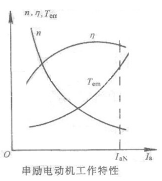

# 电机与拖动

吴继伟 Z638 wujiwei@tongji.edu.cn

- 出勤 10%
- 作业 5%
- 阶段考核 20% MATLAB 仿真电机？
- 实验报告 20%
- 期末考试 45%

电机的分类：

- 变压器
    - 电力变压器
    - 特殊变压器
- 直流电机
    - 直流电动机
    - 直流发电机
- 交流电机
    - 同步电机
    - 异步电机
- 控制电机：自动控制系统中的执行元件、检测元件

学习要点：

1. 电路：电枢绕组
2. 磁路：不饱和与饱和
3. 机械特性：点磁力矩与转速
4. 能量转换与损耗

## 第一章 磁路

### 1.基本概念

电池、永磁体和电流线圈的相似性：电流场、磁场、电流场到磁场

磁通（Weber）

$$
\begin{aligned}
    & \Phi = \iint_{S} \vec{B} \cdot \mathrm{d} \vec{s}
\end{aligned}
$$

磁场强度和磁导率

$$
\left\{\begin{aligned}
    & B = \mu H \\
    & j = \sigma E
\end{aligned}\right.
$$

电导率和磁导率

真空中的磁导率 $\mu_{0} = 4\pi \times 10^{-7} \text{H/m}$，为常数，铁磁材料 $\mu \gg \mu_{0}$，不为常数。

### 2.磁路基本定律

电磁感应定律

$$
\begin{aligned}
    & \varepsilon = - \frac{ \mathrm{d} \Phi}{ \mathrm{d} t} \\
    & \varepsilon = \int_{L} \boldsymbol{v} \times \boldsymbol{B} \cdot  \mathrm{d}\boldsymbol{l}
\end{aligned}
$$

对于匝数为 $W$ 的线圈

$$
\begin{aligned}
    & \varepsilon = - N  \frac{ \mathrm{d} \Phi}{ \mathrm{d} t}
\end{aligned}
$$

电磁力定律（电能 ---> 机械能）

$$
\begin{aligned}
    & \boldsymbol{F} = \int_{L} I  \mathrm{d} \boldsymbol{l} \times \boldsymbol{B}
\end{aligned}
$$

电磁转矩

$$
\begin{aligned}
    & \boldsymbol{M} = \int_{L}  \mathrm{d} \boldsymbol{r} \times \boldsymbol{F}
\end{aligned}
$$

磁路欧姆定律

$$
\begin{aligned}
\left\{ \begin{aligned}
    & F = \Phi R_{m} \\
    & R_{m} = \frac{l}{\mu A}
\end{aligned} \right. &&
\left\{ \begin{aligned}
    & V = IR \\
    & R = \frac{l}{\sigma A}
\end{aligned} \right.
\end{aligned}
$$

- $R_{m}$ 磁阻
- $F$ 磁通势 $F = Ni$ 等于匝数乘电流

磁路的 Kirchoff 定律

$$
\begin{aligned}
    & \sum_{S} \Phi = 0 \\
    & \sum_{L} \Phi \Delta R_{m} = \sum_{L} H \Delta l = 0
\end{aligned}
$$

在集总元件模型中，电压降在元件上；但是在磁路中，要考虑**每一段磁路**上的磁压降。

安培环路定律

$$
\begin{aligned}
    & \oint_{L} \boldsymbol{H}  \cdot \mathrm{d} \boldsymbol{l} = \sum_{S} i \\
    & \Phi R_{m} = Ni = F
\end{aligned}
$$

可以看出安培环路定律和磁路欧姆定律是统一的。

磁路和电路的区别：

1. 功率损耗：磁路中不损耗功率
2. 绝缘性质：没有绝对的磁绝缘体，总会存在空气中的漏磁通
3. \*导率：磁导率随着铁心的饱和程度变化
4. 线性与非线性：磁导率随着磁场大小变化，不能应用叠加原理

### 3.铁磁材料

铁钴镍及合金

起始磁化曲线

磁滞回线

磁化后回到原来没有磁场的状态，铁磁性材料中仍会存在磁场，表现出滞后状态；只有加上反向外磁场才会回归为 0.

- 硬磁材料：磁滞回线宽，剩磁 $B_{r}$ 多，矫顽力 $H_{c}$ 大；
- 软磁材料：磁滞回线窄，剩磁 $B_{r}$ 小，矫顽力 $H_{c}$ 小。

软磁材料（铜片、铸铁、铸铜）用于做变压器铁芯，硬磁材料（稀土材料，钕铁硼）用于做永磁铁。

铁心损耗：

- 磁滞损耗 理论和经验公式：

$$
\begin{aligned}
    & P_{h} = fV \oint H  \mathrm{d} B \\
    & P_{h} = C_{h} f B_{m}^{n} V
\end{aligned}
$$
- 涡流损耗：磁感应强度变化因此涡流产生焦耳热；通过防止形成回路、增加回路电阻来减小。

$$
\begin{aligned}
    & P_{e} = C_{e} \Delta^{2} f^{2} B_{m}^{2} V
\end{aligned}
$$

$\Delta$ 为钢片厚度。变压器的铁心可以看作一个电阻随频率正相关的电子元件，频率为 0（直流电）时电阻为 0。

### 4.直流磁路的计算

正问题：已知磁路中磁通求解励磁电流。

分段考虑磁感应强度 $B$，查表得知磁场强度 $H$，根据欧姆定律求解 $F$，除以匝数得到励磁电流。

### 5.交流磁路的计算

每一个时刻可以通过直流磁路的计算方法计算。

除了铁心损耗，还有两个效应：

1. 交流磁通量随时间变化，引起感应电动势与励磁电流反向。
2. 磁饱和现象会导致励磁电流、磁通和电动势波形的畸变。

## 第三章 变压器

### 1.变压器的工作原理、分类及结构

分类

- 双绕组：一次绕组和二次绕组
- 自耦：一次绕组和二次绕组组合为一个绕组
- 三绕组：三个不同电压的线路
- 多绕组：分裂变压器

结构

- 铁心
    - 软磁材料，电阻大：减少涡流损耗和磁滞损耗
- 绝缘绕组

- 散热油箱
- 绝缘套管
- 开关
- 散热器
- 继电保护装置

三相：容量和相电压、相电流或者线电压、线电流之间的关系：

$$
S_{N} = \sqrt{3} I_{N} U_{N}
$$

工作原理

习惯正方向：

1. 电压电流取关联方向；
2. 电流和磁通量满足右手螺旋定则；
3. 感应电动势方向和磁通对应的电流正方向一致。

对于理想变压器：

1. 不考虑一二次绕组和变压器损耗
2. 不考虑漏磁

为什么二次绕组侧的电压和电流反向？

因为这里将二次侧视作电源。

$$
\begin{aligned}
    & e_{1} = - N_{1} \frac{\mathrm{d} \Phi}{\mathrm{d} t} \\
    & e_{2} = - N_{2} \frac{\mathrm{d} \Phi}{\mathrm{d} t} \\
    & u_{1} = - e_{1} = N_{1} \frac{ \mathrm{d} \Phi}{ \mathrm{d}t} \\
    & u_{2} = e_{2} = - N_{2} \frac{ \mathrm{d} \Phi}{ \mathrm{d}t} \\
    & \frac{\dot{U}_{1}}{N_{1}} = \frac{\dot{U}_{2}}{N_{2}}
\end{aligned}
$$

### 2.单相变压器的空载运行

考虑漏磁，下标为 $\delta$. 二次绕组开路。

**感应电动势和电压降是反方向的**。感应电动势的箭头指的是电源内部电场的方向。

$$
\begin{aligned}
    u_{1} &= i_{0} R_{1} + (-e_{1}) + (-e_{1\delta}) = i_{1} R_{1} + N_{1} \frac{\mathrm{d}\Phi_{1\delta}}{\mathrm{d}t} + N_{1}\frac{\mathrm{d}\Phi_{m}}{\mathrm{d} t} \\
    u_{2} &= e_{2} = -N_{2} \frac{\mathrm{d}\Phi_{m}}{\mathrm{d} t}
\end{aligned}
$$

一、理想分析

考虑主磁通为正弦变化的。

$$
\begin{aligned}
    & \Phi_{m} = \Phi_{0} \sin \omega t \\
    & e_{1} = - N_{1} \frac{\mathrm{d} \Phi}{\mathrm{d} t} = \omega \Phi_{0} \sin \left(\omega t - \frac{\pi}{2}\right)
\end{aligned}
$$

感应电动势滞后于主磁通的变化 $\dfrac{\pi}{2}$ 的相位。

$$
\left\{ \begin{aligned}
    & \dot{E}_{1} = \frac{E_{1m}}{\sqrt{2}} = -j \sqrt{2}\pi f N_{1} \dot{\Phi}_{m} \\
    & \dot{E}_{2} = \frac{E_{2m}}{\sqrt{2}} = -j \sqrt{2}\pi f N_{2} \dot{\Phi}_{m}
\end{aligned} \right.
$$

忽略一次绕组阻抗和漏电动势

$$
\left\{ \begin{aligned}
    & \dot{U}_{1} = - \dot{E}_{1} = j \sqrt{2} \pi f N_{1} \dot{\Phi}_{m} \\
    & \dot{U}_{2} = \dot{E}_{2} = -j \sqrt{2} \pi f N_{2} \dot{\Phi}_{m}
\end{aligned} \right.
$$

对于输入电压，一次绕组超前于主磁通，二次绕组落后于主磁通。

空载时无二次绕组对变压器内部磁场的影响，在一次绕组回路中，变压器可以看作一个非线性的感性元件。

$$
\begin{aligned}
    & \phi = f(i) \\
    & \phi(t) = f[i(t)]
\end{aligned}
$$

由于磁滞效应的影响，磁通和电流的关系将比单纯的非线性关系更复杂。

二、铁损分析

仍然简化电流为等效正弦波，考虑铁损。则输入电流可以看作两部分：

1. 有功电流：作为铁损功率 $p_{Fe}$ 的抵扣
2. 无功电流：建立磁场

$$
\begin{aligned}
    & I_{m} = \sqrt{I_{\mu}^{2} + I_{Fe}^{2}} \\
    & I_{Fe} = \frac{p_{Fe}}{E_{1}} \approx \frac{p_{Fe}}{U_{1}}
\end{aligned}
$$

通常 $I_{\mu}\gg I_{Fe}$，$\dot{I}_{m}, \dot{U}_{1}$ 的相量夹角接近 $90\degree$.

三、漏磁通分析

由于漏磁通通过的介质不是铁磁介质，因此漏磁通和一次绕组电流往往呈现线性关系

$$
E_{1\sigma} \propto \Phi_{1\sigma} \propto I_{m}
$$

漏电动势滞后于磁通相位为 $90\degree$，如果认为磁通和一次绕组电流同相，则可以构建漏电抗模型：

$$
\dot{E}_{1\sigma} = -j X_{1} \dot{I}_{m}
$$

漏电抗表征了漏磁对于一次绕组的电磁效应。

令

$$
\dot{Z}_{1} = R_{1} + j X_{1}
$$

为漏电抗，那么对于线圈有

$$
\left\{ \begin{aligned}
    & \dot{U}_{1} = \dot{I}_{m} \dot{Z}_{1} + (-\dot{E}_{1}) \\
    & \dot{U}_{20} = \dot{E}_{2}
\end{aligned} \right.
$$

四、综合考虑

相量图如下：

$$
\begin{aligned}
    & \dot{U} = \dot{I}_{m} Z_{1} + (-\dot{E}_{1})
\end{aligned}
$$

虽然是铁磁性材料，但是也可以在感应电动势和励磁电流之间建立参数关系

$$
- \dot{E}_{1} = \dot{I}_{m} Z_{m} = \dot{I}_{m} (R_{m} + j X_{m})
$$

### 3.单相变压器的基本方程式

### 4.变压器的等效电路和相量图

### 5.等效电路的参数测定

空载试验

### 6.三相变压器

### 7.变压器的稳态运行

### 8.自耦变压器和互感器

hw: 3-11,13,14,15,16

## 第二章 直流电机

### 1.直流电机概述

冷却方式：

- 自动冷却：风扇和转轴固定
- 强制冷却：风扇外接电源

直流电机的磁阻大于变压器，因此产生相同的磁通，直流电机需要的励磁电流更大。

铭牌数据：

- 额定功率 $P_{N}$：电机的**输出**功率 单位：W/kW/HP(horse power) $1 \text{HP} = 0.7 \text{kW}$
- 额定电压 $U_{N}$：电枢出线端的电压
- 额定电流 $I_{N}$：在额定功率、额定电压下电枢的电流
- 额定转速 $n_{N}$：额定状态转子转速 单位：r/min(rpm)
- 额定励磁电流 $I_{fN}$ 额定励磁电压 $U_{fN}$

---

### 2.直流电机基本工作原理

结构：

- 主磁极：电磁铁 + 励磁线圈
    - 个数一定是偶数，北极南极交替出现
- 换向极
- 电刷装置
- 电枢铁心
- 电枢绕组
- 换向器

专有名词阐述：

- 线圈：一组成对的导线条，两端连在换向器的换向片上
- 元件：吃饱了撑的定义，和线圈是一个东西
    - 但是只有通过了轴线，这一个元件的感应电动势才能最大，对于机电转换才更有利
- 跨距：元件的两个边之间的角距离
- 极距：每个主磁极的所占的圆弧长度 $\tau$
    - 上面的情况就是说：跨距等于极距
- 线圈的（第一）节距 $y_{1}$
- 换向器的节距 $y_{c}$ 线圈的两端连接的换向片的距离
- 单双层绕组：每一个槽里面放几个元件
    - 上面的情况家是说：双层绕组
- 槽数 $O$
- 磁极对数 $p$
- 单叠绕组电枢支路对数 $a: a = p$
- 换向器上换向片的个数 $K$
- 线圈（元件）数量 $S$ （8 根就是 4）

---

单叠绕组

应用场景：绕组电流大，电压较低，大中型直流电机（因为电枢支路多）

$$
\begin{aligned}
y_{1} &= \tau = \frac{O}{2P} \\
y_{c} &= \pm 1 \\
S &= K
\end{aligned}
$$

以 $2p = 4, S = K = 16$ 为例：

---

单波绕组：连接起来的元件像波浪一样向前延伸。

应用场景：小型直流电机，电压较低直流电机（因为电枢支路多）

把相邻大约两个极距将在磁场中相对位置差不多的元件连接起来。

$$
\begin{aligned}
py_{c} &= K \mp 1 \\
a &= 1
\end{aligned}
$$

以 $2p = 4, S = K = 15$ 的单波绕组为例

---

单叠绕组中，上层边处于同一磁极下的元件构成一条支路；单波绕组中，上层边处于同一极性的所有磁极下的元件构成同一支路。

---

### 3.直流电机电路磁路分析

励磁电流和电枢电流的关系：

- 他励：励磁电流独立于电枢电流
- 并励：励磁电流和电枢电流并联，同时掉电。
- 串励：励磁电流和电枢电流串联，负载小的时候电流小，磁场也小；否则反之。
- 复励：兼具并励和串励。
    - 串入的线圈匝数少，电阻小，不影响电枢回路电流
    - 并联的线圈匝数多，电阻大。

---

直流电机的空载磁场：由励磁电动势单独建立的磁场。电枢电流很小或者为 0.

对于空载磁场，极靴下的磁场可以近似为方波。

---

电枢反应：由于电枢中电流产生磁场，叠加到空载磁场上形成畸变。

对于一对元件，产生的磁动势类似方波。对于多个元件，电枢反应磁动势类似于三角波。阶梯级数等于 $\dfrac{S}{2p}$

三角波的幅值

$$
F_{ax} = i_{a} N_{y} \frac{S}{2p} = \frac{Ni_{a}}{\pi D_{a}} \cdot \frac{\tau}{2}
$$

为了抵扣这种电枢磁场，可以添加补偿绕组。

---

电枢反应的三角波作用于空载磁场上：

1. 负载时气隙磁场发生了畸变，对电动机来说，磁场逆着转子旋转方向转过小角度 $\alpha$
2. 由于磁路的饱和作用，磁场增加不如磁场减小多，因此呈现去磁作用，影响电机运行。

---

### 4.直流电动机的运行

**电动势和转速**

考察一个线圈磁通从 $\Phi$ 变成 $-\Phi$ 所需的时间

$$
\Delta t = \frac{\frac{2\pi}{2p}}{\frac{2\pi n}{60}} = \frac{30}{pn}
$$

一个匝数为 $N_{y}$ 的线圈的感应电动势平均值

$$
\begin{aligned}
E_{a} &= \frac{1}{\Delta t} \int_{0}^{\Delta t} e_{a} \mathrm{d} t \\
&= \frac{1}{\Delta t} \int_{\Phi}^{- \Phi} - N_{y} \mathrm{d} \Phi\\
&= \frac{2N_{y}\Phi}{\Delta t} \\
&= \frac{N_{y}p}{15} \Phi n
\end{aligned} 
$$

有 $S$ 个元件，$a$ 对支路，则一条支路上的电动势???

$$
\begin{aligned}
E_{a} &= \frac{N_{y}p}{15} \cdot \frac{S}{2a} \Phi n
\end{aligned}
$$

绕组的全部有效导体数 $Z = 2SN_{y}$

$$
\begin{aligned}
E_{a} &= \frac{N_{y}p}{15} \frac{S}{2a} \Phi n \\
&= \frac{pZ}{60a} \Phi n \\
&= C_{e} \Phi n && \left(C_{e} = \frac{pZ}{60a}\right) \\
&= C_{T} \Phi \Omega && \left(C_{T} = \frac{pZ}{2\pi a}\right)
\end{aligned}
$$

给定电机，称 $C_{e}$ 为电动势常数。

如果还知道励磁电流和磁通的关系

$$
\begin{aligned}
\Phi &= K_{f} I_{f} \\
E_{a} &= C_{e} K_{f} I_{f} n \\
&= C_{e} K_{f} I_{f} \left(\frac{60}{2\pi} \Omega\right) \\
&= G_{af} I_{f} \Omega && \left(G_{af} = \frac{60}{2\pi}C_{e}K_{f} = C_{T}K_{f} \right)
\end{aligned}
$$

---

**转矩和电流**

设气隙某处径向磁感应强度为 $B_{\delta x}$ （考虑电枢反应）

$$
\begin{aligned}
F_{x} &= N_{y} i_{a} l B_{\delta x}
\end{aligned}
$$

电枢表面 $\mathrm{d} x$ 上存在导体数量为

$$
\frac{2S}{\pi D_{a}} \mathrm{d} x
$$

因此总力矩

$$
\begin{aligned}
T_{e} &= \int \frac{D_{a}}{2} F_{x} \left( \frac{2S}{\pi D_{a}} \mathrm{d} x \right) \\
&= \int \frac{D_{a}}{2} \cdot N_{y} i_{a} l B_{\delta x} \cdot \frac{2S}{\pi D_{a}} \mathrm{d} x \\
&= \int \frac{1}{\pi} SN_{y} i_{a} B_{\delta x} l \mathrm{d} x \\
&= \int \frac{1}{\pi} \frac{Z}{2} \frac{I_{a}}{2a} B_{\delta x} l \mathrm{d} x && (Z = 2SN_{y},  I_{a} = 2ai_{a}) \\
&= \frac{Z}{4\pi a} I_{a} \int B_{\delta x} l \mathrm{d} x
\end{aligned}
$$

$$
\int B_{\delta x} l \mathrm{d} x = 2p \Phi
$$

因此

$$
\begin{aligned}
T_{e} &= \frac{pZ}{2\pi a} \Phi I_{a} \\
&= C_{T} \Phi I_{a}
\end{aligned}
$$

注意到能量是不灭的。

$$
\begin{aligned}
& \left\{ \begin{aligned}
E_{a} &= C_{T} \Phi \Omega \\
T_{e} &= C_{T} \Phi I_{a}
\end{aligned} \right. \\
& E_{a} I_{a} = T_{e} \Omega
\end{aligned}
$$

---

并励电机

电枢

$$
\begin{aligned}
    & u_{a} = G_{af} i_{f} \Omega + R_{a} i_{a} + L_{a} \frac{\mathrm{d} i_{a}}{\mathrm{d} t} \approx G_{af} i_{f} \Omega + R_{a} i_{a}
\end{aligned}
$$

如果作为发电机，则电流方向变化：

$$
u_{a} = G_{af} i_{f} \Omega - R_{a} i_{a} - L_{a} \frac{\mathrm{d}i_{a}}{\mathrm{d}t}
$$

励磁

$$
u_{f} = R_{f} i_{f} + L_{f} \frac{\mathrm{d}i_{f}}{\mathrm{d} t} \approx R_{f} i_{f}
$$

机械

$$
\begin{aligned}
T_{em} &= T_{2} + T_{0} + J \frac{\mathrm{d} \Omega}{\mathrm{d} t} \\
& \approx T_{2} + T_{0}
\end{aligned}
$$

- $T_{2}$ 输出负载转矩
- $T_{0}$ 空载转矩：描述机械摩擦耗散和铁损

对于发电机

$$
\begin{aligned}
T_{1} &= T_{em} + T_{0} + J \frac{\mathrm{d} \Omega}{\mathrm{d} t} \\
& \approx T_{em} + T_{0}
\end{aligned}
$$

---

考察并励直流电动机的能量耗散：

$$
\begin{aligned}
P_{1} &= U(I_{f} + I_{a}) \\
&= UI_{f} + I_{a}(I_{a} R_{a} + 2 \Delta U_{c} + E_{a}) \\
&= p_{Cuf} + p_{Cua} + p_{c} + P_{em}
\end{aligned}
$$

- Cuf 励磁铜耗
- Cua 电枢铜耗
- c 电刷接触电阻

$$
\begin{aligned}
P_{em} &= T_{em} \Omega \\
&= (T_{2} + T_{0}) \Omega \\
&= P_{2} + p_{0} \\
&= P_{2} + p_{Fe} + p_{mech}
\end{aligned}
$$

- Fe 铁损
- mec 机械损耗

直流电动机的工作特性：额定状态（电压、电流）下转速、转矩、效率和输出功率之间的关系。

$$
\begin{aligned}
    & U_{a} = E_{a} + R_{a} I_{a} \\
    & U_{f} = R_{f} I_{f} \\
    & E_{a} = C_{e} \Phi n = C_{T} \Phi \Omega \\
    & T_{em} = C_{T} \Phi I_{a} \\
    & P_{em} = E_{a} I_{a} = T_{em} \Omega = \frac{2\pi}{60} T_{em} n
\end{aligned}
$$

---

**并励电机**

转速特性：转速随电枢电流（转矩）的增大而线性减小（理想）

$$
n = \frac{U}{C_{e}\Phi} - \frac{R_{a}}{C_{e}\Phi} I_{a} = n_{0} - \beta' I_{a}
$$

转矩特性

$$
T_{em} = C_{T} \Phi I_{a} = C_{T}'I_{a}
$$

效率特性

$$
\eta = \frac{P_{2}}{P_{1}} = \left[ 1 - \frac{p_{Fe} + p_{mec} + p_{Cuf} + p_{Cua} + I_{a}^{2}R_{a} + 2I_{a} \Delta U_{c}}{U_{a}(I_{a} + I_{f})} \right] \times 100\%
$$

如果不考虑**附加损耗**（什么是附加损耗下一片会讲），对于一般的直流电机 $I_{fN} \ll I_{N}$，因此忽略 $(I_{a} + I_{f})$ 为 $I_{a}$。

$$
\begin{aligned}
\frac{\mathrm{d}\eta}{\mathrm{d}I_{a}} &= - \frac{1}{U_{a}} \frac{\mathrm{d}}{\mathrm{d}I_{a}} \left( \frac{p_{Fe}+p_{mec}+p_{Cuf}}{I_{a}} + I_{a} R_{a} + 2 \Delta U_{c} \right) \\
&= - \frac{1}{U_{a}} \left( -\frac{p_{Fe}+p_{mec}+p_{Cuf}}{I_{a}^{2}} + R_{a} \right) \\
I_{a}^{2}R_{a} &= p_{Fe} + p_{mec} + p_{Cuf}
\end{aligned}
$$

---

对电动机损耗的系统讨论：

- 铜耗（或铝耗）随电枢电流变化
    - 电枢回路铜耗 $p_{Cua}$，包括电枢电阻焦耳热，串励线圈焦耳热，补偿绕组（如果有的话）焦耳热。
    - 励磁回路铜耗 $p_{Cuf}$，一般指并励绕组的焦耳热
    - 电刷接触损耗 $2 \Delta U_{c} I_{a}$，电刷通电放热（不是线性电阻）
        - 石墨电刷 $2 \Delta U_{c} = 2 \text{V}$
        - 金属石墨电刷 $2 \Delta U_{c} = 0.6 \text{V}$
- 铁耗：恒定损耗（详见[交流磁路的计算](#5.交流磁路的计算)）
    - 涡流损耗
    - 磁滞损耗
- 机械损耗：恒定损耗
- 附加损耗（$p_{\Delta}$）：其他的不能量化的损耗（绷不住了）
    - 电枢齿槽
    - 电枢反应
        - 如果有补偿绕组，$p_{\Delta} = 0.5 \% P_{N}$
        - 如果没有，$p_{\Delta}= 1\% P_{N}$

---

**串励电机**

$$
\begin{aligned}
n &= \frac{U - I_{a}(R_{a} + R_{f})}{C_{e}\Phi} && (I_{f} = I_{a}) \\
&= \frac{U - I_{a} (R_{a} + R_{f})}{C_{e}K_{f}I_{a}} && (\Phi = K_{f} I_{f}) \\
&= \frac{U}{C_{e}'I_{a}} - \frac{R_{a}'}{C_{e}'} && (C_{e}' := C_{e} K_{f}, R'_{a} := R_{a} + R_{f})
\end{aligned}
$$

$$
\begin{aligned}
T_{em} &= C_{T} \Phi I_{a} \\
&= C_{T} K_{f} I_{a}^{2} \\
&= C'_{T} I_{a}^{2} && (C'_{T} := C_{T} K_{f})
\end{aligned}
$$

注意到在空载情况下，理论上 $n \rightarrow \infty$，因此串励电动机不允许低负载运行。

串励电动机的优势在于电磁转矩随着电枢电流的二次方增加，适合于电机的启动。

---

**复励电机**

- 积复励：串联绕组和并联绕组的磁场叠加
- 差复励：串联绕组和并联绕组的磁场相消

积复励可以综合串励和并励的优势。

---

例题：他励直流电机在额定状态下工作（$P_{N}, U_{N}, I_{N}, n_{N}, R_{a}$），突然在电枢绕组中串联接入电阻 $R_{\Omega}$，负载不变的情况下求串联接入瞬间和稳态时电枢电流和转速。

- 串联接入瞬间

由于转子惯性

$$
n_{1} = n_N 
$$

由于电网端电压不变，因此

$$
I_{a1} = \frac{U_{N}-2\Delta U_{c} - C_{e}\Phi n_{N}}{R_{a}+R_{\Omega}} = I_{N} \frac{R_{a}}{R_{a}+R_{\Omega}}
$$

- 稳态

由于负载不变

$$
I_{a2} = I_{N}
$$

$$
\begin{aligned}
n_{2} &= \frac{U_{N} - I_{a2} (R_{a} + R_{\Omega}) - 2 \Delta U_{c}}{C_{e} \Phi} \\
&= n_{N} - \frac{I_{a2}R_\Omega}{C_{e} \Phi} \\
&= n_{N} \left( 1 - \frac{I_{N}R_{\Omega}}{U_{N} - I_{N}R_{a} - 2 \Delta U_{c}} \right)
\end{aligned}
$$

---

例题：和上一片一样的电动机工作在额定状态，减少励磁电流使得 $\Phi$ 变为 $\alpha \Phi$，保持负载不变求解稳态电枢电流和转速。

$$
\begin{aligned}
C_{T} \Phi I_{N} &= C_{T} \alpha \Phi I_{a3} \\
I_{a3} &= \frac{I_{N}}{\alpha} \\
n_{3} &= \frac{U_{N} - I_{a3} R_{a} - 2 \Delta U_{c}}{C_{e} \alpha \Phi} \\
&= \frac{n_{N}}{\alpha} \frac{U_{N} - \frac{1}{\alpha} I_{N} R_{a} - 2 \Delta U_{c}}{U_{N} - I_{N} R_{a} - 2 \Delta U_{c}}
\end{aligned}
$$

转速基本上和磁通成反比，因此**在电机启动之前一定要先上磁**！

---

### 5.直流发电机的运行

空载特性（$I_{a} = 0$）

- 他励发电机

$$
\begin{aligned}
U &= C_{T} \Omega \Phi - 2 \Delta U_{c} \\
&= C_{T} \Omega f(I_{f}) - 2 \Delta U_{c} \\
& \approx K f (I_{f})
\end{aligned}
$$

和磁化曲线形状类似。

- 自励发电机（并励）
    - 磁体必须有剩磁，不然无法放大
    - 励磁绕组产生的磁场必须和剩磁一致
    - 励磁绕组电阻不能太大，不然稳定状态下的磁场太小

---

## 第四章 三相异步电动机

涵盖了第五章的三相异步电动机运行原理部分

### 1.三相异步电机的工作原理和结构

**旋转磁场**

可以通过如图所示的三相绕组定子形成旋转磁场。

其中 AX, BY, CZ 是连接成回路的导条，一个进去一个出来。电流关系：

$$
\left\{ \begin{aligned}
i_{A} &= I_{m} \cos \omega t \\
i_{B} &= I_{m} \cos \left(\omega t - \frac{2\pi}{3}\right) \\
i_{C} &= I_{m} \cos \left(\omega t + \frac{2\pi}{3}\right)
\end{aligned} \right.
$$

磁场旋转方向是从 A 到 B 到 C，逆时针方向。和电流相位增加的方向一致。磁场的转速

$$
\omega_{s} = 2\pi n_{s} = \omega = 2\pi f_{1}
$$

---

如果电子绕组更加复杂，多绕几圈，如下图所示：

A-X-A'-X', B-Y-B'-y', C-Z-C'-Z'

$$
\omega_{s} = 2\pi n_{s} = \frac{\omega}{p} = \frac{2\pi f_{1}}{p}
$$

$p$ 为磁极对数。可以这样理解：当电流变化了一个周期时，原来在 $A$ 上面的磁场转到了 $A'$ 的下面，刚好转了 $180 \degree$. 因此磁场转速和磁极对数成反比。

---

**旋转磁场驱动作用**

旋转磁场首先产生转子线圈中的磁通变化率，形成感应电动势，形成感应电流，在磁场作用下受力转动，带动负载。

> [!help]
> 解答一下自己脑子不清楚的疑问：
>
> 转子跟不上旋转磁场，后面转到磁场方向相反的位置，会不会受到的力也相反，导致不能持续地提供一个恒定方向的力？
> 
> 不是这样的。因为异步电机具有对称性（这个图片就表现了所有的普遍情况，磁极对数为 2 时）。转子只是一个电阻，所有电流都是此刻的结构切割磁力线产生的。受到的力一定是同一个方向。转到相反位置时候，电流也会**适时地**反向，导致力矩和之前同向。

---

线圈具有维持自身磁通量不变的惯性，但这种惯性是胁迫的，被动的。因此不一定转速能追上旋转磁场的转速。定义转差率

$$
s = \frac{n_{s} - n}{n_{s}} \times 100 \%
$$

- $n_{s}$ 旋转磁场转速
- $n$ 转子实际物理转速

> [!example]
> 实际数据：空载转差率 0.5%，满载转差率 5%，额定转差率 3%.

---

- 电动机：$0 < n < n_{s}$
- 发电机：$0 < n_{s} < n$
- 反接制动：$n < 0 < n_{s}$

总之始终具有保持自身磁通不变的惯性。

---

**结构**

- 定子
    - 定子铁心是导磁性能较好的软磁性材料，能够减少变化磁场在其中产生的磁滞损耗和涡流损耗
    - 定子绕组放在定子铁心开的槽里面，有开口槽、半开口槽和半闭口槽三种
- 转子
    - 转子铁心：和定子铁心相似
    - 转子绕组分为笼型和绕线转子绕组
        - 笼型：就是直接把导条的两端用导体连接起来，看起来像笼子
        - 绕线转子：可以在转子回路中接入附加电阻和其他控制装置
- 气隙
    - 气隙大：磁阻大，减少谐波分量，减少附加损耗，改善启动性能；便于安装
    - 气隙小：磁阻小，励磁电流小，功率因数 $\cos \varphi$ 更接近 1

---

### 2.三相异步电机的铭牌数据

- 额定功率
- 额定电压
- 额定电流
- 额定频率
- 额定转速
- 定子绕组相数与联结法（星型、三角形）

---

### 3.三相异步电机的定子绕组

定子绕组的分类：

- 相数
    - 单相
    - 二相
    - 三相
    - 多相
- 槽内层数
    - 单层
    - 双层
    - 单双层混合
- 绕组端接的形状
    - 单层
        - 同心式
        - 链式
        - 交叉式
    - 双层
        - 叠
        - 波
- 每极每相槽数
    - 整数槽
    - 分数槽

---

**交流绕组**

$$
\text{电角度} = p \times \text{机械角度}
$$

机械角度每转过一个极距，电动势变化一个周期，视为转过了一个电角度。

组成交流绕组的单元是线圈。

节距 $y_{1}$：一个线圈的两个边所跨定子的距离（槽数大小）节距和极距接近

- 整距绕组 $y_{1} = \tau$
- 短距绕组 $y_{1} < \tau$
- 长距绕组 $y_{1} > \tau$

槽距角：相邻槽之间的电角度之差

$$
\alpha = p \cdot \frac{2\pi}{Q_{1}} \text{（机械角度）} = \frac{p \times 360 \degree}{Q_{1}}
$$

极距

$$
\tau = \frac{Q_{1}}{2p}
$$

每极每相槽数，相数 $m = 3$

$$
q = \frac{Q_{1}}{2pm}
$$

---

> [!abstract]
> 在这个图中：
> 
> 极数 $p$ 指的是有 $p$ 对磁极，磁场周期变化 $p$ 次
> 
> 相数指的是每一个磁极中有几个导线，对于我们研究的三相异步电机 $m=3$ 是定值，意味着每个用磁场线圈起来的区域中有 3 个导条。
> 
> 节距等于极距，节距指的是穿线的两端的距离，极距指的是两个相邻磁极之间的距离（A-X）
> 
> 槽距角：线圈转过一个槽以后，电角度的变化
> 
> 每极每相槽数：一个导条对应的槽数，就是一个字母对应的槽数

---

**交流绕组的排列和连接**

> [!question]
> 知道了电机定子上有多少个槽，是三相电机，以及极数 $p$，该如何连接定子绕组呢？

首先要知道每一相内部的导条怎么连接。通过计算极距 $\tau = \dfrac{Q_{1}}{2p}$ 得到每隔 $\tau - 1$ 个导条，将导条像缝衣服一样接起来。

其次要确定相带：说人话就是上面第一步的一个导条占用了几个槽,，就是计算每极每相槽数 $\dfrac{Q_{1}}{2pm}$. 根据计算的值划分相带。

> [!example] 当 $Q_{1} = 24, 2p = 4, m = 3$ 时的示例如下：
> 
> $$
\frac{Q_{1}}{2pm} = 2 $$
> 
> 

---

## 第五章 单相异步电动机

---

## 第六章 同步交流电机

---

## 第八章 拖动系统动力学基础

### 1.拖动系统的运动方程式

**单轴电力拖动系统**

直线运动

$$
\begin{aligned}
F - F_{z} &= m \frac{\mathrm{d}v}{\mathrm{d}t} \\
Fv - F_{z}v &= \frac{\mathrm{d}}{\mathrm{d}t} \left( \frac{1}{2} mv^{2} \right)
\end{aligned}
$$

旋转运动

$$
\begin{aligned}
T - T_{z} &= J \frac{\mathrm{d}\Omega}{\mathrm{d}t} \\
T \Omega - T_{z} \Omega &= J \frac{\mathrm{d}}{\mathrm{d}t} \left( \frac{1}{2} J \Omega^{2} \right)
\end{aligned}
$$

转动惯量的计算

$$
\begin{aligned}
J = mr^{2} &= \frac{GD^{2}}{4g} \\
T - T_{z} &= \frac{GD^{2}}{4g} \frac{2\pi}{60} \frac{\mathrm{d}n}{\mathrm{d}t} \\
& \approx \frac{GD^{2}}{375 \text{m/s}^{2}} \frac{\mathrm{d}n}{\mathrm{d}t}
\end{aligned}
$$

> [!tip]
> $GD^{2}$ 被称为飞轮惯量。

---

### 2.多轴系统的折算

将所有的负载折算为等效负载 $T_{z}$ 和等效转动惯量 $J$.

功率不变原则：

$$
\begin{aligned}
T_{z} \Omega &= T_{zf} \Omega_{z} \\
\prod j &:= \frac{\Omega}{\Omega_{z}} \\
T_{z} &= \frac{T_{zf}}{\prod j}
\end{aligned}
$$

动能不变原则：

$$
\begin{aligned}
\frac{1}{2} J \Omega^{2} &= \frac{1}{2} J_{0} \Omega^{2} + \sum_{i=1}^{n}\frac{1}{2} J_{i} \Omega_{i}^{2}  \\
J &= J_{0} + \sum_{i=1}^{n} \frac{J_{i}}{\prod_{k=1}^{i}j_{k}}
\end{aligned}
$$

飞轮惯量也是一样的。

---

对于含有直线运动的传动机构，仍然应用：

- 传送功率不变 $T_{z} \Omega = F_{z} v_{z}$
- 动能不变 $\frac{1}{2} J \Omega^{2} = \frac{1}{2} m_{z}v_{z}^{2}$

再根据奇奇怪怪的单位制换算就好了。

---

### 3.传动机构损耗的折算

机械结构存在损耗，传动效率不为 1.

$$
\begin{aligned}
T_{z} \Omega &= T_{zf} \Omega_{z} / \eta_{c} \\
T_{z} &= \frac{T_{zf}}{j\eta_{c}}
\end{aligned}
$$

---

阻转矩与转速关系：

- 反抗性恒定阻转矩（摩擦力）$T_{z} = T \mathrm{sgn} (\Omega)$
- 位能性恒定阻转矩（保守力）$T_{z} = T$
- 湍流阻转矩（通风机负载：空气、水、油）$T_{z} = K \Omega^{2}$
- 恒定功率阻转矩（）$T_{z} = \dfrac{P_{z}}{\Omega}$

---

### 4.生产机械的负载转矩特性

---

## 第九章 直流电动机的电力拖动

---

### 1.直流电机机械特性

不考虑空载转矩

$$
n = \frac{U}{C_{e}\Phi} - \frac{R_{a}}{C_{e}C_{T}\Phi^{2}} T_{2}
$$

对于不同的参数 $U, \Phi$，可以产生不同的 $n \sim T_{2}$ 曲线，对应不同的工作状态。

---

理想空载转速

$$
n_{0} = \frac{U}{C_{e}\Phi}
$$

实际空载转速

$$
n_{0}' = \frac{U}{C_{e}\Phi} - \frac{R_{a}}{C_{e}C_{T}\Phi^{2}}T_{0}
$$

转速降（相比理想空载转速）

$$
\Delta n = \frac{R_{a}}{C_{e}C_{T}\Phi^{2}} T = \beta T
$$

额定转速变化率

$$
\Delta n_{N} = \frac{n_{0}-n_{N}}{n_{N}} \times 100 \%
$$

上翘现象：在负载较大的时候，励磁电流较大，磁路饱和，产生去磁作用，磁场比预想低，转速上升，相比直线产生上翘。

- 固有机械特性：输入额定电压和额定状态的磁通，电枢不串联电阻时的机械状态。
- 人为机械特性：不是固有状态的机械特性。

---

> [!help] 如何找到固有机械特性？

找到两个点，绘制直线。

- 额定点 $T_{N} = \dfrac{P_{N}}{\Omega_{N}}$
- 理想空载点

$$
\begin{aligned}
n_{0} &= \frac{U_{N}}{C_{e}\Phi_{N}} \\
C_{e}\Phi_{N} &= \frac{E_{N}}{n_{N}} = \frac{U_{N} - I_{N} R_{a}}{n_{N}} \\
R_{a} &= \left( \frac{1}{2} \sim \frac{2}{3} \right) \frac{U_{N}I_{N}-P_{N}}{I_{N}^{2}}
\end{aligned}
$$

---

串联电枢电阻的人为机械特性：

$$
n = \frac{U_{N}}{C_{e}\Phi_{N}} - \frac{R_{a}+R_{\Omega}}{C_{e}C_{T}\Phi^{2}_{N}} T
$$

直线下降变快。

改变输入电压的人为机械特性：

$$
n = \frac{U}{C_{e}\Phi_{N}}- \frac{R_{a}}{C_{e}C_{T}\Phi_{N}^{2}} T
$$

产生一系列平行的机械特性。

减弱励磁的人为机械特性：

$$
n = \frac{U_{N}}{C_{e}\Phi} - \frac{R_{a}}{C_{e}C_{T}\Phi^{2}} T
$$

理想空载转速增大，下降变快。启动电流不变，但是启动转矩变小。

---

> [!attention] 稳定工作点和不稳定工作点

对于理想曲线（无上翘）情况上的任意一点，都是稳定工作点，因为负载上升，转速会下降。在增大负载的一刻，转速不变，提供的转矩小于负载，因此会回到曲线上的新点。

对于实际曲线上有上翘的部分（斜率大于零），不是稳定工作点。因为在增大负载的一刻，转速不变，提供的转矩小于负载，转速会下降，不会回到曲线上的新点，会“憋死”。相反，如果减小负载，此刻提供的转矩大于负载，转速会上升，不会回到曲线上的新点，会不断加速，“飞车”。

---

### 2.他励直流电机起动

---

起动时转速为 0，如果直接上电，会产生大电流，很危险。

$$
I_{a} = \frac{U-E_{a}}{R_{a}} = \frac{U}{R_{a}}
$$

过载倍数：

$$
I_{a} \leq \lambda I_{N}
$$

足够大的启动转矩

$$
T_{st} \geq (1.1 \sim 1.2) T_{N}
$$

限制起动电流的措施：

1. 使用可调的输入电源
2. 初始时给电枢串联一个电阻

---

减压起动

- $T_{1}$ 不允许过载的最大转矩
- $T_{2}$ 切换电压时的转矩，保证此时也有一定的加速度
- $T_{L}$ 负载

在切换的瞬间，转速不变，图上点水平右移。

---

串联电阻起动

$(T_{1} - T_{2})$ 越大，切换的级数越少。

设计方法：

1. 绘制固有机械特性
2. 根据 $\lambda$ 确定 $T_{1}$
3. 选择合适的 $T_{2}$
4. 计算串联的电阻大小 $R_{\Omega i}$

每一级起动的比值一致 $\beta$

$$
\begin{aligned}
\beta &= \frac{I_{1}}{I_{2}} = \frac{T_{1}}{T_{2}} \\
\beta &= \frac{R_{m}}{R_{m-1}} = \cdots = \frac{R_{2}}{R_{1}} = \frac{R_{1}}{R_{a}} \\
\beta &= \sqrt[m]{\frac{R_{m}}{R_{a}}}
\end{aligned}
$$

如果起动级数 $m$ 已知，则：

1. 确定最大电流 $I_{1}$
2. 计算第一级电阻 $R_{m} = \dfrac{U_{N}}{I_{1}}$
3. 计算 $\beta$ 和每一级电阻

---

### 3.他励直流电机过渡过程

---

动态过程：机械惯性，电磁惯性，热惯性

> [!tip] 电磁惯性一般比机械惯性小得多。

对过渡过程的要求：

1. 缩短过渡时间，提高效率；
2. 减小过渡过程损耗，提高电动机利用率；
3. 改善运行情况，保证安全性。

在过渡过程中，可以将电流和转速的变化看作一阶过渡过程（RC 电路）。时间常数

$$
T_{tM} = \frac{GD^{2}(R_{a} + \sum R_\Omega)}{375C_{e}C_{T}\Phi^{2}}
$$

如果也考虑电磁惯性，则系统是一个二阶系统。

$$
\frac{\mathrm{d}^{2}n}{\mathrm{d}t^{2}} + \frac{1}{T_{ta}} \frac{\mathrm{d}n}{\mathrm{d}t} + \frac{1}{T_{tM}T_{ta}} n = \frac{1}{T_{tM}T_{ta}} n_{z}
$$

如果使用条件 $T_{ta} \ll T_{tM}$，那么方程就退化成一阶系统。

$$
T_{ta} = \frac{L_{a}}{R_{a}}
$$

---

### 4.他励直流电机制动

---

- 正向回馈制动：$U, n$ 同向，将电能回馈到电网
- 能耗制动：$U=0$
- 电枢反接制动：$U, n$ 反向

---

### 5.他励直流电机调速方法

---

### 6.直流电动机各种运转状态
