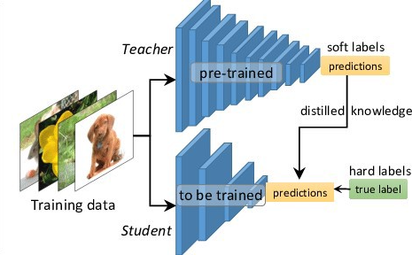

# 知识蒸馏

知识蒸馏（distill）是同时用真值和预训练网络（teacher）输出预测来监督待训练网络（student）输出的一种训练方式。

[Distilling the Knowledge in a Neural Network](https://arxiv.org/abs/1503.02531)

应用于参数太大的模型的压缩和迁移学习中。

损失函数：

$$
L(p_{stu}) = CE(y_{gt}, p_{stu}) + \alpha CE(p_{tea}, p_{stu})
$$
