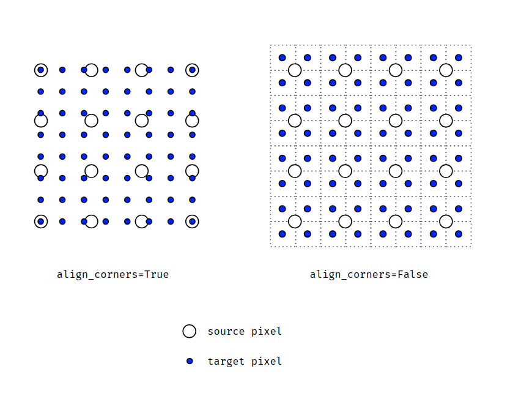

# Align Corners

针对 torch [官方文档](https://pytorch.org/docs/stable/generated/torch.nn.Upsample.html)中对 Upsample 类 ``align_corners`` 参数中不明不白的说明

```python
>>> input_3x3
tensor([[[[1., 2., 0.],
          [3., 4., 0.],
          [0., 0., 0.]]]])

>>> m = nn.Upsample(scale_factor=2, mode='bilinear')  # align_corners=False
>>> # Notice that values in top left corner are the same with the small input (except at boundary)
>>> m(input_3x3)
tensor([[[[1.0000, 1.2500, 1.7500, 1.5000, 0.5000, 0.0000],
          [1.5000, 1.7500, 2.2500, 1.8750, 0.6250, 0.0000],
          [2.5000, 2.7500, 3.2500, 2.6250, 0.8750, 0.0000],
          [2.2500, 2.4375, 2.8125, 2.2500, 0.7500, 0.0000],
          [0.7500, 0.8125, 0.9375, 0.7500, 0.2500, 0.0000],
          [0.0000, 0.0000, 0.0000, 0.0000, 0.0000, 0.0000]]]])

>>> m = nn.Upsample(scale_factor=2, mode='bilinear', align_corners=True)
>>> # Notice that values in top left corner are now changed
>>> m(input_3x3)
tensor([[[[1.0000, 1.4000, 1.8000, 1.6000, 0.8000, 0.0000],
          [1.8000, 2.2000, 2.6000, 2.2400, 1.1200, 0.0000],
          [2.6000, 3.0000, 3.4000, 2.8800, 1.4400, 0.0000],
          [2.4000, 2.7200, 3.0400, 2.5600, 1.2800, 0.0000],
          [1.2000, 1.3600, 1.5200, 1.2800, 0.6400, 0.0000],
          [0.0000, 0.0000, 0.0000, 0.0000, 0.0000, 0.0000]]]])
```

作如下补充（选自[讨论区](https://discuss.pytorch.org/t/what-we-should-use-align-corners-false/22663/20)）：



当 ``align_corners=True`` 时，插值算法将输入矩阵的四角视作新的矩阵的四角，直接带入 bilinear 公式，结果比较符合直觉。

当 ``align_corners=False(default)`` 时，插值算法认为输入矩阵的四角值是在图片模拟信号的四角像素的中间采样，新生成矩阵范围同样涵盖图片模拟信号的全部范围。这导致一个问题，当像素在输入矩阵采样点外面（即上图右图周围一圈的像素格子）时，没法使用 bilinear 公式插值。Torch 的做法是对角和边分类：

- 角上的值直接取最近的输入矩阵像素（即输入矩阵四角）的值
- 边上的值是将输入矩阵对应边作为源一维插值得到

顺便说一句，``Upsample`` 和 ``F.interpolate`` 函数似乎是一样的。
