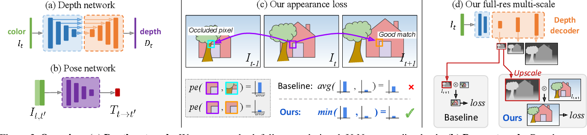

# Per-pixel minimum reprojection loss

这是论文 MonoDepth2 [Digging Into Self-Supervised Monocular Depth Estimation](https://www.semanticscholar.org/paper/Digging-Into-Self-Supervised-Monocular-Depth-Godard-Aodha/589cfcb2f995c94b0a98c902cc1f5e0f27cbd927?utm_source=direct_link) 的贡献一。它对 [photometric loss](../photometric-loss.md) 的计算方法做了改进：

传统的计算方法会分别计算通过 $I_{t-1}, I_{t+1}$ [warp](../warp.md) 结果 $I_{t-1 \rightarrow t}, I_{t+1 \rightarrow t}$

$$
L_{p} = \frac{1}{2} \left( L_{p}(I_{t-1 \rightarrow t}, I_{t}) + L_{p}(I_{t+1 \rightarrow t}, I_{t}) \right)
$$

本文方法：

$$
L_{p} = \mathrm{min} \left( L_{p}(I_{t-1 \rightarrow t}, I_{t}), L_{p}(I_{t+1 \rightarrow t}, I_{t}) \right)
$$

取最小值的依据是，遮挡的过程是单调的，那么如果 target frame 未遮挡，就不应该采用 $I_{t-1}, I_{t+1}$ 遮挡的某一帧，而应该采用未遮挡的另一帧作为损失函数的计算依据。

> Using our minimum reprojection loss significantly reduces artifacts at image borders, improves the sharpness of occlusion boundaries, and leads to better accuracy.
